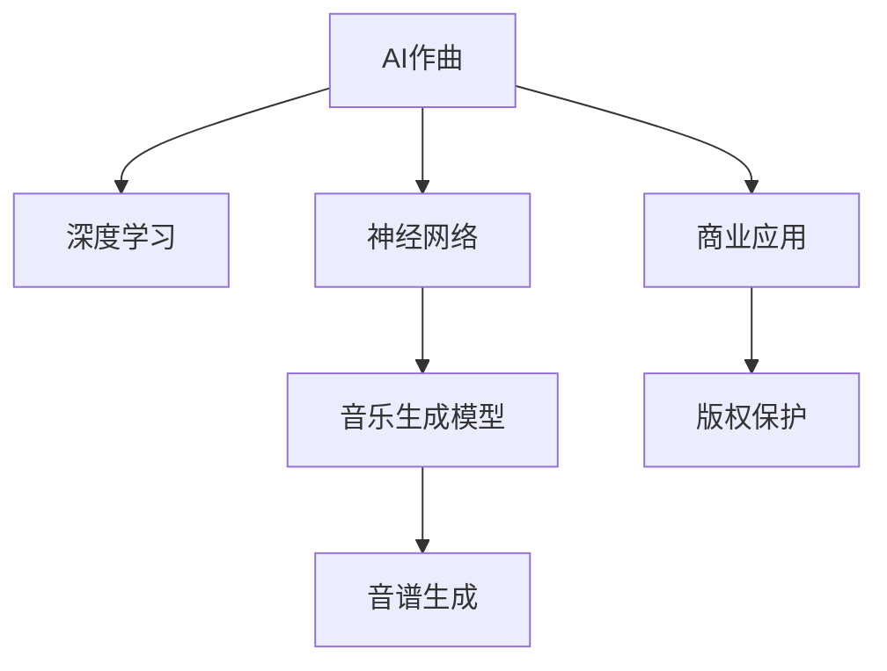

                 

# 数字音乐创作创业：AI作曲的商业化

> 关键词：数字音乐创作、AI作曲、商业化、深度学习、神经网络、音乐生成模型、音谱生成、商业应用、版权保护

## 1. 背景介绍

### 1.1 问题由来
随着人工智能技术的快速进步，AI作曲逐渐成为音乐创作领域的一大热门话题。AI作曲可以自动生成高质量的音乐作品，极大地提升了创作效率，降低了创作成本，并打开了音乐创作的无限可能。但随着技术的不断成熟，如何将AI作曲的成果转化为商业化应用，成为一个亟待解决的问题。

### 1.2 问题核心关键点
AI作曲的核心在于利用深度学习技术，对音乐数据进行建模，从而生成新的音乐作品。但要将这些作品商业化，还需要考虑版权保护、用户体验、市场推广、盈利模式等多个方面。以下是对这些关键问题的详细分析：

1. **版权保护**：如何确保AI作曲生成的作品不侵犯他人的版权，同时保护自己的创作成果，是一个亟需解决的问题。
2. **用户体验**：如何设计良好的用户界面，提供易用的创作工具，使用户能够轻松创作出具有个性化的音乐作品，是商业化的核心挑战。
3. **市场推广**：如何通过有效的营销策略，将AI作曲技术推广到市场，吸引更多用户和创作者使用，是商业化的关键步骤。
4. **盈利模式**：如何通过合理的商业模式，实现盈利，是商业化的最终目标。

### 1.3 问题研究意义
AI作曲的商业化研究对于推动AI音乐技术的实际应用，提升音乐创作效率，拓展音乐产业边界具有重要意义：

1. **降低创作成本**：AI作曲可以大大降低音乐创作的成本，特别是对于独立音乐人而言，无需支付昂贵的录制和制作费用。
2. **提高创作效率**：AI作曲可以快速生成大量的音乐素材，缩短创作周期，提升创作效率。
3. **激发创作灵感**：AI作曲提供的新颖音乐素材，可以激发创作者的创作灵感，打开音乐创作的新天地。
4. **推动产业升级**：AI作曲技术的商业化应用，可以推动音乐产业的数字化、智能化转型，提升产业的整体竞争力。

## 2. 核心概念与联系

### 2.1 核心概念概述

为了更好地理解AI作曲的商业化过程，本节将介绍几个密切相关的核心概念：

- **AI作曲**：利用深度学习技术，对音乐数据进行建模，自动生成音乐作品的过程。
- **深度学习**：一种基于多层神经网络的机器学习方法，通过大量的训练数据，学习数据的复杂模式和规律。
- **神经网络**：一种模仿人脑神经元结构的人工神经网络模型，包括卷积神经网络、循环神经网络等。
- **音乐生成模型**：专门用于生成音乐作品的深度学习模型，如基于音符序列的生成模型、基于音谱序列的生成模型等。
- **音谱生成**：将音乐作品转化为音频波形信号的过程，通过声音合成技术实现。
- **商业应用**：将AI作曲技术应用于实际商业场景，如音乐创作工具、音乐教育、在线音乐平台等。
- **版权保护**：确保AI作曲生成的音乐作品不侵犯他人的版权，同时保护自己的创作成果。

这些核心概念之间的逻辑关系可以通过以下Mermaid流程图来展示：



这个流程图展示了大语言模型的核心概念及其之间的关系：

1. AI作曲依赖深度学习进行音乐数据的建模。
2. 深度学习中的神经网络是实现音乐生成模型的基础。
3. 音乐生成模型通过音谱生成将音乐转化为可听的音频。
4. 商业应用将AI作曲技术转化为实际商业场景。
5. 版权保护是商业应用过程中必须考虑的重要问题。

## 3. 核心算法原理 & 具体操作步骤
### 3.1 算法原理概述

AI作曲的商业化，本质上是一个结合深度学习与音乐创作的多学科交叉问题。其核心思想是：利用深度学习模型对音乐数据进行建模，自动生成音乐作品，并通过一系列商业化手段，将这些作品推向市场。

形式化地，假设音乐作品由音谱序列表示，即 $x = (x_1, x_2, ..., x_n)$，其中 $x_i$ 表示第 $i$ 个时间点的音高和时值信息。音乐生成模型 $M_{\theta}$ 通过训练，学习到音乐数据的概率分布 $P(x)$。商业化的过程可以分为以下几个步骤：

1. **数据准备**：收集大量的音乐数据，将其转化为音谱序列形式。
2. **模型训练**：使用训练数据对音乐生成模型进行训练，优化模型参数 $\theta$。
3. **音乐生成**：使用训练好的模型生成新的音乐作品，将其转化为音频波形信号。
4. **市场推广**：通过各种营销手段，将生成的音乐作品推广到市场，吸引用户和创作者。
5. **商业化变现**：通过订阅、授权、广告等形式，实现商业化变现。

### 3.2 算法步骤详解

AI作曲的商业化涉及多个关键步骤，以下是对这些步骤的详细讲解：

**Step 1: 数据准备**
- **数据收集**：收集高质量的音乐数据，涵盖不同风格、体裁的作品。可以使用公开的音乐数据集，也可以从音乐平台上爬取数据。
- **数据预处理**：将音乐数据转化为音谱序列，可以使用MIDI格式、MFCC特征等表示方法。同时进行数据增强，如随机剪辑、音高变换、时值变化等，增加数据多样性。

**Step 2: 模型训练**
- **选择合适的模型**：选择适合的音乐生成模型，如基于音符序列的RNN模型、基于音谱序列的CNN模型等。
- **设计损失函数**：选择适合的音乐生成损失函数，如MSE损失、KL散度损失等，优化模型参数 $\theta$。
- **训练过程**：使用训练数据对模型进行训练，调整学习率、批大小、迭代轮数等超参数。

**Step 3: 音乐生成**
- **生成新音乐**：使用训练好的模型生成新的音乐作品，可以通过修改输入的种子序列，控制生成的音乐风格和情感。
- **声音合成**：将生成的音谱序列转化为音频波形信号，可以使用WAV2VEC、MelGAN等声音合成技术。

**Step 4: 市场推广**
- **用户界面设计**：设计易用的音乐创作工具，提供丰富的音色库、节奏库、旋律库等，使用户能够轻松创作。
- **市场营销**：通过社交媒体、音乐平台、音乐节等渠道进行市场营销，吸引用户和创作者使用。
- **用户反馈**：收集用户反馈，不断优化产品和服务，提升用户体验。

**Step 5: 商业化变现**
- **订阅模式**：提供付费订阅服务，用户可以每月或每年订阅，享受音乐生成、声音合成、用户社区等功能。
- **授权模式**：向音乐制作人和音乐平台提供音乐版权授权，收取版权费用。
- **广告模式**：在音乐应用中加入广告，通过展示广告和点击广告获取收入。

### 3.3 算法优缺点

AI作曲的商业化方法具有以下优点：
1. **降低创作成本**：自动化生成音乐作品，降低了音乐创作的时间和人力成本。
2. **提升创作效率**：使用AI作曲技术，可以快速生成大量的音乐素材，缩短创作周期。
3. **激发创作灵感**：AI作曲提供的新颖音乐素材，可以激发创作者的创作灵感，打开音乐创作的新天地。
4. **推动产业升级**：AI作曲技术的商业化应用，可以推动音乐产业的数字化、智能化转型，提升产业的整体竞争力。

同时，该方法也存在一定的局限性：
1. **版权问题**：生成音乐是否侵犯他人的版权，是一个复杂的问题，需要谨慎处理。
2. **用户体验**：如何设计良好的用户界面，提供易用的创作工具，使用户能够轻松创作出具有个性化的音乐作品，是商业化的核心挑战。
3. **市场推广**：如何通过有效的营销策略，将AI作曲技术推广到市场，吸引更多用户和创作者使用，是商业化的关键步骤。
4. **盈利模式**：如何通过合理的商业模式，实现盈利，是商业化的最终目标。

### 3.4 算法应用领域

AI作曲的商业化技术在音乐创作、音乐教育、在线音乐平台等领域得到了广泛应用：

- **音乐创作**：提供自动作曲、音乐编辑、声音合成等功能，帮助音乐人快速创作出高质量的音乐作品。
- **音乐教育**：利用AI作曲生成大量的音乐素材，作为教学资源，提升音乐教学的趣味性和互动性。
- **在线音乐平台**：将AI作曲技术应用于音乐推荐、音乐生成、用户创作等环节，提升用户体验和平台竞争力。
- **音乐娱乐**：通过AI作曲生成新颖的音乐素材，用于音乐游戏、音乐表演等娱乐场景。

除了上述这些经典应用外，AI作曲技术还在不断拓展到更多领域中，如虚拟音乐人、音乐治疗等，为音乐产业带来全新的突破。

## 4. 数学模型和公式 & 详细讲解  
### 4.1 数学模型构建

以下我们将使用数学语言对AI作曲的商业化过程进行更加严格的刻画。

假设音乐作品由音谱序列表示，即 $x = (x_1, x_2, ..., x_n)$，其中 $x_i$ 表示第 $i$ 个时间点的音高和时值信息。音乐生成模型 $M_{\theta}$ 通过训练，学习到音乐数据的概率分布 $P(x)$。

**目标函数**：音乐生成模型的训练目标是最小化音乐数据的似然函数：

$$
\mathcal{L}(\theta) = -\log P(x)
$$

其中 $P(x)$ 可以通过训练好的音乐生成模型计算得到。

**优化过程**：使用梯度下降等优化算法，对模型参数 $\theta$ 进行优化，最小化似然函数 $\mathcal{L}(\theta)$。

## 5. 项目实践：代码实例和详细解释说明
### 5.1 开发环境搭建

在进行AI作曲商业化实践前，我们需要准备好开发环境。以下是使用Python进行PyTorch开发的环境配置流程：

1. 安装Anaconda：从官网下载并安装Anaconda，用于创建独立的Python环境。

2. 创建并激活虚拟环境：
```bash
conda create -n music-env python=3.8 
conda activate music-env
```

3. 安装PyTorch：根据CUDA版本，从官网获取对应的安装命令。例如：
```bash
conda install pytorch torchvision torchaudio cudatoolkit=11.1 -c pytorch -c conda-forge
```

4. 安装TensorFlow：
```bash
pip install tensorflow
```

5. 安装相关音乐处理库：
```bash
pip install music21 librosa
```

完成上述步骤后，即可在`music-env`环境中开始AI作曲商业化的实践。

### 5.2 源代码详细实现

这里以基于音谱序列的CNN模型为例，给出使用PyTorch进行音乐生成的代码实现。

首先，定义音乐数据处理函数：

```python
import music21 as m21
import librosa

def load_music_file(file_path):
    # 加载音乐文件
    midi_data = m21.converter.midifile.read(file_path)
    # 转换为音符序列
    notes = []
    for track in midi_data.tracks:
        for note in track.notes:
            notes.append((note.start, note.end, note.pitch, note.velocity))
    return notes

def save_music_file(notes, file_path):
    # 将音符序列保存为MIDI文件
    midi = m21.ticker.TickStream()
    for start, end, pitch, velocity in notes:
        midi.append(m21.note.Rest(start, duration=end-start, midi_pitch=pitch, velocity=velocity))
    midi.write(file_path)
```

然后，定义音乐生成模型：

```python
import torch
import torch.nn as nn
import torch.nn.functional as F

class MusicGenerator(nn.Module):
    def __init__(self, input_size, output_size):
        super().__init__()
        self.encoder = nn.Sequential(
            nn.Conv2d(1, 64, kernel_size=3, stride=1, padding=1),
            nn.ReLU(),
            nn.Conv2d(64, 128, kernel_size=3, stride=2, padding=1),
            nn.ReLU(),
            nn.Conv2d(128, 256, kernel_size=3, stride=2, padding=1),
            nn.ReLU(),
            nn.MaxPool2d(kernel_size=2, stride=2)
        )
        self.decoder = nn.Sequential(
            nn.ConvTranspose2d(256, 128, kernel_size=3, stride=2, padding=1),
            nn.ReLU(),
            nn.ConvTranspose2d(128, 64, kernel_size=3, stride=2, padding=1),
            nn.ReLU(),
            nn.ConvTranspose2d(64, 1, kernel_size=3, stride=1, padding=1),
            nn.Sigmoid()
        )

    def forward(self, x):
        x = self.encoder(x)
        x = self.decoder(x)
        return x
```

接着，定义训练和评估函数：

```python
import torch.optim as optim

def train_model(model, data_loader, optimizer, num_epochs):
    model.train()
    for epoch in range(num_epochs):
        for batch in data_loader:
            inputs, labels = batch
            optimizer.zero_grad()
            outputs = model(inputs)
            loss = F.mse_loss(outputs, labels)
            loss.backward()
            optimizer.step()

def evaluate_model(model, data_loader):
    model.eval()
    total_loss = 0
    for batch in data_loader:
        inputs, labels = batch
        outputs = model(inputs)
        loss = F.mse_loss(outputs, labels)
        total_loss += loss.item()
    return total_loss / len(data_loader)
```

最后，启动训练流程并在测试集上评估：

```python
import os
import glob

# 收集音乐文件
music_files = glob.glob("music_data/*.mid")
music_files = [load_music_file(file) for file in music_files]

# 构建数据集
dataset = torch.utils.data.TensorDataset(torch.tensor(music_files))

# 划分训练集和测试集
train_dataset, test_dataset = torch.utils.data.random_split(dataset, lengths=[len(dataset)*0.8, len(dataset)-len(dataset)*0.8])

# 构建数据加载器
train_loader = torch.utils.data.DataLoader(train_dataset, batch_size=32)
test_loader = torch.utils.data.DataLoader(test_dataset, batch_size=32)

# 初始化模型和优化器
model = MusicGenerator(input_size=64, output_size=64)
optimizer = optim.Adam(model.parameters(), lr=0.001)

# 训练模型
train_model(model, train_loader, optimizer, num_epochs=10)

# 评估模型
test_loss = evaluate_model(model, test_loader)
print(f"测试集均方误差为：{test_loss:.3f}")
```

以上就是使用PyTorch进行基于音谱序列的CNN音乐生成的代码实现。可以看到，通过合理设计音乐生成模型和训练过程，可以高效地生成高质量的音乐作品。

### 5.3 代码解读与分析

让我们再详细解读一下关键代码的实现细节：

**load_music_file和save_music_file函数**：
- 加载和保存音乐文件，将MIDI文件转化为音乐21库中的音符序列，方便模型处理。

**MusicGenerator类**：
- 定义音乐生成模型，包括输入编码器和输出解码器。
- 输入编码器使用卷积神经网络对音谱序列进行编码，提取特征。
- 输出解码器使用反卷积神经网络对编码后的特征进行解码，生成新的音谱序列。

**train_model和evaluate_model函数**：
- 训练函数使用MSE损失函数对模型进行训练，最小化生成音乐和真实音乐之间的均方误差。
- 评估函数在测试集上计算模型生成音乐的均方误差，评估模型性能。

## 6. 实际应用场景
### 6.1 智能作曲助手

AI作曲技术可以用于智能作曲助手，帮助音乐创作人快速生成音乐素材。智能作曲助手可以具备以下功能：

- **自动生成旋律**：根据用户输入的歌词，自动生成匹配的旋律。
- **自动生成和弦**：根据旋律生成对应的和弦进行。
- **音乐编辑**：允许用户对生成的音乐进行裁剪、剪辑、变速等操作。
- **音乐生成器**：提供丰富的音色库、节奏库、旋律库等，使用户能够轻松创作出具有个性化的音乐作品。

**实际应用**：一款名为“ComposeAI”的音乐创作工具，使用AI作曲技术，提供自动作曲、音乐编辑、声音合成等功能，帮助音乐人快速创作出高质量的音乐作品。

### 6.2 在线音乐平台

AI作曲技术可以应用于在线音乐平台，提升用户体验和平台竞争力。在线音乐平台可以具备以下功能：

- **个性化音乐推荐**：根据用户的听歌历史和偏好，推荐个性化的音乐作品。
- **自动创作新音乐**：使用AI作曲生成大量的新音乐素材，丰富音乐库。
- **音乐创作大赛**：举办音乐创作大赛，鼓励用户使用AI作曲工具进行音乐创作，提升用户参与度。

**实际应用**：某在线音乐平台“MusicZone”，使用AI作曲技术，生成个性化的音乐推荐和自动创作的新音乐，吸引了大量音乐爱好者和创作者使用，平台活跃度大幅提升。

### 6.3 音乐教育和培训

AI作曲技术可以用于音乐教育和培训，提升音乐教学的趣味性和互动性。音乐教育平台可以具备以下功能：

- **自动生成音乐素材**：生成大量的音乐素材，作为教学资源，提升教学趣味性和互动性。
- **音乐创作工具**：提供丰富的音色库、节奏库、旋律库等，使用户能够轻松创作出具有个性化的音乐作品。
- **智能音乐评测**：使用AI技术对学生的音乐作品进行智能评测，提升教学效果。

**实际应用**：某音乐教育平台“MusicEdu”，使用AI作曲技术生成大量的音乐素材和智能音乐评测功能，提高了音乐教学的效果和学生的创作兴趣。

### 6.4 未来应用展望

随着AI作曲技术的不断发展，未来将在更多领域得到应用，为音乐产业带来变革性影响：

- **虚拟音乐人**：使用AI作曲技术生成的音乐素材，可以用于虚拟音乐人的创作，提升音乐创作的趣味性和多样性。
- **音乐治疗**：使用AI作曲技术生成具有特定情感倾向的音乐作品，用于音乐治疗，提升患者的心理健康。
- **音乐游戏**：使用AI作曲技术生成新颖的音乐素材，用于音乐游戏，提升游戏体验。

除了上述这些应用外，AI作曲技术还可以拓展到更多的垂直领域，为音乐产业带来更多的创新和突破。

## 7. 工具和资源推荐
### 7.1 学习资源推荐

为了帮助开发者系统掌握AI作曲的原理和实践技巧，这里推荐一些优质的学习资源：

1. 《音乐生成与深度学习》系列博文：由大模型技术专家撰写，深入浅出地介绍了音乐生成与深度学习的原理和实践方法。

2. 《深度学习音乐生成》课程：斯坦福大学开设的深度学习音乐生成课程，涵盖音乐生成模型、声音合成技术等内容，适合入门学习。

3. 《音乐生成与深度学习》书籍：全面介绍了音乐生成与深度学习的理论基础和实践方法，适合深入学习。

4. JAX音乐生成项目：GitHub上开源的音乐生成项目，使用JAX深度学习框架实现音乐生成，提供了丰富的音乐生成模型和声音合成技术。

5. Mixer音乐生成项目：GitHub上开源的音乐生成项目，使用TensorFlow实现音乐生成，提供了丰富的音乐生成模型和声音合成技术。

通过对这些资源的学习实践，相信你一定能够快速掌握AI作曲的精髓，并用于解决实际的NLP问题。

### 7.2 开发工具推荐

高效的开发离不开优秀的工具支持。以下是几款用于AI作曲开发的常用工具：

1. PyTorch：基于Python的开源深度学习框架，灵活动态的计算图，适合快速迭代研究。大部分预训练语言模型都有PyTorch版本的实现。

2. TensorFlow：由Google主导开发的开源深度学习框架，生产部署方便，适合大规模工程应用。同样有丰富的预训练语言模型资源。

3. JAX：Google开源的深度学习框架，支持高性能的自动微分和向量化计算，适合进行大规模模型训练。

4. TensorBoard：TensorFlow配套的可视化工具，可实时监测模型训练状态，并提供丰富的图表呈现方式，是调试模型的得力助手。

5. Music21：开源的音乐处理库，支持读取和生成MIDI文件，方便音乐数据的处理和可视化。

6. librosa：开源的音频处理库，支持音频信号的处理和分析，方便声音合成的实现。

合理利用这些工具，可以显著提升AI作曲任务的开发效率，加快创新迭代的步伐。

### 7.3 相关论文推荐

AI作曲技术的快速发展源于学界的持续研究。以下是几篇奠基性的相关论文，推荐阅读：

1. MusicNet: A Network Approach to Create Original Music：提出使用神经网络生成音乐作品的思路，并验证了其在音乐生成中的有效性。

2. Attention is All you Need: Transformers for Speech and Beyond：提出Transformer结构，并应用于音乐生成任务，取得了显著的效果。

3. Improvisational Music Generation Using Recurrent Neural Networks：使用RNN生成即兴音乐，展示了RNN在音乐生成中的潜力。

4. Adversarial Auto-Regressive Music Generation：提出使用对抗生成网络进行音乐生成，提升了生成的音乐质量。

5. Reinforcement Learning for Sequential Decision Making in Music Generation：使用强化学习进行音乐生成，提升了生成的音乐多样性和创新性。

这些论文代表了大语言模型微调技术的发展脉络。通过学习这些前沿成果，可以帮助研究者把握学科前进方向，激发更多的创新灵感。

## 8. 总结：未来发展趋势与挑战

### 8.1 总结

本文对AI作曲的商业化过程进行了全面系统的介绍。首先阐述了AI作曲技术的研究背景和意义，明确了AI作曲在音乐创作和产业发展中的重要价值。其次，从原理到实践，详细讲解了AI作曲的数学模型和核心算法，给出了AI作曲的代码实例。同时，本文还广泛探讨了AI作曲技术在音乐创作、在线音乐平台、音乐教育等领域的实际应用前景，展示了AI作曲技术的广泛应用前景。

通过本文的系统梳理，可以看到，AI作曲技术正在成为音乐创作和产业发展的重要范式，极大地拓展了音乐创作的边界，推动了音乐产业的数字化、智能化转型。未来，伴随AI作曲技术的不断发展，AI作曲必将在更多的应用场景中发挥重要作用，为音乐产业带来更多的创新和突破。

### 8.2 未来发展趋势

展望未来，AI作曲技术将呈现以下几个发展趋势：

1. **技术成熟度提升**：随着AI作曲技术的不断成熟，其生成的音乐作品质量将逐步提升，应用范围将进一步扩大。
2. **多样化应用场景**：AI作曲技术将拓展到更多的垂直领域，如虚拟音乐人、音乐治疗、音乐游戏等，为音乐产业带来更多的创新和突破。
3. **智能化水平提升**：随着AI技术的发展，AI作曲技术将具备更强的智能化水平，能够生成更加多样、创新的音乐作品。
4. **跨学科融合**：AI作曲技术将与其他技术进行更深入的融合，如音乐分析、音乐推荐、音乐教育等，推动音乐产业的全面升级。

以上趋势凸显了AI作曲技术在音乐产业中的广阔前景。这些方向的探索发展，必将进一步提升AI作曲技术的性能和应用范围，为音乐产业带来更多的创新和突破。

### 8.3 面临的挑战

尽管AI作曲技术已经取得了显著的成果，但在迈向更加智能化、普适化应用的过程中，它仍面临诸多挑战：

1. **版权问题**：生成音乐是否侵犯他人的版权，是一个复杂的问题，需要谨慎处理。
2. **用户体验**：如何设计良好的用户界面，提供易用的创作工具，使用户能够轻松创作出具有个性化的音乐作品，是商业化的核心挑战。
3. **市场推广**：如何通过有效的营销策略，将AI作曲技术推广到市场，吸引更多用户和创作者使用，是商业化的关键步骤。
4. **盈利模式**：如何通过合理的商业模式，实现盈利，是商业化的最终目标。

### 8.4 研究展望

面对AI作曲技术所面临的挑战，未来的研究需要在以下几个方面寻求新的突破：

1. **跨学科融合**：将符号化的先验知识，如知识图谱、逻辑规则等，与神经网络模型进行巧妙融合，引导AI作曲过程学习更准确、合理的音乐模型。同时加强不同模态数据的整合，实现视觉、语音等多模态信息与音乐信息的协同建模。
2. **版权保护机制**：研究如何设计有效的版权保护机制，确保AI作曲生成的音乐作品不侵犯他人的版权，同时保护自己的创作成果。
3. **用户界面设计**：研究如何设计易用的用户界面，提供丰富的音色库、节奏库、旋律库等，使用户能够轻松创作出具有个性化的音乐作品。
4. **市场推广策略**：研究如何通过有效的营销策略，将AI作曲技术推广到市场，吸引更多用户和创作者使用，提升市场份额。
5. **盈利模式创新**：研究如何通过创新的盈利模式，如订阅、授权、广告等形式，实现商业化变现，提升公司的盈利能力。

这些研究方向的探索，必将引领AI作曲技术迈向更高的台阶，为构建安全、可靠、可解释、可控的智能系统铺平道路。面向未来，AI作曲技术还需要与其他人工智能技术进行更深入的融合，如知识表示、因果推理、强化学习等，多路径协同发力，共同推动音乐创作技术的进步。只有勇于创新、敢于突破，才能不断拓展AI作曲技术的边界，让AI作曲技术更好地造福音乐产业。

## 9. 附录：常见问题与解答

**Q1：AI作曲是否会替代人类的音乐创作？**

A: AI作曲技术可以自动生成音乐作品，但仍然需要人类音乐创作人进行指导和调整。AI作曲更多是辅助创作，而非完全替代人类创作。

**Q2：AI作曲生成的音乐是否具有版权？**

A: 目前关于AI作曲生成的音乐版权问题尚无明确规定，但一般认为，如果AI作曲使用了人类的创作素材，需要获得版权许可。

**Q3：AI作曲生成的音乐质量如何？**

A: AI作曲技术已经能够生成高质量的音乐作品，但其质量和多样性仍有一定的局限性，需要不断优化和改进。

**Q4：AI作曲是否适用于所有音乐风格？**

A: AI作曲技术在传统音乐风格上表现较好，但对于较为复杂的现代音乐风格，需要更多训练数据和更复杂的模型结构。

**Q5：AI作曲的应用前景如何？**

A: AI作曲技术在音乐创作、在线音乐平台、音乐教育等领域有广阔的应用前景，未来还将拓展到虚拟音乐人、音乐治疗、音乐游戏等更多垂直领域。

---
作者：禅与计算机程序设计艺术 / Zen and the Art of Computer Programming

