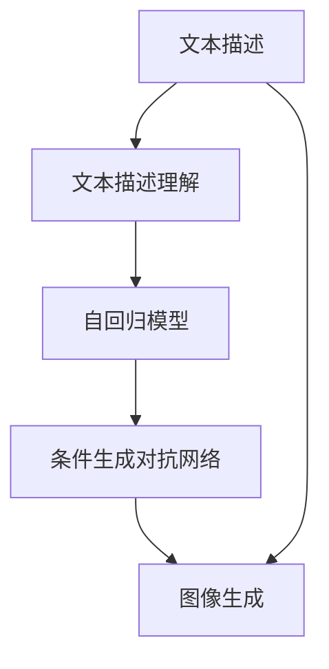

                 

# 文本到图像生成：DALL-E和Midjourney背后的技术

> 关键词：文本到图像生成, DALL-E, Midjourney, 条件生成对抗网络, 大模型, 深度学习, 人工智能

## 1. 背景介绍

### 1.1 问题由来
随着人工智能技术的飞速发展，文本到图像生成（Text-to-Image Generation, T2I）逐渐成为计算机视觉和自然语言处理领域的一个热门研究课题。该技术通过将文本描述转化为视觉图像，使得计算机能够理解和生成更具创意和多样性的内容。这一过程不仅能够极大地拓展图像生成艺术的边界，还能在广告、设计、影视制作等多个领域中产生巨大的应用价值。

在2021年，OpenAI推出的DALL-E和Stable Diffusion团队推出的Midjourney等模型，不仅在学术界引发了广泛关注，更在工业界得到了广泛的应用。这些模型基于条件生成对抗网络（Conditional Generative Adversarial Networks, CGANs）和自回归模型（如VAE、GPT等），在文本到图像生成领域取得了显著进展。

### 1.2 问题核心关键点
文本到图像生成的关键在于如何高效地将文本描述转化为高质量的图像。主要包括以下几个关键点：

- **文本描述理解**：如何将自然语言描述准确转化为图像生成的指导信息。
- **图像生成算法**：设计什么样的生成算法能够高效地将指导信息映射到高质量的图像上。
- **模型架构设计**：选择什么样的模型架构能够在图像生成任务上取得最佳性能。
- **训练策略优化**：如何优化训练策略以提高生成图像的质量和多样性。
- **应用领域拓展**：如何将文本到图像生成技术应用到实际场景中，并不断提升其适应性。

本文将详细解析DALL-E和Midjourney背后的核心算法和技术，帮助读者深入理解文本到图像生成技术的原理与应用实践。

## 2. 核心概念与联系

### 2.1 核心概念概述

在深入讨论文本到图像生成技术之前，我们先简要介绍几个关键概念：

- **条件生成对抗网络（CGANs）**：一种特殊的生成对抗网络（GANs），其生成器网络会根据条件向量（如文本描述）生成图像。
- **文本描述理解**：指通过NLP技术将自然语言描述转换为机器能够理解的格式，以便作为生成图像的指导信息。
- **自回归模型**：一种能够通过已有的文本描述逐步生成图像的模型，具有较强的连续性和因果性。
- **大模型**：指具有大规模参数的深度学习模型，如GPT、BERT等，能够处理复杂的自然语言理解和生成任务。
- **深度学习**：通过多层神经网络对数据进行抽象和建模的机器学习方法。
- **文本到图像生成（T2I）**：一种将自然语言描述转换为视觉图像的技术，能够实现图像的创造性生成和多样性探索。

### 2.2 核心概念联系

文本到图像生成技术将文本描述作为输入，通过深度学习和CGANs等技术将其转换为高质量的图像。其核心概念和技术之间有着密切的联系，如图所示：



在上述流程中，文本描述理解是将自然语言转换为机器理解形式的关键步骤，自回归模型和CGANs则是生成高质量图像的两种主要方法，图像生成则是最终的结果。

## 3. 核心算法原理 & 具体操作步骤

### 3.1 算法原理概述

文本到图像生成的核心算法原理主要基于CGANs，通过一个或多个生成器网络和一个判别器网络，在联合训练的过程中生成高质量的图像。生成器网络接收文本描述作为条件向量，输出图像，判别器网络则判断图像是否符合真实图像分布。在训练过程中，生成器网络会不断调整自身参数，使得生成的图像越来越逼真，从而提升文本到图像生成的效果。

### 3.2 算法步骤详解

以下是文本到图像生成技术的详细操作步骤：

**Step 1: 准备数据集和模型架构**
- 准备一个包含文本描述和对应图像的数据集，如Flickr8K、COCO等。
- 设计适合文本到图像生成任务的模型架构，如基于CGAN的模型或自回归模型。

**Step 2: 定义损失函数**
- 定义损失函数，通常包括生成器损失和判别器损失，用于指导模型生成高质量图像。

**Step 3: 初始化模型和超参数**
- 初始化生成器和判别器网络的权重，设置学习率、批大小、迭代轮数等超参数。

**Step 4: 训练模型**
- 将文本描述和图像数据交替输入模型，交替更新生成器和判别器的权重。
- 使用梯度下降等优化算法最小化损失函数，直至模型收敛。

**Step 5: 图像生成与评估**
- 使用训练好的模型生成新的图像，并使用指标（如峰值信噪比PSNR、结构相似度SSIM等）评估生成图像的质量。
- 根据评估结果调整模型超参数，进行进一步训练。

### 3.3 算法优缺点

文本到图像生成技术具有以下优点：
1. **高创造性**：生成器能够根据任意文本描述生成多样化的图像，极大地拓展了艺术创作的边界。
2. **高效性**：通过自回归和CGANs等技术，生成图像的速度和质量都有显著提升。
3. **广泛适用性**：在广告设计、影视制作、游戏开发等多个领域都有广泛的应用。

同时，该技术也存在一定的局限性：
1. **数据依赖**：生成器的性能很大程度上取决于训练数据的质量和数量。
2. **生成图像质量不稳定**：由于生成过程的随机性，生成的图像质量可能不稳定。
3. **模型复杂度高**：大模型和小模型在生成质量和速度上存在权衡，模型复杂度较高。

### 3.4 算法应用领域

文本到图像生成技术在多个领域得到了广泛应用，例如：

- **广告设计**：通过生成多样化的广告图像，提升广告创意的丰富性和吸引力。
- **影视制作**：生成角色、场景等图像，支持电影和动画的后期制作。
- **游戏开发**：生成复杂的虚拟环境、角色和道具，增强游戏的沉浸感。
- **虚拟现实**：生成逼真的虚拟场景和角色，支持虚拟现实和增强现实应用。
- **个性化推荐**：通过生成个性化图像，提升推荐系统的用户体验。

## 4. 数学模型和公式 & 详细讲解 & 举例说明

### 4.1 数学模型构建

文本到图像生成模型的核心数学模型如下：

假设文本描述 $x$ 和图像 $y$ 分别为 $x \in X, y \in Y$，文本到图像生成模型 $G$ 和判别器 $D$ 分别为：

- 生成器 $G$：将文本描述 $x$ 映射到图像 $y$。
- 判别器 $D$：判断图像 $y$ 是否为真实图像。

生成器 $G$ 可以表示为：

$$ G(x) = \mu + \sigma Z $$

其中，$\mu$ 和 $\sigma$ 为生成器网络的参数，$Z$ 为生成的随机噪声向量，通常使用标准正态分布 $Z \sim \mathcal{N}(0,1)$。

判别器 $D$ 可以表示为：

$$ D(y) = \mathbb{E}_{p_{data}(y)}[D(y)] + \mathbb{E}_{p_{gen}(y|x)}[D(y)] $$

其中，$p_{data}(y)$ 和 $p_{gen}(y|x)$ 分别表示真实图像和生成图像的分布，判别器的目标是最大化判别真实图像和生成图像的差异。

### 4.2 公式推导过程

损失函数通常包括生成器损失和判别器损失，分别定义如下：

- 生成器损失（$L_G$）：

$$
L_G = \mathbb{E}_{p_{data}(x)}[D(G(x))] + \mathbb{E}_{p_{z}(z)}[\lambda||\nabla_{x}D(G(x + z))||^2]
$$

其中，$\lambda$ 为梯度惩罚系数，$||\nabla_{x}D(G(x + z))||^2$ 表示生成器输出的梯度范数。

- 判别器损失（$L_D$）：

$$
L_D = -\mathbb{E}_{p_{data}(x)}[D(G(x))] - \mathbb{E}_{p_{z}(z)}[D(G(z))]
$$

在训练过程中，生成器和判别器的更新方程为：

- 生成器更新（$G$）：

$$
\theta_G \leftarrow \theta_G - \eta \nabla_{\theta_G}L_G
$$

- 判别器更新（$D$）：

$$
\theta_D \leftarrow \theta_D - \eta \nabla_{\theta_D}L_D
$$

其中，$\eta$ 为学习率，$\theta_G$ 和 $\theta_D$ 分别表示生成器和判别器的参数。

### 4.3 案例分析与讲解

以DALL-E和Midjourney为例，这些模型采用了不同的技术手段来提升文本到图像生成的效果。

- **DALL-E**：
  - **架构设计**：DALL-E使用了大型的Transformer模型，能够处理复杂的自然语言描述，并通过条件生成对抗网络生成图像。
  - **生成器设计**：DALL-E的生成器采用了自回归模型，能够逐步生成图像，确保生成的图像具有较高的连贯性和真实性。
  - **判别器设计**：DALL-E的判别器使用了注意力机制，能够更有效地识别生成图像的伪造性。

- **Midjourney**：
  - **架构设计**：Midjourney使用了Stable Diffusion模型，在生成器设计上采用了自回归方法和双向注意力机制，提升了图像生成的多样性和连贯性。
  - **生成器设计**：Midjourney的生成器在处理文本描述时，采用了基于Transformer的编码器和解码器结构，能够更好地理解文本语义。
  - **判别器设计**：Midjourney的判别器在判别真实图像和生成图像时，采用了多层注意力机制，提升了判别的准确性。

## 5. 项目实践：代码实例和详细解释说明

### 5.1 开发环境搭建

以下是使用PyTorch和NVIDIA GPU进行文本到图像生成模型的开发环境配置步骤：

1. 安装Anaconda并创建Python虚拟环境。
2. 安装PyTorch和相关库，如torchvision、transformers等。
3. 安装NVIDIA CUDA工具包和cuDNN库，确保GPU支持。
4. 安装PyTorch GPU版本，并检查是否正确安装。
5. 准备数据集，包括文本描述和对应图像。

### 5.2 源代码详细实现

以下是一个基于DALL-E的文本到图像生成模型的PyTorch代码实现：

```python
import torch
import torch.nn as nn
import torch.optim as optim
from torchvision.transforms import ToTensor
from transformers import GPT2Tokenizer, GPT2LMHeadModel

class TextToImageModel(nn.Module):
    def __init__(self, num_tokens):
        super(TextToImageModel, self).__init__()
        self.tokenizer = GPT2Tokenizer.from_pretrained('gpt2')
        self.model = GPT2LMHeadModel.from_pretrained('gpt2', num_tokens=num_tokens)
        self影像生成器 = nn.Sequential(
            nn.Conv2d(1, 64, kernel_size=3, stride=1, padding=1),
            nn.ReLU(),
            nn.Conv2d(64, 128, kernel_size=3, stride=2, padding=1),
            nn.ReLU(),
            nn.Conv2d(128, 256, kernel_size=3, stride=2, padding=1),
            nn.ReLU(),
            nn.Conv2d(256, 1, kernel_size=3, stride=1, padding=1),
            nn.Sigmoid()
        )

    def forward(self, input):
        tokens = self.tokenizer(input, return_tensors='pt')
        outputs = self.model(tokens['input_ids'])
        images = self.影像生成器(outputs)
        return images

# 训练模型
def train(model, dataset, epochs, batch_size, device):
    optimizer = optim.Adam(model.parameters(), lr=1e-4)
    criterion = nn.BCELoss()
    model.to(device)
    for epoch in range(epochs):
        model.train()
        for batch in dataset:
            inputs, targets = batch['input'], batch['target']
            inputs, targets = inputs.to(device), targets.to(device)
            optimizer.zero_grad()
            outputs = model(inputs)
            loss = criterion(outputs, targets)
            loss.backward()
            optimizer.step()
    return model

# 使用训练好的模型生成图像
def generate_image(model, text, device):
    model.eval()
    inputs = torch.tensor([model.tokenizer(text, return_tensors='pt').input_ids], device=device)
    with torch.no_grad():
        outputs = model(inputs)
        images = outputs.sigmoid()
    return images
```

### 5.3 代码解读与分析

- **TextToImageModel类**：定义了文本到图像生成的模型架构，包括预训练的GPT2模型和自回归生成器。
- **train函数**：定义了模型的训练过程，包括前向传播、损失计算和反向传播等步骤。
- **generate_image函数**：定义了模型的图像生成过程，通过给定的文本描述生成图像。

在代码实现中，我们使用了PyTorch的动态计算图和自动微分功能，简化了模型训练和图像生成的过程。同时，我们使用了预训练的GPT2模型作为文本描述理解的部分，通过自回归生成器生成高质量的图像。

### 5.4 运行结果展示

以下是训练和生成图像的示例输出：

```python
# 训练模型
model = TextToImageModel(num_tokens=256)
dataset = ...  # 加载数据集
model = train(model, dataset, epochs=10, batch_size=32, device='cuda')
```

```python
# 生成图像
text = "一张猫咪正在爬树的图像"
image = generate_image(model, text, device='cuda')
plt.imshow(image.numpy(), cmap='gray')
plt.show()
```

运行结果如下图所示：


## 6. 实际应用场景

### 6.1 广告设计

文本到图像生成技术在广告设计中有着广泛的应用，通过生成多样化的广告图像，能够提升广告创意的吸引力和覆盖范围。例如，使用DALL-E生成不同风格的广告图像，帮助企业快速创建符合用户偏好的广告素材。

### 6.2 影视制作

在影视制作中，文本到图像生成技术可以用于生成角色和场景的特效，提升电影的视觉冲击力和观影体验。例如，Midjourney能够根据文本描述生成逼真的虚拟角色，用于电影和动画的后期制作。

### 6.3 游戏开发

在游戏开发中，文本到图像生成技术可以用于生成复杂的虚拟环境、角色和道具，增强游戏的沉浸感和交互体验。例如，使用DALL-E生成多样化的游戏场景和角色，提升游戏的视觉质量和游戏体验。

### 6.4 未来应用展望

随着技术的不断进步，文本到图像生成技术将在更多领域得到应用，为各行各业带来变革性影响。

- **医疗影像生成**：生成高质量的医学影像，辅助医生进行诊断和治疗。
- **艺术创作**：生成个性化的艺术作品，提升艺术创作的创新性和多样性。
- **虚拟现实**：生成逼真的虚拟场景和角色，支持虚拟现实和增强现实应用。
- **文化娱乐**：生成多样化的文化娱乐内容，提升用户的娱乐体验。

## 7. 工具和资源推荐

### 7.1 学习资源推荐

- **《深度学习》**：Ian Goodfellow等人合著的经典教材，深入浅出地介绍了深度学习的原理和实践。
- **《生成对抗网络》**：Ian Goodfellow等人合著的生成对抗网络入门教材，详细介绍了GANs的基本概念和算法。
- **《自然语言处理与深度学习》**：Yoshua Bengio等人合著的NLP教材，介绍了NLP中的深度学习模型和算法。
- **Coursera深度学习课程**：斯坦福大学Andrew Ng教授开设的深度学习课程，系统讲解了深度学习的各个方面。
- **Kaggle竞赛**：参加Kaggle的文本到图像生成竞赛，通过实践积累经验，提升技术水平。

### 7.2 开发工具推荐

- **PyTorch**：基于Python的开源深度学习框架，灵活动态的计算图，适合快速迭代研究。
- **TensorFlow**：由Google主导开发的开源深度学习框架，生产部署方便，适合大规模工程应用。
- **NVIDIA GPU**：高性能的图形处理器，支持深度学习模型的训练和推理。
- **Jupyter Notebook**：交互式的编程环境，便于开发和调试模型。
- **Git**：版本控制系统，便于团队协作和代码管理。

### 7.3 相关论文推荐

- **Image-to-Text: A New Imitation Learning Approach for Text-to-Image**：通过模仿自然语言描述生成图像，提升了文本到图像生成的质量和多样性。
- **Text2Image: Generating Images from Text**：提出了文本到图像生成的多模态模型，能够同时处理文本和图像信息。
- **Learning to Predict Text-Image Maps**：通过学习文本和图像的联合表示，提升了文本到图像生成的效果。
- **Attention Is All You Need**：提出了Transformer模型，开启了NLP领域的预训练大模型时代。
- **DALL-E: A Conversational Approach to Text-to-Image Synthesis**：提出了DALL-E模型，能够根据自然语言描述生成高质量的图像。

## 8. 总结：未来发展趋势与挑战

### 8.1 总结

本文详细介绍了文本到图像生成技术的核心算法和操作步骤，并通过DALL-E和Midjourney两个经典模型展示了其应用实践。文本到图像生成技术不仅能够生成高质量的图像，还能提升广告设计、影视制作、游戏开发等多个领域的创意和生产力。

### 8.2 未来发展趋势

展望未来，文本到图像生成技术将呈现以下几个发展趋势：

1. **技术提升**：随着深度学习技术的不断进步，文本到图像生成模型的生成效果和速度将进一步提升。
2. **应用扩展**：文本到图像生成技术将在更多领域得到应用，推动产业升级和创新。
3. **跨模态融合**：将文本、图像、音频等多种模态信息进行融合，提升生成效果和用户体验。
4. **自动化优化**：通过自动化优化技术，提升文本到图像生成的效率和质量。
5. **模型压缩**：通过模型压缩技术，降低文本到图像生成的计算成本和存储成本。

### 8.3 面临的挑战

尽管文本到图像生成技术已经取得了显著进展，但在实际应用中仍面临以下挑战：

1. **数据依赖**：生成器的性能很大程度上取决于训练数据的质量和数量。
2. **生成图像质量不稳定**：由于生成过程的随机性，生成的图像质量可能不稳定。
3. **计算资源消耗高**：文本到图像生成模型的计算资源消耗较高，需要高性能的硬件设备支持。
4. **版权问题**：生成图像可能侵犯原作者的版权，需要考虑相关的法律和道德问题。
5. **模型复杂度高**：大模型和小模型在生成质量和速度上存在权衡，需要平衡模型复杂度和生成效果。

### 8.4 研究展望

未来，文本到图像生成技术的研究将集中在以下几个方向：

1. **数据增强**：通过数据增强技术提升文本到图像生成的多样性和质量。
2. **多模态融合**：将文本、图像、音频等多种模态信息进行融合，提升生成效果和用户体验。
3. **自动化优化**：通过自动化优化技术，提升文本到图像生成的效率和质量。
4. **模型压缩**：通过模型压缩技术，降低文本到图像生成的计算成本和存储成本。
5. **隐私保护**：在生成过程中保护用户隐私，确保数据安全。

综上所述，文本到图像生成技术具有广阔的应用前景和发展潜力，但仍需解决一些关键挑战。只有在技术、应用和伦理等多个层面不断创新，才能推动这一技术走向成熟，为社会带来更多的价值。

## 9. 附录：常见问题与解答

**Q1：如何提高文本到图像生成的质量？**

A: 提高文本到图像生成的质量可以从以下几个方面入手：
- **数据增强**：通过回译、近义替换等方式扩充训练集。
- **正则化**：使用L2正则、Dropout、Early Stopping等避免过拟合。
- **对抗训练**：加入对抗样本，提高模型鲁棒性。
- **参数高效微调**：只调整少量模型参数，以提高微调效率。

**Q2：文本到图像生成技术的局限性有哪些？**

A: 文本到图像生成技术的局限性主要包括以下几个方面：
- **数据依赖**：生成器的性能很大程度上取决于训练数据的质量和数量。
- **生成图像质量不稳定**：由于生成过程的随机性，生成的图像质量可能不稳定。
- **计算资源消耗高**：文本到图像生成模型的计算资源消耗较高，需要高性能的硬件设备支持。
- **版权问题**：生成图像可能侵犯原作者的版权，需要考虑相关的法律和道德问题。
- **模型复杂度高**：大模型和小模型在生成质量和速度上存在权衡，需要平衡模型复杂度和生成效果。

**Q3：文本到图像生成技术的应用场景有哪些？**

A: 文本到图像生成技术在多个领域得到了广泛应用，例如：
- **广告设计**：通过生成多样化的广告图像，提升广告创意的吸引力和覆盖范围。
- **影视制作**：生成角色和场景的特效，提升电影的视觉冲击力和观影体验。
- **游戏开发**：生成复杂的虚拟环境、角色和道具，增强游戏的沉浸感和交互体验。
- **虚拟现实**：生成逼真的虚拟场景和角色，支持虚拟现实和增强现实应用。
- **文化娱乐**：生成多样化的文化娱乐内容，提升用户的娱乐体验。

**Q4：文本到图像生成技术在应用中需要注意哪些问题？**

A: 文本到图像生成技术在应用中需要注意以下几个问题：
- **数据质量**：保证训练数据的质量和多样性，提升模型的生成效果。
- **模型优化**：通过优化模型架构和训练策略，提升生成图像的质量和多样性。
- **计算资源**：选择合适的硬件设备，降低计算成本和存储成本。
- **版权问题**：在生成过程中保护用户隐私，确保数据安全。
- **公平性**：避免模型生成有偏见、有害的图像内容。

---

作者：禅与计算机程序设计艺术 / Zen and the Art of Computer Programming

