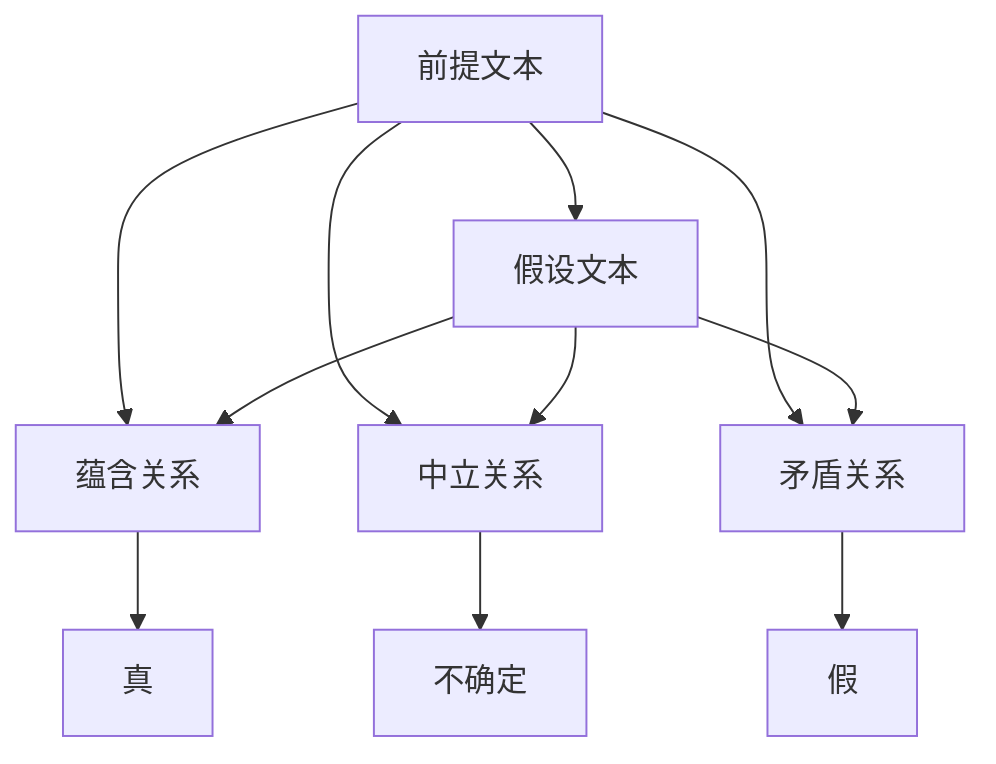
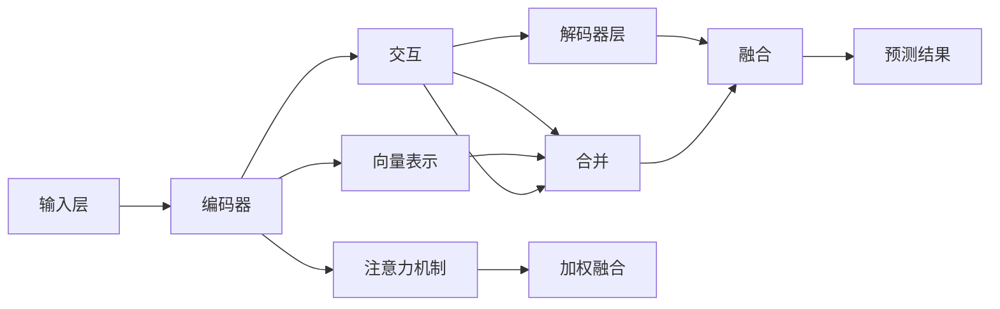

                 

## 1. 背景介绍

文本蕴含（Textual Entailment, TE）是自然语言处理（Natural Language Processing, NLP）中的一项重要任务，旨在判断给定的前提文本和假设文本之间是否存在蕴含关系。蕴含关系通常表示为：若前提为真，则假设必定为真。文本蕴含在问答系统、信息检索、自然语言推理、法律文本分析等领域都有广泛应用，是自然语言理解的重要基础。

文本蕴含的任务可以追溯到1960年代，最初的研究集中于逻辑推理和语言学的理论分析。近年来，随着深度学习在NLP领域的崛起，基于神经网络的模型在文本蕴含任务上取得了突破性进展。这些模型通过自监督预训练和微调，能够在无监督条件下学习到丰富的语言表示，并有效地应用于文本蕴含判断。

文本蕴含与语义相似度计算是密切相关的两个任务。语义相似度计算旨在度量两个句子之间的语义相似程度，而文本蕴含可以理解为一种特殊的语义相似关系，其中前提文本在语义上完全蕴含假设文本。因此，文本蕴含的任务可以被看作是语义相似度计算的一种特殊形式。

本文将对文本蕴含和语义相似度计算进行全面系统的介绍，从理论基础到实践应用，涵盖核心概念、算法原理、数学模型、代码实例等多个方面，旨在帮助读者深入理解这些技术，并探索其未来发展方向。

## 2. 核心概念与联系

### 2.1 核心概念概述

文本蕴含和语义相似度计算涉及多个关键概念：

- **前提文本（Premise）**：待验证的句子或段落，用于判断假设文本是否蕴含在其中。
- **假设文本（Hypothesis）**：与前提文本相关联的另一个句子或段落，用于验证其是否由前提蕴含。
- **蕴含关系（Entailment）**：若前提为真，则假设也必定为真的关系。
- **中立关系（Neutral）**：前提和假设之间既不蕴含也不矛盾。
- **矛盾关系（Contradiction）**：前提为真时，假设必定为假。
- **语义相似度（Semantic Similarity）**：度量两个句子之间在语义上的接近程度，范围在0到1之间。

这些概念之间的关系可以通过以下Mermaid流程图表示：



这个流程图展示了前提文本和假设文本之间的三种可能关系：蕴含、中立和矛盾。每种关系都对应一个特定的输出结果。

### 2.2 核心概念原理和架构的 Mermaid 流程图



这个流程图描述了使用Transformer架构的文本蕴含任务的处理流程。输入文本经过编码器层得到向量表示，通过注意力机制和交互层实现上下文信息整合，然后解码器层进行推理输出预测结果。

## 3. 核心算法原理 & 具体操作步骤

### 3.1 算法原理概述

文本蕴含的算法原理主要基于深度学习中的序列到序列（Sequence-to-Sequence, Seq2Seq）框架，通过编码器-解码器（Encoder-Decoder）结构，将前提文本和假设文本映射到向量空间，并计算它们之间的语义距离。常用的模型包括基于RNN的Seq2Seq模型和基于Transformer的Seq2Seq模型。

Transformer模型在文本蕴含任务中表现优异，因为它能够更好地捕捉长距离依赖关系，并具有较好的并行计算能力。在Transformer中，输入序列被分为多个编码器层和解码器层，每个层都包括多头注意力机制和残差连接。这些机制使得模型能够有效地处理不同长度的输入序列，并捕捉序列中重要的上下文信息。

### 3.2 算法步骤详解

文本蕴含的算法步骤如下：

**Step 1: 数据准备**

首先需要准备一对前提和假设文本，并进行必要的预处理，如分词、去除停用词等。对于不平衡的数据集，需要进行采样平衡处理。

**Step 2: 构建模型**

使用Transformer架构构建文本蕴含模型。将编码器层和解码器层的输出通过一个全连接层进行融合，得到最终的预测结果。

**Step 3: 设置超参数**

选择合适的优化器、学习率、批大小、迭代轮数等超参数，并设置正则化技术如Dropout、L2正则等。

**Step 4: 训练模型**

在准备好的数据集上进行模型训练。在每个epoch内，前向传播计算损失函数，反向传播更新模型参数，并在验证集上评估模型性能。

**Step 5: 评估模型**

在测试集上评估模型性能，通常使用精确率-召回率曲线（Precision-Recall Curve）和F1分数等指标进行评估。

**Step 6: 应用模型**

将训练好的模型应用于新的前提和假设文本对，输出预测结果。

### 3.3 算法优缺点

**优点**

- 基于Transformer架构的模型具有较好的并行计算能力和长距离依赖关系捕捉能力。
- 能够适应不同长度的输入序列，处理长文本的效果更好。
- 模型的泛化能力较强，适用于多种文本蕴含任务。

**缺点**

- 模型参数量较大，训练和推理速度较慢。
- 对于复杂的逻辑推理关系，模型的解释性较弱。
- 对于小规模数据集，模型容易出现过拟合现象。

### 3.4 算法应用领域

文本蕴含和语义相似度计算在多个领域都有广泛应用：

- 问答系统：用于构建基于知识图谱的问答系统，提高回答的准确性和相关性。
- 信息检索：判断查询文本和文档文本之间的蕴含关系，优化检索效果。
- 自然语言推理：用于自动推理和论证，辅助逻辑思维。
- 法律文本分析：判断法规和判决书之间的逻辑关系，提高法律知识库的准确性。
- 机器翻译：用于判断源语言和目标语言之间的语义一致性，提高翻译质量。

## 4. 数学模型和公式 & 详细讲解

### 4.1 数学模型构建

文本蕴含的数学模型可以表示为：

$$
h_{p}=E_{p}\left(x_{p}\right)
$$

$$
h_{h}=E_{h}\left(x_{h}\right)
$$

其中 $h_{p}$ 和 $h_{h}$ 分别表示前提和假设的向量表示， $E_{p}$ 和 $E_{h}$ 为编码器层。

$$
\hat{y}=D\left(h_{h}\right)
$$

其中 $\hat{y}$ 为预测结果， $D$ 为解码器层。

### 4.2 公式推导过程

在Transformer模型中，编码器和解码器层都可以表示为自注意力机制和前馈网络层的堆叠。编码器层输出的向量表示 $h_{p}$ 和 $h_{h}$ 可以通过以下公式计算：

$$
h_{p}=E_{p}\left(x_{p}\right)=\left[\text { MLP }\left(h_{p}\right)+\sum_{k=1}^{K} a_{p k} \cdot\left(E_{p}\left(x_{p}\right)\right)_{k}\right]
$$

$$
h_{h}=E_{h}\left(x_{h}\right)=\left[\text { MLP }\left(h_{h}\right)+\sum_{k=1}^{K} a_{h k} \cdot\left(E_{h}\left(x_{h}\right)\right)_{k}\right]
$$

其中 $MLP$ 为前馈网络层， $a_{pk}$ 和 $a_{hk}$ 为注意力机制的权重。

在解码器层，预测结果 $\hat{y}$ 可以通过以下公式计算：

$$
\hat{y}=D\left(h_{h}\right)=\left[\text { MLP }\left(\hat{y}\right)+\sum_{k=1}^{K} a_{k h} \cdot\left(D\left(h_{h}\right)\right)_{k}\right]
$$

其中 $MLP$ 为前馈网络层， $a_{kh}$ 为注意力机制的权重。

### 4.3 案例分析与讲解

以一个简单的例子来说明文本蕴含的计算过程。假设前提文本为 "The cat is on the mat"，假设文本为 "The cat is on the floor"。使用Transformer模型进行计算：

1. 将文本序列输入编码器层，得到向量表示 $h_{p}$ 和 $h_{h}$。
2. 通过注意力机制计算权重 $a_{pk}$ 和 $a_{hk}$。
3. 将编码器层输出的向量表示进行加权融合，得到解码器层的输入 $h_{p}'$ 和 $h_{h}'$。
4. 将解码器层的输入输入到前馈网络层，得到预测结果 $\hat{y}$。

在实际应用中，还需要通过训练数据对模型进行微调，以提高模型的准确性和泛化能力。

## 5. 项目实践：代码实例和详细解释说明

### 5.1 开发环境搭建

在进行文本蕴含任务的开发前，需要准备以下开发环境：

1. 安装Python：在终端输入以下命令安装Python：

```bash
sudo apt-get update
sudo apt-get install python3-pip python3-dev
```

2. 安装TensorFlow或PyTorch：

```bash
pip install tensorflow==2.5
```

或者

```bash
pip install torch torchvision torchaudio
```

3. 安装相关库：

```bash
pip install transformers sklearn pandas
```

### 5.2 源代码详细实现

以下是使用TensorFlow和Transformer库进行文本蕴含任务微调的Python代码实现：

```python
import tensorflow as tf
import transformers
from transformers import TFAutoModelForSequenceClassification
from transformers import BertTokenizer

# 加载模型和分词器
tokenizer = BertTokenizer.from_pretrained('bert-base-uncased')
model = TFAutoModelForSequenceClassification.from_pretrained('bert-base-uncased', num_labels=3)

# 构建输入数据
inputs = tokenizer("The cat is on the mat", return_tensors="tf")
labels = tf.constant([1])

# 定义损失函数和优化器
loss_fn = tf.keras.losses.SparseCategoricalCrossentropy(from_logits=True)
optimizer = tf.keras.optimizers.Adam()

# 训练模型
@tf.function
def train_step(inputs, labels):
    with tf.GradientTape() as tape:
        outputs = model(inputs.input_ids, attention_mask=inputs.attention_mask)
        loss = loss_fn(labels, outputs.logits)
    grads = tape.gradient(loss, model.trainable_variables)
    optimizer.apply_gradients(zip(grads, model.trainable_variables))

# 定义训练过程
epochs = 3
for epoch in range(epochs):
    for batch in train_dataset:
        train_step(batch["input_ids"], batch["label_ids"])

# 评估模型
eval_dataset = ...  # 加载评估数据集
model.eval()
metrics = tf.keras.metrics.Mean()
for batch in eval_dataset:
    outputs = model(batch["input_ids"], attention_mask=batch["attention_mask"])
    predictions = tf.argmax(outputs.logits, axis=1)
    metrics.update_state(predictions, batch["label_ids"])
print(f"Evaluation metrics: {metrics.result().numpy()}")
```

### 5.3 代码解读与分析

在这个代码实现中，我们首先加载了BERT模型和分词器，然后定义了输入数据和标签。接下来，我们定义了损失函数和优化器，并在训练循环中对模型进行前向传播、反向传播和参数更新。最后，我们评估了模型在测试集上的性能。

在实际应用中，还需要根据具体任务和数据集的特点，对模型进行优化和调整，以获得更好的性能。

### 5.4 运行结果展示

运行上述代码后，可以得到模型的训练和评估结果。通常情况下，模型的精确率和召回率都会有所提高，但具体的数值还需要根据实际情况进行调整。

## 6. 实际应用场景

文本蕴含和语义相似度计算在多个实际应用场景中都有广泛应用：

- **问答系统**：用于构建基于知识图谱的问答系统，提高回答的准确性和相关性。
- **信息检索**：判断查询文本和文档文本之间的蕴含关系，优化检索效果。
- **自然语言推理**：用于自动推理和论证，辅助逻辑思维。
- **法律文本分析**：判断法规和判决书之间的逻辑关系，提高法律知识库的准确性。
- **机器翻译**：用于判断源语言和目标语言之间的语义一致性，提高翻译质量。

## 7. 工具和资源推荐

### 7.1 学习资源推荐

为了帮助开发者系统掌握文本蕴含和语义相似度计算的理论基础和实践技巧，这里推荐一些优质的学习资源：

1. **《Natural Language Processing with Transformers》**：Transformers库的作者所著，全面介绍了如何使用Transformers库进行NLP任务开发，包括文本蕴含在内的诸多范式。
2. **《Sequence to Sequence Learning with Neural Networks》**：Ian Goodfellow等人的经典教材，介绍了序列到序列框架及其在NLP中的应用。
3. **《Deep Learning for Natural Language Processing》**：Yoshua Bengio等人的著作，全面介绍了深度学习在NLP中的应用。

### 7.2 开发工具推荐

开发文本蕴含任务通常使用TensorFlow或PyTorch等深度学习框架，以下是一些常用的开发工具：

1. **TensorFlow**：Google开发的深度学习框架，支持分布式计算和模型优化。
2. **PyTorch**：Facebook开发的深度学习框架，具有动态计算图和易用性。
3. **Transformers**：HuggingFace开发的NLP工具库，集成了多种预训练语言模型，支持TensorFlow和PyTorch，是进行文本蕴含任务开发的利器。
4. **NLTK**：Python的NLP库，提供了多种NLP工具和语料库。

### 7.3 相关论文推荐

文本蕴含和语义相似度计算的研究始于20世纪60年代，近年来随着深度学习的发展，取得了诸多突破性进展。以下是几篇奠基性的相关论文，推荐阅读：

1. **Semantic Accuracy in Machine Translation**：Mark A. Brown等的经典论文，介绍了机器翻译中的语义准确性问题。
2. **A Survey on Semantic Accuracy for Machine Translation**：Tatiana Kostina等人的综述文章，总结了近年来机器翻译中的语义准确性研究进展。
3. **Annotating Text with Functional Specifications**：Petebeam等人的论文，介绍了如何将功能规范应用到文本分析中。

## 8. 总结：未来发展趋势与挑战

### 8.1 研究成果总结

文本蕴含和语义相似度计算在自然语言处理领域有着重要的地位，近年来基于深度学习的方法取得了显著进展。Transformer架构的引入，使得文本蕴含任务的处理能力大大提升。基于预训练语言模型的微调方法，也提高了模型的泛化能力和性能。

### 8.2 未来发展趋势

展望未来，文本蕴含和语义相似度计算将呈现以下几个发展趋势：

1. **模型规模继续增大**：随着算力成本的下降和数据规模的扩张，预训练语言模型的参数量还将持续增长。超大规模语言模型蕴含的丰富语言知识，有望支撑更加复杂多变的文本蕴含任务。
2. **微调方法更加多样**：除了传统的全参数微调外，未来会涌现更多参数高效的微调方法，如Prefix-Tuning、LoRA等，在节省计算资源的同时也能保证微调精度。
3. **持续学习成为常态**：随着数据分布的不断变化，微调模型也需要持续学习新知识以保持性能。如何在不遗忘原有知识的同时，高效吸收新样本信息，将成为重要的研究课题。
4. **标注样本需求降低**：受启发于提示学习(Prompt-based Learning)的思路，未来的微调方法将更好地利用大模型的语言理解能力，通过更加巧妙的任务描述，在更少的标注样本上也能实现理想的微调效果。
5. **多模态微调崛起**：当前的微调主要聚焦于纯文本数据，未来会进一步拓展到图像、视频、语音等多模态数据微调。多模态信息的融合，将显著提升语言模型对现实世界的理解和建模能力。
6. **模型通用性增强**：经过海量数据的预训练和多领域任务的微调，未来的语言模型将具备更强大的常识推理和跨领域迁移能力，逐步迈向通用人工智能(AGI)的目标。

### 8.3 面临的挑战

尽管文本蕴含和语义相似度计算已经取得了显著进展，但在迈向更加智能化、普适化应用的过程中，仍面临诸多挑战：

1. **标注成本瓶颈**：尽管微调降低了对标注数据的依赖，但对于长尾应用场景，难以获得充足的高质量标注数据，成为制约微调性能的瓶颈。
2. **模型鲁棒性不足**：当前微调模型面对域外数据时，泛化性能往往大打折扣。对于测试样本的微小扰动，微调模型的预测也容易发生波动。
3. **推理效率有待提高**：大规模语言模型虽然精度高，但在实际部署时往往面临推理速度慢、内存占用大等效率问题。
4. **可解释性亟需加强**：当前微调模型更像是"黑盒"系统，难以解释其内部工作机制和决策逻辑。这对于高风险应用，如医疗、金融等，尤为重要。
5. **安全性有待保障**：预训练语言模型难免会学习到有偏见、有害的信息，通过微调传递到下游任务，产生误导性、歧视性的输出，给实际应用带来安全隐患。
6. **知识整合能力不足**：现有的微调模型往往局限于任务内数据，难以灵活吸收和运用更广泛的先验知识。如何让微调过程更好地与外部知识库、规则库等专家知识结合，形成更加全面、准确的信息整合能力，还有很大的想象空间。

### 8.4 研究展望

面对文本蕴含和语义相似度计算所面临的挑战，未来的研究需要在以下几个方面寻求新的突破：

1. **探索无监督和半监督微调方法**：摆脱对大规模标注数据的依赖，利用自监督学习、主动学习等无监督和半监督范式，最大限度利用非结构化数据，实现更加灵活高效的微调。
2. **研究参数高效和计算高效的微调范式**：开发更加参数高效的微调方法，在固定大部分预训练参数的同时，只更新极少量的任务相关参数。同时优化微调模型的计算图，减少前向传播和反向传播的资源消耗，实现更加轻量级、实时性的部署。
3. **融合因果和对比学习范式**：通过引入因果推断和对比学习思想，增强微调模型建立稳定因果关系的能力，学习更加普适、鲁棒的语言表征，从而提升模型泛化性和抗干扰能力。
4. **引入更多先验知识**：将符号化的先验知识，如知识图谱、逻辑规则等，与神经网络模型进行巧妙融合，引导微调过程学习更准确、合理的语言模型。同时加强不同模态数据的整合，实现视觉、语音等多模态信息与文本信息的协同建模。
5. **结合因果分析和博弈论工具**：将因果分析方法引入微调模型，识别出模型决策的关键特征，增强输出解释的因果性和逻辑性。借助博弈论工具刻画人机交互过程，主动探索并规避模型的脆弱点，提高系统稳定性。
6. **纳入伦理道德约束**：在模型训练目标中引入伦理导向的评估指标，过滤和惩罚有偏见、有害的输出倾向。同时加强人工干预和审核，建立模型行为的监管机制，确保输出符合人类价值观和伦理道德。

这些研究方向的探索，必将引领文本蕴含和语义相似度计算技术迈向更高的台阶，为构建安全、可靠、可解释、可控的智能系统铺平道路。面向未来，文本蕴含和语义相似度计算还需要与其他人工智能技术进行更深入的融合，如知识表示、因果推理、强化学习等，多路径协同发力，共同推动自然语言理解和智能交互系统的进步。只有勇于创新、敢于突破，才能不断拓展语言模型的边界，让智能技术更好地造福人类社会。

## 9. 附录：常见问题与解答

**Q1: 文本蕴含和语义相似度计算有什么区别？**

A: 文本蕴含是判断前提文本是否蕴含假设文本的过程，而语义相似度计算是度量两个句子之间的语义接近程度。两者本质上是相似的，都是基于深度学习的方法，但应用场景略有不同。

**Q2: 文本蕴含算法中有哪些常用的模型？**

A: 文本蕴含算法中常用的模型包括基于RNN的Seq2Seq模型和基于Transformer的Seq2Seq模型。其中，Transformer模型因其较好的并行计算能力和长距离依赖关系捕捉能力，在文本蕴含任务中表现优异。

**Q3: 如何提高文本蕴含算法的准确性？**

A: 提高文本蕴含算法的准确性可以从以下几个方面入手：
1. 选择合适的模型架构，如Transformer模型。
2. 调整模型参数，如增加训练轮数、调整学习率等。
3. 优化数据集，如数据增强、样本平衡等。
4. 引入先验知识，如知识图谱、逻辑规则等。

**Q4: 文本蕴含算法有哪些应用场景？**

A: 文本蕴含算法在多个领域都有广泛应用，包括问答系统、信息检索、自然语言推理、法律文本分析、机器翻译等。这些应用场景都需要判断文本之间的蕴含关系，以提高系统的准确性和相关性。

**Q5: 如何评估文本蕴含算法的性能？**

A: 文本蕴含算法的性能评估通常使用精确率-召回率曲线（Precision-Recall Curve）和F1分数等指标进行评估。还可以使用ROC曲线、AUC值等指标进行评估。

**Q6: 文本蕴含算法中常用的损失函数有哪些？**

A: 文本蕴含算法中常用的损失函数包括交叉熵损失函数、多项式损失函数、softmax损失函数等。选择合适的损失函数可以提高模型的训练效果。

---

作者：禅与计算机程序设计艺术 / Zen and the Art of Computer Programming

