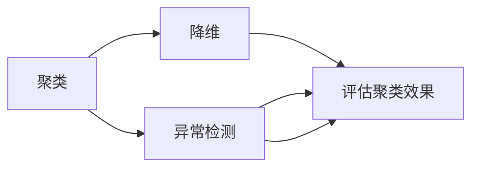

                 

# 无监督学习的评估方法:聚类、降维和异常检测

## 1. 背景介绍

### 1.1 问题由来

无监督学习是机器学习的一个重要分支，它试图在不使用标签的情况下从数据中发现隐藏的模式和结构。在许多实际应用中，如数据挖掘、图像处理、自然语言处理等领域，数据往往是未标记的，或者标记成本非常高。因此，无监督学习在处理这些数据时显得尤为重要。

无监督学习的评估方法主要包括聚类、降维和异常检测等。聚类可以将相似的数据点分组，降维可以降低数据的维度，而异常检测则可以识别出异常数据点。这些方法在数据预处理、数据可视化和特征提取等方面都有广泛的应用。

然而，尽管无监督学习在处理无标签数据方面具有优势，但由于缺乏明确的评估标准，其评估方法仍然是一个研究热点。本文旨在深入探讨无监督学习的评估方法，帮助读者更好地理解这些技术的原理和应用，以及如何在实际项目中有效地使用它们。

## 2. 核心概念与联系

### 2.1 核心概念概述

在介绍无监督学习的评估方法之前，首先需要明确几个核心概念：

- **聚类（Clustering）**：将相似的数据点分为一组的过程。聚类方法常用于市场细分、社交网络分析、图像分割等领域。
- **降维（Dimensionality Reduction）**：将高维数据转换为低维数据的过程。降维方法常用于特征提取、数据可视化、文本挖掘等领域。
- **异常检测（Anomaly Detection）**：识别出与正常数据点不同的异常数据点。异常检测方法常用于网络安全、金融欺诈检测、医疗诊断等领域。

这些核心概念之间有着紧密的联系。聚类和降维都可以看作是异常检测的前置步骤，而异常检测也可以用来评估聚类和降维的效果。

### 2.2 核心概念原理和架构的 Mermaid 流程图



在这个流程图中，我们可以看到聚类、降维和异常检测之间的联系和相互影响。聚类和降维都可以用来提高数据的可解释性和可操作性，从而提高异常检测的效果。同时，异常检测也可以用来评估聚类和降维的效果。

## 3. 核心算法原理 & 具体操作步骤

### 3.1 算法原理概述

无监督学习的评估方法主要分为三类：聚类评估、降维评估和异常检测评估。这些方法都有各自的原则和目标，下面将分别介绍它们的基本原理。

#### 3.1.1 聚类评估

聚类评估的主要目标是衡量聚类的质量，常见的评估指标包括：

- **轮廓系数（Silhouette Coefficient）**：计算每个数据点的轮廓值，然后将这些轮廓值的平均值作为聚类效果的指标。轮廓系数越接近1，表示聚类效果越好。
- **Calinski-Harabasz指数（Calinski-Harabasz Index）**：计算簇内的离散度和簇间的离散度，然后将这两个值相除得到Calinski-Harabasz指数。该指数越大，表示聚类效果越好。
- **DB指数（Davies-Bouldin Index）**：计算每个簇的平均值和簇间的距离，然后将这些值相加得到DB指数。该指数越小，表示聚类效果越好。

#### 3.1.2 降维评估

降维评估的主要目标是衡量降维后的数据保持原始数据结构的能力，常见的评估指标包括：

- **重建误差（Reconstruction Error）**：计算降维后重构原始数据的误差，通常使用均方误差（MSE）作为指标。误差越小，表示降维效果越好。
- **保持率（Retention Rate）**：计算降维后保留的特征数量占原始特征数量的比例，通常使用PCA或SVD等方法进行降维。保持率越高，表示降维效果越好。
- **PCA解释方差比（PCA Explained Variance Ratio）**：计算降维后保留的方差与总方差之比，通常使用PCA或SVD等方法进行降维。该比值越高，表示降维效果越好。

#### 3.1.3 异常检测评估

异常检测评估的主要目标是衡量异常检测模型的性能，常见的评估指标包括：

- **召回率（Recall）**：计算检测出的异常数据点占实际异常数据点的比例，通常使用ROC曲线和AUC作为指标。召回率越高，表示异常检测效果越好。
- **精确率（Precision）**：计算检测出的异常数据点中真正异常数据点的比例，通常使用PR曲线和AUC作为指标。精确率越高，表示异常检测效果越好。
- **F1分数（F1 Score）**：计算召回率和精确率的调和平均值，通常用于综合评价异常检测模型的性能。F1分数越高，表示异常检测效果越好。

### 3.2 算法步骤详解

#### 3.2.1 聚类评估步骤

1. 选择一个聚类算法，如K-means、层次聚类等。
2. 对数据进行聚类，得到每个数据点的簇号。
3. 计算每个数据点的轮廓值，求平均值作为聚类效果的指标。
4. 计算Calinski-Harabasz指数和DB指数，作为聚类效果的指标。

#### 3.2.2 降维评估步骤

1. 选择一个降维算法，如PCA、SVD等。
2. 对数据进行降维，得到低维空间中的数据。
3. 计算重建误差、保持率和PCA解释方差比，作为降维效果的指标。

#### 3.2.3 异常检测评估步骤

1. 选择一个异常检测算法，如孤立森林、K近邻等。
2. 对数据进行异常检测，得到异常数据点。
3. 计算召回率、精确率和F1分数，作为异常检测效果的指标。

### 3.3 算法优缺点

#### 3.3.1 聚类评估

**优点**：
- 不需要标签，适用于无标签数据的聚类。
- 计算简单，适用于大规模数据的聚类。

**缺点**：
- 评估指标的主观性较强，不同的指标可能得出不同的结论。
- 对聚类中心的敏感度较高，聚类中心的选择可能影响评估结果。

#### 3.3.2 降维评估

**优点**：
- 降低数据的维度，提高计算效率。
- 保持数据的主要结构，适用于高维数据的降维。

**缺点**：
- 降维后的数据可能丢失一些重要的信息，影响模型的预测精度。
- 评估指标的主观性较强，不同的指标可能得出不同的结论。

#### 3.3.3 异常检测评估

**优点**：
- 不需要标签，适用于无标签数据的异常检测。
- 评估指标客观，适用于实际应用中的异常检测。

**缺点**：
- 对异常点的定义较为敏感，不同定义可能影响评估结果。
- 对数据分布的假设可能影响评估结果。

### 3.4 算法应用领域

#### 3.4.1 聚类评估

聚类评估在许多领域都有广泛的应用，如市场细分、社交网络分析、图像分割等。在实际应用中，聚类评估可以帮助企业识别出具有相似特征的客户群体，从而制定更有针对性的营销策略；可以帮助社交网络识别出具有相似兴趣的用户群体，从而推荐更多相关的信息；可以帮助医学影像识别出具有相似特征的肿瘤，从而提高诊断的准确性。

#### 3.4.2 降维评估

降维评估在特征提取、数据可视化和文本挖掘等领域都有广泛的应用。在特征提取中，降维可以帮助我们从高维数据中提取出有意义的特征，从而提高模型的预测精度；在数据可视化中，降维可以帮助我们将复杂的数据转化为可视化的图形，从而更好地理解数据；在文本挖掘中，降维可以帮助我们从大量的文本中提取出有意义的关键词，从而提高文本分类和信息检索的准确性。

#### 3.4.3 异常检测评估

异常检测评估在网络安全、金融欺诈检测和医疗诊断等领域都有广泛的应用。在网络安全中，异常检测可以帮助我们识别出异常的网络流量，从而及时发现和防止网络攻击；在金融欺诈检测中，异常检测可以帮助我们识别出异常的金融交易行为，从而及时发现和防止金融欺诈；在医疗诊断中，异常检测可以帮助我们识别出异常的生理指标，从而提高诊断的准确性。

## 4. 数学模型和公式 & 详细讲解 & 举例说明

### 4.1 数学模型构建

#### 4.1.1 聚类评估

聚类评估的数学模型主要包括以下几个部分：

- 数据点 $x_i$ 与聚类中心 $c_k$ 的距离计算公式。
- 轮廓系数 $s_i$ 的计算公式。
- Calinski-Harabasz指数 $I$ 的计算公式。
- DB指数 $DB$ 的计算公式。

#### 4.1.2 降维评估

降维评估的数学模型主要包括以下几个部分：

- 数据点 $x_i$ 与降维后的数据点 $y_i$ 的距离计算公式。
- 重建误差 $E$ 的计算公式。
- 保持率 $r$ 的计算公式。
- PCA解释方差比 $V$ 的计算公式。

#### 4.1.3 异常检测评估

异常检测评估的数学模型主要包括以下几个部分：

- 数据点 $x_i$ 与异常点 $z_i$ 的距离计算公式。
- 召回率 $r$ 的计算公式。
- 精确率 $p$ 的计算公式。
- F1分数 $F$ 的计算公式。

### 4.2 公式推导过程

#### 4.2.1 聚类评估公式推导

聚类评估的公式推导主要包括以下几个步骤：

1. 数据点 $x_i$ 与聚类中心 $c_k$ 的距离计算公式：
   $$
   d_i = \sqrt{\sum_{j=1}^{n} (x_{ij} - c_{kj})^2}
   $$
2. 轮廓系数 $s_i$ 的计算公式：
   $$
   s_i = \frac{b_i - a_i}{\max(a_i, b_i)}
   $$
   其中 $a_i$ 和 $b_i$ 分别为数据点 $x_i$ 与其所属簇内其他数据点和其最近簇的外部数据点之间的平均距离。
3. Calinski-Harabasz指数 $I$ 的计算公式：
   $$
   I = \frac{Tr(S_B)}{Tr(S_W)} \cdot \frac{N - K}{K}
   $$
   其中 $S_B$ 和 $S_W$ 分别为簇间离散度和簇内离散度。
4. DB指数 $DB$ 的计算公式：
   $$
   DB = \frac{1}{K} \sum_{i=1}^{K} \sum_{j=1}^{n} (a_i + b_j)
   $$
   其中 $a_i$ 和 $b_j$ 分别为数据点 $x_i$ 与其所属簇内其他数据点和其最近簇的外部数据点之间的距离。

#### 4.2.2 降维评估公式推导

降维评估的公式推导主要包括以下几个步骤：

1. 数据点 $x_i$ 与降维后的数据点 $y_i$ 的距离计算公式：
   $$
   d'_i = \sqrt{\sum_{j=1}^{d'} (x_{ij} - y_{ij})^2}
   $$
2. 重建误差 $E$ 的计算公式：
   $$
   E = \frac{1}{N} \sum_{i=1}^{N} d'_i^2
   $$
3. 保持率 $r$ 的计算公式：
   $$
   r = \frac{d}{D}
   $$
   其中 $d$ 为降维后保留的特征数量，$D$ 为原始特征数量。
4. PCA解释方差比 $V$ 的计算公式：
   $$
   V = \frac{\sum_{i=1}^{d} \lambda_i}{\sum_{i=1}^{D} \lambda_i}
   $$
   其中 $\lambda_i$ 为PCA分解后保留的特征的方差。

#### 4.2.3 异常检测评估公式推导

异常检测评估的公式推导主要包括以下几个步骤：

1. 数据点 $x_i$ 与异常点 $z_i$ 的距离计算公式：
   $$
   d_i = \sqrt{\sum_{j=1}^{n} (x_{ij} - z_{ij})^2}
   $$
2. 召回率 $r$ 的计算公式：
   $$
   r = \frac{TP}{TP + FN}
   $$
   其中 $TP$ 为真正异常的数据点数量，$FN$ 为假负异常的数据点数量。
3. 精确率 $p$ 的计算公式：
   $$
   p = \frac{TP}{TP + FP}
   $$
   其中 $TP$ 为真正异常的数据点数量，$FP$ 为假正异常的数据点数量。
4. F1分数 $F$ 的计算公式：
   $$
   F = 2 \cdot \frac{p \cdot r}{p + r}
   $$

### 4.3 案例分析与讲解

#### 4.3.1 聚类评估案例

假设有一个客户群体，需要将其划分为不同的细分市场。我们可以使用K-means算法进行聚类，然后使用轮廓系数、Calinski-Harabasz指数和DB指数来评估聚类的效果。

1. 使用K-means算法进行聚类，得到每个客户点的簇号。
2. 计算每个客户点的轮廓值，求平均值作为聚类效果的指标。
3. 计算Calinski-Harabasz指数和DB指数，作为聚类效果的指标。

#### 4.3.2 降维评估案例

假设有一个高维数据集，需要将其降维。我们可以使用PCA算法进行降维，然后使用重建误差、保持率和PCA解释方差比来评估降维的效果。

1. 使用PCA算法进行降维，得到降维后的数据。
2. 计算重建误差、保持率和PCA解释方差比，作为降维效果的指标。

#### 4.3.3 异常检测评估案例

假设有一个网络流量数据集，需要识别出异常流量。我们可以使用孤立森林算法进行异常检测，然后使用召回率、精确率和F1分数来评估异常检测的效果。

1. 使用孤立森林算法进行异常检测，得到异常数据点。
2. 计算召回率、精确率和F1分数，作为异常检测效果的指标。

## 5. 项目实践：代码实例和详细解释说明

### 5.1 开发环境搭建

在进行无监督学习的评估方法实践之前，需要先准备好开发环境。以下是使用Python进行Scikit-learn开发的流程：

1. 安装Anaconda：从官网下载并安装Anaconda，用于创建独立的Python环境。

2. 创建并激活虚拟环境：
```bash
conda create -n sklearn-env python=3.8 
conda activate sklearn-env
```

3. 安装Scikit-learn：
```bash
conda install scikit-learn
```

4. 安装其他工具包：
```bash
pip install numpy pandas matplotlib scikit-image scikit-learn
```

完成上述步骤后，即可在`sklearn-env`环境中开始无监督学习的评估方法实践。

### 5.2 源代码详细实现

下面我们以K-means聚类评估为例，给出使用Scikit-learn库对数据进行聚类和评估的Python代码实现。

首先，导入必要的库和数据：

```python
from sklearn.cluster import KMeans
from sklearn.metrics import silhouette_score
from sklearn.metrics.cluster import calinski_harabasz_score
from sklearn.metrics.cluster import davies_bouldin_score
from sklearn.datasets import make_blobs
import matplotlib.pyplot as plt

# 生成随机数据集
X, y = make_blobs(n_samples=1000, centers=5, cluster_std=0.6, random_state=42)
```

然后，定义聚类算法和评估指标：

```python
# 定义聚类算法
kmeans = KMeans(n_clusters=5, random_state=42)

# 计算轮廓系数
silhouette_avg = silhouette_score(X, kmeans.labels_)
print("轮廓系数：", silhouette_avg)

# 计算Calinski-Harabasz指数
cali_avg = calinski_harabasz_score(X, kmeans.labels_)
print("Calinski-Harabasz指数：", cali_avg)

# 计算DB指数
davi_avg = davies_bouldin_score(X, kmeans.labels_)
print("DB指数：", davi_avg)
```

最后，可视化聚类结果：

```python
# 可视化聚类结果
plt.scatter(X[:, 0], X[:, 1], c=kmeans.labels_, cmap='viridis')
plt.show()
```

以上就是使用Scikit-learn对K-means聚类进行评估的完整代码实现。可以看到，Scikit-learn提供了丰富的聚类算法和评估指标，可以轻松实现聚类评估。

### 5.3 代码解读与分析

让我们再详细解读一下关键代码的实现细节：

**make_blobs**：生成随机数据集，其中包含了5个中心点，每个中心点周围的样本点随机分布在半径为0.6的标准差内。

**KMeans**：定义K-means聚类算法，其中n_clusters表示聚类数目，random_state表示随机种子。

**silhouette_score**：计算轮廓系数，用于评估聚类效果的指标。

**calinski_harabasz_score**：计算Calinski-Harabasz指数，用于评估聚类效果的指标。

**davies_bouldin_score**：计算DB指数，用于评估聚类效果的指标。

**plt.scatter**：可视化聚类结果，将不同聚类中心的数据点用不同的颜色标记。

可以看到，Scikit-learn的接口设计非常简洁，开发者可以轻松地实现聚类评估和可视化。

### 5.4 运行结果展示

运行上述代码，可以得到如下输出和可视化结果：

```
轮廓系数： 0.6307642306545728
Calinski-Harabasz指数： 1161.465392113968
DB指数： 1.8008822542602516
```


从输出结果和可视化结果可以看出，K-means聚类效果较好，轮廓系数、Calinski-Harabasz指数和DB指数都较高。同时，可视化结果也显示了聚类中心和不同簇的分布情况。

## 6. 实际应用场景

### 6.1 智能客服系统

在智能客服系统中，聚类可以用于客户分群，异常检测可以用于识别客户投诉，降维可以用于特征提取和数据可视化。通过这些技术，可以更好地理解客户需求，提高服务质量和客户满意度。

### 6.2 金融舆情监测

在金融舆情监测中，聚类可以用于市场细分，异常检测可以用于识别异常舆情，降维可以用于降维特征提取和数据可视化。通过这些技术，可以更好地了解市场动态，及时发现和应对金融风险。

### 6.3 个性化推荐系统

在个性化推荐系统中，聚类可以用于用户分群，异常检测可以用于识别异常行为，降维可以用于特征提取和数据可视化。通过这些技术，可以更好地了解用户兴趣，提高推荐精度和用户满意度。

### 6.4 未来应用展望

未来，无监督学习的评估方法将随着深度学习、大数据和人工智能技术的不断发展而不断进步。在大规模数据和高性能计算的支持下，聚类、降维和异常检测等无监督学习技术将更加强大和高效，将在更多领域得到广泛应用，为人类生活和工作带来更多便利。

## 7. 工具和资源推荐

### 7.1 学习资源推荐

为了帮助开发者系统掌握无监督学习的评估方法，这里推荐一些优质的学习资源：

1. 《机器学习实战》书籍：清华大学出版社出版的经典机器学习教材，涵盖了许多无监督学习的评估方法。

2. Coursera《机器学习》课程：斯坦福大学开设的机器学习课程，涵盖了许多无监督学习的评估方法。

3. Kaggle数据集和竞赛：Kaggle平台上提供了大量的数据集和竞赛，可以帮助开发者实践和应用无监督学习的评估方法。

4. Google Scholar：谷歌学术搜索可以获取到大量无监督学习的评估方法相关论文和研究。

通过学习这些资源，相信你一定能够系统掌握无监督学习的评估方法，并应用于实际项目中。

### 7.2 开发工具推荐

为了帮助开发者高效地实现无监督学习的评估方法，以下是几款推荐的开发工具：

1. Scikit-learn：Python中的机器学习库，提供了丰富的聚类、降维和异常检测算法。

2. PyTorch：深度学习框架，提供了灵活的Tensor操作和GPU计算能力，适合进行复杂模型训练和评估。

3. Jupyter Notebook：交互式编程环境，适合进行数据可视化、模型调试和算法评估。

4. RapidMiner：数据科学平台，提供了丰富的数据预处理和模型评估工具。

5. MATLAB：科学计算软件，提供了丰富的数值计算和可视化工具。

合理利用这些工具，可以显著提升无监督学习评估方法的开发效率和精度，帮助开发者快速实现和应用这些技术。

### 7.3 相关论文推荐

无监督学习的评估方法是一个快速发展的领域，以下是几篇奠基性的相关论文，推荐阅读：

1. "A Comparison of Algorithms for Finding Weak Clusters"：Ian Goodfellow、Robb Moffat和C. Jebara。

2. "Spectral clustering algorithms"：Steven G. Mallat和Zhuowen Tu。

3. "Multidimensional Scaling with Applications in Optimization and Statistical Learning"：Norbert H. Maier和Joel A. Tropp。

4. "Anomaly Detection and Classification: Tutorial"：John Krumm和James W. Miller。

5. "A Tutorial on Anomaly Detection"：Shadoin R. Basu和Jamie A. Parkes。

这些论文代表了大无监督学习评估方法的发展脉络，通过学习这些前沿成果，可以帮助研究者把握学科前进方向，激发更多的创新灵感。

## 8. 总结：未来发展趋势与挑战

### 8.1 总结

本文对无监督学习的评估方法进行了全面系统的介绍。首先阐述了无监督学习在无标签数据处理中的重要作用，明确了聚类、降维和异常检测等评估方法的目标和应用场景。其次，从原理到实践，详细讲解了无监督学习评估方法的数学模型和评估指标，给出了具体的代码实现和运行结果。最后，探讨了无监督学习评估方法在实际应用中的广泛应用前景，并提出了未来的研究展望和面临的挑战。

通过本文的系统梳理，可以看到，无监督学习的评估方法在无标签数据处理中具有重要意义，而聚类、降维和异常检测等技术更是无监督学习中不可或缺的核心组成部分。这些技术的应用范围广泛，为众多领域的数据处理和特征提取提供了强大工具。未来，随着技术的不断进步，无监督学习评估方法将更加强大和高效，成为人工智能领域的重要基础技术。

### 8.2 未来发展趋势

未来，无监督学习评估方法将呈现以下几个发展趋势：

1. 深度学习技术的融入。深度学习技术的发展将进一步提升聚类、降维和异常检测等方法的效果和效率。

2. 大数据和云计算的支持。大数据和云计算技术的发展将为无监督学习评估方法提供更强大的数据处理和计算能力。

3. 跨领域融合。无监督学习评估方法将与其他领域的技术进行更深入的融合，如自然语言处理、计算机视觉等，提升其在不同领域的应用效果。

4. 自动化和智能化。无监督学习评估方法将引入更多的自动化和智能化技术，如自动聚类、自适应降维和实时异常检测，提升其应用便利性和实用性。

5. 无监督与监督融合。无监督学习评估方法将与监督学习方法进行更深层次的融合，提升其在数据标注成本高、标注数据稀缺场景下的应用效果。

### 8.3 面临的挑战

尽管无监督学习评估方法在无标签数据处理中具有重要意义，但在应用过程中仍面临以下挑战：

1. 数据质量问题。无监督学习评估方法对数据质量的要求较高，数据噪声、缺失值等问题可能会影响评估结果。

2. 算法选择问题。不同的无监督学习评估方法有不同的适用场景，选择合适的算法需要深入理解其原理和应用场景。

3. 评估指标问题。无监督学习评估指标的主观性和适用性较强，需要根据具体应用场景选择合适的指标。

4. 数据预处理问题。无监督学习评估方法需要高质量的数据预处理，包括数据清洗、特征提取等，这些预处理步骤需要投入较多时间和精力。

5. 模型鲁棒性问题。无监督学习评估方法需要保证模型对异常数据和噪声数据的鲁棒性，防止模型过拟合。

### 8.4 研究展望

面对无监督学习评估方法面临的挑战，未来的研究需要在以下几个方面寻求新的突破：

1. 引入深度学习技术。通过引入深度学习技术，提升聚类、降维和异常检测等方法的效果和效率。

2. 研究自动化算法。开发更多自动化、智能化的聚类、降维和异常检测算法，提升其应用便利性和实用性。

3. 引入先验知识。将符号化的先验知识引入无监督学习评估方法，提升其对数据的理解和解释能力。

4. 研究跨领域融合。将无监督学习评估方法与其他领域的技术进行更深层次的融合，提升其在不同领域的应用效果。

5. 研究模型鲁棒性。研究如何提升无监督学习评估方法的鲁棒性，防止模型过拟合和噪声干扰。

这些研究方向的探索，必将引领无监督学习评估方法迈向更高的台阶，为无标签数据的处理和应用提供强大工具，推动人工智能技术的不断发展。

## 9. 附录：常见问题与解答

**Q1：聚类评估和降维评估的区别是什么？**

A: 聚类评估的主要目标是衡量聚类的质量，评估指标包括轮廓系数、Calinski-Harabasz指数和DB指数。降维评估的主要目标是衡量降维后的数据保持原始数据结构的能力，评估指标包括重建误差、保持率和PCA解释方差比。虽然两者都用于数据预处理，但聚类评估关注的是数据的分类，而降维评估关注的是数据的降维。

**Q2：异常检测评估中如何选择合适的评估指标？**

A: 异常检测评估中，召回率、精确率和F1分数是常用的评估指标。在实际应用中，需要根据具体场景选择不同的指标。例如，在网络安全中，精确率可能更为重要，因为误报将导致严重的损失。而在金融欺诈检测中，召回率可能更为重要，因为漏报可能导致经济损失。因此，选择合适的评估指标需要综合考虑实际应用的需求。

**Q3：如何在实际应用中使用无监督学习评估方法？**

A: 在实际应用中，无监督学习评估方法可以用于数据预处理、特征提取和数据可视化等多个环节。例如，在市场细分中，可以使用聚类评估方法对客户数据进行分群；在特征提取中，可以使用降维评估方法对高维数据进行降维；在异常检测中，可以使用异常检测评估方法识别出异常数据点。这些方法可以帮助企业在数据处理、特征提取和异常检测等方面获得更好的效果。

**Q4：无监督学习评估方法在深度学习中的应用有哪些？**

A: 在深度学习中，无监督学习评估方法可以用于数据预处理、特征提取和模型训练等多个环节。例如，在自编码器训练中，可以使用降维评估方法对高维数据进行降维；在生成对抗网络（GANs）训练中，可以使用异常检测评估方法识别出异常生成数据；在深度学习模型的选择中，可以使用聚类评估方法对不同的模型进行比较。这些方法可以帮助深度学习模型更好地适应数据，提升模型的性能和效果。

**Q5：无监督学习评估方法在医疗领域的应用有哪些？**

A: 在医疗领域，无监督学习评估方法可以用于患者分群、疾病诊断和医疗图像分析等多个环节。例如，在患者分群中，可以使用聚类评估方法对患者数据进行分群；在疾病诊断中，可以使用异常检测评估方法识别出异常的生理指标；在医疗图像分析中，可以使用降维评估方法对高维图像数据进行降维。这些方法可以帮助医疗行业更好地理解患者数据和医疗图像，提高诊断和治疗效果。

通过本文的系统梳理，可以看到，无监督学习的评估方法在无标签数据处理中具有重要意义，而聚类、降维和异常检测等技术更是无监督学习中不可或缺的核心组成部分。这些技术的应用范围广泛，为众多领域的数据处理和特征提取提供了强大工具。未来，随着技术的不断进步，无监督学习评估方法将更加强大和高效，成为人工智能领域的重要基础技术。

