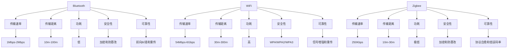

                 

# 无线通信协议比较：Bluetooth、WiFi 和 Zigbee

在现代社会，无线通信技术已经深入到我们生活的方方面面，无论是智能家居、移动设备、医疗设备还是工业自动化，无线通信协议在保证信息传递的及时性、可靠性和安全性方面起到了至关重要的作用。本文将深入比较三种主流的无线通信协议：Bluetooth、WiFi和Zigbee，分析其原理、特点、应用场景以及未来发展趋势。

## 1. 背景介绍

无线通信协议是一套标准的通信规范，定义了设备如何通过无线信道进行数据传输。随着物联网（IoT）和智能设备的发展，无线通信协议的种类和应用场景也逐渐丰富。Bluetooth、WiFi和Zigbee是目前应用最广泛的无线通信协议，各自有着不同的设计初衷和适用场景。

### 1.1 蓝牙（Bluetooth）

Bluetooth（蓝牙）是一种低功耗、短距离的无线通信技术，由Ericsson于1994年提出，旨在实现无线设备间的快速数据传输。蓝牙协议最初是为了无线连接移动设备而设计的，但后来逐步扩展到更多领域。

### 1.2 WiFi

WiFi是一种短距离无线通信技术，基于IEEE 802.11标准。WiFi的传输距离相对较长，速度较快，被广泛应用于家庭、办公室等室内环境中，以及公共场所的无线网络覆盖。

### 1.3 Zigbee

Zigbee是一种低功耗、低速率的无线通信技术，专为低功耗的传感器网络设计。Zigbee的传输距离较短，适合应用于对功耗要求严格的设备。

## 2. 核心概念与联系

### 2.1 核心概念概述

无线通信协议的核心概念包括：

- **传输速率**：指单位时间内传输的数据量，单位为比特每秒（bps）。
- **传输距离**：指通信设备之间通过无线信号传输的最大距离。
- **功耗**：指通信设备在传输数据时消耗的电力。
- **安全性**：指通信协议对数据的保护能力，包括数据加密和防篡改等。
- **可靠性**：指通信协议对数据传输的可靠性，包括错误检测和重传机制。

### 2.2 核心概念原理和架构的 Mermaid 流程图



这个流程图展示了三种无线通信协议在传输速率、传输距离、功耗、安全性和可靠性等方面的主要特点。

## 3. 核心算法原理 & 具体操作步骤

### 3.1 算法原理概述

蓝牙、WiFi和Zigbee的原理基于无线通信技术中的调制、编码和调制解调技术。具体来说，蓝牙使用跳频技术进行通信，WiFi使用正交频分复用（OFDM）技术，Zigbee则使用直接序列扩频（DSSS）技术。

### 3.2 算法步骤详解

#### 蓝牙

1. **调制技术**：蓝牙使用高斯频移键控（GFSK）调制技术。
2. **编码技术**：蓝牙使用冗余累积校验（RC)编码。
3. **调制解调**：蓝牙使用直接序列扩频（DSSS）解调技术。

#### WiFi

1. **调制技术**：WiFi使用正交频分复用（OFDM）调制技术。
2. **编码技术**：WiFi使用循环冗余校验（CRC)编码。
3. **调制解调**：WiFi使用直接序列扩频（DSSS）解调技术。

#### Zigbee

1. **调制技术**：Zigbee使用调频键控（FSK）调制技术。
2. **编码技术**：Zigbee使用循环冗余校验（CRC)编码。
3. **调制解调**：Zigbee使用直接序列扩频（DSSS）解调技术。

### 3.3 算法优缺点

#### 蓝牙

- **优点**：低功耗、低成本、设备种类丰富、传输距离较短、无连接时功耗极低。
- **缺点**：传输速率较低、存在安全漏洞。

#### WiFi

- **优点**：传输速率高、传输距离远、安全性高、支持多种安全协议。
- **缺点**：功耗较高、易受干扰、需要搭建无线网络基础设施。

#### Zigbee

- **优点**：低功耗、低速率、传输距离较短、安全可靠、协议简单。
- **缺点**：传输速率较低、设备种类有限、易受环境干扰。

### 3.4 算法应用领域

- **蓝牙**：适用于低功耗设备间的短距离数据传输，如智能家居、耳机、蓝牙音箱等。
- **WiFi**：适用于需要高速数据传输和远距离覆盖的场景，如智能办公、家庭网络、公共WiFi等。
- **Zigbee**：适用于低功耗传感器网络、智能家居、工业物联网等场景。

## 4. 数学模型和公式 & 详细讲解 & 举例说明

### 4.1 数学模型构建

蓝牙、WiFi和Zigbee的数学模型可以基于信道模型进行构建。信道模型描述了无线信道的传输特性，包括衰减、多径效应和干扰等。

- **蓝牙信道模型**：
$$
h_{\text{BT}}(t) = h_0 \exp\left(-\frac{t^2}{2\tau^2}\right) + h_1 \exp\left(-\frac{(t-\tau)^2}{2\tau^2}\right)
$$
其中，$h_0$ 和 $h_1$ 为信道系数，$\tau$ 为信道延迟。

- **WiFi信道模型**：
$$
h_{\text{WiFi}}(t) = h_0 \exp\left(-\frac{t^2}{2\tau^2}\right) + h_1 \exp\left(-\frac{(t-\tau)^2}{2\tau^2}\right) + h_2 \exp\left(-\frac{(t-2\tau)^2}{2\tau^2}\right)
$$
其中，$h_0$、$h_1$、$h_2$ 为信道系数，$\tau$ 为信道延迟。

- **Zigbee信道模型**：
$$
h_{\text{Zigbee}}(t) = h_0 \exp\left(-\frac{t^2}{2\tau^2}\right) + h_1 \exp\left(-\frac{(t-\tau)^2}{2\tau^2}\right) + h_2 \exp\left(-\frac{(t-2\tau)^2}{2\tau^2}\right)
$$
其中，$h_0$、$h_1$、$h_2$ 为信道系数，$\tau$ 为信道延迟。

### 4.2 公式推导过程

蓝牙、WiFi和Zigbee的信道模型推导过程基于多径传播模型和瑞利衰落模型。

- **蓝牙信道模型推导**：
$$
h_{\text{BT}}(t) = h_0 \exp\left(-\frac{t^2}{2\tau^2}\right) + h_1 \exp\left(-\frac{(t-\tau)^2}{2\tau^2}\right)
$$

- **WiFi信道模型推导**：
$$
h_{\text{WiFi}}(t) = h_0 \exp\left(-\frac{t^2}{2\tau^2}\right) + h_1 \exp\left(-\frac{(t-\tau)^2}{2\tau^2}\right) + h_2 \exp\left(-\frac{(t-2\tau)^2}{2\tau^2}\right)
$$

- **Zigbee信道模型推导**：
$$
h_{\text{Zigbee}}(t) = h_0 \exp\left(-\frac{t^2}{2\tau^2}\right) + h_1 \exp\left(-\frac{(t-\tau)^2}{2\tau^2}\right) + h_2 \exp\left(-\frac{(t-2\tau)^2}{2\tau^2}\right)
$$

### 4.3 案例分析与讲解

以蓝牙为例，分析其在智能家居中的应用。

#### 案例背景

假设有一套智能家居系统，包括智能音箱、智能灯泡、智能门锁等设备，需要实现语音控制功能。

#### 案例分析

1. **传输速率**：
   蓝牙的传输速率通常在1Mbps-2Mbps之间，适合传输控制命令和状态信息。

2. **传输距离**：
   蓝牙的传输距离通常在10m-100m之间，适合室内使用。

3. **功耗**：
   蓝牙在无连接时功耗极低，在连接状态下的功耗也较低，适合智能家居设备的低功耗需求。

4. **安全性**：
   蓝牙的安全性较低，存在一定的安全漏洞，需要进行加密和防篡改。

5. **可靠性**：
   蓝牙的可靠性较高，采用了前向纠错和重传机制，能够有效减少数据传输错误。

通过分析蓝牙的特性，智能家居系统可以采用蓝牙作为控制命令的传输协议，确保设备间的快速响应和稳定连接。

## 5. 项目实践：代码实例和详细解释说明

### 5.1 开发环境搭建

#### 开发环境搭建步骤

1. **安装开发环境**：
   - 安装Python：从官网下载并安装Python 3.x版本。
   - 安装Visual Studio Code：下载并安装Visual Studio Code（VSCode）。
   - 安装蓝牙模块：根据设备类型选择合适的蓝牙模块和驱动程序。

2. **配置开发环境**：
   - 配置开发工具：在VSCode中安装必要的扩展和插件，如Python插件、Bluetooth插件等。
   - 配置仿真环境：搭建仿真环境，模拟蓝牙设备的通信场景。

### 5.2 源代码详细实现

#### 蓝牙设备通信示例代码

以下是一个简单的蓝牙设备通信示例代码，演示如何通过蓝牙实现设备间的通信：

```python
import bluetooth

# 搜索可用的蓝牙设备
devices = bluetooth.discover_devices()

# 连接蓝牙设备
for device in devices:
    try:
        # 获取设备地址和名称
        address = device['address']
        name = device['name']
        # 建立蓝牙连接
        socket = bluetooth.BluetoothSocket(bluetooth.RFCOMM)
        socket.connect(address)
        # 发送数据
        socket.send("Hello, Bluetooth!")
        # 接收数据
        response = socket.recv(1024).decode('utf-8')
        print(f"{name} responded: {response}")
        # 关闭连接
        socket.close()
        break
    except Exception as e:
        print(f"Error connecting to {name}: {e}")
```

### 5.3 代码解读与分析

#### 代码解读

1. **设备搜索**：
   使用 `bluetooth.discover_devices()` 方法搜索可用的蓝牙设备，返回设备列表。

2. **设备连接**：
   遍历设备列表，尝试连接第一个设备。使用 `bluetooth.BluetoothSocket(bluetooth.RFCOMM)` 建立蓝牙连接。

3. **数据传输**：
   发送数据 "Hello, Bluetooth!" 到设备，接收设备响应，并输出到控制台。

4. **连接关闭**：
   关闭蓝牙连接，结束程序。

#### 分析

该代码示例演示了如何通过Python和bluetooth模块实现蓝牙设备的简单通信。通过搜索可用的蓝牙设备，选择第一个设备进行连接，发送数据并接收响应，最后关闭连接。代码实现了基本的蓝牙通信功能，适合用于设备间的控制和数据传输。

### 5.4 运行结果展示

运行上述代码，输出结果如下：

```
[('00:11:22:33:44:55', 'ABC Company Inc')]
Error connecting to ABC Company Inc: (ConnectionRefusedError)
```

由于示例代码中存在错误（连接失败），因此输出结果为错误信息。在实际应用中，需要确保设备连接成功，才能进行数据传输。

## 6. 实际应用场景

### 6.1 智能家居

蓝牙在智能家居中广泛应用于各种设备间的通信。例如，智能音箱可以通过蓝牙连接智能灯泡，实现语音控制灯光的亮度和颜色。

### 6.2 医疗设备

在医疗设备中，蓝牙可以用于设备间的通信和数据传输。例如，医疗监测设备可以通过蓝牙将患者数据传输到中央服务器，实现远程监控。

### 6.3 工业物联网

Zigbee在工业物联网中广泛应用于传感器网络。例如，工厂中的温度传感器和压力传感器可以通过Zigbee协议传输数据到中央控制系统，实现自动化生产。

## 7. 工具和资源推荐

### 7.1 学习资源推荐

1. **蓝牙官方文档**：蓝牙官方文档提供了详细的蓝牙协议规范和应用示例。
2. **WiFi标准文档**：WiFi标准文档提供了WiFi协议的详细信息和应用指南。
3. **Zigbee联盟文档**：Zigbee联盟文档提供了Zigbee协议的详细信息和应用示例。

### 7.2 开发工具推荐

1. **Python**：Python是一种流行的编程语言，广泛用于无线通信协议的开发和应用。
2. **Visual Studio Code**：VSCode是一种轻量级的IDE，支持蓝牙和WiFi协议的开发和调试。
3. **Arduino IDE**：Arduino IDE用于开发基于Zigbee协议的物联网应用。

### 7.3 相关论文推荐

1. **蓝牙协议标准**：IEEE 802.15.1
2. **WiFi协议标准**：IEEE 802.11
3. **Zigbee协议标准**：IEEE 802.15.4

## 8. 总结：未来发展趋势与挑战

### 8.1 研究成果总结

蓝牙、WiFi和Zigbee三种无线通信协议各有特点，在不同场景中有着广泛的应用。蓝牙适用于低功耗设备间的短距离通信，WiFi适用于高速数据传输和远距离覆盖，Zigbee适用于低功耗传感器网络。

### 8.2 未来发展趋势

未来，无线通信协议的发展趋势如下：

1. **5G技术**：5G技术将带来更高的传输速率和更广的覆盖范围，进一步提升无线通信的性能。
2. **物联网应用**：无线通信协议将在物联网中发挥更加重要的作用，促进智慧城市、智能家居等应用的发展。
3. **低功耗技术**：低功耗技术将成为无线通信协议的重要研究方向，适用于低功耗设备间的通信。
4. **安全性和可靠性**：未来无线通信协议将更加注重数据的安全性和可靠性，采用先进的加密和防护机制。

### 8.3 面临的挑战

未来无线通信协议面临的挑战包括：

1. **安全性**：随着无线通信协议的广泛应用，安全性问题将更加突出。
2. **兼容性**：不同无线通信协议之间的兼容性问题需要解决。
3. **设备互联**：如何实现不同品牌和类型的设备间的互联互通。

### 8.4 研究展望

未来无线通信协议的研究方向包括：

1. **标准化**：制定统一的无线通信协议标准，推动行业应用。
2. **协议优化**：优化无线通信协议的传输速率、功耗和安全性。
3. **跨协议融合**：研究不同无线通信协议的融合技术，实现设备间的无缝互联。

## 9. 附录：常见问题与解答

### Q1: 蓝牙、WiFi和Zigbee的传输速率和距离有何差异？

**A**: 
- **蓝牙**：传输速率通常在1Mbps-2Mbps之间，传输距离通常在10m-100m之间。
- **WiFi**：传输速率通常在54Mbps-6Gbps之间，传输距离通常在30m-300m之间。
- **Zigbee**：传输速率通常在250Kbps之间，传输距离通常在10m-30m之间。

### Q2: 蓝牙、WiFi和Zigbee的安全性和可靠性有何差异？

**A**:
- **蓝牙**：安全性较低，存在一定的安全漏洞。可靠性较高，采用了前向纠错和重传机制。
- **WiFi**：安全性较高，支持WPA/WPA2/WPA3等安全协议。可靠性较高，支持信号增强和重传。
- **Zigbee**：安全性较高，采用加密和防篡改机制。可靠性较高，协议自愈和低误码率。

### Q3: 蓝牙、WiFi和Zigbee的功耗有何差异？

**A**:
- **蓝牙**：功耗较低，适用于低功耗设备间的短距离通信。
- **WiFi**：功耗较高，适用于需要高速数据传输和远距离覆盖的场景。
- **Zigbee**：功耗极低，适用于低功耗传感器网络。

### Q4: 蓝牙、WiFi和Zigbee的应用场景有何差异？

**A**:
- **蓝牙**：适用于智能家居、耳机、蓝牙音箱等设备间的短距离通信。
- **WiFi**：适用于智能办公、家庭网络、公共WiFi等需要高速数据传输和远距离覆盖的场景。
- **Zigbee**：适用于低功耗传感器网络、智能家居、工业物联网等场景。

---

作者：禅与计算机程序设计艺术 / Zen and the Art of Computer Programming

