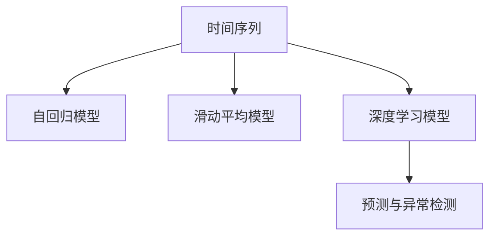

                 

## 1. 背景介绍

### 1.1 问题由来

随着大数据时代的到来，时间序列数据在金融、气象、交通等领域得到了广泛应用。通过对时间序列数据的分析，不仅可以预测未来趋势，还可以及时发现异常，防止潜在风险。因此，时间序列分析成为了研究的热点之一。传统的时间序列分析方法主要基于统计学和线性模型，但在复杂的数据分布和动态变化下，这些方法的局限性逐渐显现。深度学习技术，尤其是RNN和CNN等神经网络模型，为时间序列分析提供了新的视角。

### 1.2 问题核心关键点

时间序列分析的核心在于如何利用历史数据预测未来，以及如何从时间序列数据中挖掘出潜在异常。具体来说，主要包括以下几个关键点：

- **时间序列建模**：建立时间序列的统计模型，分析数据的趋势和周期性特征。
- **预测与推断**：基于已有模型预测未来的时间序列值，并对新数据的生成概率进行推断。
- **异常检测**：识别出时间序列中的异常点或异常周期，及时预警风险。

时间序列分析的应用场景非常广泛，如股票价格预测、天气变化预测、交通流量分析、故障诊断等。通过深度学习技术进行时间序列分析，可以显著提升预测精度和异常检测能力。

### 1.3 问题研究意义

时间序列分析在金融、气象、交通等领域具有重要的应用价值，可以大幅提升决策效率和精度。研究时间序列分析方法，对于提升这些领域的数据处理能力和业务决策水平，具有重要的现实意义：

1. **提升决策效率**：通过预测未来趋势和识别异常，提前制定应对措施，避免突发事件的冲击。
2. **降低风险**：及时发现异常点，防止潜在的风险事件的发生，保障系统的稳定运行。
3. **提高数据利用率**：利用深度学习模型挖掘时间序列数据中的潜在信息，最大化数据的价值。
4. **推动技术创新**：研究时间序列分析方法，可以推动深度学习技术的进步，促进多学科交叉应用。

## 2. 核心概念与联系

### 2.1 核心概念概述

为更好地理解时间序列分析的原理和应用，本节将介绍几个密切相关的核心概念：

- **时间序列**：指按时间顺序排列的数据集合，反映了现象随时间变化的情况。
- **自回归模型**：指序列值之间存在线性关系的时间序列模型。
- **滑动平均模型**：指通过滑动平均操作对序列进行平滑处理，以去除噪声和周期性波动。
- **深度学习模型**：包括RNN、LSTM、GRU等基于神经网络的时间序列模型。
- **预测与异常检测**：利用时间序列模型对未来数据进行预测，并对异常点进行检测。

这些核心概念之间的逻辑关系可以通过以下Mermaid流程图来展示：



这个流程图展示了大时间序列分析的核心概念及其之间的关系：

1. 时间序列通过自回归模型、滑动平均模型、深度学习模型等不同方法进行建模。
2. 预测与异常检测通过建立的模型对时间序列进行预测和异常检测。

## 3. 核心算法原理 & 具体操作步骤
### 3.1 算法原理概述

时间序列分析的本质是通过对历史数据的分析，建立时间序列的模型，并利用该模型对未来数据进行预测。常见的预测方法包括线性回归、指数平滑、ARIMA模型等。

对于异常检测，则常用的方法包括统计检验、离群值检测、孤立森林等。其中，深度学习模型在异常检测中展现了显著的优势，能够自动学习数据中的复杂结构，提升异常检测的准确率。

### 3.2 算法步骤详解

时间序列分析通常包括以下几个关键步骤：

**Step 1: 数据预处理**

- **数据清洗**：去除缺失值、异常值等噪声数据。
- **数据归一化**：将数据转化为标准化的数值范围，便于模型训练。
- **划分数据集**：将数据集划分为训练集、验证集和测试集。

**Step 2: 模型选择与训练**

- **模型选择**：根据数据特征选择合适的模型，如ARIMA、RNN、LSTM等。
- **模型训练**：在训练集上训练模型，最小化损失函数。

**Step 3: 预测与评估**

- **预测**：在测试集上对未来数据进行预测，得到预测结果。
- **评估**：利用均方误差(MSE)、平均绝对误差(MAE)等指标评估模型预测精度。

**Step 4: 异常检测与预警**

- **异常检测**：利用模型检测异常点或异常周期。
- **预警**：根据异常检测结果，及时采取措施，避免潜在风险。

### 3.3 算法优缺点

深度学习模型在时间序列分析中展现出了强大的能力，但也存在一定的局限性：

**优点**：
1. 自动特征提取：深度学习模型能够自动学习时间序列中的复杂特征，提升预测精度。
2. 处理复杂非线性关系：深度学习模型可以处理复杂的时间序列数据，捕捉非线性关系。
3. 适应性强：深度学习模型可以通过增加层数或节点数量，适应不同规模和时间跨度的时间序列数据。

**缺点**：
1. 模型复杂度高：深度学习模型通常包含大量的参数，需要较多的计算资源和时间。
2. 过拟合风险高：深度学习模型在训练过程中容易出现过拟合现象，影响模型泛化能力。
3. 模型可解释性差：深度学习模型通常是"黑盒"模型，难以解释其内部工作机制。

尽管存在这些局限性，但深度学习模型在时间序列分析中的应用，已经取得了显著的效果。未来，结合统计学方法和深度学习模型，可以进一步提升时间序列分析的精度和稳定性。

### 3.4 算法应用领域

时间序列分析广泛应用于多个领域，具体包括：

- **金融领域**：股票价格预测、风险评估、交易策略等。
- **气象领域**：天气变化预测、气候变化分析等。
- **交通领域**：交通流量预测、路径优化等。
- **能源领域**：电力负荷预测、电网稳定分析等。
- **制造业**：设备故障预测、生产效率优化等。

这些应用场景涵盖了金融、气象、交通、能源、制造业等多个领域，时间序列分析在这些领域中的价值和应用前景十分广阔。

## 4. 数学模型和公式 & 详细讲解  
### 4.1 数学模型构建

时间序列分析中的主要数学模型包括自回归模型(AR)、滑动平均模型(MA)、ARIMA模型、LSTM模型等。这里以LSTM模型为例，进行详细的数学模型构建和推导。

### 4.2 公式推导过程

以LSTM模型为例，LSTM的基本单位是长短期记忆单元（LSTM Cell），其结构如图1所示：


LSTM Cell包括三个门控机制：输入门、遗忘门和输出门，通过这些门控机制，LSTM可以有效地处理长期依赖关系，抑制噪声，保留关键信息。LSTM的输入为时间序列数据 $x_t$，隐藏状态为 $h_t$，输出为 $y_t$。

LSTM的输出可以通过公式(1)计算得到：

$$
y_t = h_t
$$

其中，$h_t$ 是LSTM的隐藏状态，其更新公式为：

$$
h_t = \tanh(W_hx_t + U_hh_{t-1} + b_h)
$$

式中，$W_h$ 和 $U_h$ 为权重矩阵，$b_h$ 为偏置向量，$\tanh$ 为激活函数。

输入门 $i_t$ 和遗忘门 $f_t$ 的计算公式如下：

$$
i_t = \sigma(W_ix_t + U_ih_{t-1} + b_i)
$$

$$
f_t = \sigma(W_fx_t + U_fh_{t-1} + b_f)
$$

其中，$\sigma$ 为Sigmoid激活函数。

输出门 $o_t$ 的计算公式为：

$$
o_t = \sigma(W_ox_t + U_oh_{t-1} + b_o)
$$

LSTM的更新公式为：

$$
h_t = o_t \odot \tanh(h_t) + (1-o_t) \odot f_t \odot h_{t-1}
$$

其中，$\odot$ 表示逐元素乘法。

### 4.3 案例分析与讲解

假设有一组时间序列数据 $x_t = (x_1, x_2, \ldots, x_T)$，其中 $T$ 为时间步数，$x_t$ 表示在时间 $t$ 的观测值。我们将这些数据输入到LSTM模型中，得到隐藏状态 $h_t$ 和输出 $y_t$。

例如，对于预测下一时刻的值，我们可以通过LSTM模型的输出 $y_t$ 进行预测，公式如下：

$$
\hat{y}_{t+1} = h_t
$$

对于异常检测，我们可以利用LSTM模型对异常点进行检测。当LSTM模型的输出值偏离正常范围时，即可认为该时刻为异常点。具体实现中，可以使用阈值法或者基于LSTM输出值的概率分布进行异常检测。

## 5. 项目实践：代码实例和详细解释说明
### 5.1 开发环境搭建

在进行时间序列分析的实践前，我们需要准备好开发环境。以下是使用Python进行TensorFlow进行时间序列分析的环境配置流程：

1. 安装Anaconda：从官网下载并安装Anaconda，用于创建独立的Python环境。

2. 创建并激活虚拟环境：
```bash
conda create -n ts-env python=3.8 
conda activate ts-env
```

3. 安装TensorFlow：根据CUDA版本，从官网获取对应的安装命令。例如：
```bash
conda install tensorflow -c conda-forge
```

4. 安装Keras：
```bash
conda install keras
```

5. 安装必要的工具包：
```bash
pip install pandas numpy matplotlib sklearn
```

完成上述步骤后，即可在`ts-env`环境中开始时间序列分析的实践。

### 5.2 源代码详细实现

下面以LSTM模型为例，给出使用TensorFlow进行时间序列分析的代码实现。

首先，定义LSTM模型的结构：

```python
import tensorflow as tf
from tensorflow.keras.models import Sequential
from tensorflow.keras.layers import LSTM, Dense

model = Sequential()
model.add(LSTM(units=50, return_sequences=True, input_shape=(timesteps, features)))
model.add(LSTM(units=50))
model.add(Dense(units=1))
```

然后，定义训练过程和评估函数：

```python
def train_model(model, x_train, y_train, x_test, y_test, epochs=50, batch_size=32):
    model.compile(loss='mse', optimizer='adam')
    model.fit(x_train, y_train, epochs=epochs, batch_size=batch_size, validation_data=(x_test, y_test))

def evaluate_model(model, x_test, y_test):
    y_pred = model.predict(x_test)
    mse = tf.keras.metrics.MeanSquaredError()(y_test, y_pred)
    mae = tf.keras.metrics.MeanAbsoluteError()(y_test, y_pred)
    return mse, mae

# 假设已加载好的训练数据和测试数据
x_train, y_train = load_data('train.csv')
x_test, y_test = load_data('test.csv')

# 训练模型
train_model(model, x_train, y_train, x_test, y_test)

# 评估模型
mse, mae = evaluate_model(model, x_test, y_test)
print(f'Mean Squared Error: {mse.numpy():.4f}')
print(f'Mean Absolute Error: {mae.numpy():.4f}')
```

在这个例子中，我们使用了TensorFlow和Keras框架，构建了一个包含两个LSTM层的深度学习模型，并定义了训练和评估函数。通过简单的调用，即可对时间序列数据进行建模、训练和评估。

### 5.3 代码解读与分析

让我们再详细解读一下关键代码的实现细节：

**LSTM模型定义**：
- `Sequential`：用于构建序列模型，通过`add`方法添加各个层。
- `LSTM`：定义了LSTM层，`units`参数指定隐藏单元数，`return_sequences=True`表示返回完整的输出序列。
- `Dense`：定义了全连接层，`units`参数指定输出单元数。

**训练函数**：
- `model.compile`：定义损失函数为均方误差，优化器为Adam。
- `model.fit`：使用训练数据进行模型训练，设置迭代次数和批量大小。
- `model.evaluate`：评估模型性能，返回均方误差和平均绝对误差。

**训练和评估流程**：
- 定义训练数据和测试数据。
- 调用`train_model`函数进行模型训练。
- 调用`evaluate_model`函数进行模型评估，并输出均方误差和平均绝对误差。

通过上述代码，我们可以快速构建并训练LSTM模型，对时间序列数据进行预测和评估。当然，工业级的系统实现还需考虑更多因素，如模型的保存和部署、超参数的自动搜索等，但核心的建模和训练过程基本与此类似。

## 6. 实际应用场景
### 6.1 金融领域

在金融领域，时间序列分析可以用于股票价格预测、风险评估、交易策略等。例如，利用LSTM模型对历史股票价格进行建模，可以预测未来价格走势，从而指导投资决策。同时，LSTM模型还可以用于风险评估，识别出高风险的股票或市场，帮助投资者规避风险。

在实际应用中，可以将金融市场的数据集划分为训练集和测试集，利用LSTM模型对未来股票价格进行预测。通过评估模型的预测性能，可以制定投资策略，实现资产组合优化。

### 6.2 气象领域

气象领域是时间序列分析的重要应用领域。利用LSTM模型对气象数据进行建模，可以预测天气变化、气象灾害等。例如，利用LSTM模型对历史气象数据进行分析，可以预测未来的天气变化趋势，为气象预报提供数据支持。同时，LSTM模型还可以用于灾害预警，及时发现气象灾害的征兆，提前采取防范措施。

在实际应用中，可以将气象数据划分为训练集和测试集，利用LSTM模型对未来气象数据进行预测。通过评估模型的预测性能，可以制定气象预报策略，提升灾害预警能力。

### 6.3 交通领域

在交通领域，时间序列分析可以用于交通流量预测、路径优化等。例如，利用LSTM模型对历史交通流量数据进行分析，可以预测未来的交通流量变化，为交通管理提供数据支持。同时，LSTM模型还可以用于路径优化，预测未来的交通状况，优化道路交通规划。

在实际应用中，可以将交通流量数据划分为训练集和测试集，利用LSTM模型对未来交通流量进行预测。通过评估模型的预测性能，可以优化交通管理策略，提升交通流量预测的准确性。

### 6.4 未来应用展望

随着深度学习技术的发展，时间序列分析的应用场景将越来越广泛。未来，时间序列分析在以下几个领域的应用前景值得期待：

- **医疗领域**：利用时间序列分析对患者病历数据进行分析，预测疾病发展趋势，制定治疗方案。
- **能源领域**：利用时间序列分析对能源数据进行分析，预测电力负荷、能源价格等，优化能源分配。
- **制造业**：利用时间序列分析对生产数据进行分析，预测设备故障、生产效率等，提升生产管理水平。

此外，时间序列分析还可以与其他技术结合，如计算机视觉、自然语言处理等，拓展应用场景。相信在未来的发展中，时间序列分析将在更多领域大放异彩，推动人工智能技术的发展。

## 7. 工具和资源推荐
### 7.1 学习资源推荐

为了帮助开发者系统掌握时间序列分析的理论基础和实践技巧，这里推荐一些优质的学习资源：

1. 《深度学习入门：基于Python的理论与实现》系列博文：由深度学习专家撰写，全面介绍了深度学习的基本原理和实践技巧。

2. 《TensorFlow实战》书籍：由TensorFlow官方推荐，提供了丰富的实例代码和讲解，适合深度学习初学者和进阶开发者。

3. 《时间序列分析》书籍：详细介绍了时间序列分析的理论基础和应用实践，适合系统学习时间序列分析。

4. Kaggle时间序列分析竞赛：通过参与竞赛，可以学习到实用的时间序列分析技巧，提升数据分析能力。

5. arXiv论文：收录了大量时间序列分析的最新研究成果，提供深入的理论学习资源。

通过对这些资源的学习实践，相信你一定能够快速掌握时间序列分析的精髓，并用于解决实际的数据分析问题。

### 7.2 开发工具推荐

高效的开发离不开优秀的工具支持。以下是几款用于时间序列分析开发的常用工具：

1. Python：Python是时间序列分析的主流编程语言，具有丰富的库和框架支持。

2. TensorFlow：由Google主导开发的深度学习框架，支持时间序列分析模型训练和推理。

3. Keras：基于TensorFlow的高层次API，可以简化模型构建和训练过程。

4. Matplotlib：用于绘制时间序列图表，可视化分析结果。

5. Pandas：用于数据处理和分析，支持时间序列数据的导入和操作。

6. Jupyter Notebook：交互式编程环境，支持代码块的嵌入和运行，便于模型构建和调试。

合理利用这些工具，可以显著提升时间序列分析的开发效率，加快创新迭代的步伐。

### 7.3 相关论文推荐

时间序列分析的研究源于学界的持续研究。以下是几篇奠基性的相关论文，推荐阅读：

1. GRU Networks: Learning to Sequence via RNN Encoder-Decoder for Structured Output Prediction：提出Gated Recurrent Unit(GRU)模型，与LSTM模型类似，但计算效率更高。

2. Time Series Forecasting with Recurrent Neural Networks：总结了基于RNN和LSTM模型的时间序列预测方法，并介绍了模型的训练和评估。

3. Sequence to Sequence Learning with Neural Networks：提出Seq2Seq模型，广泛应用于机器翻译、对话生成等自然语言处理任务中。

4. Long Short-Term Memory：提出LSTM模型，可以有效处理长期依赖关系，成为时间序列分析的标准模型之一。

5. Time Series Forecasting with Long Short-Term Memory Networks：介绍了LSTM模型在时间序列预测中的应用，并总结了模型的优缺点。

这些论文代表了大时间序列分析的发展脉络。通过学习这些前沿成果，可以帮助研究者把握学科前进方向，激发更多的创新灵感。

## 8. 总结：未来发展趋势与挑战
### 8.1 总结

本文对时间序列分析进行了全面系统的介绍。首先阐述了时间序列分析的背景和意义，明确了时间序列分析在金融、气象、交通等领域的重要价值。其次，从原理到实践，详细讲解了时间序列分析的数学模型和算法步骤，给出了时间序列分析的代码实例。同时，本文还广泛探讨了时间序列分析在金融、气象、交通等众多领域的应用前景，展示了时间序列分析的广泛应用价值。

通过本文的系统梳理，可以看到，时间序列分析在金融、气象、交通等领域具有重要的应用价值，可以大幅提升决策效率和精度。研究时间序列分析方法，对于提升这些领域的数据处理能力和业务决策水平，具有重要的现实意义。

### 8.2 未来发展趋势

展望未来，时间序列分析将呈现以下几个发展趋势：

1. **模型结构优化**：深度学习模型的结构不断优化，如RNN、LSTM、GRU等，以适应不同类型的时间序列数据。

2. **预测精度提升**：通过引入更多的特征和更复杂的网络结构，提高时间序列预测的准确性。

3. **异常检测强化**：结合更多统计学方法和深度学习模型，提升异常检测的精度和效率。

4. **跨领域应用拓展**：时间序列分析与其他领域（如自然语言处理、计算机视觉）结合，拓展应用场景。

5. **智能决策支持**：利用时间序列分析结果，结合其他领域的数据，实现智能决策支持系统。

6. **实时化处理**：通过分布式计算和边缘计算技术，实现时间序列数据的实时处理和分析。

以上趋势凸显了时间序列分析的广阔前景。这些方向的探索发展，必将进一步提升时间序列分析的精度和稳定性，推动时间序列分析在更多领域的应用。

### 8.3 面临的挑战

尽管时间序列分析技术已经取得了瞩目成就，但在迈向更加智能化、普适化应用的过程中，它仍面临着诸多挑战：

1. **数据量不足**：在某些领域（如医疗、能源等），数据量有限，难以充分训练深度学习模型。

2. **数据质量问题**：数据存在缺失、异常等质量问题，需要预处理和清洗。

3. **模型复杂度**：深度学习模型通常包含大量的参数，需要较高的计算资源和时间。

4. **可解释性问题**：深度学习模型通常是"黑盒"模型，难以解释其内部工作机制。

5. **泛化能力不足**：时间序列分析在实际应用中，模型泛化能力有限，难以应对复杂数据分布。

6. **异常检测问题**：异常检测在实际应用中，常常面临复杂数据分布和高维特征的问题，难以准确识别异常。

7. **实时化问题**：时间序列数据的实时处理和分析，需要高并发的计算能力和强大的数据存储系统。

8. **隐私保护问题**：时间序列分析需要处理大量敏感数据，如何保护数据隐私和安全性，是一个重要的研究方向。

正视时间序列分析面临的这些挑战，积极应对并寻求突破，将有助于推动时间序列分析技术的进步，实现其在更多领域的落地应用。

### 8.4 研究展望

未来，时间序列分析的研究需要在以下几个方面寻求新的突破：

1. **数据增强技术**：通过数据增强技术，增加时间序列数据量，提高模型训练效果。

2. **模型集成技术**：利用模型集成技术，提升时间序列分析的稳定性和鲁棒性。

3. **跨模态融合技术**：利用跨模态融合技术，结合其他领域的数据，提升时间序列分析的精度和泛化能力。

4. **实时化处理技术**：利用实时化处理技术，实现时间序列数据的实时分析和处理。

5. **可解释性技术**：利用可解释性技术，提升时间序列分析模型的可解释性和透明度。

6. **隐私保护技术**：利用隐私保护技术，保护时间序列分析中的敏感数据。

通过这些研究方向的探索，必将推动时间序列分析技术的进一步发展，提升其在更多领域的实际应用效果。

## 9. 附录：常见问题与解答

**Q1：时间序列分析是否可以处理时间跨度较长的数据？**

A: 时间序列分析可以处理时间跨度较长的数据，但需要考虑模型的计算复杂度和内存占用问题。通常情况下，时间跨度较长的数据需要更多的计算资源和时间，可以通过分块处理或分布式计算等方法解决。

**Q2：时间序列分析在处理周期性数据时需要注意哪些问题？**

A: 周期性数据是时间序列分析中的一个重要问题。在处理周期性数据时，需要注意以下几点：

1. 周期性分解：将周期性数据分解为长期趋势、季节性变化和随机噪声三个部分，分别建模。
2. 模型参数选择：选择适当的周期性模型（如季节性ARIMA模型），确保模型能够捕捉到周期性特征。
3. 数据预处理：对周期性数据进行预处理，如数据归一化、平稳性处理等，以提高模型的预测精度。

**Q3：时间序列分析在处理非平稳数据时需要注意哪些问题？**

A: 非平稳数据是时间序列分析中的另一个重要问题。在处理非平稳数据时，需要注意以下几点：

1. 平稳性处理：对非平稳数据进行平稳性处理，如差分、指数平滑等方法，将数据转化为平稳序列。
2. 模型选择：选择适当的模型（如ARIMA模型），确保模型能够捕捉到非平稳特征。
3. 数据预处理：对非平稳数据进行预处理，如数据归一化、平稳性处理等，以提高模型的预测精度。

**Q4：时间序列分析在处理大数据集时需要注意哪些问题？**

A: 大数据集是时间序列分析中的一个重要问题。在处理大数据集时，需要注意以下几点：

1. 数据分块：将大数据集分成多个小数据块，逐块进行分析和处理。
2. 分布式计算：利用分布式计算框架（如Spark），实现大数据集的时间序列分析。
3. 内存管理：采用内存管理技术，如数据分片、内存压缩等方法，提高内存使用效率。

**Q5：时间序列分析在处理高维特征数据时需要注意哪些问题？**

A: 高维特征数据是时间序列分析中的一个重要问题。在处理高维特征数据时，需要注意以下几点：

1. 特征选择：选择重要的特征，去除冗余和无关特征，降低模型复杂度。
2. 特征提取：利用特征提取技术，如主成分分析、因子分析等方法，提取关键特征。
3. 模型优化：选择适当的模型（如深度学习模型），确保模型能够捕捉到高维特征的复杂关系。

通过上述问题的解答，相信你一定能够更好地理解时间序列分析的原理和应用，解决实际的数据分析问题。

