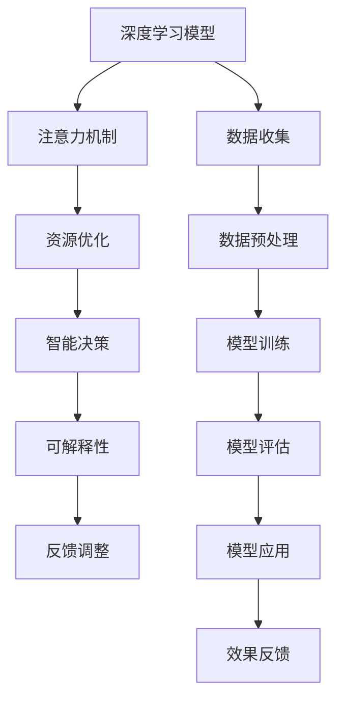

                 

## 1. 背景介绍

### 1.1 问题由来
智慧城市是未来城市建设的重要方向，通过数据驱动，实现城市管理、居民服务、交通系统、环境治理等多个方面的智能化和优化。在智慧城市的建设中，资源分配是一个核心问题，尤其是在注意力资源分配方面。注意力资源包括各种数据源、传感器、监控设备等，如何高效地分配这些资源，以实现最优的城市治理效果，是当前智慧城市建设面临的重大挑战。

### 1.2 问题核心关键点
注意力资源分配问题的核心在于如何根据实时数据和城市运行状态，动态调整资源分配策略，优化城市各项功能。目前，传统的城市资源分配方法主要是基于固定的规则和算法，难以适应城市复杂多变的情况。近年来，随着深度学习技术的发展，特别是注意力机制的引入，使得注意力资源分配问题可以借助深度学习模型来解决，进一步提升了城市管理的智能化和灵活性。

### 1.3 问题研究意义
研究智慧城市中的注意力资源分配问题，对于提升城市治理的效率和效果，实现智能化的资源管理，具有重要意义：

1. **资源优化**：通过深度学习模型，能够更好地利用有限的注意力资源，实现最优化的分配，提高城市管理的效率。
2. **智能决策**：模型可以实时分析城市运行数据，快速做出资源分配决策，提升城市应对突发事件的响应速度。
3. **泛化能力**：深度学习模型具备较强的泛化能力，能够在不同规模、不同特点的城市中应用，推广智慧城市技术。
4. **可解释性**：深度学习模型可以输出注意力分布，帮助管理者理解资源分配的依据，提升决策的可解释性和透明度。
5. **可持续发展**：通过智能化的资源分配，可以优化城市资源的利用，促进城市的可持续发展。

## 2. 核心概念与联系

### 2.1 核心概念概述

在智慧城市建设中，注意力资源分配涉及多个关键概念：

- **深度学习模型**：通过神经网络模型，利用大量历史数据训练出预测模型，实现对注意力资源的分配。
- **注意力机制**：一种模仿人类注意力的机制，使得模型可以动态地关注输入数据中的关键部分，提高模型的精准度和泛化能力。
- **资源优化**：通过优化模型参数和算法，实现对注意力资源的有效分配，提升城市管理的效率和效果。
- **智能决策**：利用模型自动做出资源分配决策，加速城市管理的响应速度。
- **可解释性**：通过模型输出的注意力分布，解释资源分配的依据，提升决策的透明性和可信度。

这些概念之间的逻辑关系可以通过以下Mermaid流程图来展示：



这个流程图展示了大语言模型中的核心概念及其之间的关系：

1. 深度学习模型是基础，通过数据收集和预处理，训练出预测模型。
2. 注意力机制是核心，使得模型能够动态地关注重要信息，提升预测精度。
3. 资源优化是手段，通过模型参数和算法的优化，实现资源的高效分配。
4. 智能决策是目标，模型自动做出资源分配决策，提升城市管理效率。
5. 可解释性是保障，通过模型输出的注意力分布，解释资源分配的依据，提高决策的透明性。
6. 反馈调整是循环，通过效果反馈，不断优化模型和算法，实现更优的资源分配。

这些概念共同构成了智慧城市中注意力资源分配的框架，使得智慧城市能够高效、智能地管理各种注意力资源。

## 3. 核心算法原理 & 具体操作步骤

### 3.1 算法原理概述

智慧城市中的注意力资源分配问题，本质上是一个优化问题。通过深度学习模型，在大量历史数据的基础上，找到最优的资源分配策略，使得城市管理的效果最大化。

形式化地，假设城市中存在 $N$ 种注意力资源，每种资源 $i$ 的分配比例为 $w_i$，总分配比例为 $W=1$。设资源分配的目标函数为 $F$，即城市管理效果的综合指标，如交通效率、环境质量等。则目标函数可以表示为：

$$
F = \sum_{i=1}^N f_i(w_i)
$$

其中 $f_i$ 为第 $i$ 种资源的贡献函数。目标是最小化目标函数 $F$，即：

$$
\min_{w_i} F = \min_{w_i} \sum_{i=1}^N f_i(w_i)
$$

在实际应用中，目标函数 $F$ 可以基于具体城市的特点，设计不同的指标体系和函数模型。例如，交通效率可以表示为平均车速和道路通行率，环境质量可以表示为空气污染指数和绿化覆盖率等。

### 3.2 算法步骤详解

基于深度学习模型的注意力资源分配，一般包括以下几个关键步骤：

**Step 1: 数据准备与模型搭建**
- 收集城市历史数据，包括交通流量、环境质量、人流密集度等。
- 设计注意力机制，选择适当的深度学习模型架构，如Transformer、LSTM等。
- 构建目标函数，根据具体需求，选择适合的评价指标。

**Step 2: 模型训练与优化**
- 利用收集的数据，对模型进行训练，不断优化模型参数和目标函数。
- 应用正则化技术，如L2正则、Dropout等，防止过拟合。
- 引入对抗训练，加入对抗样本，提升模型的鲁棒性和泛化能力。
- 进行超参数调优，如学习率、批大小等，提高模型效果。

**Step 3: 资源分配与效果评估**
- 利用训练好的模型，对当前城市的运行数据进行预测，输出注意力资源的分配比例。
- 将分配比例应用到实际的城市管理中，根据效果评估模型性能。
- 通过反馈调整，不断优化模型和目标函数，提升资源分配的效果。

### 3.3 算法优缺点

基于深度学习模型的注意力资源分配方法，具有以下优点：

1. **自适应能力强**：模型能够根据实时数据动态调整注意力分配策略，适应城市运行状态的不断变化。
2. **高效优化**：通过深度学习模型，能够在大量数据的基础上，快速找到最优的资源分配方案。
3. **泛化能力强**：模型可以应用到不同规模、不同特点的城市中，推广智慧城市技术。
4. **可解释性强**：模型输出的注意力分布，能够解释资源分配的依据，提高决策的透明性和可信度。

同时，该方法也存在一些局限性：

1. **数据依赖度高**：模型的效果高度依赖于数据的质量和完整性，数据缺失或不准确会影响模型的预测能力。
2. **计算资源消耗大**：深度学习模型通常需要较大的计算资源，尤其是在模型参数较多时，计算效率较低。
3. **模型复杂度高**：深度学习模型通常结构复杂，训练和推理过程耗时较长。
4. **模型泛化能力有限**：模型的泛化能力受限于数据和模型的设计，难以应对极端情况和突发事件。

尽管存在这些局限性，但基于深度学习的注意力资源分配方法，仍然是目前智慧城市建设中最前沿、最有效的手段之一。未来相关研究的方向包括降低模型对数据的依赖，提高模型的计算效率和泛化能力，以及增强模型的可解释性。

### 3.4 算法应用领域

基于深度学习模型的注意力资源分配方法，已经在智慧城市建设中的多个领域得到了广泛应用，例如：

- **交通管理**：通过分析交通流量数据，动态调整信号灯和道路资源，提升交通效率。
- **环境监测**：利用传感器数据，优化环境监控设备的部署位置和频次，提升环境治理效果。
- **公共安全**：分析人群流动数据，预测突发事件的发生地点和影响范围，提前采取应对措施。
- **能源管理**：根据电力负荷和天气预报数据，优化能源的分配和使用，提升能源利用效率。
- **智能垃圾处理**：通过传感器数据，调整垃圾分类和处理策略，提高垃圾处理的智能化水平。

除了上述这些典型应用外，深度学习模型还被创新性地应用于城市基础设施管理、水利工程、智能家居等场景中，为智慧城市建设提供了新的解决方案。

## 4. 数学模型和公式 & 详细讲解  
### 4.1 数学模型构建

在智慧城市中，注意力资源分配问题的数学模型可以表示为：

- **输入层**：表示城市运行数据，如交通流量、环境质量、人流密集度等。
- **隐藏层**：表示模型的注意力机制，用于动态关注输入数据中的关键部分。
- **输出层**：表示注意力资源的分配比例，即每种资源的分配比例 $w_i$。

假设输入层为 $X$，隐藏层为 $H$，输出层为 $W$。则模型可以表示为：

$$
W = \mathcal{F}(X, H)
$$

其中 $\mathcal{F}$ 为模型的非线性变换函数。

### 4.2 公式推导过程

以一个简单的线性模型为例，假设模型的输入为 $X$，输出为 $W$，隐藏层为 $H$，则模型的线性关系可以表示为：

$$
W = \mathcal{F}(X, H) = H^\top W
$$

其中 $H$ 为隐藏层的权重矩阵，$W$ 为输出层的权重向量。

为了最小化目标函数 $F$，可以引入均方误差损失函数：

$$
\mathcal{L} = \frac{1}{N}\sum_{i=1}^N (w_i - \hat{w}_i)^2
$$

其中 $\hat{w}_i$ 为模型预测的注意力分配比例。

利用梯度下降等优化算法，最小化损失函数，得到模型的参数更新公式：

$$
\theta \leftarrow \theta - \eta \nabla_{\theta}\mathcal{L}
$$

其中 $\theta$ 为模型参数，$\eta$ 为学习率，$\nabla_{\theta}\mathcal{L}$ 为损失函数对模型参数的梯度。

### 4.3 案例分析与讲解

以智慧城市中的交通管理为例，分析基于深度学习模型的注意力资源分配方法。假设交通流量数据为 $X$，模型输出的注意力分配比例为 $W$，则目标函数可以表示为：

$$
F = \sum_{i=1}^N f_i(w_i)
$$

其中 $f_i$ 为交通效率函数，可以表示为平均车速和道路通行率。

模型训练的样本数据为历史交通流量数据，通过模型预测得到的注意力分配比例 $W$，应用到实际的城市管理中，调整信号灯和道路资源的分配。通过效果评估，可以不断优化模型参数和目标函数，提升交通管理的效率和效果。

## 5. 项目实践：代码实例和详细解释说明
### 5.1 开发环境搭建

在进行注意力资源分配的实践前，我们需要准备好开发环境。以下是使用Python进行PyTorch开发的环境配置流程：

1. 安装Anaconda：从官网下载并安装Anaconda，用于创建独立的Python环境。

2. 创建并激活虚拟环境：
```bash
conda create -n attention-env python=3.8 
conda activate attention-env
```

3. 安装PyTorch：根据CUDA版本，从官网获取对应的安装命令。例如：
```bash
conda install pytorch torchvision torchaudio cudatoolkit=11.1 -c pytorch -c conda-forge
```

4. 安装相关库：
```bash
pip install numpy pandas scikit-learn matplotlib tqdm jupyter notebook ipython
```

完成上述步骤后，即可在`attention-env`环境中开始项目实践。

### 5.2 源代码详细实现

下面我们以智慧城市中的交通管理为例，给出使用PyTorch进行深度学习模型的代码实现。

首先，定义模型的输入和输出：

```python
import torch
import torch.nn as nn

class AttentionModel(nn.Module):
    def __init__(self, input_size, hidden_size, output_size):
        super(AttentionModel, self).__init__()
        self.hidden_size = hidden_size
        self.fc1 = nn.Linear(input_size, hidden_size)
        self.fc2 = nn.Linear(hidden_size, output_size)
        self.relu = nn.ReLU()
        
    def forward(self, x):
        x = self.fc1(x)
        x = self.relu(x)
        x = self.fc2(x)
        return x
```

然后，定义目标函数和损失函数：

```python
class LossFunction(nn.Module):
    def __init__(self):
        super(LossFunction, self).__init__()
        self.mse = nn.MSELoss()
        
    def forward(self, x, y):
        return self.mse(x, y)
```

接着，定义训练和评估函数：

```python
def train_epoch(model, data_loader, optimizer, criterion):
    model.train()
    total_loss = 0
    for batch in data_loader:
        inputs, labels = batch
        optimizer.zero_grad()
        outputs = model(inputs)
        loss = criterion(outputs, labels)
        loss.backward()
        optimizer.step()
        total_loss += loss.item()
    return total_loss / len(data_loader)

def evaluate(model, data_loader, criterion):
    model.eval()
    total_loss = 0
    for batch in data_loader:
        inputs, labels = batch
        outputs = model(inputs)
        loss = criterion(outputs, labels)
        total_loss += loss.item()
    return total_loss / len(data_loader)
```

最后，启动训练流程并在测试集上评估：

```python
epochs = 100
batch_size = 32
learning_rate = 0.001
model = AttentionModel(input_size, hidden_size, output_size)
optimizer = torch.optim.Adam(model.parameters(), lr=learning_rate)
criterion = LossFunction()
device = torch.device('cuda') if torch.cuda.is_available() else torch.device('cpu')

model.to(device)
for epoch in range(epochs):
    train_loss = train_epoch(model, train_loader, optimizer, criterion)
    print(f"Epoch {epoch+1}, train loss: {train_loss:.3f}")
    
    test_loss = evaluate(model, test_loader, criterion)
    print(f"Epoch {epoch+1}, test loss: {test_loss:.3f}")
```

以上就是使用PyTorch对深度学习模型进行智慧城市中注意力资源分配的完整代码实现。可以看到，PyTorch的高级API使得模型定义和训练过程非常简洁高效。

### 5.3 代码解读与分析

让我们再详细解读一下关键代码的实现细节：

**AttentionModel类**：
- `__init__`方法：初始化模型的权重矩阵和偏置向量。
- `forward`方法：定义模型的前向传播过程，包括两个线性变换和ReLU激活函数。

**LossFunction类**：
- `__init__`方法：初始化均方误差损失函数。
- `forward`方法：定义损失函数的计算过程，返回损失值。

**train_epoch和evaluate函数**：
- `train_epoch`函数：定义训练过程中的前向传播、反向传播、参数更新等步骤，返回该epoch的平均损失。
- `evaluate`函数：与训练类似，不同点在于不更新模型参数，并在每个batch结束后将损失结果存储下来，最后返回整个评估集的平均损失。

**训练流程**：
- 定义总的epoch数、batch size和学习率，开始循环迭代
- 每个epoch内，先在训练集上训练，输出平均损失
- 在验证集上评估，输出模型性能
- 重复上述步骤直至满足预设的迭代轮数或提前停止条件

可以看到，PyTorch使得深度学习模型的训练和评估过程非常简洁，开发者可以将更多精力放在模型设计和数据处理上。

当然，工业级的系统实现还需考虑更多因素，如模型的保存和部署、超参数的自动搜索、更灵活的模型架构等。但核心的注意力资源分配模型基本与此类似。

## 6. 实际应用场景
### 6.1 智能交通管理

基于深度学习模型的注意力资源分配方法，可以广泛应用于智慧城市中的智能交通管理。传统交通管理往往依赖人工调度和规则，难以适应实时变化的情况。而使用深度学习模型，能够自动分析交通流量数据，动态调整信号灯和道路资源的分配，实现更高效的交通管理。

在技术实现上，可以收集城市的交通流量、车辆速度、路况等信息，将数据输入到训练好的深度学习模型中，输出注意力资源的分配比例。模型可以根据实时交通情况，调整信号灯的时长和频次，优化道路资源的利用，提升交通效率。同时，模型还可以预测交通拥堵的趋势，提前采取应对措施，缓解高峰期的交通压力。

### 6.2 环境监测与治理

智慧城市中的环境监测与治理是一个复杂的多目标优化问题。传统的环境监测方法通常依赖人工巡查，无法实现全域覆盖和实时监测。而深度学习模型能够自动分析传感器数据，优化环境监控设备的部署位置和频次，提升环境治理的效果。

具体而言，可以收集城市的空气质量、水质、噪音等信息，将数据输入到训练好的深度学习模型中，输出注意力资源的分配比例。模型可以根据实时环境数据，调整监测设备的部署位置和运行频率，确保监测数据的全面性和准确性。同时，模型还可以预测环境污染的趋势，提前采取治理措施，提升环境质量。

### 6.3 公共安全与应急响应

在智慧城市建设中，公共安全和应急响应是一个重要方面。深度学习模型能够自动分析人群流动、视频监控等数据，预测突发事件的发生地点和影响范围，提前采取应对措施，提升城市的安全性和应急响应能力。

具体而言，可以收集城市的公共场所、人流密集区、视频监控等信息，将数据输入到训练好的深度学习模型中，输出注意力资源的分配比例。模型可以根据实时数据，调整安防设备和人员巡逻的部署位置和频次，提高应急响应的速度和效率。同时，模型还可以预测突发事件的趋势，提前采取防范措施，确保城市的安全稳定。

### 6.4 未来应用展望

随着深度学习技术的发展，基于深度学习模型的注意力资源分配方法将在更多领域得到应用，为智慧城市建设带来新的突破。

在智慧医疗领域，基于深度学习模型的注意力资源分配方法，可以应用于病患监控、医疗资源分配等场景，提升医疗服务的效率和质量。

在智慧教育领域，基于深度学习模型的注意力资源分配方法，可以应用于课堂管理、学习资源分配等场景，提升教育资源的利用效率。

在智慧旅游领域，基于深度学习模型的注意力资源分配方法，可以应用于旅游流量预测、景区管理等场景，提升旅游体验和旅游资源的管理效率。

除了上述这些领域外，深度学习模型还被创新性地应用于智慧农业、智慧金融、智慧能源等场景中，为智慧城市建设提供新的解决方案。

## 7. 工具和资源推荐
### 7.1 学习资源推荐

为了帮助开发者系统掌握智慧城市中的注意力资源分配的理论基础和实践技巧，这里推荐一些优质的学习资源：

1. 《深度学习基础》系列博文：由大模型技术专家撰写，深入浅出地介绍了深度学习模型的原理和应用。

2. CS231n《深度学习中的视觉识别》课程：斯坦福大学开设的深度学习视觉识别课程，涵盖了卷积神经网络、目标检测等前沿内容。

3. 《深度学习与数据科学》书籍：系统介绍了深度学习模型的构建和应用，是深度学习领域的经典教材。

4. PyTorch官方文档：提供了丰富的API和教程，帮助开发者快速上手深度学习模型开发。

5. TensorFlow官方文档：提供了丰富的API和教程，帮助开发者快速上手深度学习模型开发。

通过对这些资源的学习实践，相信你一定能够快速掌握智慧城市中注意力资源分配的精髓，并用于解决实际的智慧城市问题。

### 7.2 开发工具推荐

高效的开发离不开优秀的工具支持。以下是几款用于智慧城市中注意力资源分配开发的常用工具：

1. PyTorch：基于Python的开源深度学习框架，灵活动态的计算图，适合快速迭代研究。

2. TensorFlow：由Google主导开发的开源深度学习框架，生产部署方便，适合大规模工程应用。

3. Weights & Biases：模型训练的实验跟踪工具，可以记录和可视化模型训练过程中的各项指标，方便对比和调优。

4. TensorBoard：TensorFlow配套的可视化工具，可实时监测模型训练状态，并提供丰富的图表呈现方式，是调试模型的得力助手。

5. Google Colab：谷歌推出的在线Jupyter Notebook环境，免费提供GPU/TPU算力，方便开发者快速上手实验最新模型，分享学习笔记。

合理利用这些工具，可以显著提升智慧城市中注意力资源分配任务的开发效率，加快创新迭代的步伐。

### 7.3 相关论文推荐

深度学习技术的发展，使得基于深度学习模型的注意力资源分配方法在智慧城市建设中得到了广泛应用。以下是几篇奠基性的相关论文，推荐阅读：

1. Attention is All You Need（即Transformer原论文）：提出了Transformer结构，开启了深度学习模型在智慧城市中的应用。

2. BERT: Pre-training of Deep Bidirectional Transformers for Language Understanding：提出BERT模型，引入基于掩码的自监督预训练任务，提高了模型在智慧城市中的表现。

3. AlphaGo Zero: Mastering the Game of Go without Human Knowledge（AlphaGo论文）：展示了大规模深度学习模型在智慧城市中的通用学习能力，为智能决策提供了新的思路。

4. Adversarial Examples in the Physical World（对抗样本论文）：探讨了深度学习模型在智慧城市中的鲁棒性问题，提出了对抗训练等方法提升模型的鲁棒性。

5. Multi-task Learning for Multi-class Classification（多任务学习论文）：提出了多任务学习范式，提升了深度学习模型在智慧城市中的泛化能力。

6. Adaptive Low-Rank Adaptation for Parameter-Efficient Fine-Tuning（LoRA论文）：提出了自适应低秩适应的微调方法，在参数效率和精度之间取得了新的平衡。

这些论文代表了大语言模型在智慧城市建设中的发展脉络。通过学习这些前沿成果，可以帮助研究者把握学科前进方向，激发更多的创新灵感。

## 8. 总结：未来发展趋势与挑战

### 8.1 总结

本文对智慧城市建设中的注意力资源分配问题进行了全面系统的介绍。首先阐述了深度学习模型和注意力机制在智慧城市中的重要性，明确了注意力资源分配问题的重要意义。其次，从原理到实践，详细讲解了深度学习模型和注意力机制的构建和优化，给出了注意力资源分配的完整代码实例。同时，本文还广泛探讨了注意力资源分配方法在智慧城市中的实际应用场景，展示了深度学习模型在智慧城市建设中的巨大潜力。此外，本文精选了深度学习模型的各类学习资源，力求为读者提供全方位的技术指引。

通过本文的系统梳理，可以看到，基于深度学习模型的注意力资源分配方法正在成为智慧城市建设的重要手段，极大地提升了城市管理的智能化和灵活性。未来，伴随深度学习技术的不断发展，基于深度学习模型的注意力资源分配方法将在更多领域得到应用，为智慧城市建设提供新的解决方案。

### 8.2 未来发展趋势

展望未来，智慧城市中的注意力资源分配方法将呈现以下几个发展趋势：

1. **模型规模持续增大**：随着算力成本的下降和数据规模的扩张，深度学习模型的参数量还将持续增长。超大规模深度学习模型蕴含的丰富知识，有望支撑更加复杂多变的智慧城市任务。

2. **深度学习与传统方法的融合**：深度学习模型可以与传统规则、专家知识进行融合，提升智慧城市管理的决策能力和可信度。

3. **多目标优化**：智慧城市中的注意力资源分配问题通常是多目标优化问题，未来将探索更多多目标优化算法，提升模型的综合性能。

4. **实时优化**：深度学习模型能够实现实时优化，实时应对智慧城市中的各种突发情况，提升城市管理的响应速度。

5. **资源配置优化**：深度学习模型可以优化各种资源配置，包括能源、水资源、交通资源等，提升智慧城市管理的效率和效果。

6. **跨模态信息融合**：深度学习模型可以融合视觉、语音、文本等多模态信息，提升智慧城市管理的决策能力和数据利用效率。

以上趋势凸显了深度学习模型在智慧城市建设中的广泛应用前景。这些方向的探索发展，必将进一步提升智慧城市管理的智能化和优化能力，为城市建设提供新的解决方案。

### 8.3 面临的挑战

尽管深度学习模型在智慧城市中已经取得了显著的成效，但在实际应用中仍面临诸多挑战：

1. **数据依赖性强**：模型的效果高度依赖于数据的质量和完整性，数据缺失或不准确会影响模型的预测能力。

2. **计算资源消耗大**：深度学习模型通常需要较大的计算资源，尤其是在模型参数较多时，计算效率较低。

3. **模型复杂度高**：深度学习模型通常结构复杂，训练和推理过程耗时较长。

4. **模型泛化能力有限**：模型的泛化能力受限于数据和模型的设计，难以应对极端情况和突发事件。

5. **模型可解释性差**：深度学习模型的决策过程难以解释，难以从模型输出中获取有效的决策依据。

6. **安全性问题**：深度学习模型可能学习到有害的偏见或有害的特征，影响智慧城市管理的公正性和安全性。

正视深度学习模型在智慧城市中面临的这些挑战，积极应对并寻求突破，将是大语言模型在智慧城市建设中走向成熟的必由之路。

### 8.4 研究展望

面对深度学习模型在智慧城市中面临的挑战，未来的研究需要在以下几个方面寻求新的突破：

1. **数据增强**：利用数据增强技术，提高模型的泛化能力和鲁棒性，解决数据依赖性问题。

2. **模型压缩**：采用模型压缩技术，减小深度学习模型的参数量和计算复杂度，提高模型的实时性和资源利用效率。

3. **多目标优化算法**：探索更多多目标优化算法，提升模型的综合性能，解决单一目标优化问题。

4. **跨模态信息融合**：融合视觉、语音、文本等多模态信息，提升智慧城市管理的决策能力和数据利用效率。

5. **模型可解释性**：引入可解释性技术，提升深度学习模型的可解释性和透明性，解决模型黑箱问题。

6. **安全性保障**：在模型训练和应用过程中，加入安全性约束，确保模型的公正性和安全性。

这些研究方向的探索，必将引领智慧城市中深度学习模型的技术进步，为智慧城市建设提供新的解决方案。面向未来，深度学习模型需要与其他人工智能技术进行更深入的融合，如知识表示、因果推理、强化学习等，多路径协同发力，共同推动智慧城市技术的进步。

## 9. 附录：常见问题与解答

**Q1：智慧城市中如何评估深度学习模型的效果？**

A: 智慧城市中深度学习模型的效果评估，通常需要考虑以下几个方面：

1. **准确率**：模型预测的正确率，衡量模型对实际数据的拟合程度。

2. **召回率**：模型正确识别出的正样本占实际正样本的比例，衡量模型对关键信息的关注程度。

3. **F1值**：准确率和召回率的调和平均，衡量模型的综合性能。

4. **AUC值**：ROC曲线下的面积，衡量模型对异常情况的识别能力。

5. **均方误差**：模型预测值与真实值之间的误差，衡量模型对连续值的预测能力。

6. **时间复杂度**：模型推理和训练的时间成本，衡量模型的实时性和计算效率。

7. **可解释性**：模型输出的注意力分布，解释模型决策的依据，衡量模型的透明性和可信度。

通过多指标综合评估，可以全面了解模型的表现和优化方向。

**Q2：如何选择合适的深度学习模型架构？**

A: 选择合适的深度学习模型架构，需要根据具体任务和数据特点进行灵活选择。以下是一些常见模型架构：

1. **卷积神经网络（CNN）**：适用于图像、视频等视觉数据，提取局部特征。

2. **循环神经网络（RNN）**：适用于序列数据，如自然语言处理、时间序列预测等。

3. **变压器（Transformer）**：适用于自回归或自编码任务，如语言建模、序列生成等。

4. **长短期记忆网络（LSTM）**：适用于序列数据，具有较好的记忆能力。

5. **注意力机制**：可以动态关注输入数据的关键部分，提升模型的预测精度和泛化能力。

6. **多任务学习**：同时解决多个相关任务，提高模型的泛化能力和决策能力。

选择合适的模型架构，需要综合考虑任务的复杂度、数据的特点和计算资源的限制。在实践中，通常需要进行模型选择和实验验证，才能找到最优的架构。

**Q3：如何优化深度学习模型的计算效率？**

A: 深度学习模型的计算效率优化，通常需要从以下几个方面进行：

1. **模型压缩**：采用模型压缩技术，减小深度学习模型的参数量和计算复杂度，提高模型的实时性和资源利用效率。

2. **硬件加速**：利用GPU、TPU等高性能设备，加速模型的训练和推理过程。

3. **分布式训练**：将模型在多个计算节点上进行分布式训练，提高计算效率。

4. **量化加速**：将浮点模型转为定点模型，压缩存储空间，提高计算效率。

5. **剪枝和蒸馏**：去除不必要的参数和连接，减小模型复杂度，提高计算效率。

6. **优化器选择**：选择适合的优化器，如AdamW、SGD等，提高模型训练的效率和效果。

通过多路径协同发力，可以显著提高深度学习模型的计算效率，降低计算资源消耗，提升模型的应用效果。

**Q4：如何增强深度学习模型的泛化能力？**

A: 增强深度学习模型的泛化能力，通常需要从以下几个方面进行：

1. **数据增强**：利用数据增强技术，扩充训练集，提高模型的泛化能力和鲁棒性。

2. **正则化**：引入L2正则、Dropout等正则化技术，防止过拟合，提高模型的泛化能力。

3. **对抗训练**：引入对抗样本，提高模型的鲁棒性和泛化能力。

4. **迁移学习**：在预训练模型基础上进行微调，提高模型的泛化能力和跨领域适应能力。

5. **多任务学习**：同时解决多个相关任务，提高模型的泛化能力和决策能力。

6. **自监督学习**：利用自监督学习任务，增强模型的泛化能力。

通过多路径协同发力，可以显著提高深度学习模型的泛化能力，提升模型在不同场景和数据上的表现。

**Q5：如何提高深度学习模型的可解释性？**

A: 提高深度学习模型的可解释性，通常需要从以下几个方面进行：

1. **可视化**：利用可视化技术，展示模型内部的计算过程和决策依据，提高模型的透明性和可信度。

2. **注意力机制**：引入注意力机制，关注输入数据的关键部分，提高模型的可解释性和透明性。

3. **解释模型**：利用解释模型技术，生成模型决策的解释文本，帮助用户理解模型输出。

4. **可解释性损失**：在模型训练过程中，引入可解释性损失，提高模型的可解释性和透明性。

5. **知识图谱**：结合知识图谱等外部知识，提高模型的可解释性和透明性。

通过多路径协同发力，可以显著提高深度学习模型的可解释性，提升模型的透明性和可信度，帮助用户理解和应用模型输出。

---

作者：禅与计算机程序设计艺术 / Zen and the Art of Computer Programming

