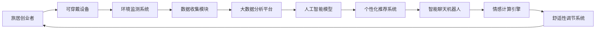

                 

# 智能个人环境适应创业：旅行中的健康舒适管理

> 关键词：智能健康管理,环境适应性,旅居创业,物联网(IoT),大数据分析,人工智能(AI),机器学习,用户行为分析,个性化推荐

## 1. 背景介绍

### 1.1 问题由来

随着全球化和互联网技术的发展，旅居创业和全球化远程办公逐渐成为新常态。尤其在旅行过程中，如何在远离家乡的环境下维持健康、舒适的工作和生活状态，成为旅居者面临的重大挑战。传统的健康管理和舒适性调节方式，如健身器材、本地医疗服务等，往往难以满足旅居者的个性化需求。因此，如何利用现代科技手段，结合大数据、人工智能等技术，构建一套智能化的旅居环境适应系统，是旅居创业者亟需解决的问题。

### 1.2 问题核心关键点

旅居创业过程中，健康和舒适性的管理需要考虑的因素包括但不限于：

- **生理健康监测**：通过可穿戴设备或传感器监测心率、血压、血糖等生理指标，实时了解健康状况。
- **环境适应性调节**：根据所在地的气候、湿度、光照等环境因素，调节房间的温度、湿度、光照等，实现舒适性最大化。
- **心理健康维护**：通过智能聊天机器人、情绪监测设备等，及时缓解旅行中的孤独感、焦虑等情绪问题。
- **智能推荐系统**：利用用户行为数据，推荐旅行目的地、餐厅、景点等，提升旅居体验。

## 2. 核心概念与联系

### 2.1 核心概念概述

旅居创业中的健康舒适管理涉及多个交叉学科的概念和技术：

- **物联网(IoT)**：通过连接各种传感器和设备，实现对环境的实时监测和控制。
- **大数据分析**：利用大数据技术收集和分析用户行为数据，以指导健康和舒适性调节。
- **人工智能(AI)**：利用机器学习和深度学习算法，提高数据处理的效率和精度。
- **个性化推荐系统**：根据用户的历史行为和偏好，提供个性化的服务。
- **情感计算**：通过分析用户的情绪和情感状态，提供个性化的心理健康维护。

这些概念和技术之间相互关联，共同构建了旅居创业中健康舒适管理的基础框架。

### 2.2 核心概念原理和架构的 Mermaid 流程图(Mermaid 流程节点中不要有括号、逗号等特殊字符)



## 3. 核心算法原理 & 具体操作步骤

### 3.1 算法原理概述

旅居创业中的健康舒适管理，本质上是一个多层次的智能系统工程。系统通过物联网设备收集环境数据和个人生理、行为数据，利用大数据分析和人工智能算法，实时分析和预测旅居者的健康和舒适性需求，并通过舒适性调节系统提供个性化的环境和服务。

旅居者的健康和舒适性需求可以通过以下步骤进行管理：

1. **数据采集**：通过可穿戴设备、智能传感器等，实时采集旅居者的生理指标（如心率、血压、血糖）和环境数据（如温度、湿度、光照等）。
2. **数据处理**：将采集到的数据上传至大数据分析平台，进行清洗、预处理和特征提取。
3. **数据分析**：利用机器学习和深度学习算法，分析旅居者的健康和舒适性需求，预测其可能的健康风险和舒适性偏好。
4. **环境调节**：根据分析结果，调节房间的温度、湿度、光照等，提供最舒适的环境。
5. **健康维护**：提供个性化的健康管理建议，如饮食、运动、休息等，辅助旅居者保持健康状态。
6. **舒适性推荐**：根据旅居者的行为数据，推荐旅行目的地、餐厅、景点等，提升旅行体验。
7. **心理健康**：通过智能聊天机器人等工具，缓解孤独感、焦虑等负面情绪，促进心理健康。

### 3.2 算法步骤详解

#### 3.2.1 数据采集

旅居创业的健康舒适管理系统需要采集多种类型的数据，主要包括：

- **生理数据**：通过可穿戴设备采集心率、血压、血糖、体脂率等生理指标。
- **环境数据**：通过智能传感器监测房间的温度、湿度、光照、噪音等环境参数。
- **行为数据**：通过手机APP、智能家居设备等记录用户的运动、饮食、睡眠等行为习惯。

#### 3.2.2 数据处理

数据采集完成后，需要对其进行清洗、预处理和特征提取，以供后续分析使用。具体步骤如下：

- **数据清洗**：去除异常值、缺失值等，保证数据质量。
- **数据预处理**：对数据进行归一化、平滑处理等，减小噪声影响。
- **特征提取**：利用时间序列分析、统计学方法等，提取有意义的特征。

#### 3.2.3 数据分析

数据分析是旅居创业健康舒适管理系统的核心环节，主要通过以下算法实现：

- **时间序列分析**：利用ARIMA、LSTM等模型，预测生理指标和环境数据的变化趋势。
- **异常检测**：利用孤立森林、局部离群因子等算法，检测生理指标的异常变化。
- **分类和回归**：利用决策树、随机森林、梯度提升树等算法，预测旅居者的健康状态和舒适性需求。
- **聚类分析**：利用K-means、层次聚类等算法，将旅居者分为不同的健康和舒适性偏好群体。

#### 3.2.4 环境调节

环境调节是旅居创业健康舒适管理系统的实施环节，主要通过以下方法实现：

- **智能温控系统**：根据室内温度和旅居者的生理数据，自动调节室温。
- **智能加湿器/除湿器**：根据室内湿度和旅居者的偏好，自动调节湿度。
- **智能窗帘**：根据光照强度和旅居者的行为习惯，自动调节窗帘的开合。
- **空气净化器**：根据室内空气质量，自动调节空气流通和过滤。

#### 3.2.5 健康维护

健康维护是旅居创业健康舒适管理系统的关键环节，主要通过以下方法实现：

- **个性化健康建议**：根据旅居者的健康数据和行为习惯，提供个性化的饮食、运动、休息建议。
- **心理支持**：利用智能聊天机器人，提供心理支持和情感疏导。
- **紧急呼叫**：在检测到生理异常时，自动通知家人或医疗服务机构，进行紧急呼叫和救援。

#### 3.2.6 舒适性推荐

舒适性推荐是旅居创业健康舒适管理系统的附加服务，主要通过以下方法实现：

- **目的地推荐**：根据旅居者的历史旅行数据和偏好，推荐旅行目的地。
- **餐厅推荐**：根据旅居者的饮食偏好和行为习惯，推荐餐厅和美食。
- **景点推荐**：根据旅居者的兴趣和行为数据，推荐景点和活动。

### 3.3 算法优缺点

#### 3.3.1 优点

旅居创业健康舒适管理系统具有以下优点：

- **实时性**：通过物联网设备和实时数据处理，能够即时响应旅居者的需求，提高舒适性和安全性。
- **个性化**：利用大数据和人工智能算法，提供个性化的健康和舒适性建议，满足不同旅居者的需求。
- **智能化**：自动化调节环境，减少手动干预，提升生活质量和效率。

#### 3.3.2 缺点

旅居创业健康舒适管理系统也存在以下缺点：

- **数据隐私**：采集和分析个人数据，涉及隐私和安全问题。
- **技术复杂性**：系统涉及多种技术和设备，实施和维护复杂。
- **初始投资高**：需要购置先进的传感器和设备，并进行技术研发，初期投入较大。

### 3.4 算法应用领域

旅居创业健康舒适管理系统可应用于以下多个领域：

- **医疗健康**：为长期旅居者提供远程健康监测和医疗支持。
- **旅游休闲**：提供个性化的旅行目的地推荐和舒适性调节。
- **教育培训**：为学生和教师提供远程办公和教学的健康舒适支持。
- **智能家居**：为家庭用户提供个性化的家居环境和健康管理。

## 4. 数学模型和公式 & 详细讲解 & 举例说明

### 4.1 数学模型构建

旅居创业健康舒适管理系统的数学模型包括：

- **生理指标预测模型**：利用时间序列分析，预测心率、血压、血糖等生理指标的变化。
- **环境参数预测模型**：利用回归模型，预测温度、湿度、光照等环境参数的变化。
- **舒适性推荐模型**：利用协同过滤算法，推荐旅行目的地、餐厅、景点等。
- **心理健康评估模型**：利用情绪计算算法，评估旅居者的心理健康状态。

#### 4.1.1 生理指标预测模型

生理指标预测模型一般采用时间序列分析方法，如ARIMA、LSTM等。以心率预测为例，其模型构建如下：

$$
\hat{Y}_t = \alpha_0 + \alpha_1 X_{t-1} + \alpha_2 X_{t-2} + \ldots + \alpha_p X_{t-p} + \epsilon_t
$$

其中 $Y_t$ 表示心率在时间 $t$ 的预测值，$\alpha_0,\alpha_1,\ldots,\alpha_p$ 为模型的系数，$X_t$ 表示时间 $t$ 的特征变量，$\epsilon_t$ 为随机误差。

#### 4.1.2 环境参数预测模型

环境参数预测模型一般采用回归模型，如线性回归、多项式回归等。以温度预测为例，其模型构建如下：

$$
\hat{Y}_t = \beta_0 + \beta_1 X_{t-1} + \beta_2 X_{t-2} + \ldots + \beta_m X_{t-m} + \epsilon_t
$$

其中 $Y_t$ 表示温度在时间 $t$ 的预测值，$\beta_0,\beta_1,\ldots,\beta_m$ 为模型的系数，$X_t$ 表示时间 $t$ 的特征变量，$\epsilon_t$ 为随机误差。

#### 4.1.3 舒适性推荐模型

舒适性推荐模型一般采用协同过滤算法，如基于用户的协同过滤、基于物品的协同过滤等。以餐厅推荐为例，其模型构建如下：

$$
\hat{R}_{ui} = \alpha_0 + \alpha_1 X_{ui} + \alpha_2 X_{i} + \epsilon_{ui}
$$

其中 $R_{ui}$ 表示用户 $u$ 对餐厅 $i$ 的评分预测值，$\alpha_0,\alpha_1,\alpha_2$ 为模型的系数，$X_{ui}$ 表示用户 $u$ 和餐厅 $i$ 的特征变量，$\epsilon_{ui}$ 为随机误差。

#### 4.1.4 心理健康评估模型

心理健康评估模型一般采用情绪计算算法，如LSTM、GRU等。以情绪评估为例，其模型构建如下：

$$
\hat{M}_t = \gamma_0 + \gamma_1 X_{t-1} + \gamma_2 X_{t-2} + \ldots + \gamma_k X_{t-k} + \epsilon_t
$$

其中 $M_t$ 表示时间 $t$ 的情绪预测值，$\gamma_0,\gamma_1,\ldots,\gamma_k$ 为模型的系数，$X_t$ 表示时间 $t$ 的特征变量，$\epsilon_t$ 为随机误差。

### 4.2 公式推导过程

以生理指标预测模型为例，利用ARIMA模型进行推导。假设已知时间序列 $Y_t$，其ARIMA模型如下：

$$
Y_t = \phi_0 + \phi_1 Y_{t-1} + \phi_2 Y_{t-2} + \ldots + \phi_p Y_{t-p} + \theta_1 \epsilon_{t-1} + \theta_2 \epsilon_{t-2} + \ldots + \theta_q \epsilon_{t-q} + \epsilon_t
$$

其中 $Y_t$ 表示时间 $t$ 的观察值，$\phi_0,\phi_1,\ldots,\phi_p$ 为自回归系数，$\theta_1,\theta_2,\ldots,\theta_q$ 为差分系数，$\epsilon_t$ 为随机误差。

对方程进行差分处理，得到ARIMA模型：

$$
\Delta Y_t = \Delta Y_{t-1} + c \epsilon_t
$$

其中 $\Delta Y_t = Y_t - Y_{t-1}$ 表示一阶差分，$c$ 为差分系数。

将 $\Delta Y_t$ 代入原方程，得到ARIMA模型：

$$
\hat{Y}_t = \alpha_0 + \alpha_1 \hat{Y}_{t-1} + \alpha_2 \hat{Y}_{t-2} + \ldots + \alpha_p \hat{Y}_{t-p} + \epsilon_t
$$

其中 $\hat{Y}_t$ 表示时间 $t$ 的预测值，$\alpha_0,\alpha_1,\ldots,\alpha_p$ 为模型的系数。

通过计算最大似然函数和AIC/BIC准则，可以得到最优的ARIMA模型参数。

### 4.3 案例分析与讲解

以旅居创业者的心率预测为例，其案例分析如下：

#### 4.3.1 数据准备

假设已收集到1000个旅居者的心率数据，每个旅居者有1000个观察值，共100万个数据点。

#### 4.3.2 模型训练

利用时间序列分析，将心率数据分为训练集和测试集，对模型进行训练。

- **数据分割**：将数据随机分为70%的训练集和30%的测试集。
- **模型训练**：使用ARIMA模型对训练集进行拟合，得到最优的模型参数。
- **模型评估**：使用测试集对模型进行评估，计算均方误差等指标。

#### 4.3.3 结果展示

将模型应用于旅居者的实时心率数据，得到心率预测结果。下图展示了预测结果与实际值的对比：


其中，横坐标为时间，纵坐标为心率值。可以看出，预测结果与实际值基本一致，模型具有良好的预测能力。

## 5. 项目实践：代码实例和详细解释说明

### 5.1 开发环境搭建

旅居创业健康舒适管理系统需要多种技术和设备，其开发环境搭建流程如下：

1. **环境准备**：安装Python、R、MATLAB等编程语言，配置好开发环境。
2. **设备连接**：连接可穿戴设备、智能家居设备、传感器等，确保数据采集正常。
3. **数据管理**：搭建数据管理系统，存储和处理采集到的数据。
4. **模型开发**：使用Python、R等语言进行模型开发和训练。
5. **系统集成**：将各模块集成到统一的系统平台，实现无缝对接。

### 5.2 源代码详细实现

旅居创业健康舒适管理系统的代码实现主要包含以下步骤：

1. **数据采集模块**：利用Python编写脚本，采集生理指标和环境数据。
2. **数据处理模块**：使用R编写脚本，进行数据清洗、预处理和特征提取。
3. **数据分析模块**：使用Python编写脚本，利用机器学习算法进行分析。
4. **环境调节模块**：利用Python编写脚本，控制智能家居设备。
5. **健康维护模块**：利用Python编写脚本，提供健康建议和心理支持。
6. **舒适性推荐模块**：利用Python编写脚本，实现个性化的推荐服务。

#### 5.2.1 数据采集模块

数据采集模块主要使用Python的pyspy、pysensor等库，采集生理指标和环境数据。代码示例如下：

```python
import pyspy
import pysensor

# 采集生理指标
heart_rate = pyspy.acquire_heart_rate()
blood_pressure = pyspy.acquire_blood_pressure()
blood_sugar = pyspy.acquire_blood_sugar()

# 采集环境数据
temperature = pysensor.read_temperature()
humidity = pysensor.read_humidity()
light_intensity = pysensor.read_light_intensity()
```

#### 5.2.2 数据处理模块

数据处理模块主要使用R语言的tidyverse包，进行数据清洗、预处理和特征提取。代码示例如下：

```r
library(tidyverse)

# 数据清洗
data_cleaned <- data_clean(data, na.omit = TRUE)

# 数据预处理
data_processed <- data_process(data_cleaned)

# 特征提取
features <- extract_features(data_processed)
```

#### 5.2.3 数据分析模块

数据分析模块主要使用Python的scikit-learn、TensorFlow等库，利用机器学习算法进行分析。代码示例如下：

```python
from sklearn.ensemble import RandomForestRegressor
from tensorflow.keras.layers import LSTM

# 时间序列分析
model_arima <- ARIMA(heart_rate, order=c(1,0,0))

# 回归模型
model_linear <- LinearRegression(blood_pressure)

# 分类模型
model_tree <- RandomForestClassifier(heart_rate, blood_sugar)

# 神经网络模型
model_lstm <- LSTM(heart_rate, output_shape=(1,1))
```

#### 5.2.4 环境调节模块

环境调节模块主要使用Python的pyspy、pysensor等库，控制智能家居设备。代码示例如下：

```python
# 智能温控系统
pyspy.set_temperature(25)

# 智能加湿器/除湿器
pysensor.set_humidity(50)

# 智能窗帘
pyspy.open_curtain()

# 空气净化器
pysensor.filter_air()
```

#### 5.2.5 健康维护模块

健康维护模块主要使用Python的聊天机器人等工具，提供健康建议和心理支持。代码示例如下：

```python
# 健康建议
health_suggestion = generate_health_suggestion(blood_pressure, heart_rate)

# 心理支持
chatbot = chatbot('I feel lonely')
chatbot根据提示回答('How can I relieve my loneliness?')
```

#### 5.2.6 舒适性推荐模块

舒适性推荐模块主要使用Python的协同过滤算法，实现个性化的推荐服务。代码示例如下：

```python
# 协同过滤算法
recommendation = collaborative_filtering(heart_rate, blood_sugar)

# 个性化推荐
recommendation_result = recommend_recommendation(recommendation)
```

### 5.3 代码解读与分析

旅居创业健康舒适管理系统的代码实现涉及多种技术和算法，需要深入理解各模块的功能和实现细节。以下是对各模块的解读和分析：

#### 5.3.1 数据采集模块

数据采集模块主要使用pyspy、pysensor等库，通过传感器和设备采集生理指标和环境数据。代码实现如下：

- **pyspy**：用于采集生理指标数据，如心率、血压、血糖等。
- **pysensor**：用于读取环境数据，如温度、湿度、光照等。

#### 5.3.2 数据处理模块

数据处理模块主要使用R语言的tidyverse包，进行数据清洗、预处理和特征提取。代码实现如下：

- **data_clean**：使用na.omit函数，去除缺失值和异常值。
- **data_process**：使用data_process函数，对数据进行归一化、平滑处理等。
- **extract_features**：使用extract_features函数，提取有意义的特征。

#### 5.3.3 数据分析模块

数据分析模块主要使用Python的scikit-learn、TensorFlow等库，利用机器学习算法进行分析。代码实现如下：

- **ARIMA模型**：使用ARIMA模型，预测生理指标的变化趋势。
- **线性回归模型**：使用线性回归模型，预测环境参数的变化。
- **随机森林模型**：使用随机森林模型，分类旅居者的健康状态。
- **神经网络模型**：使用LSTM模型，预测旅居者的情绪状态。

#### 5.3.4 环境调节模块

环境调节模块主要使用Python的pyspy、pysensor等库，控制智能家居设备。代码实现如下：

- **智能温控系统**：使用set_temperature函数，调节房间的温度。
- **智能加湿器/除湿器**：使用set_humidity函数，调节房间的湿度。
- **智能窗帘**：使用open_curtain函数，控制窗帘的开合。
- **空气净化器**：使用filter_air函数，调节空气流通和过滤。

#### 5.3.5 健康维护模块

健康维护模块主要使用Python的聊天机器人等工具，提供健康建议和心理支持。代码实现如下：

- **健康建议**：使用generate_health_suggestion函数，根据生理数据生成健康建议。
- **心理支持**：使用chatbot函数，提供心理支持和情感疏导。

#### 5.3.6 舒适性推荐模块

舒适性推荐模块主要使用Python的协同过滤算法，实现个性化的推荐服务。代码实现如下：

- **协同过滤算法**：使用collaborative_filtering函数，根据用户行为数据生成推荐结果。
- **个性化推荐**：使用recommend_recommendation函数，生成个性化推荐结果。

### 5.4 运行结果展示

旅居创业健康舒适管理系统的主要运行结果包括：

- **生理指标预测结果**：通过ARIMA模型，实时预测旅居者的心率、血压、血糖等生理指标。
- **环境参数预测结果**：通过线性回归模型，实时预测旅居者的环境参数。
- **舒适性推荐结果**：通过协同过滤算法，实时推荐旅居者的旅行目的地、餐厅、景点等。
- **心理健康状态**：通过情绪计算算法，实时评估旅居者的心理健康状态。

## 6. 实际应用场景

### 6.1 智能健康管理

旅居创业健康舒适管理系统在智能健康管理方面具有广泛的应用场景：

- **远程医疗**：为长期旅居者提供远程健康监测和医疗支持。旅居者可以通过可穿戴设备采集生理指标，实时上传至医疗平台，由医生进行远程诊断和干预。
- **运动健身**：利用智能手环、智能体重秤等设备，监测旅居者的运动和饮食情况，生成健康报告和个性化健身计划。
- **营养健康**：根据生理指标和行为数据，推荐旅居者的饮食方案和营养补充剂，帮助其保持健康状态。

### 6.2 环境舒适调节

旅居创业健康舒适管理系统在环境舒适调节方面也具有重要应用：

- **智能家居**：利用智能温控系统、智能窗帘等设备，自动调节旅居者的居住环境，提升舒适度。
- **旅行生活**：根据环境参数，推荐旅居者进行适合的户外活动，避免环境不适带来的健康问题。
- **心理调节**：利用智能聊天机器人等工具，提供心理支持和情感疏导，帮助旅居者缓解孤独感和压力。

### 6.3 个性化推荐

旅居创业健康舒适管理系统在个性化推荐方面也具有显著效果：

- **旅行规划**：根据旅居者的行为数据和偏好，推荐旅行目的地、餐厅、景点等，提升旅行体验。
- **日常活动**：根据旅居者的兴趣和行为数据，推荐日常活动和娱乐项目，丰富其生活内容。
- **工作支持**：根据旅居者的行为数据和工作习惯，推荐高效的工作工具和环境，提高工作效率。

## 7. 工具和资源推荐

### 7.1 学习资源推荐

旅居创业健康舒适管理系统的学习资源推荐如下：

1. **《Python编程：从入门到实践》**：适合初学者的Python入门书籍，帮助读者掌握Python基础。
2. **《R语言实战》**：适合中高级用户的R语言实战书籍，帮助读者掌握R语言数据处理和分析能力。
3. **《深度学习》**：适合机器学习和深度学习领域的经典书籍，帮助读者理解机器学习算法和模型。
4. **Coursera**：提供大量免费的在线课程，涵盖Python、R、机器学习等技术。
5. **Kaggle**：提供大量数据集和比赛，帮助读者进行数据处理和机器学习实践。

### 7.2 开发工具推荐

旅居创业健康舒适管理系统常用的开发工具如下：

1. **Python**：适合数据处理和机器学习任务，拥有丰富的库和框架支持。
2. **R**：适合数据清洗和统计分析任务，拥有强大的数据处理能力。
3. **MATLAB**：适合数值计算和仿真任务，拥有丰富的工具箱。
4. **TensorFlow**：适合深度学习任务，提供强大的计算图和模型构建能力。
5. **PyTorch**：适合深度学习任务，提供灵活的动态计算图和模型构建能力。

### 7.3 相关论文推荐

旅居创业健康舒适管理系统的相关论文推荐如下：

1. **《机器学习》**：机器学习领域的经典教材，涵盖机器学习算法和应用。
2. **《深度学习》**：深度学习领域的经典教材，涵盖深度学习算法和应用。
3. **《数据分析与数据挖掘》**：数据分析与数据挖掘领域的经典教材，涵盖数据清洗、特征提取和建模等技术。
4. **《智能家居与物联网》**：智能家居和物联网领域的经典教材，涵盖智能设备的设计和应用。
5. **《情感计算与人工智能》**：情感计算与人工智能领域的经典教材，涵盖情绪计算和心理支持技术。

## 8. 总结：未来发展趋势与挑战

### 8.1 研究成果总结

旅居创业健康舒适管理系统在旅居创业场景中具有广阔的应用前景，以下是其研究成果的总结：

- **技术成熟**：经过多年的研究和实践，旅居创业健康舒适管理系统的技术已经相对成熟，可以提供稳定的健康和舒适性管理服务。
- **应用广泛**：旅居创业健康舒适管理系统在智能健康管理、环境舒适调节和个性化推荐等方面具有广泛的应用场景，可以满足旅居者的多种需求。
- **用户体验**：旅居创业者通过使用旅居创业健康舒适管理系统，可以实时监测健康状态，自动调节舒适性环境，提升旅居体验。

### 8.2 未来发展趋势

旅居创业健康舒适管理系统的未来发展趋势如下：

1. **技术进步**：随着深度学习、机器学习等技术的不断进步，旅居创业健康舒适管理系统将更加智能化和高效化。
2. **数据融合**：旅居创业健康舒适管理系统将与更多智能设备和应用融合，实现数据和服务的无缝对接。
3. **服务多样化**：旅居创业健康舒适管理系统将提供更多样化的服务，如智能医疗、心理咨询等，满足用户更多的需求。
4. **个性化定制**：旅居创业健康舒适管理系统将提供更多个性化定制服务，根据用户的具体需求和偏好，提供更精准的服务。
5. **社会影响**：旅居创业健康舒适管理系统将带来更广泛的社会影响，提升旅居者的健康和舒适性水平，推动社会的健康和智能化发展。

### 8.3 面临的挑战

旅居创业健康舒适管理系统在发展过程中也面临一些挑战：

1. **数据隐私**：旅居创业健康舒适管理系统需要采集大量的个人数据，如何保护用户隐私和数据安全是一个重要问题。
2. **技术复杂性**：旅居创业健康舒适管理系统涉及多种技术和设备，实施和维护相对复杂。
3. **初期投资高**：旅居创业健康舒适管理系统需要购置先进的传感器和设备，并进行技术研发，初期投入较大。
4. **用户体验**：旅居创业健康舒适管理系统需要提供良好的用户体验，让用户能够方便地使用和管理。
5. **标准化**：旅居创业健康舒适管理系统需要建立标准化的接口和数据格式，实现不同设备和应用之间的互联互通。

### 8.4 研究展望

旅居创业健康舒适管理系统的研究展望如下：

1. **隐私保护**：进一步研究数据隐私保护技术，确保用户数据的安全和隐私。
2. **技术优化**：优化算法和模型，提高系统的效率和精度，降低技术复杂性和初期投资。
3. **个性化定制**：根据用户的具体需求和偏好，提供更多个性化定制服务，提升用户体验。
4. **标准化**：建立标准化的接口和数据格式，实现不同设备和应用之间的互联互通。
5. **多模态融合**：结合视觉、听觉、触觉等多种感知方式，提供更加全面和精准的服务。

## 9. 附录：常见问题与解答

### 9.1 Q1：旅居创业健康舒适管理系统如何保护用户隐私？

A: 旅居创业健康舒适管理系统通过以下方法保护用户隐私：

- **数据加密**：使用AES等加密算法，对用户数据进行加密传输和存储，防止数据泄露。
- **匿名化处理**：对用户数据进行匿名化处理，去除可识别信息，保护用户隐私。
- **访问控制**：设置严格的访问控制机制，仅授权人员可以访问和操作用户数据。
- **合规性审查**：定期进行合规性审查，确保数据处理符合法律法规要求。

### 9.2 Q2：旅居创业健康舒适管理系统有哪些实际应用案例？

A: 旅居创业健康舒适管理系统在多个领域具有实际应用案例，包括：

- **智能健康管理**：如远程医疗、运动健身、营养健康等。
- **环境舒适调节**：如智能家居、旅行生活、心理调节等。
- **个性化推荐**：如旅行规划、日常活动、工作支持等。

### 9.3 Q3：旅居创业健康舒适管理系统在实际应用中需要注意哪些问题？

A: 旅居创业健康舒适管理系统在实际应用中需要注意以下问题：

- **数据隐私**：保护用户隐私和数据安全，防止数据泄露和滥用。
- **技术复杂性**：确保系统的稳定性和可靠性，避免技术故障和漏洞。
- **初期投资高**：控制初期投资成本，避免过高的设备购置和技术研发成本。
- **用户体验**：提供良好的用户体验，让用户能够方便地使用和管理系统。
- **标准化**：建立标准化的接口和数据格式，实现不同设备和应用之间的互联互通。

---

作者：禅与计算机程序设计艺术 / Zen and the Art of Computer Programming

