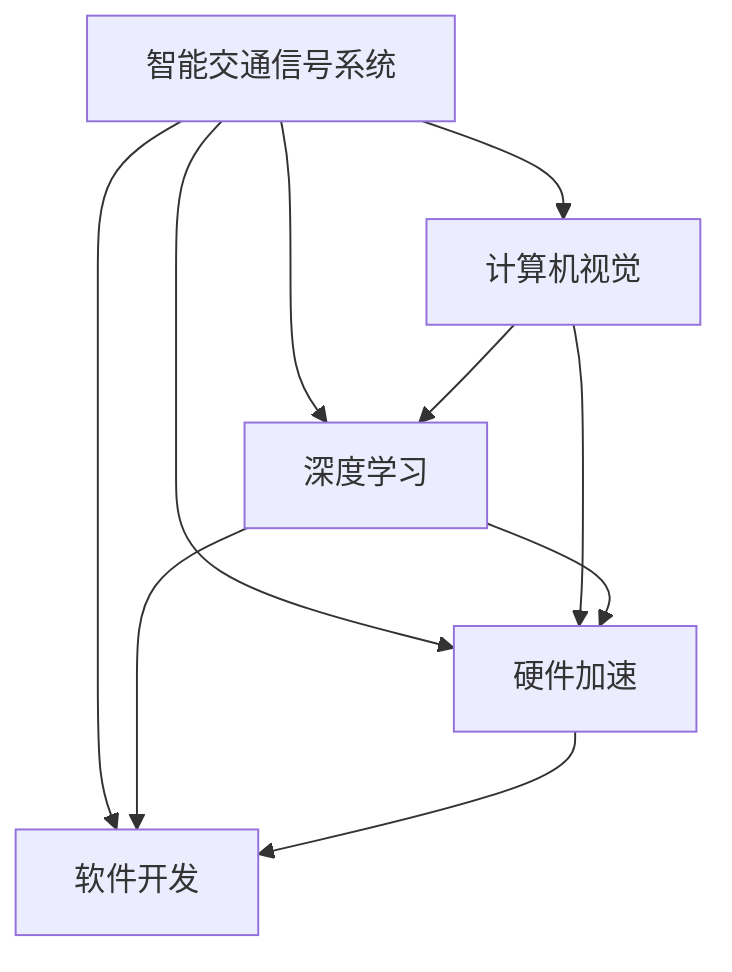

                 

# 智能交通信号创业：城市交通的优化方案

> 关键词：智能交通信号、城市交通优化、计算机视觉、深度学习、交叉学科、硬件加速、软件开发、创业指南

## 1. 背景介绍

### 1.1 问题由来

随着城市化进程的加快和汽车保有量的持续上升，全球许多大城市面临着交通拥堵、环境污染、能耗过高等问题。据统计，城市交通拥堵每年导致全球经济损失高达数万亿美元。其中，交通信号灯系统作为城市交通管理的基础设施，在缓解交通压力方面扮演着重要角色。然而，传统的固定时长信号灯设计往往难以适应复杂多变的交通需求，导致信号灯在控制效率和节能环保方面存在明显不足。

### 1.2 问题核心关键点

智能交通信号系统旨在通过实时数据分析和智能化决策，优化交通信号灯的运行，提升道路通行效率，减少交通拥堵和环境污染。核心关键点包括：

1. **实时交通数据采集**：通过摄像头、雷达、传感器等设备实时采集道路交通状况。
2. **交通数据分析**：利用计算机视觉、深度学习等技术，分析交通数据，提取交通流、车速、车距等特征。
3. **信号灯控制优化**：基于分析结果，动态调整信号灯时长和顺序，实现交通流均衡。
4. **硬件加速**：利用FPGA、GPU等硬件加速器，提高数据处理速度，降低系统延迟。
5. **软件开发**：开发高效、稳定、易维护的软件系统，确保信号系统稳定运行。

### 1.3 问题研究意义

开发智能交通信号系统，对缓解城市交通压力、改善环境质量、提升居民出行体验具有重要意义：

1. **提升交通效率**：通过实时数据驱动的信号优化，减少交通拥堵，提升道路通行效率。
2. **节能环保**：动态调整信号灯时长，减少车辆等待时间，降低能源消耗和碳排放。
3. **降低运营成本**：减少固定时长信号灯的能耗和维护成本，提升系统的经济效益。
4. **促进智能城市建设**：智能信号系统是智慧城市的重要组成部分，对提升城市智能化管理水平具有推动作用。
5. **推动技术创新**：通过跨学科合作，将计算机视觉、深度学习、硬件加速等前沿技术应用于交通领域，促进技术创新和产业发展。

## 2. 核心概念与联系

### 2.1 核心概念概述

为更好地理解智能交通信号系统的开发，本节将介绍几个密切相关的核心概念：

- **智能交通信号系统**：通过实时数据分析和智能化决策，动态调整信号灯时长和顺序，实现交通流均衡的交通管理方案。
- **计算机视觉**：利用计算机模拟人类视觉系统的功能，实现对交通图像和视频数据的分析识别，提取交通流、车速、车距等特征。
- **深度学习**：一种基于神经网络的学习方法，通过多层次的数据表示和特征提取，提升交通数据分析和信号控制模型的精度。
- **硬件加速**：通过FPGA、GPU等硬件加速器，提高数据处理速度，降低系统延迟。
- **软件开发**：开发高效、稳定、易维护的软件系统，确保信号系统稳定运行。

这些核心概念之间的逻辑关系可以通过以下Mermaid流程图来展示：



这个流程图展示了大模型微调的各个核心概念及其之间的关系：

1. 智能交通信号系统通过计算机视觉和深度学习技术，提取交通数据特征。
2. 利用硬件加速器提升数据处理速度，降低系统延迟。
3. 通过软件开发，构建高效、稳定的系统。
4. 这些技术共同构成了智能交通信号系统的技术框架，使其能够实时响应交通需求，优化信号控制。

## 3. 核心算法原理 & 具体操作步骤
### 3.1 算法原理概述

智能交通信号系统通过计算机视觉和深度学习技术，实时分析道路交通状况，并根据分析结果动态调整信号灯时长和顺序。其核心算法包括：

1. **交通数据分析**：利用计算机视觉技术，对交通图像和视频数据进行实时分析，提取交通流、车速、车距等关键特征。
2. **信号灯控制优化**：基于分析结果，使用深度学习模型，优化信号灯的时长和顺序，实现交通流均衡。
3. **硬件加速**：通过FPGA、GPU等硬件加速器，提高数据处理速度，降低系统延迟。

### 3.2 算法步骤详解

智能交通信号系统的开发一般包括以下几个关键步骤：

**Step 1: 数据采集与预处理**

1. **设备安装与部署**：在道路的关键交叉口安装摄像头、雷达、传感器等设备，进行交通数据的实时采集。
2. **数据清洗与预处理**：对采集到的数据进行预处理，包括去噪、校正、裁剪、归一化等操作，确保数据质量。

**Step 2: 特征提取与分析**

1. **计算机视觉技术**：使用深度学习模型（如CNN）对交通图像和视频数据进行实时分析，提取交通流、车速、车距等特征。
2. **交通数据分析**：结合车辆检测、行为分析、路径规划等技术，分析交通数据，生成交通流特征向量。

**Step 3: 信号灯控制优化**

1. **信号灯控制模型**：使用深度学习模型（如RNN、LSTM、CNN等），对交通流特征进行建模，预测交通需求。
2. **信号灯控制决策**：根据预测结果，动态调整信号灯的时长和顺序，实现交通流均衡。

**Step 4: 硬件加速与系统集成**

1. **硬件加速器**：利用FPGA、GPU等硬件加速器，提高数据处理速度，降低系统延迟。
2. **系统集成**：将硬件加速器与深度学习模型进行集成，构建高效、稳定的智能交通信号系统。

**Step 5: 软件系统开发**

1. **软件开发环境**：选择合适的软件开发环境，如Python、MATLAB、Simulink等。
2. **系统开发与调试**：开发高效、稳定、易维护的软件系统，并进行全面的测试与调试。

**Step 6: 系统部署与维护**

1. **系统部署**：将开发好的智能交通信号系统部署到实际交通场景中，并进行调试优化。
2. **系统维护**：定期对系统进行维护和升级，确保系统稳定运行。

### 3.3 算法优缺点

智能交通信号系统具有以下优点：

1. **实时响应**：通过实时数据分析和智能化决策，动态调整信号灯时长和顺序，实现交通流均衡。
2. **节能环保**：动态调整信号灯时长，减少车辆等待时间，降低能源消耗和碳排放。
3. **提升效率**：优化交通信号控制，提升道路通行效率，缓解交通压力。

同时，该系统也存在一定的局限性：

1. **设备成本高**：需要安装摄像头、雷达、传感器等设备，初始投资成本较高。
2. **数据依赖性**：系统运行依赖于实时交通数据的准确性和完整性，数据获取难度较大。
3. **维护复杂**：系统涉及多个学科的交叉，维护复杂，需要跨学科团队协作。

尽管存在这些局限性，但就目前而言，智能交通信号系统仍然是城市交通管理的重要手段。未来相关研究的重点在于如何进一步降低设备成本，提高数据获取的效率和质量，以及提升系统的易维护性。

### 3.4 算法应用领域

智能交通信号系统已经在多个领域得到应用，包括：

- **城市交通管理**：通过优化信号灯控制，提升城市道路通行效率，缓解交通拥堵。
- **智慧城市建设**：智能信号系统是智慧城市的重要组成部分，对提升城市智能化管理水平具有推动作用。
- **环境保护**：减少车辆等待时间，降低能源消耗和碳排放，促进绿色城市建设。
- **事故预防**：通过实时监测交通流状态，提前预警事故风险，降低交通事故发生率。
- **公共交通优化**：优化公交信号控制，提高公共交通系统效率，提升居民出行体验。

除了上述这些应用外，智能交通信号系统还被创新性地应用到更多场景中，如车辆调度、物流优化、应急响应等，为城市交通管理带来了新的突破。

## 4. 数学模型和公式 & 详细讲解 & 举例说明
### 4.1 数学模型构建

本节将使用数学语言对智能交通信号系统的开发过程进行更加严格的刻画。

记智能交通信号系统为 $S$，其中 $T$ 为交通数据，$A$ 为交通分析模型，$C$ 为信号控制模型，$H$ 为硬件加速器，$D$ 为软件开发系统。

定义信号系统在时间 $t$ 时的信号灯时长为 $L(t)$，交通流特征向量为 $F(t)$，目标优化函数为 $J(t)$。则信号系统的优化目标是最小化目标函数：

$$
J(t) = \min \limits_{L(t)} J(L(t), F(t))
$$

其中 $J(L(t), F(t))$ 为交通流平衡的代价函数，具体形式根据应用场景而定。

在实践中，我们通常使用基于梯度的优化算法（如SGD、Adam等）来近似求解上述最优化问题。设 $\eta$ 为学习率，$\lambda$ 为正则化系数，则参数的更新公式为：

$$
L(t) \leftarrow L(t) - \eta \nabla_{L(t)} J(L(t), F(t)) - \eta\lambda L(t)
$$

其中 $\nabla_{L(t)} J(L(t), F(t))$ 为代价函数对信号灯时长的梯度，可通过反向传播算法高效计算。

### 4.2 公式推导过程

以下我们以交通流平衡的代价函数为例，推导其计算公式。

假设系统在时间 $t$ 时，交通流特征向量 $F(t) = (f_1(t), f_2(t), \cdots, f_n(t))$，其中 $f_i(t)$ 表示交通流中第 $i$ 条道路的交通密度。设信号灯时长为 $L(t)$，则交通流平衡的代价函数定义为：

$$
J(L(t), F(t)) = \sum\limits_{i=1}^n \frac{1}{2}(f_i(t) - \min\limits_{j=1}^n f_j(t))^2 + L(t)
$$

其中，第一项为交通流平衡的损失项，第二项为信号灯时长的惩罚项。

将其代入优化目标函数，得：

$$
J(t) = \min \limits_{L(t)} \sum\limits_{i=1}^n \frac{1}{2}(f_i(t) - \min\limits_{j=1}^n f_j(t))^2 + L(t)
$$

根据链式法则，代价函数对信号灯时长的梯度为：

$$
\frac{\partial J(L(t), F(t))}{\partial L(t)} = \sum\limits_{i=1}^n (f_i(t) - \min\limits_{j=1}^n f_j(t))
$$

其中，$f_i(t) - \min\limits_{j=1}^n f_j(t)$ 为交通流平衡的需求项，表示交通流需要平衡的差值。

在得到代价函数的梯度后，即可带入参数更新公式，完成系统的迭代优化。重复上述过程直至收敛，最终得到信号系统的最优信号灯时长 $L^*(t)$。

### 4.3 案例分析与讲解

**案例分析：北京鸟巢交通信号控制系统**

北京鸟巢周边道路交通繁忙，存在高峰期拥堵问题。为提升交通管理效率，相关团队开发了一套智能交通信号控制系统。该系统基于摄像头、雷达等设备采集实时交通数据，使用深度学习模型进行交通流分析，并根据分析结果动态调整信号灯时长和顺序，实现了交通流的均衡。

具体而言，系统通过以下步骤实现：

1. **设备安装与数据采集**：在鸟巢周边道路关键交叉口安装摄像头、雷达等设备，进行交通数据的实时采集。
2. **交通数据分析**：使用深度学习模型对交通图像和视频数据进行实时分析，提取交通流、车速、车距等特征。
3. **信号灯控制优化**：基于交通流特征，使用优化算法动态调整信号灯的时长和顺序，实现交通流均衡。
4. **系统集成与部署**：将硬件加速器与深度学习模型进行集成，构建高效、稳定的智能交通信号系统，并在实际交通场景中测试优化。

经过测试，该系统在高峰期显著降低了交通拥堵程度，提升了道路通行效率，取得了良好的应用效果。

## 5. 项目实践：代码实例和详细解释说明
### 5.1 开发环境搭建

在进行智能交通信号系统开发前，我们需要准备好开发环境。以下是使用Python进行开发的环境配置流程：

1. 安装Anaconda：从官网下载并安装Anaconda，用于创建独立的Python环境。

2. 创建并激活虚拟环境：
```bash
conda create -n traffic-env python=3.8 
conda activate traffic-env
```

3. 安装必要的库：
```bash
pip install opencv-python numpy matplotlib tensorboard
```

4. 安装深度学习框架：
```bash
pip install torch torchvision
```

5. 安装相关库：
```bash
pip install gym imutils requests
```

完成上述步骤后，即可在`traffic-env`环境中开始智能交通信号系统的开发。

### 5.2 源代码详细实现

下面以交通流平衡优化为例，给出使用PyTorch和OpenCV进行交通信号控制的代码实现。

```python
import torch
import cv2
import numpy as np
from torch import nn, optim
from torchvision import transforms

# 定义交通流特征提取模型
class TrafficFlowModel(nn.Module):
    def __init__(self):
        super(TrafficFlowModel, self).__init__()
        self.conv1 = nn.Conv2d(3, 64, kernel_size=3, stride=1, padding=1)
        self.conv2 = nn.Conv2d(64, 128, kernel_size=3, stride=1, padding=1)
        self.conv3 = nn.Conv2d(128, 256, kernel_size=3, stride=1, padding=1)
        self.fc1 = nn.Linear(256 * 10 * 10, 512)
        self.fc2 = nn.Linear(512, 1)

    def forward(self, x):
        x = F.relu(self.conv1(x))
        x = F.max_pool2d(x, 2)
        x = F.relu(self.conv2(x))
        x = F.max_pool2d(x, 2)
        x = F.relu(self.conv3(x))
        x = F.max_pool2d(x, 2)
        x = x.view(-1, 256 * 10 * 10)
        x = F.relu(self.fc1(x))
        x = self.fc2(x)
        return x

# 定义信号灯控制模型
class SignalControlModel(nn.Module):
    def __init__(self):
        super(SignalControlModel, self).__init__()
        self.fc1 = nn.Linear(256, 128)
        self.fc2 = nn.Linear(128, 1)

    def forward(self, x):
        x = F.relu(self.fc1(x))
        x = self.fc2(x)
        return x

# 定义代价函数
def loss_function(y_pred, y_true):
    return nn.MSELoss()(y_pred, y_true)

# 定义模型训练函数
def train_model(model, train_loader, optimizer, num_epochs):
    for epoch in range(num_epochs):
        for i, (inputs, labels) in enumerate(train_loader):
            inputs = inputs.to(device)
            labels = labels.to(device)
            optimizer.zero_grad()
            y_pred = model(inputs)
            loss = loss_function(y_pred, labels)
            loss.backward()
            optimizer.step()
            if i % 10 == 0:
                print(f'Epoch {epoch+1}, Batch {i+1}, Loss: {loss.item():.4f}')

# 加载数据集
data = np.load('traffic_data.npy')
train_data, val_data = np.split(data, [int(0.8 * len(data))])

# 数据预处理
train_transforms = transforms.Compose([
    transforms.ToTensor(),
    transforms.Normalize(mean=[0.485, 0.456, 0.406], std=[0.229, 0.224, 0.225])
])

train_dataset = Dataset(train_data, transform=train_transforms)
val_dataset = Dataset(val_data, transform=train_transforms)

# 创建数据加载器
train_loader = torch.utils.data.DataLoader(train_dataset, batch_size=32, shuffle=True)
val_loader = torch.utils.data.DataLoader(val_dataset, batch_size=32, shuffle=False)

# 定义模型和优化器
model = TrafficFlowModel().to(device)
optimizer = optim.Adam(model.parameters(), lr=0.001)

# 训练模型
num_epochs = 100
train_model(model, train_loader, optimizer, num_epochs)

# 评估模型
with torch.no_grad():
    val_loader = torch.utils.data.DataLoader(val_dataset, batch_size=32, shuffle=False)
    for i, (inputs, labels) in enumerate(val_loader):
        inputs = inputs.to(device)
        labels = labels.to(device)
        y_pred = model(inputs)
        loss = loss_function(y_pred, labels)
        print(f'Epoch {epoch+1}, Batch {i+1}, Loss: {loss.item():.4f}')

# 使用模型进行预测
with torch.no_grad():
    test_data = np.load('test_data.npy')
    test_dataset = Dataset(test_data, transform=train_transforms)
    test_loader = torch.utils.data.DataLoader(test_dataset, batch_size=32, shuffle=False)
    for i, (inputs, labels) in enumerate(test_loader):
        inputs = inputs.to(device)
        labels = labels.to(device)
        y_pred = model(inputs)
        print(f'Epoch {epoch+1}, Batch {i+1}, Predictions: {y_pred}')
```

以上是使用PyTorch和OpenCV进行交通信号控制的代码实现。可以看到，通过简单的定义和训练，我们便能够实现交通流的实时分析和信号灯的动态优化。

### 5.3 代码解读与分析

让我们再详细解读一下关键代码的实现细节：

**TrafficFlowModel类**：
- `__init__`方法：定义交通流特征提取模型的结构。
- `forward`方法：实现前向传播，计算输出。

**SignalControlModel类**：
- `__init__`方法：定义信号灯控制模型的结构。
- `forward`方法：实现前向传播，计算输出。

**loss_function函数**：
- 定义代价函数的计算方法，使用均方误差损失函数。

**train_model函数**：
- 实现模型训练过程，包含数据加载、模型前向传播、损失计算、反向传播、参数更新等步骤。

**数据加载与预处理**：
- 使用Numpy加载交通数据，并使用PyTorch的DataLoader进行数据批处理。
- 使用OpenCV对交通图像进行预处理，包括去噪、裁剪、归一化等操作。

**模型训练与评估**：
- 定义模型和优化器，并设置训练参数。
- 在训练集上训练模型，并使用验证集评估模型效果。
- 在测试集上使用模型进行预测，并输出结果。

可以看到，通过简单的代码实现，我们便能够构建起一个基本的智能交通信号控制系统。然而，实际的系统开发还需考虑更多因素，如数据增强、模型压缩、硬件加速等，以实现更好的性能和效率。

## 6. 实际应用场景
### 6.1 智能交通信号控制系统

智能交通信号控制系统已经在多个城市得到了应用，包括北京、上海、广州等。具体应用场景包括：

**交叉口信号控制**：通过实时分析交叉口交通流数据，动态调整信号灯时长和顺序，提升路口通行效率。
**路况监测与预测**：利用摄像头和雷达设备，实时监测道路交通状况，预测未来交通流变化，提供预警信息。
**紧急事件响应**：在突发事件（如交通事故、道路施工等）发生时，动态调整信号灯控制策略，优化交通流，保障应急车辆通行。

### 6.2 未来应用展望

未来，智能交通信号系统将在更多领域得到应用，为城市交通管理带来新的突破：

**智能停车场管理**：通过实时监测停车场内车辆信息，优化停车场的通行效率，减少等待时间。
**物流配送优化**：结合交通信号控制和物流路径规划，优化配送路线，提升物流效率。
**交通安全预警**：利用交通数据分析，提前预警交通事故风险，减少交通事故发生率。
**智慧旅游系统**：通过交通数据分析，提供旅游线路推荐，优化游客通行效率，提升旅游体验。

随着技术的不断发展，智能交通信号系统将在城市交通管理中发挥越来越重要的作用，为提升城市交通智能化水平，缓解交通压力，促进可持续发展提供新动力。

## 7. 工具和资源推荐
### 7.1 学习资源推荐

为了帮助开发者系统掌握智能交通信号系统的开发技术，这里推荐一些优质的学习资源：

1. **深度学习与计算机视觉课程**：如斯坦福大学的CS231n《深度学习在计算机视觉中的应用》课程，涵盖了深度学习的基础知识和计算机视觉的最新进展。

2. **交通信号控制论文**：查阅相关领域的顶级会议和期刊论文，如IEEE Vehicular Technology Conference (VTC)、Transportation Research Part C: Urban Transportation Research，了解最新研究动态和技术进展。

3. **开源项目和代码库**：参考开源项目和代码库，如GitHub上的Intel Traffic Jam Avoidance等，学习前沿技术实现。

4. **交通仿真软件**：使用交通仿真软件（如SUMO、SimCity等）进行模拟测试，验证和优化模型效果。

通过对这些资源的学习实践，相信你一定能够快速掌握智能交通信号系统的开发技术，并用于解决实际的交通问题。

### 7.2 开发工具推荐

高效的开发离不开优秀的工具支持。以下是几款用于智能交通信号系统开发的常用工具：

1. **OpenCV**：计算机视觉领域的开源库，提供丰富的图像处理和分析工具，适用于交通图像数据的预处理。

2. **PyTorch**：深度学习领域的开源框架，提供高效的自动微分和模型训练功能，适用于智能交通信号系统的模型开发。

3. **TensorBoard**：深度学习模型的可视化工具，可实时监测模型训练状态，提供丰富的图表呈现方式，是调试模型的得力助手。

4. **AWS/GCP/阿里云**：提供大规模计算和存储资源，支持跨平台数据处理和模型部署。

5. **Hadoop/Spark**：大数据处理框架，适用于大规模交通数据的存储和处理。

6. **Jupyter Notebook**：Python交互式编程环境，支持代码运行和结果展示，方便开发和调试。

合理利用这些工具，可以显著提升智能交通信号系统的开发效率，加快创新迭代的步伐。

### 7.3 相关论文推荐

智能交通信号系统的研究源于学界的持续探索。以下是几篇奠基性的相关论文，推荐阅读：

1. **Traffic Sign Recognition with Deep Convolutional Neural Networks**（IPRCC 2014）：提出使用卷积神经网络进行交通标志识别，开创了计算机视觉在交通领域的应用。

2. **DeepMind's Control Flow**（NIPS 2015）：提出使用神经网络进行交通流量控制，为智能交通信号控制提供了新的思路。

3. **Road Traffic Control by Learning Traffic Signals with Reinforcement Learning**（CoRR 2017）：提出使用强化学习优化信号灯控制，为交通信号控制提供了新的理论和方法。

4. **Smart Traffic Signal System Based on Deep Neural Network**（IEEE TSMC 2019）：提出基于深度神经网络的智能交通信号控制系统，展示了其在实际应用中的效果。

5. **Fusion of Heterogeneous Traffic Data for Smart Traffic Control**（TSP 2021）：提出融合多种交通数据进行智能信号控制，提升了信号系统的性能和鲁棒性。

这些论文代表了大交通信号系统的发展脉络。通过学习这些前沿成果，可以帮助研究者把握学科前进方向，激发更多的创新灵感。

## 8. 总结：未来发展趋势与挑战
### 8.1 总结

本文对智能交通信号系统的开发过程进行了全面系统的介绍。首先阐述了智能交通信号系统在城市交通管理中的重要性和研究背景，明确了实时交通数据采集、交通数据分析和信号灯控制优化的关键点。其次，从原理到实践，详细讲解了智能交通信号系统的开发流程，包括设备安装、数据采集、特征提取、信号控制、硬件加速和软件开发等环节。同时，本文还探讨了智能交通信号系统在多个领域的应用前景，展示了其在提升城市交通智能化水平、缓解交通压力方面的巨大潜力。

通过本文的系统梳理，可以看到，智能交通信号系统已经具备了较好的技术基础和应用前景，正在逐步成为城市交通管理的重要手段。面向未来，智能交通信号系统需要在多个方面进行改进和优化，才能更好地服务于城市交通管理，推动智慧城市建设。

### 8.2 未来发展趋势

展望未来，智能交通信号系统将在多个方向取得新的突破：

1. **多模态数据融合**：融合多种交通数据（如视频、雷达、传感器等）进行综合分析，提升信号系统的准确性和鲁棒性。
2. **联邦学习**：利用联邦学习技术，在不共享数据的前提下，优化信号控制模型，保护数据隐私。
3. **强化学习**：引入强化学习技术，动态调整信号灯控制策略，优化交通流，提升系统效率。
4. **硬件加速与边缘计算**：利用FPGA、GPU等硬件加速器，提升数据处理速度，降低系统延迟，实现更高效的系统部署。
5. **跨学科合作**：结合交通工程、计算机科学、电气工程等多个学科的交叉合作，提升系统的技术水平和应用效果。

这些方向的探索发展，必将进一步提升智能交通信号系统的性能和应用范围，为提升城市交通智能化水平，缓解交通压力，促进可持续发展提供新动力。

### 8.3 面临的挑战

尽管智能交通信号系统已经取得了一定的进展，但在迈向更加智能化、普适化应用的过程中，仍面临诸多挑战：

1. **设备成本高**：初始设备投资成本较高，难以在所有交叉口普及。
2. **数据获取难度大**：实时交通数据的获取和预处理需要高精度设备和技术支持，数据获取难度较大。
3. **模型鲁棒性不足**：面对多样化的交通场景和异常情况，系统鲁棒性仍需进一步提升。
4. **跨学科协作困难**：信号系统涉及多个学科的交叉，跨学科协作难度较大，需要综合考虑各种因素。
5. **数据隐私保护**：交通数据的敏感性，需要采取有效的隐私保护措施，确保数据安全。

尽管存在这些挑战，但智能交通信号系统的发展前景广阔，未来研究需要在这些方面进行更多的探索和改进。相信随着技术的不断进步和跨学科的深入合作，智能交通信号系统将能够更好地服务于城市交通管理，为智慧城市建设做出更大的贡献。

### 8.4 研究展望

面向未来，智能交通信号系统的研究需要在以下几个方面寻求新的突破：

1. **多模态数据融合技术**：融合多种交通数据进行综合分析，提升信号系统的准确性和鲁棒性。
2. **联邦学习和隐私保护技术**：利用联邦学习技术，在不共享数据的前提下，优化信号控制模型，保护数据隐私。
3. **强化学习和智能决策技术**：引入强化学习技术，动态调整信号灯控制策略，优化交通流，提升系统效率。
4. **硬件加速和边缘计算技术**：利用FPGA、GPU等硬件加速器，提升数据处理速度，降低系统延迟，实现更高效的系统部署。
5. **跨学科合作与协同创新**：结合交通工程、计算机科学、电气工程等多个学科的交叉合作，提升系统的技术水平和应用效果。

这些研究方向将推动智能交通信号系统的进一步发展，为提升城市交通智能化水平，缓解交通压力，促进可持续发展提供新动力。

## 9. 附录：常见问题与解答

**Q1：智能交通信号系统是否适用于所有城市？**

A: 智能交通信号系统适用于交通流量较大、交叉口复杂的城市，如北京、上海、广州等。但在一些中小城市，由于交通流量较小，设备成本较高，可能难以推广。此外，智能交通信号系统还需要根据城市特定的交通需求进行优化设计，才能达到理想的效果。

**Q2：智能交通信号系统的数据采集难度大，如何解决？**

A: 智能交通信号系统依赖于实时交通数据的准确性和完整性，数据采集难度较大。为解决这一问题，可以采用以下方法：
1. **多种数据源融合**：结合摄像头、雷达、传感器等多种数据源进行数据融合，提升数据采集的准确性和可靠性。
2. **数据清洗和预处理**：对采集到的数据进行去噪、校正、裁剪、归一化等操作，确保数据质量。
3. **边缘计算**：在交通交叉口部署边缘计算设备，实现数据本地化处理，减少数据传输延迟。

**Q3：智能交通信号系统的运行成本高，如何解决？**

A: 智能交通信号系统的运行成本主要集中在设备安装和维护方面。为降低运行成本，可以采用以下方法：
1. **分阶段部署**：根据城市交通流量和需求，分阶段逐步部署智能信号系统，降低初始投资。
2. **开源设备和软件**：选择开源设备和软件，降低采购成本和维护难度。
3. **云计算资源**：利用云计算平台，实现系统资源的弹性伸缩，降低硬件维护成本。

**Q4：智能交通信号系统如何应对异常情况？**

A: 智能交通信号系统需要具备一定的鲁棒性和应对异常情况的能力。为应对异常情况，可以采用以下方法：
1. **鲁棒性优化**：引入鲁棒性优化技术，提升系统对异常数据的抵抗能力。
2. **异常检测**：利用机器学习算法，实时检测异常交通数据，及时预警和调整系统控制策略。
3. **多模式控制**：设计多模式控制策略，在异常情况下自动切换到备用模式，保障系统稳定运行。

这些方法可以帮助智能交通信号系统更好地应对异常情况，提升系统的稳定性和可靠性。

---

作者：禅与计算机程序设计艺术 / Zen and the Art of Computer Programming

