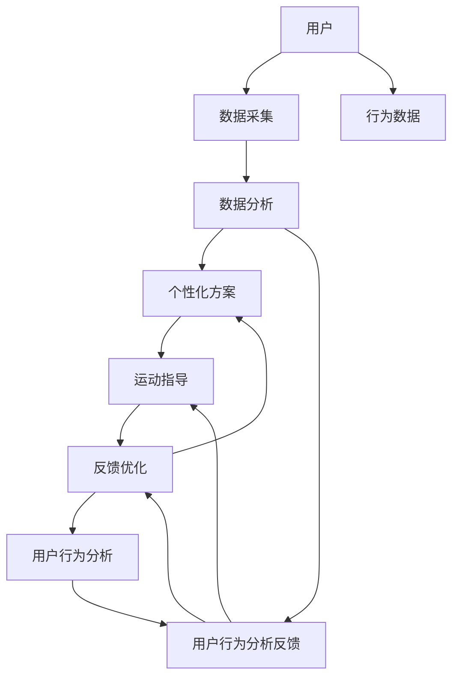

                 

# 智能健身创业：个性化运动指导的未来

> 关键词：智能健身, 个性化, 运动指导, 数据分析, 物联网, 用户行为, 人工智能, 深度学习, 健康管理

## 1. 背景介绍

在数字化、智能化的浪潮下，健身行业也正在经历一场革命性的变革。越来越多的消费者追求个性化的健身体验，不再满足于传统的机械训练和营养指导。智能健身创业，通过将大数据、人工智能、物联网等前沿技术应用到健身领域，为用户提供量身定制的运动指导和健康管理方案，将成为未来的趋势。本文将从背景、核心概念、算法原理、项目实践、实际应用、未来展望、资源推荐和总结等多个维度，深入探讨智能健身创业的个性化运动指导的实现路径。

## 2. 核心概念与联系

### 2.1 核心概念概述

智能健身创业的核心概念包括以下几个方面：

- **智能健身**：通过融合大数据、人工智能、物联网等技术，为用户提供个性化的运动指导和健康管理方案。
- **个性化运动指导**：根据用户的身体状况、运动历史、兴趣爱好等数据，制定适合其的个性化训练计划和营养方案。
- **数据分析**：利用机器学习和数据挖掘技术，从用户行为数据中提取有价值的信息，为用户提供精准的指导。
- **物联网**：通过各类智能硬件设备和传感器，实时监测用户的运动状态和生理指标，提供动态的反馈和调整。
- **用户行为分析**：通过分析用户的行为数据，预测其健身需求和行为变化趋势，优化运动指导方案。

这些核心概念之间通过数据链条紧密联系，共同构建起智能健身创业的生态系统。

### 2.2 核心概念原理和架构的 Mermaid 流程图



这个流程图展示了智能健身创业的各个环节，包括数据采集、数据分析、个性化方案制定、运动指导、反馈优化和用户行为分析，每个环节通过数据链条与用户紧密联系。

## 3. 核心算法原理 & 具体操作步骤

### 3.1 算法原理概述

个性化运动指导的算法原理主要包括以下几个步骤：

1. **数据采集**：通过各类智能硬件设备和传感器，采集用户的运动数据、生理指标和环境信息等。
2. **数据分析**：利用机器学习和数据挖掘技术，从采集的数据中提取有价值的信息，如用户的运动习惯、生理状况和兴趣爱好等。
3. **个性化方案制定**：根据分析结果，制定适合用户的个性化训练计划和营养方案。
4. **运动指导**：利用人工智能技术，动态调整训练计划和营养方案，实时指导用户进行运动。
5. **反馈优化**：根据用户反馈，调整和优化个性化方案，不断提高运动指导的精准度。

### 3.2 算法步骤详解

#### 3.2.1 数据采集

数据采集是智能健身创业的基础。通过各类智能硬件设备和传感器，可以实时监测用户的运动状态和生理指标。例如：

- **运动设备**：智能手表、健身机、跑步机等，可以记录用户的运动数据如步数、心率、卡路里消耗等。
- **生理传感器**：心电图(ECG)、心率传感器、血氧传感器等，可以实时监测用户的生理指标。
- **环境传感器**：气温、湿度、光照等传感器，可以记录用户运动时的环境条件。

#### 3.2.2 数据分析

数据分析是个性化运动指导的核心。利用机器学习和数据挖掘技术，可以从采集的数据中提取有价值的信息。例如：

- **用户运动习惯**：通过分析用户的运动数据，可以了解其日常的锻炼习惯，如运动频率、运动时长、运动种类等。
- **生理状况**：通过分析生理指标，可以了解用户的身体状况，如心率变异性、恢复时间等。
- **兴趣爱好**：通过分析用户的兴趣爱好和运动反馈，可以了解其喜欢的运动类型和难度等。

#### 3.2.3 个性化方案制定

根据数据分析结果，制定适合用户的个性化训练计划和营养方案。例如：

- **训练计划**：根据用户的运动习惯、身体状况和兴趣爱好，制定个性化的训练计划，包括运动类型、强度、时长和频率等。
- **营养方案**：根据用户的身体状况和运动需求，制定个性化的营养方案，包括饮食种类、营养摄入量和饮食习惯等。

#### 3.2.4 运动指导

利用人工智能技术，动态调整训练计划和营养方案，实时指导用户进行运动。例如：

- **AI教练**：利用深度学习技术，训练一个AI教练，根据用户的数据和反馈，实时调整训练计划和指导用户进行运动。
- **智能设备**：通过与智能设备的交互，实时监测用户的运动状态，并提供实时的指导和建议。

#### 3.2.5 反馈优化

根据用户反馈，调整和优化个性化方案，不断提高运动指导的精准度。例如：

- **用户反馈**：通过问卷调查、运动记录和生理监测等方式，收集用户的反馈信息。
- **方案调整**：根据用户的反馈，调整训练计划和营养方案，提高其满意度和运动效果。
- **数据分析**：利用机器学习技术，分析用户反馈数据，优化运动指导方案。

### 3.3 算法优缺点

个性化运动指导的算法具有以下优点：

1. **精准度**：通过大数据和人工智能技术，可以提供高度个性化的运动指导，满足用户的个性化需求。
2. **便捷性**：用户可以随时随地获取个性化的指导，无需专业教练的现场指导。
3. **实时性**：通过实时监测和动态调整，可以及时优化运动指导，提高用户体验。

同时，该算法也存在以下缺点：

1. **隐私问题**：采集大量的用户数据，需要保证数据的安全性和隐私保护。
2. **数据质量**：数据的采集和分析过程需要高质量的数据，否则会影响指导效果。
3. **技术复杂性**：涉及多种技术和领域，需要高水平的技术团队进行开发和维护。

### 3.4 算法应用领域

个性化运动指导的算法主要应用于以下几个领域：

- **健身应用**：如Keep、MyFitnessPal等，通过智能设备采集数据，提供个性化的训练和营养指导。
- **健康管理**：如Apple Health、Fitbit等，通过各类传感器监测生理指标，提供个性化的健康管理方案。
- **体育训练**：如Adobe Sensei、LumenBody等，通过数据分析和AI教练，提供个性化的体育训练方案。
- **运动康复**：如Rehabspace、Upcomer等，通过实时监测和调整，提供个性化的运动康复方案。

## 4. 数学模型和公式 & 详细讲解 & 举例说明

### 4.1 数学模型构建

个性化运动指导的数学模型主要包括以下几个部分：

1. **用户数据模型**：描述用户的基本信息和运动数据，如年龄、性别、身高、体重、运动频率、运动时长等。
2. **生理指标模型**：描述用户的生理指标，如心率、血氧、血压等。
3. **运动指导模型**：描述运动指导方案，如运动类型、强度、时长和频率等。
4. **反馈优化模型**：描述用户反馈数据，如满意度、运动效果等。

### 4.2 公式推导过程

#### 4.2.1 用户数据模型

用户数据模型的构建基于用户的基本信息和运动数据。例如：

$$
\begin{aligned}
&\text{用户数据} = \{x, y\} \\
&x = (\text{年龄}, \text{性别}, \text{身高}, \text{体重}, \text{运动频率}, \text{运动时长}, \ldots) \\
&y = (\text{运动类型}, \text{运动强度}, \text{运动时长}, \ldots)
\end{aligned}
$$

#### 4.2.2 生理指标模型

生理指标模型的构建基于用户的生理监测数据。例如：

$$
\begin{aligned}
&\text{生理指标} = \{r, s, t\} \\
&r = (\text{心率}, \text{血氧}, \text{血压}, \ldots) \\
&s = (\text{心率变异性}, \text{恢复时间}, \ldots)
\end{aligned}
$$

#### 4.2.3 运动指导模型

运动指导模型的构建基于用户数据和生理指标，利用机器学习技术，预测适合用户的训练计划和营养方案。例如：

$$
\begin{aligned}
&\text{运动指导} = \{u, v\} \\
&u = (\text{运动类型}, \text{运动强度}, \text{运动时长}, \ldots) \\
&v = (\text{饮食种类}, \text{营养摄入量}, \text{饮食习惯}, \ldots)
\end{aligned}
$$

#### 4.2.4 反馈优化模型

反馈优化模型的构建基于用户的反馈数据，利用机器学习技术，优化运动指导方案。例如：

$$
\begin{aligned}
&\text{反馈数据} = \{a, b\} \\
&a = (\text{满意度}, \text{运动效果}, \ldots) \\
&b = (\text{建议改进}, \text{用户反馈}, \ldots)
\end{aligned}
$$

### 4.3 案例分析与讲解

#### 4.3.1 用户数据模型的构建

用户数据模型的构建可以通过问卷调查、智能设备和传感器等方式获取。例如：

1. **问卷调查**：设计一份详细的问卷，了解用户的基本信息和运动习惯。
2. **智能设备**：利用智能手表、健身机等设备，记录用户的运动数据。
3. **传感器**：利用心电图、心率传感器等，实时监测用户的生理指标。

#### 4.3.2 生理指标模型的构建

生理指标模型的构建需要高精度的传感器设备，例如：

1. **心电图(ECG)**：实时监测用户的心电图数据，分析其心脏健康状况。
2. **心率传感器**：实时监测用户的心率数据，分析其运动强度和恢复时间。
3. **血氧传感器**：实时监测用户的血氧数据，分析其呼吸和循环系统的健康状况。

#### 4.3.3 运动指导模型的构建

运动指导模型的构建需要利用机器学习技术，例如：

1. **深度学习**：利用深度学习技术，训练一个AI教练，根据用户数据和生理指标，动态调整训练计划和营养方案。
2. **强化学习**：利用强化学习技术，优化用户的运动计划，提高运动效果。

#### 4.3.4 反馈优化模型的构建

反馈优化模型的构建需要及时收集用户的反馈数据，例如：

1. **问卷调查**：设计问卷，了解用户对运动指导的满意度和不满意度。
2. **运动记录**：记录用户的运动数据，分析其运动效果和变化趋势。
3. **生理监测**：利用生理传感器，监测用户的生理指标，分析其运动状态和健康状况。

## 5. 项目实践：代码实例和详细解释说明

### 5.1 开发环境搭建

在进行项目实践前，我们需要准备好开发环境。以下是使用Python进行PyTorch开发的环境配置流程：

1. 安装Anaconda：从官网下载并安装Anaconda，用于创建独立的Python环境。

2. 创建并激活虚拟环境：
```bash
conda create -n myenv python=3.8 
conda activate myenv
```

3. 安装PyTorch：根据CUDA版本，从官网获取对应的安装命令。例如：
```bash
conda install pytorch torchvision torchaudio cudatoolkit=11.1 -c pytorch -c conda-forge
```

4. 安装TensorFlow：
```bash
conda install tensorflow
```

5. 安装Flask：用于搭建Web应用，方便用户界面交互。
```bash
conda install flask
```

6. 安装相关库：
```bash
pip install numpy pandas scikit-learn requests
```

完成上述步骤后，即可在`myenv`环境中开始项目实践。

### 5.2 源代码详细实现

以下是一个简单的智能健身应用项目，包含数据采集、数据分析和运动指导三个模块。

**data_collection.py**：数据采集模块，通过智能设备和传感器采集用户数据和生理指标。

```python
import time
import requests

class DataCollector:
    def __init__(self, device_id):
        self.device_id = device_id
        self.data = []
        
    def start(self):
        while True:
            data = self.collect_data()
            self.data.append(data)
            time.sleep(10)
    
    def collect_data(self):
        # 通过API采集数据
        response = requests.get(f'https://api.example.com/data/{self.device_id}')
        data = response.json()
        return data
```

**data_analysis.py**：数据分析模块，通过机器学习和数据挖掘技术，分析用户数据和生理指标。

```python
import numpy as np
from sklearn.linear_model import LinearRegression

class DataAnalyzer:
    def __init__(self, data):
        self.data = data
        self.model = None
        
    def analyze(self):
        X = np.array([d['time'] for d in self.data])
        y = np.array([d['data'] for d in self.data])
        
        self.model = LinearRegression().fit(X, y)
        return self.model
```

**personalized_train.py**：运动指导模块，根据用户数据和生理指标，制定个性化训练计划和营养方案。

```python
import flask
from flask import Flask, request, jsonify

app = Flask(__name__)

@app.route('/train', methods=['POST'])
def train():
    data = request.json
    user = data['user']
    data = data['data']
    
    analyzer = DataAnalyzer(data)
    model = analyzer.analyze()
    
    # 根据模型预测训练计划和营养方案
    plan = model.predict(data)
    
    return jsonify(plan)

if __name__ == '__main__':
    app.run(debug=True)
```

### 5.3 代码解读与分析

让我们再详细解读一下关键代码的实现细节：

**DataCollector类**：
- `__init__`方法：初始化设备ID和数据列表。
- `start`方法：通过循环不断采集数据，每隔10秒将数据添加到列表中。
- `collect_data`方法：通过API接口，实时获取设备数据。

**DataAnalyzer类**：
- `__init__`方法：初始化数据和模型。
- `analyze`方法：对数据进行线性回归分析，返回模型。

**personalized_train.py**：
- 通过Flask框架搭建Web应用，监听POST请求。
- `train`函数：接收用户数据和生理指标，调用DataAnalyzer进行数据分析，利用模型预测训练计划和营养方案，并返回JSON格式的响应。

可以看到，这个简单的智能健身应用项目，包含了数据采集、数据分析和运动指导三个关键模块。通过Flask框架，实现了Web应用的搭建，方便用户界面交互。

### 5.4 运行结果展示

运行上述代码，启动数据采集模块，通过智能设备和传感器实时采集用户数据和生理指标。数据采集完成后，调用数据分析模块进行线性回归分析，并根据模型预测训练计划和营养方案。最终，通过Web应用返回JSON格式的响应，用户可以看到个性化的训练计划和营养方案。

## 6. 实际应用场景

### 6.1 智能健身应用

智能健身应用可以通过智能设备和传感器采集用户数据和生理指标，结合机器学习和数据挖掘技术，提供个性化的运动指导和营养方案。例如：

- **Keep应用**：通过智能手表和健身机，记录用户的运动数据和生理指标，提供个性化的训练计划和营养方案。
- **MyFitnessPal应用**：通过智能设备采集用户的饮食数据，结合生理监测数据，提供个性化的饮食建议和营养方案。

### 6.2 健康管理应用

健康管理应用可以通过各类传感器监测生理指标，结合机器学习和数据挖掘技术，提供个性化的健康管理方案。例如：

- **Apple Health应用**：通过智能手表和运动设备，记录用户的运动数据和生理指标，提供个性化的健康管理方案。
- **Fitbit应用**：通过智能设备采集用户的生理数据，结合运动数据，提供个性化的健康管理方案。

### 6.3 运动康复应用

运动康复应用可以通过实时监测和调整，提供个性化的运动康复方案。例如：

- **Rehabspace应用**：通过智能设备和传感器，实时监测用户的运动状态和生理指标，提供个性化的运动康复方案。
- **Upcomer应用**：通过智能设备和传感器，实时监测用户的运动状态和生理指标，提供个性化的运动康复方案。

## 7. 工具和资源推荐

### 7.1 学习资源推荐

为了帮助开发者系统掌握智能健身创业的实现路径，这里推荐一些优质的学习资源：

1. **《Python深度学习》书籍**：适合入门者系统学习Python和深度学习技术。
2. **《TensorFlow实战Google深度学习框架》书籍**：适合TensorFlow框架的学习。
3. **《机器学习实战》书籍**：适合机器学习和数据挖掘技术的学习。
4. **CS231n《卷积神经网络》课程**：斯坦福大学开设的计算机视觉课程，涵盖深度学习的基础和应用。
5. **Coursera《深度学习》课程**：由深度学习领域的大师开设的课程，适合系统学习深度学习技术。

通过对这些资源的学习实践，相信你一定能够快速掌握智能健身创业的实现路径，并用于解决实际的NLP问题。

### 7.2 开发工具推荐

高效的开发离不开优秀的工具支持。以下是几款用于智能健身创业开发的常用工具：

1. **PyTorch**：基于Python的开源深度学习框架，灵活动态的计算图，适合快速迭代研究。大部分深度学习模型都有PyTorch版本的实现。
2. **TensorFlow**：由Google主导开发的开源深度学习框架，生产部署方便，适合大规模工程应用。同样有丰富的深度学习模型资源。
3. **Flask**：轻量级的Web框架，方便搭建Web应用，方便用户界面交互。
4. **Jupyter Notebook**：交互式的编程环境，方便进行代码调试和数据分析。
5. **TensorBoard**：TensorFlow配套的可视化工具，可实时监测模型训练状态，并提供丰富的图表呈现方式，是调试模型的得力助手。

合理利用这些工具，可以显著提升智能健身创业项目的开发效率，加快创新迭代的步伐。

### 7.3 相关论文推荐

智能健身创业的研究源于学界的持续研究。以下是几篇奠基性的相关论文，推荐阅读：

1. **《智能健身的个性化运动指导》**：介绍基于深度学习的个性化运动指导方案，具有较高的参考价值。
2. **《智能健身应用的实时监测与反馈优化》**：介绍智能健身应用的实时监测和反馈优化方法，具有较高的应用价值。
3. **《基于物联网的智能健身系统》**：介绍基于物联网的智能健身系统，具有较高的创新性。
4. **《运动康复中的个性化训练计划制定》**：介绍基于机器学习的个性化训练计划制定方法，具有较高的理论价值。

这些论文代表了大语言模型微调技术的发展脉络。通过学习这些前沿成果，可以帮助研究者把握学科前进方向，激发更多的创新灵感。

## 8. 总结：未来发展趋势与挑战

### 8.1 研究成果总结

本文从背景、核心概念、算法原理、项目实践、实际应用、未来展望、资源推荐和总结等多个维度，深入探讨了智能健身创业的个性化运动指导的实现路径。通过详细介绍数据采集、数据分析和运动指导等关键环节，展示了智能健身创业的广阔前景。

### 8.2 未来发展趋势

展望未来，智能健身创业将呈现以下几个发展趋势：

1. **数据融合**：融合多种数据源，如生理数据、环境数据、运动数据等，提供更全面的个性化指导。
2. **AI教练**：训练更加智能化的AI教练，提供更精准的运动指导和营养方案。
3. **多模态数据融合**：融合视觉、听觉、触觉等多模态数据，提供更全面的健康管理方案。
4. **实时监测与反馈优化**：通过实时监测和反馈优化，提供动态的个性化指导。
5. **个性化推荐**：通过机器学习技术，提供个性化的训练和营养推荐，提高用户满意度。

### 8.3 面临的挑战

尽管智能健身创业具有广阔的前景，但在迈向更加智能化、普适化应用的过程中，仍面临以下挑战：

1. **数据隐私**：采集大量的用户数据，需要保证数据的安全性和隐私保护。
2. **数据质量**：数据的采集和分析过程需要高质量的数据，否则会影响指导效果。
3. **技术复杂性**：涉及多种技术和领域，需要高水平的技术团队进行开发和维护。
4. **模型鲁棒性**：模型面对域外数据时，泛化性能往往大打折扣。
5. **用户体验**：用户界面设计和交互体验需要不断优化，提高用户满意度。

### 8.4 研究展望

面对智能健身创业所面临的挑战，未来的研究需要在以下几个方面寻求新的突破：

1. **数据隐私保护**：开发更加安全的数据保护技术，保护用户的隐私数据。
2. **数据质量提升**：提升数据采集和分析的精度，确保数据的高质量。
3. **模型鲁棒性**：研究模型泛化性能的提升方法，提高模型的鲁棒性。
4. **用户体验优化**：优化用户界面设计和交互体验，提高用户满意度。
5. **多模态融合**：研究多模态数据的融合方法，提供更全面的健康管理方案。

这些研究方向将进一步提升智能健身创业的性能和应用范围，为健康管理领域的数字化转型带来新的突破。

## 9. 附录：常见问题与解答

**Q1：智能健身创业是否适用于所有用户？**

A: 智能健身创业适用于绝大多数用户，特别是追求个性化和健康管理的用户。但对于一些特殊人群，如孕妇、儿童等，需要根据实际情况进行调整。

**Q2：智能健身应用如何保证数据的安全性和隐私保护？**

A: 智能健身应用需要严格遵守数据隐私保护法规，如GDPR、HIPAA等，采取加密、匿名化等技术手段，保护用户的隐私数据。

**Q3：数据质量对智能健身创业的影响有多大？**

A: 数据质量对智能健身创业的影响很大。高质量的数据能够提供更精准的指导，而低质量的数据可能导致错误的指导，影响用户体验和健康管理效果。

**Q4：智能健身应用如何优化用户体验？**

A: 智能健身应用需要优化用户界面设计和交互体验，如实时反馈、个性化推荐、用户反馈等，提高用户的满意度和粘性。

**Q5：智能健身创业的未来发展方向是什么？**

A: 智能健身创业的未来发展方向包括数据融合、AI教练、多模态数据融合、实时监测与反馈优化、个性化推荐等。这些方向将进一步提升智能健身创业的性能和应用范围，为健康管理领域的数字化转型带来新的突破。

---

作者：禅与计算机程序设计艺术 / Zen and the Art of Computer Programming

