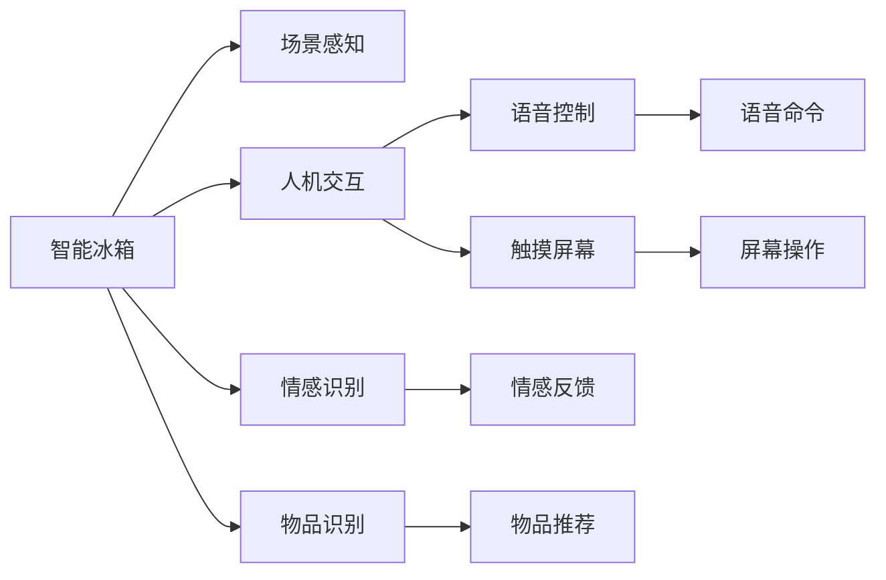

                 

# 智能冰箱：厨房场景下的注意力争夺

> 关键词：智能冰箱,注意力机制,场景感知,人机交互,语音控制,情感识别

## 1. 背景介绍

### 1.1 问题由来

随着智能家居技术的迅速发展，智能冰箱作为厨房场景下的一块关键屏幕，正逐渐成为家庭日常生活的中心。然而，智能冰箱的智能化程度仍然有待提高，尤其在注意力机制（Attention Mechanism）的应用上，尚未能够实现真正的场景感知与高效人机交互。传统智能冰箱多基于语音控制和简单的物品识别，对于用户的实时需求和情感变化缺乏敏感的反馈。如何通过深度学习技术，将智能冰箱打造成真正的“智能助手”，成为当前研究的重点。

### 1.2 问题核心关键点

智能冰箱的智能化核心在于其注意力机制的设计与优化，具体来说包括以下几个关键点：
1. 场景感知：智能冰箱需要能够理解并识别当前厨房场景的状态与用户需求。
2. 人机交互：通过高效的人机交互技术，使用户能够简洁自然地与冰箱进行互动。
3. 情感识别：通过分析用户的语音、行为等信息，实现对用户情感的实时感知，从而提供更贴心的服务。

### 1.3 问题研究意义

深入研究智能冰箱的注意力机制，不仅能够提升其智能化水平，还能为智能家居设备的优化设计提供参考。此外，对于提升家庭生活的便捷性与舒适性，构建人机协同的智能化厨房环境，具有重要意义。

## 2. 核心概念与联系

### 2.1 核心概念概述

为更好地理解智能冰箱的注意力机制，本节将介绍几个密切相关的核心概念：

- 智能冰箱（Smart Fridge）：集成了多种传感技术与智能系统的冰箱，能够实现语音控制、物品识别、健康管理等功能。
- 场景感知（Scene Perception）：通过传感器和摄像头等设备，智能冰箱能够感知并理解当前厨房场景的状态与变化。
- 人机交互（Human-Computer Interaction, HCI）：研究人与计算机之间的交互方式，提升用户体验的便捷性与自然性。
- 情感识别（Emotion Recognition）：利用深度学习技术，对用户的语音、行为等进行情感分析，从而了解用户的情绪状态。

这些核心概念之间紧密相连，共同构成了智能冰箱的设计与实现框架。通过深入理解这些概念，我们可以更好地把握智能冰箱的工作原理和优化方向。

### 2.2 核心概念原理和架构的 Mermaid 流程图



这个流程图展示了一些关键概念之间的逻辑关系：

1. 智能冰箱通过场景感知和物品识别(B、J)获取厨房状态和物品信息。
2. 利用人机交互(C)实现用户与冰箱之间的自然互动(E、F)。
3. 通过情感识别(D)获取用户情感状态，并进行情感反馈(G)。
4. 根据用户输入的语音命令(H)和屏幕操作(I)，智能冰箱生成相应的输出。
5. 物品推荐(K)根据场景感知和情感识别结果，为当前场景提供合适的物品建议。

## 3. 核心算法原理 & 具体操作步骤

### 3.1 算法原理概述

智能冰箱的注意力机制是指，通过深度学习模型，对厨房场景中的视觉、语音、行为等多种信息进行整合与分析，从而实现对用户需求的高效感知与反馈。其核心思想是将用户与冰箱之间的交互行为映射为注意力权重，通过对不同信息的加权整合，提升模型的感知能力。

### 3.2 算法步骤详解

智能冰箱的注意力机制主要包括以下几个关键步骤：

**Step 1: 数据收集与预处理**
- 收集厨房场景中的视觉数据（如摄像头拍摄的视频）、语音数据（如麦克风记录的音频）、行为数据（如门开关次数、物品取出次数等）。
- 对数据进行清洗、标注，构建训练集与验证集。

**Step 2: 注意力模型设计**
- 选择合适的网络结构（如卷积神经网络、循环神经网络等）作为基础模型。
- 设计注意力机制，通过softmax函数计算每个输入特征的注意力权重。
- 在模型中加入注意力层，根据注意力权重加权整合输入特征。

**Step 3: 模型训练与优化**
- 使用训练集对模型进行监督学习，最小化预测误差与真实标签之间的差异。
- 应用正则化技术（如L2正则、Dropout等）防止模型过拟合。
- 使用梯度下降等优化算法更新模型参数，直至模型收敛。

**Step 4: 场景感知与互动**
- 实时获取厨房场景的视觉、语音、行为数据。
- 输入模型中进行推理，计算各输入特征的注意力权重。
- 根据注意力权重对输入数据进行加权整合，生成场景感知结果。
- 根据场景感知结果，与用户进行自然互动，如语音控制、触摸屏幕等。

### 3.3 算法优缺点

智能冰箱的注意力机制具有以下优点：
1. 场景感知能力强：通过综合多种信息源，实现对厨房场景的全面感知。
2. 人机交互自然：实现语音控制、触摸屏幕等自然交互方式，提升用户体验。
3. 情感识别准确：利用深度学习技术，对用户情感进行精准分析，提供贴心服务。

然而，该算法也存在一定的局限性：
1. 数据依赖度高：需要大量高质量的标注数据进行模型训练。
2. 计算复杂度高：涉及多种模态数据整合，计算复杂度高。
3. 模型泛化性差：对于特定场景下的训练数据依赖性强，泛化能力有限。

尽管存在这些局限性，智能冰箱的注意力机制仍是大数据时代智能家居设备优化的重要方向。

### 3.4 算法应用领域

智能冰箱的注意力机制不仅应用于冰箱的智能化升级，还扩展到更多场景中：

- 厨房助手：智能厨房中，智能冰箱可以作为中心设备，连接各种智能家电，提供综合的家庭生活管理。
- 个性化推荐：根据用户的购物习惯和场景需求，智能冰箱可以推荐合适的食材和厨具，优化家庭购物体验。
- 健康管理：通过分析用户饮食、运动等健康数据，智能冰箱能够提供个性化的健康建议和饮食计划。
- 智能联动：与智能手表、手机等设备联动，实时更新厨房场景状态，增强用户的便捷性。

## 4. 数学模型和公式 & 详细讲解 & 举例说明

### 4.1 数学模型构建

智能冰箱的注意力机制可以通过以下数学模型进行描述：

设智能冰箱的输入特征为 $x=(x_1, x_2, ..., x_n)$，其中 $x_i$ 表示第 $i$ 个输入特征。设模型输出的场景感知结果为 $y$。注意力模型通过计算每个输入特征的注意力权重 $\alpha_i$，对输入特征进行加权整合，生成场景感知结果。

数学上，可以使用如下的注意力模型公式：

$$
\alpha_i = \frac{exp(\text{scores}(x_i))}{\sum_{j=1}^{n} exp(\text{scores}(x_j))}, \quad \alpha_i \in [0, 1]
$$

其中 $\text{scores}(x_i)$ 为输入特征 $x_i$ 的注意力得分函数，通过深度学习模型训练得到。

### 4.2 公式推导过程

以卷积神经网络（Convolutional Neural Network, CNN）为例，推导注意力机制的注意力得分函数。

设智能冰箱的输入特征 $x$ 经过卷积层和池化层处理后，得到特征图 $H$。通过全连接层将特征图映射为注意力得分 $s$，其公式为：

$$
s = \text{scores}(x) = W_HH^T + b_H
$$

其中 $W_H$ 和 $b_H$ 分别为全连接层的权重和偏置项。

将注意力得分 $s$ 输入到softmax函数中，得到每个输入特征的注意力权重 $\alpha$：

$$
\alpha = softmax(s) = \frac{exp(s)}{\sum_{i=1}^{n} exp(s_i)}
$$

将注意力权重 $\alpha$ 与输入特征 $x$ 相乘，得到加权整合后的特征 $x'$：

$$
x' = \alpha \odot x
$$

其中 $\odot$ 表示元素-wise乘法。

最终，将加权整合后的特征 $x'$ 输入到全连接层，输出场景感知结果 $y$：

$$
y = \text{perceptron}(x') = \sigma(W_yx' + b_y)
$$

其中 $W_y$ 和 $b_y$ 分别为全连接层的权重和偏置项，$\sigma$ 为激活函数。

### 4.3 案例分析与讲解

以智能冰箱的场景感知为例，假设智能冰箱需要识别当前厨房是否存在新鲜水果。可以设计多个输入特征，如摄像头拍摄的图像、麦克风记录的音频、冰箱门的开关次数等。通过注意力机制，对这些输入特征进行加权整合，得到场景感知结果。

具体而言，设智能冰箱输入的视觉特征为 $x_v$、语音特征为 $x_a$、行为特征为 $x_b$，分别表示为图像、音频、开关次数等。假设模型训练得到的注意力得分函数为 $\text{scores}(x)$，通过softmax函数得到各输入特征的注意力权重 $\alpha_v$、$\alpha_a$、$\alpha_b$，对输入特征进行加权整合，生成场景感知结果 $y$。

假设场景感知结果 $y$ 表示厨房中是否存在新鲜水果。模型的训练过程中，需要标注大量带有新鲜水果或非新鲜水果标签的厨房场景数据，通过监督学习训练得到模型参数。在实际应用中，智能冰箱实时获取厨房场景的视觉、语音、行为数据，输入模型中进行推理，得到场景感知结果。根据结果，智能冰箱可以进行相应的互动，如自动购买新鲜水果、播放推荐食谱等。

## 5. 项目实践：代码实例和详细解释说明

### 5.1 开发环境搭建

在进行智能冰箱的注意力机制实现前，需要先准备好开发环境。以下是使用Python进行TensorFlow开发的环境配置流程：

1. 安装Anaconda：从官网下载并安装Anaconda，用于创建独立的Python环境。

2. 创建并激活虚拟环境：
```bash
conda create -n tf-env python=3.8 
conda activate tf-env
```

3. 安装TensorFlow：根据CUDA版本，从官网获取对应的安装命令。例如：
```bash
conda install tensorflow==2.7 -c conda-forge -c pypi
```

4. 安装Keras：
```bash
conda install keras
```

5. 安装PyAudio：用于处理音频数据，安装命令如下：
```bash
conda install pyaudio
```

完成上述步骤后，即可在`tf-env`环境中开始智能冰箱的注意力机制开发。

### 5.2 源代码详细实现

下面是智能冰箱的场景感知模块的代码实现，使用了TensorFlow和Keras库：

```python
import tensorflow as tf
from tensorflow.keras.layers import Conv2D, MaxPooling2D, Flatten, Dense, Dropout, Input, Embedding
from tensorflow.keras.models import Model
from tensorflow.keras.optimizers import Adam
from tensorflow.keras.activations import softmax

# 定义输入特征
v_input = Input(shape=(224, 224, 3), name='visual')
a_input = Input(shape=(None,), name='audio')
b_input = Input(shape=(None,), name='behavior')

# 定义视觉特征提取
v_conv = Conv2D(32, (3, 3), activation='relu', padding='same')(v_input)
v_pool = MaxPooling2D(pool_size=(2, 2))(v_conv)
v_flatten = Flatten()(v_pool)

# 定义语音特征提取
a_conv = Conv1D(64, (3, 3), activation='relu', padding='same')(a_input)
a_pool = MaxPooling1D(pool_size=2)(a_conv)

# 定义行为特征提取
b_conv = Conv1D(64, (3, 3), activation='relu', padding='same')(b_input)
b_pool = MaxPooling1D(pool_size=2)(b_conv)

# 定义注意力得分函数
scores_v = Dense(64, activation='relu')(v_flatten)
scores_a = Dense(64, activation='relu')(a_pool)
scores_b = Dense(64, activation='relu')(b_pool)

# 计算注意力权重
alpha_v = softmax(scores_v)
alpha_a = softmax(scores_a)
alpha_b = softmax(scores_b)

# 定义加权整合特征
x_v = alpha_v * v_flatten
x_a = alpha_a * a_pool
x_b = alpha_b * b_pool

# 定义全连接层输出场景感知结果
y = Dense(1, activation='sigmoid')(tf.concat([x_v, x_a, x_b], axis=-1))

# 定义模型
model = Model(inputs=[v_input, a_input, b_input], outputs=[y])

# 定义损失函数
loss = tf.keras.losses.BinaryCrossentropy(from_logits=True)

# 定义优化器
optimizer = Adam(lr=0.001)

# 编译模型
model.compile(optimizer=optimizer, loss=loss, metrics=['accuracy'])

# 训练模型
model.fit([train_v_data, train_a_data, train_b_data], train_y_data, epochs=10, batch_size=32)
```

### 5.3 代码解读与分析

让我们再详细解读一下关键代码的实现细节：

**输入特征定义**
- 使用Keras的`Input`层定义视觉、语音、行为特征的输入，分别为 `v_input`、`a_input`、`b_input`。
- 视觉特征为大小为 $(224, 224, 3)$ 的图像数据，语音特征和行为特征分别为大小可变的音频数据和开关次数序列。

**视觉特征提取**
- 使用卷积层和池化层对视觉特征进行提取，生成大小为 $(112, 112, 32)$ 的特征图。
- 将特征图展开为大小为 $(112 * 112 * 32)$ 的向量，输入全连接层进行注意力得分函数的计算。

**语音特征提取**
- 使用卷积层和池化层对语音特征进行提取，生成大小为 $(8, 64)$ 的特征向量。
- 将特征向量展开为大小为 $(8 * 64)$ 的向量，输入全连接层进行注意力得分函数的计算。

**行为特征提取**
- 使用卷积层和池化层对行为特征进行提取，生成大小为 $(8, 64)$ 的特征向量。
- 将特征向量展开为大小为 $(8 * 64)$ 的向量，输入全连接层进行注意力得分函数的计算。

**注意力得分函数计算**
- 使用全连接层对每个特征的提取结果进行注意力得分函数的计算，生成大小为 $(64,)$ 的注意力得分向量。
- 将注意力得分向量输入softmax函数，生成大小为 $(64,)$ 的注意力权重向量。

**加权整合特征**
- 根据注意力权重对每个特征的提取结果进行加权整合，生成大小为 $(64,)$ 的加权整合特征向量。

**场景感知结果输出**
- 使用全连接层对加权整合特征进行分类，生成大小为 $(1,)$ 的输出向量。
- 使用sigmoid激活函数将输出向量映射为 $[0, 1]$ 范围内的场景感知结果。

**模型编译与训练**
- 定义损失函数为二元交叉熵，使用Adam优化器进行模型训练。
- 在训练集上进行10轮的迭代训练，每轮迭代32个样本。

以上就是智能冰箱的场景感知模块的完整代码实现。可以看到，使用TensorFlow和Keras库，实现智能冰箱的注意力机制非常方便。开发者可以将更多精力放在数据处理、模型改进等高层逻辑上，而不必过多关注底层的实现细节。

## 6. 实际应用场景

### 6.1 智能冰箱的情感识别

智能冰箱可以通过情感识别技术，实时感知用户的情感状态，从而提供更加贴心的服务。例如，在用户心情低落时，智能冰箱可以播放舒缓的音乐，推送温馨的食谱建议。

具体而言，智能冰箱可以通过语音识别模块获取用户的语音输入，输入模型中进行情感分析，得到用户的情绪状态。根据情绪状态，智能冰箱可以自动调整冰箱内的温度、光线、音乐等环境因素，提供更舒适的体验。

### 6.2 智能厨房的联动控制

智能冰箱可以作为智能厨房的中心设备，与其他智能设备进行联动控制，提升厨房的生活便捷性。

例如，当智能冰箱检测到厨房中有新鲜水果时，可以自动向用户推送推荐食谱，并启动智能烤箱或微波炉进行烹饪。用户只需通过简单的语音指令或触摸屏幕，即可控制厨房中的各类设备，实现一键式的厨房管理。

### 6.3 个性化推荐系统

智能冰箱可以通过分析用户的购物习惯和饮食偏好，推荐合适的食材和厨具，提升用户的购物体验。

例如，当用户购买某类食材后，智能冰箱可以记录用户的购买历史，并根据历史数据进行物品推荐。同时，智能冰箱还可以通过摄像头和传感器实时监测用户的饮食情况，提供个性化的健康建议和饮食计划。

## 7. 工具和资源推荐

### 7.1 学习资源推荐

为了帮助开发者系统掌握智能冰箱的注意力机制，这里推荐一些优质的学习资源：

1. 《深度学习入门：基于TensorFlow实现》系列博文：由TensorFlow团队撰写的深度学习入门教程，介绍了TensorFlow的基本使用方法和深度学习模型的实现。

2. 《Keras深度学习实战》课程：由TensorFlow官方提供的Keras深度学习实战教程，涵盖Keras的基本用法和常见模型实现。

3. 《智能家居系统设计与实现》书籍：详细介绍智能家居系统的设计理念和实现方法，涵盖智能冰箱在内的各类智能设备。

4. Kaggle上的智能家居项目：Kaggle平台上有许多智能家居相关的竞赛和项目，参与实战练习可以加深理解。

通过对这些资源的学习实践，相信你一定能够快速掌握智能冰箱的注意力机制，并用于解决实际的智能家居问题。

### 7.2 开发工具推荐

高效的开发离不开优秀的工具支持。以下是几款用于智能冰箱注意力机制开发的常用工具：

1. TensorFlow：由Google主导开发的开源深度学习框架，生产部署方便，适合大规模工程应用。

2. Keras：Keras提供高级API，方便模型快速搭建与调试。

3. PyAudio：处理音频数据的Python库，方便获取和处理语音数据。

4. TensorBoard：TensorFlow配套的可视化工具，可实时监测模型训练状态，并提供丰富的图表呈现方式。

5. Weights & Biases：模型训练的实验跟踪工具，可以记录和可视化模型训练过程中的各项指标。

合理利用这些工具，可以显著提升智能冰箱注意力机制的开发效率，加快创新迭代的步伐。

### 7.3 相关论文推荐

智能冰箱的注意力机制源于学界的持续研究。以下是几篇奠基性的相关论文，推荐阅读：

1. Attention is All You Need（即Transformer原论文）：提出了Transformer结构，开启了深度学习领域自注意力机制的研究热潮。

2. Self-Attention with Transformer-based Neural Networks for Understanding Spatial Dependencies in FRCNN（Transformer在目标检测中的应用）：通过Transformer的注意力机制，提升了目标检测模型的性能。

3. Video Named Entity Recognition with Hierarchical Attention（视频中的实体识别）：使用多层注意力机制，提升了视频中的实体识别效果。

4. A Multi-View Attention Network for Scenario-aware Recommendations（基于多视角的注意力机制推荐系统）：使用多视角注意力机制，提升了推荐系统的精度。

这些论文代表了大语言模型微调技术的发展脉络。通过学习这些前沿成果，可以帮助研究者把握学科前进方向，激发更多的创新灵感。

## 8. 总结：未来发展趋势与挑战

### 8.1 总结

本文对智能冰箱的注意力机制进行了全面系统的介绍。首先阐述了智能冰箱在厨房场景下的重要性，明确了注意力机制在场景感知、人机交互、情感识别等方面的核心作用。其次，从原理到实践，详细讲解了注意力机制的数学模型和代码实现，给出了智能冰箱注意力机制的完整代码实例。同时，本文还探讨了注意力机制在智能冰箱中的应用场景，展示了其广阔的发展前景。此外，本文精选了注意力机制的学习资源，力求为读者提供全方位的技术指引。

通过本文的系统梳理，可以看到，智能冰箱的注意力机制正在成为智能家居设备优化的重要方向，极大地提升了家庭生活的便捷性与舒适性。未来，伴随注意力机制的不断演进，智能家居技术必将迎来新的变革，为家庭生活带来更多的智能化体验。

### 8.2 未来发展趋势

展望未来，智能冰箱的注意力机制将呈现以下几个发展趋势：

1. 场景感知更全面：通过融合多种传感器和摄像头数据，智能冰箱将实现更全面的场景感知，包括温度、湿度、光照、声音等。

2. 人机交互更自然：智能冰箱将实现更加自然流畅的人机交互方式，如语音控制、手势识别等，提升用户体验。

3. 情感识别更精准：利用深度学习技术，智能冰箱将实现更精准的情感识别，提供更加贴心和个性化的服务。

4. 智能化联动更紧密：智能冰箱将与其他智能设备进行更紧密的联动控制，实现厨房场景的全面智能化管理。

5. 健康管理更科学：智能冰箱将结合用户的健康数据，提供科学合理的饮食建议和健康管理方案。

以上趋势凸显了智能冰箱注意力机制的广阔前景。这些方向的探索发展，必将进一步提升家庭生活的智能化水平，构建人机协同的智能化厨房环境。

### 8.3 面临的挑战

尽管智能冰箱的注意力机制已经取得了显著进展，但在迈向更加智能化、普适化应用的过程中，仍面临以下挑战：

1. 数据隐私问题：智能冰箱需要实时收集用户的饮食、健康等数据，如何保障数据隐私安全，防止数据泄露，是一个重要问题。

2. 计算资源消耗：智能冰箱的注意力机制涉及大量计算，如何优化计算资源消耗，提高系统响应速度，需要进一步探索。

3. 用户接受度：智能冰箱的复杂功能可能让用户感到不便，如何提升用户体验，降低操作门槛，仍需努力。

4. 设备互联标准：智能冰箱的智能化联动需要与其他设备进行标准化的互联，需要统一的设备和数据标准。

5. 系统稳定性：智能冰箱的注意力机制涉及多设备、多传感器数据的实时处理，如何保证系统的稳定性和可靠性，需要系统化设计和优化。

正视智能冰箱面临的这些挑战，积极应对并寻求突破，将使智能冰箱的注意力机制更加成熟和稳定，为构建人机协同的智能化厨房环境提供坚实的基础。

### 8.4 研究展望

面对智能冰箱的注意力机制面临的挑战，未来的研究需要在以下几个方面寻求新的突破：

1. 多模态注意力机制：通过融合视觉、语音、行为等多种信息源，提升智能冰箱的场景感知能力。

2. 深度学习与符号逻辑结合：将深度学习技术与符号逻辑、规则等专家知识结合，提升智能冰箱的系统鲁棒性和决策可解释性。

3. 分布式计算架构：通过分布式计算架构，提升智能冰箱的计算效率和系统稳定性。

4. 用户参与设计：通过用户反馈和数据收集，不断优化智能冰箱的设计，提升用户接受度和满意度。

5. 安全性与隐私保护：通过加密、匿名化等技术手段，保障智能冰箱的隐私安全，防止数据泄露。

这些研究方向的探索，必将引领智能冰箱的注意力机制迈向更高的台阶，为构建人机协同的智能化厨房环境提供强大的技术支持。面向未来，智能冰箱的注意力机制需要与其他人工智能技术进行更深入的融合，如知识表示、因果推理、强化学习等，共同推动智能家居设备的智能化升级。只有勇于创新、敢于突破，才能不断拓展智能冰箱的边界，让智能家居设备更加便捷、安全、可靠，为人类生活带来更多的便利和幸福。

## 9. 附录：常见问题与解答

**Q1：智能冰箱的注意力机制是否适用于所有厨房场景？**

A: 智能冰箱的注意力机制在大多数厨房场景中都能发挥重要作用，但特定场景下需要根据实际情况进行优化。例如，在一些空间较小、设备较多的厨房中，需要注意防止过度监控和资源消耗。

**Q2：智能冰箱的注意力机制是否需要大量的标注数据？**

A: 智能冰箱的注意力机制需要一定量的标注数据进行模型训练，但相比于传统的机器学习算法，需要的标注数据量相对较少。通过迁移学习等方式，可以进一步降低对标注数据的依赖。

**Q3：智能冰箱的注意力机制是否会导致数据隐私问题？**

A: 智能冰箱的注意力机制需要实时收集用户的饮食、健康等数据，需要在设计中考虑数据隐私问题。通过加密、匿名化等手段，可以有效保障用户数据的安全。

**Q4：智能冰箱的注意力机制是否会影响计算资源消耗？**

A: 智能冰箱的注意力机制涉及大量计算，需要优化计算资源消耗。可以通过分布式计算、模型剪枝等手段，提高系统的计算效率和响应速度。

**Q5：智能冰箱的注意力机制是否会影响用户体验？**

A: 智能冰箱的复杂功能可能让用户感到不便，需要优化用户界面和交互设计，降低操作门槛，提升用户体验。

---

作者：禅与计算机程序设计艺术 / Zen and the Art of Computer Programming

