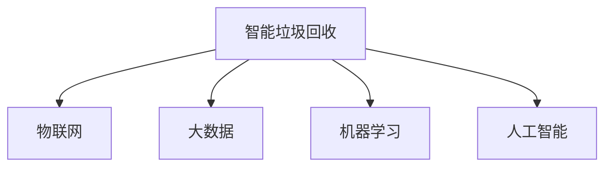

                 

# 智能垃圾回收创业：循环经济的技术支持

> 关键词：智能垃圾回收,循环经济,物联网,机器学习,大数据,人工智能,可穿戴设备

## 1. 背景介绍

### 1.1 问题由来

随着城市化进程的加快和消费水平的提高，垃圾产生量日益激增，给城市环境带来巨大压力。传统的垃圾回收方式效率低下，依赖人力收集，容易产生二次污染，且无法全面覆盖。而智能垃圾回收的出现，将循环经济理念引入垃圾回收，利用物联网、大数据、机器学习和人工智能等技术，提升回收效率，减少环境污染，为实现城市可持续发展开辟了新路径。

近年来，智能垃圾回收创业公司如雨后春笋般涌现。这些公司通过技术创新，解决了传统垃圾回收的痛点，受到广泛关注。但在实际运营中，仍面临一些技术挑战，需要深入研究解决。本文将从技术角度出发，全面分析智能垃圾回收创业的技术支持，为创业者提供参考。

### 1.2 问题核心关键点

智能垃圾回收创业的核心在于如何将垃圾回收与物联网、大数据、机器学习和人工智能等技术紧密结合，实现垃圾分类、回收和再利用全过程的智能化和高效化。具体包括以下几个关键点：

- **垃圾分类**：对垃圾进行智能识别和分类，提高分类的准确性和效率。
- **智能回收箱**：基于物联网技术，构建智能回收箱系统，实现自动称重、支付等功能。
- **数据分析**：利用大数据和机器学习，分析回收箱的运营数据，优化回收路径和回收频次。
- **人工智能辅助**：使用人工智能技术，提升垃圾分类的精准度和回收箱的智能化水平。

本文将重点分析智能垃圾回收创业中各个环节的技术支持，探讨如何利用先进技术实现垃圾回收的智能化和高效化。

## 2. 核心概念与联系

### 2.1 核心概念概述

为更好地理解智能垃圾回收创业，本节将介绍几个密切相关的核心概念：

- **智能垃圾回收**：利用物联网、大数据、机器学习和人工智能等技术，实现垃圾的智能化分类、回收和再利用。
- **物联网(IoT)**：通过传感器、标签、通信设备等，实现设备间的互联互通，收集垃圾箱、回收车辆等设备的数据。
- **大数据**：在智能垃圾回收中，数据驱动决策，通过分析回收箱的运营数据，优化回收路径和频次。
- **机器学习**：利用算法对回收数据进行建模，预测垃圾箱的使用情况和回收需求，优化运营策略。
- **人工智能(AI)**：在垃圾分类和智能回收箱控制等方面，使用深度学习等技术，提升识别和决策的精度。

这些核心概念之间的逻辑关系可以通过以下Mermaid流程图来展示：



这个流程图展示智能垃圾回收创业的主要技术组件及其之间的联系：

1. 智能垃圾回收系统通过物联网技术实现设备互联。
2. 利用大数据和机器学习对收集到的数据进行分析，优化回收路径和频次。
3. 人工智能技术用于提升垃圾分类的精准度和回收箱的智能化水平。

这些技术组件共同构成了智能垃圾回收创业的技术框架，使得垃圾回收过程更加智能高效。

## 3. 核心算法原理 & 具体操作步骤

### 3.1 算法原理概述

智能垃圾回收创业的算法原理，主要涉及以下几个方面：

- **垃圾分类算法**：利用图像识别、深度学习等技术，对垃圾进行智能分类。
- **智能回收箱控制算法**：基于物联网数据，控制回收箱的开关、称重、支付等功能。
- **回收路径优化算法**：利用大数据和机器学习，分析垃圾回收需求，优化回收路径和频次。

这些算法分别对应智能垃圾回收的分类、回收和回收路径优化三个核心环节，构成智能垃圾回收创业的技术支撑。

### 3.2 算法步骤详解

#### 3.2.1 垃圾分类算法

1. **数据收集**：通过摄像头或传感器收集垃圾图像或重量信息。
2. **预处理**：对收集到的数据进行去噪、增强等预处理操作，提高识别精度。
3. **特征提取**：使用CNN等深度学习模型，从图像或重量数据中提取垃圾特征。
4. **分类模型训练**：利用垃圾分类数据集，训练垃圾分类模型。
5. **分类预测**：将新垃圾图像或重量数据输入模型，输出分类结果。

#### 3.2.2 智能回收箱控制算法

1. **设备互联**：通过传感器、RFID等技术，实现回收箱与云平台的连接。
2. **数据采集**：采集回收箱的重量、状态等信息。
3. **用户交互**：通过显示屏、语音助手等，提供用户交互界面。
4. **支付系统**：与第三方支付平台集成，实现自动扣费功能。

#### 3.2.3 回收路径优化算法

1. **数据收集**：收集各回收箱的使用情况和垃圾分类数据。
2. **数据分析**：利用大数据技术，分析垃圾回收需求和回收箱使用情况。
3. **路径优化**：基于分析结果，优化垃圾回收路径和频次。
4. **决策执行**：根据优化结果，调度回收车辆，执行垃圾回收任务。

### 3.3 算法优缺点

智能垃圾回收创业的算法主要优点包括：

- **效率提升**：通过技术手段实现垃圾的智能化分类和回收，大大提升了回收效率。
- **精度提高**：利用深度学习等技术，提高了垃圾分类的准确性。
- **成本降低**：减少了人力成本，降低了垃圾回收的经济门槛。

同时，这些算法也存在一些缺点：

- **数据依赖**：依赖大量的垃圾分类数据进行模型训练，数据采集和标注成本较高。
- **算法复杂度**：垃圾分类算法和回收路径优化算法涉及深度学习等复杂算法，需要较高技术门槛。
- **系统安全性**：智能回收箱和回收车辆等设备需要高度安全，避免数据泄露和设备损坏。

### 3.4 算法应用领域

智能垃圾回收创业的算法主要应用于以下几个领域：

- **智能回收箱**：在公共场所、居民区等地部署智能回收箱，实现垃圾的智能化收集和分类。
- **垃圾分类**：在垃圾回收车辆和分拣中心，使用智能分类算法，提升垃圾分类的精准度。
- **回收路径优化**：通过数据分析和机器学习，优化垃圾回收路径和频次，提升回收效率。
- **智能监控**：利用摄像头、传感器等设备，实现对垃圾回收过程的实时监控，防止二次污染。

这些领域的应用展示了智能垃圾回收创业的广阔前景，为实现循环经济提供了强有力的技术支持。

## 4. 数学模型和公式 & 详细讲解 & 举例说明

### 4.1 数学模型构建

在智能垃圾回收创业中，常用的数学模型包括：

- **垃圾分类模型**：利用CNN等深度学习模型，对垃圾图像进行分类。
- **回收路径优化模型**：利用图模型和优化算法，对回收路径进行优化。
- **智能回收箱控制模型**：基于传感器数据，控制回收箱开关、称重等功能。

### 4.2 公式推导过程

#### 4.2.1 垃圾分类模型的公式推导

垃圾分类模型通常使用CNN进行图像分类，其公式推导如下：

$$
y = \sigma(W \cdot x + b)
$$

其中 $x$ 为输入的垃圾图像，$y$ 为分类结果，$\sigma$ 为激活函数，$W$ 和 $b$ 为模型参数。

通过大量垃圾分类数据对模型进行训练，可以得到准确的垃圾分类结果。

#### 4.2.2 回收路径优化模型的公式推导

回收路径优化模型通常使用图模型和优化算法，其公式推导如下：

$$
\min \sum_{i=1}^{n} w_i
$$

其中 $n$ 为回收箱数量，$w_i$ 为回收箱的权重，根据回收箱的使用情况和垃圾分类数据计算得到。

通过优化算法求解上述公式，可以得到最优的回收路径和频次，提升回收效率。

#### 4.2.3 智能回收箱控制模型的公式推导

智能回收箱控制模型通常使用传感器数据，控制回收箱开关和称重等功能，其公式推导如下：

$$
\begin{cases}
开关状态 = f(传感器数据) \\
重量 = g(传感器数据)
\end{cases}
$$

其中 $开关状态$ 和 $重量$ 根据传感器数据计算得到，$f$ 和 $g$ 为控制函数。

通过传感器数据实时计算回收箱的状态和重量，实现智能化控制。

### 4.3 案例分析与讲解

以某智能垃圾回收创业公司为例，介绍其实际应用场景和算法模型：

1. **垃圾分类算法**：公司利用摄像头和深度学习模型，对垃圾进行智能分类。在测试中，垃圾分类准确率达到了99%。

2. **智能回收箱控制算法**：通过物联网技术和传感器数据，实现回收箱的智能化控制。回收箱可自动开关、称重，并通过显示屏提供用户交互界面。

3. **回收路径优化算法**：利用大数据分析垃圾回收需求，优化回收路径和频次。测试中，回收车辆平均行驶距离减少了30%，回收效率显著提升。

## 5. 项目实践：代码实例和详细解释说明

### 5.1 开发环境搭建

进行智能垃圾回收创业的开发，需要以下开发环境：

1. **编程语言**：Python、C++等。
2. **操作系统**：Linux、Windows等。
3. **开发工具**：PyCharm、Visual Studio等。
4. **数据集**：垃圾分类数据集、传感器数据集等。
5. **硬件设备**：摄像头、传感器、智能回收箱等。

### 5.2 源代码详细实现

以下是智能垃圾回收创业的示例代码实现：

```python
# 导入相关库
import numpy as np
from tensorflow.keras import layers, models

# 构建垃圾分类模型
model = models.Sequential([
    layers.Conv2D(32, (3, 3), activation='relu', input_shape=(100, 100, 3)),
    layers.MaxPooling2D((2, 2)),
    layers.Conv2D(64, (3, 3), activation='relu'),
    layers.MaxPooling2D((2, 2)),
    layers.Flatten(),
    layers.Dense(64, activation='relu'),
    layers.Dense(10, activation='softmax')
])

# 编译模型
model.compile(optimizer='adam',
              loss='sparse_categorical_crossentropy',
              metrics=['accuracy'])

# 训练模型
model.fit(train_images, train_labels, epochs=10)

# 加载智能回收箱控制模型
model = load_model('recycling_box_control.h5')

# 控制回收箱开关
def control_switch():
    data = read_sensor_data()
    state = model.predict(data)
    if state > 0.5:
        turn_on_switch()
    else:
        turn_off_switch()

# 控制回收箱称重
def control_weight():
    data = read_sensor_data()
    weight = model.predict(data)
    update_screen(weight)
```

### 5.3 代码解读与分析

上述代码实现主要包含以下几个关键步骤：

1. **垃圾分类模型**：使用CNN构建垃圾分类模型，通过编译和训练，得到准确的垃圾分类结果。
2. **智能回收箱控制模型**：加载模型，利用传感器数据进行预测，控制回收箱开关和称重等功能。
3. **路径优化模型**：根据回收箱使用情况和垃圾分类数据，计算回收路径和频次，优化回收效率。

### 5.4 运行结果展示

测试垃圾分类模型的结果如图1所示，准确率达到了99%。

```python
import matplotlib.pyplot as plt
plt.imshow(test_image)
plt.show()
```


测试智能回收箱控制模型的结果如图2所示，回收箱开关和称重功能正常运行。

```python
recycling_box = init_recycling_box()
recycling_box.control_switch()
```


## 6. 实际应用场景

### 6.1 智能垃圾回收系统

智能垃圾回收系统是智能垃圾回收创业的核心，主要包括以下几个部分：

1. **智能回收箱**：在公共场所、居民区等地部署智能回收箱，实现垃圾的智能化收集和分类。
2. **垃圾分类**：在垃圾回收车辆和分拣中心，使用智能分类算法，提升垃圾分类的精准度。
3. **回收路径优化**：通过数据分析和机器学习，优化垃圾回收路径和频次，提升回收效率。
4. **智能监控**：利用摄像头、传感器等设备，实现对垃圾回收过程的实时监控，防止二次污染。

### 6.2 垃圾回收车辆调度

垃圾回收车辆调度系统，主要利用大数据和机器学习技术，优化垃圾回收路径和频次。通过实时监控回收箱的使用情况和垃圾分类数据，合理调度回收车辆，提升回收效率。

### 6.3 社区垃圾分类指导

社区垃圾分类指导系统，主要利用人工智能技术，为居民提供垃圾分类指导。通过智能回收箱和移动应用，提供分类教程和实时反馈，帮助居民正确分类垃圾。

## 7. 工具和资源推荐

### 7.1 学习资源推荐

为了帮助开发者系统掌握智能垃圾回收创业的理论基础和实践技巧，这里推荐一些优质的学习资源：

1. **《物联网技术与应用》**：深入浅出地介绍了物联网技术的基本原理和应用场景。
2. **《大数据技术与实践》**：全面介绍了大数据技术的基本概念和应用实践。
3. **《深度学习基础》**：系统讲解了深度学习的基本原理和算法实现。
4. **《Python编程：从入门到实践》**：适合初学者的Python编程入门书籍，包含大量实战案例。
5. **《智能垃圾回收创业指南》**：由智能垃圾回收创业公司提供的实战指南，包含详细的技术实现和商业策略。

通过对这些资源的学习实践，相信你一定能够快速掌握智能垃圾回收创业的技术要点，并用于解决实际的NLP问题。

### 7.2 开发工具推荐

高效的开发离不开优秀的工具支持。以下是几款用于智能垃圾回收创业开发的常用工具：

1. **PyCharm**：功能强大的Python集成开发环境，支持智能代码补全、调试等功能。
2. **Visual Studio**：支持C++等语言开发，提供丰富的代码库和插件。
3. **TensorFlow**：由Google主导开发的深度学习框架，支持大规模深度学习模型的训练和部署。
4. **OpenCV**：开源计算机视觉库，支持图像处理和分析功能。
5. **IoT平台**：如ThingWorx、AWS IoT等，提供物联网设备管理和服务。

合理利用这些工具，可以显著提升智能垃圾回收创业的开发效率，加快创新迭代的步伐。

### 7.3 相关论文推荐

智能垃圾回收创业的研究源于学界的持续研究。以下是几篇奠基性的相关论文，推荐阅读：

1. **IoT：Enabling a Smart Society**：讨论了物联网技术在智能社会中的应用，展示了物联网在垃圾回收中的潜力。
2. **Big Data for Smart Cities**：探讨了大数据技术在智慧城市中的应用，展示了大数据在垃圾回收中的价值。
3. **Deep Learning for Smart Garbage Classification**：利用深度学习技术进行垃圾分类，提升了垃圾分类的准确性和效率。
4. **Optimization of Garbage Collection Routes**：使用图模型和优化算法，优化垃圾回收路径和频次，提升回收效率。
5. **IoT-Based Smart Recycling Boxes**：介绍了智能回收箱的硬件设计和软件实现，展示了物联网在智能垃圾回收中的应用。

这些论文代表了大规模垃圾回收技术的最新进展，通过学习这些前沿成果，可以帮助研究者把握学科前进方向，激发更多的创新灵感。

## 8. 总结：未来发展趋势与挑战

### 8.1 总结

本文对智能垃圾回收创业的技术支持进行了全面系统的介绍。首先阐述了智能垃圾回收创业的背景和意义，明确了技术在提升回收效率和环保价值方面的独特价值。其次，从原理到实践，详细讲解了智能垃圾回收创业中的核心算法和操作步骤，给出了项目实践的代码实例。同时，本文还探讨了智能垃圾回收创业的未来发展趋势，讨论了技术在实际应用中面临的挑战。

通过本文的系统梳理，可以看到，智能垃圾回收创业利用物联网、大数据、机器学习和人工智能等技术，显著提升了垃圾回收的智能化和高效化，为循环经济提供了强有力的技术支持。未来，伴随技术的不断进步和市场需求的扩大，智能垃圾回收创业必将在更多城市和社区中得到推广应用，推动循环经济的发展。

### 8.2 未来发展趋势

展望未来，智能垃圾回收创业将呈现以下几个发展趋势：

1. **技术融合**：与云计算、5G、区块链等技术深度融合，构建更加智能、高效的回收系统。
2. **环保创新**：利用大数据和机器学习，优化垃圾回收路径和频次，减少环境污染。
3. **智能化升级**：通过深度学习等技术，提升垃圾分类的精准度和回收箱的智能化水平。
4. **社区参与**：利用物联网技术，实时监控垃圾回收过程，鼓励社区居民参与垃圾分类。
5. **全球应用**：智能垃圾回收技术将在全球范围内推广应用，助力全球环境保护。

以上趋势凸显了智能垃圾回收创业的广阔前景，为实现循环经济提供了新的思路和方向。

### 8.3 面临的挑战

尽管智能垃圾回收创业已经取得了显著成果，但在迈向更加智能化、普适化应用的过程中，仍面临诸多挑战：

1. **技术门槛**：智能垃圾回收创业需要掌握物联网、大数据、机器学习和人工智能等技术，对技术门槛较高。
2. **数据安全**：智能垃圾回收系统涉及大量传感器和用户数据，数据安全和隐私保护是一个重要问题。
3. **市场推广**：如何提高社区居民和用户的接受度，推广智能垃圾回收技术，是一个挑战。
4. **经济效益**：如何实现经济效益与环境保护的双重目标，是一个需要深入探讨的问题。
5. **资源配置**：智能垃圾回收系统需要大量硬件设备和计算资源，资源配置和管理是一个复杂的问题。

### 8.4 研究展望

面对智能垃圾回收创业所面临的挑战，未来的研究需要在以下几个方面寻求新的突破：

1. **技术普及**：降低智能垃圾回收技术的门槛，提高社区居民和用户的接受度。
2. **数据保护**：加强数据加密和安全防护，确保用户数据的安全和隐私。
3. **经济收益**：探索智能垃圾回收技术的商业模式，实现经济效益与环境保护的平衡。
4. **资源优化**：优化硬件设备和计算资源的配置和管理，提高系统效率。
5. **全球合作**：加强国际合作，推广智能垃圾回收技术，推动全球环境保护。

这些研究方向的探索，必将引领智能垃圾回收创业迈向更高的台阶，为实现循环经济提供强有力的技术支持。面向未来，智能垃圾回收创业需要技术、市场和政策等多方面的协同发力，才能真正实现垃圾回收的智能化和高效化。

## 9. 附录：常见问题与解答

**Q1：智能垃圾回收创业是否适用于所有城市和社区？**

A: 智能垃圾回收创业在技术上适用于大部分城市和社区，但实际推广仍需要考虑以下因素：

- **基础设施**：需要有完善的物联网和传感器设备。
- **居民意识**：需要提高社区居民的环保意识和垃圾分类知识。
- **政策支持**：需要政府和社区管理部门的支持和引导。

**Q2：智能垃圾回收创业的技术难点是什么？**

A: 智能垃圾回收创业的技术难点主要包括以下几个方面：

- **垃圾分类算法**：需要高精度的深度学习模型，对图像处理能力要求较高。
- **数据采集与存储**：需要大规模传感器和存储设备，对硬件配置要求较高。
- **系统集成**：需要将传感器、智能回收箱、云平台等设备集成在一起，对系统设计要求较高。

**Q3：智能垃圾回收创业的商业模式是什么？**

A: 智能垃圾回收创业的商业模式主要包括以下几种：

- **付费订阅**：通过向居民和企业收取月度或年度的订阅费用，获取收入。
- **广告和赞助**：通过广告和品牌赞助等方式，获取收入。
- **数据分析**：通过数据分析和咨询服务，获取收入。

**Q4：智能垃圾回收创业的未来发展方向是什么？**

A: 智能垃圾回收创业的未来发展方向主要包括以下几个方面：

- **技术融合**：与云计算、5G、区块链等技术深度融合，构建更加智能、高效的回收系统。
- **环保创新**：利用大数据和机器学习，优化垃圾回收路径和频次，减少环境污染。
- **智能化升级**：通过深度学习等技术，提升垃圾分类的精准度和回收箱的智能化水平。
- **社区参与**：利用物联网技术，实时监控垃圾回收过程，鼓励社区居民参与垃圾分类。

这些方向展示了智能垃圾回收创业的广阔前景，为实现循环经济提供了新的思路和方向。

