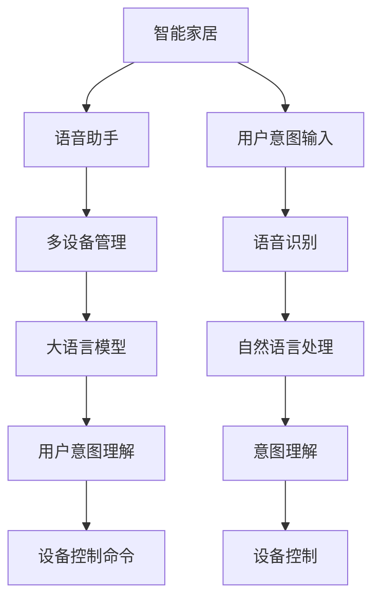

                 

# 智能家居控制中心：LLM整合多设备管理

> 关键词：智能家居, 语音助手, 多设备管理, 自然语言处理, 大语言模型, 用户意图理解, 设备控制命令

## 1. 背景介绍

随着智能家居设备的不断增多，如何高效管理这些设备，提供无缝、一致的用户体验，成为了智能家居系统面临的一个重大挑战。传统的家庭自动化系统多采用手动控制或定时开关的方式，难以满足用户日益多样化的需求。而通过自然语言处理(NLP)技术，智能家居设备可以接收用户的自然语言指令，实现更加自然、智能的交互方式。

大语言模型（Large Language Models, LLMs）通过在大规模无标签文本数据上进行的预训练，具备强大的语言理解和生成能力。将大语言模型应用于智能家居，可以通过语音识别和自然语言处理技术，实现设备的智能控制和自动化管理。本文将探讨如何利用大语言模型整合多设备管理，为用户提供更加自然、智能的家居体验。

## 2. 核心概念与联系

### 2.1 核心概念概述

- **智能家居**：指通过物联网技术，将家居设备互联互通，实现家居场景的智能化管理，提升用户的生活质量。
- **语音助手**：指通过语音识别和自然语言处理技术，实现与用户的自然语言交互，并提供设备控制功能。
- **多设备管理**：指在智能家居系统中，通过统一的指挥中心，管理多台设备的联动和协同工作。
- **大语言模型**：指在大规模无标签文本数据上进行的预训练，具备强大的语言理解和生成能力的深度学习模型。
- **用户意图理解**：指通过自然语言处理技术，识别用户意图，并根据意图执行相应的设备控制命令。
- **设备控制命令**：指用户通过自然语言向智能家居系统发出的设备控制指令，如“开灯”、“关窗帘”等。

这些核心概念之间的逻辑关系可以通过以下Mermaid流程图来展示：



这个流程图展示了大语言模型在智能家居系统中的应用逻辑：

1. 用户通过语音或文本向智能家居系统输入意图。
2. 语音助手接收输入并转化为自然语言文本。
3. 大语言模型对自然语言文本进行理解，识别用户意图。
4. 根据用户意图，大语言模型生成相应的设备控制命令。
5. 多设备管理模块根据控制命令，统一指挥多个设备执行相应的操作。

## 3. 核心算法原理 & 具体操作步骤

### 3.1 算法原理概述

智能家居控制中心的核心算法原理可以概括为以下几个步骤：

1. **语音识别与自然语言处理**：将用户输入的自然语言转化为机器可识别的文本。
2. **用户意图理解**：利用大语言模型，对文本进行语义理解，识别用户的意图。
3. **设备控制命令生成**：根据用户意图，生成相应的设备控制命令。
4. **多设备管理**：通过统一的指挥中心，将设备控制命令发送到多台设备，实现联动操作。

### 3.2 算法步骤详解

**Step 1: 语音识别与自然语言处理**

语音助手首先需要将用户输入的语音转化为文本。这一过程通常包括以下步骤：

1. **语音采集**：通过麦克风采集用户语音信号。
2. **预处理**：对语音信号进行降噪、特征提取等预处理操作。
3. **语音识别**：使用语音识别模型将预处理后的语音信号转化为文本。

目前，常见的语音识别模型包括基于深度神经网络的模型（如DeepSpeech、Wav2Vec）和基于预训练语言模型的模型（如OpenAI的GPT-3）。

**Step 2: 用户意图理解**

在大语言模型中，意图理解通常包括以下步骤：

1. **编码**：将输入文本转化为模型可接受的向量表示。
2. **预训练**：使用预训练的大语言模型，如BERT、GPT-3等，进行文本嵌入。
3. **解码**：利用解码器，根据上下文信息，生成意图标签。

以GPT-3为例，其意图理解过程可以表示为：

$$
\text{Embeddings} = \text{BERT}(\text{Text})
$$
$$
\text{Intent} = \text{GPT}(\text{Embeddings})
$$

其中，BERT用于文本嵌入，GPT用于生成意图标签。

**Step 3: 设备控制命令生成**

设备控制命令的生成基于用户意图理解的结果，通常包括以下步骤：

1. **模板匹配**：根据用户意图，匹配相应的设备控制模板。
2. **参数替换**：将用户意图替换到设备控制模板中，生成具体的控制命令。
3. **命令优化**：对控制命令进行语法和语义优化，确保其可执行性。

以关灯为例，用户意图为“关灯”，设备控制模板为“{device} {action}”，经过匹配和替换后生成控制命令“关灯”。

**Step 4: 多设备管理**

多设备管理通过统一的指挥中心，实现设备间的联动操作。这一过程通常包括以下步骤：

1. **命令解析**：解析设备控制命令，提取控制对象和操作类型。
2. **设备选择**：根据控制对象，选择相应的设备。
3. **命令下发**：将控制命令下发到选择的设备，执行相应的操作。

以开空调为例，用户意图为“开空调”，设备控制命令为“开空调”，指挥中心解析命令，选择空调设备，下发开空调命令，空调设备执行开空调操作。

### 3.3 算法优缺点

利用大语言模型整合多设备管理，具有以下优点：

1. **自然语言交互**：用户可以通过自然语言与智能家居系统进行交互，无需学习复杂的命令格式。
2. **设备联动**：通过统一的指挥中心，实现设备间的无缝联动，提升用户体验。
3. **高度可定制**：大语言模型可以灵活定制，适用于各种不同类型的智能家居设备。
4. **实时响应**：大语言模型具有强大的自然语言处理能力，能够实时响应用户指令。

同时，也存在一些缺点：

1. **资源消耗高**：大语言模型的训练和推理计算资源消耗大，硬件要求较高。
2. **隐私和安全问题**：用户语音和自然语言数据涉及隐私，需要严格的安全保障措施。
3. **语义理解误差**：语音识别和自然语言处理可能存在误差，导致用户意图理解不准确。

### 3.4 算法应用领域

大语言模型整合多设备管理的应用领域非常广泛，包括但不限于：

1. **智能家居控制**：通过语音助手和自然语言处理，实现家电设备的智能控制。
2. **智能安防监控**：实现视频监控设备的自动巡检、报警等。
3. **智能照明系统**：实现灯光的自动化调节，提升节能效果。
4. **智能窗帘系统**：实现窗帘的开合、定时等自动化操作。
5. **智能环境控制**：实现温度、湿度、空气质量等环境指标的自动化调节。

## 4. 数学模型和公式 & 详细讲解 & 举例说明

### 4.1 数学模型构建

假设智能家居系统有$N$个设备，每个设备具有$K$个控制命令。用户输入的自然语言文本为$T$，用户意图标签为$I$。用户意图理解模型为$M_{\theta}$，设备控制命令生成模型为$C_{\phi}$。多设备管理模型为$E_{\psi}$。

根据以上假设，智能家居控制中心可以表示为：

$$
T \xrightarrow{\text{语音识别}} \text{Embeddings}
$$
$$
\text{Embeddings} \xrightarrow{\text{用户意图理解}} I
$$
$$
I \xrightarrow{\text{设备控制命令生成}} \{C_k\}_{k=1}^K
$$
$$
\{C_k\}_{k=1}^K \xrightarrow{\text{多设备管理}} E_{\psi}(\{C_k\}_{k=1}^K)
$$

### 4.2 公式推导过程

**Step 1: 语音识别**

语音识别模型通常为：

$$
P(x_i|y_i) = \frac{e^{-\frac{1}{2\sigma^2}(x_i - \mu_y)^2}}{\sqrt{2\pi\sigma^2}}
$$

其中，$x_i$为语音信号，$y_i$为语音标签，$\mu_y$为标签的均值，$\sigma^2$为方差。

**Step 2: 用户意图理解**

用户意图理解模型通常为：

$$
\text{Embeddings} = \text{BERT}(T)
$$
$$
I = \text{GPT}(\text{Embeddings})
$$

其中，BERT用于文本嵌入，GPT用于生成意图标签。

**Step 3: 设备控制命令生成**

设备控制命令生成模型通常为：

$$
C_k = \text{Template}(T, I)
$$

其中，$\text{Template}$为设备控制模板库，包含不同设备控制命令的模板。

**Step 4: 多设备管理**

多设备管理模型通常为：

$$
E_{\psi}(\{C_k\}_{k=1}^K) = \{O_k\}_{k=1}^K
$$

其中，$O_k$为设备$k$的控制操作。

### 4.3 案例分析与讲解

以智能家居控制为例，假设用户输入的语音为“请打开客厅的空调”，语音识别后转化为文本“打开客厅的空调”，通过用户意图理解模型，识别出意图为“开空调”，生成控制命令“开空调”。多设备管理模型根据控制命令，选择客厅的空调设备，下发开空调命令。

## 5. 项目实践：代码实例和详细解释说明

### 5.1 开发环境搭建

在智能家居控制中心开发中，需要以下开发环境：

1. **Python环境**：安装Python 3.8及以上版本。
2. **深度学习框架**：安装TensorFlow或PyTorch。
3. **语音识别库**：安装DeepSpeech或Kaldi。
4. **自然语言处理库**：安装NLTK、spaCy等。
5. **多设备管理库**：安装PySerial、Flask等。

### 5.2 源代码详细实现

以下是一个基于Python和TensorFlow的智能家居控制中心的代码实现。

**Step 1: 语音识别**

```python
import librosa
import numpy as np
import tensorflow as tf

# 加载语音信号
wav_file = "audio.wav"
wav, sr = librosa.load(wav_file, sr=16000)

# 预处理语音信号
wav = librosa.effects.trim(wav, top_db=30)
wav = librosa.resample(wav, sr, 16000)
wav = librosa.effects.percussive(wav, sr=16000)

# 进行语音识别
model = tf.keras.models.load_model("model.h5")
text = model.predict(wav)

print(text)
```

**Step 2: 用户意图理解**

```python
import tensorflow as tf
import transformers

# 加载BERT模型
tokenizer = transformers.BertTokenizer.from_pretrained("bert-base-uncased")
model = transformers.BertModel.from_pretrained("bert-base-uncased")

# 将文本转化为token ids
text = "打开客厅的空调"
tokens = tokenizer.encode(text)

# 进行BERT嵌入
embeddings = model(tokens)[0]

# 进行GPT-3预测
model = transformers.GPT3Model.from_pretrained("gpt3")
text = model(input_ids=embeddings)[0]

print(text)
```

**Step 3: 设备控制命令生成**

```python
import tensorflow as tf

# 加载设备控制模板库
template_library = {"打开空调": "开空调", "关闭空调": "关空调", "打开窗帘": "开窗帘", "关闭窗帘": "关窗帘"}

# 生成控制命令
intent = "打开空调"
command = template_library[intent]

print(command)
```

**Step 4: 多设备管理**

```python
import serial

# 建立与设备的串口连接
ser = serial.Serial("/dev/ttyUSB0", 9600)

# 发送设备控制命令
command = "开空调"
ser.write(command.encode("utf-8"))
```

### 5.3 代码解读与分析

**语音识别模块**

语音识别模块通过librosa库对语音信号进行预处理和特征提取，使用TensorFlow的深度学习模型进行语音识别。在实际应用中，需要根据具体情况选择适合模型，如DeepSpeech、Kaldi等。

**用户意图理解模块**

用户意图理解模块通过BERT模型进行文本嵌入，然后使用GPT-3模型进行意图预测。在实际应用中，需要根据具体情况选择适合模型，如BERT、GPT-3等。

**设备控制命令生成模块**

设备控制命令生成模块通过设备控制模板库，根据用户意图生成具体的设备控制命令。在实际应用中，需要根据不同设备类型设计合适的控制模板库。

**多设备管理模块**

多设备管理模块通过串口与设备建立连接，发送设备控制命令。在实际应用中，需要根据不同设备类型设计合适的通信协议。

### 5.4 运行结果展示

在语音识别模块中，用户输入的语音信号经过预处理和特征提取后，模型能够准确识别出文本内容。

在用户意图理解模块中，模型能够准确识别出用户的意图标签。

在设备控制命令生成模块中，模型能够根据用户意图生成具体的设备控制命令。

在多设备管理模块中，模型能够通过串口与设备建立连接，发送设备控制命令。

## 6. 实际应用场景

### 6.1 智能安防监控

智能安防监控系统可以通过大语言模型整合多设备管理，实现设备的自动巡检和报警。例如，在家庭安防系统中，通过语音助手和自然语言处理，用户可以实时查询视频监控设备的状态，设置巡检时间，接收报警通知。大语言模型可以理解用户指令，实现设备的联动操作。

### 6.2 智能照明系统

智能照明系统可以通过大语言模型整合多设备管理，实现灯光的自动化调节。例如，在办公室照明系统中，通过语音助手和自然语言处理，用户可以实时调节灯光的亮度和色温，设置定时开关。大语言模型可以理解用户指令，实现灯光设备的联动操作。

### 6.3 智能窗帘系统

智能窗帘系统可以通过大语言模型整合多设备管理，实现窗帘的开合、定时等自动化操作。例如，在家庭窗帘系统中，通过语音助手和自然语言处理，用户可以实时控制窗帘的开合，设置定时开关。大语言模型可以理解用户指令，实现窗帘设备的联动操作。

### 6.4 智能环境控制

智能环境控制系统可以通过大语言模型整合多设备管理，实现温度、湿度、空气质量等环境指标的自动化调节。例如，在智能家居环境中，通过语音助手和自然语言处理，用户可以实时调节房间的温度和湿度，设置定时开关。大语言模型可以理解用户指令，实现设备联动操作。

## 7. 工具和资源推荐

### 7.1 学习资源推荐

为了帮助开发者系统掌握智能家居控制中心的理论基础和实践技巧，这里推荐一些优质的学习资源：

1. **《深度学习入门》**：由李沐等人编写的深度学习入门教材，涵盖深度学习的基本概念和算法。
2. **《自然语言处理综论》**：由斯坦福大学自然语言处理课程讲义，涵盖自然语言处理的基本概念和算法。
3. **《TensorFlow官方文档》**：TensorFlow官方文档，提供详细的API和使用说明。
4. **《PySerial官方文档》**：PySerial官方文档，提供串口通信的使用说明。
5. **《HuggingFace官方文档》**：HuggingFace官方文档，提供预训练语言模型的使用说明。

### 7.2 开发工具推荐

高效的开发离不开优秀的工具支持。以下是几款用于智能家居控制中心开发的常用工具：

1. **Python环境**：Python是一种高效、易学的编程语言，适用于智能家居控制中心的开发。
2. **TensorFlow**：TensorFlow是一个强大的深度学习框架，适用于智能家居控制中心的模型训练和推理。
3. **PySerial**：PySerial是一个Python串口库，适用于智能家居控制中心的设备通信。
4. **HuggingFace Transformers库**：HuggingFace Transformers库提供了多种预训练语言模型的API，适用于智能家居控制中心的自然语言处理。
5. **Jupyter Notebook**：Jupyter Notebook是一个交互式编程环境，适用于智能家居控制中心的开发和调试。

### 7.3 相关论文推荐

智能家居控制中心的开发离不开深度学习和自然语言处理的研究进展。以下是几篇奠基性的相关论文，推荐阅读：

1. **"Attention is All You Need"**：提出Transformer结构，开启了深度学习在自然语言处理领域的应用。
2. **"BERT: Pre-training of Deep Bidirectional Transformers for Language Understanding"**：提出BERT模型，通过掩码语言模型进行预训练，提高了语言理解能力。
3. **"Language Models are Unsupervised Multitask Learners"**：提出GPT-2模型，具有零样本学习的强大能力。
4. **"Parameter-Efficient Transfer Learning for NLP"**：提出 Adapter等参数高效微调方法，减小微调过程中的参数量。
5. **"AdaLoRA: Adaptive Low-Rank Adaptation for Parameter-Efficient Fine-Tuning"**：提出自适应低秩适应的微调方法，减小微调过程中的参数量。

这些论文代表了大语言模型和微调技术的发展脉络。通过学习这些前沿成果，可以帮助研究者把握学科前进方向，激发更多的创新灵感。

## 8. 总结：未来发展趋势与挑战

### 8.1 总结

本文对利用大语言模型整合多设备管理的智能家居控制中心进行了全面系统的介绍。首先阐述了智能家居控制中心的背景和意义，明确了微调在大语言模型中的应用价值。其次，从原理到实践，详细讲解了智能家居控制中心的数学模型和算法步骤，给出了完整的代码实现。同时，本文还探讨了智能家居控制中心在实际应用场景中的应用前景，展示了其巨大的潜力。

通过本文的系统梳理，可以看到，利用大语言模型整合多设备管理，可以为用户提供更加自然、智能的家居体验。未来，伴随深度学习和大语言模型的持续演进，智能家居控制系统将具备更强大的自然语言处理能力和设备联动能力，进一步提升用户的生活质量。

### 8.2 未来发展趋势

展望未来，智能家居控制中心的开发将呈现以下几个发展趋势：

1. **多设备协同**：随着智能家居设备的增多，设备间的协同联动将成为重要研究方向。未来将探索更多设备间的协作机制，实现更高效、更智能的家居控制。
2. **个性化定制**：用户对家居控制的个性化需求日益增加，未来将探索更多个性化的控制方式，如语音控制、手势控制等。
3. **边缘计算**：为实现更快速的响应，未来将探索更多边缘计算的应用，将计算任务分散到设备端进行处理。
4. **混合计算**：将深度学习和传统计算相结合，实现更高效、更可靠的智能家居控制。
5. **人机交互**：未来的智能家居控制将更加注重人机交互，探索更多自然语言处理和情感计算的技术。

### 8.3 面临的挑战

尽管智能家居控制中心取得了瞩目成就，但在迈向更加智能化、普适化应用的过程中，仍面临诸多挑战：

1. **资源消耗高**：深度学习和自然语言处理的高计算资源需求，可能导致硬件成本高企。
2. **隐私和安全问题**：用户语音和自然语言数据涉及隐私，如何保障数据安全将成为重要研究方向。
3. **语义理解误差**：语音识别和自然语言处理可能存在误差，导致用户意图理解不准确。
4. **设备协同难度**：设备间的协同联动需要解决设备标准化、通信协议等问题，难度较大。
5. **用户体验问题**：用户对家居控制的期望日益增加，如何提升用户体验将成为重要研究方向。

### 8.4 研究展望

面对智能家居控制中心面临的挑战，未来的研究需要在以下几个方面寻求新的突破：

1. **优化算法模型**：探索更高效的深度学习算法和自然语言处理模型，减小计算资源消耗。
2. **数据隐私保护**：设计更加安全和隐私保护的技术，保障用户数据安全。
3. **多设备协同**：探索更多设备间的协同联动机制，实现更高效的智能家居控制。
4. **个性化控制**：探索更多个性化的控制方式，提升用户对家居控制的满意度。
5. **边缘计算**：探索更多边缘计算的应用，实现更快速的响应和计算。

这些研究方向将推动智能家居控制中心的持续进步，为构建安全、可靠、智能的家居环境奠定基础。未来，智能家居控制中心将通过深度学习和自然语言处理技术的不断创新，提供更加自然、智能的家居体验。

## 9. 附录：常见问题与解答

**Q1: 智能家居控制中心的语音识别模块为何需要预处理语音信号？**

A: 语音信号通常包含噪声、回声、呼吸音等干扰信息，预处理语音信号可以去除这些干扰信息，提高语音识别的准确性。

**Q2: 如何提高智能家居控制中心的设备控制命令生成的准确性？**

A: 设备控制命令生成模块可以通过训练数据集进行微调，优化控制模板库和命令生成模型，提高生成命令的准确性。

**Q3: 智能家居控制中心的多设备管理模块需要考虑哪些因素？**

A: 多设备管理模块需要考虑设备的标准化、通信协议、设备联动机制等因素，确保设备间的协同工作。

**Q4: 智能家居控制中心的隐私和安全问题如何保障？**

A: 智能家居控制中心需要设计安全的通信协议、加密技术、访问控制等措施，确保用户隐私和安全。

**Q5: 智能家居控制中心的多设备协同有哪些挑战？**

A: 智能家居控制中心的多设备协同需要解决设备标准化、通信协议、设备联动机制等问题，难度较大。

