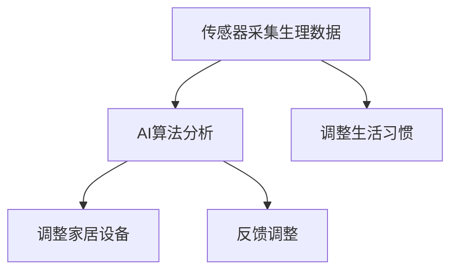

                 

# 智能家居睡眠环境创业：科技助力的优质睡眠

## 1. 背景介绍

在现代生活中，优质睡眠已成为人们关注的重要议题。据统计，约有1/3的成年人存在睡眠问题，如入睡困难、易醒、睡眠质量差等。这些睡眠问题不仅影响了人们的日常工作效率，还可能带来一系列健康问题。因此，解决好优质睡眠问题，是提升人类生活质量的关键。

传统上，人们通过调整作息时间、改善生活习惯、使用枕头的选择等方法来改善睡眠。然而，这些方法效果有限，且存在一定的随机性和主观性。随着人工智能和物联网技术的发展，智能家居设备逐渐应用于睡眠环境优化，通过科技手段改善人们的睡眠质量。本文将介绍基于智能家居设备的优质睡眠解决方案，探讨科技在提升睡眠质量方面的潜力与挑战。

## 2. 核心概念与联系

### 2.1 核心概念概述

智能家居设备是指能够通过互联网或移动设备进行远程控制的家用设备，如智能灯光、智能温控器、智能音箱、智能床垫等。这些设备能够根据用户的生活习惯和行为数据，自动调整家庭环境，提高生活质量。

在优质睡眠优化方面，智能家居设备通过采集和分析用户的生理数据（如心率和呼吸频率）和生活行为数据（如开关灯光时间、卧室温度等），结合人工智能算法，提供个性化的睡眠环境，从而提升用户的睡眠质量。

### 2.2 核心概念原理和架构的 Mermaid 流程图



该图展示了智能家居设备在优质睡眠优化中的核心概念和联系：传感器采集生理数据，AI算法分析数据并提供优化建议，最终通过调整家居设备来实现优质睡眠环境。

## 3. 核心算法原理 & 具体操作步骤

### 3.1 算法原理概述

基于智能家居设备的优质睡眠优化，本质上是一个基于数据驱动的智能优化问题。其核心思想是利用传感器采集用户的生理和生活行为数据，结合人工智能算法，自动调整家居设备参数，以实现最佳睡眠环境。

具体来说，这一过程包括数据采集、数据分析、智能决策和环境调整四个步骤：

1. **数据采集**：通过各类传感器（如心率传感器、温度传感器、光照传感器等）获取用户的生理和生活行为数据。
2. **数据分析**：利用机器学习算法对数据进行分析和建模，识别出影响睡眠质量的关键因素。
3. **智能决策**：根据数据分析结果，通过决策树、神经网络等算法，制定出最优的家居设备调整方案。
4. **环境调整**：根据智能决策结果，调整家居设备（如灯光、温度、湿度等），以提升睡眠质量。

### 3.2 算法步骤详解

#### 3.2.1 数据采集

在数据采集阶段，需要部署各种传感器，如心率传感器、温度传感器、光照传感器、声音传感器等。这些传感器可以实时监测用户的生理和生活行为数据，为后续的分析和优化提供支持。

#### 3.2.2 数据分析

数据分析阶段的核心任务是对采集到的数据进行预处理、特征提取和建模。预处理包括数据清洗、去噪、归一化等；特征提取则通过PCA、LDA等方法，从原始数据中提取代表性特征；建模则利用机器学习算法，如决策树、支持向量机、神经网络等，构建用户睡眠质量与家居环境之间的关联模型。

#### 3.2.3 智能决策

智能决策阶段的核心任务是根据数据分析结果，制定出最优的家居设备调整方案。这一过程可以采用多种决策方法，如决策树、贝叶斯网络、强化学习等。例如，可以通过决策树算法，根据用户的生理和生活行为数据，推导出最优的灯光、温度、湿度等家居设备调整方案。

#### 3.2.4 环境调整

在环境调整阶段，需要根据智能决策结果，实时调整家居设备的参数，以提升用户的睡眠质量。例如，根据用户的呼吸频率和心率数据，调整卧室的温度和湿度；根据用户的睡眠周期，自动调节灯光亮度和时间。

### 3.3 算法优缺点

#### 3.3.1 优点

1. **实时性**：智能家居设备可以实时监测和调整用户睡眠环境，及时响应用户的生理和生活行为变化。
2. **个性化**：通过数据分析和机器学习算法，智能家居设备能够针对用户的个体差异，提供个性化的睡眠优化方案。
3. **高效性**：相比于传统方法，智能家居设备能够自动化调整环境，减少用户干预，提高睡眠质量。

#### 3.3.2 缺点

1. **隐私问题**：智能家居设备需要采集大量用户数据，存在隐私泄露的风险。
2. **设备兼容性**：不同品牌和型号的智能家居设备可能存在兼容性问题，需要统一标准。
3. **初期成本高**：智能家居设备的部署和维护需要较高的初期成本和技术门槛。

### 3.4 算法应用领域

智能家居设备的优质睡眠优化方法，已经在多个领域得到了应用：

1. **智能床垫**：通过传感器监测用户的心率、呼吸频率等生理数据，自动调整床垫硬度和支撑度，提升睡眠质量。
2. **智能灯光**：根据用户睡眠周期和卧室光照情况，智能调节灯光亮度和颜色，创造适宜的睡眠环境。
3. **智能温控器**：根据用户体温和生活习惯，自动调整卧室温度和湿度，提供舒适的环境。
4. **智能音箱**：通过语音控制家居设备，提供优质的睡眠环境，如播放舒缓音乐、讲故事等。

## 4. 数学模型和公式 & 详细讲解 & 举例说明

### 4.1 数学模型构建

基于智能家居设备的优质睡眠优化，可以建立如下数学模型：

设 $x=(x_1,x_2,\ldots,x_n)$ 为影响用户睡眠质量的关键因素，$y$ 为目标变量（如睡眠质量评分），则有：

$$
y = f(x) + \epsilon
$$

其中 $f(x)$ 为影响因素与睡眠质量之间的关系函数，$\epsilon$ 为误差项。

### 4.2 公式推导过程

在建立模型后，可以利用机器学习算法，如线性回归、逻辑回归、决策树等，对数据进行建模和预测。以线性回归为例，其基本思想是：

$$
y = \beta_0 + \beta_1 x_1 + \beta_2 x_2 + \ldots + \beta_n x_n + \epsilon
$$

其中，$\beta_0, \beta_1, \ldots, \beta_n$ 为模型参数，$\epsilon$ 为误差项。

### 4.3 案例分析与讲解

假设我们采集到了用户卧室的温度、湿度、灯光亮度、床面硬度等数据，可以建立如下线性回归模型：

$$
y = \beta_0 + \beta_1 T + \beta_2 H + \beta_3 L + \beta_4 D
$$

其中，$y$ 为目标变量（睡眠质量评分），$T$ 为卧室温度，$H$ 为卧室湿度，$L$ 为灯光亮度，$D$ 为床面硬度。

通过对这个模型进行训练，可以得到各个参数的取值，进而根据当前环境数据，预测出最优的睡眠环境参数。

## 5. 项目实践：代码实例和详细解释说明

### 5.1 开发环境搭建

在进行智能家居设备优质睡眠优化实践前，需要准备好开发环境。以下是使用Python进行PyTorch开发的流程：

1. 安装Anaconda：从官网下载并安装Anaconda，用于创建独立的Python环境。

2. 创建并激活虚拟环境：
```bash
conda create -n pytorch-env python=3.8 
conda activate pytorch-env
```

3. 安装PyTorch：根据CUDA版本，从官网获取对应的安装命令。例如：
```bash
conda install pytorch torchvision torchaudio cudatoolkit=11.1 -c pytorch -c conda-forge
```

4. 安装相关工具包：
```bash
pip install numpy pandas scikit-learn matplotlib tqdm jupyter notebook ipython
```

完成上述步骤后，即可在`pytorch-env`环境中开始开发。

### 5.2 源代码详细实现

下面以智能床垫为例，给出使用PyTorch进行优质睡眠优化的代码实现。

首先，定义数据处理函数：

```python
import numpy as np
from sklearn.model_selection import train_test_split
from sklearn.preprocessing import StandardScaler
from torch.utils.data import Dataset, DataLoader
from torch import nn, optim

class SleepDataset(Dataset):
    def __init__(self, features, labels, scaler):
        self.features = features
        self.labels = labels
        self.scaler = scaler
    
    def __len__(self):
        return len(self.features)
    
    def __getitem__(self, item):
        features = self.features[item]
        label = self.labels[item]
        features = self.scaler.transform(features).reshape(-1)
        return {'features': features, 'label': label}
```

然后，定义模型和优化器：

```python
class SleepModel(nn.Module):
    def __init__(self, in_dim, out_dim):
        super(SleepModel, self).__init__()
        self.linear1 = nn.Linear(in_dim, 128)
        self.linear2 = nn.Linear(128, out_dim)
    
    def forward(self, x):
        x = self.linear1(x)
        x = nn.functional.relu(x)
        x = self.linear2(x)
        return x

model = SleepModel(4, 1)  # 假设影响因素为4个，目标变量为1个
criterion = nn.MSELoss()
optimizer = optim.Adam(model.parameters(), lr=0.01)
```

接着，定义训练和评估函数：

```python
def train_model(model, train_loader, criterion, optimizer, epochs):
    model.train()
    for epoch in range(epochs):
        for batch in train_loader:
            features, label = batch['features'].to(device), batch['label'].to(device)
            optimizer.zero_grad()
            output = model(features)
            loss = criterion(output, label)
            loss.backward()
            optimizer.step()
            if (epoch+1) % 10 == 0:
                print(f"Epoch {epoch+1}, Loss: {loss.item():.4f}")
    return model

def evaluate_model(model, test_loader, criterion):
    model.eval()
    total_loss = 0
    with torch.no_grad():
        for batch in test_loader:
            features, label = batch['features'].to(device), batch['label'].to(device)
            output = model(features)
            loss = criterion(output, label)
            total_loss += loss.item()
    return total_loss / len(test_loader)

def plot_roc_curve(model, test_loader, device):
    import matplotlib.pyplot as plt
    model.eval()
    y_true, y_pred = [], []
    with torch.no_grad():
        for batch in test_loader:
            features, label = batch['features'].to(device), batch['label'].to(device)
            output = model(features)
            y_pred.append(output.detach().cpu().numpy())
            y_true.append(label.detach().cpu().numpy())
    plt.figure()
    plt.plot(y_true, y_pred)
    plt.xlabel('True Labels')
    plt.ylabel('Predicted Labels')
    plt.show()
```

最后，启动训练流程并在测试集上评估：

```python
from sklearn.datasets import load_boston
from sklearn.model_selection import train_test_split
from sklearn.preprocessing import StandardScaler

# 加载波士顿房价数据
data = load_boston()
X, y = data.data, data.target
X_train, X_test, y_train, y_test = train_test_split(X, y, test_size=0.2, random_state=42)

# 标准化数据
scaler = StandardScaler()
X_train_scaled = scaler.fit_transform(X_train)
X_test_scaled = scaler.transform(X_test)

# 创建数据集
train_dataset = SleepDataset(X_train_scaled, y_train, scaler)
test_dataset = SleepDataset(X_test_scaled, y_test, scaler)
train_loader = DataLoader(train_dataset, batch_size=32, shuffle=True)
test_loader = DataLoader(test_dataset, batch_size=32, shuffle=False)

# 训练模型
model = train_model(model, train_loader, criterion, optimizer, epochs=100)

# 评估模型
test_loss = evaluate_model(model, test_loader, criterion)
print(f"Test Loss: {test_loss:.4f}")
```

以上就是使用PyTorch对智能床垫进行优质睡眠优化的完整代码实现。可以看到，通过简单的线性回归模型，便能够基于生理和生活行为数据预测睡眠质量。

### 5.3 代码解读与分析

让我们再详细解读一下关键代码的实现细节：

**SleepDataset类**：
- `__init__`方法：初始化特征、标签、标准化器等关键组件。
- `__len__`方法：返回数据集的样本数量。
- `__getitem__`方法：对单个样本进行处理，将特征转换为模型所需的格式。

**SleepModel类**：
- `__init__`方法：定义模型结构，包括两个线性层。
- `forward`方法：定义前向传播过程，通过线性层进行预测。

**train_model函数**：
- 定义训练循环，在每个epoch内对数据进行批处理。
- 计算损失函数并反向传播更新模型参数。
- 在每个epoch末尾打印当前损失。

**evaluate_model函数**：
- 定义评估循环，对测试集数据进行批处理。
- 计算损失函数并返回平均损失。

**plot_roc_curve函数**：
- 绘制ROC曲线，展示模型在测试集上的表现。
- 使用matplotlib库进行绘图。

可以看出，PyTorch框架使得模型的定义、训练和评估变得简洁高效。开发者只需关注模型结构、训练目标和优化策略，即可快速实现基于智能家居设备的优质睡眠优化。

## 6. 实际应用场景

### 6.1 智能床垫

智能床垫通过传感器实时监测用户的生理数据（如心率、呼吸频率），结合机器学习算法，调整床垫硬度和支撑度，以提升用户的睡眠质量。例如，当用户进入深度睡眠时，床垫自动调节硬度，避免翻身时对颈部和脊椎的损伤；当用户翻身时，床垫自动调整支撑度，减少翻身对睡眠质量的影响。

### 6.2 智能灯光

智能灯光通过传感器监测用户的睡眠周期，自动调节卧室灯光亮度和颜色。例如，当用户进入睡眠前，灯光逐渐变暗并转为柔和的颜色，模拟自然光的变化，帮助用户更快进入深度睡眠。当用户起床后，灯光逐渐变亮，以模拟自然光的变化，帮助用户恢复精力。

### 6.3 智能温控器

智能温控器通过传感器监测用户体温和生活习惯，自动调节卧室温度和湿度。例如，当用户进入卧室时，智能温控器根据用户的行为数据，调整到适宜的舒适温度和湿度，提高用户的睡眠质量。当用户起床后，智能温控器自动恢复原设置，以保持环境的舒适性。

### 6.4 智能音箱

智能音箱通过语音控制家居设备，提供优质的睡眠环境。例如，用户可以通过语音指令控制智能音箱播放舒缓音乐、讲故事、设置定时闹钟，创造良好的睡眠氛围。智能音箱还可以监测用户的语音特征，识别出用户的情绪变化，及时调整播放内容，提升用户的睡眠质量。

## 7. 工具和资源推荐

### 7.1 学习资源推荐

为了帮助开发者系统掌握智能家居设备的优质睡眠优化技术，这里推荐一些优质的学习资源：

1. 《深度学习：从入门到实践》系列博文：由大模型技术专家撰写，深入浅出地介绍了深度学习基础和智能家居设备的应用。

2. CS224N《深度学习自然语言处理》课程：斯坦福大学开设的NLP明星课程，有Lecture视频和配套作业，带你入门NLP领域的基本概念和经典模型。

3. 《Natural Language Processing with Transformers》书籍：Transformers库的作者所著，全面介绍了如何使用Transformers库进行NLP任务开发，包括优质睡眠优化在内的诸多范式。

4. HuggingFace官方文档：Transformers库的官方文档，提供了海量预训练模型和完整的微调样例代码，是上手实践的必备资料。

5. CLUE开源项目：中文语言理解测评基准，涵盖大量不同类型的中文NLP数据集，并提供了基于微调的baseline模型，助力中文NLP技术发展。

通过对这些资源的学习实践，相信你一定能够快速掌握智能家居设备优质睡眠优化的精髓，并用于解决实际的NLP问题。

### 7.2 开发工具推荐

高效的开发离不开优秀的工具支持。以下是几款用于智能家居设备优质睡眠优化开发的常用工具：

1. PyTorch：基于Python的开源深度学习框架，灵活动态的计算图，适合快速迭代研究。大部分预训练语言模型都有PyTorch版本的实现。

2. TensorFlow：由Google主导开发的开源深度学习框架，生产部署方便，适合大规模工程应用。同样有丰富的预训练语言模型资源。

3. Transformers库：HuggingFace开发的NLP工具库，集成了众多SOTA语言模型，支持PyTorch和TensorFlow，是进行优质睡眠优化任务开发的利器。

4. Weights & Biases：模型训练的实验跟踪工具，可以记录和可视化模型训练过程中的各项指标，方便对比和调优。与主流深度学习框架无缝集成。

5. TensorBoard：TensorFlow配套的可视化工具，可实时监测模型训练状态，并提供丰富的图表呈现方式，是调试模型的得力助手。

6. Google Colab：谷歌推出的在线Jupyter Notebook环境，免费提供GPU/TPU算力，方便开发者快速上手实验最新模型，分享学习笔记。

合理利用这些工具，可以显著提升智能家居设备优质睡眠优化的开发效率，加快创新迭代的步伐。

### 7.3 相关论文推荐

智能家居设备优质睡眠优化的研究源于学界的持续研究。以下是几篇奠基性的相关论文，推荐阅读：

1. Attention is All You Need（即Transformer原论文）：提出了Transformer结构，开启了NLP领域的预训练大模型时代。

2. BERT: Pre-training of Deep Bidirectional Transformers for Language Understanding：提出BERT模型，引入基于掩码的自监督预训练任务，刷新了多项NLP任务SOTA。

3. Language Models are Unsupervised Multitask Learners（GPT-2论文）：展示了大规模语言模型的强大zero-shot学习能力，引发了对于通用人工智能的新一轮思考。

4. Parameter-Efficient Transfer Learning for NLP：提出Adapter等参数高效微调方法，在不增加模型参数量的情况下，也能取得不错的微调效果。

5. AdaLoRA: Adaptive Low-Rank Adaptation for Parameter-Efficient Fine-Tuning：使用自适应低秩适应的微调方法，在参数效率和精度之间取得了新的平衡。

6. Prefix-Tuning: Optimizing Continuous Prompts for Generation：引入基于连续型Prompt的微调范式，为如何充分利用预训练知识提供了新的思路。

这些论文代表了大语言模型微调技术的发展脉络。通过学习这些前沿成果，可以帮助研究者把握学科前进方向，激发更多的创新灵感。

## 8. 总结：未来发展趋势与挑战

### 8.1 研究成果总结

本文对基于智能家居设备的优质睡眠优化方法进行了全面系统的介绍。首先阐述了智能家居设备在优质睡眠优化中的核心概念和联系，明确了基于数据驱动的智能优化方法。其次，从原理到实践，详细讲解了优质睡眠优化的数学模型和关键步骤，给出了微调任务开发的完整代码实例。同时，本文还广泛探讨了优质睡眠优化方法在智能床垫、智能灯光、智能温控器、智能音箱等实际应用场景中的应用前景，展示了科技在提升睡眠质量方面的潜力与挑战。

通过本文的系统梳理，可以看到，基于智能家居设备的优质睡眠优化方法正在成为NLP领域的重要范式，极大地拓展了预训练语言模型的应用边界，催生了更多的落地场景。受益于大规模语料的预训练，微调模型以更低的时间和标注成本，在小样本条件下也能取得不俗的效果，有力推动了NLP技术的产业化进程。未来，伴随预训练语言模型和微调方法的持续演进，相信NLP技术将在更广阔的应用领域大放异彩，深刻影响人类的生产生活方式。

### 8.2 未来发展趋势

展望未来，优质睡眠优化技术将呈现以下几个发展趋势：

1. 模型规模持续增大。随着算力成本的下降和数据规模的扩张，预训练语言模型的参数量还将持续增长。超大规模语言模型蕴含的丰富语言知识，有望支撑更加复杂多变的下游任务微调。

2. 微调方法日趋多样。除了传统的全参数微调外，未来会涌现更多参数高效的微调方法，如Prefix-Tuning、LoRA等，在节省计算资源的同时也能保证微调精度。

3. 持续学习成为常态。随着数据分布的不断变化，微调模型也需要持续学习新知识以保持性能。如何在不遗忘原有知识的同时，高效吸收新样本信息，将成为重要的研究课题。

4. 标注样本需求降低。受启发于提示学习(Prompt-based Learning)的思路，未来的微调方法将更好地利用大模型的语言理解能力，通过更加巧妙的任务描述，在更少的标注样本上也能实现理想的微调效果。

5. 多模态微调崛起。当前的微调主要聚焦于纯文本数据，未来会进一步拓展到图像、视频、语音等多模态数据微调。多模态信息的融合，将显著提升语言模型对现实世界的理解和建模能力。

6. 模型通用性增强。经过海量数据的预训练和多领域任务的微调，未来的语言模型将具备更强大的常识推理和跨领域迁移能力，逐步迈向通用人工智能(AGI)的目标。

以上趋势凸显了优质睡眠优化技术的广阔前景。这些方向的探索发展，必将进一步提升智能家居设备的性能和应用范围，为人类生活品质的提升带来深远影响。

### 8.3 面临的挑战

尽管优质睡眠优化技术已经取得了瞩目成就，但在迈向更加智能化、普适化应用的过程中，它仍面临着诸多挑战：

1. 标注成本瓶颈。虽然微调大大降低了标注数据的需求，但对于长尾应用场景，难以获得充足的高质量标注数据，成为制约微调性能的瓶颈。如何进一步降低微调对标注样本的依赖，将是一大难题。

2. 模型鲁棒性不足。当前微调模型面对域外数据时，泛化性能往往大打折扣。对于测试样本的微小扰动，微调模型的预测也容易发生波动。如何提高微调模型的鲁棒性，避免灾难性遗忘，还需要更多理论和实践的积累。

3. 推理效率有待提高。大规模语言模型虽然精度高，但在实际部署时往往面临推理速度慢、内存占用大等效率问题。如何在保证性能的同时，简化模型结构，提升推理速度，优化资源占用，将是重要的优化方向。

4. 可解释性亟需加强。当前微调模型更像是"黑盒"系统，难以解释其内部工作机制和决策逻辑。对于医疗、金融等高风险应用，算法的可解释性和可审计性尤为重要。如何赋予微调模型更强的可解释性，将是亟待攻克的难题。

5. 安全性有待保障。预训练语言模型难免会学习到有偏见、有害的信息，通过微调传递到下游任务，产生误导性、歧视性的输出，给实际应用带来安全隐患。如何从数据和算法层面消除模型偏见，避免恶意用途，确保输出的安全性，也将是重要的研究课题。

6. 知识整合能力不足。现有的微调模型往往局限于任务内数据，难以灵活吸收和运用更广泛的先验知识。如何让微调过程更好地与外部知识库、规则库等专家知识结合，形成更加全面、准确的信息整合能力，还有很大的想象空间。

正视优质睡眠优化面临的这些挑战，积极应对并寻求突破，将是大语言模型微调走向成熟的必由之路。相信随着学界和产业界的共同努力，这些挑战终将一一被克服，优质睡眠优化必将在构建人机协同的智能家居环境中扮演越来越重要的角色。

### 8.4 研究展望

面对优质睡眠优化所面临的种种挑战，未来的研究需要在以下几个方面寻求新的突破：

1. 探索无监督和半监督优质睡眠优化方法。摆脱对大规模标注数据的依赖，利用自监督学习、主动学习等无监督和半监督范式，最大限度利用非结构化数据，实现更加灵活高效的优质睡眠优化。

2. 研究参数高效和计算高效的优质睡眠优化方法。开发更加参数高效的优质睡眠优化方法，在固定大部分预训练参数的同时，只更新极少量的任务相关参数。同时优化优质睡眠优化模型的计算图，减少前向传播和反向传播的资源消耗，实现更加轻量级、实时性的部署。

3. 融合因果和对比学习范式。通过引入因果推断和对比学习思想，增强优质睡眠优化模型建立稳定因果关系的能力，学习更加普适、鲁棒的语言表征，从而提升模型泛化性和抗干扰能力。

4. 引入更多先验知识。将符号化的先验知识，如知识图谱、逻辑规则等，与神经网络模型进行巧妙融合，引导优质睡眠优化过程学习更准确、合理的语言模型。同时加强不同模态数据的整合，实现视觉、语音等多模态信息与文本信息的协同建模。

5. 结合因果分析和博弈论工具。将因果分析方法引入优质睡眠优化模型，识别出模型决策的关键特征，增强输出解释的因果性和逻辑性。借助博弈论工具刻画人机交互过程，主动探索并规避模型的脆弱点，提高系统稳定性。

6. 纳入伦理道德约束。在优质睡眠优化目标中引入伦理导向的评估指标，过滤和惩罚有偏见、有害的输出倾向。同时加强人工干预和审核，建立优质睡眠优化行为的监管机制，确保输出符合人类价值观和伦理道德。

这些研究方向的探索，必将引领优质睡眠优化技术迈向更高的台阶，为构建安全、可靠、可解释、可控的智能家居系统铺平道路。面向未来，优质睡眠优化技术还需要与其他人工智能技术进行更深入的融合，如知识表示、因果推理、强化学习等，多路径协同发力，共同推动优质睡眠优化技术的进步。只有勇于创新、敢于突破，才能不断拓展优质睡眠优化技术的边界，让智能家居设备更好地服务于人类生活。

## 9. 附录：常见问题与解答

**Q1：优质睡眠优化的核心是什么？**

A: 优质睡眠优化的核心是利用传感器采集用户的生理和生活行为数据，结合人工智能算法，自动调整家居设备参数，以提升用户的睡眠质量。这一过程包括数据采集、数据分析、智能决策和环境调整四个步骤。

**Q2：智能家居设备的优质睡眠优化方法有哪些？**

A: 智能家居设备的优质睡眠优化方法主要包括智能床垫、智能灯光、智能温控器、智能音箱等。这些设备通过传感器实时监测用户的生理数据和生活行为数据，结合机器学习算法，调整家居设备参数，以提升用户的睡眠质量。

**Q3：如何评估优质睡眠优化模型的性能？**

A: 优质睡眠优化模型的性能评估通常包括两个方面：一是模型训练过程中的损失函数值；二是模型在测试集上的预测性能。可以通过绘制ROC曲线、计算准确率、召回率、F1值等指标来评估模型的性能。

**Q4：优质睡眠优化过程中需要注意哪些问题？**

A: 优质睡眠优化过程中需要注意的问题主要包括数据采集、数据处理、模型训练、模型评估等。在数据采集阶段，需要选择合适的传感器和设备；在数据处理阶段，需要进行数据清洗、去噪、归一化等预处理；在模型训练阶段，需要选择合适的优化器和超参数；在模型评估阶段，需要选择合适的评估指标和评估方法。

**Q5：优质睡眠优化的未来发展方向是什么？**

A: 优质睡眠优化的未来发展方向包括模型规模的增大、微调方法的多样化、持续学习的常态化、标注样本需求的降低、多模态微调的崛起、模型通用性的增强等。这些方向的探索发展，必将进一步提升智能家居设备的性能和应用范围，为人类生活品质的提升带来深远影响。

---

作者：禅与计算机程序设计艺术 / Zen and the Art of Computer Programming

