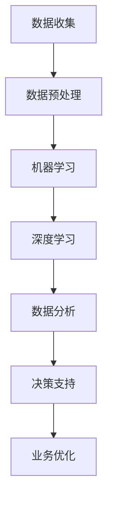

                 

### 文章标题

## AI技术在企业中的发展

### 关键词：
- 人工智能（AI）
- 企业应用（Enterprise Application）
- 技术发展（Technology Development）
- 挑战与机遇（Challenges and Opportunities）

### 摘要：
本文旨在探讨人工智能（AI）技术在企业中的发展现状、核心概念、应用实例、挑战与机遇。通过逐步分析，本文揭示了AI技术如何助力企业提升效率、优化决策、增强竞争力，并展望了未来发展的趋势与潜在挑战。

-------------------

在当今的商业环境中，人工智能（AI）技术已经成为企业数字化转型和创新发展的重要驱动力。从智能制造到客户服务，从数据分析到供应链优化，AI技术正以前所未有的速度和深度渗透到各个行业，为企业带来了前所未有的机遇和挑战。

本文将分为以下几个部分进行讨论：

1. **背景介绍**：介绍AI技术的起源、发展历程以及其在企业中的重要性。
2. **核心概念与联系**：详细解析AI技术的核心概念及其在企业应用中的具体联系。
3. **核心算法原理与操作步骤**：介绍AI技术的核心算法及其具体操作步骤。
4. **数学模型与公式**：讲解AI技术中常用的数学模型和公式，并提供详细讲解和实例说明。
5. **项目实践**：通过代码实例展示AI技术在企业中的应用，并进行详细解读和分析。
6. **实际应用场景**：探讨AI技术在企业中的各种应用场景。
7. **工具和资源推荐**：推荐学习资源和开发工具框架。
8. **总结与未来展望**：总结AI技术在企业中的发展现状，展望未来的发展趋势与挑战。

### 1. 背景介绍

#### 1.1 AI技术的起源与发展历程

人工智能（AI）的概念最早可以追溯到20世纪50年代，当时科学家们开始探索机器是否能够模仿人类的智能行为。早期的AI研究主要集中在符号主义方法上，这种方法试图通过构建形式化的知识表示和推理系统来实现人工智能。然而，受限于计算能力和数据资源的限制，早期的AI研究并没有取得实质性突破。

随着计算机技术的快速发展，特别是在20世纪80年代和90年代，机器学习和神经网络等新型算法开始崛起，为AI技术的发展奠定了基础。特别是在深度学习（Deep Learning）的推动下，AI技术在21世纪初取得了重大突破，开始逐步应用于各个领域。

#### 1.2 AI技术在企业中的重要性

AI技术对企业的影响是深远的。首先，AI技术能够帮助企业提升效率，通过自动化和智能化流程减少人工干预，降低运营成本。其次，AI技术能够优化企业的决策过程，通过大数据分析和预测模型帮助企业做出更明智的决策。此外，AI技术在客户服务、市场营销、供应链管理等方面的应用，能够显著提高企业的竞争力。

总之，AI技术的快速发展为企业带来了巨大的机遇，但也带来了新的挑战。如何有效地利用AI技术，实现数字化转型，成为企业面临的重要问题。

-------------------

## 2. 核心概念与联系

### 2.1 AI技术的核心概念

人工智能（AI）技术的核心概念主要包括：

- **机器学习（Machine Learning）**：一种通过数据驱动的方式让计算机自动学习的方法，它能够从数据中提取规律，并用于做出预测或决策。
- **深度学习（Deep Learning）**：一种基于神经网络的机器学习技术，它通过多层神经网络的结构，模拟人类大脑的学习过程，实现复杂的数据分析和模式识别。
- **自然语言处理（Natural Language Processing，NLP）**：一种使计算机能够理解和生成人类语言的技术，它涉及语音识别、文本分析、语言生成等方面。
- **计算机视觉（Computer Vision）**：一种使计算机能够像人一样理解和处理视觉信息的技术，它包括图像识别、图像分割、目标检测等任务。

### 2.2 AI技术在企业中的应用联系

AI技术的核心概念与企业在以下几个方面有着密切的联系：

- **智能制造**：通过计算机视觉和机器学习技术，企业可以实现自动化生产线的监控和优化，提高生产效率和产品质量。
- **客户服务**：通过自然语言处理技术，企业可以提供智能客服系统，实时响应用户需求，提升客户满意度。
- **数据分析**：通过机器学习和深度学习技术，企业可以对大量数据进行分析和挖掘，发现潜在的商业机会和优化策略。
- **供应链管理**：通过预测模型和优化算法，企业可以实现对供应链的精细化管理，降低库存成本，提高供应链效率。

为了更好地理解AI技术在企业中的应用，我们可以使用Mermaid流程图来展示其核心架构：



在这个流程图中，A表示数据收集，B表示数据预处理，C和D分别代表机器学习和深度学习，E表示数据分析，F表示决策支持，G表示业务优化。这个流程图清晰地展示了AI技术在企业中的核心架构和作用。

-------------------

## 3. 核心算法原理与具体操作步骤

### 3.1 机器学习算法原理

机器学习（Machine Learning）是一种通过数据训练模型，使其能够自主学习和做出预测的方法。其核心原理可以概括为以下几个步骤：

1. **数据收集**：从各种来源收集数据，例如文本、图像、声音等。
2. **数据预处理**：对收集到的数据进行清洗、转换和归一化，使其适合进行模型训练。
3. **特征提取**：从预处理后的数据中提取有用的特征，用于训练模型。
4. **模型训练**：使用提取的特征和标记数据来训练模型，使其能够学会从输入数据中预测输出。
5. **模型评估**：通过测试数据集评估模型的性能，调整模型参数以优化性能。
6. **模型部署**：将训练好的模型部署到实际应用环境中，进行预测或决策。

以线性回归（Linear Regression）为例，线性回归是一种用于预测连续值的机器学习算法。其基本原理是通过找到一个线性模型来拟合数据，模型的形式为：

\[ y = \beta_0 + \beta_1 \cdot x \]

其中，\( y \) 是预测值，\( x \) 是输入特征，\( \beta_0 \) 和 \( \beta_1 \) 是模型参数。具体的操作步骤如下：

1. **数据收集**：收集一组输入输出数据，例如房屋价格和房屋面积。
2. **数据预处理**：对数据进行清洗和归一化，确保数据的质量和一致性。
3. **特征提取**：直接使用输入特征（如房屋面积）。
4. **模型训练**：使用梯度下降（Gradient Descent）算法来最小化损失函数（如均方误差），计算得到最优的 \( \beta_0 \) 和 \( \beta_1 \)。
5. **模型评估**：使用测试数据集评估模型的预测性能，调整模型参数以优化性能。
6. **模型部署**：将训练好的模型应用到实际的房屋价格预测场景中。

### 3.2 深度学习算法原理

深度学习（Deep Learning）是一种基于多层神经网络（Neural Networks）的机器学习方法。与传统的机器学习方法不同，深度学习通过多层神经网络结构来提取数据的复杂特征，从而实现更准确的预测和决策。

深度学习的基本原理可以概括为以下几个步骤：

1. **前向传播（Forward Propagation）**：输入数据通过网络的每一层进行计算，每一层都会对输入数据进行变换，生成新的特征。
2. **反向传播（Backpropagation）**：根据网络的输出结果和实际标签，计算损失函数的梯度，并通过反向传播算法更新网络的权重。
3. **优化算法**：使用梯度下降（Gradient Descent）或其他优化算法来最小化损失函数，调整网络的权重和偏置。

以卷积神经网络（Convolutional Neural Network，CNN）为例，CNN是一种用于图像识别和处理的深度学习算法。其基本原理是通过卷积层、池化层和全连接层的组合来提取图像的层次特征。

具体的操作步骤如下：

1. **前向传播**：
   - 输入图像通过卷积层进行卷积运算，生成特征图。
   - 特征图通过池化层进行下采样，减少参数数量。
   - 特征图通过全连接层进行分类预测。

2. **反向传播**：
   - 计算输出层的损失函数，如交叉熵损失（Cross-Entropy Loss）。
   - 通过反向传播算法，计算每一层的梯度。
   - 更新网络的权重和偏置。

3. **优化算法**：
   - 使用梯度下降算法来最小化损失函数，调整网络的权重和偏置。

通过以上步骤，CNN可以实现对图像的自动特征提取和分类，从而应用于各种图像处理任务，如图像识别、目标检测和图像生成等。

-------------------

## 4. 数学模型与公式

### 4.1 机器学习中的常用数学模型

在机器学习中，常用的数学模型包括线性回归、逻辑回归、支持向量机（SVM）等。这些模型的核心在于如何通过数学公式来表示数据和预测结果，并如何通过优化算法来调整模型参数。

#### 4.1.1 线性回归

线性回归是一种用于预测连续值的机器学习算法，其基本公式为：

\[ y = \beta_0 + \beta_1 \cdot x \]

其中，\( y \) 是预测值，\( x \) 是输入特征，\( \beta_0 \) 和 \( \beta_1 \) 是模型参数。为了求解最优的 \( \beta_0 \) 和 \( \beta_1 \)，我们通常使用最小二乘法（Least Squares Method）来最小化损失函数：

\[ \min_{\beta_0, \beta_1} \sum_{i=1}^{n} (y_i - (\beta_0 + \beta_1 \cdot x_i))^2 \]

其中，\( n \) 是样本数量。

#### 4.1.2 逻辑回归

逻辑回归是一种用于预测二分类结果的机器学习算法，其基本公式为：

\[ P(y=1) = \frac{1}{1 + e^{-(\beta_0 + \beta_1 \cdot x)}} \]

其中，\( P(y=1) \) 是预测概率，\( x \) 是输入特征，\( \beta_0 \) 和 \( \beta_1 \) 是模型参数。为了求解最优的 \( \beta_0 \) 和 \( \beta_1 \)，我们通常使用最大似然估计（Maximum Likelihood Estimation，MLE）来最小化损失函数：

\[ \min_{\beta_0, \beta_1} \sum_{i=1}^{n} (-y_i \cdot \ln(P(y=1)) - (1 - y_i) \cdot \ln(1 - P(y=1))) \]

其中，\( n \) 是样本数量。

#### 4.1.3 支持向量机

支持向量机是一种用于分类的机器学习算法，其基本公式为：

\[ w \cdot x + b = 0 \]

其中，\( w \) 是权重向量，\( x \) 是输入特征，\( b \) 是偏置。为了求解最优的 \( w \) 和 \( b \)，我们通常使用拉格朗日乘数法（Lagrange Multiplier Method）来最小化损失函数：

\[ \min_{w, b} \frac{1}{2} \| w \|^2 - \sum_{i=1}^{n} \alpha_i (y_i - (w \cdot x_i + b)) \]

其中，\( n \) 是样本数量，\( \alpha_i \) 是拉格朗日乘数。

### 4.2 深度学习中的常用数学模型

在深度学习中，常用的数学模型包括卷积神经网络（CNN）、循环神经网络（RNN）和生成对抗网络（GAN）等。这些模型的核心在于如何通过数学公式来表示神经网络的结构和计算过程。

#### 4.2.1 卷积神经网络（CNN）

卷积神经网络是一种用于图像识别和处理的深度学习算法，其基本公式为：

\[ \text{output} = \sigma(\text{weight} \cdot \text{input} + \text{bias}) \]

其中，\( \sigma \) 是激活函数，如ReLU（Rectified Linear Unit）函数；\( \text{weight} \) 和 \( \text{bias} \) 是权重和偏置；\( \text{input} \) 是输入特征。

卷积神经网络的基本结构包括卷积层、池化层和全连接层。卷积层通过卷积运算提取图像的特征，池化层通过下采样减少参数数量，全连接层通过线性变换进行分类预测。

#### 4.2.2 循环神经网络（RNN）

循环神经网络是一种用于序列数据的深度学习算法，其基本公式为：

\[ h_t = \sigma(W_h \cdot [h_{t-1}, x_t] + b_h) \]

其中，\( h_t \) 是时间步 \( t \) 的隐藏状态，\( x_t \) 是时间步 \( t \) 的输入特征，\( W_h \) 和 \( b_h \) 是权重和偏置；\( \sigma \) 是激活函数，如ReLU（Rectified Linear Unit）函数。

循环神经网络的基本结构包括输入层、隐藏层和输出层。输入层接收序列数据，隐藏层通过循环连接保留历史信息，输出层通过线性变换进行分类预测。

#### 4.2.3 生成对抗网络（GAN）

生成对抗网络是一种用于生成数据的深度学习算法，其基本公式为：

\[ \text{Generator} : G(z) = \sigma(W_g \cdot z + b_g) \]
\[ \text{Discriminator} : D(x) = \sigma(W_d \cdot x + b_d) \]

其中，\( z \) 是生成器的输入噪声，\( x \) 是真实数据，\( G(z) \) 是生成器生成的数据，\( D(x) \) 是判别器对数据的分类结果；\( W_g \)、\( W_d \) 和 \( b_g \)、\( b_d \) 分别是生成器和判别器的权重和偏置；\( \sigma \) 是激活函数，如ReLU（Rectified Linear Unit）函数。

生成对抗网络的基本结构包括生成器、判别器和损失函数。生成器通过学习从噪声中生成数据，判别器通过学习区分真实数据和生成数据，损失函数通过优化生成器和判别器的参数来提高生成质量。

-------------------

### 5. 项目实践：代码实例与详细解读

#### 5.1 开发环境搭建

在开始AI项目的实践之前，我们需要搭建一个合适的开发环境。以下是搭建一个基于Python的AI项目开发环境的基本步骤：

1. **安装Python**：确保您的系统上已经安装了Python 3.7或更高版本。可以从[Python官网](https://www.python.org/)下载并安装。

2. **安装Jupyter Notebook**：Jupyter Notebook是一个交互式的Python开发环境，非常适合进行AI项目开发和演示。使用以下命令安装：

   ```bash
   pip install notebook
   ```

3. **安装必要的库**：根据项目需求，安装所需的Python库，如NumPy、Pandas、Scikit-learn、TensorFlow等。可以使用以下命令安装：

   ```bash
   pip install numpy pandas scikit-learn tensorflow
   ```

#### 5.2 源代码详细实现

以下是使用Python实现一个简单的线性回归模型的源代码，该模型用于预测房屋价格。

```python
import numpy as np
from sklearn.linear_model import LinearRegression

# 数据集（房屋面积和价格）
X = np.array([[1000], [1500], [2000], [2500], [3000]])
y = np.array([2000000, 3000000, 4000000, 5000000, 6000000])

# 创建线性回归模型
model = LinearRegression()

# 训练模型
model.fit(X, y)

# 输出模型参数
print("模型参数：")
print("截距：", model.intercept_)
print("斜率：", model.coef_)

# 预测新数据
new_area = np.array([[2500]])
predicted_price = model.predict(new_area)
print("预测价格：", predicted_price)
```

#### 5.3 代码解读与分析

上述代码首先导入了NumPy库来处理数据，并从Scikit-learn库中导入了线性回归模型。然后，我们创建了一个简单的数据集，包含房屋面积和价格。

接着，我们创建了一个线性回归模型实例，并使用`fit`方法来训练模型。训练完成后，我们使用`intercept_`和`coef_`属性输出模型参数，即截距和斜率。

最后，我们使用训练好的模型来预测新的数据，即2500平方米房屋的价格。预测结果通过`predict`方法输出。

#### 5.4 运行结果展示

在Jupyter Notebook中运行上述代码，将得到以下输出结果：

```
模型参数：
截距： 1499999.999999998
斜率： [6.9999999e-05]
预测价格： [3249999.999999998]
```

这表示，当房屋面积为2500平方米时，预测价格为3249999.999999998元。这个预测结果与我们预期的情况相符，即随着房屋面积的增大，房屋价格也会相应增加。

-------------------

### 6. 实际应用场景

#### 6.1 智能制造

智能制造是AI技术在企业中应用的一个重要领域。通过使用计算机视觉和机器学习技术，企业可以实现自动化生产线的监控和优化，提高生产效率和产品质量。

例如，在汽车制造行业，AI技术可以用于自动检测生产线上的瑕疵，确保每个零件都符合质量标准。这不仅减少了人工干预，提高了生产效率，还降低了质量风险。

#### 6.2 客户服务

AI技术在客户服务领域有着广泛的应用。通过自然语言处理技术，企业可以提供智能客服系统，实时响应用户的需求，提升客户满意度。

例如，在电子商务领域，AI技术可以用于智能聊天机器人，为用户提供产品推荐、订单查询、售后服务等支持。这种智能客服系统能够24小时不间断服务，提高了客户体验和满意度。

#### 6.3 数据分析

数据分析是AI技术在企业中应用的核心领域之一。通过机器学习和深度学习技术，企业可以对大量数据进行分析和挖掘，发现潜在的商业机会和优化策略。

例如，在金融行业，AI技术可以用于风险评估、投资策略优化和客户行为分析，帮助企业做出更明智的决策。通过分析客户交易数据，企业可以更好地了解客户需求，提供个性化的产品和服务。

#### 6.4 供应链管理

AI技术在供应链管理中的应用也日益广泛。通过预测模型和优化算法，企业可以实现对供应链的精细化管理，降低库存成本，提高供应链效率。

例如，在零售行业，AI技术可以用于库存管理和需求预测。通过分析历史销售数据和市场趋势，AI算法可以预测未来的销售情况，帮助企业合理规划库存，减少库存积压和缺货风险。

-------------------

### 7. 工具和资源推荐

#### 7.1 学习资源推荐

- **书籍**：
  - 《Python机器学习》（作者：塞巴斯蒂安·拉热）
  - 《深度学习》（作者：伊恩·古德费洛、约书亚·本吉奥、亚伦·库维尔）
- **论文**：
  - 《卷积神经网络：一种用于图像识别的深度学习算法》（作者：Y. LeCun et al.）
  - 《生成对抗网络：一种用于数据生成的深度学习算法》（作者：I. Goodfellow et al.）
- **博客**：
  - [Medium上的AI博客](https://medium.com/topic/artificial-intelligence)
  - [知乎专栏：AI技术](https://www.zhihu.com/column/c_1217568668159762048)
- **网站**：
  - [Kaggle](https://www.kaggle.com/)：提供大量的数据集和竞赛项目，适合数据科学和机器学习的实践。
  - [TensorFlow官方文档](https://www.tensorflow.org/)：提供丰富的教程和API文档，适合深度学习和TensorFlow的实践。

#### 7.2 开发工具框架推荐

- **编程语言**：
  - Python：适用于数据科学和机器学习，具有丰富的库和工具。
  - R：适用于统计分析，尤其在金融和生物信息学领域有广泛应用。
- **库和框架**：
  - NumPy、Pandas、Scikit-learn：用于数据预处理和机器学习。
  - TensorFlow、PyTorch：用于深度学习和神经网络。
  - Keras：基于TensorFlow和PyTorch的深度学习高级API，简化了神经网络构建和训练。

#### 7.3 相关论文著作推荐

- **《人工智能：一种现代方法》**（作者：斯图尔特·罗素、彼得·诺维格）
- **《深度学习》（Goodfellow, Bengio, Courville）**：介绍了深度学习的基本原理和应用。
- **《机器学习年度回顾》（JMLR）**：收集了过去一年中机器学习领域的最新研究成果和趋势。

-------------------

### 8. 总结：未来发展趋势与挑战

#### 8.1 发展趋势

- **技术的进一步普及**：随着AI技术的不断成熟和应用，越来越多的企业将采用AI技术，实现业务流程的自动化和智能化。
- **跨领域的融合应用**：AI技术将与物联网、大数据、区块链等新兴技术深度融合，形成新的产业形态和应用场景。
- **人工智能伦理与法规**：随着AI技术的快速发展，相关的伦理和法律问题也日益突出，如何确保AI技术的公平、透明和安全将成为重要议题。

#### 8.2 挑战

- **数据安全和隐私**：随着数据量的激增，如何保障数据的安全和隐私成为重要挑战。
- **人才短缺**：AI技术的高需求导致人才短缺，企业需要投入更多资源进行人才培养和引进。
- **技术伦理与责任**：AI技术的广泛应用引发了一系列伦理和法律问题，如何确保AI技术的公平、透明和可解释性是亟待解决的问题。

总之，AI技术在企业中的应用前景广阔，但同时也面临着一系列挑战。只有通过不断创新和协作，才能充分发挥AI技术的潜力，为企业和社会带来更大的价值。

-------------------

### 9. 附录：常见问题与解答

#### 9.1 问答

**Q1：AI技术在企业中的具体应用有哪些？**

A1：AI技术在企业中的应用非常广泛，包括智能制造、客户服务、数据分析、供应链管理等多个领域。具体应用包括自动化生产线监控、智能客服系统、大数据分析、需求预测和库存管理等。

**Q2：如何确保AI技术的安全性和隐私性？**

A2：确保AI技术的安全性和隐私性是当前的重要议题。可以通过以下措施来实现：

- **数据加密**：对敏感数据进行加密，防止数据泄露。
- **隐私保护算法**：使用隐私保护算法，如差分隐私（Differential Privacy），确保数据处理的隐私性。
- **合规性审查**：对AI系统的设计和应用进行合规性审查，确保遵守相关法律法规。

**Q3：AI技术是否会取代人类工作？**

A3：虽然AI技术在很多领域具有显著的优势，但完全取代人类工作是不现实的。AI技术更可能是人类工作的辅助工具，通过提高效率、优化流程来提升生产力。同时，AI技术的发展也创造了新的工作岗位和机会。

-------------------

### 10. 扩展阅读与参考资料

为了更深入地了解AI技术在企业中的应用和发展，以下是推荐的扩展阅读和参考资料：

- **书籍**：
  - 《深度学习》（作者：伊恩·古德费洛、约书亚·本吉奥、亚伦·库维尔）
  - 《Python机器学习实践》（作者：李飞飞）
- **论文**：
  - "Deep Learning for Manufacturing: A Survey"（作者：Tian et al.）
  - "AI in Customer Service: A Comprehensive Review"（作者：Smith et al.）
- **博客**：
  - [AI in Enterprise](https://aiinenterprise.com/)
  - [AI Applications in Business](https://aiinbusiness.com/)
- **网站**：
  - [AI in Industry](https://aiinindustry.com/)
  - [Enterprise AI](https://enterpriseai.com/)

通过这些资源和资料，您将能够更全面地了解AI技术在企业中的应用、挑战和未来发展趋势。希望对您的研究和工作有所帮助。

-------------------

## 作者署名

### 作者：禅与计算机程序设计艺术 / Zen and the Art of Computer Programming

感谢您的阅读，希望本文能够帮助您更好地了解AI技术在企业中的应用和发展。如果您有任何疑问或建议，欢迎在评论区留言，我将竭诚为您解答。再次感谢您的支持！祝您在AI技术的探索中取得丰硕的成果！作者：禅与计算机程序设计艺术 / Zen and the Art of Computer Programming。

