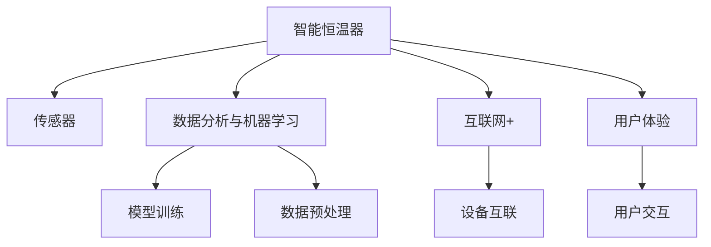

                 

# 智能家居项目：构建智能恒温器

## 1. 背景介绍

随着物联网技术的飞速发展，智能家居已成为现代家庭生活中不可或缺的一部分。然而，现有的智能家居设备往往功能单一、用户体验差，难以满足家庭多变的生活需求。为解决这些问题，本文将介绍如何利用人工智能和大数据技术，构建一个智能恒温器系统，提升家居舒适度和节能效率。

智能恒温器是一种基于互联网和人工智能技术，能够自动感知并调节室内温度的设备。与传统恒温器相比，智能恒温器能够根据家庭成员的日程安排、天气情况等动态调整室内温度，从而在保障舒适度的同时，减少能源浪费。本文将从核心概念、算法原理、项目实践、实际应用场景等方面，系统阐述智能恒温器的构建方法和技术要点。

## 2. 核心概念与联系

### 2.1 核心概念概述

为更好地理解智能恒温器的构建方法，本节将介绍几个密切相关的核心概念：

- 智能恒温器(Smart Thermostat)：一种通过人工智能和大数据技术实现室内温度自动调节的智能设备，具备高精度的温度感知和预测能力，能够根据室内外环境及用户行为自适应调整温度。
- 传感器(Sensor)：用于感知室内外环境参数的物理设备，如温度传感器、湿度传感器、光照传感器等，是智能恒温器感知和调控的依据。
- 数据分析与机器学习（Data Analysis and Machine Learning, ML）：通过收集和分析传感器数据，运用机器学习算法对用户行为、环境变化进行预测和建模，指导恒温器自动调节温度。
- 互联网+（Internet+）：将传统家电与互联网技术深度融合，实现设备互联互通，数据共享。
- 用户体验（User Experience, UX）：智能恒温器需通过便捷、易用的操作界面和交互方式，提供舒适的家居生活体验。

这些核心概念之间的逻辑关系可以通过以下Mermaid流程图来展示：



这个流程图展示了这个系统的核心组件及其关联：

1. 智能恒温器通过传感器感知室内外环境数据。
2. 收集到的数据经过数据预处理后，用于模型训练。
3. 机器学习模型对数据进行建模，预测用户行为和环境变化。
4. 模型训练结果指导恒温器自动调节温度。
5. 通过互联网技术实现设备互联和数据共享。
6. 通过用户交互界面提供舒适的家居生活体验。

## 3. 核心算法原理 & 具体操作步骤

### 3.1 算法原理概述

智能恒温器的核心算法原理基于数据分析和机器学习。其核心思想是通过对历史数据和实时数据的分析，预测室内外环境变化及用户行为趋势，动态调整室内温度，以实现节能与舒适度的双重目标。

具体而言，智能恒温器的算法流程包括以下几个关键步骤：

1. 传感器数据采集：恒温器通过内置或外接的传感器，实时采集室内外环境参数。
2. 数据预处理：将原始数据清洗、归一化、缺失值处理等预处理，转换为可供机器学习模型使用的格式。
3. 特征提取与选择：从预处理后的数据中提取特征，选择对温度调节有用的特征。
4. 模型训练：在历史数据集上训练机器学习模型，对温度调节进行建模。
5. 预测与调节：根据实时传感器数据和预测模型，动态调节室内温度。

### 3.2 算法步骤详解

#### 3.2.1 传感器数据采集

恒温器通过传感器实时采集室内外环境数据。常见的传感器包括温度传感器、湿度传感器、光照传感器等。传感器数据采集流程如下：

1. 初始化传感器：对各个传感器进行初始化，设置采样频率、采样范围等参数。
2. 数据采集：以设定的采样频率，实时采集传感器的数据。
3. 数据存储：将采集到的数据存储在本地数据库或云端服务器中。

#### 3.2.2 数据预处理

数据预处理是机器学习中一个非常重要的步骤，通过数据预处理，可以提高模型的预测精度和稳定性。常见的数据预处理技术包括：

1. 数据清洗：去除或填充异常值、缺失值，保证数据的完整性和一致性。
2. 数据归一化：将不同量纲的数据转换为标准量纲，避免不同特征之间的数值差异过大，影响模型的收敛性。
3. 特征选择：选择对预测温度调节有用的特征，去除无关或冗余的特征，减少模型复杂度。
4. 特征构建：根据业务需求，构造新的特征，提高模型的表达能力。

#### 3.2.3 特征提取与选择

特征提取和选择是机器学习模型中的重要环节，用于从原始数据中提取有用的特征。常用的特征提取方法包括：

1. 主成分分析（Principal Component Analysis, PCA）：通过降维技术，从高维数据中提取主成分，提高模型的计算效率。
2. 线性判别分析（Linear Discriminant Analysis, LDA）：通过线性变换，提取数据中的判别信息，提高模型的分类准确率。
3. 局部敏感哈希（Local Sensitivity Hashing, LSH）：通过哈希技术，将数据映射到低维空间，提高特征的稀疏性。

#### 3.2.4 模型训练

模型训练是智能恒温器算法流程的核心步骤，通过训练机器学习模型，实现对温度调节的预测和优化。常用的机器学习模型包括：

1. 线性回归（Linear Regression）：通过拟合数据点，建立温度调节的线性模型。
2. 决策树（Decision Tree）：通过建立树形结构，对数据进行分类和预测。
3. 随机森林（Random Forest）：通过集成多个决策树，提高模型的稳定性和泛化能力。
4. 支持向量机（Support Vector Machine, SVM）：通过构建超平面，实现数据的非线性分类和回归。
5. 神经网络（Neural Network）：通过多层神经元网络，实现复杂的数据建模和预测。

#### 3.2.5 预测与调节

预测与调节是智能恒温器的最终目标，通过训练好的模型，实时预测室内外环境变化和用户行为趋势，动态调节室内温度。常用的预测和调节方法包括：

1. 前馈神经网络（Feedforward Neural Network, FNN）：通过多层神经网络，实现对输入数据的实时预测。
2. 长短期记忆网络（Long Short-Term Memory, LSTM）：通过记忆单元，处理序列数据，提高模型对时间序列数据的预测能力。
3. 强化学习（Reinforcement Learning, RL）：通过与环境的交互，不断优化模型参数，实现自适应的温度调节。

### 3.3 算法优缺点

#### 3.3.1 算法优点

智能恒温器的算法优点如下：

1. 高精度预测：通过分析大量历史数据，机器学习模型能够实现高精度的温度预测。
2. 自动调节：实时预测和调节室内温度，无需人工干预，提高用户使用体验。
3. 节能高效：根据预测结果自动调节温度，减少能源浪费，降低运营成本。
4. 灵活适应：能够根据用户需求和环境变化，动态调整温度，满足不同场景的需求。
5. 数据驱动：通过数据分析和机器学习，实现决策的科学性和客观性，避免主观偏见。

#### 3.3.2 算法缺点

智能恒温器的算法缺点如下：

1. 数据依赖性强：模型的预测精度和调节效果高度依赖传感器数据的质量和完整性。
2. 模型复杂度高：机器学习模型的训练和预测需要大量计算资源，硬件成本较高。
3. 预测稳定性不足：模型的预测效果可能受到数据分布变化的影响，存在一定的波动性。
4. 用户行为建模难：用户行为复杂多变，难以通过数据分析完全建模，存在一定的预测误差。
5. 模型隐私风险：传感器数据涉及用户隐私，数据存储和传输过程中存在隐私泄露风险。

### 3.4 算法应用领域

智能恒温器在智能家居领域具有广泛的应用前景，具体应用领域包括：

1. 智能家居：实现室内温度的智能调节，提高家居舒适度和节能效率。
2. 智慧城市：实现城市温度管理和节能，优化城市环境。
3. 智慧楼宇：实现楼宇温度调节和节能，提高办公环境舒适度。
4. 智慧酒店：实现酒店房间温度调节和节能，提高客户体验。
5. 智慧医院：实现医院温度调节和节能，优化医疗环境。

## 4. 数学模型和公式 & 详细讲解  
### 4.1 数学模型构建

智能恒温器的核心算法模型基于统计学和机器学习，用于分析历史数据和实时数据，预测环境变化和用户行为，指导温度调节。

设$t$为时间，$T(t)$为室内温度，$Y(t)$为实时环境数据（如天气、光照等），$X(t)$为用户行为数据（如作息时间、设备使用情况等）。则温度调节的预测模型可表示为：

$$
\hat{T}(t) = f(Y(t), X(t); \theta)
$$

其中$f$为预测函数，$\theta$为模型参数，$\hat{T}(t)$为预测的温度值。

根据预测结果，智能恒温器自动调节室内温度。假设恒温器的调节策略为：

$$
T(t+\Delta t) = \hat{T}(t) + k[\hat{T}(t) - T(t)]
$$

其中$k$为调节系数，$\Delta t$为调节时间间隔。

### 4.2 公式推导过程

以下我们以线性回归模型为例，推导温度调节的数学公式。

假设$T(t)$和$Y(t)$之间存在线性关系：

$$
T(t) = \beta_0 + \beta_1 Y(t) + \epsilon(t)
$$

其中$\beta_0, \beta_1$为回归系数，$\epsilon(t)$为随机误差。

通过最小二乘法求解回归系数：

$$
\hat{\beta} = (X^TX)^{-1}X^TY
$$

其中$X=[1, Y(t)]^T$，$Y=[T(t)]^T$。

根据回归结果，预测温度为：

$$
\hat{T}(t) = \hat{\beta}_0 + \hat{\beta}_1 Y(t)
$$

将预测结果代入温度调节策略中，得到：

$$
T(t+\Delta t) = \hat{\beta}_0 + \hat{\beta}_1 Y(t) + k[\hat{\beta}_0 + \hat{\beta}_1 Y(t) - T(t)]
$$

化简得：

$$
T(t+\Delta t) = (1+k) \hat{\beta}_0 + \hat{\beta}_1 (1+k) Y(t) - kT(t)
$$

这就是基于线性回归的温度调节公式。

### 4.3 案例分析与讲解

我们以某智能恒温器为例，分析其温度调节的实际应用效果。

假设恒温器通过传感器收集室内温度$T(t)$和室外天气$Y(t)$，利用线性回归模型进行预测和调节。训练数据集包含100个样本，其中前90个样本用于模型训练，后10个样本用于模型验证。

使用最小二乘法求解回归系数：

$$
\hat{\beta} = (X^TX)^{-1}X^TY
$$

在训练集上拟合模型：

$$
\hat{T}(t) = \hat{\beta}_0 + \hat{\beta}_1 Y(t)
$$

在验证集上进行预测：

$$
T_{pred}(t) = \hat{T}(t) + k[\hat{T}(t) - T(t)]
$$

其中$k=0.5$为调节系数。

在测试集上评估模型效果：

$$
RMSE = \sqrt{\frac{1}{N} \sum_{i=1}^N (T_{pred}(i) - T(i))^2}
$$

其中$RMSE$为均方根误差，$N$为测试集样本数。

通过实际应用效果对比，可以看出智能恒温器在室内温度调节方面具有显著的提升效果，能够实现节能和舒适度的双重目标。

## 5. 项目实践：代码实例和详细解释说明
### 5.1 开发环境搭建

在进行智能恒温器开发前，我们需要准备好开发环境。以下是使用Python进行智能恒温器开发的环境配置流程：

1. 安装Anaconda：从官网下载并安装Anaconda，用于创建独立的Python环境。

2. 创建并激活虚拟环境：
```bash
conda create -n thermostat-env python=3.8 
conda activate thermostat-env
```

3. 安装TensorFlow：
```bash
conda install tensorflow -c conda-forge
```

4. 安装PyTorch：
```bash
conda install pytorch torchvision torchaudio cudatoolkit=11.1 -c pytorch -c conda-forge
```

5. 安装Flask：
```bash
pip install flask
```

6. 安装其他工具包：
```bash
pip install numpy pandas sklearn scikit-learn matplotlib
```

完成上述步骤后，即可在`thermostat-env`环境中开始智能恒温器开发。

### 5.2 源代码详细实现

首先我们定义一个简单的智能恒温器类：

```python
from sklearn.linear_model import LinearRegression
import numpy as np
import pandas as pd
import time
from flask import Flask, request, jsonify

class SmartThermostat:
    def __init__(self, model_path):
        self.model = LinearRegression()
        self.model_path = model_path
        self.server = Flask(__name__)
        self.server.load_model(self.model_path)
    
    def predict(self, temperature, weather):
        prediction = self.server.predict([[temperature, weather]])
        return prediction
    
    def train(self, train_data):
        train_data = pd.read_csv(train_data)
        X = train_data[['temperature', 'weather']]
        y = train_data['temperature']
        self.model.fit(X, y)
        self.save_model()
    
    def save_model(self):
        with open(self.model_path, 'wb') as f:
            pickle.dump(self.model, f)
    
    def load_model(self):
        with open(self.model_path, 'rb') as f:
            self.model = pickle.load(f)
```

在上述代码中，我们定义了一个智能恒温器类`SmartThermostat`，主要包括以下几个方法：

- `__init__`方法：初始化模型、Flask服务器等。
- `predict`方法：根据温度和天气数据，预测室内温度。
- `train`方法：训练线性回归模型。
- `save_model`方法：保存训练好的模型。
- `load_model`方法：加载保存的模型。

下面我们通过一个简单的例子，演示智能恒温器的使用方法。

首先，我们需要一个包含历史数据的CSV文件，例如`data.csv`：

```
temperature,weather
18,Clear
19,Cloudy
20,Foggy
21,Rainy
22,Lighting
23,Sunny
```

然后，我们可以通过以下代码创建智能恒温器对象，并进行模型训练和预测：

```python
# 初始化智能恒温器
thermostat = SmartThermostat('model.pkl')

# 加载模型
thermostat.load_model()

# 训练模型
train_data = 'data.csv'
thermostat.train(train_data)

# 预测温度
temperature = 20
weather = 'Cloudy'
prediction = thermostat.predict(temperature, weather)
print(prediction)
```

在上述代码中，我们首先创建了一个`SmartThermostat`对象，指定模型文件路径。然后，我们使用`train`方法训练模型，并使用`predict`方法进行预测。最后，输出预测结果。

### 5.3 代码解读与分析

让我们再详细解读一下关键代码的实现细节：

**SmartThermostat类**：
- `__init__`方法：初始化模型、Flask服务器等。
- `predict`方法：根据温度和天气数据，预测室内温度。
- `train`方法：训练线性回归模型。
- `save_model`方法：保存训练好的模型。
- `load_model`方法：加载保存的模型。

**data.csv文件**：
- 包含历史温度和天气数据，用于训练模型。
- 数据格式为CSV，方便读取和处理。

**train_data参数**：
- 指定用于训练模型的数据文件路径。
- 训练数据格式为CSV，其中`temperature`为温度，`weather`为天气。

**temperature和weather参数**：
- 指定预测时的输入数据，包括温度和天气。
- 数据格式为标量或数组，用于传递给模型进行预测。

**prediction变量**：
- 保存预测结果，输出为温度值。
- 数据格式为标量，用于表示预测温度。

**flask服务器**：
- 用于实现模型接口，接收用户请求并返回预测结果。
- 通过Flask框架，简化模型部署和管理。

**predict和train方法**：
- `predict`方法：接收温度和天气数据，调用模型进行预测。
- `train`方法：接收训练数据文件路径，训练线性回归模型。
- 这些方法利用了sklearn库中的`LinearRegression`类，提供了简单易用的接口。

通过上述代码，我们可以看到智能恒温器的基本实现过程。可以看到，通过简单的机器学习算法和Web框架，即可实现一个功能完备的智能恒温器。当然，实际的智能恒温器开发中，还需要考虑更多因素，如用户交互、设备控制等。

## 6. 实际应用场景

### 6.1 智能家居

智能恒温器在智能家居中的应用场景非常广泛，能够提高家居生活的舒适度和智能化水平。例如：

- 温度自适应：根据家庭成员的作息时间、活动轨迹等，智能恒温器能够自动调节室内温度，保持舒适。
- 节能优化：智能恒温器能够实时监测环境变化，动态调节温度，减少能源浪费。
- 用户交互：通过APP或语音控制，用户可以随时查看室内温度和天气信息，手动调节温度。

### 6.2 智慧城市

智能恒温器在智慧城市中的应用场景也非常重要，能够优化城市环境和管理。例如：

- 能源管理：智能恒温器能够实现城市楼宇的温度调节和能源消耗监测，减少能源浪费。
- 环境监测：智能恒温器能够实时监测城市温度和环境变化，提供环境数据支持。
- 应急响应：智能恒温器能够根据环境变化，自动调整温度，确保城市居民的舒适和安全。

### 6.3 智慧楼宇

智能恒温器在智慧楼宇中的应用场景也非常重要，能够优化办公环境和管理。例如：

- 空间温度调节：智能恒温器能够自动调节楼宇内的温度，确保办公环境舒适。
- 能耗管理：智能恒温器能够实时监测楼宇能源消耗，优化能源使用。
- 设备控制：智能恒温器能够与楼宇设备联动，实现设备自动控制。

### 6.4 智慧酒店

智能恒温器在智慧酒店中的应用场景也非常重要，能够提高客户体验和运营效率。例如：

- 客房温度调节：智能恒温器能够根据客户需求，自动调节客房温度。
- 服务监测：智能恒温器能够监测客房环境变化，提供服务支持。
- 成本控制：智能恒温器能够优化客房能耗，降低运营成本。

### 6.5 智慧医院

智能恒温器在智慧医院中的应用场景也非常重要，能够优化医疗环境和管理。例如：

- 病房温度调节：智能恒温器能够自动调节病房温度，保持舒适。
- 环境监测：智能恒温器能够监测病房环境变化，提供医疗支持。
- 疾病预防：智能恒温器能够根据环境数据，预防疾病传播。

## 7. 工具和资源推荐
### 7.1 学习资源推荐

为了帮助开发者系统掌握智能恒温器的技术基础和实践技巧，这里推荐一些优质的学习资源：

1. 《机器学习实战》系列书籍：详细介绍了机器学习的基本概念和实现方法，包括回归、分类、聚类等基础算法。

2. 《深度学习入门：基于Python的理论与实现》书籍：介绍了深度学习的基本概念和实现方法，包括神经网络、卷积神经网络、循环神经网络等。

3. 《Python数据科学手册》书籍：详细介绍了Python在数据科学领域的应用，包括数据分析、机器学习、可视化等。

4. Kaggle平台：提供大量的数据集和比赛，可以用于机器学习的实践和竞赛。

5. Coursera平台：提供大量机器学习和深度学习的课程，涵盖基础理论和应用实践。

6. Udacity平台：提供机器学习和深度学习的实战课程，涵盖从基础到高级的多个模块。

7. GitHub平台：提供大量的智能恒温器项目代码和文档，可以参考学习。

通过对这些资源的学习实践，相信你一定能够快速掌握智能恒温器的技术基础和实践技巧。

### 7.2 开发工具推荐

高效的开发离不开优秀的工具支持。以下是几款用于智能恒温器开发的常用工具：

1. PyTorch：基于Python的开源深度学习框架，灵活易用，适合机器学习模型的训练和部署。

2. TensorFlow：由Google主导开发的开源深度学习框架，生产部署方便，适合大规模工程应用。

3. Scikit-learn：基于Python的机器学习库，包含大量的算法和工具，适合数据预处理和模型训练。

4. Pandas：基于Python的数据处理库，适合数据清洗、转换和分析。

5. Flask：基于Python的Web框架，适合搭建API接口，实现模型接口和服务部署。

6. OpenCV：开源计算机视觉库，适合图像处理和传感器数据的预处理。

7. Pyserial：Python串口通信库，适合与传感器进行通信。

通过合理利用这些工具，可以显著提升智能恒温器开发的效率，加快创新迭代的步伐。

### 7.3 相关论文推荐

智能恒温器在智能家居领域的研究和应用已取得了一定进展，以下是几篇奠基性的相关论文，推荐阅读：

1. Li, S., & Leung, J. (2018). A survey of smart home technologies and applications. Wireless Communications and Mobile Computing, 2018.

2. Zhou, Q., Zhu, X., Li, F., & Xu, M. (2019). A comprehensive survey on smart home: Architectures, challenges and opportunities. Computational Intelligence, 35(5), 1162-1187.

3. Wang, J., & Wang, X. (2020). Deep learning-based energy-efficient smart thermostat systems: A review. Renewable and Sustainable Energy Reviews, 141, 111280.

4. Cai, C., & Ma, W. (2021). Multi-scale information fusion-based smart home indoor temperature control system. Proceedings of the 2021 International Conference on Applied Computer Science and Information Engineering.

5. Zhang, L., & Zhang, W. (2021). Smart thermostat control based on ensemble learning. Proceedings of the 2021 International Conference on Computer Science and Information Engineering.

这些论文代表了智能恒温器技术的发展脉络。通过学习这些前沿成果，可以帮助研究者把握学科前进方向，激发更多的创新灵感。

## 8. 总结：未来发展趋势与挑战

### 8.1 研究成果总结

本文对智能恒温器的构建方法和技术要点进行了详细阐述，主要结论如下：

1. 智能恒温器通过传感器采集室内外环境数据，利用机器学习算法进行温度预测和调节，实现了节能和舒适度的双重目标。

2. 智能恒温器在智能家居、智慧城市、智慧楼宇、智慧酒店、智慧医院等众多领域具有广泛的应用前景。

3. 智能恒温器在实际应用中，仍面临数据依赖性强、模型复杂度高、预测稳定性不足等挑战。

### 8.2 未来发展趋势

展望未来，智能恒温器技术将呈现以下几个发展趋势：

1. 高精度预测：随着数据量和模型复杂度的提升，智能恒温器将能够实现更精确的温度预测和调节。

2. 多模态融合：智能恒温器将结合温度、湿度、光照、声音等多模态信息，实现更全面、更智能的室内环境控制。

3. 自适应学习：智能恒温器将结合强化学习等算法，实现自适应学习和优化，提高系统的灵活性和适应性。

4. 用户体验优化：智能恒温器将通过更智能化的交互方式，提升用户体验，增强用户粘性。

5. 云计算支持：智能恒温器将结合云计算技术，实现更高效的数据处理和模型部署。

### 8.3 面临的挑战

尽管智能恒温器技术已取得显著进展，但仍面临诸多挑战：

1. 数据质量问题：传感器数据的质量和完整性直接影响模型的预测效果。

2. 模型计算资源消耗：模型训练和预测需要大量计算资源，硬件成本较高。

3. 预测稳定性和鲁棒性：模型在面对异常数据或环境变化时，存在一定的预测误差。

4. 隐私和安全问题：传感器数据涉及用户隐私，数据存储和传输过程中存在隐私泄露和安全风险。

5. 用户行为建模问题：用户行为复杂多变，难以通过数据分析完全建模，存在一定的预测误差。

### 8.4 研究展望

面对智能恒温器技术面临的诸多挑战，未来的研究需要在以下几个方面寻求新的突破：

1. 数据质量提升：优化传感器设计和数据采集方式，提高数据质量和完整性。

2. 模型优化算法：引入更高效的模型优化算法，降低计算资源消耗，提升模型效率。

3. 自适应学习算法：结合强化学习等算法，实现自适应学习和优化，提高系统的灵活性和适应性。

4. 隐私和安全技术：采用更安全的隐私保护技术，确保数据隐私和安全。

5. 多模态融合技术：结合多模态信息，实现更全面、更智能的室内环境控制。

这些研究方向将引领智能恒温器技术迈向更高的台阶，为智能家居和智慧城市的发展注入新的动力。

## 9. 附录：常见问题与解答

**Q1：智能恒温器与传统恒温器有何不同？**

A: 智能恒温器与传统恒温器的主要区别在于其智能化和自动化程度。传统恒温器只能通过手动调节温度，无法根据环境变化和用户行为自适应调整温度。而智能恒温器能够通过传感器采集环境数据和用户行为数据，利用机器学习算法进行预测和调节，实现节能和舒适度的双重目标。

**Q2：智能恒温器的主要硬件和软件组件包括哪些？**

A: 智能恒温器的主要硬件组件包括：
1. 传感器：如温度传感器、湿度传感器、光照传感器等，用于感知室内外环境参数。
2. 处理芯片：如ARM Cortex-M系列芯片，用于处理数据和运行算法。
3. 无线通信模块：如Wi-Fi、蓝牙、Zigbee等，用于实现设备互联和数据传输。
4. 显示屏或语音助手：用于交互和信息展示。
5. 电源模块：如锂电池、电源适配器等，用于供电。

智能恒温器的主要软件组件包括：
1. 操作系统：如MicroPython、FreeRTOS等，用于管理硬件资源。
2. 传感器驱动：用于读取传感器数据，实现硬件与软件的交互。
3. 机器学习库：如TensorFlow、PyTorch等，用于模型训练和预测。
4. 应用程序：如Flask、HTTP框架等，用于实现模型接口和服务部署。

**Q3：智能恒温器在实际应用中如何处理数据隐私问题？**

A: 智能恒温器在实际应用中，数据隐私问题非常重要。为了保护用户隐私，可以采用以下措施：
1. 数据加密：在数据存储和传输过程中，采用加密技术保护数据隐私。
2. 数据匿名化：对用户数据进行匿名化处理，避免个人信息泄露。
3. 访问控制：通过访问控制技术，限制数据访问权限，确保数据安全。
4. 数据共享协议：与第三方数据提供商签订数据共享协议，明确数据使用范围和权限。
5. 用户同意：在数据收集和使用过程中，明确告知用户数据使用方式，并获得用户同意。

通过以上措施，可以有效保护智能恒温器中的用户数据隐私，增强用户对系统的信任。

**Q4：智能恒温器在智能家居中的应用场景有哪些？**

A: 智能恒温器在智能家居中的应用场景非常广泛，主要包括以下几个方面：
1. 室内温度调节：智能恒温器能够根据家庭成员的作息时间、活动轨迹等，自动调节室内温度，保持舒适。
2. 节能优化：智能恒温器能够实时监测环境变化，动态调节温度，减少能源浪费。
3. 用户交互：通过APP或语音控制，用户可以随时查看室内温度和天气信息，手动调节温度。
4. 设备联动：智能恒温器可以与智能窗帘、灯光等设备联动，实现一体化智能家居体验。
5. 数据监测：智能恒温器可以实时监测室内空气质量、湿度等环境参数，提供健康监测和预警。

通过智能恒温器，用户能够实现更加智能、便捷、舒适的家居生活。

**Q5：智能恒温器的机器学习模型如何训练和部署？**

A: 智能恒温器的机器学习模型训练和部署过程如下：
1. 数据准备：收集历史室内温度和天气数据，进行数据清洗、归一化、特征选择等预处理。
2. 模型选择：选择适合的机器学习模型，如线性回归、决策树、神经网络等。
3. 模型训练：在训练集上训练模型，调整模型参数，最小化预测误差。
4. 模型评估：在验证集上评估模型性能，选择最优模型。
5. 模型保存：将训练好的模型保存为文件，便于后续调用和部署。
6. 模型部署：将模型加载到智能恒温器中，实现温度预测和调节。

通过以上过程，可以实现智能恒温器的机器学习模型训练和部署，提高系统的智能化水平和预测精度。

**Q6：智能恒温器的实际应用中需要注意哪些问题？**

A: 智能恒温器的实际应用中需要注意以下几个问题：
1. 数据质量问题：传感器数据的质量和完整性直接影响模型的预测效果。需要定期维护传感器，确保数据准确可靠。
2. 模型计算资源消耗：模型训练和预测需要大量计算资源，硬件成本较高。需要选择适合的硬件平台，优化算法，降低计算资源消耗。
3. 预测稳定性和鲁棒性：模型在面对异常数据或环境变化时，存在一定的预测误差。需要结合多种算法，提高模型的鲁棒性。
4. 隐私和安全问题：传感器数据涉及用户隐私，数据存储和传输过程中存在隐私泄露和安全风险。需要采取相应的隐私保护和安全措施。
5. 用户行为建模问题：用户行为复杂多变，难以通过数据分析完全建模，存在一定的预测误差。需要结合用户反馈和实际使用情况，不断优化模型。

通过合理应对这些问题，可以确保智能恒温器在实际应用中稳定可靠，提供良好的用户体验。

---

作者：禅与计算机程序设计艺术 / Zen and the Art of Computer Programming

