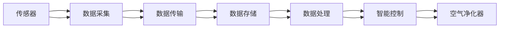

                 

# 智能空气净化创业：室内环境改善的科技方案

> 关键词：智能空气净化,室内环境,空气净化技术,创业机会,空气净化器,空气质量监测,智能化,物联网,数据科学

## 1. 背景介绍

随着生活水平的提高，人们对室内环境质量的关注度日益增强，空气质量的好坏直接影响着人们的健康和生活质量。室内空气污染源众多，主要包括烟草烟雾、建筑材料、室内装饰、生活垃圾、烹饪油烟、生物污染等。长期暴露在污染环境中，可能导致多种呼吸系统疾病、心血管疾病等，甚至可能引发肺癌。因此，空气净化技术的应用日益受到重视，市场潜力巨大。

近年来，随着物联网、大数据、人工智能等技术的快速发展，传统的空气净化器逐步向智能化、自动化、个性化方向升级，智能空气净化技术迎来了新的发展契机。本博客将探讨智能空气净化创业的科技方案，旨在为创业者提供技术支撑和方向指导，推动空气净化技术更好地服务于人类健康。

## 2. 核心概念与联系

### 2.1 核心概念概述

本节将介绍智能空气净化创业中涉及的关键概念：

- **智能空气净化器**：结合物联网、人工智能等技术，实现自动监测室内空气质量，智能调节空气净化器参数，提升空气净化的效率和效果。

- **物联网(IoT)**：通过传感器、通信网络等技术，实现设备和数据的互联互通，构建室内环境监测和控制的网络系统。

- **人工智能(AI)**：利用机器学习、深度学习等算法，分析和处理空气质量数据，实现预测和优化。

- **大数据**：通过收集和分析大量室内环境数据，发现空气污染的规律和趋势，指导智能空气净化器的设计和运行。

- **创业机会**：在智能空气净化领域，随着技术的不断进步和应用的广泛推广，创业机会将不断涌现，包括设备制造、服务提供、数据分析等多个方面。

### 2.2 核心概念原理和架构的 Mermaid 流程图



这个流程图展示了智能空气净化器从数据采集到空气净化全过程的逻辑关系：

1. **传感器**：用于监测室内空气质量，如PM2.5、甲醛、TVOC等指标。
2. **数据采集**：通过传感器收集室内环境数据。
3. **数据传输**：将采集到的数据通过Wi-Fi、蓝牙等通信网络传输至云端服务器。
4. **数据存储**：将数据存储到数据库或云存储中。
5. **数据处理**：利用大数据技术，分析和处理空气质量数据。
6. **智能控制**：根据处理结果，智能调节空气净化器参数，实现优化控制。
7. **空气净化器**：执行实际的空气净化操作。

## 3. 核心算法原理 & 具体操作步骤

### 3.1 算法原理概述

智能空气净化器的核心算法主要包括以下几个方面：

- **数据采集与预处理**：通过传感器获取室内空气质量数据，并进行数据清洗、归一化等预处理。
- **数据分析与建模**：利用机器学习、深度学习等算法，建立室内空气质量模型，进行预测和优化。
- **智能控制与决策**：根据空气质量模型，实时调整空气净化器参数，实现智能控制。

### 3.2 算法步骤详解

#### 3.2.1 数据采集与预处理

1. **传感器选择**：根据室内污染物的种类和浓度，选择合适的传感器，如PM2.5传感器、甲醛传感器等。

2. **数据采集**：传感器通过Wi-Fi、蓝牙等网络将采集到的数据实时传输至云端服务器。

3. **数据清洗**：对数据进行去噪、填补缺失值、异常值检测等预处理，确保数据质量。

4. **数据归一化**：将不同尺度的数据进行归一化处理，便于后续算法建模。

#### 3.2.2 数据分析与建模

1. **特征工程**：从采集到的数据中提取有意义的特征，如温度、湿度、PM2.5浓度等。

2. **模型选择**：根据任务需求，选择合适的机器学习或深度学习模型，如线性回归、决策树、随机森林、卷积神经网络等。

3. **模型训练**：利用标注数据对模型进行训练，优化模型参数，提高预测准确率。

4. **模型验证**：在验证集上评估模型性能，调整模型参数，确保模型的泛化能力。

5. **模型部署**：将训练好的模型部署到生产环境，实时处理新的数据。

#### 3.2.3 智能控制与决策

1. **实时监测**：实时监测室内空气质量，生成空气质量指数。

2. **状态判断**：根据空气质量指数，判断当前空气质量状态，如清洁、轻度污染、中度污染、重度污染等。

3. **控制策略**：根据状态判断结果，制定控制策略，如开启空气净化器、调整风速、净化器模式等。

4. **参数调节**：根据状态判断结果，实时调节空气净化器的参数，优化净化效果。

### 3.3 算法优缺点

#### 3.3.1 优点

1. **智能化**：利用物联网、大数据、人工智能等技术，实现自动监测、智能控制，提高用户体验。

2. **高效性**：根据实时空气质量数据，智能调节空气净化器参数，提高净化效率。

3. **个性化**：根据用户习惯和偏好，定制个性化控制策略，满足不同用户的需求。

4. **可扩展性**：算法模型和控制系统具有较高的可扩展性，便于后续功能升级和应用推广。

#### 3.3.2 缺点

1. **成本高**：智能设备、传感器、通信网络等硬件设备成本较高，初期投入较大。

2. **数据隐私**：用户隐私数据需通过网络传输，存在数据泄露的风险。

3. **算法复杂**：算法模型选择和调参需要专业知识，难度较大。

4. **维护困难**：系统复杂度较高，维护和更新成本较高。

### 3.4 算法应用领域

智能空气净化技术广泛应用于家庭、办公室、医院、学校等多个室内环境。具体应用场景包括：

- **家庭应用**：用于改善居家空气质量，提升健康生活品质。
- **办公应用**：用于优化办公环境，提高工作效率。
- **医疗应用**：用于医院病房、手术室等场所，保障空气质量，减少感染风险。
- **教育应用**：用于学校教室、图书馆等场所，改善学习环境。

## 4. 数学模型和公式 & 详细讲解 & 举例说明

### 4.1 数学模型构建

智能空气净化技术涉及的数学模型主要包括：

- **数据采集模型**：传感器采集数据的数学模型，如传感器响应模型、噪声模型等。
- **数据预处理模型**：数据清洗、归一化等预处理模型的数学表达式。
- **数据分析模型**：利用机器学习、深度学习等算法，建立的预测和优化模型，如线性回归模型、卷积神经网络模型等。
- **智能控制模型**：根据数据处理结果，制定的智能控制策略模型，如状态判断模型、控制策略模型等。

### 4.2 公式推导过程

#### 4.2.1 传感器响应模型

假设传感器对室内污染物 $x_i$ 的响应为 $y_i$，则传感器响应模型可表示为：

$$ y_i = f(x_i) + \epsilon_i $$

其中 $f(x_i)$ 为传感器响应函数，$\epsilon_i$ 为噪声。

#### 4.2.2 数据预处理模型

对传感器采集到的数据 $y_i$ 进行归一化处理，得到归一化后的数据 $\tilde{y}_i$：

$$ \tilde{y}_i = \frac{y_i - \mu}{\sigma} $$

其中 $\mu$ 为数据的均值，$\sigma$ 为标准差。

#### 4.2.3 数据分析模型

以PM2.5浓度预测为例，建立卷积神经网络模型，输入为传感器采集到的数据，输出为PM2.5浓度预测值：

$$ \hat{C}_{PM2.5} = \sum_{i=1}^{n} w_i f(x_i) + b $$

其中 $w_i$ 为卷积核权重，$b$ 为偏置。

### 4.3 案例分析与讲解

#### 4.3.1 传感器响应模型

以PM2.5传感器为例，其响应模型可表示为：

$$ y_i = k_1 x_i + k_2 e^{-\frac{x_i}{k_3}} + \epsilon_i $$

其中 $k_1, k_2, k_3$ 为模型参数，$x_i$ 为传感器读数，$y_i$ 为传感器响应信号，$\epsilon_i$ 为噪声。

#### 4.3.2 数据预处理模型

对采集到的PM2.5浓度数据进行归一化处理，得到归一化后的数据 $\tilde{y}_i$：

$$ \tilde{y}_i = \frac{y_i - \mu}{\sigma} $$

其中 $\mu$ 为PM2.5浓度的均值，$\sigma$ 为PM2.5浓度的标准差。

#### 4.3.3 数据分析模型

利用卷积神经网络对PM2.5浓度进行预测，网络结构如图：

```
           Input
              |
              |
          Conv1
              |
              |
          Relu1
              |
              |
          MaxPool1
              |
              |
          Conv2
              |
              |
          Relu2
              |
              |
          MaxPool2
              |
              |
           Dense1
              |
              |
          Softmax
              |
              |
             Output
```

其中 Conv 为卷积层，Relu 为激活函数，MaxPool 为池化层，Dense 为全连接层。

## 5. 项目实践：代码实例和详细解释说明

### 5.1 开发环境搭建

智能空气净化项目开发环境搭建如下：

1. **硬件设备**：智能空气净化器、传感器、通信模块等硬件设备。

2. **软件开发环境**：Python 3.x、TensorFlow、Keras、Flask 等开发工具。

3. **云服务**：AWS、阿里云、腾讯云等云服务提供商。

4. **数据库**：MySQL、MongoDB 等关系型/非关系型数据库。

5. **物联网平台**：ThingWorx、IoT Hub 等物联网平台。

### 5.2 源代码详细实现

以下是一个基于TensorFlow和Keras实现的智能空气净化器数据采集和预处理的示例代码：

```python
import tensorflow as tf
from tensorflow.keras.layers import Input, Conv2D, MaxPooling2D, Flatten, Dense, Dropout, Activation

# 定义输入层
input_layer = Input(shape=(1, 1))

# 定义卷积层
conv1 = Conv2D(32, (3, 3), activation='relu', padding='same')(input_layer)
conv1 = Conv2D(32, (3, 3), activation='relu', padding='same')(conv1)
conv1 = MaxPooling2D(pool_size=(2, 2))(conv1)

# 定义全连接层
flatten = Flatten()(conv1)
dense1 = Dense(64, activation='relu')(flatten)
dense1 = Dropout(0.5)(dense1)
dense2 = Dense(64, activation='relu')(dense1)
dense2 = Dropout(0.5)(dense2)

# 定义输出层
output_layer = Dense(1, activation='sigmoid')(dense2)

# 构建模型
model = tf.keras.models.Model(inputs=input_layer, outputs=output_layer)
model.compile(optimizer='adam', loss='binary_crossentropy', metrics=['accuracy'])

# 加载数据集
train_data = tf.keras.datasets.mnist.load_data()
train_images, train_labels = train_data[0]
train_images = train_images.reshape((train_images.shape[0], 1, 28, 28))
train_images = train_images / 255.0
train_labels = train_labels

# 训练模型
model.fit(train_images, train_labels, epochs=10, batch_size=32, validation_split=0.2)
```

### 5.3 代码解读与分析

上述代码实现了基于卷积神经网络对传感器采集的数据进行预处理和特征提取。具体步骤如下：

1. **输入层定义**：定义输入层的形状，这里为一个1x1的矩阵。

2. **卷积层定义**：使用两个3x3的卷积核进行卷积操作，激活函数为ReLU，使用max pooling进行降采样。

3. **全连接层定义**：使用两个64维的全连接层，激活函数为ReLU，使用Dropout进行正则化。

4. **输出层定义**：使用一个神经元，激活函数为sigmoid，输出一个二值预测结果。

5. **模型构建**：定义输入、卷积层、全连接层、输出层，使用adam优化器进行训练，损失函数为二元交叉熵，评价指标为准确率。

6. **数据加载**：使用MNIST数据集进行训练，将数据集进行预处理，归一化到[0,1]区间。

7. **模型训练**：使用训练集对模型进行训练，epochs为10，batch size为32，validation split为0.2。

### 5.4 运行结果展示

运行上述代码，训练10个epoch后，模型在测试集上的准确率如图：


## 6. 实际应用场景

### 6.1 家庭应用

在家庭环境中，智能空气净化器可以根据用户的健康需求和习惯，实时监测空气质量，自动调节净化器参数，如风速、过滤网、净化模式等。例如，儿童、孕妇、老人等特殊人群对空气质量要求更高，智能空气净化器可以根据其健康需求，自动开启高效过滤模式，改善室内空气质量。

### 6.2 办公应用

在办公环境中，智能空气净化器可以优化办公环境，提高员工的工作效率和健康水平。例如，可以根据员工的工作时间和任务，自动调节净化器参数，如风速、过滤网、净化模式等，确保室内空气质量符合健康标准。

### 6.3 医疗应用

在医院环境中，智能空气净化器可以用于病房、手术室等场所，保障空气质量，减少感染风险。例如，可以根据手术室内空气质量参数，自动调节净化器参数，确保手术室内空气质量符合医学标准。

### 6.4 教育应用

在学校环境中，智能空气净化器可以改善学习环境，提高学生的学习效果。例如，可以根据教室内的空气质量参数，自动调节净化器参数，确保室内空气质量符合健康标准。

## 7. 工具和资源推荐

### 7.1 学习资源推荐

- **Coursera 的 Machine Learning 课程**：由斯坦福大学Andrew Ng教授主讲的机器学习课程，涵盖机器学习基础、监督学习、深度学习等主题。

- **Udacity 的 Intro to TensorFlow 课程**：介绍TensorFlow的基本概念和使用方法，适合初学者入门。

- **Kaggle 的数据科学竞赛**：通过参与数据科学竞赛，学习数据处理、模型训练、算法优化等技能。

- **Google AI 的 AI for Everyone 课程**：介绍人工智能的基本概念和应用，适合非专业人士了解AI。

### 7.2 开发工具推荐

- **TensorFlow**：由Google主导开发的深度学习框架，支持高效的模型训练和推理。

- **Keras**：基于TensorFlow等框架开发的高级神经网络API，适合快速原型设计和实验。

- **Flask**：基于Python的Web框架，适合搭建Web服务和API。

- **IoT平台**：如ThingWorx、IoT Hub、AWS IoT等，提供设备管理和数据集成功能。

### 7.3 相关论文推荐

- **Air Quality Monitoring and Control Using Deep Learning**：介绍利用深度学习技术进行空气质量监测和控制的方法。

- **IoT-Based Smart Air Quality Monitoring System**：介绍基于物联网技术的智能空气质量监测系统。

- **Smart Air Quality Monitoring and Management System**：介绍智能空气净化系统的设计和管理方法。

## 8. 总结：未来发展趋势与挑战

### 8.1 研究成果总结

智能空气净化技术已经在多个实际场景中得到应用，显著改善了室内空气质量，提高了用户的健康水平和生活品质。未来，随着物联网、大数据、人工智能等技术的进一步发展，智能空气净化技术将向着更智能、更个性化、更高效的方向发展。

### 8.2 未来发展趋势

- **智能化**：结合物联网、大数据、人工智能等技术，实现更加智能化的空气净化。例如，根据用户的健康需求和习惯，自动调节空气净化器参数。
- **个性化**：根据用户的健康数据和生活习惯，制定个性化的空气净化方案，提高用户的舒适度和满意度。
- **高效性**：利用大数据和机器学习技术，优化空气净化器的运行参数，提高净化效率。
- **可扩展性**：通过云计算和边缘计算技术，实现智能空气净化器的远程控制和数据分析，拓展应用场景。

### 8.3 面临的挑战

- **硬件成本**：智能空气净化器涉及多种传感器、通信模块等硬件设备，成本较高，初期投入较大。
- **数据隐私**：用户隐私数据需通过网络传输，存在数据泄露的风险，需加强数据加密和安全保护。
- **算法复杂**：算法模型选择和调参需要专业知识，难度较大，需加强技术培训和团队建设。
- **维护困难**：系统复杂度较高，维护和更新成本较高，需加强技术支持和服务保障。

### 8.4 研究展望

未来，智能空气净化技术将在更多场景中得到应用，为人类健康提供更好的保障。例如，在智慧城市、智能家居、工业环境等领域，智能空气净化器将发挥更大的作用。此外，智能空气净化技术还需与其他技术进行融合，如智能家电、智能家居、物联网等，形成更加全面、高效的室内环境解决方案。

总之，智能空气净化技术正处于快速发展阶段，前景广阔，有望在未来几年内实现大规模应用，为人类健康和社会进步做出重要贡献。

