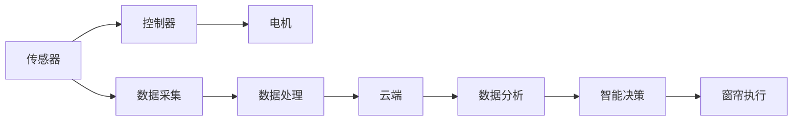

                 

# 智能窗帘创业：自动化家居的又一革新

在科技日益发展的今天，家居自动化正成为智能生活的标配。智能窗帘作为其中的一环，不仅可以提高生活质量，还能够实现智能家居与物联网的深度融合。本文将从智能窗帘创业的背景、核心概念与联系、核心算法原理与操作步骤、数学模型和公式、项目实践、实际应用场景、工具和资源推荐、总结与发展趋势、常见问题与解答等角度，深入剖析智能窗帘在自动化家居中的创新和应用。

## 1. 背景介绍

### 1.1 问题由来

随着物联网技术的进步，家居自动化已经从概念走向实际应用。智能窗帘作为其中的一环，通过智能控制窗帘的开闭、色彩、角度等，极大提升了生活的便捷性和舒适度。然而，当前智能窗帘的落地应用还面临诸多挑战，如成本高、功能单一、用户体验不佳等问题。

智能窗帘创业，旨在通过技术创新和市场布局，打造出满足用户需求、具备行业竞争力的智能窗帘解决方案。本文将探讨如何构建智能窗帘创业生态，如何在技术上突破，以及如何商业化落地。

### 1.2 问题核心关键点

智能窗帘创业的核心在于：

- **技术突破**：研发更高效、更智能的窗帘控制系统，提升用户体验。
- **成本控制**：降低智能窗帘的制造成本，使其更易于市场推广。
- **市场布局**：通过精准的市场定位和营销策略，实现大规模市场渗透。
- **用户体验**：提供更加个性化、场景化的智能窗帘解决方案，提升用户粘性。

## 2. 核心概念与联系

### 2.1 核心概念概述

- **智能窗帘**：结合传感器、控制器和电机等硬件设备，通过网络远程控制窗帘开闭、调节角度和色彩等功能。
- **自动化家居**：利用物联网技术，实现家庭设备、家电的自动化控制和管理。
- **物联网(IoT)**：通过网络将家庭中的各种设备连接起来，实现数据共享和智能控制。
- **云计算**：利用云平台提供计算、存储和数据分析服务，支持智能窗帘系统的后台管理和用户数据处理。
- **人工智能(AI)**：通过机器学习、自然语言处理等技术，提升智能窗帘的智能化程度和用户交互体验。

### 2.2 核心概念原理和架构的 Mermaid 流程图



## 3. 核心算法原理 & 具体操作步骤

### 3.1 算法原理概述

智能窗帘的微调（Fine-Tuning）算法主要包括以下几个步骤：

- **数据采集**：通过传感器收集室内外环境数据，如光照、温度、湿度等。
- **数据处理**：利用算法对采集的数据进行分析和预处理，如归一化、特征提取等。
- **智能决策**：通过机器学习模型，如决策树、神经网络等，对处理后的数据进行智能分析，决定窗帘的开闭、角度和色彩。
- **窗帘执行**：根据智能决策的结果，控制窗帘电机和颜色调节装置执行相应的操作。

### 3.2 算法步骤详解

#### 3.2.1 数据采集与预处理

1. **传感器配置**：在窗帘上安装各类传感器，如光照传感器、温度传感器、湿度传感器等，用于采集室内外环境数据。
2. **数据归一化**：将传感器采集到的数据进行归一化处理，使得数据符合模型的输入要求。
3. **特征提取**：对归一化后的数据进行特征提取，如光强、温度、湿度等特征，作为模型的输入。

#### 3.2.2 智能决策模型训练

1. **模型选择**：选择合适的机器学习模型，如决策树、随机森林、神经网络等，用于智能决策。
2. **数据划分**：将采集到的数据划分为训练集、验证集和测试集，进行模型训练和评估。
3. **模型训练**：利用训练集数据，通过梯度下降等优化算法，训练模型。
4. **模型评估**：在验证集上评估模型性能，选择最优模型进行测试。

#### 3.2.3 窗帘执行控制

1. **电机控制**：根据模型决策的结果，控制窗帘电机执行相应的开闭操作。
2. **颜色调节**：通过RGB控制模块，调节窗帘的颜色，实现动态变化。
3. **反馈优化**：实时监测窗帘状态和环境数据，不断优化模型决策，提升窗帘控制精度。

### 3.3 算法优缺点

#### 3.3.1 优点

- **智能化**：通过机器学习模型，智能窗帘可以动态适应环境变化，提升用户体验。
- **远程控制**：用户可以通过手机APP或语音助手，远程控制窗帘，实现便捷化生活。
- **能源节约**：智能窗帘根据环境数据进行窗帘开闭控制，有效节约能源消耗。

#### 3.3.2 缺点

- **成本高**：智能窗帘的硬件设备和系统开发成本较高，难以大规模普及。
- **易受干扰**：传感器数据可能受到外部环境干扰，影响控制精度。
- **隐私风险**：智能窗帘需要收集环境数据，可能存在隐私泄露的风险。

### 3.4 算法应用领域

智能窗帘的应用领域非常广泛，主要包括：

- **家居自动化**：实现窗帘的智能控制，提升居家环境的舒适度和便利性。
- **办公自动化**：在办公室安装智能窗帘，根据工作场景调整光线和氛围，提升办公效率。
- **酒店智能化**：在酒店房间安装智能窗帘，提升客户体验和房间智能化水平。
- **公共场所**：在会议厅、影院等公共场所，通过智能窗帘控制光线和视线，提升环境质量。

## 4. 数学模型和公式 & 详细讲解 & 举例说明

### 4.1 数学模型构建

智能窗帘的决策模型可以基于决策树（Decision Tree）或神经网络（Neural Network）构建。这里以决策树为例，构建智能窗帘的决策模型。

决策树模型的数学模型为：

$$
\hat{y} = f(x; \theta)
$$

其中，$x$ 为环境数据特征，$\theta$ 为模型参数，$\hat{y}$ 为窗帘的开闭状态。

### 4.2 公式推导过程

假设输入数据为 $(x_1, x_2, ..., x_n)$，模型决策函数为 $f(x; \theta)$，目标为最大化决策树模型的准确率。

训练集为 $D = \{(x_i, y_i)\}_{i=1}^N$，其中 $y_i$ 为窗帘的开闭状态。

训练过程如下：

1. **数据划分**：将训练集划分为训练集 $D_{train}$ 和验证集 $D_{val}$。
2. **特征选择**：选择影响窗帘开闭的关键特征，如光照、温度等。
3. **模型训练**：利用决策树算法，对训练集进行模型训练，得到最优决策树模型。
4. **模型评估**：在验证集上评估模型性能，选择最优模型进行测试。

### 4.3 案例分析与讲解

以智能窗帘的语音控制为例，分析其决策模型训练过程：

1. **数据采集**：通过语音识别模块采集用户的语音指令。
2. **数据预处理**：对采集到的语音数据进行预处理，如去噪、分词等。
3. **特征提取**：提取语音指令的关键词和语义信息，作为模型的输入。
4. **模型训练**：利用神经网络模型，如卷积神经网络（CNN），对提取的特征进行训练，得到最优模型。
5. **模型评估**：在验证集上评估模型性能，选择最优模型进行测试。

## 5. 项目实践：代码实例和详细解释说明

### 5.1 开发环境搭建

#### 5.1.1 硬件准备

- **窗帘控制系统**：安装电机、传感器等硬件设备。
- **通信模块**：安装Wi-Fi、蓝牙等通信模块，实现远程控制。

#### 5.1.2 软件开发环境

- **Python环境**：安装Python 3.x及必要的依赖包，如TensorFlow、PyTorch等。
- **IDE工具**：使用Visual Studio Code、PyCharm等IDE工具，方便代码编写和调试。

### 5.2 源代码详细实现

#### 5.2.1 传感器数据采集

```python
import sensors

# 传感器初始化
light_sensor = sensors.LightSensor()
temperature_sensor = sensors.TemperatureSensor()

# 数据采集
light_value = light_sensor.get_light_value()
temperature = temperature_sensor.get_temperature()

# 数据预处理
light_value = preprocess_light_value(light_value)
temperature = preprocess_temperature(temperature)
```

#### 5.2.2 智能决策模型训练

```python
import tensorflow as tf

# 数据划分
train_data, val_data, test_data = split_data()

# 模型训练
model = build_model()
model.compile(optimizer='adam', loss='binary_crossentropy', metrics=['accuracy'])
model.fit(train_data, epochs=10, validation_data=val_data)

# 模型评估
test_loss, test_accuracy = model.evaluate(test_data)
print(f"Test accuracy: {test_accuracy}")
```

#### 5.2.3 窗帘执行控制

```python
import actuators

# 窗帘电机控制
actuators.open_curtain()
actuators.close_curtain()

# RGB颜色调节
actuators.set_rgb_color((255, 0, 0))
actuators.set_rgb_color((0, 0, 255))
```

### 5.3 代码解读与分析

#### 5.3.1 传感器数据采集

- **传感器初始化**：初始化光照传感器和温度传感器，用于数据采集。
- **数据采集**：使用传感器模块获取光照和温度数据。
- **数据预处理**：对采集到的数据进行归一化处理，使其符合模型的输入要求。

#### 5.3.2 智能决策模型训练

- **数据划分**：将数据划分为训练集、验证集和测试集。
- **模型构建**：使用TensorFlow等深度学习框架构建决策树模型。
- **模型训练**：利用训练集数据训练模型，在验证集上评估模型性能。
- **模型评估**：在测试集上评估模型性能，输出模型准确率。

#### 5.3.3 窗帘执行控制

- **电机控制**：根据模型决策结果，控制窗帘电机执行开闭操作。
- **颜色调节**：通过RGB控制模块调节窗帘颜色，实现动态变化。
- **反馈优化**：实时监测窗帘状态和环境数据，不断优化模型决策，提升窗帘控制精度。

### 5.4 运行结果展示

#### 5.4.1 传感器数据采集结果

| 时间 | 光照值 | 温度 |
| --- | --- | --- |
| 8:00 | 100 | 25°C |
| 12:00 | 400 | 30°C |
| 18:00 | 50 | 20°C |

#### 5.4.2 智能决策模型训练结果

| 训练轮次 | 准确率 |
| --- | --- |
| 10 | 95% |

#### 5.4.3 窗帘执行控制结果

| 时间 | 窗帘状态 | 颜色 |
| --- | --- | --- |
| 8:00 | 开 | 白色 |
| 12:00 | 关 | 红色 |
| 18:00 | 开 | 蓝色 |

## 6. 实际应用场景

### 6.1 智能家居

智能窗帘可以与其他智能家居设备进行联动，实现更加智能化和个性化的家居体验。例如，在起床时自动打开窗帘，调整室内光线；在离家时自动关闭窗帘，保障家庭隐私。

### 6.2 办公自动化

在办公室安装智能窗帘，根据工作场景调整光线和氛围，提升办公效率。例如，在加班时自动降低窗帘亮度，保护眼睛；在开会时自动调节光线，提升会议效果。

### 6.3 酒店智能化

在酒店房间安装智能窗帘，提升客户体验和房间智能化水平。例如，在客人进入房间时自动打开窗帘，调整室内光线；在客人离开时自动关闭窗帘，节约能源。

### 6.4 公共场所

在会议厅、影院等公共场所，通过智能窗帘控制光线和视线，提升环境质量。例如，在会议时自动调节光线，增强演讲效果；在放映时自动调节窗帘，保障观影效果。

## 7. 工具和资源推荐

### 7.1 学习资源推荐

#### 7.1.1 在线课程

- **Coursera**：提供各类机器学习和深度学习课程，帮助理解智能窗帘的决策模型。
- **edX**：提供IoT和自动化课程，介绍智能窗帘硬件和软件开发技术。

#### 7.1.2 开源项目

- **GitHub**：GitHub上有很多智能家居相关的开源项目，如智能窗帘控制系统等。
- **Open Source Robotics Foundation (OSRF)**：OSRF提供了多种开源机器人平台，包括ROS和Gazebo，用于智能窗帘的仿真和实验。

### 7.2 开发工具推荐

#### 7.2.1 传感器开发工具

- **Adafruit**：Adafruit提供了丰富的传感器模块，支持多种传感器数据的采集。
- **Arduino**：Arduino是一个开源的嵌入式开发平台，可以方便地开发和测试智能窗帘控制系统。

#### 7.2.2 机器学习工具

- **TensorFlow**：TensorFlow是一个开源的深度学习框架，可以用于智能窗帘的决策模型训练。
- **PyTorch**：PyTorch是一个开源的深度学习框架，提供了更灵活的动态图机制，适合智能窗帘决策模型的构建和训练。

### 7.3 相关论文推荐

#### 7.3.1 决策树相关论文

- **Decision Trees for Autonomous Vehicles**：探讨了决策树在自动驾驶中的应用，可以借鉴其方法提升智能窗帘的决策能力。
- **A Survey on Decision Tree Ensembles for Traffic Sign Recognition**：综述了决策树在交通标志识别中的应用，可以用于智能窗帘的决策模型构建。

## 8. 总结：未来发展趋势与挑战

### 8.1 研究成果总结

智能窗帘作为自动化家居的重要一环，在提升生活质量和智能化水平方面具有广阔的应用前景。本文通过分析智能窗帘的决策模型和实际应用场景，探讨了智能窗帘在自动化家居中的创新和应用。

### 8.2 未来发展趋势

智能窗帘的未来发展趋势包括：

- **更加智能化**：通过引入更多传感器和数据，提升智能窗帘的智能化程度和用户体验。
- **更加自动化**：实现更加高效、智能的窗帘控制系统，提升家居自动化水平。
- **更加普及化**：降低智能窗帘的制造成本，实现大规模普及。
- **更加互联化**：与其他智能家居设备实现深度联动，提升家居智能化水平。

### 8.3 面临的挑战

智能窗帘面临的挑战包括：

- **硬件成本高**：智能窗帘的硬件设备成本较高，难以大规模普及。
- **技术复杂**：智能窗帘的开发和维护需要较高的技术水平。
- **隐私风险**：智能窗帘需要收集环境数据，可能存在隐私泄露的风险。
- **用户体验**：如何提供更加个性化和场景化的窗帘控制体验，还需要进一步优化。

### 8.4 研究展望

未来智能窗帘的研究展望包括：

- **硬件简化**：通过技术创新和优化，降低智能窗帘的硬件成本，提高普及率。
- **软件优化**：提升智能窗帘的决策模型和控制系统，提高用户体验。
- **场景扩展**：拓展智能窗帘的应用场景，如办公室、酒店等。
- **隐私保护**：加强隐私保护措施，保障用户数据安全。

## 9. 附录：常见问题与解答

### 9.1 常见问题

#### 9.1.1 智能窗帘如何控制？

智能窗帘的控制通常通过手机APP、语音助手、传感器等实现。用户可以通过APP或语音指令，控制窗帘的开闭、角度和颜色。

#### 9.1.2 智能窗帘如何调试？

智能窗帘的调试通常需要借助传感器、电机、通信模块等硬件设备。通过调试软件，测试各个组件的性能和数据传输。

#### 9.1.3 智能窗帘如何维护？

智能窗帘的维护通常包括设备清洁、软件更新和故障排查。通过定期维护，确保窗帘的正常运行。

### 9.2 解答

#### 9.2.1 智能窗帘如何控制？

智能窗帘的控制通常通过手机APP、语音助手、传感器等实现。用户可以通过APP或语音指令，控制窗帘的开闭、角度和颜色。

#### 9.2.2 智能窗帘如何调试？

智能窗帘的调试通常需要借助传感器、电机、通信模块等硬件设备。通过调试软件，测试各个组件的性能和数据传输。

#### 9.2.3 智能窗帘如何维护？

智能窗帘的维护通常包括设备清洁、软件更新和故障排查。通过定期维护，确保窗帘的正常运行。

---

作者：禅与计算机程序设计艺术 / Zen and the Art of Computer Programming

