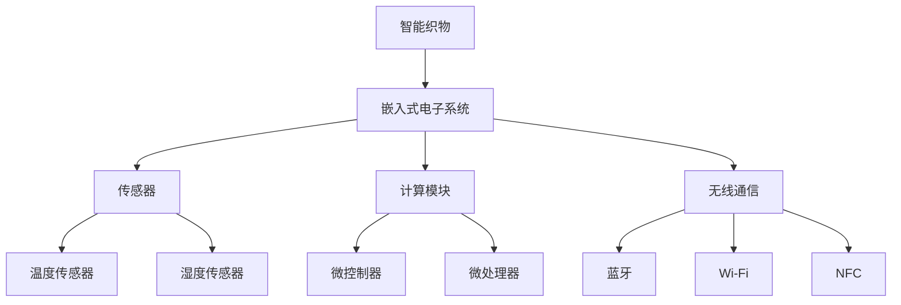

                 

## 1. 背景介绍

### 1.1 问题由来

随着科技的进步，人们对于生活的品质和便利性提出了更高的要求。传统服装只能满足基本的保护和舒适需求，而智能织物技术将计算能力整合到日常服装中，旨在提升服装的功能性和智能化水平，使之更加贴合人们的日常生活。这一领域的快速发展，不仅为服装行业带来了革命性的变化，还为医疗健康、体育运动等多个领域带来了新的可能。

### 1.2 问题核心关键点

智能织物技术通过在普通织物中加入导电纤维、电子元件和传感器等，使衣物具备数据采集、处理和通信能力，从而实现各种智能功能。其核心在于如何将计算能力高效、无缝地集成到服装中，同时确保舒适性、可靠性和安全性。关键问题包括：

- 如何实现织物中的嵌入式电子系统与传统纤维的兼容性。
- 如何优化计算资源的利用，确保实时性。
- 如何设计高效、低功耗的传感和通信系统。
- 如何提高智能织物的可靠性和安全性。

### 1.3 问题研究意义

智能织物技术的研究与应用，将极大地丰富和提升服装的功能与价值，带来以下几方面的积极影响：

- **功能性提升**：智能服装能够实时监测和反馈用户的健康状况、运动状态等关键信息，辅助健康管理和运动训练。
- **便利性增强**：通过智能标签、传感器等技术，实现衣物与其他设备的互联互通，提升用户体验。
- **环境响应性**：智能织物可以根据环境变化自动调整温度、透气性等特性，提高穿着舒适性。
- **跨领域应用**：智能织物技术不仅可以应用于普通服装，还可以延伸到军事、医疗、航空等领域，带来广阔的市场和应用前景。

## 2. 核心概念与联系

### 2.1 核心概念概述

为了更好地理解智能织物技术，本节将介绍几个关键核心概念：

- **智能织物(Smart Fabrics)**：通过将传感器、电子元件和计算模块嵌入普通织物中，使普通服装具备了智能化特性，如实时监测、自适应调节、互联互通等。
- **嵌入式电子系统(Embedded Electronics)**：将电子部件和计算模块集成到织物中，实现各种智能功能，如健康监测、环境响应等。
- **传感器(Sensors)**：如温度传感器、湿度传感器、运动传感器等，用于采集环境数据和用户信息。
- **计算模块(Computing Modules)**：如微控制器、微处理器等，用于数据处理和决策输出。
- **无线通信(Wireless Communication)**：如蓝牙、Wi-Fi、NFC等，用于智能织物之间的互联互通。
- **柔性电子(Flexible Electronics)**：使用柔性材料制成的电子器件，与传统织物兼容，实现良好的可穿戴性。

这些概念之间的关系通过以下Mermaid流程图来展示：



这个流程图展示智能织物中的关键组件及其联系：

1. **智能织物**作为整体系统，包含了**嵌入式电子系统**、**传感器**、**计算模块**和**无线通信**四个核心模块。
2. **传感器**如温度、湿度、运动传感器等，用于采集环境数据和用户信息。
3. **计算模块**如微控制器和微处理器，负责数据处理和决策输出。
4. **无线通信**如蓝牙、Wi-Fi、NFC等，实现智能织物之间的互联互通。

## 3. 核心算法原理 & 具体操作步骤
### 3.1 算法原理概述

智能织物技术的核心算法原理主要围绕着以下几个方面：

- **传感器数据的采集与处理**：通过传感器采集环境数据和用户信息，如温度、湿度、运动等。
- **计算模块的数据处理与决策**：对传感器数据进行处理，如数据融合、异常检测、特征提取等，并通过计算模块进行决策输出。
- **无线通信系统的设计**：实现智能织物之间的互联互通，通过无线通信系统传输数据和命令。
- **电源管理与能量优化**：通过优化电源管理和能量利用，延长智能织物的使用寿命。

### 3.2 算法步骤详解

智能织物技术的应用流程包括以下关键步骤：

**Step 1: 织物嵌入**  
- 将传感器、电子元件和计算模块嵌入到织物中，确保与传统纤维的兼容性和可穿戴性。
- 设计电子系统的布局和电路，避免对织物外观和舒适性的影响。

**Step 2: 数据采集与处理**  
- 在智能织物上安装温度、湿度、压力等传感器，采集环境数据。
- 设计算法对传感器数据进行处理，如数据清洗、特征提取、异常检测等。

**Step 3: 计算模块的选择与设计**  
- 选择适当的计算模块，如微控制器、微处理器等，确保数据处理的实时性和高效性。
- 设计计算模块的程序和算法，实现决策输出。

**Step 4: 无线通信系统的集成**  
- 选择合适的无线通信技术，如蓝牙、Wi-Fi、NFC等，实现智能织物之间的互联互通。
- 设计无线通信协议和数据格式，确保数据传输的可靠性和安全性。

**Step 5: 电源管理与能量优化**  
- 设计电源管理策略，如低功耗模式、能量收集等，延长智能织物的使用寿命。
- 优化算法和电路设计，减少计算和通信的能量消耗。

**Step 6: 应用部署与用户测试**  
- 将智能织物应用到实际场景中，如运动服装、健康监测服装等。
- 收集用户反馈，不断优化系统的性能和用户体验。

### 3.3 算法优缺点

智能织物技术具有以下优点：

- **多功能性**：可以实现健康监测、运动训练、环境响应等多种功能。
- **舒适性**：通过柔性电子技术和传感器的优化设计，确保穿着舒适。
- **实时性**：嵌入式计算模块和无线通信系统的集成，实现数据的实时处理和传输。

同时，该技术也存在以下局限性：

- **成本高**：嵌入式电子系统的开发和生产成本较高。
- **复杂性**：涉及电子、织物、计算等多个领域的交叉技术，开发难度较大。
- **可靠性**：传感器的精度和电子系统的稳定性需要进一步提高。
- **安全性**：智能织物的数据传输和存储需要保障安全性。

### 3.4 算法应用领域

智能织物技术可以应用于多个领域，包括但不限于：

- **健康监测**：通过智能织物监测用户的健康状况，如心率、血氧、运动量等，提供健康管理建议。
- **运动训练**：实时监测运动数据，提供运动训练指导，如运动强度、姿势等。
- **环境响应**：根据环境变化自动调整织物的温度、透气性等特性，提高舒适性。
- **军事应用**：智能军服用于战场环境监测、士兵状态监控等。
- **航空航天**：智能航空服用于压力监测、环境适应等。
- **智能家居**：智能家居织物用于家居环境监测、智能控制等。

## 4. 数学模型和公式 & 详细讲解 & 举例说明

### 4.1 数学模型构建

智能织物技术的数学模型主要涉及以下几个方面：

- **传感器的数据采集与处理**：采集的数据包括温度、湿度、压力等，通过线性回归、时间序列等方法进行建模。
- **计算模块的数据处理与决策**：设计算法如逻辑回归、支持向量机等，用于数据的分类和决策。
- **无线通信系统的数据传输**：设计通信协议，确保数据传输的可靠性和安全性。
- **电源管理与能量优化**：通过优化电源管理和能量利用，延长智能织物的使用寿命。

### 4.2 公式推导过程

以温度监测为例，假设传感器采集到的温度数据为 $T_i$，时间为 $t_i$，建立线性回归模型：

$$
\hat{T}(t) = \beta_0 + \beta_1 t + \epsilon_t
$$

其中，$\beta_0$ 和 $\beta_1$ 为模型参数，$\epsilon_t$ 为误差项。通过最小化均方误差，求解模型参数：

$$
\min_{\beta_0,\beta_1} \frac{1}{N}\sum_{i=1}^N (T_i - (\beta_0 + \beta_1 t_i))^2
$$

通过求解上述优化问题，得到模型参数，进而实现对温度数据的预测和分析。

### 4.3 案例分析与讲解

以智能运动服为例，分析其应用场景和实现过程：

**案例背景**  
智能运动服通过在服装上嵌入传感器和计算模块，实时监测用户的运动数据，如心率、血氧、步数等，同时通过无线通信系统将数据传输到手机或其他设备，用于运动训练和健康管理。

**传感器设计**  
智能运动服需要安装的传感器包括心率传感器、血氧传感器、运动传感器等。心率传感器和血氧传感器用于监测用户的心率和血氧水平，运动传感器用于监测用户的运动量、步数和消耗的卡路里。

**数据处理与决策**  
计算模块设计逻辑回归算法，对传感器数据进行处理，如数据清洗、特征提取和异常检测。逻辑回归算法通过分析心率、血氧和运动数据，预测用户的健康状态和运动强度，输出运动建议和健康管理建议。

**无线通信系统**  
选择蓝牙作为无线通信技术，设计蓝牙协议和数据格式，确保数据传输的可靠性和安全性。智能运动服通过蓝牙将数据传输到手机或其他设备，进行分析和反馈。

**电源管理与能量优化**  
设计低功耗模式和能量收集策略，确保智能运动服在长时间运动中的能量供应。例如，利用太阳能电池板收集能量，为计算模块和传感器供电。

## 5. 项目实践：代码实例和详细解释说明

### 5.1 开发环境搭建

在进行智能织物技术开发前，我们需要准备好开发环境。以下是使用Python进行PyTorch开发的环境配置流程：

1. 安装Anaconda：从官网下载并安装Anaconda，用于创建独立的Python环境。

2. 创建并激活虚拟环境：
```bash
conda create -n pytorch-env python=3.8 
conda activate pytorch-env
```

3. 安装PyTorch：根据CUDA版本，从官网获取对应的安装命令。例如：
```bash
conda install pytorch torchvision torchaudio cudatoolkit=11.1 -c pytorch -c conda-forge
```

4. 安装各类工具包：
```bash
pip install numpy pandas scikit-learn matplotlib tqdm jupyter notebook ipython
```

完成上述步骤后，即可在`pytorch-env`环境中开始开发。

### 5.2 源代码详细实现

这里我们以智能温度监测服为例，给出使用PyTorch进行嵌入式系统开发的完整代码实现。

首先，定义温度传感器的数据采集函数：

```python
import numpy as np
from torch.utils.data import Dataset
import torch

class TemperatureDataset(Dataset):
    def __init__(self, temperature_data, timesteps):
        self.temperature_data = temperature_data
        self.timesteps = timesteps
        self.dataset = self._build_dataset()
    
    def _build_dataset(self):
        data = []
        for i in range(self.timesteps):
            for j in range(i, i+self.timesteps):
                data.append(self.temperature_data[j])
        return data
    
    def __len__(self):
        return len(self.dataset)
    
    def __getitem__(self, item):
        temperature = self.dataset[item]
        timestamp = np.array([i for i in range(temperature.shape[0])])
        return torch.tensor(temperature), torch.tensor(timestamp)
```

然后，定义计算模块的数据处理与决策函数：

```python
from torch import nn, optim
import torch.nn.functional as F

class TemperaturePredictor(nn.Module):
    def __init__(self, input_size, hidden_size, output_size):
        super(TemperaturePredictor, self).__init__()
        self.rnn = nn.RNN(input_size, hidden_size, batch_first=True)
        self.fc = nn.Linear(hidden_size, output_size)
    
    def forward(self, x, hidden):
        out, hidden = self.rnn(x, hidden)
        out = self.fc(out)
        return out, hidden

input_size = 1
hidden_size = 64
output_size = 1
num_layers = 2

temperature_predictor = TemperaturePredictor(input_size, hidden_size, output_size)
optimizer = optim.Adam(temperature_predictor.parameters(), lr=0.001)
criterion = nn.MSELoss()
hidden = temperature_predictor.init_hidden(num_layers)
```

接着，定义无线通信系统的数据传输函数：

```python
from pytorch_rfcomm import PytorchRFCOMM

class TemperatureServer(PytorchRFCOMM):
    def __init__(self, temperature_predictor):
        super(TemperatureServer, self).__init__()
        self.temperature_predictor = temperature_predictor
    
    def send_temperature(self, temperature):
        self.temperature_predictor.eval()
        with torch.no_grad():
            predicted_temperature = self.temperature_predictor(torch.tensor([temperature], dtype=torch.float32))
            return predicted_temperature.item()
    
temperature_server = TemperatureServer(temperature_predictor)
```

最后，启动温度监测服的无线通信服务：

```python
temperature_server.start_server()

while True:
    temperature = temperature_server.send_temperature()
    print(f"Received temperature: {temperature:.2f}C")
```

以上就是使用PyTorch进行智能温度监测服开发的完整代码实现。可以看到，通过设计数据采集函数、计算模块和无线通信系统，实现了对温度数据的实时监测和处理。

### 5.3 代码解读与分析

让我们再详细解读一下关键代码的实现细节：

**TemperatureDataset类**：  
- `__init__`方法：初始化温度数据和数据步长。
- `_build_dataset`方法：对温度数据进行滑动窗口处理，生成数据集。
- `__len__`方法：返回数据集的长度。
- `__getitem__`方法：获取指定位置的数据。

**TemperaturePredictor类**：  
- `__init__`方法：定义RNN模型和全连接层。
- `forward`方法：前向传播计算预测温度。
- `temperature_predictor`：实例化温度预测模型。
- `optimizer`和`criterion`：定义优化器和损失函数。
- `hidden`：初始化RNN的隐藏状态。

**TemperatureServer类**：  
- `__init__`方法：初始化温度预测模型和RF通讯模块。
- `send_temperature`方法：接收温度数据，进行预测并返回结果。

**temperature_server.start_server()**：  
启动RF通讯服务，等待客户端连接。

**while循环**：  
持续接收客户端发送的温度数据，进行预测并输出。

通过上述代码的详细解读，可以看出智能织物技术在实际应用中的开发流程和实现细节。开发者可以根据具体需求，进一步扩展和优化代码，实现更多功能。

## 6. 实际应用场景

### 6.1 智能健康监测服

智能健康监测服通过在服装上嵌入传感器和计算模块，实时监测用户的健康状况，如心率、血氧、步数等，提供健康管理建议。在运动时，智能健康监测服能够实时反馈运动数据，帮助用户进行科学运动，预防运动伤害。

### 6.2 智能运动服

智能运动服通过在服装上嵌入运动传感器和计算模块，实时监测用户的运动数据，如心率、血氧、步数等，提供运动训练指导和运动建议。智能运动服还能记录运动轨迹，帮助用户分析运动模式，提升运动效果。

### 6.3 智能家居服

智能家居服通过在服装上嵌入传感器和计算模块，实现家居环境监测和智能控制。例如，智能家居服可以通过运动检测自动调节室内灯光和温度，通过声音识别与手机互动，实现更加便捷的生活体验。

### 6.4 未来应用展望

随着智能织物技术的不断进步，未来将涌现更多智能服装的应用场景，为人们的生活带来更多便利和乐趣：

- **智能医疗**：智能医疗服用于监测患者的健康状况，提供医疗建议和护理指导。
- **智能运动**：智能运动服能够实时监测运动数据，辅助运动训练和健康管理。
- **智能安防**：智能安防服用于监测环境变化，如火灾、烟雾等，提供安全警示。
- **智能穿戴设备**：智能手表、智能眼镜等设备将进一步融合智能织物技术，实现更多的功能。
- **智能娱乐**：智能娱乐服用于游戏互动、社交娱乐等，提升用户体验。

## 7. 工具和资源推荐

### 7.1 学习资源推荐

为了帮助开发者系统掌握智能织物技术，这里推荐一些优质的学习资源：

1. **《物联网与智能服装》系列博文**：详细介绍了物联网技术在智能服装中的应用，包括传感器设计、数据处理和无线通信等。
2. **CS224N《深度学习自然语言处理》课程**：斯坦福大学开设的NLP明星课程，涵盖深度学习在自然语言处理中的应用，包括文本分类、情感分析等。
3. **《机器学习与深度学习》书籍**：全面介绍了机器学习和深度学习的基本概念和算法，适合初学者入门。
4. **Kaggle数据集**：包含大量智能服装相关的数据集和竞赛，提供了丰富的实践机会。
5. **GitHub开源项目**：汇集了众多智能服装开发项目，可以参考和学习。

通过这些资源的学习实践，相信你一定能够快速掌握智能织物技术的精髓，并用于解决实际的智能服装问题。

### 7.2 开发工具推荐

高效的开发离不开优秀的工具支持。以下是几款用于智能织物开发常用的工具：

1. **PyTorch**：基于Python的开源深度学习框架，灵活动态的计算图，适合快速迭代研究。
2. **TensorFlow**：由Google主导开发的开源深度学习框架，生产部署方便，适合大规模工程应用。
3. **Arduino**：广泛使用的嵌入式系统开发平台，支持多种传感器和电子模块。
4. **SparkFun**：提供丰富的传感器和电子模块，方便开发者进行硬件原型设计。
5. **GitHub**：代码托管平台，便于开发者分享和协作。

合理利用这些工具，可以显著提升智能织物开发效率，加快创新迭代的步伐。

### 7.3 相关论文推荐

智能织物技术的发展源于学界的持续研究。以下是几篇奠基性的相关论文，推荐阅读：

1. **"Smart Fabrics for Health Monitoring and Human-Computer Interaction"**：介绍智能织物在健康监测和人机交互中的应用。
2. **"Real-Time Data Acquisition and Processing on Smart Clothing"**：探讨智能服装的数据采集和处理技术。
3. **"An Overview of Wearable Devices for Health Monitoring"**：综述当前智能穿戴设备在健康监测中的应用。
4. **"Intelligent Wearable Textiles for Real-time Monitoring and Control"**：介绍智能织物在实时监测和控制中的应用。

这些论文代表智能织物技术的发展脉络。通过学习这些前沿成果，可以帮助研究者把握学科前进方向，激发更多的创新灵感。

## 8. 总结：未来发展趋势与挑战

### 8.1 总结

本文对智能织物技术进行了全面系统的介绍。首先阐述了智能织物技术的背景和意义，明确了其在提升服装功能性和智能化水平方面的独特价值。其次，从原理到实践，详细讲解了智能织物技术的数学模型和实现步骤，给出了智能织物开发的完整代码实例。同时，本文还广泛探讨了智能织物技术在智能健康监测、智能运动、智能家居等领域的实际应用，展示了智能织物技术的广阔前景。此外，本文精选了智能织物技术的各类学习资源，力求为读者提供全方位的技术指引。

通过本文的系统梳理，可以看到，智能织物技术正在成为服装行业的重要范式，极大地丰富和提升了服装的功能与价值，带来了新的市场和应用机遇。未来，伴随智能织物技术的不断发展，其应用范围将进一步扩展，为人们的生活带来更多便利和乐趣。

### 8.2 未来发展趋势

展望未来，智能织物技术将呈现以下几个发展趋势：

1. **多功能化**：智能织物技术将进一步融合多模态数据，实现更加丰富和智能的功能。例如，结合温度、湿度、声音等多模态信息，实现更加精准的健康监测和环境响应。
2. **低功耗化**：随着电子技术的发展，智能织物中的计算模块和传感器将进一步优化，实现更低的功耗和更长的续航时间。例如，使用低功耗微控制器和传感器。
3. **智能化**：智能织物技术将更加智能化，具备自主学习和自适应调节能力。例如，通过机器学习算法，实现更精准的环境监测和健康管理。
4. **定制化**：智能织物技术将更加个性化，能够根据不同用户的需求进行定制。例如，通过个性化设计，实现不同功能的智能织物。
5. **跨领域融合**：智能织物技术将与其他技术领域进行更深入的融合，如物联网、人工智能等，拓展其应用边界。

以上趋势凸显了智能织物技术的广阔前景。这些方向的探索发展，必将进一步提升智能织物系统的性能和应用范围，为人们的生活带来更多便利和乐趣。

### 8.3 面临的挑战

尽管智能织物技术已经取得了瞩目成就，但在迈向更加智能化、普适化应用的过程中，它仍面临着诸多挑战：

1. **成本高**：智能织物技术的开发和生产成本较高，需要投入大量资金。如何降低成本，提高生产效率，是关键挑战。
2. **复杂性**：智能织物技术涉及电子、织物、计算等多个领域的交叉技术，开发难度较大。需要跨学科协作和综合技术能力。
3. **可靠性**：传感器的精度和电子系统的稳定性需要进一步提高，以确保系统的可靠性和稳定性。
4. **安全性**：智能织物的数据传输和存储需要保障安全性，避免数据泄露和隐私问题。
5. **用户体验**：智能织物技术需要提升用户体验，确保其在实际应用中的舒适性和便捷性。

### 8.4 研究展望

面对智能织物技术面临的挑战，未来的研究需要在以下几个方面寻求新的突破：

1. **降低成本**：通过优化设计和生产工艺，降低智能织物技术的成本。例如，使用可降解材料和绿色生产工艺。
2. **提升可靠性**：提高传感器的精度和电子系统的稳定性，确保系统的可靠性和稳定性。例如，引入冗余设计和错误检测机制。
3. **增强安全性**：保障智能织物的数据传输和存储安全，避免数据泄露和隐私问题。例如，采用加密技术和安全协议。
4. **优化用户体验**：提升智能织物技术的舒适性和便捷性，确保其在实际应用中的用户体验。例如，采用人体工程学设计和智能控制。

这些研究方向的探索，必将引领智能织物技术迈向更高的台阶，为人们的生活带来更多便利和乐趣。

---

作者：禅与计算机程序设计艺术 / Zen and the Art of Computer Programming

