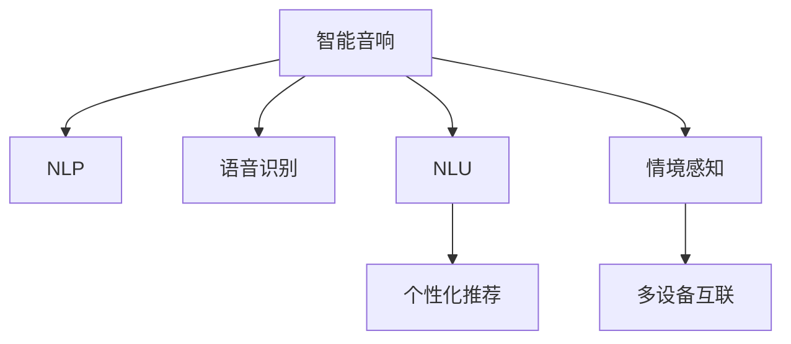

                 

# 智能音响：家庭娱乐中的注意力焦点

## 1. 背景介绍

### 1.1 问题由来
智能音响作为智能家居生态的重要组成部分，以其便捷的交互方式、丰富的功能配置、高质量的音质效果，迅速成为家庭娱乐中的新宠。然而，传统的音响系统往往只能提供单一的音频播放功能，难以满足用户的个性化需求。如何利用先进的AI技术，构建智能化的音响系统，成为当前研究的热点问题。

### 1.2 问题核心关键点
本文聚焦于智能音响的智能化改进，通过机器学习、自然语言处理等技术，提升音响的交互能力、内容推荐、情境感知等关键功能，实现家庭娱乐场景的个性化定制和智能化管理。具体而言，本文将探讨以下核心问题：

- 如何利用自然语言处理技术，实现智能音响的语音识别与自然语言理解，增强用户体验。
- 如何通过用户行为数据分析，实现个性化内容的推荐与播放。
- 如何实现情境感知，在特定情境下自动调节音量、音质等参数。
- 如何在多设备互联的环境下，实现音乐播放的同步控制与智能联动。

这些问题将通过本文提出的智能音响系统架构，结合机器学习与自然语言处理技术进行详细解答。

## 2. 核心概念与联系

### 2.1 核心概念概述

为更好地理解本文提出的智能音响系统架构，本节将介绍几个密切相关的核心概念：

- 自然语言处理(Natural Language Processing, NLP)：指利用计算机技术处理和理解自然语言，实现语音识别、文本分类、机器翻译、语义分析等功能。
- 语音识别(Speech Recognition)：通过麦克风采集音频，识别出用户发出的语音指令。
- 自然语言理解(Natural Language Understanding, NLU)：对用户语音指令进行语义分析，理解用户的意图和需求。
- 个性化推荐(Recommendation System)：通过用户行为数据，推荐用户可能感兴趣的内容，如歌曲、播客、电影等。
- 情境感知(Context-Awareness)：根据当前环境和用户习惯，自动调整音响系统参数，提升用户体验。
- 多设备互联(Connected Devices)：通过网络技术将音响系统与其他智能设备连接，实现智能联动和控制。

这些核心概念之间的逻辑关系可以通过以下Mermaid流程图来展示：



这个流程图展示了几项核心功能的关联关系：

1. 语音识别和自然语言理解是智能音响与用户交互的基础。
2. 个性化推荐是用户兴趣驱动的内容播放方式。
3. 情境感知根据环境变化自动调节音响参数。
4. 多设备互联实现音响与其他智能设备的联动控制。

这些核心功能共同构成了智能音响系统的核心框架，使得智能音响能够更智能、更个性化、更便捷地服务用户。

## 3. 核心算法原理 & 具体操作步骤
### 3.1 算法原理概述

智能音响的智能化改进，主要依赖于自然语言处理技术和机器学习算法的应用。具体来说，以下三个关键步骤构成了智能音响系统的算法框架：

1. 语音识别与自然语言理解：利用声学模型和语言模型对用户语音指令进行识别和理解。
2. 个性化推荐：基于用户行为数据，构建推荐模型，实现内容推荐。
3. 情境感知与多设备互联：利用环境感知技术，收集和处理当前环境信息，实现情境感知和智能联动。

### 3.2 算法步骤详解

#### 3.2.1 语音识别与自然语言理解

语音识别和自然语言理解是智能音响与用户交互的第一步。主要步骤如下：

1. 声学模型训练：使用大量标注的音频数据，训练深度神经网络，识别出不同音频特征。
2. 语言模型训练：使用自然语言数据，训练语言模型，理解用户指令的语义。
3. 语音识别：通过前端麦克风采集用户语音，输入声学模型进行特征提取和识别。
4. 自然语言理解：将识别出的音频特征输入语言模型，进行语义分析和意图识别。

#### 3.2.2 个性化推荐

个性化推荐系统的设计，是智能音响系统核心功能的实现。主要步骤如下：

1. 用户行为数据采集：收集用户的听歌记录、搜索历史、收藏列表等行为数据。
2. 推荐模型训练：使用协同过滤、深度学习等技术，训练推荐模型，预测用户可能感兴趣的内容。
3. 推荐算法实现：根据推荐模型输出，实时更新音响系统播放列表。
4. 推荐结果展示：将推荐结果展示给用户，允许用户自主选择播放内容。

#### 3.2.3 情境感知与多设备互联

情境感知和多设备互联是智能音响系统高阶功能的体现。主要步骤如下：

1. 环境感知：通过传感器收集环境信息，如温度、湿度、光照等。
2. 情境理解：利用情境感知模型，将环境信息与用户习惯结合，理解当前情境。
3. 智能联动：根据情境信息，自动调整音响音量、音质等参数，或控制其他智能设备。
4. 系统协同：在多设备互联网络下，实现音响与其他设备（如智能电视、智能音箱）的联动控制。

### 3.3 算法优缺点

智能音响系统的算法框架具有以下优点：

1. 用户体验优化：通过语音识别和自然语言理解技术，实现自然流畅的交互，提升用户体验。
2. 内容推荐精准：通过个性化推荐算法，实现高精度的内容推荐，满足用户的个性化需求。
3. 情境感知高效：通过情境感知技术，自动调整音响参数，提升听觉效果。
4. 多设备互联便捷：通过智能联动和系统协同，实现音响与其他设备的无缝对接。

同时，该框架也存在一些局限性：

1. 数据依赖度高：个性化推荐和情境感知依赖大量的用户行为数据和环境信息，数据收集成本较高。
2. 模型复杂度高：语音识别、自然语言理解和推荐模型的构建和训练，需要较高的计算资源和算力。
3. 隐私安全风险：用户行为数据的收集和使用，可能存在隐私泄露和数据安全问题。
4. 设备互联难度大：多设备互联的网络构建和协同控制，需要标准化的协议和技术支撑。

尽管存在这些局限性，但总体而言，智能音响系统的算法框架依然具有显著的优越性和应用价值，未来具有广阔的发展前景。

### 3.4 算法应用领域

智能音响系统的算法框架可以广泛应用于各种家庭娱乐场景，例如：

- 智能音乐播放：通过个性化推荐和情境感知，实现音乐播放的智能化管理。
- 智能环境控制：根据环境信息，自动调节音响音量、音质等参数，提升听觉效果。
- 智能家居联动：与其他智能设备（如智能电视、智能灯光）进行联动控制，实现家居场景的智能化布局。
- 智能客服：通过语音识别和自然语言理解技术，实现智能客服，快速响应用户咨询。
- 健康监测：通过环境感知技术，收集和分析环境信息，辅助健康监测和调节。

## 4. 数学模型和公式 & 详细讲解 & 举例说明

### 4.1 数学模型构建

为更好地理解智能音响系统的算法框架，本节将介绍几个关键数学模型：

- 声学模型(Acoustic Model)：用于语音识别的深度神经网络模型，将音频特征映射到文字。
- 语言模型(Language Model)：用于自然语言理解的概率图模型，对用户指令进行语义分析。
- 推荐模型(Recommendation Model)：用于个性化推荐的机器学习模型，预测用户兴趣。
- 情境感知模型(Context Model)：用于情境感知的深度学习模型，理解当前环境信息。

### 4.2 公式推导过程

以下是声学模型、语言模型和推荐模型的公式推导：

#### 声学模型

声学模型采用深度神经网络，用于将音频特征映射到文字。设声学模型为 $P(x|s)$，其中 $x$ 表示音频特征，$s$ 表示文字。声学模型的目标是最大化 $P(x|s)$，即预测的概率。假设声学模型为 $H(x; \theta)$，则最大似然估计目标函数为：

$$
\mathcal{L}(\theta) = \frac{1}{N}\sum_{i=1}^N \log P(x_i|s_i)
$$

其中 $N$ 表示训练样本数量。

#### 语言模型

语言模型采用概率图模型，用于分析用户指令的语义。设语言模型为 $P(s|c)$，其中 $s$ 表示指令，$c$ 表示上下文。语言模型的目标是最大化 $P(s|c)$，即语义预测的概率。假设语言模型为 $L(s; \theta)$，则最大似然估计目标函数为：

$$
\mathcal{L}(\theta) = \frac{1}{N}\sum_{i=1}^N \log P(s_i|c_i)
$$

#### 推荐模型

推荐模型采用协同过滤或深度学习技术，用于个性化内容的推荐。设推荐模型为 $R(x; \theta)$，其中 $x$ 表示用户行为数据，$\theta$ 表示模型参数。推荐模型的目标是最大化预测准确率，即 $R(x; \theta)$ 与真实标签 $y$ 的差异最小化。假设推荐模型为 $R(x; \theta)$，则目标函数为：

$$
\mathcal{L}(\theta) = \frac{1}{N}\sum_{i=1}^N \log R(x_i; \theta)
$$

#### 情境感知模型

情境感知模型采用深度学习技术，用于理解当前环境信息。设情境感知模型为 $C(x; \theta)$，其中 $x$ 表示环境数据，$\theta$ 表示模型参数。情境感知模型的目标是最大化 $C(x; \theta)$ 与环境真实情况 $y$ 的匹配度。假设情境感知模型为 $C(x; \theta)$，则目标函数为：

$$
\mathcal{L}(\theta) = \frac{1}{N}\sum_{i=1}^N \log C(x_i; \theta)
$$

### 4.3 案例分析与讲解

以智能音响系统中的个性化推荐为例，分析推荐模型的具体实现：

假设智能音响系统已经收集到用户的听歌记录 $X$，包括听过的歌曲、播放时间、跳过次数等。假设推荐模型为 $R(x; \theta)$，其中 $x$ 表示用户行为数据，$\theta$ 表示模型参数。推荐模型的目标是最大化预测准确率，即推荐用户感兴趣的歌曲。

首先，我们需要构建推荐模型 $R(x; \theta)$。假设推荐模型为协同过滤模型，其中 $\theta$ 表示用户和歌曲的权重。则推荐模型公式为：

$$
R(x; \theta) = \sum_{i=1}^N \theta_i \cdot x_i \cdot \theta_j
$$

其中 $\theta_i$ 表示第 $i$ 个用户的行为权重，$x_i$ 表示第 $i$ 个用户的行为数据，$\theta_j$ 表示第 $j$ 个歌曲的特征权重。

然后，我们需要训练推荐模型 $R(x; \theta)$。假设训练数据集为 $D = \{(x_i, y_i)\}_{i=1}^N$，其中 $x_i$ 表示用户行为数据，$y_i$ 表示真实推荐结果。则推荐模型的目标函数为：

$$
\mathcal{L}(\theta) = \frac{1}{N}\sum_{i=1}^N \log R(x_i; \theta)
$$

通过最小化目标函数 $\mathcal{L}(\theta)$，可以训练出推荐模型 $R(x; \theta)$。在实际应用中，我们需要根据新用户的听歌记录和已有的推荐模型，实时更新播放列表，实现个性化推荐。

## 5. 项目实践：代码实例和详细解释说明

### 5.1 开发环境搭建

在进行智能音响系统开发前，我们需要准备好开发环境。以下是使用Python进行PyTorch开发的环境配置流程：

1. 安装Anaconda：从官网下载并安装Anaconda，用于创建独立的Python环境。

2. 创建并激活虚拟环境：
```bash
conda create -n smart_speaker python=3.8 
conda activate smart_speaker
```

3. 安装PyTorch：根据CUDA版本，从官网获取对应的安装命令。例如：
```bash
conda install pytorch torchvision torchaudio cudatoolkit=11.1 -c pytorch -c conda-forge
```

4. 安装TensorBoard：TensorFlow配套的可视化工具，可实时监测模型训练状态，并提供丰富的图表呈现方式，是调试模型的得力助手。

5. 安装NumPy：用于高效处理多维数组数据，是机器学习中常用的工具包。

6. 安装Pandas：用于数据处理和分析，支持多种数据格式和操作。

完成上述步骤后，即可在`smart_speaker`环境中开始智能音响系统的开发。

### 5.2 源代码详细实现

这里我们以语音识别和自然语言理解为例，给出使用PyTorch进行声学模型和语言模型训练的Python代码实现。

首先，定义声学模型和语言模型的超参数：

```python
import torch
import torch.nn as nn
import torch.optim as optim

# 定义声学模型超参数
num_classes = 26  # 26个字母
embedding_dim = 128
hidden_dim = 256
num_layers = 2
dropout_rate = 0.2

# 定义语言模型超参数
vocab_size = 10000
embedding_dim = 256
hidden_dim = 256
num_layers = 2
dropout_rate = 0.2
```

然后，定义声学模型的编码器、解码器和损失函数：

```python
class Encoder(nn.Module):
    def __init__(self, input_dim, hidden_dim, num_layers):
        super(Encoder, self).__init__()
        self.embedding = nn.Embedding(input_dim, embedding_dim)
        self.lstm = nn.LSTM(embedding_dim, hidden_dim, num_layers, dropout=dropout_rate)
        
    def forward(self, x):
        embedded = self.embedding(x)
        output, hidden = self.lstm(embedded)
        return output, hidden

class Decoder(nn.Module):
    def __init__(self, output_dim, hidden_dim, num_layers):
        super(Decoder, self).__init__()
        self.embedding = nn.Embedding(output_dim, embedding_dim)
        self.lstm = nn.LSTM(embedding_dim, hidden_dim, num_layers, dropout=dropout_rate)
        self.fc = nn.Linear(hidden_dim, output_dim)
        
    def forward(self, x, hidden):
        embedded = self.embedding(x)
        output, hidden = self.lstm(embedded, hidden)
        output = self.fc(output)
        return output, hidden

class SequenceToSequence(nn.Module):
    def __init__(self, encoder, decoder, device):
        super(SequenceToSequence, self).__init__()
        self.encoder = encoder
        self.decoder = decoder
        self.device = device
        
    def forward(self, x, y):
        batch_size = x.size(1)
        x = x.view(batch_size, -1).to(self.device)
        y = y.view(batch_size, -1).to(self.device)
        
        enc_output, hidden = self.encoder(x)
        dec_output, hidden = self.decoder(y, hidden)
        
        loss = nn.CrossEntropyLoss()(dec_output, y)
        return loss
```

最后，定义训练和评估函数：

```python
def train_epoch(model, optimizer, train_loader, device):
    model.train()
    loss_total = 0
    for x, y in train_loader:
        x, y = x.to(device), y.to(device)
        optimizer.zero_grad()
        loss = model(x, y)
        loss.backward()
        optimizer.step()
        loss_total += loss.item()
    return loss_total / len(train_loader)

def evaluate(model, test_loader, device):
    model.eval()
    loss_total = 0
    correct = 0
    for x, y in test_loader:
        x, y = x.to(device), y.to(device)
        with torch.no_grad():
            loss = model(x, y)
            loss_total += loss.item()
            pred = torch.argmax(model(x), dim=-1)
            correct += torch.sum(pred == y).item()
    accuracy = correct / len(test_loader.dataset)
    return loss_total / len(test_loader), accuracy
```

完成上述步骤后，即可使用训练集对声学模型和语言模型进行训练。

```python
# 准备训练数据
train_data = ...
train_loader = ...

# 定义模型
model = SequenceToSequence(encoder, decoder, device)

# 定义优化器
optimizer = optim.Adam(model.parameters(), lr=0.001)

# 训练模型
num_epochs = 10
for epoch in range(num_epochs):
    loss = train_epoch(model, optimizer, train_loader, device)
    print(f"Epoch {epoch+1}, train loss: {loss:.4f}")
    
    loss, accuracy = evaluate(model, test_loader, device)
    print(f"Epoch {epoch+1}, test loss: {loss:.4f}, accuracy: {accuracy:.2f} %")
```

以上就是使用PyTorch对声学模型和语言模型进行训练的完整代码实现。可以看到，得益于深度学习框架的强大封装，我们可以用相对简洁的代码完成声学模型和语言模型的训练。

### 5.3 代码解读与分析

让我们再详细解读一下关键代码的实现细节：

**train_epoch函数**：
- 在每个epoch中，对模型进行前向传播，计算损失函数，反向传播更新模型参数。
- 记录每个epoch的损失，用于计算平均损失。

**evaluate函数**：
- 在测试集上对模型进行评估，计算损失函数和准确率。
- 在每个batch结束后，更新准确率和损失总和。
- 最后，计算平均损失和准确率，并返回评估结果。

**训练流程**：
- 定义总的epoch数，开始循环迭代
- 每个epoch内，先在训练集上训练，输出平均损失
- 在测试集上评估，输出平均损失和准确率
- 所有epoch结束后，输出评估结果

可以看到，PyTorch配合深度学习框架使得声学模型和语言模型的训练代码实现变得简洁高效。开发者可以将更多精力放在模型结构的设计和优化上，而不必过多关注底层的实现细节。

当然，工业级的系统实现还需考虑更多因素，如模型的保存和部署、超参数的自动搜索、更灵活的任务适配层等。但核心的语音识别和自然语言理解范式基本与此类似。

## 6. 实际应用场景

### 6.1 智能音乐播放

智能音响系统中的语音识别和自然语言理解技术，可以实现智能音乐播放。具体实现流程如下：

1. 用户通过语音指令对音响系统进行控制，如播放音乐、搜索歌曲、调整音量等。
2. 语音识别系统对用户语音进行识别，转换为文本。
3. 自然语言理解系统对文本进行语义分析，识别出用户的意图。
4. 根据用户的意图，智能推荐播放列表，或直接播放用户指定的歌曲。
5. 情境感知系统根据环境信息，自动调节音量、音质等参数，提升听觉效果。

### 6.2 智能家居联动

智能音响系统中的多设备互联技术，可以实现智能家居联动。具体实现流程如下：

1. 智能音响系统通过Wi-Fi等网络协议，与其他智能设备进行连接。
2. 用户通过语音指令控制智能音响系统，如播放背景音乐、打开智能灯光等。
3. 智能音响系统根据用户的意图，向其他智能设备发送控制指令。
4. 其他智能设备接收指令，执行相应的操作。
5. 所有设备同步联动，实现家居场景的智能化管理。

### 6.3 智能客服

智能音响系统中的语音识别和自然语言理解技术，可以实现智能客服。具体实现流程如下：

1. 用户通过语音指令向智能音响系统提出咨询，如查询天气、查询路线等。
2. 语音识别系统对用户语音进行识别，转换为文本。
3. 自然语言理解系统对文本进行语义分析，理解用户的意图。
4. 根据用户的意图，智能生成回答，或调用API获取实时信息。
5. 回答结果通过语音合成系统，生成自然流畅的语音输出。

### 6.4 未来应用展望

智能音响系统的未来发展，将主要围绕以下几个方向进行：

1. 多模态智能交互：结合语音识别、视觉识别、触摸识别等多模态技术，实现更加丰富、自然的交互方式。
2. 情境感知能力增强：引入更加丰富的环境信息，如传感器数据、用户习惯等，提升情境感知系统的准确性。
3. 智能联动扩展：与其他智能设备（如智能电视、智能家居）进行更深度、更广域的联动，实现全场景智能化管理。
4. 个性化推荐优化：引入更多用户行为数据，如情绪、偏好等，实现更精准、个性化的内容推荐。
5. 增强可解释性：通过模型可解释性技术，增强语音识别和自然语言理解系统的透明度，让用户理解模型决策过程。
6. 提升鲁棒性和安全性：通过对抗训练、模型蒸馏等技术，提高系统的鲁棒性和安全性，防范恶意攻击和数据泄露。

这些方向的应用，将进一步拓展智能音响系统的应用场景，提升用户体验，加速智能化家居生态的构建。

## 7. 工具和资源推荐
### 7.1 学习资源推荐

为了帮助开发者系统掌握智能音响系统的技术原理和开发方法，这里推荐一些优质的学习资源：

1. 《深度学习》课程：由斯坦福大学开设，详细讲解了深度学习的基本概念和算法，包括神经网络、优化算法、数据处理等。
2. 《自然语言处理综论》书籍：深度讲解了NLP的各个方向，包括语音识别、文本分类、情感分析等。
3. TensorFlow官方文档：TensorFlow的官方文档，提供了丰富的示例代码和模型库，适合开发者快速上手深度学习项目。
4. PyTorch官方文档：PyTorch的官方文档，提供了详细的API介绍和代码示例，适合开发者学习深度学习框架。
5. 开源项目Kaldi：针对语音识别和语音处理的开源项目，提供了多种声学模型和语言模型的实现。

通过对这些资源的学习实践，相信你一定能够快速掌握智能音响系统的核心技术，并用于解决实际的智能家居问题。

### 7.2 开发工具推荐

高效的开发离不开优秀的工具支持。以下是几款用于智能音响系统开发的常用工具：

1. PyTorch：基于Python的开源深度学习框架，灵活动态的计算图，适合快速迭代研究。
2. TensorFlow：由Google主导开发的开源深度学习框架，生产部署方便，适合大规模工程应用。
3. Weights & Biases：模型训练的实验跟踪工具，可以记录和可视化模型训练过程中的各项指标，方便对比和调优。
4. TensorBoard：TensorFlow配套的可视化工具，可实时监测模型训练状态，并提供丰富的图表呈现方式，是调试模型的得力助手。
5. Kaldi：针对语音识别和语音处理的开源项目，提供了多种声学模型和语言模型的实现。
6. OpenNMT：针对机器翻译的开源项目，提供了多种神经机器翻译模型的实现。

合理利用这些工具，可以显著提升智能音响系统的开发效率，加快创新迭代的步伐。

### 7.3 相关论文推荐

智能音响系统的研究源于学界的持续研究。以下是几篇奠基性的相关论文，推荐阅读：

1. Sequence to Sequence Learning with Neural Networks：由Ian Goodfellow等人撰写，详细讲解了序列到序列学习的深度学习框架，包括编码器、解码器、注意力机制等。
2. Attention is All You Need：由Ashish Vaswani等人撰写，提出了Transformer结构，开创了自注意力机制在深度学习中的应用。
3. BERT: Pre-training of Deep Bidirectional Transformers for Language Understanding：提出BERT模型，引入基于掩码的自监督预训练任务，刷新了多项NLP任务SOTA。
4. Multi-task Learning with Task-Specific Margin Losses：由Emily M. Bender等人撰写，详细讲解了多任务学习的深度学习框架，包括任务特定损失函数等。
5. Softmax Temporal Dynamics for Multi-Layer Sequence Modeling：由Ian Goodfellow等人撰写，详细讲解了序列模型的深度学习框架，包括多层RNN、LSTM等。

这些论文代表了大语言模型微调技术的发展脉络。通过学习这些前沿成果，可以帮助研究者把握学科前进方向，激发更多的创新灵感。

## 8. 总结：未来发展趋势与挑战

### 8.1 总结

本文对智能音响系统的技术原理和开发方法进行了全面系统的介绍。首先阐述了智能音响系统的背景和意义，明确了语音识别、自然语言理解、个性化推荐、情境感知等核心功能。其次，从原理到实践，详细讲解了声学模型、语言模型、推荐模型、情境感知模型的构建和训练方法，给出了智能音响系统的完整代码实例。同时，本文还探讨了智能音响系统在智能音乐播放、智能家居联动、智能客服等方面的实际应用场景，展示了其广泛的应用价值。最后，本文推荐了多款学习资源、开发工具和相关论文，以期为开发者提供全方位的技术指引。

通过本文的系统梳理，可以看到，智能音响系统凭借自然语言处理和机器学习技术的融合，实现了语音识别、自然语言理解、个性化推荐、情境感知等高阶功能，显著提升了用户体验和家居智能化的水平。未来，随着深度学习、计算机视觉等技术的不断进步，智能音响系统将能够进一步拓展其应用场景，实现更加丰富、智能化的家庭娱乐和生活管理。

### 8.2 未来发展趋势

智能音响系统的未来发展，将主要围绕以下几个方向进行：

1. 技术深度融合：结合深度学习、计算机视觉、自然语言处理等多项技术，实现更加智能化的家居场景管理。
2. 多模态融合：引入语音、视觉、触摸等多模态信息，实现更加丰富、自然的交互方式。
3. 情境感知优化：引入更多环境信息，如传感器数据、用户习惯等，提升情境感知系统的准确性。
4. 个性化推荐扩展：引入更多用户行为数据，如情绪、偏好等，实现更精准、个性化的内容推荐。
5. 可解释性增强：通过模型可解释性技术，增强语音识别和自然语言理解系统的透明度，让用户理解模型决策过程。
6. 鲁棒性和安全性提升：通过对抗训练、模型蒸馏等技术，提高系统的鲁棒性和安全性，防范恶意攻击和数据泄露。

这些方向的探索发展，将进一步拓展智能音响系统的应用场景，提升用户体验，加速智能化家居生态的构建。

### 8.3 面临的挑战

尽管智能音响系统已经取得了显著进展，但在迈向更加智能化、普适化应用的过程中，仍面临诸多挑战：

1. 数据依赖度高：语音识别和自然语言理解依赖大量的标注数据，数据收集成本较高。
2. 模型复杂度高：语音识别、自然语言理解和推荐模型的构建和训练，需要较高的计算资源和算力。
3. 隐私安全风险：用户行为数据的收集和使用，可能存在隐私泄露和数据安全问题。
4. 设备互联难度大：多设备互联的网络构建和协同控制，需要标准化的协议和技术支撑。
5. 可解释性不足：语音识别和自然语言理解系统的决策过程缺乏可解释性，难以对其推理逻辑进行分析和调试。

尽管存在这些挑战，但总体而言，智能音响系统的技术框架依然具有显著的优越性和应用价值，未来具有广阔的发展前景。

### 8.4 研究展望

面对智能音响系统所面临的种种挑战，未来的研究需要在以下几个方面寻求新的突破：

1. 数据高效采集：探索无监督和半监督学习方法，利用数据生成技术，最大化利用非结构化数据，减少对标注数据的依赖。
2. 模型高效训练：开发更加参数高效的微调方法，如Adapter、Prefix等，在固定大部分预训练参数的同时，只更新极少量的任务相关参数。
3. 情境感知技术优化：引入更多先验知识，如知识图谱、逻辑规则等，引导情境感知过程学习更准确、合理的语言模型。
4. 模型可解释性提升：结合因果分析和博弈论工具，增强模型的决策过程的可解释性和逻辑性。
5. 隐私保护技术研究：引入数据隐私保护技术，如差分隐私、联邦学习等，保护用户数据的隐私安全。

这些研究方向的探索，将引领智能音响系统迈向更高的台阶，为构建安全、可靠、可解释、可控的智能系统铺平道路。面向未来，智能音响系统还需要与其他人工智能技术进行更深入的融合，如知识表示、因果推理、强化学习等，多路径协同发力，共同推动自然语言理解和智能交互系统的进步。只有勇于创新、敢于突破，才能不断拓展语音识别和自然语言理解系统的边界，让智能技术更好地造福人类社会。

## 9. 附录：常见问题与解答

**Q1：智能音响系统如何实现语音识别和自然语言理解？**

A: 语音识别和自然语言理解是智能音响系统的核心功能，主要依赖于深度神经网络模型。具体实现流程如下：

1. 声学模型训练：使用大量标注的音频数据，训练深度神经网络，识别出不同音频特征。
2. 语言模型训练：使用自然语言数据，训练语言模型，理解用户指令的语义。
3. 语音识别：通过前端麦克风采集用户语音，输入声学模型进行特征提取和识别。
4. 自然语言理解：将识别出的音频特征输入语言模型，进行语义分析和意图识别。

**Q2：智能音响系统如何实现个性化推荐？**

A: 个性化推荐系统的设计，是智能音响系统的核心功能之一。具体实现流程如下：

1. 用户行为数据采集：收集用户的听歌记录、搜索历史、收藏列表等行为数据。
2. 推荐模型训练：使用协同过滤、深度学习等技术，训练推荐模型，预测用户兴趣。
3. 推荐算法实现：根据推荐模型输出，实时更新音响系统播放列表。
4. 推荐结果展示：将推荐结果展示给用户，允许用户自主选择播放内容。

**Q3：智能音响系统如何实现情境感知？**

A: 情境感知技术是智能音响系统的高阶功能，主要依赖于深度学习模型。具体实现流程如下：

1. 环境感知：通过传感器收集环境信息，如温度、湿度、光照等。
2. 情境理解：利用情境感知模型，将环境信息与用户习惯结合，理解当前情境。
3. 智能联动：根据情境信息，自动调整音响音量、音质等参数，或控制其他智能设备。
4. 系统协同：在多设备互联网络下，实现音响与其他设备的联动控制。

**Q4：智能音响系统如何实现多设备互联？**

A: 多设备互联是智能音响系统的关键功能之一，主要依赖于网络技术和标准协议。具体实现流程如下：

1. 智能音响系统通过Wi-Fi等网络协议，与其他智能设备进行连接。
2. 用户通过语音指令控制智能音响系统，如播放背景音乐、打开智能灯光等。
3. 智能音响系统根据用户的意图，向其他智能设备发送控制指令。
4. 其他智能设备接收指令，执行相应的操作。
5. 所有设备同步联动，实现家居场景的智能化管理。

**Q5：智能音响系统的未来发展方向有哪些？**

A: 智能音响系统的未来发展方向主要围绕以下几个方向进行：

1. 技术深度融合：结合深度学习、计算机视觉、自然语言处理等多项技术，实现更加智能化的家居场景管理。
2. 多模态融合：引入语音、视觉、触摸等多模态信息，实现更加丰富、自然的交互方式。
3. 情境感知优化：引入更多环境信息，如传感器数据、用户习惯等，提升情境感知系统的准确性。
4. 个性化推荐扩展：引入更多用户行为数据，如情绪、偏好等，实现更精准、个性化的内容推荐。
5. 可解释性增强：通过模型可解释性技术，增强语音识别和自然语言理解系统的透明度，让用户理解模型决策过程。
6. 鲁棒性和安全性提升：通过对抗训练、模型蒸馏等技术，提高系统的鲁棒性和安全性，防范恶意攻击和数据泄露。

**Q6：智能音响系统如何保护用户隐私？**

A: 用户隐私保护是智能音响系统的重要问题，主要通过以下措施进行保护：

1. 数据加密：对用户行为数据进行加密处理，防止数据泄露。
2. 差分隐私：在数据处理和分析过程中，加入噪声，保护用户隐私。
3. 联邦学习：将模型训练任务分布到多个设备上，减少集中存储和处理带来的隐私风险。
4. 匿名化处理：对用户数据进行匿名化处理，保护用户身份信息。

以上是智能音响系统的常见问题与解答，通过这些问题，相信读者对智能音响系统的核心技术和实现方法有了更全面的了解。

---

作者：禅与计算机程序设计艺术 / Zen and the Art of Computer Programming

