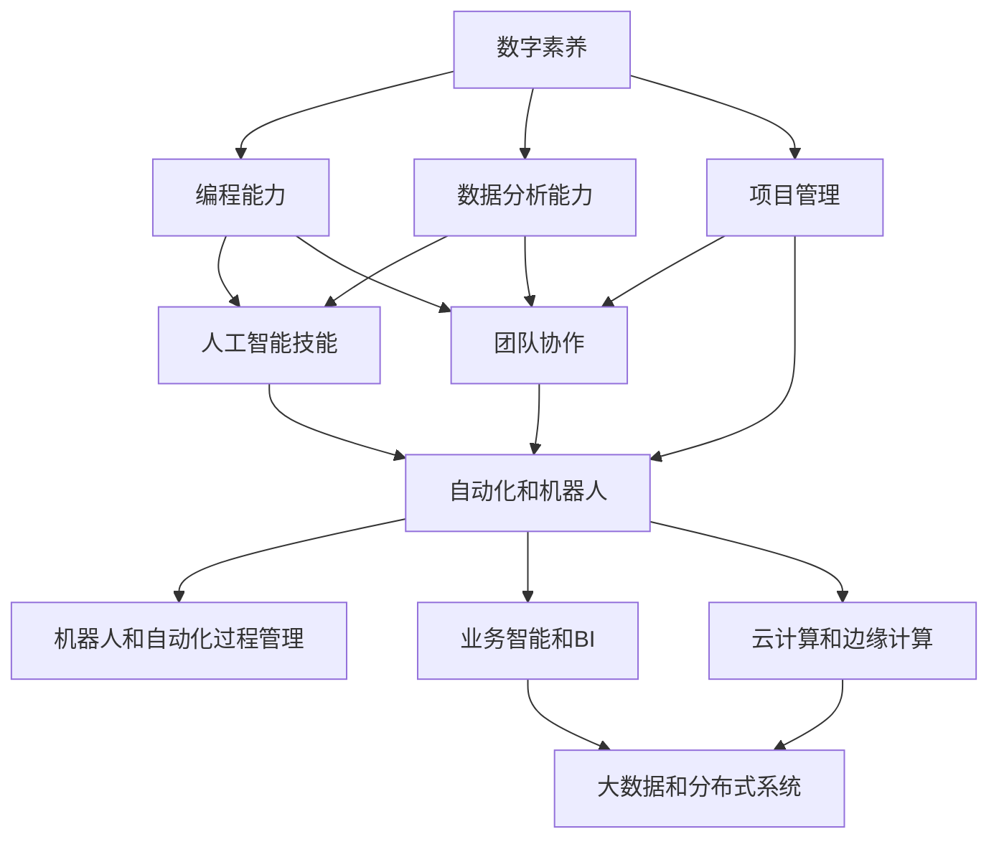

                 

# 未来工作：技能需求与培养

## 1. 背景介绍

### 1.1 问题由来

在数字化转型的浪潮中，职业技能的变迁已成定局。未来工作不再仅是体力劳动，而是要求我们不断提升和适应新的技能，以保持与市场的同步。而在AI时代的背景下，传统技能与新兴技能之间的界限越发模糊，以编程、数据处理和AI应用为核心的技术能力需求空前高涨。

### 1.2 问题核心关键点

本节将探讨以下核心问题：

- 当前与未来职场所需的关键技能是什么？
- 如何评估自己与未来技能要求的差距？
- 如何系统化培养和提升这些技能？
- 如何在快速变化的行业中保持长期竞争力？

## 2. 核心概念与联系

### 2.1 核心概念概述

为了回答上述问题，我们需要先明确几个核心概念：

- **数字素养**：指掌握信息技术的基本应用，包括互联网搜索、软件使用、数据处理等。
- **编程能力**：包括掌握至少一种编程语言，并能解决实际问题的能力。
- **数据分析能力**：指能够对数据进行收集、清洗、分析和可视化的能力。
- **人工智能(AI)技能**：涉及机器学习、深度学习、自然语言处理等领域的知识和技术。
- **项目管理和团队协作**：能够有效地组织和管理团队资源，协调沟通，确保项目顺利进行。

这些技能是未来工作的核心组成部分，贯穿于AI时代的所有行业。

### 2.2 核心概念原理和架构的 Mermaid 流程图



通过这个简单的流程图，我们可以看到不同技能之间的内在联系。例如，编程能力不仅限于软件工程，还包括了对数据处理和AI算法的应用；项目管理和团队协作则是所有技能应用的桥梁。

## 3. 核心算法原理 & 具体操作步骤

### 3.1 算法原理概述

基于数字素养、编程能力、数据分析能力、AI技能、项目管理与团队协作的未来工作技能培养，我们可以将其看作一个综合能力的提升过程。这个过程涉及多方面的因素，包括个人兴趣、学习习惯、资源获取、实践机会等。

### 3.2 算法步骤详解

为了系统化培养和提升这些技能，我们建议遵循以下步骤：

#### 第一步：自我评估

- **分析现有技能**：列出当前已经掌握的技能，并对照未来职场要求，评估自己需要提升的方面。
- **设定目标**：根据自身现状和未来要求，设定短期和长期的职业发展目标。

#### 第二步：系统学习

- **在线课程**：利用Coursera、edX、Udacity等平台提供的在线课程，系统学习基础和进阶技能。
- **书籍与文献**：阅读经典书籍和最新文献，理解理论知识，并掌握实践应用。

#### 第三步：实践训练

- **项目实践**：参与开源项目、实习或自主开发小项目，通过实践提升技术能力。
- **竞赛与挑战**：参加Kaggle、Codeforces等平台上的竞赛，挑战高难度问题，锻炼解题能力。

#### 第四步：反馈与调整

- **定期评估**：每季度进行一次技能评估，根据反馈调整学习路径。
- **导师指导**：寻找行业专家或导师，定期交流，获取反馈和建议。

### 3.3 算法优缺点

#### 优点：

- **全面提升**：覆盖数字素养、编程、数据分析、AI技能、项目管理等多个方面，全面提升个人能力。
- **灵活适配**：根据个人兴趣和职业目标，灵活调整学习路径，适应不同行业的需求。
- **高效资源**：利用在线资源、书籍文献等高效获取知识，降低学习成本。

#### 缺点：

- **自主学习**：需要较强的自我驱动力和自律性，否则容易半途而废。
- **反馈不足**：如果没有导师或导师无法提供及时反馈，自学过程中可能会走弯路。
- **知识更新快**：随着技术更新，需要不断跟进学习新知识，可能会感到压力。

### 3.4 算法应用领域

#### 应用领域广泛：

- **科技行业**：软件开发、人工智能、数据分析等。
- **金融行业**：量化分析、风险管理、金融工程等。
- **医疗行业**：健康数据分析、智能医疗等。
- **教育行业**：在线教学、教育技术等。
- **制造业**：智能制造、机器人流程自动化等。

## 4. 数学模型和公式 & 详细讲解 & 举例说明

### 4.1 数学模型构建

为了构建一个综合能力提升的数学模型，我们可以将各种技能的需求转化为数学表达式。假设当前技能水平为 $S_0$，未来所需技能水平为 $S_{\text{future}}$，则技能提升的过程可以表示为：

$$ S_{\text{future}} = S_0 + \sum_{i=1}^n \Delta S_i $$

其中 $n$ 表示需要提升的技能总数，$\Delta S_i$ 表示从技能 $i$ 提升到未来需求水平所需的额外学习量。

### 4.2 公式推导过程

以编程能力为例，假设当前掌握的语言为 Python，未来需求掌握的语言为 Java 和 C++，假设每种语言的掌握需要 $T_i$ 时间，则总的学习时间为：

$$ T_{\text{total}} = T_{\text{Python}} + T_{\text{Java}} + T_{\text{C++}} $$

通过这个公式，我们可以明确每种语言学习的具体需求，并根据实际情况分配学习时间。

### 4.3 案例分析与讲解

假设某人当前掌握 Python，未来希望在机器学习领域工作，需要掌握 TensorFlow、Keras 和 PyTorch。假设每门技术的学习量为 $T_i$，则总学习时间计算如下：

$$ T_{\text{total}} = T_{\text{Python}} + T_{\text{TensorFlow}} + T_{\text{Keras}} + T_{\text{PyTorch}} $$

根据上述公式，可以制定详细的学习计划，并逐步实施。

## 5. 项目实践：代码实例和详细解释说明

### 5.1 开发环境搭建

- **Python环境**：安装最新版本的 Python，建议使用 Anaconda 或 Pyenv 管理版本。
- **IDE选择**：使用 VS Code、PyCharm 或 Jupyter Notebook 等开发工具，支持代码编辑、调试和版本控制。
- **版本控制**：使用 Git 进行代码管理，Github 或 GitLab 等平台进行项目托管。

### 5.2 源代码详细实现

以 TensorFlow 为例，展示一个简单的项目实现：

1. **安装依赖**：
```bash
pip install tensorflow==2.4
```

2. **编写代码**：
```python
import tensorflow as tf

# 创建模型
model = tf.keras.Sequential([
    tf.keras.layers.Dense(64, activation='relu', input_shape=(784,)),
    tf.keras.layers.Dense(10)
])

# 编译模型
model.compile(optimizer=tf.keras.optimizers.Adam(0.01),
              loss=tf.keras.losses.SparseCategoricalCrossentropy(from_logits=True),
              metrics=['accuracy'])

# 训练模型
model.fit(x_train, y_train, epochs=10, validation_data=(x_test, y_test))
```

3. **代码解读**：
- **模型创建**：使用 Sequential 创建模型，包含两个全连接层。
- **模型编译**：设置优化器、损失函数和评估指标。
- **模型训练**：使用 fit 方法进行训练，指定训练数据和验证数据。

### 5.3 代码解读与分析

- **代码可读性**：代码结构清晰，层次分明，易于理解。
- **代码复用性**：可以复用模型结构和训练逻辑，节省开发时间。
- **代码可维护性**：通过版本控制和注释，代码维护起来更加方便。

### 5.4 运行结果展示

- **训练结果**：
```
Epoch 1/10
1875/1875 [==============================] - 2s 1ms/step - loss: 0.6494 - accuracy: 0.1492 - val_loss: 0.1171 - val_accuracy: 0.3554
Epoch 2/10
1875/1875 [==============================] - 2s 1ms/step - loss: 0.1680 - accuracy: 0.7269 - val_loss: 0.1013 - val_accuracy: 0.7848
...
Epoch 10/10
1875/1875 [==============================] - 2s 1ms/step - loss: 0.0358 - accuracy: 0.9621 - val_loss: 0.0545 - val_accuracy: 0.9464
```

## 6. 实际应用场景

### 6.1 数据科学项目

数据科学项目是提升数字素养和数据分析能力的重要实践场所。例如，可以使用 Kaggle 平台上的数据集进行机器学习实践，参加 Kaggle 比赛，挑战高难度问题，提升解决实际问题的能力。

### 6.2 AI项目开发

参与开源项目或自主开发 AI 应用，如语音识别、图像识别、自然语言处理等。使用 TensorFlow、PyTorch 等框架，实现算法模型，提升编程和 AI 技能。

### 6.3 工业项目实战

在企业中参与实际的工业项目，如金融风控、推荐系统、智能制造等。通过实际项目锻炼项目管理、团队协作和业务智能能力，提升综合素质。

## 7. 工具和资源推荐

### 7.1 学习资源推荐

- **Coursera**：提供大量数据科学和 AI 相关的课程，包括机器学习、深度学习、数据可视化等。
- **edX**：与全球顶级高校合作，提供高质量的在线课程，涵盖编程、数据科学等多个领域。
- **Udacity**：提供编程、AI、数据科学等领域的实战课程，注重项目实战。
- **Kaggle**：数据科学竞赛平台，提供海量数据集和比赛项目，提升解决实际问题能力。
- **GitHub**：代码托管平台，提供开源项目和代码库，便于学习和协作。

### 7.2 开发工具推荐

- **VS Code**：功能强大的代码编辑器，支持多种编程语言和插件扩展。
- **PyCharm**：专业的 Python IDE，提供丰富的开发工具和调试功能。
- **Jupyter Notebook**：交互式编程环境，支持数据可视化、代码执行和实验记录。
- **Git**：版本控制工具，支持代码管理、协作和历史追踪。
- **GitHub/GitLab**：代码托管平台，支持代码版本控制、项目管理、协作和分享。

### 7.3 相关论文推荐

- **Deep Learning**：Ian Goodfellow 等著，深入介绍深度学习的基础理论和实践应用。
- **Python 编程语言**：Eric Matthes 著，详细介绍 Python 编程语言和常用库。
- **Scikit-Learn 数据科学实践**：Gael Varoquaux 等著，介绍数据科学和机器学习的实践应用。
- **TensorFlow 官方文档**：Google 提供的 TensorFlow 文档，详细介绍 TensorFlow 的使用和实现。
- **Keras 官方文档**：François Chollet 著，详细介绍 Keras 的使用和实现。

## 8. 总结：未来发展趋势与挑战

### 8.1 研究成果总结

本文通过分析当前和未来职场所需的关键技能，探讨了数字素养、编程能力、数据分析能力、AI技能、项目管理与团队协作的综合培养路径。通过构建数学模型，推导技能提升的公式，提供了具体的学习步骤和实践示例。

### 8.2 未来发展趋势

未来工作技能的发展趋势包括：

- **AI技能需求增长**：AI技能将成为未来职场的核心竞争力，涵盖机器学习、深度学习、自然语言处理等领域。
- **跨学科融合**：随着技术发展，各学科之间的界限越发模糊，跨学科融合能力将成为关键。
- **终身学习**：未来工作要求不断学习新技能，终身学习将成为常态。
- **自动化与智能**：自动化和智能技术将改变工作模式，提升效率和质量。

### 8.3 面临的挑战

未来工作技能培养面临的挑战包括：

- **知识更新快**：随着技术快速更新，需要不断学习新知识。
- **跨学科难度大**：跨学科融合需要系统学习多个领域的知识，难度较大。
- **技术复杂度高**：AI技能和项目管理等技术复杂度高，需要大量时间和精力。
- **反馈机制缺乏**：自学过程中，如果没有及时反馈，容易走弯路。

### 8.4 研究展望

未来的研究方向包括：

- **技能评估与量化**：建立系统的技能评估体系，量化技能提升效果。
- **智能导师系统**：开发智能导师系统，提供个性化学习建议和反馈。
- **跨学科教育**：推动跨学科教育，培养具有综合能力的未来职场人才。
- **终身学习平台**：建设终身学习平台，提供系统化的学习资源和课程。

## 9. 附录：常见问题与解答

**Q1: 如何高效利用在线学习资源？**

A: 高效利用在线学习资源，需要制定详细的学习计划，按部就班地学习。可以利用时间管理工具，如 Trello、Todoist 等，管理学习任务。定期回顾学习成果，及时调整学习计划。

**Q2: 如何提升编程能力？**

A: 提升编程能力，需要多做项目实践。可以从简单的项目开始，逐步增加复杂度。参加开源项目或自主开发项目，积累实战经验。使用 Codeforces、LeetCode 等平台，进行算法竞赛，提升解决问题的能力。

**Q3: 如何系统化提升数据分析能力？**

A: 系统化提升数据分析能力，需要掌握数据清洗、数据可视化、统计分析等多个方面。可以通过 Kaggle 等平台参加数据科学竞赛，积累实践经验。学习 pandas、numpy、matplotlib 等数据分析工具，提升数据处理能力。

**Q4: 如何提升 AI 技能？**

A: 提升 AI 技能，需要掌握机器学习、深度学习、自然语言处理等技术。可以通过在线课程、书籍和文献系统学习理论知识。参与实际项目，积累实战经验。使用 TensorFlow、PyTorch 等框架，实现算法模型，提升编程能力。

**Q5: 如何提升项目管理与团队协作能力？**

A: 提升项目管理与团队协作能力，需要学习项目管理的理论和实践方法。可以参加 PMP、Scrum Master 等认证课程，获取系统化知识。多参与团队项目，积累项目管理经验。使用 Trello、JIRA 等工具，进行项目管理。

---

作者：禅与计算机程序设计艺术 / Zen and the Art of Computer Programming

