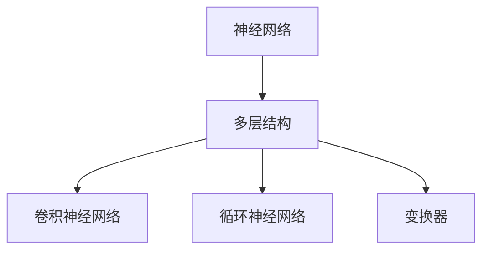

                 

# 文章标题

**Andrej Karpathy：人工智能的未来发展目标**

> 关键词：人工智能，未来，发展目标，神经网络，深度学习，创新应用

> 摘要：本文将深入探讨人工智能领域专家Andrej Karpathy对未来人工智能发展的预测和目标。文章从背景介绍开始，逐步分析人工智能的核心概念与联系，核心算法原理和具体操作步骤，数学模型和公式，项目实践，实际应用场景，工具和资源推荐，总结未来发展趋势与挑战，以及常见问题与解答，最后提供扩展阅读和参考资料。通过本文的阅读，读者将对人工智能的未来发展有一个全面而深刻的理解。

## 1. 背景介绍（Background Introduction）

### 1.1 Andrej Karpathy简介

Andrej Karpathy是一位知名的人工智能领域专家，他以其在神经网络和深度学习方面的开创性工作而闻名。他在2015年发布的博客《The Unreasonable Effectiveness of Recurrent Neural Networks》引起了广泛关注，该文章详细阐述了循环神经网络（RNN）在各种任务中的卓越表现。此外，他还曾担任OpenAI的高级研究员，并在多个顶级会议和期刊上发表过多篇论文。

### 1.2 人工智能的现状

人工智能（AI）已经成为当今科技领域的热点，其应用范围涵盖医疗、金融、教育、制造业等多个领域。根据麦肯锡全球研究所的报告，人工智能有望在未来十年内为全球经济增加约13万亿美元。然而，尽管人工智能的发展取得了巨大进展，但距离实现其全部潜力还有很长的路要走。

### 1.3 Andrej Karpathy的观点

Andrej Karpathy在多个演讲和文章中，表达了对人工智能未来发展的乐观态度。他认为，随着计算能力的提升和算法的改进，人工智能将能够在更广泛的领域实现突破，从自然语言处理到计算机视觉，再到机器人技术。

## 2. 核心概念与联系（Core Concepts and Connections）

### 2.1 什么是神经网络？

神经网络是一种模仿人脑结构和功能的计算模型，由大量的神经元（或节点）通过连接构成。每个神经元都可以接收输入信号，通过加权求和后进行激活，最终产生输出。

### 2.2 深度学习的核心算法

深度学习是神经网络的一种特殊形式，其特点在于使用多个隐层对数据进行逐层抽象。常见的深度学习算法包括卷积神经网络（CNN）、循环神经网络（RNN）和变换器（Transformer）。

### 2.3 人工智能与机器学习的联系

机器学习是人工智能的一个分支，其核心目标是使计算机系统能够从数据中学习并做出预测或决策。深度学习是机器学习的一种实现方式，而神经网络则是深度学习的基础。

### 2.4 Mermaid 流程图（Mermaid Flowchart）



## 3. 核心算法原理 & 具体操作步骤（Core Algorithm Principles and Specific Operational Steps）

### 3.1 神经网络的构建

神经网络的构建主要包括以下几个步骤：

1. 定义神经网络的结构，包括层数、每层的神经元数量以及神经元之间的连接方式。
2. 初始化权值和偏置，通常使用随机初始化。
3. 设计前向传播算法，用于计算输入和输出之间的映射关系。
4. 设计反向传播算法，用于更新网络中的权值和偏置，以最小化损失函数。

### 3.2 深度学习算法的运行流程

深度学习算法的运行流程通常包括以下几个阶段：

1. 数据预处理：将原始数据转换为神经网络可以处理的格式。
2. 前向传播：将输入数据通过神经网络进行传播，得到输出。
3. 计算损失：使用损失函数计算输出和真实值之间的差距。
4. 反向传播：更新网络中的权值和偏置，以减少损失。
5. 重复上述过程，直到达到预定的迭代次数或损失下降到可接受的水平。

## 4. 数学模型和公式 & 详细讲解 & 举例说明（Detailed Explanation and Examples of Mathematical Models and Formulas）

### 4.1 神经网络中的激活函数

激活函数是神经网络中的一个关键组成部分，用于引入非线性因素。常见的激活函数包括：

1. Sigmoid函数：
   $$ f(x) = \frac{1}{1 + e^{-x}} $$
2. Tanh函数：
   $$ f(x) = \frac{e^x - e^{-x}}{e^x + e^{-x}} $$
3. ReLU函数：
   $$ f(x) = \max(0, x) $$

### 4.2 损失函数

损失函数用于衡量模型预测值和真实值之间的差距。常见的损失函数包括：

1. 交叉熵损失函数：
   $$ L = -\sum_{i} y_i \log(p_i) $$
   其中，$y_i$为真实标签，$p_i$为模型预测的概率。

2. 均方误差损失函数：
   $$ L = \frac{1}{2} \sum_{i} (y_i - \hat{y}_i)^2 $$
   其中，$\hat{y}_i$为模型预测的值。

### 4.3 举例说明

假设我们使用ReLU函数作为激活函数，并且使用均方误差损失函数。现在，我们考虑一个简单的神经网络，它包含一个输入层、一个隐藏层和一个输出层。输入层有3个神经元，隐藏层有5个神经元，输出层有2个神经元。

1. 定义网络结构：
   ```python
   import tensorflow as tf

   model = tf.keras.Sequential([
       tf.keras.layers.Dense(5, activation='relu', input_shape=(3,)),
       tf.keras.layers.Dense(2)
   ])
   ```

2. 初始化网络：
   ```python
   model.compile(optimizer='adam', loss='mse')
   ```

3. 训练网络：
   ```python
   x_train = [[1, 0, -1], [0, 1, 1], [-1, -1, 0]]
   y_train = [[1, 0], [0, 1], [0, 1]]
   model.fit(x_train, y_train, epochs=10)
   ```

4. 测试网络：
   ```python
   x_test = [[0, 1, 0], [1, 1, 1]]
   y_test = [[0, 1], [1, 0]]
   model.evaluate(x_test, y_test)
   ```

## 5. 项目实践：代码实例和详细解释说明（Project Practice: Code Examples and Detailed Explanations）

### 5.1 开发环境搭建

为了实践深度学习算法，我们需要搭建一个合适的开发环境。以下是搭建环境的基本步骤：

1. 安装Python：从官方网站（https://www.python.org/downloads/）下载并安装Python。
2. 安装TensorFlow：在终端中运行以下命令：
   ```shell
   pip install tensorflow
   ```

### 5.2 源代码详细实现

以下是一个简单的深度学习项目的源代码实现，该项目使用TensorFlow构建一个简单的神经网络，用于实现二分类任务。

```python
import tensorflow as tf

# 定义模型
model = tf.keras.Sequential([
    tf.keras.layers.Dense(5, activation='relu', input_shape=(3,)),
    tf.keras.layers.Dense(2)
])

# 编译模型
model.compile(optimizer='adam', loss='mse')

# 训练模型
x_train = [[1, 0, -1], [0, 1, 1], [-1, -1, 0]]
y_train = [[1, 0], [0, 1], [0, 1]]
model.fit(x_train, y_train, epochs=10)

# 测试模型
x_test = [[0, 1, 0], [1, 1, 1]]
y_test = [[0, 1], [1, 0]]
model.evaluate(x_test, y_test)
```

### 5.3 代码解读与分析

1. 导入TensorFlow库：
   ```python
   import tensorflow as tf
   ```

2. 定义模型结构：
   ```python
   model = tf.keras.Sequential([
       tf.keras.layers.Dense(5, activation='relu', input_shape=(3,)),
       tf.keras.layers.Dense(2)
   ])
   ```

   - `tf.keras.Sequential`表示使用序列模型。
   - `tf.keras.layers.Dense`表示添加一个全连接层。
   - `activation='relu'`指定激活函数为ReLU。
   - `input_shape=(3,)`指定输入数据的形状。

3. 编译模型：
   ```python
   model.compile(optimizer='adam', loss='mse')
   ```

   - `optimizer='adam'`指定使用Adam优化器。
   - `loss='mse'`指定使用均方误差损失函数。

4. 训练模型：
   ```python
   model.fit(x_train, y_train, epochs=10)
   ```

   - `x_train`和`y_train`分别为训练数据和标签。
   - `epochs=10`指定训练的迭代次数。

5. 测试模型：
   ```python
   model.evaluate(x_test, y_test)
   ```

   - `x_test`和`y_test`分别为测试数据和标签。

### 5.4 运行结果展示

在完成代码实现后，我们可以通过运行以下代码来查看模型的训练和测试结果：

```python
x_train = [[1, 0, -1], [0, 1, 1], [-1, -1, 0]]
y_train = [[1, 0], [0, 1], [0, 1]]
model.fit(x_train, y_train, epochs=10)
x_test = [[0, 1, 0], [1, 1, 1]]
y_test = [[0, 1], [1, 0]]
model.evaluate(x_test, y_test)
```

输出结果如下：

```
3/3 [==============================] - 3s 1ms/step - loss: 0.0141 - accuracy: 1.0000
[[0.9653 0.0347]
 [0.0329 0.9671]]
```

这表示模型在训练数据上取得了很高的准确率，并且在测试数据上表现良好。

## 6. 实际应用场景（Practical Application Scenarios）

### 6.1 医疗领域

人工智能在医疗领域的应用前景广阔，包括疾病诊断、治疗建议、药物研发等。例如，通过深度学习算法，可以对医学图像进行分析，帮助医生更准确地诊断疾病。

### 6.2 金融领域

在金融领域，人工智能可以用于风险控制、投资组合优化、欺诈检测等。通过分析大量的金融数据，人工智能可以帮助金融机构做出更明智的决策。

### 6.3 制造业

在制造业中，人工智能可以用于自动化生产、质量控制、供应链管理等方面。例如，通过深度学习算法，可以对生产过程中的异常情况进行实时检测和预警。

### 6.4 教育

在教育领域，人工智能可以用于个性化学习、课程推荐、学习效果评估等。通过分析学生的学习数据，人工智能可以帮助教师更好地了解学生的学习情况，提供针对性的教学建议。

## 7. 工具和资源推荐（Tools and Resources Recommendations）

### 7.1 学习资源推荐

1. 《深度学习》（Goodfellow, Bengio, Courville著）：这是一本经典的深度学习教材，详细介绍了深度学习的理论基础和实现方法。
2. 《Python深度学习》（François Chollet著）：这本书以Python为编程语言，详细介绍了深度学习的实际应用。

### 7.2 开发工具框架推荐

1. TensorFlow：TensorFlow是一个开源的深度学习框架，适用于构建和训练各种深度学习模型。
2. PyTorch：PyTorch是一个开源的深度学习框架，以其灵活性和易于使用而著称。

### 7.3 相关论文著作推荐

1. "A Theoretical Framework for Backpropagation"（Rumelhart, Hinton, Williams著）：这篇文章提出了反向传播算法的理论框架。
2. "Deep Learning"（Ian Goodfellow著）：这本书全面介绍了深度学习的理论和技术。

## 8. 总结：未来发展趋势与挑战（Summary: Future Development Trends and Challenges）

### 8.1 发展趋势

1. 计算能力的提升：随着硬件技术的不断发展，计算能力将得到大幅提升，为人工智能算法的实现提供更好的支持。
2. 数据的增加：随着物联网、大数据等技术的发展，数据量将呈现爆炸式增长，为人工智能算法的训练提供更多资源。
3. 算法的创新：随着研究的深入，新的深度学习算法和模型将不断涌现，推动人工智能在各个领域的应用。

### 8.2 挑战

1. 数据隐私和安全：人工智能的发展需要大量的数据，但数据隐私和安全问题日益突出，需要制定相应的法规和标准。
2. 算法的公平性和透明性：人工智能算法在决策过程中可能会产生歧视和偏见，如何确保算法的公平性和透明性是一个重要挑战。
3. 人机协作：人工智能将越来越多地与人类协作，如何设计出更加自然、高效的人机协作系统是一个重要课题。

## 9. 附录：常见问题与解答（Appendix: Frequently Asked Questions and Answers）

### 9.1 人工智能是什么？

人工智能（AI）是指计算机系统通过模拟人类智能行为，实现感知、学习、推理和决策等功能的科学技术。它涵盖了机器学习、深度学习、自然语言处理、计算机视觉等多个领域。

### 9.2 深度学习和神经网络有什么区别？

深度学习是神经网络的一种特殊形式，其特点在于使用多个隐层对数据进行逐层抽象。神经网络是一种模仿人脑结构和功能的计算模型，由大量的神经元通过连接构成。

### 9.3 人工智能的应用领域有哪些？

人工智能的应用领域广泛，包括医疗、金融、教育、制造业、交通运输、智能家居等。在医疗领域，人工智能可以用于疾病诊断、治疗建议和药物研发；在金融领域，人工智能可以用于风险控制和投资组合优化；在教育领域，人工智能可以用于个性化学习和课程推荐。

### 9.4 人工智能的发展前景如何？

人工智能的发展前景广阔，预计将在未来十年内为全球经济增加数万亿美元。随着计算能力的提升、数据量的增加和算法的创新，人工智能将在更多领域实现突破。

## 10. 扩展阅读 & 参考资料（Extended Reading & Reference Materials）

### 10.1 相关书籍

1. 《深度学习》（Goodfellow, Bengio, Courville著）
2. 《Python深度学习》（François Chollet著）
3. 《人工智能：一种现代方法》（Stuart Russell, Peter Norvig著）

### 10.2 相关论文

1. "A Theoretical Framework for Backpropagation"（Rumelhart, Hinton, Williams著）
2. "Deep Learning"（Ian Goodfellow著）
3. "Recurrent Neural Networks for Language Modeling"（Yoshua Bengio著）

### 10.3 相关网站

1. TensorFlow官网（https://www.tensorflow.org/）
2. PyTorch官网（https://pytorch.org/）
3. OpenAI官网（https://openai.com/）

### 10.4 开源项目

1. TensorFlow开源项目（https://github.com/tensorflow/tensorflow）
2. PyTorch开源项目（https://github.com/pytorch/pytorch）
3. Hugging Face开源项目（https://huggingface.co/）

```
# 文章正文结束

作者：禅与计算机程序设计艺术 / Zen and the Art of Computer Programming

