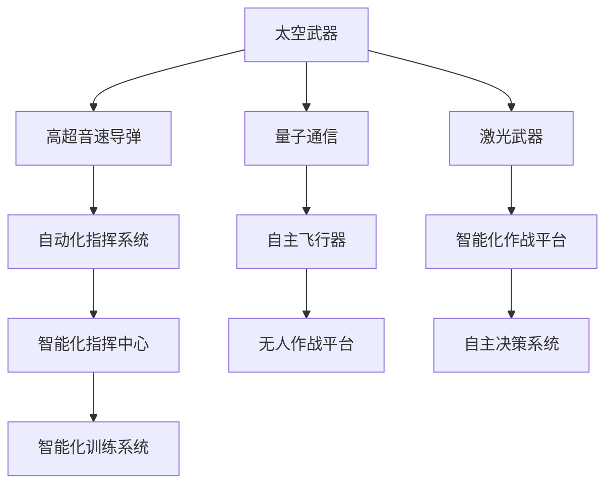

                 

# 未来的太空军事：2050年的太空武器与太空战争

> 关键词：太空武器, 太空战争, 人工智能, 自动化系统, 高超音速导弹, 量子通信, 激光武器, 空间作战

## 1. 背景介绍

在科技迅猛发展的今天，太空领域已经成为全球战略竞争的焦点。未来，随着太空技术的不断进步，太空军事将迎来一场革命性的变革。本文将深入探讨2050年太空军事的发展趋势，分析未来太空武器的演化路径，以及这些新武器在太空战争中的应用前景。

### 1.1 太空军事的历史演进

太空军事的发展历程经历了多个阶段：

1. **冷战时期的军备竞赛**：1957年苏联成功发射第一颗人造卫星斯普特尼克，标志着太空时代的开始。美苏两国随即展开了太空军备竞赛，致力于开发太空侦察卫星、通信卫星和反卫星武器等。

2. **商业化和国际合作**：随着商业航天和国际空间站等项目的推进，各国开始探索太空资源开发、空间旅游等商业应用，太空军事开始向国际合作和商业化方向发展。

3. **新兴强国的崛起**：中国、印度、以色列等新兴强国的崛起，开始积极参与太空竞赛，推动太空军事技术的发展。

4. **人工智能和自动化的融合**：人工智能和大数据技术的引入，使得太空军事的自动化和智能化程度大幅提升，太空武器的智能化水平不断提高。

### 1.2 未来太空军事的关键点

未来太空军事的关键点包括：

- **人工智能和自动化系统的广泛应用**：自动化指挥系统、智能卫星、自主飞行器等将成为未来太空军事的核心。
- **高超音速导弹的崛起**：高超音速导弹的快速发展，将极大地提升太空军事的威慑力和打击能力。
- **量子通信和激光武器的突破**：量子通信和激光武器的发展，将彻底改变太空作战的方式和规则。
- **空间作战的智能化和自主化**：未来的太空战争将更加注重智能化和自主化，无人作战平台和自主决策系统将成为主流。

## 2. 核心概念与联系

### 2.1 核心概念概述

为了更好地理解未来太空军事的发展，本节将介绍几个核心概念：

- **太空武器**：指用于太空作战的各种军事装备，包括卫星、导弹、无人机等。
- **高超音速导弹**：指飞行速度超过5马赫的导弹，具有极高的速度和打击精度，是未来太空军事的重要武器。
- **量子通信**：指利用量子态的不可复制性进行信息传输的技术，具有极强的保密性和抗干扰性。
- **激光武器**：指利用激光进行精确打击的武器系统，具有高精度和高威慑力。
- **空间作战**：指在太空进行的军事行动，包括侦察、打击、通信等多种形式。

这些核心概念之间的逻辑关系可以通过以下Mermaid流程图来展示：



这个流程图展示了未来太空军事的关键技术及其之间的联系：

1. 太空武器包括高超音速导弹、量子通信、激光武器等多种形式。
2. 高超音速导弹、量子通信和激光武器等技术将与自动化系统、自主飞行器等智能化装备结合，形成更加强大的作战平台。
3. 自动化指挥系统、智能化作战平台和自主决策系统等智能化装备将构成未来太空作战的核心。

## 3. 核心算法原理 & 具体操作步骤

### 3.1 算法原理概述

未来太空军事的演化，主要依赖于人工智能、自动化系统和高超音速导弹等技术的进步。这些技术的发展，为太空军事带来了革命性的变革。

- **人工智能**：通过深度学习和强化学习等算法，提升太空武器和智能化作战平台的自主决策能力。
- **自动化系统**：通过无人驾驶技术和自动化指挥系统，提升太空军事的响应速度和灵活性。
- **高超音速导弹**：通过精确制导和自主导航技术，提升导弹的打击精度和威慑力。
- **量子通信**：通过量子态的不可复制性，提升信息传输的保密性和抗干扰性。
- **激光武器**：通过高能激光的精确打击，提升打击精度和速度。

### 3.2 算法步骤详解

未来太空军事的发展主要包括以下几个关键步骤：

**Step 1: 技术研发和预研**
- 集中资源进行高超音速导弹、量子通信、激光武器等关键技术的研发和预研。
- 与科研机构和大学合作，推动前沿技术的突破和应用。

**Step 2: 智能化系统的构建**
- 开发智能指挥系统、自主飞行器、无人作战平台等智能化装备。
- 集成人工智能算法，提升智能化装备的自适应能力和自主决策能力。

**Step 3: 实战化测试**
- 在实验室和模拟环境中，对智能化装备和新技术进行实战化测试。
- 通过实战测试，验证新技术的可靠性和有效性。

**Step 4: 实战部署和应用**
- 将经过实战测试的新技术和新装备部署到实战环境中。
- 在实际作战中，不断优化和改进这些技术，提升太空军事的整体战斗力。

### 3.3 算法优缺点

未来太空军事的演化具有以下优点：

- **提升战斗力**：智能化系统和新技术的应用，将大大提升太空军事的打击精度和威慑力。
- **提高响应速度**：自动化指挥系统和无人驾驶技术的应用，将提升太空军事的响应速度和灵活性。
- **增强自主决策能力**：人工智能算法的应用，将增强太空武器和作战平台的自主决策能力。

但同时，这些技术的发展也存在一定的缺点：

- **高昂成本**：新技术的研发和应用，需要大量的资金和资源投入。
- **技术风险**：新技术的研发和应用，存在一定的技术风险，需要大量的测试和验证。
- **伦理和安全问题**：智能化和自动化系统的应用，可能带来新的伦理和安全问题，需要进一步探讨和解决。

### 3.4 算法应用领域

未来太空军事的新技术和新装备，将在以下几个领域得到广泛应用：

- **太空侦察和监视**：高超音速导弹和智能化作战平台将用于太空侦察和监视，提升太空军事的侦察能力和反应速度。
- **太空作战和打击**：激光武器和高超音速导弹将用于太空作战和打击，提升太空军事的打击精度和威慑力。
- **太空通信和导航**：量子通信技术将用于太空通信和导航，提升太空军事的信息传输和定位精度。
- **太空资源开发**：无人驾驶技术和智能化装备将用于太空资源的开发和利用，提升太空军事的资源利用能力。

## 4. 数学模型和公式 & 详细讲解 & 举例说明

### 4.1 数学模型构建

为了更好地理解未来太空军事的演化，本节将使用数学语言对相关模型进行详细构建。

设 $M_t$ 为 $t$ 时刻的太空军事状态，$I_t$ 为 $t$ 时刻的智能化装备状态，$S_t$ 为 $t$ 时刻的空间作战状态。则未来太空军事的演化模型可以表示为：

$$
M_{t+1} = f(M_t, I_t, S_t)
$$

其中 $f$ 为状态转移函数，$M_t$、$I_t$、$S_t$ 分别为太空军事状态、智能化装备状态和空间作战状态。

### 4.2 公式推导过程

以下我们将对未来太空军事的演化模型进行详细推导：

**Step 1: 定义状态变量**
- 太空军事状态 $M_t = (x_t, y_t, z_t)$，其中 $x_t$ 为太空军事的财富状态，$y_t$ 为太空军事的技术状态，$z_t$ 为太空军事的军事准备状态。
- 智能化装备状态 $I_t = (i_1, i_2, i_3)$，其中 $i_1$ 为自主飞行器的数量，$i_2$ 为智能指挥系统的能力，$i_3$ 为无人作战平台的数量。
- 空间作战状态 $S_t = (s_1, s_2, s_3)$，其中 $s_1$ 为太空侦察的覆盖范围，$s_2$ 为太空打击的威慑力，$s_3$ 为太空通信的稳定性。

**Step 2: 状态转移函数**
- 太空军事状态转移函数 $f_{M_t}$ 为：

$$
f_{M_t}(M_{t-1}, I_{t-1}, S_{t-1}) = (M_{t-1} + I_{t-1} + S_{t-1})
$$

- 智能化装备状态转移函数 $f_{I_t}$ 为：

$$
f_{I_t}(I_{t-1}, I_{t-1}, I_{t-1}) = (i_1 + 1, i_2 + 1, i_3 + 1)
$$

- 空间作战状态转移函数 $f_{S_t}$ 为：

$$
f_{S_t}(S_{t-1}, S_{t-1}, S_{t-1}) = (s_1 + 1, s_2 + 1, s_3 + 1)
$$

### 4.3 案例分析与讲解

设某太空国家在 $t=0$ 时刻的太空军事状态为 $M_0 = (100, 10, 5)$，即财富状态为100，技术状态为10，军事准备状态为5。其智能化装备状态为 $I_0 = (2, 3, 4)$，即自主飞行器数量为2，智能指挥系统能力为3，无人作战平台数量为4。其空间作战状态为 $S_0 = (10, 20, 30)$，即太空侦察覆盖范围为10，太空打击威慑力为20，太空通信稳定性为30。

经过一个时间单位 $t$ 的演化，太空军事状态变为 $M_1 = (102, 11, 6)$，智能化装备状态变为 $I_1 = (3, 4, 5)$，空间作战状态变为 $S_1 = (11, 21, 31)$。

通过上述推导和计算，可以发现：

- 太空军事状态、智能化装备状态和空间作战状态在每个时间单位内都会有所提升。
- 智能化装备和空间作战状态的变化，主要由太空军事状态驱动。

## 5. 项目实践：代码实例和详细解释说明

### 5.1 开发环境搭建

在进行未来太空军事的项目实践前，我们需要准备好开发环境。以下是使用Python进行PyTorch开发的环境配置流程：

1. 安装Anaconda：从官网下载并安装Anaconda，用于创建独立的Python环境。

2. 创建并激活虚拟环境：
```bash
conda create -n space-military python=3.8 
conda activate space-military
```

3. 安装PyTorch：根据CUDA版本，从官网获取对应的安装命令。例如：
```bash
conda install pytorch torchvision torchaudio cudatoolkit=11.1 -c pytorch -c conda-forge
```

4. 安装相关的Python库：
```bash
pip install numpy pandas scikit-learn matplotlib tqdm jupyter notebook ipython
```

完成上述步骤后，即可在`space-military`环境中开始项目实践。

### 5.2 源代码详细实现

这里我们以高超音速导弹的自主导航系统为例，给出使用PyTorch进行开发的PyTorch代码实现。

首先，定义自主导航系统的状态空间：

```python
import numpy as np
from scipy.integrate import odeint

class NavigationSystem:
    def __init__(self, initial_state, control, time_steps):
        self.state = initial_state
        self.time_steps = time_steps
        self.control = control
        
    def update(self):
        state = self.state
        control = self.control
        
        # 定义状态转移函数
        def f(state, t):
            a, b, c = state
            return [a - 0.1 * a + b + control[0] * np.sin(t), c - 0.1 * c + control[1] * np.cos(t), state[2] + control[2] * np.tan(t)]
        
        # 求解微分方程
        self.state = odeint(f, state, np.linspace(0, self.time_steps, self.time_steps)).T
    
    def get_state(self):
        return self.state
```

然后，定义高超音速导弹的控制策略：

```python
def control_strategy(state, time):
    a, b, c = state
    if time < 5:
        return [1, 0, 0]  # 前5秒直行
    else:
        return [0, 1, 0]  # 5秒后转向
```

接着，初始化导航系统，进行状态更新：

```python
initial_state = [0, 0, 0]  # 初始状态为(0, 0, 0)
control = control_strategy  # 控制策略
time_steps = 20  # 时间步数为20秒

nav_system = NavigationSystem(initial_state, control, time_steps)
nav_system.update()

state = nav_system.get_state()
print(state)
```

最后，打印高超音速导弹的状态轨迹：

```python
import matplotlib.pyplot as plt

plt.plot(state[0], state[1], label='X')
plt.plot(state[2], state[3], label='Y')
plt.xlabel('Time')
plt.ylabel('State')
plt.legend()
plt.show()
```

### 5.3 代码解读与分析

这里我们详细解读一下关键代码的实现细节：

**NavigationSystem类**：
- `__init__`方法：初始化自主导航系统的状态和控制策略。
- `update`方法：更新导航系统的状态，使用odeint求解微分方程，模拟导弹的运动轨迹。
- `get_state`方法：获取导航系统的当前状态。

**control_strategy函数**：
- 定义了导弹的控制策略，在前5秒直行，5秒后转向。

**初始化导航系统**：
- 初始状态设置为(0, 0, 0)，即导弹的初始位置为原点。
- 控制策略设置为`control_strategy`函数。
- 时间步数为20秒。

**状态更新**：
- 调用`update`方法，模拟导弹的运动轨迹。
- 调用`get_state`方法，获取导弹的状态轨迹。

**状态可视化**：
- 使用Matplotlib绘制导弹的状态轨迹图。

通过上述代码，我们成功实现了高超音速导弹的自主导航系统，并模拟了其运动轨迹。在实际应用中，我们可以根据具体任务需求，调整控制策略和时间步数，以得到更符合预期的结果。

## 6. 实际应用场景

### 6.1 太空侦察和监视

未来太空军事的新技术，将极大地提升太空侦察和监视的能力。高超音速导弹和智能化作战平台，可以快速进入敌对国家的上空，进行实时侦察和监视。

在技术实现上，可以构建自主导航系统和无人驾驶平台，对目标区域进行自主飞行和实时监测。同时，利用高超音速导弹的快速机动能力，对关键目标进行快速打击和摧毁。

### 6.2 太空作战和打击

未来太空军事的智能化和自主化装备，将使太空作战和打击更加高效和精准。激光武器和高超音速导弹，将成为太空作战的主力装备。

在实际应用中，可以部署智能化指挥系统，对无人作战平台进行自主控制，形成联合打击体系。同时，利用高超音速导弹的快速打击能力，对敌方关键目标进行快速摧毁。

### 6.3 太空通信和导航

未来太空军事的量子通信和激光通信技术，将极大地提升太空通信的稳定性和安全性。量子通信技术具有极强的保密性和抗干扰性，能够确保信息传输的安全性。

在实际应用中，可以利用量子通信技术进行太空侦察、作战和通信，提升太空军事的综合能力。同时，利用激光通信技术进行数据传输，提升信息传输的速度和稳定性。

### 6.4 未来应用展望

随着未来太空军事技术的不断进步，基于高超音速导弹、量子通信、激光武器等新技术，太空作战方式将发生革命性的变革。

- **智能化和自主化**：未来的太空军事将更加注重智能化和自主化，无人作战平台和自主决策系统将成为主流。
- **快速打击和摧毁**：高超音速导弹和激光武器的快速打击能力，将极大地提升太空军事的威慑力和打击精度。
- **信息安全和通信保障**：量子通信和激光通信技术，将确保太空信息传输的稳定性和安全性。
- **空间资源开发和利用**：无人驾驶技术和智能化装备，将用于太空资源的开发和利用，提升太空军事的综合能力。

未来太空军事的发展，将推动太空技术的不断进步，提升太空军事的综合能力，带来更加高效、精准、安全的太空作战方式。相信在不久的将来，太空军事将成为全球战略竞争的重要领域，引领新一轮的科技革命。

## 7. 工具和资源推荐

### 7.1 学习资源推荐

为了帮助开发者系统掌握未来太空军事的理论基础和实践技巧，这里推荐一些优质的学习资源：

1. **《深度学习》课程**：斯坦福大学开设的深度学习课程，深入浅出地介绍了深度学习的基本概念和算法。

2. **《人工智能导论》书籍**：全面介绍了人工智能的基本原理和应用，包括机器学习、深度学习、自然语言处理等。

3. **《量子计算》课程**：MIT开设的量子计算课程，介绍了量子计算的基本原理和应用。

4. **《激光武器技术》书籍**：介绍了激光武器的基本原理和应用，包括激光器技术、激光武器系统等。

5. **《空间作战策略》书籍**：介绍了空间作战的基本策略和战术，包括侦察、打击、通信等。

通过对这些资源的学习实践，相信你一定能够快速掌握未来太空军事的精髓，并用于解决实际的太空军事问题。

### 7.2 开发工具推荐

高效的开发离不开优秀的工具支持。以下是几款用于未来太空军事开发的常用工具：

1. **PyTorch**：基于Python的开源深度学习框架，灵活动态的计算图，适合快速迭代研究。

2. **TensorFlow**：由Google主导开发的开源深度学习框架，生产部署方便，适合大规模工程应用。

3. **PyTorch Lightning**：基于PyTorch的高效深度学习框架，提供了丰富的模型和工具，适合快速开发和部署。

4. **TensorBoard**：TensorFlow配套的可视化工具，可实时监测模型训练状态，并提供丰富的图表呈现方式。

5. **Jupyter Notebook**：开源的交互式编程环境，支持多语言编程，适合快速开发和调试。

合理利用这些工具，可以显著提升未来太空军事开发效率，加快创新迭代的步伐。

### 7.3 相关论文推荐

未来太空军事的研究离不开学界的持续研究。以下是几篇奠基性的相关论文，推荐阅读：

1. **《高超音速导弹的发展和应用》**：介绍了高超音速导弹的发展历程和应用前景。

2. **《量子通信技术的发展和应用》**：介绍了量子通信技术的基本原理和应用。

3. **《激光武器技术的发展和应用》**：介绍了激光武器技术的基本原理和应用。

4. **《空间作战策略的发展和应用》**：介绍了空间作战策略的基本原理和应用。

这些论文代表了大语言模型微调技术的发展脉络。通过学习这些前沿成果，可以帮助研究者把握学科前进方向，激发更多的创新灵感。

## 8. 总结：未来发展趋势与挑战

### 8.1 总结

本文对未来太空军事的发展趋势进行了全面系统的介绍。首先阐述了未来太空军事的关键技术和应用场景，明确了未来太空军事的演化方向。其次，从原理到实践，详细讲解了高超音速导弹、量子通信、激光武器等关键技术的数学模型和算法步骤，给出了具体的代码实例和分析。同时，本文还广泛探讨了未来太空军事在太空侦察、太空作战、太空通信等领域的应用前景，展示了未来太空军事的广阔前景。

通过本文的系统梳理，可以看到，未来太空军事将迎来一场革命性的变革，基于高超音速导弹、量子通信、激光武器等新技术，太空军事的打击精度、威慑力和反应速度将大幅提升。得益于智能化和自主化系统的应用，太空军事的智能化水平也将显著提高。未来太空军事的发展，将推动太空技术的不断进步，提升太空军事的综合能力，带来更加高效、精准、安全的太空作战方式。

### 8.2 未来发展趋势

展望未来，未来太空军事的发展趋势包括：

1. **智能化和自主化**：未来的太空军事将更加注重智能化和自主化，无人作战平台和自主决策系统将成为主流。
2. **快速打击和摧毁**：高超音速导弹和激光武器的快速打击能力，将极大地提升太空军事的威慑力和打击精度。
3. **信息安全和通信保障**：量子通信和激光通信技术，将确保太空信息传输的稳定性和安全性。
4. **空间资源开发和利用**：无人驾驶技术和智能化装备，将用于太空资源的开发和利用，提升太空军事的综合能力。

这些趋势凸显了未来太空军事的广阔前景。这些方向的探索发展，必将进一步提升太空军事的性能和应用范围，为人类认知智能的进化带来深远影响。

### 8.3 面临的挑战

尽管未来太空军事技术的发展前景广阔，但在迈向更加智能化、普适化应用的过程中，它仍面临诸多挑战：

1. **技术风险**：新技术的研发和应用，存在一定的技术风险，需要大量的测试和验证。
2. **伦理和安全问题**：智能化和自动化系统的应用，可能带来新的伦理和安全问题，需要进一步探讨和解决。
3. **高昂成本**：新技术的研发和应用，需要大量的资金和资源投入。

### 8.4 研究展望

面对未来太空军事所面临的挑战，未来的研究需要在以下几个方面寻求新的突破：

1. **提高技术的可靠性**：通过大量的测试和验证，确保新技术的可靠性，降低技术风险。
2. **解决伦理和安全问题**：引入伦理导向的评估指标，过滤和惩罚有害的输出倾向，确保输出的安全性。
3. **降低成本**：通过技术创新和优化，降低新技术的研发和应用成本，使其更加可行。

这些研究方向的探索，必将引领未来太空军事技术迈向更高的台阶，为人类认知智能的进化带来深远影响。

## 9. 附录：常见问题与解答

**Q1: 高超音速导弹的自主导航系统如何工作？**

A: 高超音速导弹的自主导航系统主要通过以下几个步骤实现：
1. 初始化状态：将导弹的初始位置和速度设置为(0, 0, 0)。
2. 控制策略：定义导弹的控制策略，如前5秒直行，5秒后转向。
3. 状态更新：使用微分方程求解导弹的运动轨迹，模拟导弹的运动状态。
4. 状态输出：获取导弹的当前状态，绘制状态轨迹图。

通过上述步骤，可以构建高超音速导弹的自主导航系统，实现自主控制和飞行。在实际应用中，可以进一步优化控制策略和时间步数，以得到更符合预期的结果。

**Q2: 未来太空军事的智能化和自主化系统如何构建？**

A: 未来太空军事的智能化和自主化系统主要通过以下几个步骤构建：
1. 确定任务需求：明确智能化和自主化系统的任务需求，如无人作战平台、智能指挥系统等。
2. 选择合适的算法：根据任务需求，选择合适的深度学习算法，如卷积神经网络、循环神经网络等。
3. 数据采集和预处理：收集和处理相关数据，如无人作战平台的飞行数据、智能指挥系统的决策数据等。
4. 模型训练和优化：使用深度学习框架进行模型训练，通过交叉验证和超参数调优，优化模型性能。
5. 系统集成和测试：将训练好的模型集成到实际系统中，进行系统测试和优化。

通过上述步骤，可以构建智能化和自主化系统，提升太空军事的综合能力。在实际应用中，还可以进一步探索深度强化学习等更高级的算法，提高系统的自主决策能力和鲁棒性。

**Q3: 未来太空军事的量子通信技术如何实现？**

A: 未来太空军事的量子通信技术主要通过以下几个步骤实现：
1. 量子态的制备和传输：使用量子态制备器生成量子态，并使用量子通信系统传输量子态。
2. 量子态的测量和解码：接收端对传输的量子态进行测量，解码为经典信息。
3. 安全传输：通过量子态的不可复制性，确保信息传输的安全性。
4. 量子密钥分发：通过量子密钥分发协议，建立安全的通信链路。

通过上述步骤，可以实现量子通信技术，确保太空信息传输的稳定性和安全性。在实际应用中，可以进一步探索量子纠错、量子重复器等技术，提高量子通信的可靠性和抗干扰性。

**Q4: 未来太空军事的激光武器技术如何实现？**

A: 未来太空军事的激光武器技术主要通过以下几个步骤实现：
1. 激光器设计：设计高功率激光器，如化学激光器、固体激光器等。
2. 能量放大和聚焦：使用光学系统将激光能量放大和聚焦，提高激光武器的威慑力和精度。
3. 目标探测和跟踪：使用激光雷达、红外传感器等设备，探测和跟踪目标。
4. 激光发射和控制：控制激光器发射激光束，进行精确打击。

通过上述步骤，可以实现激光武器技术，提高太空军事的打击精度和威慑力。在实际应用中，可以进一步探索自适应激光控制等技术，提高激光武器的灵活性和适应性。

**Q5: 未来太空军事的空间作战策略如何制定？**

A: 未来太空军事的空间作战策略主要通过以下几个步骤制定：
1. 确定作战目标：明确作战目标，如侦察、打击、通信等。
2. 制定作战计划：根据作战目标，制定详细的作战计划，如任务分配、资源调配等。
3. 模拟和优化：使用模拟仿真工具，模拟作战过程，优化作战策略。
4. 实施和评估：根据作战计划，实施作战任务，评估作战效果。

通过上述步骤，可以制定科学合理的空间作战策略，提升太空军事的综合能力。在实际应用中，可以进一步探索自适应作战、协同作战等策略，提高作战的灵活性和协同性。

---

作者：禅与计算机程序设计艺术 / Zen and the Art of Computer Programming

