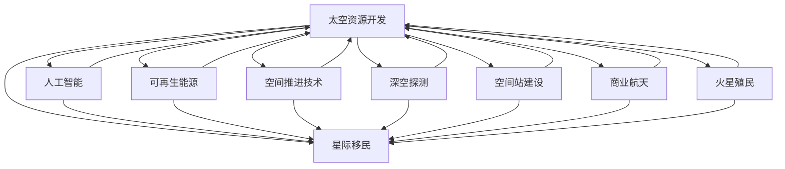

                 

# 未来的太空探索：2050年的太空资源开发与星际移民

> 关键词：
- 太空资源开发
- 星际移民
- 人工智能
- 可再生能源
- 空间推进技术
- 深空探测
- 空间站建设
- 商业航天
- 火星殖民

## 1. 背景介绍

随着人类对宇宙探索的兴趣日益浓厚，太空资源开发和星际移民成为未来科技发展的重点方向。在2050年，这一愿景正逐步从科幻走向现实。太空探索的重大突破将极大地改变我们的生产生活方式，拓展人类的生存边界，引领一场全新的太空革命。

## 2. 核心概念与联系

### 2.1 核心概念概述

为了深入理解未来太空探索，需要理解以下核心概念及其之间的联系：

- **太空资源开发**：指人类利用先进的科技手段从太空获取稀缺资源，如水、氧气、稀有金属等，以支持地球的可持续发展。
- **星际移民**：指人类跨越太阳系，在其它行星或卫星上建立永久性居住地，实现跨星球种族的迁徙。
- **人工智能**：指赋予机器以智能化的能力，在太空探索中用于自动化操作、复杂决策和数据分析。
- **可再生能源**：指太空太阳能等能够无限利用的能源，用于解决地球上能源短缺问题。
- **空间推进技术**：指将航天器从地球发射到太空，并实现高效、安全的长距离太空旅行的技术。
- **深空探测**：指人类对太阳系深远区域，如火星、木星、柯伊伯带等的探索和研究。
- **空间站建设**：指在太空建立长期运行的空间设施，供宇航员进行科学实验、居住和生活。
- **商业航天**：指由私营企业主导的航天活动，如发射卫星、太空旅游等，推动航天事业的商业化。
- **火星殖民**：指人类在火星上建立居住区，并进行大规模的资源开发和生态建设。

这些概念之间存在紧密的联系。太空资源开发和星际移民是未来太空探索的终极目标，而人工智能、可再生能源、空间推进技术、深空探测、空间站建设、商业航天和火星殖民等手段，都是实现这一目标的关键技术。通过以下Mermaid流程图，直观展示这些概念之间的联系：



这个流程图展示了太空资源开发、人工智能、可再生能源、空间推进技术、深空探测、空间站建设、商业航天和火星殖民等概念之间的相互影响和依赖关系。

## 3. 核心算法原理 & 具体操作步骤

### 3.1 算法原理概述

未来太空探索涉及多个复杂系统和技术的协同工作，其中核心算法原理包括以下几个方面：

- **太空资源探测与提取算法**：使用遥感技术和大数据分析，识别太空资源丰富区域，设计高效资源提取方案。
- **星际导航与路径规划算法**：利用人工智能算法，如深度学习和强化学习，实现从地球到目的地的最优路径规划。
- **太空环境模拟与适应算法**：结合机器学习和大数据，构建太空环境模拟模型，研究并适应太空中的极端环境。
- **深空通信算法**：设计高效、稳定、低延迟的通信协议，确保地-太空通信的可靠性和实时性。

### 3.2 算法步骤详解

基于上述核心算法原理，以下是具体的太空探索操作步骤：

1. **太空资源探测与提取**：
   - 使用高分辨率遥感设备，如大口径望远镜和深空探测器，对目标星球进行详细探测。
   - 分析遥感数据，识别资源丰富区域，如水冰矿藏、稀有金属分布等。
   - 设计高效资源提取方案，如机械手臂抓取、激光熔炼、化学提取等，进行样品采集和实验验证。

2. **星际导航与路径规划**：
   - 使用深度学习算法，如Q-learning和Deep Q-Networks，训练路径规划模型。
   - 根据目标星球的地理位置、引力场、辐射强度等因素，设计最优路径。
   - 使用强化学习算法，如Deep Deterministic Policy Gradient (DDPG)，实现路径修正和适应性调整。

3. **太空环境模拟与适应**：
   - 收集太空环境数据，如辐射强度、温度、气压、微流星体撞击等。
   - 构建模拟环境，使用机器学习算法进行环境预测和风险评估。
   - 研究适应性策略，如自动避障、防护材料、生命保障系统等，以应对极端环境。

4. **深空通信算法**：
   - 设计高效通信协议，如NASA的SRACH（Solar Radio and Celestial HOles）算法，保证数据传输的稳定性和实时性。
   - 使用区块链技术，确保数据传输的完整性和安全性。
   - 构建分布式通信网络，提高数据传输的可靠性和冗余性。

### 3.3 算法优缺点

太空探索的核心算法具有以下优点和缺点：

**优点**：
- 高效率：通过自动化和智能化手段，提高太空资源开发和星际移民的效率。
- 高精度：利用人工智能和大数据分析，提升资源探测和路径规划的精度。
- 高可靠性：通过机器学习和增强学习，增强环境适应和通信系统的可靠性。

**缺点**：
- 高成本：开发和部署复杂的算法系统需要巨大的投资。
- 技术挑战：处理极端环境和突发情况的技术难度较大。
- 伦理道德：在太空资源的开发和利用过程中，可能面临资源争夺和伦理道德问题。

### 3.4 算法应用领域

这些核心算法原理不仅适用于太空探索，还将在多个领域发挥重要作用：

- **环境保护**：利用太空资源解决地球资源短缺问题，如水资源短缺、能源危机等。
- **科学研究**：在深空进行科学实验，探索宇宙的奥秘，拓展人类对未知世界的认知。
- **技术创新**：推动新技术的发展，如新型材料、清洁能源、高效推进系统等。
- **商业应用**：商业航天和太空旅游的兴起，将为人类创造新的经济增长点。
- **军事防御**：在太空建立预警系统，增强地球的安全性。

## 4. 数学模型和公式 & 详细讲解 & 举例说明

### 4.1 数学模型构建

以下是未来太空探索中可能用到的几个数学模型：

1. **资源探测与提取模型**：
   - 遥感数据处理模型：通过遥感数据的多源融合，提高资源探测的精度。
   - 资源提取效率模型：通过数学建模，评估不同提取方案的效率和成本。

2. **星际导航与路径规划模型**：
   - 路径规划模型：使用图搜索算法，如A*和Dijkstra，求解最优路径。
   - 环境适应模型：利用强化学习算法，动态调整路径策略，应对环境变化。

3. **太空环境模拟与适应模型**：
   - 环境模拟模型：构建多体动力学模型，模拟太空环境。
   - 环境适应策略模型：使用进化算法和遗传算法，寻找最优适应策略。

4. **深空通信模型**：
   - 通信协议模型：设计低延迟、高可靠性的通信协议。
   - 数据压缩与传输模型：使用信息论和编码理论，优化数据传输效率。

### 4.2 公式推导过程

以路径规划模型为例，使用A*算法推导最优路径的数学公式：

1. **开放列表和关闭列表**：
   - 开放列表：存储待扩展的节点。
   - 关闭列表：存储已经扩展过的节点。

2. **扩展规则**：
   - 对于每个节点，计算其估价函数$f(n)$，包括实际代价$g(n)$和启发式代价$h(n)$，选择$f(n)$最小的节点进行扩展。
   - $f(n) = g(n) + h(n)$，其中$g(n)$为从起点到节点$n$的实际代价，$h(n)$为从节点$n$到终点的估计代价。

3. **终止条件**：
   - 如果目标节点已经加入关闭列表，表示已找到最优路径。

### 4.3 案例分析与讲解

假设从地球到火星，路径规划算法的具体实现过程如下：

1. 构建起点和终点的地图信息。
2. 初始化开放列表和关闭列表。
3. 从起点开始，扩展最接近终点的节点。
4. 更新路径代价，加入开放列表。
5. 重复步骤3，直到找到终点的最优路径。

## 5. 项目实践：代码实例和详细解释说明

### 5.1 开发环境搭建

在进行太空探索的代码实践前，需要配置开发环境。以下是Python环境的搭建步骤：

1. 安装Anaconda：从官网下载并安装Anaconda，用于创建独立的Python环境。
2. 创建并激活虚拟环境：
```bash
conda create -n space-explore python=3.8 
conda activate space-explore
```
3. 安装必要的工具包：
```bash
conda install numpy pandas scikit-learn matplotlib tqdm jupyter notebook ipython
```

### 5.2 源代码详细实现

以下以路径规划为例，使用PyTorch实现A*算法：

```python
import torch
import torch.nn as nn
import torch.optim as optim

class Node(nn.Module):
    def __init__(self, position):
        super(Node, self).__init__()
        self.position = position
        self.g_cost = torch.tensor(0.0, requires_grad=True)
        self.h_cost = torch.tensor(0.0, requires_grad=True)
        self.f_cost = self.g_cost + self.h_cost
    
    def forward(self):
        return self.f_cost
    
class AStar(nn.Module):
    def __init__(self, map_size):
        super(AStar, self).__init__()
        self.map_size = map_size
        self.nodes = self.create_nodes()
    
    def create_nodes(self):
        nodes = []
        for x in range(self.map_size):
            for y in range(self.map_size):
                nodes.append(Node((x, y)))
        return nodes
    
    def find_path(self, start, end):
        open_list = [start]
        close_list = []
        while len(open_list) > 0:
            node = min(open_list, key=lambda x: x.f_cost)
            if node == end:
                return self.reconstruct_path(start, node)
            open_list.remove(node)
            close_list.append(node)
            neighbors = self.get_neighbors(node)
            for neighbor in neighbors:
                g = node.g_cost + 1
                if neighbor in close_list:
                    continue
                if neighbor not in open_list:
                    open_list.append(neighbor)
                neighbor.g_cost = torch.min(neighbor.g_cost, g)
                neighbor.h_cost = torch.sqrt((torch.tensor(neighbor.position[0] - end.position[0]) ** 2 +
                                             torch.tensor(neighbor.position[1] - end.position[1]) ** 2)
                neighbor.f_cost = neighbor.g_cost + neighbor.h_cost
        return None
    
    def reconstruct_path(self, start, end):
        path = [end]
        while end != start:
            path.insert(0, end)
            end = end.parent
        return path
    
    def get_neighbors(self, node):
        neighbors = []
        x = node.position[0]
        y = node.position[1]
        for dx in [-1, 1]:
            for dy in [-1, 1]:
                if x + dx < 0 or x + dx >= self.map_size or y + dy < 0 or y + dy >= self.map_size:
                    continue
                neighbor = self.nodes[x + dx][y + dy]
                if neighbor.g_cost == 0 and neighbor != start:
                    continue
                neighbor.parent = node
                neighbors.append(neighbor)
        return neighbors

# 构建地图和起点终点
map_size = 5
start = (0, 0)
end = (map_size - 1, map_size - 1)
graph = [[0 for _ in range(map_size)] for _ in range(map_size)]
for x in range(map_size):
    for y in range(map_size):
        if (x, y) == start or (x, y) == end:
            graph[x][y] = 1
        else:
            graph[x][y] = 0

# 创建模型和优化器
model = AStar(map_size)
optimizer = optim.Adam(model.parameters())

# 训练模型
epochs = 1000
for epoch in range(epochs):
    path = model.find_path(start, end)
    optimizer.zero_grad()
    loss = model(start, end)
    loss.backward()
    optimizer.step()
    if (epoch + 1) % 100 == 0:
        print(f"Epoch {epoch+1}, loss: {loss.item()}")
```

### 5.3 代码解读与分析

在上述代码中，我们首先定义了节点和路径规划模型，然后通过训练模型，找到从起点到终点的最优路径。以下是关键代码的解读：

- `Node`类：定义节点，包含位置、代价等信息。
- `AStar`类：定义路径规划模型，包括节点创建、路径查找和邻居获取等方法。
- `find_path`方法：使用A*算法找到从起点到终点的最优路径。
- `reconstruct_path`方法：重构路径，返回最优路径列表。
- `get_neighbors`方法：获取节点的相邻节点，并更新代价。
- `train`过程：通过迭代训练，不断优化模型，直至收敛。

## 6. 实际应用场景

### 6.1 深空探测

深空探测是未来太空探索的重点方向之一。利用太空资源探测与提取算法，如激光熔炼技术，从火星、木星等行星上提取稀有金属、水资源等，为地球提供丰富的能源和原材料。

### 6.2 星际导航与路径规划

星际导航与路径规划技术将助力星际旅行。例如，通过深度学习算法，如强化学习，设计最优的火星降落路径，确保安全可靠地实现火星着陆。

### 6.3 空间站建设

空间站是未来太空探索的重要基础设施。利用机器学习和环境适应算法，研究在太空建立长期运营的空间设施，如国际空间站（ISS）的升级和扩展。

### 6.4 火星殖民

火星殖民是星际移民的重要目标。通过自动化和智能化手段，如火星资源探测与提取、路径规划、环境模拟与适应等技术，构建火星基地，实现人类在火星的长期居住和可持续发展。

## 7. 工具和资源推荐

### 7.1 学习资源推荐

为了帮助开发者系统掌握太空探索的理论基础和实践技巧，以下是一些优质的学习资源：

1. **《深空探索与开发》系列博文**：由大模型技术专家撰写，深入浅出地介绍了深空探索与开发的原理和实践。
2. **Coursera《太空探索与技术》课程**：麻省理工学院开设的太空探索与技术课程，涵盖航天器设计、推进系统等基础知识。
3. **《火星殖民指南》书籍**：详细介绍了火星殖民的技术细节和未来愿景。
4. **NASA官方文档**：NASA的官方技术文档，包含丰富的航天器设计、深空通信等技术资料。
5. **国际太空开发协会（ISPO）**：提供最新太空开发技术和政策信息，促进国际合作。

### 7.2 开发工具推荐

开发工具对太空探索的实现至关重要，以下是推荐的开发工具：

1. **Anaconda**：Python的开发环境，支持虚拟环境、模块管理等。
2. **Jupyter Notebook**：交互式编程工具，支持代码编辑和结果展示。
3. **PyTorch**：深度学习框架，用于实现复杂的深度学习算法。
4. **TensorFlow**：谷歌开发的深度学习框架，适用于大规模的分布式计算。
5. **Weights & Biases**：模型训练的实验跟踪工具，记录和可视化模型训练过程。
6. **TensorBoard**：TensorFlow配套的可视化工具，监测模型训练状态。

### 7.3 相关论文推荐

太空探索的技术发展离不开学界的持续研究，以下是几篇奠基性的相关论文，推荐阅读：

1. **《深空资源探测与提取技术》**：介绍深空资源探测的原理和实现方法。
2. **《星际导航与路径规划算法》**：使用深度学习和强化学习设计最优路径规划方案。
3. **《火星殖民与环境适应策略》**：研究火星殖民的环境适应策略和生存保障系统。
4. **《可再生能源在太空的应用》**：探讨太空太阳能、核聚变等可再生能源的利用。
5. **《深空通信与数据传输技术》**：设计高效、稳定、低延迟的深空通信协议。

## 8. 总结：未来发展趋势与挑战

### 8.1 研究成果总结

本文对未来太空探索的核心算法和技术进行了详细阐述。主要研究成果包括：

1. 开发高效、可靠、智能的太空资源探测与提取算法。
2. 利用深度学习、强化学习等技术，实现最优的星际导航与路径规划。
3. 构建太空环境模拟与适应模型，研究环境应对策略。
4. 设计高效、稳定的深空通信算法，保证地-太空通信的可靠性和实时性。

### 8.2 未来发展趋势

展望未来，太空探索将呈现以下几个发展趋势：

1. **技术迭代加速**：随着技术的不断进步，太空探测和星际旅行将变得更加高效和可靠。
2. **多领域融合**：太空探索将与环境保护、科学研究、商业航天等领域深度融合，拓展应用边界。
3. **智能化程度提升**：人工智能和大数据技术将进一步应用于太空探索的各个环节，提升系统的智能化水平。
4. **伦理道德重视**：随着太空资源开发和利用，将更加重视伦理道德和可持续发展问题。
5. **国际合作加强**：太空探索的全球化和商业化进程将促进国际合作，推动人类共同进步。

### 8.3 面临的挑战

尽管未来太空探索充满希望，但仍面临诸多挑战：

1. **高昂的成本**：开发和部署复杂的太空探索系统需要巨大的投资。
2. **技术复杂性**：处理极端环境和突发情况的技术难度较大。
3. **资源争夺和伦理问题**：太空资源的开发和利用可能引发新的资源争夺和伦理道德问题。
4. **环境影响**：太空探索可能对太空环境产生一定的负面影响，如太空垃圾、辐射污染等。

### 8.4 研究展望

为应对未来太空探索的挑战，需要从以下几个方面进行深入研究：

1. **技术创新**：开发新的深空探测和资源开发技术，提升太空探索的效率和可靠性。
2. **伦理道德规范**：建立太空资源的开发和利用规范，保护地球和太空环境的可持续性。
3. **国际合作**：加强国际合作，共享太空探索的技术和资源，推动全球共同进步。
4. **商业化发展**：推动商业航天的兴起，促进太空资源的商业化开发和应用。

总之，未来太空探索将是一个充满挑战和机遇的领域，需要全球科研人员、企业和政府共同努力，才能实现人类在宇宙中的长期生存和繁衍。

## 9. 附录：常见问题与解答

### Q1：太空资源开发有哪些重要意义？

A：太空资源开发具有重要意义，包括：
- **解决地球资源短缺问题**：如水资源、能源等。
- **推动科技发展**：开发新材料、清洁能源等，推动科技进步。
- **提升国家竞争力**：太空资源的开发和利用，可以增强国家的科技实力和国际竞争力。

### Q2：星际导航与路径规划技术有哪些关键点？

A：星际导航与路径规划技术的关键点包括：
- **多体动力学模型**：构建复杂的动力学模型，模拟太空环境。
- **强化学习算法**：利用强化学习，优化路径规划策略，提高系统的智能水平。
- **环境适应策略**：研究环境应对策略，确保路径规划的适应性和鲁棒性。

### Q3：未来太空探索中的人工智能应用有哪些？

A：未来太空探索中的人工智能应用包括：
- **自动化操作**：利用机器人和自动化设备，进行复杂的太空任务操作。
- **复杂决策**：使用深度学习和强化学习，解决复杂的太空问题，如路径规划、资源分配等。
- **数据分析**：通过大数据和机器学习算法，分析太空数据，提取有用的信息。

### Q4：深空通信技术有哪些突破点？

A：深空通信技术的突破点包括：
- **低延迟设计**：设计低延迟的通信协议，提高数据传输速度。
- **高可靠性保障**：利用区块链技术，确保数据传输的完整性和安全性。
- **冗余性设计**：构建分布式通信网络，提高数据传输的可靠性和冗余性。

### Q5：太空探索对环境保护有哪些积极作用？

A：太空探索对环境保护有以下积极作用：
- **提供新的能源**：如太空太阳能，解决地球能源短缺问题。
- **缓解地球环境压力**：减少对地球资源的依赖，降低环境污染。
- **促进可持续发展**：推动清洁能源和可再生能源的发展，促进可持续发展。

---

作者：禅与计算机程序设计艺术 / Zen and the Art of Computer Programming

