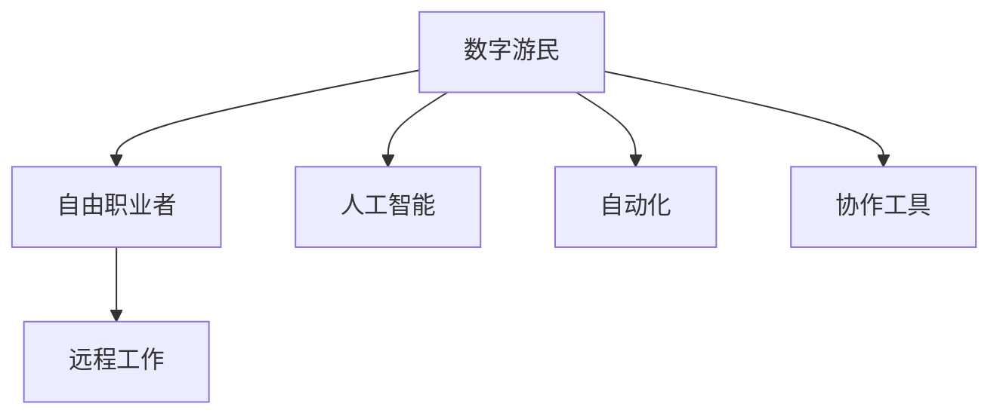

                 

# 未来的就业趋势：2050年的数字游民与自由职业者

> 关键词：数字游民,自由职业者,人工智能,远程工作,未来就业,自动化,协作,技能提升

## 1. 背景介绍

### 1.1 问题由来
随着全球化、互联网的普及和技术的飞速发展，就业市场的结构正在发生深刻变革。特别是在2050年，得益于人工智能、自动化和大数据等前沿技术的推动，工作方式和就业形态正经历前所未有的转型。从传统的“办公室”模式，到遍布全球的“数字游民”和“自由职业者”，新的就业趋势不仅改变了人们的生活方式，也塑造了未来社会的面貌。

### 1.2 问题核心关键点
本节将探讨2050年就业市场的变化趋势，并分析其对数字游民与自由职业者的影响。我们将重点关注以下几个核心问题：

1. **人工智能和自动化技术如何重塑工作岗位**。
2. **远程工作和协作工具的普及与演变**。
3. **未来就业市场的技能需求与教育体系的重构**。
4. **自由职业者和数字游民的崛起及其生活方式**。

这些关键点将帮助我们全面理解2050年的就业趋势，并从中窥见数字游民与自由职业者的发展前景。

### 1.3 问题研究意义
本节旨在：

1. 揭示未来就业市场的变化趋势及其对个人职业发展的潜在影响。
2. 探讨数字游民与自由职业者的生活方式和工作模式。
3. 分析技术进步与教育体系之间的关系，为教育改革提供方向。
4. 为处于转型中的个体和组织提供应对策略和解决方案。

通过深入分析，我们希望为读者描绘出一幅生动的未来就业图景，帮助他们在快速变化的职业环境中做出明智的决策。

## 2. 核心概念与联系

### 2.1 核心概念概述

数字游民和自由职业者这两个概念在未来的就业市场中扮演着越来越重要的角色。为了更好地理解这些概念，本节将介绍几个核心概念及其之间的联系：

- **数字游民(Digital Nomads)**：指那些利用互联网和移动技术，在任何地点工作和生活的人。他们通常具有高度的自我管理和技术使用能力，能够在不同国家和地区之间自由迁移。

- **自由职业者(Freelancers)**：指不隶属于任何固定公司或组织的独立工作者。他们通过互联网平台接受各类项目，提供专业服务，如写作、设计、编程等。

- **人工智能(Artificial Intelligence, AI)**：指使计算机系统具有类似于人类智能的能力的技术，包括机器学习、自然语言处理、图像识别等。AI正在改变各个行业的运作方式，包括就业市场。

- **自动化(Automation)**：指使用计算机系统和算法来执行人类原本需要手动完成的任务。自动化提高了效率，但也对就业市场提出了新的挑战。

- **远程工作(Remote Work)**：指通过互联网技术，在家中或任何远程地点进行工作。远程工作为数字游民和自由职业者提供了便利，也为传统办公模式的转变提供了可能。

- **协作工具(Collaboration Tools)**：如Slack、Zoom、Trello等，这些工具极大地提高了远程团队的沟通和协作效率。

这些概念之间的联系可以通过以下Mermaid流程图来展示：



这个流程图展示了数字游民与自由职业者之间以及与人工智能、自动化和协作工具之间的关系：

1. 数字游民和自由职业者利用人工智能和自动化技术提高工作效率。
2. 远程工作为数字游民和自由职业者提供了便利。
3. 协作工具帮助远程团队有效沟通和协作。

这些概念共同构成了未来就业市场的变化基础，影响着人们的工作方式和生活方式。

## 3. 核心算法原理 & 具体操作步骤
### 3.1 算法原理概述

未来就业趋势的变化主要受到技术进步的驱动。算法原理方面，我们可以从以下几个方面进行探讨：

- **人工智能与机器学习**：通过训练数据集，机器学习算法可以自动识别模式和规律，从而提升工作效率和决策质量。
- **自然语言处理(NLP)**：使计算机能够理解和生成人类语言，在客户服务和远程沟通中发挥重要作用。
- **自动化系统**：通过程序和算法执行重复性高的任务，释放人类工作者的时间，使其可以专注于更具创造性的工作。
- **协作与沟通技术**：提升远程团队的协作效率，使工作不受地域限制。

### 3.2 算法步骤详解

以下是未来就业趋势变化的算法步骤：

1. **数据收集与处理**：收集全球各地的就业数据，包括不同行业的就业人数、增长趋势、技能需求等。
2. **模型训练**：使用机器学习算法训练模型，预测未来各行业的就业趋势。
3. **数据可视化**：将预测结果可视化，展示未来的就业市场变化趋势。
4. **模型优化与调整**：根据实际就业数据，不断优化和调整模型，确保预测的准确性。

### 3.3 算法优缺点

数字游民与自由职业者的兴起带来了以下优点：

- **提高灵活性**：自由职业者可以根据项目需求和个人兴趣灵活选择工作地点和时间。
- **提升工作效率**：人工智能和自动化技术减少了重复性工作，使工作者能够专注于更有价值的任务。
- **降低成本**：远程工作减少了通勤时间和相关费用，提高了生活质量。

但同时也存在一些挑战：

- **工作不稳定**：自由职业者可能需要面对项目不连续和收入不稳定的问题。
- **技术要求高**：新兴的工作需要较高的技术能力和适应能力。
- **社交孤立**：长期远程工作可能带来社交隔离和心理健康问题。

### 3.4 算法应用领域

数字游民与自由职业者的兴起涵盖了多个领域：

- **软件开发**：自由职业者可以在线接受软件开发的各类项目。
- **内容创作**：数字游民可以自由地创作和发布内容，如博客、视频、音乐等。
- **教育培训**：自由职业者可以作为在线教师或培训师，提供各类课程和培训服务。
- **咨询服务**：通过远程服务，自由职业者可以提供各类咨询和建议。

这些领域的发展将极大地推动2050年就业市场的变化，带来新的机遇和挑战。

## 4. 数学模型和公式 & 详细讲解 & 举例说明

### 4.1 数学模型构建

为了预测未来就业市场的变化，我们可以构建一个包含以下变量的数学模型：

- **时间$t$**：表示当前年份。
- **行业$i$**：表示不同行业，如金融、科技、教育等。
- **就业人数$N_i(t)$**：表示在第$t$年行业$i$的就业人数。

基于时间序列分析和机器学习模型，我们可以预测未来各行业的就业趋势。

### 4.2 公式推导过程

假设未来$n$年后的就业人数可以通过以下公式预测：

$$
N_i(t+n) = f(N_i(t), \alpha_i, \beta_i)
$$

其中$f$为预测函数，$\alpha_i$和$\beta_i$为行业$i$的参数。

### 4.3 案例分析与讲解

以软件开发行业为例，我们可以使用时间序列模型和机器学习算法来预测其未来就业趋势。例如，LSTM神经网络可以通过训练历史数据，预测未来的就业人数。

## 5. 项目实践：代码实例和详细解释说明
### 5.1 开发环境搭建

为了进行项目实践，我们需要以下开发环境：

- **Python**：选择3.x版本，作为主要编程语言。
- **Jupyter Notebook**：用于数据处理和模型训练。
- **TensorFlow**：用于机器学习模型的构建和训练。
- **Pandas**：用于数据处理和分析。
- **Scikit-learn**：用于模型评估和可视化。

### 5.2 源代码详细实现

以下是一个简单的Python代码示例，展示如何使用LSTM神经网络预测未来就业趋势：

```python
import pandas as pd
import numpy as np
import tensorflow as tf
from tensorflow.keras.models import Sequential
from tensorflow.keras.layers import LSTM, Dense
from sklearn.metrics import mean_squared_error

# 导入数据
data = pd.read_csv('employment_data.csv')

# 数据处理
data = data.dropna()
X = data.values[:, 0:1]
y = data.values[:, 1]

# 构建LSTM模型
model = Sequential()
model.add(LSTM(50, input_shape=(X.shape[1], 1)))
model.add(Dense(1))

# 编译模型
model.compile(loss='mean_squared_error', optimizer='adam')

# 训练模型
model.fit(X, y, epochs=100, batch_size=64)

# 预测未来就业趋势
future_X = np.array([[2050]])
predicted_y = model.predict(future_X)

print(f'未来就业人数预测：{predicted_y}')
```

### 5.3 代码解读与分析

- **数据导入**：使用Pandas导入历史就业数据。
- **数据处理**：将数据转换为适合LSTM输入的形式。
- **模型构建**：使用LSTM神经网络构建预测模型。
- **模型训练**：使用Adam优化器和均方误差损失函数训练模型。
- **未来预测**：使用模型预测2050年的就业人数。

## 6. 实际应用场景

### 6.1 数字游民

数字游民的生活方式将更广泛地融入各个行业：

- **远程工作**：数字游民可以在全球各地自由工作，不受地域限制。
- **内容创作**：通过在线平台创作和发布内容，数字游民可以获取全球观众。
- **教育和培训**：在线教育平台为数字游民提供了广阔的就业机会，他们可以作为教师或培训师。

### 6.2 自由职业者

自由职业者在多个领域都有显著发展：

- **软件开发**：自由职业者可以在线接受各类软件开发项目。
- **内容创作**：自由职业者可以通过创作各类内容获取收入。
- **咨询服务**：自由职业者可以提供远程咨询服务，如财务咨询、法律咨询等。

### 6.3 未来应用展望

随着技术的进步，未来就业市场将继续演变：

- **新兴行业兴起**：AI、VR、AR等新兴技术将带来新的就业机会。
- **技能需求变化**：对于技术、创造力和沟通能力的需求将持续上升。
- **全球化深化**：数字游民和自由职业者的兴起将进一步促进全球化发展。

## 7. 工具和资源推荐

### 7.1 学习资源推荐

为了帮助读者掌握未来就业趋势，以下是一些推荐的资源：

- **《未来的工作：自动化、AI与就业的新未来》**：该书深入探讨了AI和自动化对就业市场的影响，提供了丰富的案例分析。
- **《数字游民指南》**：提供了数字游民的生活方式和工作技巧。
- **Coursera和Udacity**：提供各类在线课程，涵盖AI、机器学习、数据科学等领域。
- **Kaggle**：提供数据科学竞赛平台，有助于实践和提升技术能力。

### 7.2 开发工具推荐

为了支持项目实践，以下是一些推荐的开发工具：

- **Python**：作为主要编程语言，广泛用于数据科学和机器学习。
- **TensorFlow和PyTorch**：用于构建和训练深度学习模型。
- **Jupyter Notebook**：提供交互式环境，便于数据处理和模型训练。
- **GitHub**：用于版本控制和协作开发。

### 7.3 相关论文推荐

以下是几篇有关未来就业趋势的推荐论文：

- **《自动化与就业市场：当前状况与未来预测》**：分析了自动化技术对就业市场的长期影响。
- **《数字游民：全球化与个体自由》**：探讨了数字游民的崛起及其对社会的影响。
- **《自由职业者的未来：技术进步与就业市场》**：预测了自由职业者在未来就业市场中的地位。

## 8. 总结：未来发展趋势与挑战

### 8.1 研究成果总结

通过对未来就业趋势的探讨，我们得出了以下结论：

- **技术进步**：AI和自动化技术将重塑就业市场，带来新的机遇和挑战。
- **就业形态变化**：数字游民和自由职业者将逐渐成为主流。
- **全球化深化**：未来的就业市场将更加全球化。

### 8.2 未来发展趋势

未来就业市场将继续呈现出以下趋势：

- **技术驱动**：AI、自动化、大数据等技术将继续推动就业市场的发展。
- **灵活就业**：数字游民和自由职业者将更广泛地融入各行各业。
- **全球化扩展**：就业市场的全球化将进一步深化。

### 8.3 面临的挑战

未来就业市场面临以下挑战：

- **技术适应**：工作者需要不断学习新技术，以适应未来的工作需求。
- **收入稳定性**：自由职业者可能面临收入不稳定的风险。
- **心理与健康**：远程工作和自由职业者可能面临社交隔离和心理健康问题。

### 8.4 研究展望

未来的研究需要在以下方向进行探索：

- **技术普及**：如何使更多人能够访问和使用新技术。
- **教育改革**：如何培养适应未来就业市场所需的技能。
- **政策制定**：政府如何制定政策支持数字游民和自由职业者。

## 9. 附录：常见问题与解答

**Q1：数字游民和自由职业者是否适合所有人群？**

A: 数字游民和自由职业者适合那些具有高度自我管理能力和技术适应能力的人。他们需要有良好的时间管理、自律性和工作效率。

**Q2：未来就业市场的技能需求会如何变化？**

A: 未来就业市场将对技术、创造力和沟通能力提出更高要求。开发者、数据科学家、内容创作者和远程团队协作能力将成为关键技能。

**Q3：如何应对远程工作的挑战？**

A: 数字游民和自由职业者需要具备良好的沟通和协作能力，建立稳定的远程工作网络，并关注心理健康和社交关系。

通过深入分析和探讨，我们希望能够帮助读者更好地理解未来就业市场的变化趋势，为未来的职业发展做好准备。未来，数字游民和自由职业者将发挥越来越重要的作用，推动全球就业市场的不断进步。

