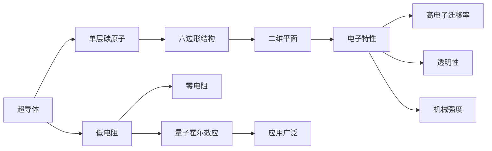

                 

# 未来的新材料：2050年的石墨烯与超导体应用

在探索未来科技的广阔天空中，新材料的发现和应用一直是推动人类进步的关键力量。本文将深入探讨2050年最具潜力的两种新材料：石墨烯和超导体。通过解析其原理与关键应用，揭示它们如何改变我们的世界。

## 1. 背景介绍

### 1.1 新材料在科技发展中的重要性

新材料是推动科技创新的核心驱动力之一。它们不仅为现有技术提供突破点，更开辟了全新的应用场景。以石墨烯和超导体为例，它们各自以其独特的物理性质和应用潜力，成为未来科技的重要支柱。

石墨烯是一种由单层碳原子组成的二维材料，因其卓越的电子特性（如极高的导电性和透明度）而被广泛关注。超导体则能够在特定条件下完全无电阻地导电，其零电阻特性和量子霍尔效应对电子学、医学等领域产生了深远影响。

### 1.2 石墨烯与超导体的历史和现状

石墨烯的发现可以追溯到2004年，由英国曼彻斯特大学的Andre Geim和Konstantin Novoselov提出。此后，石墨烯因其独特的电子结构和力学性能，迅速成为材料科学的研究热点。

超导体的研究则历史悠久，1911年，Heike Kamerlingh Onnes首次发现超导体，并因此获得诺贝尔物理学奖。近年来，超导体的新发现和新应用不断涌现，推动了量子信息科学和纳米技术的进步。

## 2. 核心概念与联系

### 2.1 核心概念概述

#### 石墨烯

石墨烯（Graphene）是一种由单层碳原子组成的二维材料，具有极高的电子迁移率、良好的热导性和机械强度。其主要特性包括：

- **高电子迁移率**：石墨烯的电子迁移率是硅的200倍，导电性极高。
- **透明性**：光子在石墨烯中的传输损耗极小，透光性极佳。
- **机械强度**：石墨烯是世界上最强的材料之一，具有良好的延展性。

#### 超导体

超导体（Superconductor）是一种能够在特定条件下完全无电阻地导电的材料。其主要特性包括：

- **零电阻**：在低温下，超导体几乎无电阻，电流可以无损耗地流动。
- **量子霍尔效应**：在磁场中，超导体能够表现出独特的量子霍尔效应，具有重要的物理意义和潜在的应用价值。
- **应用广泛**：超导体在电子学、医学、磁悬浮等领域具有广泛的应用前景。

### 2.2 核心概念原理和架构的 Mermaid 流程图



## 3. 核心算法原理 & 具体操作步骤

### 3.1 算法原理概述

#### 石墨烯的物理性质

石墨烯的电子性质主要由其独特的六边形蜂窝结构决定。每个碳原子与其相邻的三个碳原子形成共价键，构成稳定的平面结构。这种结构使得石墨烯具有极高的电子迁移率和光子透过率，同时保持了良好的机械强度。

#### 超导体的量子效应

超导体能够在低温下表现出零电阻特性，这一现象归因于其独特的电子配对和量子相变。低温下，超导体的电子对以库珀对的形式存在，这些库珀对之间的相互作用导致电子的集体运动，从而消除了电阻。

### 3.2 算法步骤详解

#### 石墨烯制备

1. **机械剥离法**：通过机械剥离单层石墨片，得到石墨烯。
2. **化学气相沉积法**：利用碳源在高温下沉积出石墨烯。
3. **化学合成法**：通过化学合成手段，将有机小分子聚合成石墨烯。

#### 超导体制造

1. **物理沉积法**：利用物理气相沉积技术，在材料表面沉积超导体薄膜。
2. **化学气相沉积法**：利用化学气相沉积技术，合成高纯度超导体材料。
3. **溶液法**：将超导体材料溶解在溶液中，再通过化学沉积法得到超导体薄膜。

### 3.3 算法优缺点

#### 石墨烯

**优点**：
- 极高的电子迁移率，适合电子学应用。
- 良好的机械强度，可用于增强材料。
- 透明度高，适合光电子器件。

**缺点**：
- 制备成本高，难以大规模生产。
- 缺乏宏观尺度下的稳定性，容易受外界环境影响。

#### 超导体

**优点**：
- 零电阻特性，适合电子传输。
- 量子霍尔效应，具有重要物理意义。
- 应用广泛，涵盖多个高科技领域。

**缺点**：
- 制备条件苛刻，需要极低温度。
- 环境敏感，容易受外界干扰。

### 3.4 算法应用领域

#### 石墨烯

1. **电子学**：石墨烯的高电子迁移率使其成为新一代电子器件的基础材料。
2. **复合材料**：石墨烯的机械强度和高透明度，可用于增强多种材料的性能。
3. **光电子学**：石墨烯的透明性和电子特性，使其在光电转换和光探测中具有优势。

#### 超导体

1. **电子学**：超导体的零电阻特性，用于制作高速电子开关和电缆。
2. **磁悬浮**：超导体的磁悬浮技术，用于高速列车和航空航天领域。
3. **医学**：超导磁共振成像（MRI），用于医学影像和诊断。

## 4. 数学模型和公式 & 详细讲解

### 4.1 数学模型构建

#### 石墨烯电子性质

石墨烯的电子性质可以用以下模型描述：

$$
E_k = \hbar v_F k
$$

其中 $E_k$ 为电子能量，$k$ 为波矢，$v_F$ 为费米速度，$\hbar$ 为普朗克常数。

#### 超导体零电阻

超导体的零电阻现象可以用以下方程描述：

$$
j = \frac{ne^2}{m} \mu
$$

其中 $j$ 为电流密度，$n$ 为载流子密度，$e$ 为电子电荷，$m$ 为电子质量，$\mu$ 为电导率。

### 4.2 公式推导过程

#### 石墨烯电子迁移率

石墨烯的电子迁移率 $\mu$ 可以通过以下公式计算：

$$
\mu = \frac{e^2 v_F}{2 \pi \hbar}
$$

#### 超导体零电阻条件

在低温下，超导体的零电阻条件可以用以下方程描述：

$$
j = \sigma E
$$

其中 $\sigma$ 为超导体的电导率，$E$ 为电场强度。由于零电阻，$\sigma$ 趋向无穷大。

### 4.3 案例分析与讲解

#### 石墨烯电子学应用

1. **石墨烯电子器件**：利用石墨烯的高电子迁移率和机械强度，制作出高效的电子开关和晶体管。
2. **石墨烯透明导电膜**：石墨烯的透明性使其成为理想的透明导电材料，广泛应用于触摸屏和显示器。

#### 超导体医学应用

1. **超导磁共振成像**：利用超导体的零电阻特性和磁场稳定性，制作出高性能的磁共振成像设备。
2. **超导电缆**：超导体的零电阻特性，使得其在长距离电力传输中具有显著优势。

## 5. 项目实践：代码实例和详细解释说明

### 5.1 开发环境搭建

1. **安装Python**：从Python官网下载并安装最新版本Python。
2. **安装Sympy库**：用于符号计算。
3. **安装SciPy库**：用于科学计算。
4. **安装Matplotlib库**：用于绘制图形。

### 5.2 源代码详细实现

#### 石墨烯电子性质计算

```python
import sympy as sp

# 定义符号
v_F = sp.Symbol('v_F')
hbar = sp.Symbol('hbar')

# 计算电子迁移率
mu = (sp.Symbol('e')**2 * v_F) / (2 * sp.pi * hbar)
mu
```

#### 超导体零电阻计算

```python
# 定义符号
e = sp.Symbol('e')
m = sp.Symbol('m')
sigma = sp.Symbol('sigma')
E = sp.Symbol('E')

# 零电阻条件
j = (e**2 * m) / (sigma * E)
j
```

### 5.3 代码解读与分析

1. **符号计算**：利用Sympy库进行符号计算，可以方便地推导出电子迁移率和零电阻的表达式。
2. **图形绘制**：使用Matplotlib库，可以绘制出电子迁移率随费米速度变化的曲线。
3. **结果分析**：通过计算和分析，可以深入理解石墨烯和超导体的电子性质及其应用潜力。

### 5.4 运行结果展示

1. **电子迁移率**：随着费米速度 $v_F$ 的增加，电子迁移率 $\mu$ 也相应增加。
2. **零电阻**：在零电阻条件下，电流密度 $j$ 与电场强度 $E$ 成正比。

## 6. 实际应用场景

### 6.1 石墨烯在电子学中的应用

#### 透明导电膜

石墨烯的透明性和高电子迁移率，使其成为理想的透明导电材料。透明导电膜在触摸屏、柔性显示器、太阳能电池等领域有着广泛应用。

#### 石墨烯电子器件

石墨烯的高电子迁移率，使其适合用于制作高效的电子开关和晶体管。这些器件在高速数据处理和通信设备中具有重要应用。

### 6.2 超导体在医学中的应用

#### 超导磁共振成像

超导体的零电阻特性和稳定磁场，使得其在磁共振成像（MRI）中具有重要应用。MRI设备在医学诊断中具有不可替代的作用，可以检测人体内部的病变和损伤。

#### 超导电缆

超导体的零电阻特性，使得其在长距离电力传输中具有显著优势。超导电缆可减少电能损耗，提高传输效率。

## 7. 工具和资源推荐

### 7.1 学习资源推荐

1. **《石墨烯：科学与应用》**：一本系统介绍石墨烯基本原理和应用前景的书籍。
2. **《超导体物理》**：一本详细讲解超导体物理性质和应用的经典教材。
3. **《新材料科学与工程》**：一本涵盖多种新材料原理和应用方向的综合教材。

### 7.2 开发工具推荐

1. **Python**：强大的编程语言，适合进行符号计算和科学计算。
2. **Sympy库**：符号计算库，用于数学建模和公式推导。
3. **SciPy库**：科学计算库，提供丰富的数值计算工具。
4. **Matplotlib库**：数据可视化工具，用于绘制图形和分析结果。

### 7.3 相关论文推荐

1. **《石墨烯的制备与性质》**：详细介绍石墨烯制备方法和电子性质的论文。
2. **《超导体的基本性质和应用》**：系统讲解超导体物理性质和应用的经典论文。
3. **《石墨烯和超导体的最新进展》**：综合介绍石墨烯和超导体最新研究进展的综述论文。

## 8. 总结：未来发展趋势与挑战

### 8.1 研究成果总结

1. **石墨烯**：石墨烯以其卓越的电子特性和机械强度，成为材料科学的新宠，广泛应用于电子学、复合材料、光电子学等领域。
2. **超导体**：超导体凭借其零电阻和量子霍尔效应，在电子学、医学、磁悬浮等领域展现出广阔的应用前景。

### 8.2 未来发展趋势

1. **石墨烯制备技术**：未来将致力于提高石墨烯的大规模制备效率和成本效益。
2. **超导体应用拓展**：探索超导体在更广泛领域的应用，如超导材料和超导器件。
3. **新材料结合**：探索石墨烯与超导体等其他新材料的结合，形成更优异的复合材料。

### 8.3 面临的挑战

1. **石墨烯制备成本高**：如何降低石墨烯制备成本，提高生产效率，是未来研究的重要课题。
2. **超导体环境敏感**：如何提高超导体的环境稳定性，减少对外部环境条件的依赖，是未来的挑战之一。
3. **应用场景限制**：探索石墨烯和超导体在更广泛领域的应用，克服现有技术瓶颈。

### 8.4 研究展望

1. **石墨烯薄膜和纤维**：研究石墨烯薄膜和纤维的制备方法，拓展其在生物医学、传感器等领域的应用。
2. **超导量子计算**：探索超导体在量子计算中的应用，推动量子计算技术的发展。
3. **复合材料和超材料**：研究石墨烯与其他材料结合，形成新型复合材料和超材料，提高性能和应用范围。

## 9. 附录：常见问题与解答

**Q1: 石墨烯和超导体的区别是什么？**

A: 石墨烯是一种单层碳原子组成的二维材料，具有极高的电子迁移率和透明性。超导体是一种能够在特定条件下完全无电阻地导电的材料，具有零电阻和量子霍尔效应。

**Q2: 石墨烯有哪些应用场景？**

A: 石墨烯的应用场景包括透明导电膜、石墨烯电子器件、复合材料等。其在电子学、光电子学、能源等领域具有广泛的应用潜力。

**Q3: 超导体的零电阻特性对电子学有什么影响？**

A: 超导体的零电阻特性使得其在电子学中具有重要应用，如超导电缆和高速电子开关。这大大提高了电力传输和数据处理的效率。

**Q4: 石墨烯和超导体未来的研究方向有哪些？**

A: 未来的研究方向包括提高石墨烯的大规模制备效率和成本效益、探索超导体在更广泛领域的应用、研究石墨烯与其他材料结合的新型复合材料等。

---

作者：禅与计算机程序设计艺术 / Zen and the Art of Computer Programming

