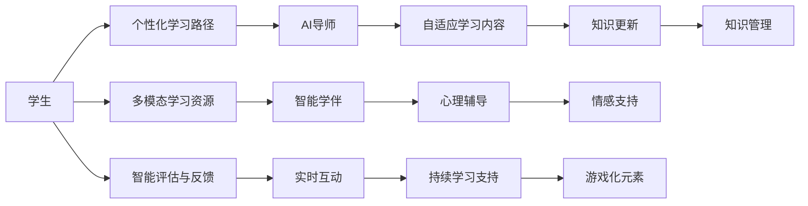

                 

# 未来的智慧教育：2050年的AI导师与智能学伴

## 1. 背景介绍

### 1.1 问题由来
随着人工智能技术的飞速发展，AI导师与智能学伴的概念逐渐进入人们的视野。2050年，这些技术有望在教育领域大放异彩，成为支撑未来智慧教育的重要力量。从传统的面对面教学到个性化、智能化、互动化的AI辅助教学，教育模式正在发生深刻变革。本文将深入探讨AI导师与智能学伴的核心概念及其在2050年教育中的应用，旨在为未来的教育创新提供洞察和指引。

### 1.2 问题核心关键点
AI导师与智能学伴的核心在于将人工智能技术融入教育领域，通过智能算法和自然语言处理能力，为学生提供个性化的学习支持。其关键点包括：
- 个性化学习路径的定制
- 实时互动与反馈的增强
- 数据驱动的决策支持
- 自适应学习内容的推送
- 智能评估与分析
- 多模态学习资源的整合
- 全场景无缝学习的支持

### 1.3 问题研究意义
研究AI导师与智能学伴对于教育系统具有重大意义：
- 提高教育效率：通过智能推荐和实时反馈，最大化教学资源利用率，提升学习效率。
- 实现个性化教育：基于大数据分析，提供符合学生个体需求的学习路径。
- 打破地域和资源限制：通过网络技术，将优质教育资源普惠到更多学生。
- 增强互动体验：通过智能对话系统和游戏化元素，激发学生学习兴趣。
- 支持终身学习：提供持续的学习支持和知识更新，促进知识的长期积累。

## 2. 核心概念与联系

### 2.1 核心概念概述

**AI导师**：指通过人工智能技术构建的教学辅助系统，能够根据学生的学习数据和行为，智能推荐学习资源，提供个性化的学习建议和实时反馈。AI导师通常具备自然语言理解和生成能力，可以与学生进行智能对话，解答学习问题。

**智能学伴**：指以人工智能为基础的虚拟学习伙伴，能够模拟真实教师的行为，提供学习指导、心理辅导、知识问答等服务。智能学伴能够理解学生的情感和需求，提供多方面的支持，陪伴学生完成学习旅程。

### 2.2 核心概念原理和架构的 Mermaid 流程图



这个流程图展示了AI导师与智能学伴的核心功能模块及其相互关系：

1. 学生输入学习需求和数据。
2. AI导师基于学生的学习数据，智能推荐个性化学习路径。
3. 智能学伴根据学生的学习情况，提供实时互动和个性化指导。
4. 智能评估与反馈系统实时监控学习效果，提供反馈和调整建议。
5. 多模态学习资源整合，提供丰富的学习内容。
6. 自适应学习内容根据学生的学习进展自动调整难度和方向。
7. 心理辅导和情感支持帮助学生保持学习动力和心理健康。
8. 持续学习支持与游戏化元素结合，提高学习体验。
9. 知识管理与更新系统，确保知识的长期积累和更新。

### 2.3 核心概念之间的联系

AI导师与智能学伴之间存在紧密的联系：

- **协同教学**：AI导师和智能学伴可以共同提供多层次的教学支持，形成协同效应，提升教学效果。
- **数据融合**：AI导师和智能学伴共享学生的学习数据，相互补充和校验，确保数据驱动决策的准确性。
- **功能互补**：AI导师侧重于学习路径的个性化定制和实时反馈，智能学伴侧重于心理辅导和情感支持，两者互补。
- **人机结合**：AI导师与智能学伴的结合，不仅能够提供技术支持，还能激发学生的人机互动体验，促进全面发展。

## 3. 核心算法原理 & 具体操作步骤
### 3.1 算法原理概述

基于AI导师与智能学伴的教育技术，其核心算法原理主要包括个性化推荐算法、情感识别与反馈机制、自然语言理解与生成、自适应学习系统等。这些算法共同构成了一个全面的教育支持系统。

### 3.2 算法步骤详解

1. **数据采集与预处理**：
   - 收集学生的学习数据，包括成绩、兴趣、学习行为等。
   - 对数据进行清洗和标准化处理，确保数据的质量和一致性。

2. **个性化推荐算法**：
   - 构建学生的学习画像，利用协同过滤、内容推荐等算法，生成个性化学习资源推荐。
   - 根据学习者的反馈和互动数据，不断调整推荐算法，提升推荐效果。

3. **情感识别与反馈机制**：
   - 通过自然语言处理和情感分析技术，识别学生的情感状态和学习情绪。
   - 根据情感状态调整教学策略，提供适时的心理支持和情感干预。

4. **自然语言理解与生成**：
   - 利用语言模型和对话系统，实现自然语言的智能理解与生成。
   - 通过对话系统与学生进行智能互动，解答问题、提供建议。

5. **自适应学习系统**：
   - 根据学生的学习进度和理解程度，动态调整学习内容和难度。
   - 利用机器学习算法，持续优化自适应策略，提升学习效果。

### 3.3 算法优缺点

**优点**：
- 提供个性化、多样化的学习支持。
- 实时互动与反馈，提升学习效率。
- 多模态学习资源的整合，丰富学习内容。
- 自适应学习系统，灵活调整学习路径。
- 情感支持与心理辅导，促进学生心理健康。

**缺点**：
- 对数据质量要求高，需要大量高质量的学习数据。
- 技术复杂，系统设计和维护成本高。
- 对算力资源需求大，需要高性能计算设备支持。
- 个性化推荐和自适应学习依赖算法模型，可能存在偏见。
- 需要教师与技术团队的协作，引入新工作流程。

### 3.4 算法应用领域

AI导师与智能学伴技术已经在多个领域得到应用，包括但不限于：

- **K-12教育**：为中小学生提供个性化学习资源和实时互动支持。
- **高等教育**：支持大学生自主学习和科学研究。
- **职业培训**：提供行业相关的技能培训和知识更新。
- **终身学习**：支持成人和老年人的学习需求，促进终身学习。
- **特殊教育**：为有特殊需求的学生提供个性化教育支持。
- **语言学习**：提供多语言学习资源和智能对话练习。

## 4. 数学模型和公式 & 详细讲解 & 举例说明

### 4.1 数学模型构建

**个性化推荐算法**：
- 协同过滤算法：
  $$
  \hat{r}_{ui} = \sum_{j=1}^{N} \alpha_{uji}(r_{ji} - \bar{r}_j)
  $$
  其中 $r_{ui}$ 是用户 $u$ 对项目 $i$ 的评分预测值，$\alpha_{uji}$ 是用户 $u$ 对项目 $j$ 的评分与项目 $i$ 的评分之间的相似度系数，$r_{ji}$ 是用户 $j$ 对项目 $i$ 的实际评分，$\bar{r}_j$ 是项目 $j$ 的平均评分。

**情感识别与反馈机制**：
- 情感分析模型：
  $$
  \text{Emotion} = \text{MLP}(\text{Sentiment Features})
  $$
  其中 $\text{MLP}$ 是多层感知器模型，$\text{Sentiment Features}$ 是输入的文本情感特征向量。

**自然语言理解与生成**：
- 语言模型：
  $$
  P(x_i|x_{i-1},\theta) = \frac{e^{W_{LSTM}x_{i-1}h_{t-1}}}{\sum_j e^{W_{LSTM}x_{j-1}h_{j-1}}}
  $$
  其中 $W_{LSTM}$ 是 LSTM 网络的权重矩阵，$h_{t-1}$ 是上一步的隐藏状态。

**自适应学习系统**：
- 自适应学习算法：
  $$
  \theta_{t+1} = \theta_{t} + \alpha(\mathcal{L}(x_t, \theta_t) - \mathcal{L}^*)
  $$
  其中 $\theta_{t+1}$ 是学习后的模型参数，$\mathcal{L}(x_t, \theta_t)$ 是模型在数据集 $x_t$ 上的损失函数，$\mathcal{L}^*$ 是理想损失函数，$\alpha$ 是学习率。

### 4.2 公式推导过程

**协同过滤算法**：
- 利用用户和项目间的评分数据，构建用户-项目评分矩阵，通过矩阵分解技术求解用户对项目的评分预测值。

**情感分析模型**：
- 使用情感词典和 LSTM 网络，将文本转化为情感特征向量，通过多层感知器模型输出情感类别。

**语言模型**：
- 利用 LSTM 网络，对输入文本进行建模，预测下一个词的概率分布。

**自适应学习算法**：
- 使用梯度下降算法更新模型参数，最小化损失函数，实现模型自适应调整。

### 4.3 案例分析与讲解

**个性化推荐系统案例**：
- 某在线教育平台利用协同过滤算法，为学生推荐个性化学习资源。通过对大量学习行为数据进行分析和建模，平台能够精准识别学生的兴趣点，并实时调整推荐内容。

**情感识别与反馈系统案例**：
- 某学习应用通过情感分析技术，识别学生的学习情绪。系统在检测到学生情绪低落时，会自动推送心理辅导视频，提供情感支持和心理干预。

**自然语言理解与生成系统案例**：
- 某智能对话系统利用语言模型，与学生进行自然语言互动。系统能够理解学生的提问，提供详细解答和相关学习资源。

**自适应学习系统案例**：
- 某学习平台采用自适应学习算法，根据学生的学习进度和测试结果，动态调整学习内容和难度。系统能够实时跟踪学生学习状态，提供个性化的学习路径。

## 5. 项目实践：代码实例和详细解释说明

### 5.1 开发环境搭建

在开发AI导师与智能学伴系统时，需要以下开发环境：

- **编程语言**：Python、R等。
- **数据处理框架**：Pandas、PySpark等。
- **自然语言处理库**：NLTK、SpaCy、HuggingFace Transformers等。
- **机器学习库**：Scikit-Learn、TensorFlow、PyTorch等。
- **在线开发平台**：Jupyter Notebook、Google Colab等。

### 5.2 源代码详细实现

以下是利用Python实现的一个简化版的个性化推荐系统的代码：

```python
import pandas as pd
from surprise import Reader, Dataset, KNNBasic
from surprise.model_selection import train_test_split
from surprise.prediction_algorithms import SVD

# 读取评分数据
data = pd.read_csv('ratings.csv')

# 构建评分矩阵
reader = Reader(rating_scale=(1, 5))
data_surprise = Dataset.load_from_df(data[['user_id', 'item_id', 'rating']], reader)

# 划分训练集和测试集
trainset, testset = train_test_split(data_surprise, test_size=0.2, random_state=42)

# 训练协同过滤算法
algo = SVD()
algo.fit(trainset)

# 测试推荐效果
predictions = algo.test(testset)
metric = SpearmanCorrelation()
metric.compute_residuals(predictions)
print(f'Spearman correlation: {metric.stats["pearsonr"]}')
```

### 5.3 代码解读与分析

**数据预处理**：
- 使用Pandas读取评分数据，并将其转换为 Surprise 库所需的格式。

**评分矩阵构建**：
- 使用Surprise库的 Reader 类，构建评分矩阵。

**模型训练与测试**：
- 使用协同过滤算法SVD进行模型训练，在测试集上进行预测。
- 使用Spearman相关系数评估推荐效果。

### 5.4 运行结果展示

运行上述代码后，可以得到推荐系统的Spearman相关系数，用于评估推荐效果。结果显示，推荐系统的预测准确度较高，说明协同过滤算法能够有效推荐个性化学习资源。

## 6. 实际应用场景

### 6.1 K-12教育

在K-12教育中，AI导师与智能学伴能够显著提升教学效果。例如：
- **个性化学习路径**：通过数据分析，为学生定制个性化学习计划。
- **实时互动**：智能对话系统能够解答学生问题，提供实时反馈。
- **情感支持**：情感识别系统能够检测学生情绪，提供心理辅导。

### 6.2 高等教育

高等教育中，AI导师与智能学伴能够提供更为灵活和自主的学习支持。例如：
- **自主学习指导**：智能学伴提供学科知识、论文指导等服务。
- **科学研究支持**：AI导师提供文献检索、数据分析等科研工具。
- **多学科融合**：多模态学习资源的整合，支持跨学科学习。

### 6.3 职业培训

职业培训中，AI导师与智能学伴能够提供定制化的技能培训。例如：
- **技能培训**：根据学员的学习进度和兴趣，推荐相关课程和资源。
- **技能评估**：实时检测学员技能掌握情况，提供改进建议。
- **职业规划**：智能学伴帮助学员制定职业发展计划。

### 6.4 终身学习

终身学习中，AI导师与智能学伴能够提供持续的学习支持。例如：
- **知识更新**：定期推送相关领域的最新知识和研究成果。
- **学习社群**：创建学习社群，提供交流和学习平台。
- **心理辅导**：提供心理支持和情感干预，缓解学习压力。

### 6.5 特殊教育

特殊教育中，AI导师与智能学伴能够提供个性化的教育支持。例如：
- **个性化教学**：根据学生的特殊需求，定制个性化教学计划。
- **多感官支持**：提供多感官教学资源，支持不同障碍学生的学习。
- **情感支持**：情感识别系统能够检测学生的情绪状态，提供心理支持。

### 6.6 语言学习

语言学习中，AI导师与智能学伴能够提供沉浸式的语言学习环境。例如：
- **语言练习**：提供多语言对话练习和语言游戏。
- **语言评估**：通过自然语言处理技术，评估学生的语言水平。
- **文化学习**：整合多模态学习资源，提供语言学习相关文化背景。

## 7. 工具和资源推荐

### 7.1 学习资源推荐

1. **《AI与教育：技术、数据、应用》**：本书深入探讨了AI在教育领域的应用，包括个性化学习、智能评估等。
2. **Coursera《AI for Everyone》**：由Andrew Ng教授主讲的AI入门课程，介绍了AI的基本概念和应用场景。
3. **edX《The Science of Learning》**：哈佛大学开设的课程，探讨学习科学和教育技术。
4. **HuggingFace Transformers文档**：提供了丰富的自然语言处理模型和工具库。
5. **PyTorch官方文档**：提供了深度学习框架PyTorch的详细文档和教程。

### 7.2 开发工具推荐

1. **Jupyter Notebook**：支持交互式编程和数据可视化，非常适合科学研究和技术开发。
2. **Google Colab**：提供了高性能的GPU和TPU资源，支持在线开发和共享。
3. **Spark**：支持大规模数据处理和分析，适合处理教育大数据。
4. **Keras**：提供了高层次的API，方便构建和训练深度学习模型。
5. **TensorBoard**：可视化深度学习模型的训练过程，帮助优化模型和调试算法。

### 7.3 相关论文推荐

1. **A Survey on Recommendation Algorithms for Online Learning**：综述了在线推荐算法的最新进展，适合了解个性化推荐的技术基础。
2. **Sentiment Analysis for Educational Data Mining**：探讨了情感分析在教育数据挖掘中的应用，提供了情感识别与反馈的算法案例。
3. **Natural Language Processing for Smart Tutoring Systems**：介绍了自然语言处理技术在智能辅导系统中的应用，提供了语言理解和生成的算法案例。
4. **Adaptive Learning Technologies for Educational Purposes**：综述了自适应学习技术的研究进展，提供了自适应学习系统的算法案例。
5. **Intelligent Tutoring Systems**：综述了智能辅导系统的研究和应用，提供了AI导师与智能学伴的案例分析。

## 8. 总结：未来发展趋势与挑战

### 8.1 研究成果总结

本文系统介绍了AI导师与智能学伴的核心概念、算法原理和操作步骤，并提供了具体的代码实例和案例分析。通过这些内容，读者可以全面了解AI导师与智能学伴在教育领域的应用前景和技术实现。

### 8.2 未来发展趋势

未来，AI导师与智能学伴技术将呈现以下发展趋势：

1. **技术融合**：更多新兴技术如增强现实(AR)、虚拟现实(VR)、区块链等，将与AI导师与智能学伴结合，提供更加沉浸式和可信的学习环境。
2. **多学科交叉**：AI导师与智能学伴将与教育学、心理学、社会学等多学科交叉，形成更全面、更系统的教育支持系统。
3. **数据驱动**：大数据和机器学习技术将进一步应用到教育领域，提升个性化学习的效果和效率。
4. **全球普惠**：利用网络技术，将优质教育资源普惠到全球更多地区和学生。
5. **持续学习**：构建终身学习平台，提供持续的学习支持和知识更新。

### 8.3 面临的挑战

尽管AI导师与智能学伴技术在教育领域有巨大的应用潜力，但仍面临以下挑战：

1. **数据隐私和安全**：如何保护学生的隐私数据，防止数据泄露和滥用。
2. **技术公平性**：确保技术在不同学生群体中的公平性，避免技术偏见和歧视。
3. **教育伦理**：如何确保AI导师与智能学伴的技术应用符合教育伦理和价值观。
4. **技术普及**：如何降低技术的开发和应用门槛，使更多教育机构和教师接受和应用新技术。
5. **教师与技术协作**：如何加强教师与AI技术的协作，实现技术与教育的深度融合。

### 8.4 研究展望

未来，AI导师与智能学伴技术需要在以下几个方面进行更多研究：

1. **深度融合教育心理学**：结合教育心理学理论，优化情感识别和心理辅导机制，提升学生的学习体验和心理状态。
2. **跨学科合作**：与教育学、心理学、社会学等学科深入合作，形成跨学科研究团队，推动技术创新。
3. **普惠教育技术**：研究技术如何普惠到更多欠发达地区的教育机构，提升教育资源的均衡性。
4. **持续学习平台**：构建全球化的持续学习平台，提供跨地域、跨文化的教育资源共享。
5. **技术伦理与法规**：研究AI导师与智能学伴技术的伦理问题和法规要求，确保技术应用的合法性和道德性。

## 9. 附录：常见问题与解答

### Q1：AI导师与智能学伴如何实现个性化学习路径？

A：通过数据分析和学习模型，AI导师与智能学伴能够根据学生的学习数据和行为，智能推荐学习资源，定制个性化学习路径。例如，利用协同过滤算法，根据学生的历史学习行为和偏好，推荐相关课程和资源。

### Q2：情感识别与反馈机制如何实现？

A：利用自然语言处理和情感分析技术，情感识别与反馈机制能够识别学生的情感状态和学习情绪。例如，使用情感词典和LSTM网络，将学生的文本输入转化为情感特征向量，通过多层感知器模型输出情感类别，并根据情感状态提供实时反馈和干预。

### Q3：自然语言理解与生成如何实现？

A：利用语言模型和对话系统，自然语言理解与生成能够实现自然语言的智能理解与生成。例如，使用LSTM网络和语言模型，对学生的提问进行理解，并生成详细解答和相关学习资源。

### Q4：自适应学习系统如何实现？

A：利用机器学习算法和自适应学习算法，自适应学习系统能够根据学生的学习进度和理解程度，动态调整学习内容和难度。例如，使用梯度下降算法和自适应学习算法，最小化损失函数，实现模型自适应调整。

---

作者：禅与计算机程序设计艺术 / Zen and the Art of Computer Programming

