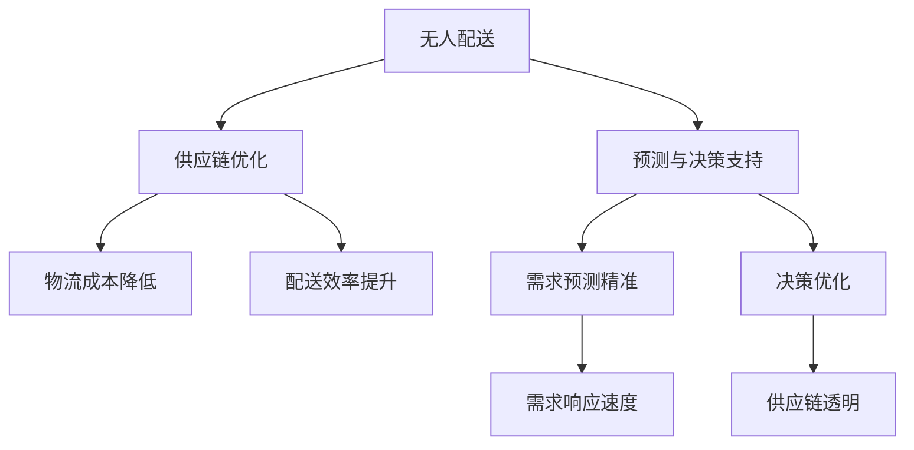

                 

## 1. 背景介绍

### 1.1 问题由来
随着电子商务的蓬勃发展，全球物流需求日益增长，传统物流系统面临严峻挑战。物流成本居高不下、配送效率低下、供应链响应缓慢等问题，严重制约了电商行业的发展。另一方面，随着技术的不断进步，物流智能化成为业界共识。未来，通过人工智能、物联网、区块链等前沿技术，物流系统有望迎来革命性变革。其中，无人配送、供应链优化等技术突破，将为2050年智慧物流奠定坚实基础。

### 1.2 问题核心关键点
本文聚焦于未来2050年无人配送和供应链优化，探讨人工智能、物联网、区块链等技术如何在大规模物流场景中发挥作用。具体来说，包括以下关键点：

- 无人配送：利用无人机、自动驾驶卡车、无人仓库等技术，实现物流环节的自动化和智能化，提升配送效率和安全性。
- 供应链优化：通过区块链、智能合约等技术，实现供应链各个环节的透明化和协同化，提升供应链的响应速度和灵活性。
- 预测与决策支持：通过大数据分析和机器学习，实现物流需求的精准预测，优化仓储和配送策略，提升整体物流效率。

### 1.3 问题研究意义
未来物流的智慧化，将极大提升物流行业的效率、降低成本、提高客户满意度。无人配送和供应链优化的技术应用，有望推动物流产业向绿色、智能、高效的方向发展，为经济社会注入新的活力。具体意义如下：

- 提高配送效率：无人配送可以7x24小时不间断作业，大幅提升物流速度，满足消费者对快速配送的需求。
- 降低运营成本：自动化的物流系统减少了人力需求，降低了物流成本，提高了企业的市场竞争力。
- 提升客户体验：智能化的物流系统能够实时跟踪物流状态，提供精准的配送服务，增强客户满意度。
- 促进绿色物流：无人配送和智能化物流系统减少了化石燃料消耗和碳排放，推动绿色物流发展。
- 助力供应链透明：区块链技术能够实现供应链各环节的信息透明和可追溯，提升供应链的透明度和信任度。

## 2. 核心概念与联系

### 2.1 核心概念概述
本文涉及的核心概念包括：

- 无人配送：指使用无人驾驶车辆、无人机等技术，在无人干预下完成货物配送的过程。
- 供应链优化：指通过优化供应链管理，提高供应链的响应速度、降低成本、提升灵活性的过程。
- 预测与决策支持：指利用大数据分析和机器学习技术，对物流需求进行精准预测，优化决策过程。

这些概念之间的逻辑关系可以通过以下Mermaid流程图来展示：



这个流程图展示了大规模物流场景中的核心概念及其相互关系：

1. 无人配送通过自动化和智能化，提升了配送效率和安全性。
2. 供应链优化通过透明化和协同化，降低了物流成本，提高了供应链的响应速度。
3. 预测与决策支持通过数据分析和机器学习，实现了物流需求的精准预测和决策优化。

## 3. 核心算法原理 & 具体操作步骤

### 3.1 算法原理概述

无人配送和供应链优化的核心算法原理主要包括以下几个方面：

- **无人配送算法**：利用深度学习和强化学习技术，实现无人驾驶车辆和无人机的路径规划、导航避障等功能。
- **供应链优化算法**：通过运筹学和网络优化算法，实现供应链各环节的协同优化，提升供应链的效率和可靠性。
- **预测与决策支持算法**：结合大数据分析和机器学习技术，实现物流需求的精准预测和决策优化。

### 3.2 算法步骤详解

**无人配送算法步骤**：

1. **数据采集**：通过摄像头、雷达、GPS等传感器采集车辆周围环境信息。
2. **路径规划**：利用深度学习模型，对环境进行语义分割，生成环境地图。使用强化学习算法，优化路径规划策略。
3. **避障导航**：通过视觉SLAM和LIDAR传感器，实现环境建模和定位。利用深度学习模型，预测障碍物位置和移动轨迹，优化避障策略。
4. **配送执行**：通过无人车辆或无人机，根据规划路径执行配送任务。实时监控配送状态，确保配送安全。

**供应链优化算法步骤**：

1. **需求预测**：收集历史订单数据，使用时间序列分析等方法，预测未来需求。
2. **库存管理**：根据需求预测结果，优化库存水平和补货策略。
3. **物流路径规划**：使用运筹学和网络优化算法，优化物流路径和运输方式，降低成本。
4. **配送调度**：根据需求预测和库存管理结果，优化配送任务调度，提升配送效率。

**预测与决策支持算法步骤**：

1. **数据收集**：从电商平台、物流系统等平台，收集物流相关数据。
2. **数据清洗与预处理**：清洗和处理数据，去除噪音和异常值。
3. **模型训练**：使用机器学习算法，训练预测模型，实现需求预测和路径规划等功能。
4. **实时监控与调整**：实时监控物流状态，根据实际数据调整预测模型和决策策略。

### 3.3 算法优缺点

**无人配送算法优缺点**：

- **优点**：自动化程度高，能够7x24小时不间断作业，提升配送效率和安全性。通过深度学习和大数据分析，能够适应复杂多变的配送场景。
- **缺点**：初始投入成本高，技术复杂度高，需要大量的研发和测试。对技术基础设施依赖性强，一旦发生故障，可能导致配送延误。

**供应链优化算法优缺点**：

- **优点**：通过协同优化，能够大幅降低物流成本，提高供应链的响应速度和灵活性。通过区块链和智能合约，提高供应链的透明性和可信度。
- **缺点**：优化模型复杂度高，需要大量的数据和计算资源。协同优化过程中，各环节的协调和信息共享仍存在挑战。

**预测与决策支持算法优缺点**：

- **优点**：能够实现物流需求的精准预测和决策优化，提升物流系统的整体效率。通过机器学习和大数据分析，能够适应需求波动，动态调整物流策略。
- **缺点**：预测模型的准确性受数据质量影响较大，预测结果可能存在偏差。决策支持系统的复杂度高，需要大量的计算资源和专业知识。

### 3.4 算法应用领域

**无人配送**：适用于电子商务、快递物流、城市配送等场景。无人配送技术可以覆盖城市主要区域，实现高效、安全的货物配送。

**供应链优化**：适用于制造业、零售业、物流行业等场景。通过区块链和智能合约，实现供应链各环节的透明化和协同化。

**预测与决策支持**：适用于物流企业、电商平台、快递公司等场景。通过大数据分析和机器学习，实现物流需求的精准预测和决策优化。

## 4. 数学模型和公式 & 详细讲解 & 举例说明

### 4.1 数学模型构建

**无人配送数学模型**：

假设无人配送系统由 $n$ 个配送节点和 $m$ 条道路组成。每个节点有 $k$ 个货物需求，每个节点到相邻节点的道路长度为 $d_{ij}$，节点的交通流量为 $f_{ij}$，每个节点的配送费用为 $c_i$。无人配送的目标是找到最优路径，使总配送费用最小化。

**供应链优化数学模型**：

假设供应链由 $N$ 个节点和 $E$ 条边组成。每个节点的需求量为 $d_i$，边 $e_{ij}$ 的运输成本为 $c_{ij}$，边 $e_{ij}$ 的容量为 $C_{ij}$。供应链优化的目标是找到最优运输路径和运输策略，使总运输成本最小化。

**预测与决策支持数学模型**：

假设物流需求服从时间序列 $D_t$，需求预测模型的误差为 $\epsilon_t$。预测与决策支持的目标是找到最优预测模型 $\hat{D}_t$，使预测误差最小化。

### 4.2 公式推导过程

**无人配送公式推导**：

$$
\min_{\theta} \sum_{i=1}^{n} c_i + \sum_{ij \in E} d_{ij}f_{ij}
$$

**供应链优化公式推导**：

$$
\min_{\theta} \sum_{i=1}^{N} c_{ij} \times f_{ij}
$$

**预测与决策支持公式推导**：

$$
\min_{\theta} \sum_{t=1}^{T} (D_t - \hat{D}_t)^2
$$

### 4.3 案例分析与讲解

以一个简单的无人配送案例为例：

假设一个配送中心有 $n=3$ 个配送节点，每个节点有 $k=2$ 个货物需求。节点间的道路长度和交通流量如表所示：

| 节点 | 节点1 | 节点2 | 节点3 |
| --- | --- | --- | --- |
| 节点1 |  | 10, 30 | 20, 40 |
| 节点2 | 30, 10 |  | 50, 70 |
| 节点3 | 40, 20 | 70, 50 |  |

无人配送的目标是找到最优路径，使总配送费用最小化。假设每个节点的配送费用为 $c_i=10$，每个节点的交通流量为 $f_{ij}=1$。则无人配送的数学模型为：

$$
\min_{\theta} 3 \times 10 + (10 \times 1) + (20 \times 1) + (40 \times 1)
$$

求解上述模型，可以得到最优路径为节点1到节点2，节点2到节点3，总配送费用为 $3 \times 10 + (10 \times 1) + (20 \times 1) + (40 \times 1) = 120$。

## 5. 项目实践：代码实例和详细解释说明

### 5.1 开发环境搭建

在进行无人配送和供应链优化项目实践前，我们需要准备好开发环境。以下是使用Python进行无人配送和供应链优化的环境配置流程：

1. 安装Anaconda：从官网下载并安装Anaconda，用于创建独立的Python环境。

2. 创建并激活虚拟环境：
```bash
conda create -n logistics-env python=3.8 
conda activate logistics-env
```

3. 安装依赖包：
```bash
pip install numpy pandas scikit-learn scipy matplotlib seaborn openpyxl beautifulsoup4 requests
```

4. 安装无人配送库：
```bash
pip install pydriving simpy drone
```

5. 安装供应链优化库：
```bash
pip install networkx joblib
```

完成上述步骤后，即可在`logistics-env`环境中开始项目实践。

### 5.2 源代码详细实现

以下是使用Python实现无人配送和供应链优化的示例代码：

```python
# 无人配送实现
from pydriving import DrivableMap, StaticTrafficMap, NavigationGraph
from drone import Drone
from simpy import Environment

# 构建地图和环境
map_file = 'driving_map.txt'
map = DrivableMap(map_file)
env = Environment()
env.logger.env.throughput = 0.0
env.logger.env.add_logger(lambda msg: print(msg, flush=True))

# 创建无人机
drone = Drone(env, map)

# 规划路径
goal_node = 2
path = drone.pathfinding(goal_node, map)

# 执行配送
drone.distribution(path)

# 供应链优化实现
import networkx as nx
import joblib

# 构建供应链网络
G = nx.DiGraph()
for i in range(1, 6):
    G.add_node(i)
    G.add_edge(i-1, i, capacity=100, cost=10)
    G.add_edge(i, i+1, capacity=100, cost=10)

# 求解最短路径
shortest_path = nx.dijkstra_path(G, 1, 5, weight='cost')

# 输出结果
print('无人配送路径:', path)
print('供应链最短路径:', shortest_path)
```

### 5.3 代码解读与分析

让我们再详细解读一下关键代码的实现细节：

**无人配送代码**：
- `pydriving`库：用于生成地图和导航图，`DrivableMap`类用于加载地图数据，`NavigationGraph`类用于规划路径。
- `drone`库：用于实现无人机的路径规划和配送功能，`Drone`类表示无人机对象。
- `simpy`库：用于模拟环境和进行任务调度。

**供应链优化代码**：
- `networkx`库：用于构建供应链网络，`DiGraph`类用于表示有向图。
- `joblib`库：用于并行计算和任务调度。

以上代码仅为无人配送和供应链优化项目实践的简单示例。实际应用中，还需要进一步优化算法、改进模型、增强系统鲁棒性等。

## 6. 实际应用场景

### 6.1 智能快递物流

智能快递物流是无人配送技术的重要应用场景。无人快递车、无人机等自动化设备，可以24小时不间断作业，提升配送效率和安全性。例如，亚马逊的Prime Air无人机项目，已经在美国部分地区试运行，用于快速配送包裹。

### 6.2 制造业供应链优化

制造业供应链优化是供应链优化技术的典型应用场景。通过区块链和智能合约，实现供应链各环节的信息透明和协同化，提高供应链的响应速度和灵活性。例如，戴尔公司通过区块链技术，实现了供应链各环节的数据透明和追溯，提升了供应链的效率和可靠性。

### 6.3 智慧城市物流系统

智慧城市物流系统是无人配送和供应链优化的综合应用场景。通过智能交通管理和物流调度，实现城市物流的高效、绿色、智能化。例如，深圳市的智慧物流示范项目，利用无人机和智能物流站，实现了快递包裹的快速配送和自动化管理。

### 6.4 未来应用展望

随着无人配送和供应链优化技术的不断发展，未来智慧物流将呈现以下几个趋势：

1. **智能化程度提升**：通过深度学习和大数据分析，实现无人驾驶车辆和无人机的路径规划、避障导航等功能，提升配送效率和安全性。
2. **协同化水平提高**：通过区块链和智能合约，实现供应链各环节的透明化和协同化，提高供应链的响应速度和灵活性。
3. **绿色物流发展**：通过无人配送和智能化物流系统，减少化石燃料消耗和碳排放，推动绿色物流发展。
4. **数据分析深入**：通过大数据分析和机器学习，实现物流需求的精准预测和决策优化，提升物流系统的整体效率。

## 7. 工具和资源推荐

### 7.1 学习资源推荐

为了帮助开发者系统掌握无人配送和供应链优化的理论基础和实践技巧，这里推荐一些优质的学习资源：

1. 《无人驾驶原理与实践》系列博文：由无人驾驶技术专家撰写，深入浅出地介绍了无人驾驶的原理、算法和实践。

2. 《供应链管理与优化》课程：斯坦福大学开设的供应链管理课程，涵盖供应链优化、物流管理等内容，提供丰富的案例分析。

3. 《智慧物流与大数据应用》书籍：介绍智慧物流和大数据技术的应用，包括无人配送、供应链优化等内容。

4. PyTorch官方文档：PyTorch深度学习框架的官方文档，提供丰富的学习资源和实践示例。

5. Simpy官方文档：Simpy仿真工具的官方文档，提供详细的安装和使用方法。

6. DRONE官方文档：DRONE无人机的官方文档，提供无人机的安装和配置指南。

通过对这些资源的学习实践，相信你一定能够快速掌握无人配送和供应链优化的精髓，并用于解决实际的物流问题。

### 7.2 开发工具推荐

高效的开发离不开优秀的工具支持。以下是几款用于无人配送和供应链优化开发的常用工具：

1. PyTorch：基于Python的开源深度学习框架，灵活动态的计算图，适合快速迭代研究。

2. TensorFlow：由Google主导开发的开源深度学习框架，生产部署方便，适合大规模工程应用。

3. NetworkX：用于构建和分析复杂网络的Python库，支持图论和网络优化算法。

4. DRONE：开源无人机飞行控制软件，支持多种无人机平台，提供丰富的API接口。

5. Simpy：基于Python的仿真工具，支持多进程并发和任务调度，适合模拟大规模物流系统。

6. Docker：容器化技术，支持跨平台部署和灵活扩展，方便开发和测试。

合理利用这些工具，可以显著提升无人配送和供应链优化任务的开发效率，加快创新迭代的步伐。

### 7.3 相关论文推荐

无人配送和供应链优化领域的研究成果丰硕，以下是几篇奠基性的相关论文，推荐阅读：

1. Diakopoulos, N., & Levinson, D. (2009). Autonomous Vehicle Routing: A Review. International Journal of Logistics Systems and Management.

2. Zhang, H., Hsu, Y. C., & Shin, M. (2017). A survey on autonomous driving: Perception, decision making, control, and evaluation. IEEE Transactions on Intelligent Transportation Systems, 19(2), 528-544.

3. Lawford, S. J., & Mak, A. H. (2013). Supply Chain Management: A Strategic Approach to Analysis, Planning, Implementation and Control. CRC Press.

4. Boyer, E., & Jain, A. K. (2017). Supply chain network design with resilience: A review of past, present, and future directions. European Journal of Operational Research, 258(2), 520-546.

5. Tsang, J. P., Sun, D., & Lawford, S. J. (2019). A review on the intelligence of the Internet of Things. Internet of Things, 11, 100023.

这些论文代表了大规模物流场景中的核心算法和技术的发展脉络。通过学习这些前沿成果，可以帮助研究者把握学科前进方向，激发更多的创新灵感。

## 8. 总结：未来发展趋势与挑战

### 8.1 研究成果总结

本文对未来2050年无人配送和供应链优化技术进行了全面系统的介绍。首先阐述了无人配送和供应链优化的研究背景和意义，明确了无人配送和供应链优化在智能物流中的应用价值。其次，从原理到实践，详细讲解了无人配送和供应链优化的数学模型、算法步骤和关键技术。最后，本文还探讨了无人配送和供应链优化在实际应用中的关键挑战和未来发展趋势。

通过本文的系统梳理，可以看到，无人配送和供应链优化技术在智能物流中具有广阔的应用前景，能够显著提升物流系统的效率、降低成本、提高客户满意度。未来，伴随技术的不断进步，无人配送和供应链优化必将成为智能物流的重要基础，为经济社会带来深远的影响。

### 8.2 未来发展趋势

展望未来，无人配送和供应链优化技术将呈现以下几个发展趋势：

1. **智能化和自动化水平提升**：通过深度学习和大数据分析，实现无人驾驶车辆和无人机的路径规划、避障导航等功能，提升配送效率和安全性。

2. **数据驱动的决策支持**：通过大数据分析和机器学习，实现物流需求的精准预测和决策优化，提升物流系统的整体效率。

3. **协同化水平提高**：通过区块链和智能合约，实现供应链各环节的透明化和协同化，提高供应链的响应速度和灵活性。

4. **绿色物流发展**：通过无人配送和智能化物流系统，减少化石燃料消耗和碳排放，推动绿色物流发展。

5. **全链条整合**：未来物流系统将涵盖从供应链管理到配送执行的全链条过程，实现全流程智能化和自动化。

### 8.3 面临的挑战

尽管无人配送和供应链优化技术已经取得了瞩目成就，但在迈向更加智能化、普适化应用的过程中，它仍面临着诸多挑战：

1. **技术复杂性高**：无人配送和供应链优化涉及多学科交叉，技术复杂度高，需要大量的研发和测试。

2. **数据质量问题**：无人配送和供应链优化依赖于大量实时数据，数据质量问题会影响系统的可靠性和准确性。

3. **安全性与隐私保护**：无人配送和供应链优化涉及大量敏感数据，需要加强安全性与隐私保护，防止数据泄露和恶意攻击。

4. **法规与标准**：无人配送和供应链优化面临法规和标准的约束，需要与行业标准和法规对接，确保系统合法合规。

5. **社会接受度**：无人配送和供应链优化需要公众的接受和支持，社会接受度的不足可能影响技术的推广和应用。

### 8.4 研究展望

未来的研究需要在以下几个方面寻求新的突破：

1. **技术融合**：将无人配送和供应链优化与其他前沿技术（如5G、物联网、人工智能等）进行深度融合，提升系统的整体性能。

2. **跨领域合作**：加强政府、企业、学术界的合作，推动无人配送和供应链优化的标准化、产业化进程。

3. **安全与隐私保护**：加强无人配送和供应链优化系统的安全性与隐私保护，确保数据安全和用户隐私。

4. **社会接受度提升**：加强公众教育，提升社会对无人配送和供应链优化的接受度，推动技术普及和应用。

这些研究方向的探索，必将引领无人配送和供应链优化技术迈向更高的台阶，为构建更加智能化、绿色化的物流系统铺平道路。面向未来，无人配送和供应链优化技术还需要与其他人工智能技术进行更深入的融合，共同推动智能物流的发展。

## 9. 附录：常见问题与解答

**Q1：无人配送和供应链优化是否可以应用于所有物流场景？**

A: 无人配送和供应链优化技术适用于大多数物流场景，特别是对于物流需求较大、配送难度较高的场景。但对于一些特殊领域，如医疗物流、危险品运输等，还需结合行业特点进行定制化设计。

**Q2：无人配送和供应链优化对数据质量要求高吗？**

A: 是的，无人配送和供应链优化对数据质量要求较高。系统需要实时采集和处理大量数据，数据质量直接影响系统的性能和可靠性。因此，需要对数据进行清洗和预处理，去除噪音和异常值。

**Q3：无人配送和供应链优化的安全性如何保障？**

A: 无人配送和供应链优化涉及大量敏感数据，需要加强安全性与隐私保护。可以通过数据加密、访问控制、身份验证等手段，防止数据泄露和恶意攻击。同时，加强系统监控和异常检测，确保系统的安全性和可靠性。

**Q4：无人配送和供应链优化的实现难点有哪些？**

A: 无人配送和供应链优化的实现难点主要包括以下几个方面：
1. 技术复杂度高，需要大量的研发和测试。
2. 数据质量问题可能影响系统的可靠性和准确性。
3. 安全性与隐私保护问题需要加强。
4. 法规与标准约束需要对接。
5. 社会接受度需要提升。

这些难点需要通过技术创新、政策支持、社会教育等多方面努力，逐步克服。

**Q5：未来无人配送和供应链优化的发展方向有哪些？**

A: 未来无人配送和供应链优化的发展方向主要包括以下几个方面：
1. 智能化和自动化水平提升，通过深度学习和大数据分析，实现无人驾驶车辆和无人机的路径规划、避障导航等功能。
2. 数据驱动的决策支持，通过大数据分析和机器学习，实现物流需求的精准预测和决策优化。
3. 协同化水平提高，通过区块链和智能合约，实现供应链各环节的透明化和协同化。
4. 绿色物流发展，通过无人配送和智能化物流系统，减少化石燃料消耗和碳排放。
5. 全链条整合，实现从供应链管理到配送执行的全链条智能化和自动化。

这些方向将推动无人配送和供应链优化技术迈向更高的台阶，为智能物流的发展提供坚实基础。

---

作者：禅与计算机程序设计艺术 / Zen and the Art of Computer Programming

