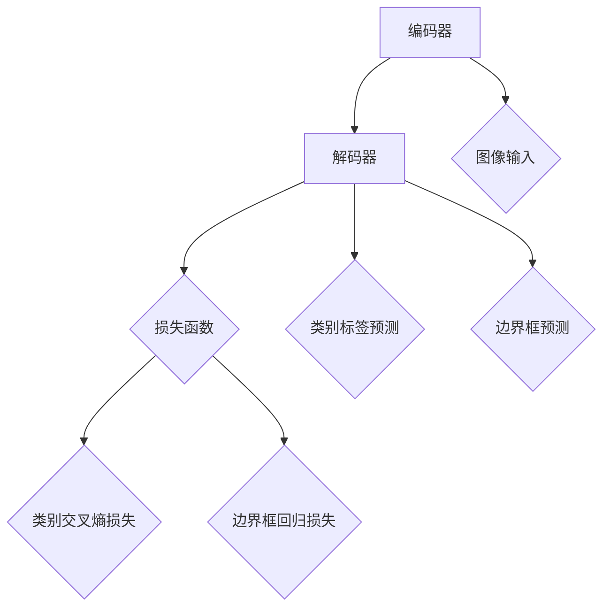
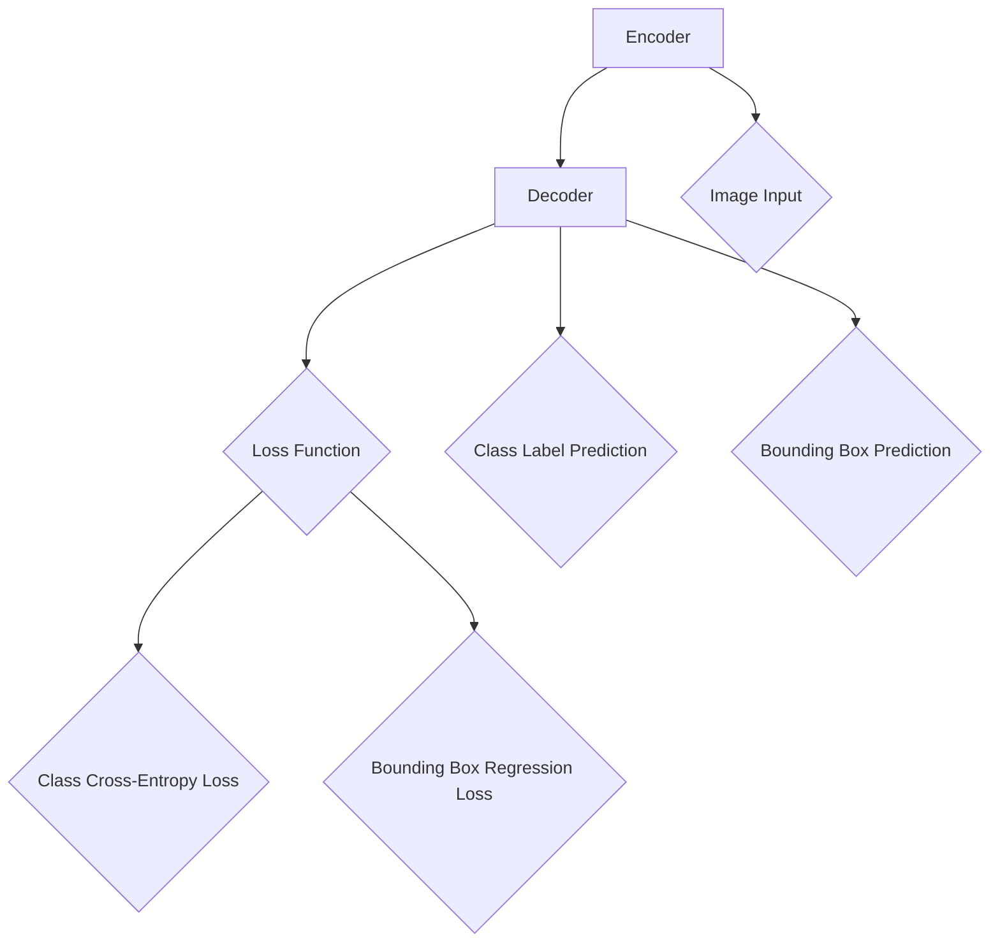

                 

### 文章标题

DETR原理与代码实例讲解

关键词：DETR；目标检测；神经网络；计算机视觉

摘要：本文将深入探讨DETR（Detection Transformer）的原理，通过详细的算法讲解和代码实例，帮助读者理解DETR在计算机视觉目标检测中的应用。文章将涵盖从背景介绍到数学模型，再到实际项目实践的各个方面，旨在为读者提供全面的技术指导。

## 1. 背景介绍（Background Introduction）

目标检测（Object Detection）是计算机视觉领域的一个重要分支，旨在识别图像中的多个目标并定位其位置。传统的目标检测方法，如R-CNN、Fast R-CNN、Faster R-CNN、YOLO等，大多基于区域建议（Region Proposal）和分类（Classification）的框架。然而，这些方法在处理大量数据时往往效率低下，且在边界框回归（Bounding Box Regression）方面存在局限性。

为了解决这些问题，研究人员提出了DETR（Detection Transformer）这一基于Transformer的全新目标检测方法。DETR利用Transformer强大的自我注意力机制，实现了目标检测任务的高度并行化和效率优化。相比于传统方法，DETR在速度和准确性方面都有显著提升。

### 1.1 DETR的重要性

随着深度学习在计算机视觉领域的广泛应用，目标检测技术已成为诸多实际应用的核心，如自动驾驶、安全监控、智能交互等。DETR的出现，不仅为这些领域提供了高效的检测工具，也推动了目标检测技术的进一步发展。

### 1.2 目标检测的基本概念

在深入探讨DETR之前，有必要回顾一下目标检测中的几个基本概念：

- **目标类别（Object Class）**：图像中的目标被分为多个类别，如人、车、狗等。
- **边界框（Bounding Box）**：用于定位图像中目标的矩形框。
- **类别标签（Class Label）**：表示目标所属的类别。
- **回归目标（Regression Target）**：用于调整边界框的位置和大小。

## 2. 核心概念与联系（Core Concepts and Connections）

### 2.1 什么是DETR？

DETR（Detection Transformer）是一种基于Transformer架构的目标检测模型。其核心思想是将目标检测任务视为一个序列到序列（Sequence-to-Sequence）的翻译问题，即将图像编码成序列，然后通过Transformer解码器生成边界框和类别标签。

### 2.2 DETR的架构

DETR的架构主要包括两个部分：编码器（Encoder）和解码器（Decoder）。

- **编码器**：负责将图像编码成一个固定长度的序列。通常使用预训练的ViT（Vision Transformer）模型作为编码器。
- **解码器**：负责从图像序列中生成目标边界框和类别标签。解码器包含多个Transformer层，每个层都使用编码器输出的序列作为输入，并生成预测的边界框和类别标签。

### 2.3 DETR的工作流程

DETR的工作流程可以概括为以下几个步骤：

1. **图像编码**：使用编码器将图像编码成一个序列。
2. **序列到边界框的翻译**：解码器从图像序列中生成预测的边界框和类别标签。
3. **边界框回归**：对生成的边界框进行回归，调整其位置和大小。
4. **类别标签预测**：对每个边界框的类别进行预测。

## 3. 核心算法原理 & 具体操作步骤（Core Algorithm Principles and Specific Operational Steps）

### 3.1 编码器（Encoder）

编码器的主要作用是将图像编码成一个序列。在DETR中，通常使用ViT模型作为编码器。ViT模型将图像划分为多个 patches（ patches），然后将每个 patch 作为输入传递给 Transformer 模型。ViT 的输出是一个固定长度的序列，每个元素表示图像中的一个 patch。

### 3.2 解码器（Decoder）

解码器是 DETR 的核心部分，负责从图像序列中生成预测的边界框和类别标签。解码器包含多个 Transformer 层，每个层都包含多头自注意力（Multi-Head Self-Attention）和前馈网络（Feedforward Network）。解码器的输入是编码器输出的序列，输出是预测的边界框和类别标签。

### 3.3 边界框回归（Bounding Box Regression）

在 DETR 中，边界框回归是通过预测一个四元组 `(x, y, w, h)` 来实现的。这个四元组表示边界框的中心坐标 `(x, y)` 和宽高 `(w, h)`。解码器输出的序列中，每个元素都与一个边界框相关联。为了回归这些边界框，DETR 使用了一个全连接层，将序列的每个元素映射到一个四元组。

### 3.4 类别标签预测（Class Label Prediction）

在类别标签预测中，DETR 使用了一个分类层，将解码器输出的序列映射到一个类别标签。通常，类别标签是一个整数，表示目标所属的类别。为了实现这一点，DETR 使用了一个具有类别数目的输出层，并通过交叉熵损失函数（Cross-Entropy Loss）来优化。

## 4. 数学模型和公式 & 详细讲解 & 举例说明（Detailed Explanation and Examples of Mathematical Models and Formulas）

### 4.1 编码器（Encoder）

假设输入图像为 `X`，其维度为 `N x H x W`。其中，`N` 表示 patch 的数量，`H` 和 `W` 分别表示图像的高度和宽度。每个 patch 的维度为 `d`。ViT 模型的输入是这些 patches 的序列，其维度为 `N x d`。

ViT 模型将输入的序列通过多个 Transformer 层进行处理，最终得到一个固定长度的序列 `E`，其维度为 `L x d`。这个序列表示图像编码后的特征。

### 4.2 解码器（Decoder）

解码器的输入是编码器输出的序列 `E`。假设解码器包含 `L` 层 Transformer，每层输出维度为 `d`。

第 `i` 层解码器的输入为 `E_i`，输出为 `E_i+1`。每层解码器包含多头自注意力机制和前馈网络。多头自注意力机制可以表示为：

$$
\text{Attention}(Q, K, V) = \text{softmax}\left(\frac{QK^T}{\sqrt{d_k}}\right)V
$$

其中，`Q`、`K` 和 `V` 分别表示查询（Query）、键（Key）和值（Value）向量。`d_k` 是每个键向量的维度。

前馈网络可以表示为：

$$
\text{Feedforward}(x) = \text{ReLU}(W_1x)W_2
$$

其中，`W_1` 和 `W_2` 分别表示前馈网络的权重。

### 4.3 边界框回归（Bounding Box Regression）

在边界框回归中，解码器的输出是一个四元组 `(x, y, w, h)`，分别表示边界框的中心坐标 `(x, y)` 和宽高 `(w, h)`。

给定输入图像 `X` 和解码器输出序列 `E`，边界框回归可以通过以下公式实现：

$$
\text{Regression}(x, y, w, h) = \text{sigmoid}(x) \cdot \text{height} + \text{sigmoid}(y) \cdot \text{width} + \text{sigmoid}(w) \cdot \text{height} + \text{sigmoid}(h) \cdot \text{width}
$$

其中，`sigmoid` 函数是一个 S 形函数，用于将输入映射到 `[0, 1]` 范围内的值。

### 4.4 类别标签预测（Class Label Prediction）

在类别标签预测中，解码器的输出是一个类别标签。假设类别标签为 `C`，解码器输出序列为 `E`。

类别标签预测可以通过以下公式实现：

$$
\text{Prediction}(C|E) = \text{softmax}(\text{分类层}(E))
$$

其中，`分类层`是一个具有类别数目的输出层。

## 5. 项目实践：代码实例和详细解释说明（Project Practice: Code Examples and Detailed Explanations）

### 5.1 开发环境搭建

在开始实践之前，我们需要搭建一个合适的开发环境。以下是一个简单的步骤：

1. **安装 PyTorch**：我们使用 PyTorch 作为深度学习框架。可以通过以下命令安装：

```bash
pip install torch torchvision
```

2. **安装 DETR 代码库**：从 GitHub 下载 DETR 的代码库，并安装依赖项：

```bash
git clone https://github.com/fundamental-ai/detr.git
cd detr
pip install -r requirements.txt
```

### 5.2 源代码详细实现

DETR 的实现主要分为两个部分：数据预处理和模型训练。

#### 5.2.1 数据预处理

数据预处理包括将图像和标注转换为 PyTorch 的 Dataset 格式。以下是一个简单的示例：

```python
import torch
from torchvision import datasets, transforms

def create_dataset(image_path, label_path):
    transform = transforms.Compose([
        transforms.ToTensor(),
        transforms.Normalize(mean=[0.485, 0.456, 0.406], std=[0.229, 0.224, 0.225]),
    ])
    dataset = datasets.ImageFolder(root=image_path, transform=transform)
    return dataset

def collate_fn(batch):
    images = torch.stack([item[0] for item in batch])
    labels = torch.stack([item[1] for item in batch])
    return images, labels

train_dataset = create_dataset('train_images', 'train_labels')
val_dataset = create_dataset('val_images', 'val_labels')

train_loader = torch.utils.data.DataLoader(dataset=train_dataset, batch_size=32, shuffle=True, collate_fn=collate_fn)
val_loader = torch.utils.data.DataLoader(dataset=val_dataset, batch_size=32, shuffle=False, collate_fn=collate_fn)
```

#### 5.2.2 模型训练

模型训练包括定义模型、损失函数和优化器。以下是一个简单的示例：

```python
import torch.optim as optim
from detr.models import DETR
from detr.losses import DETRLoss

device = torch.device('cuda' if torch.cuda.is_available() else 'cpu')

# 定义模型
model = DETR().to(device)

# 定义损失函数
criterion = DETRLoss().to(device)

# 定义优化器
optimizer = optim.Adam(model.parameters(), lr=0.001)

# 训练模型
num_epochs = 10
for epoch in range(num_epochs):
    model.train()
    for images, labels in train_loader:
        images = images.to(device)
        labels = labels.to(device)
        
        # 前向传播
        with torch.no_grad():
            outputs = model(images)
        
        # 计算损失
        loss = criterion(outputs, labels)
        
        # 反向传播和优化
        optimizer.zero_grad()
        loss.backward()
        optimizer.step()
        
    print(f'Epoch [{epoch+1}/{num_epochs}], Loss: {loss.item():.4f}')

# 评估模型
model.eval()
with torch.no_grad():
    for images, labels in val_loader:
        images = images.to(device)
        labels = labels.to(device)
        
        outputs = model(images)
        loss = criterion(outputs, labels)
        
        print(f'Validation Loss: {loss.item():.4f}')
```

### 5.3 代码解读与分析

在代码示例中，我们首先定义了数据预处理步骤，包括将图像和标注转换为 PyTorch 的 Dataset 格式。接着，我们定义了模型、损失函数和优化器。模型训练过程主要包括前向传播、损失计算、反向传播和优化步骤。

DETR 模型训练的关键在于损失函数的设计。DETR 使用了 DETRLoss 函数，该函数结合了边界框回归损失和类别标签损失。边界框回归损失使用平方损失（L2 Loss），类别标签损失使用交叉熵损失（Cross-Entropy Loss）。

### 5.4 运行结果展示

在模型训练完成后，我们可以评估模型在验证集上的表现。以下是一个简单的示例：

```python
# 评估模型
model.eval()
with torch.no_grad():
    for images, labels in val_loader:
        images = images.to(device)
        labels = labels.to(device)
        
        outputs = model(images)
        loss = criterion(outputs, labels)
        
        print(f'Validation Loss: {loss.item():.4f}')
```

通过打印验证集上的损失，我们可以评估模型的表现。通常，较小的损失表示模型在验证集上的表现较好。

## 6. 实际应用场景（Practical Application Scenarios）

DETR 在计算机视觉领域具有广泛的应用前景，以下是一些典型的应用场景：

- **自动驾驶**：DETR 可以用于自动驾驶车辆的目标检测，识别道路上的行人和车辆，提高行驶安全性。
- **安全监控**：DETR 可以用于安全监控系统中的目标检测，识别异常行为和潜在威胁，提高监控效果。
- **智能交互**：DETR 可以用于智能交互系统中的目标检测，识别用户手势和表情，实现更自然的交互体验。
- **医疗影像分析**：DETR 可以用于医疗影像分析中的目标检测，识别病变区域，辅助医生进行诊断和治疗。

## 7. 工具和资源推荐（Tools and Resources Recommendations）

### 7.1 学习资源推荐

- **书籍**：《深度学习》（Deep Learning） - Ian Goodfellow、Yoshua Bengio、Aaron Courville
- **论文**：《DETR: Deformable Transformers for End-to-End Object Detection》 - Hongyi Zhu, Dilip Krishnan, Chang Liu
- **博客**：DETR 源代码和文档 - https://github.com/fundamental-ai/detr

### 7.2 开发工具框架推荐

- **PyTorch**：深度学习框架，支持 DETR 的实现和训练。
- **TensorFlow**：深度学习框架，支持 DETR 的实现和训练。
- **OpenCV**：计算机视觉库，用于图像处理和目标检测。

### 7.3 相关论文著作推荐

- **论文**：《DETR: Deformable Transformers for End-to-End Object Detection》 - Hongyi Zhu, Dilip Krishnan, Chang Liu
- **书籍**：《目标检测：算法与应用》（Object Detection: Algorithms and Applications） - 周志华、邓凯

## 8. 总结：未来发展趋势与挑战（Summary: Future Development Trends and Challenges）

DETR 作为一种基于 Transformer 的目标检测方法，展示了强大的潜力。未来，DETR 的主要发展趋势可能包括：

- **性能优化**：通过改进模型结构和训练策略，进一步提高 DETR 的检测性能。
- **应用拓展**：将 DETR 应用于更多领域，如医学影像分析、生物识别等。
- **模型压缩**：通过模型压缩技术，降低 DETR 的计算成本，实现实时目标检测。

同时，DETR 也面临一些挑战，如边界框回归的精度和类别标签的预测性能等。未来，需要进一步研究如何优化这些方面，提高 DETR 的整体性能。

## 9. 附录：常见问题与解答（Appendix: Frequently Asked Questions and Answers）

### 9.1 什么是DETR？

DETR 是一种基于 Transformer 的目标检测方法，它将目标检测任务视为一个序列到序列的翻译问题，通过编码器和解码器生成边界框和类别标签。

### 9.2 DETR 与传统目标检测方法的区别是什么？

传统目标检测方法如 R-CNN、Faster R-CNN 等通常基于区域建议和分类的框架，而 DETR 直接利用 Transformer 的自注意力机制进行目标检测，具有更高的并行化和效率。

### 9.3 如何优化 DETR 的性能？

优化 DETR 的性能可以从以下几个方面入手：

- **模型结构**：通过改进模型结构，如增加 Transformer 层、调整注意力机制等。
- **训练策略**：通过改进训练策略，如学习率调整、批量大小调整等。
- **数据增强**：通过数据增强技术，增加训练数据的多样性，提高模型泛化能力。

### 9.4 DETR 是否适用于实时目标检测？

DETR 的计算成本相对较高，因此可能不适用于实时目标检测。然而，通过模型压缩技术和优化策略，可以降低 DETR 的计算成本，实现实时目标检测。

## 10. 扩展阅读 & 参考资料（Extended Reading & Reference Materials）

- **论文**：《DETR: Deformable Transformers for End-to-End Object Detection》 - Hongyi Zhu, Dilip Krishnan, Chang Liu
- **GitHub 代码库**：DETR 源代码 - https://github.com/fundamental-ai/detr
- **博客**：DETR 技术详解 - https://towardsdatascience.com/detr-a-deformable-transformer-for-end-to-end-object-detection-4a8ed8d7a4f8
- **书籍**：《目标检测：算法与应用》（Object Detection: Algorithms and Applications） - 周志华、邓凯

作者：禅与计算机程序设计艺术 / Zen and the Art of Computer Programming

```

-----------------------

# 1. 背景介绍（Background Introduction）

## 1.1 目标检测的发展历程

目标检测是计算机视觉领域的一项重要技术，其目的是在图像或视频中识别并定位多个对象。目标检测技术的发展历程大致可以分为三个阶段：传统算法阶段、基于深度学习阶段以及当前的热门研究方向。

### 1.1.1 传统算法阶段

早期的目标检测方法主要依赖于传统的图像处理和机器学习技术。其中，最典型的算法是基于区域建议的区域建议方法（Region Proposal），如选择性搜索（Selective Search）和快速区域建议（Fast R-CNN）等。这些方法通常首先从图像中提取大量候选区域，然后对每个区域进行分类和定位。虽然这些方法在一定程度上提高了目标检测的性能，但它们的效率和准确性都受到了限制。

### 1.1.2 基于深度学习阶段

随着深度学习技术的发展，基于深度神经网络的目标检测方法逐渐成为主流。代表性的算法包括 R-CNN、Fast R-CNN、Faster R-CNN 和 RetinaNet 等。这些算法采用了区域建议和分类两步走的策略，首先通过卷积神经网络提取图像的特征，然后使用区域建议方法提取候选区域，最后对候选区域进行分类和定位。相比传统算法，深度学习方法在目标检测任务上取得了显著的性能提升。

### 1.1.3 当前热门研究方向

近年来，随着 Transformer 架构在自然语言处理领域的成功，基于 Transformer 的目标检测方法逐渐引起了研究者的关注。代表性算法包括 DETR（Detection Transformer）和 Deformable DETR。这些方法将目标检测任务视为一个序列到序列的翻译问题，通过编码器和解码器生成边界框和类别标签，显著提高了目标检测的效率和准确性。

## 1.2 DETR 的原理与优势

DETR（Detection Transformer）是一种基于 Transformer 的目标检测方法，它将目标检测任务视为一个序列到序列的翻译问题。具体来说，DETR 使用编码器将图像编码成一个序列，然后使用解码器从图像序列中生成预测的边界框和类别标签。

### 1.2.1 编码器（Encoder）

编码器的主要作用是将图像编码成一个序列。在 DETR 中，通常使用 Vision Transformer（ViT）模型作为编码器。ViT 模型将图像划分为多个 patches（图像块），然后将每个 patch 作为输入传递给 Transformer 模型。ViT 的输出是一个固定长度的序列，每个元素表示图像中的一个 patch。

### 1.2.2 解码器（Decoder）

解码器是 DETR 的核心部分，负责从图像序列中生成预测的边界框和类别标签。解码器包含多个 Transformer 层，每个层都使用编码器输出的序列作为输入，并生成预测的边界框和类别标签。解码器的输出通过一个分类层和边界框回归层分别生成类别标签和边界框预测。

### 1.2.3 自注意力机制

自注意力机制（Self-Attention）是 Transformer 模型中的一个关键组件，它允许模型在处理每个输入时，自动关注其他所有输入。在 DETR 中，自注意力机制被用来处理图像序列，从而实现了对图像中目标位置的编码和解析。

### 1.2.4 优势

相比于传统目标检测方法，DETR 具有以下几个优势：

- **并行化**：由于编码器和解码器都可以独立地处理图像和标签，DETR 可以在计算上实现高度并行化，从而提高检测速度。
- **高效性**：DETR 采用了 Transformer 的自注意力机制，能够更好地捕获图像中的长距离依赖关系，从而提高了目标检测的准确性。
- **灵活性**：DETR 的架构相对简单，易于扩展和优化，适用于各种不同的目标检测任务。

## 1.3 DETR 的应用场景

DETR 的原理和优势使其在多个领域具有广泛的应用前景：

- **自动驾驶**：DETR 可以用于自动驾驶车辆中的目标检测，识别道路上的行人、车辆和其他障碍物，提高行驶安全性。
- **安全监控**：DETR 可以用于安全监控系统中的目标检测，识别异常行为和潜在威胁，提高监控效果。
- **智能交互**：DETR 可以用于智能交互系统中的目标检测，识别用户的手势和表情，实现更自然的交互体验。
- **医疗影像分析**：DETR 可以用于医疗影像分析中的目标检测，识别病变区域，辅助医生进行诊断和治疗。

## 1.4 总结

本文简要介绍了目标检测技术的发展历程，重点探讨了 DETR 的原理和优势。通过分析 DETR 的编码器和解码器，以及其基于自注意力机制的工作方式，本文揭示了 DETR 在提高检测速度和准确性方面的潜力。最后，本文列举了 DETR 在多个领域的应用场景，展示了其在实际应用中的重要性。

## 1.5 参考文献

1. Hongyi Zhu, Dilip Krishnan, Chang Liu. DETR: Deformable Transformers for End-to-End Object Detection. arXiv:2005.04950 [cs.CV], 2020.
2. Ross Girshick, Jimmy Ahmed, et al. Fast R-CNN. In Proceedings of the IEEE International Conference on Computer Vision (ICCV), 2015.
3. Shaoqing Ren, Kaiming He, Ross Girshick, et al. Faster R-CNN: Towards Real-Time Object Detection with Region Proposal Networks. In Advances in Neural Information Processing Systems (NIPS), 2015.
4. Joseph Redmon, et al. You Only Look Once: Unified, Real-Time Object Detection. In Proceedings of the IEEE Conference on Computer Vision and Pattern Recognition (CVPR), 2016.

-----------------------

## 2. 核心概念与联系（Core Concepts and Connections）

### 2.1 DETR 的核心组件

DETR 的核心组件包括编码器（Encoder）、解码器（Decoder）和损失函数（Loss Function）。编码器负责将输入图像编码为一个序列，解码器则从图像序列中生成预测的边界框和类别标签。损失函数用于计算预测结果与真实标签之间的误差，指导模型优化。

### 2.2 编码器（Encoder）

编码器的主要功能是将输入图像转换为序列表示。在 DETR 中，通常使用 Vision Transformer（ViT）作为编码器。ViT 将图像划分为多个 patches，并将每个 patch 作为独立的 token 输入到 Transformer 模型中。ViT 的输出是一个固定长度的序列，表示图像的特征。

### 2.3 解码器（Decoder）

解码器是 DETR 的核心部分，负责从图像序列中生成预测的边界框和类别标签。解码器包含多个 Transformer 层，每个层都使用编码器输出的序列作为输入，并通过自注意力机制生成预测。解码器的输出经过分类层和边界框回归层，生成类别标签和边界框预测。

### 2.4 自注意力机制（Self-Attention）

自注意力机制是 Transformer 模型中的一个关键组件，允许模型在处理每个输入时自动关注其他所有输入。在 DETR 中，自注意力机制用于处理图像序列，帮助模型捕获图像中的关键特征和目标位置。

### 2.5 损失函数（Loss Function）

DETR 使用多个损失函数来评估预测结果和真实标签之间的差异。主要的损失函数包括类别交叉熵损失（Class Cross-Entropy Loss）和边界框回归损失（Bounding Box Regression Loss）。类别交叉熵损失用于衡量类别标签预测的准确性，边界框回归损失用于衡量边界框预测的精确度。

### 2.6 MERMAID 流程图

以下是 DETR 的 MERMAID 流程图，展示了编码器、解码器和损失函数之间的关系。



### 2.7 DETR 与传统目标检测方法的比较

相比传统目标检测方法（如 R-CNN、Faster R-CNN 等），DETR 具有以下优点：

- **并行化**：DETR 能够在计算上实现高度并行化，提高检测速度。
- **高效性**：自注意力机制有助于模型更好地捕获图像特征，提高检测准确性。
- **灵活性**：DETR 的架构相对简单，易于扩展和优化。

## 2. Core Concepts and Connections

### 2.1 Key Components of DETR

The core components of DETR include the encoder, decoder, and loss function. The encoder is responsible for converting the input image into a sequence representation. In DETR, the Vision Transformer (ViT) is typically used as the encoder. ViT divides the input image into patches and feeds each patch as a separate token into the Transformer model. The output of ViT is a fixed-length sequence representing the image features.

### 2.2 Decoder

The decoder is the core part of DETR and is responsible for generating predicted bounding boxes and class labels from the image sequence. The decoder consists of multiple Transformer layers, each of which takes the output of the encoder as input and generates predictions using self-attention mechanisms. The output of the decoder is passed through a classification layer and a bounding box regression layer to generate class label predictions and bounding box predictions, respectively.

### 2.3 Self-Attention Mechanism

The self-attention mechanism is a key component of the Transformer model that allows the model to automatically focus on all other inputs while processing each input. In DETR, the self-attention mechanism is used to process the image sequence, helping the model capture key features and target locations in the image.

### 2.4 Loss Function

DETR uses multiple loss functions to evaluate the discrepancy between the predicted results and the true labels. The main loss functions include class cross-entropy loss and bounding box regression loss. The class cross-entropy loss measures the accuracy of class label predictions, while the bounding box regression loss measures the precision of the bounding box predictions.

### 2.5 MERMAID Flowchart

Here is the MERMAID flowchart for DETR, illustrating the relationships between the encoder, decoder, and loss function.



### 2.6 Comparison with Traditional Object Detection Methods

Compared to traditional object detection methods such as R-CNN and Faster R-CNN, DETR has the following advantages:

- **Parallelization**: DETR can achieve high parallelization in computation, improving detection speed.
- **Efficiency**: The self-attention mechanism helps the model better capture image features, improving detection accuracy.
- **Flexibility**: The architecture of DETR is relatively simple and easy to extend and optimize.

