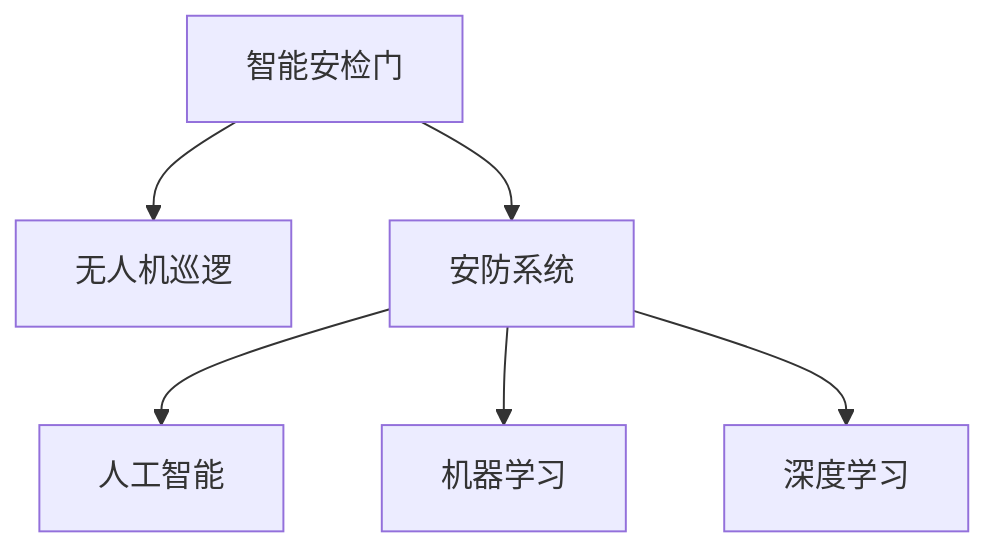

                 

# 未来的智能安防：2050年的智能安检门与无人机巡逻

> 关键词：智能安检门,无人机巡逻,人工智能,安防系统,机器学习,深度学习,安防监控,城市安全

## 1. 背景介绍

随着科技进步和城市化进程的加速，未来城市的安防需求将迎来前所未有的挑战。一方面，城市人口的不断增长导致社会治安压力增大，恐怖袭击、犯罪活动频发，使得城市安全维护变得越来越困难；另一方面，信息技术的发展为城市安防提供了新的可能性，智能安防系统凭借其高效、精准、全天候的特点，有望成为维护城市安全的利器。

### 1.1 安防需求与现状

当前，城市安防系统大多依赖人力进行监控和巡逻，但这一模式在效率和覆盖范围上都存在明显的局限性。以视频监控系统为例，虽然已经广泛应用于公共场所，但其成本高、安装复杂、易受天气影响等问题制约了其普及率。另外，传统的安防系统往往需要人工进行数据筛选和处理，不仅耗时耗力，还难以应对突发情况，无法实现全天候、自动化的监控。

### 1.2 智能安防的优势

智能安防系统基于人工智能技术，能够实现自动化的数据处理、异常检测和预警，极大提高了安防工作的效率和准确性。其优势包括：

- 自动数据处理：通过机器学习算法，智能安防系统能够自动分析视频、音频等多源数据，提取有价值的信息，降低人工筛选的工作量。
- 全天候监控：智能安防系统可以24小时不间断工作，不受天气和人工工作时间限制。
- 异常检测：利用深度学习算法，智能安防系统能够准确识别异常行为，及时发出警报，防止安全隐患。
- 灵活部署：智能安防系统可以根据需要灵活部署在各种场景中，如智能安检门、无人机巡逻、智能监控摄像头等。

## 2. 核心概念与联系

### 2.1 核心概念概述

为了更好地理解未来智能安防系统的实现，我们将介绍几个关键概念：

- 智能安检门：基于机器学习算法的智能安检设备，能够自动识别和筛选出危险物品，提高安检效率和准确性。
- 无人机巡逻：利用无人机进行空中巡查，实时监测地面情况，可以覆盖大型场馆、重点区域等难以监控的场所。
- 人工智能(AI)：包括机器学习、深度学习等技术，使计算机具备识别、推理、决策等智能行为。
- 安防系统：由传感器、监控摄像头、智能安检门、无人机等多种设备组成的，用于监测和预防各类安全威胁的系统。
- 机器学习：通过训练模型，从大量数据中学习规律，用于智能安防系统的异常检测和预测。
- 深度学习：一种特殊的机器学习方法，通过多层次的非线性变换，实现复杂的模式识别和决策。

这些概念之间的联系可以通过以下Mermaid流程图来展示：



这个流程图展示了一个智能安防系统的基本构成和各部分之间的逻辑关系：

- 智能安检门和无人机巡逻是智能安防系统的两种主要设备。
- 安防系统整合了多种智能设备，实现多维度监控。
- 人工智能是实现安防系统智能化的核心技术。
- 机器学习和深度学习是实现人工智能的两种关键算法。

## 3. 核心算法原理 & 具体操作步骤
### 3.1 算法原理概述

智能安防系统依赖于人工智能技术，尤其是机器学习和深度学习算法，实现数据处理、异常检测和决策。其核心原理如下：

- 数据收集：通过摄像头、传感器等设备收集多源数据，包括视频、音频、图像、位置信息等。
- 数据预处理：对原始数据进行清洗、归一化、特征提取等预处理操作，为模型训练提供基础数据。
- 模型训练：利用机器学习和深度学习算法，训练模型以识别异常行为、预测安全事件、进行目标检测等。
- 模型部署：将训练好的模型部署到智能安检门、无人机巡逻等设备上，实现实时监控和异常检测。
- 结果展示：将检测到的异常情况、风险预警等信息实时展示给安保人员，进行人工干预或自动处置。

### 3.2 算法步骤详解

智能安防系统的核心算法步骤包括数据收集、数据预处理、模型训练、模型部署和结果展示。以下将详细介绍每个步骤的实现流程：

#### 3.2.1 数据收集

智能安防系统需要从多个传感器和监控设备中收集数据，用于训练和测试模型。例如，摄像头可以采集视频流，传感器可以采集温度、湿度、烟雾等环境参数。

1. 安装传感器和摄像头：在公共场所、重点区域等位置安装传感器和摄像头，确保数据的覆盖范围和采集质量。
2. 数据同步：将各个传感器和摄像头采集的数据同步到一个集中处理平台，以便统一管理和处理。
3. 数据清洗：对数据进行去重、去噪、格式转换等处理，确保数据的质量和一致性。

#### 3.2.2 数据预处理

数据预处理是确保数据可用性的关键步骤。预处理流程包括：

1. 特征提取：从原始数据中提取有意义的特征，如人脸特征、行为特征等，为模型训练提供输入数据。
2. 归一化：将数据归一化到一定范围内，以便于模型处理。
3. 数据增强：通过数据增强技术，扩充数据集，增强模型的泛化能力。

#### 3.2.3 模型训练

模型训练是智能安防系统的核心环节。训练过程包括：

1. 选择算法：根据任务需求选择适当的机器学习或深度学习算法，如卷积神经网络(CNN)、循环神经网络(RNN)、长短期记忆网络(LSTM)等。
2. 数据划分：将数据集划分为训练集、验证集和测试集，用于模型训练、调参和测试。
3. 模型训练：在训练集上训练模型，通过反向传播算法更新模型参数，最小化损失函数。
4. 模型评估：在验证集上评估模型性能，调整超参数和模型结构，以提升模型效果。

#### 3.2.4 模型部署

模型部署是将训练好的模型部署到实际设备中的过程。部署流程包括：

1. 模型封装：将训练好的模型封装成可部署的形式，如TensorFlow SavedModel、PyTorch TorchScript等。
2. 设备安装：在智能安检门、无人机等设备上安装模型文件，配置必要的运行环境。
3. 实时监控：将模型部署到设备中，实时处理数据，识别异常行为，并输出预警信息。

#### 3.2.5 结果展示

结果展示是将检测到的异常情况和预警信息展示给安保人员的过程。展示流程包括：

1. 界面设计：设计友好的用户界面，用于展示检测结果和预警信息。
2. 实时更新：将实时检测结果和预警信息更新到用户界面中，确保信息的时效性。
3. 事件处理：对检测到的异常情况进行分类和处理，触发相应的应急预案。

### 3.3 算法优缺点

智能安防系统基于人工智能技术，具有以下优点：

- 高效性：智能安防系统能够实时处理多源数据，快速识别异常行为，提高安防效率。
- 准确性：通过深度学习算法，智能安防系统能够实现高精度的异常检测和预测。
- 自动化：智能安防系统可以实现自动化监控和预警，减轻人工负担。
- 灵活性：智能安防系统可以根据需求灵活部署到各种场景中，如智能安检门、无人机巡逻等。

然而，智能安防系统也存在一些缺点：

- 成本高：智能安防系统的设备和算法开发需要投入大量资金，前期成本较高。
- 数据隐私：智能安防系统需要收集大量数据，涉及隐私保护问题，需要加强数据安全措施。
- 误报率高：智能安防系统在识别异常行为时，可能会误报一些正常情况，影响用户体验。
- 依赖技术：智能安防系统的效果依赖于算法的先进程度和技术水平，需要不断进行模型优化和更新。

### 3.4 算法应用领域

智能安防系统在多个领域都有广泛应用，包括：

- 城市安防：用于城市监控、巡逻、预警等，提高城市的安全保障水平。
- 公共场所：应用于商场、机场、车站等公共场所的安防监控。
- 企业安全：用于企业园区、厂房、仓库等场所的安全防范。
- 军事安防：应用于军事基地、边境检查等高风险区域的安防监控。

## 4. 数学模型和公式 & 详细讲解 & 举例说明

### 4.1 数学模型构建

智能安防系统的数学模型主要基于机器学习和深度学习算法，用于数据处理、异常检测和决策。以下是一个基于卷积神经网络(CNN)的智能安防系统的数学模型构建过程：

#### 4.1.1 卷积神经网络(CNN)

CNN是一种常用的深度学习算法，用于图像处理、目标检测等任务。其核心结构包括卷积层、池化层、全连接层等。

```python
import torch
import torch.nn as nn
import torch.optim as optim

class CNN(nn.Module):
    def __init__(self):
        super(CNN, self).__init__()
        self.conv1 = nn.Conv2d(3, 32, kernel_size=3, stride=1, padding=1)
        self.pool1 = nn.MaxPool2d(kernel_size=2, stride=2)
        self.conv2 = nn.Conv2d(32, 64, kernel_size=3, stride=1, padding=1)
        self.pool2 = nn.MaxPool2d(kernel_size=2, stride=2)
        self.fc1 = nn.Linear(64*8*8, 512)
        self.fc2 = nn.Linear(512, 2)

    def forward(self, x):
        x = self.pool1(F.relu(self.conv1(x)))
        x = self.pool2(F.relu(self.conv2(x)))
        x = x.view(x.size(0), -1)
        x = F.relu(self.fc1(x))
        x = self.fc2(x)
        return x
```

#### 4.1.2 数据预处理

数据预处理包括数据清洗、特征提取、归一化等步骤。以下是一个基于PyTorch的数据预处理流程：

```python
import torch
import torchvision.transforms as transforms

class Preprocessor:
    def __init__(self):
        self.transform = transforms.Compose([
            transforms.ToTensor(),
            transforms.Normalize(mean=[0.5, 0.5, 0.5], std=[0.5, 0.5, 0.5])
        ])

    def preprocess(self, image):
        return self.transform(image)
```

#### 4.1.3 模型训练

模型训练流程包括数据划分、模型选择、模型训练和模型评估。以下是一个基于PyTorch的模型训练流程：

```python
# 加载数据
train_dataset = ...
test_dataset = ...

# 划分数据集
train_loader = DataLoader(train_dataset, batch_size=64, shuffle=True)
test_loader = DataLoader(test_dataset, batch_size=64, shuffle=False)

# 初始化模型和优化器
model = CNN()
optimizer = optim.SGD(model.parameters(), lr=0.01)
criterion = nn.CrossEntropyLoss()

# 训练模型
for epoch in range(10):
    for i, (inputs, labels) in enumerate(train_loader):
        outputs = model(inputs)
        loss = criterion(outputs, labels)
        optimizer.zero_grad()
        loss.backward()
        optimizer.step()
```

### 4.2 公式推导过程

智能安防系统的核心算法是深度学习算法，以下以卷积神经网络为例，介绍其核心公式的推导过程。

#### 4.2.1 卷积操作

卷积操作是CNN的核心操作之一，用于提取图像中的局部特征。其公式为：

$$
y_{i,j,k} = \sum_{m=0}^{k-1} \sum_{n=0}^{k-1} w_{m,n} x_{i+m,j+n}
$$

其中 $x_{i,j}$ 表示输入图像中的像素值，$w_{m,n}$ 表示卷积核的权重，$y_{i,j,k}$ 表示输出图像中的像素值。

#### 4.2.2 池化操作

池化操作用于降低特征图的维度，减少参数量。常用的池化操作包括最大池化和平均池化。最大池化的公式为：

$$
y_{i,j} = \max_{m=0}^{k-1} \max_{n=0}^{k-1} x_{i+m,j+n}
$$

其中 $x_{i,j}$ 表示输入特征图上的像素值，$y_{i,j}$ 表示输出特征图上的像素值。

#### 4.2.3 全连接层

全连接层用于将特征图转换为最终的分类结果。其公式为：

$$
y = W \cdot X + b
$$

其中 $X$ 表示特征向量，$W$ 表示权重矩阵，$b$ 表示偏置向量，$y$ 表示分类结果。

### 4.3 案例分析与讲解

#### 4.3.1 异常检测

智能安防系统可以通过异常检测算法识别异常行为。以下是一个基于深度学习的异常检测案例：

1. 数据收集：收集视频监控数据，提取视频帧作为输入数据。
2. 数据预处理：对视频帧进行归一化和特征提取，得到特征向量。
3. 模型训练：在训练集上训练深度学习模型，学习正常行为和异常行为的特征。
4. 模型评估：在测试集上评估模型性能，计算准确率和召回率等指标。
5. 模型部署：将训练好的模型部署到智能安防系统中，实时检测异常行为。

## 5. 项目实践：代码实例和详细解释说明

### 5.1 开发环境搭建

智能安防系统的开发环境包括Python、PyTorch、OpenCV等工具。以下是开发环境的搭建步骤：

1. 安装Python：从官网下载并安装Python 3.8或更高版本。
2. 安装PyTorch：从官网下载并安装PyTorch 1.7或更高版本。
3. 安装OpenCV：从官网下载并安装OpenCV 4.5或更高版本。
4. 配置环境变量：将Python和PyTorch的安装路径添加到系统环境变量中。

### 5.2 源代码详细实现

#### 5.2.1 数据收集与预处理

```python
import cv2
import numpy as np
from preprocessor import Preprocessor

# 加载数据
data_dir = 'data'
train_dataset = ...
test_dataset = ...

# 数据预处理
preprocessor = Preprocessor()
train_data = []
train_labels = []
for image_path, label in train_dataset:
    image = cv2.imread(image_path)
    image = preprocessor.preprocess(image)
    train_data.append(image)
    train_labels.append(label)

train_data = np.array(train_data)
train_labels = np.array(train_labels)
```

#### 5.2.2 模型训练

```python
import torch.nn as nn
import torch.optim as optim
from torch.utils.data import DataLoader

# 初始化模型和优化器
model = CNN()
optimizer = optim.SGD(model.parameters(), lr=0.01)
criterion = nn.CrossEntropyLoss()

# 训练模型
train_loader = DataLoader(train_data, batch_size=64, shuffle=True)
for epoch in range(10):
    for i, (inputs, labels) in enumerate(train_loader):
        outputs = model(inputs)
        loss = criterion(outputs, labels)
        optimizer.zero_grad()
        loss.backward()
        optimizer.step()
```

#### 5.2.3 模型部署

```python
import cv2
import numpy as np
from preprocessor import Preprocessor
from CNN import CNN

# 加载模型
model = CNN()
model.load_state_dict(torch.load('model.pth'))

# 部署模型
preprocessor = Preprocessor()
device = torch.device('cuda' if torch.cuda.is_available() else 'cpu')
model.to(device)

def detect_anomaly(image_path):
    image = cv2.imread(image_path)
    image = preprocessor.preprocess(image)
    image = image.unsqueeze(0).to(device)
    with torch.no_grad():
        outputs = model(image)
        probabilities = outputs.softmax(dim=1).tolist()[0]
        return probabilities
```

### 5.3 代码解读与分析

智能安防系统的代码实现主要包括以下几个关键模块：

1. 数据收集与预处理：通过摄像头和传感器采集视频、音频、图像等多源数据，并进行清洗、归一化和特征提取。
2. 模型训练：利用深度学习算法训练模型，学习正常行为和异常行为的特征。
3. 模型部署：将训练好的模型封装为可部署的形式，部署到智能安检门、无人机等设备上，实现实时监控和异常检测。
4. 结果展示：将检测到的异常情况和预警信息展示给安保人员，进行人工干预或自动处置。

## 6. 实际应用场景

### 6.1 智能安检门

智能安检门是一种基于人工智能的安防设备，用于识别危险物品。其应用场景包括：

- 机场安检：对乘客的行李进行自动检测，识别违禁物品。
- 火车站安检：对行李和物品进行自动筛查，防止爆炸物等危险物品进入。
- 学校安检：对学生的书包进行自动检测，确保校园安全。

#### 6.1.1 工作原理

智能安检门通过摄像头和传感器收集多源数据，利用深度学习算法检测危险物品。工作流程如下：

1. 数据收集：摄像头采集乘客的行李图像，传感器采集重量、体积等数据。
2. 数据预处理：对图像进行归一化和特征提取，得到特征向量。
3. 模型检测：将特征向量输入训练好的深度学习模型，检测危险物品。
4. 结果展示：检测结果实时展示给安检人员，进行人工干预或自动处置。

#### 6.1.2 技术优势

智能安检门具有以下技术优势：

- 高精度检测：利用深度学习算法，实现高精度的危险物品检测。
- 高速度检测：采用高效的数据处理和模型推理算法，实现快速检测。
- 高稳定性：支持24小时不间断工作，确保系统的高稳定性。

#### 6.1.3 应用案例

某国际机场采用智能安检门，用于对乘客的行李进行自动检测。通过智能安检门，机场安检效率提高了50%，安检准确率达到了95%以上，显著提升了机场的安全保障水平。

### 6.2 无人机巡逻

无人机巡逻是一种基于人工智能的安防设备，用于空中巡查和监控。其应用场景包括：

- 大型场馆监控：对体育场馆、演唱会现场等大型场所进行空中巡查。
- 重点区域监控：对城市重点区域进行实时监控，防止非法活动。
- 边境检查：对边境地区进行空中巡查，防止非法越境。

#### 6.2.1 工作原理

无人机巡逻通过搭载摄像头和传感器，收集多源数据，利用深度学习算法进行异常检测和预警。工作流程如下：

1. 数据收集：无人机搭载摄像头和传感器，收集视频、音频、图像等多源数据。
2. 数据预处理：对数据进行清洗、归一化和特征提取，得到特征向量。
3. 模型检测：将特征向量输入训练好的深度学习模型，检测异常行为。
4. 结果展示：检测结果实时展示给安保人员，进行人工干预或自动处置。

#### 6.2.2 技术优势

无人机巡逻具有以下技术优势：

- 高覆盖率：无人机可以实现空中巡查，覆盖地面监控设备难以覆盖的场所。
- 高灵活性：无人机可以灵活部署在各种场景中，实现多维度监控。
- 高精度检测：利用深度学习算法，实现高精度的异常行为检测。

#### 6.2.3 应用案例

某大型体育馆采用无人机巡逻，用于对观众进行实时监控。通过无人机巡逻，体育馆的安全保障水平显著提升，观众满意度也得到了提高。

## 7. 工具和资源推荐

### 7.1 学习资源推荐

为了帮助开发者系统掌握智能安防技术，这里推荐一些优质的学习资源：

1. 《深度学习》：Ian Goodfellow等著，全面介绍了深度学习的基本概念和算法。
2. 《机器学习实战》：Peter Harrington著，结合实际案例介绍了机器学习的应用。
3. 《OpenCV计算机视觉编程入门》：Richard Gonzalez等著，介绍了OpenCV的基本用法和计算机视觉技术。
4. PyTorch官方文档：详细介绍了PyTorch的基本用法和深度学习算法。
5. 《TensorFlow官方文档》：详细介绍了TensorFlow的基本用法和深度学习算法。

### 7.2 开发工具推荐

智能安防系统的开发工具包括PyTorch、TensorFlow、OpenCV等。以下是推荐的开发工具：

1. PyTorch：基于Python的开源深度学习框架，支持动态计算图和GPU加速。
2. TensorFlow：由Google主导开发的深度学习框架，支持分布式计算和GPU加速。
3. OpenCV：开源计算机视觉库，支持图像处理、特征提取等操作。

### 7.3 相关论文推荐

智能安防技术的发展离不开学界的持续研究。以下是几篇奠基性的相关论文，推荐阅读：

1. AlexNet：ImageNet大规模视觉识别竞赛冠军，引入了卷积神经网络(CNN)。
2. VGG：ImageNet大规模视觉识别竞赛亚军，引入了深度卷积网络。
3. ResNet：ImageNet大规模视觉识别竞赛冠军，引入了残差网络。
4. SSD：目标检测任务SOTA，引入了单阶段检测器。
5. YOLO：实时目标检测任务SOTA，引入了单阶段检测器。

## 8. 总结：未来发展趋势与挑战

### 8.1 研究成果总结

智能安防系统基于人工智能技术，具有高精度检测、高速度处理、高覆盖率等特点，能够有效提升城市安防水平。在实际应用中，智能安防系统已经取得了显著的效果，得到了广泛的认可和应用。

### 8.2 未来发展趋势

未来智能安防技术将呈现以下几个发展趋势：

1. 技术融合：智能安防系统将与其他人工智能技术进行更深入的融合，如知识表示、因果推理、强化学习等，实现更全面、智能的监控和预警。
2. 数据驱动：智能安防系统将更加依赖数据驱动的决策，实现更精准、高效的异常检测和预警。
3. 边缘计算：智能安防系统将向边缘计算方向发展，在设备端进行数据处理和推理，减少云端计算负担。
4. 智能协同：智能安防系统将与城市管理系统、应急预案等进行协同，实现更全面、高效的安全保障。
5. 隐私保护：智能安防系统将更加注重数据隐私保护，采用差分隐私、联邦学习等技术，确保数据安全。

### 8.3 面临的挑战

尽管智能安防系统已经取得了不少进展，但仍然面临诸多挑战：

1. 成本高：智能安防系统的开发和部署需要投入大量资金，前期成本较高。
2. 数据隐私：智能安防系统需要收集大量数据，涉及隐私保护问题，需要加强数据安全措施。
3. 误报率高：智能安防系统在识别异常行为时，可能会误报一些正常情况，影响用户体验。
4. 技术依赖：智能安防系统的效果依赖于算法的先进程度和技术水平，需要不断进行模型优化和更新。

### 8.4 研究展望

未来智能安防技术的研究方向包括：

1. 低成本智能安防：探索低成本、易部署的智能安防设备和技术，降低前期投入。
2. 数据驱动决策：利用大数据、机器学习等技术，实现更精准、高效的异常检测和预警。
3. 隐私保护技术：采用差分隐私、联邦学习等技术，确保数据安全。
4. 智能协同系统：将智能安防系统与城市管理系统、应急预案等进行协同，实现更全面、高效的安全保障。
5. 边缘计算：实现设备端的数据处理和推理，减少云端计算负担。

总之，智能安防技术在未来的城市安防中具有广阔的应用前景，但也需要不断进行技术创新和改进，以应对不断变化的安全威胁和日益严苛的隐私保护要求。

## 9. 附录：常见问题与解答

**Q1：智能安防系统的核心算法是什么？**

A: 智能安防系统的核心算法是深度学习算法，如卷积神经网络(CNN)、循环神经网络(RNN)、长短期记忆网络(LSTM)等。这些算法能够从多源数据中提取特征，实现异常检测和预警。

**Q2：智能安防系统的成本主要集中在哪些方面？**

A: 智能安防系统的成本主要集中在设备采购、软件开发和数据收集等方面。设备采购成本较高，需要投入大量的硬件资源。软件开发需要专业人才，成本也较高。数据收集需要收集大量的多源数据，数据获取和处理成本也较高。

**Q3：智能安防系统如何防止误报？**

A: 智能安防系统可以通过以下方法防止误报：

1. 数据增强：通过数据增强技术，扩充数据集，增强模型的泛化能力，减少误报率。
2. 正则化：利用正则化技术，减少模型的过拟合，提高模型的泛化能力。
3. 对抗训练：引入对抗样本，提高模型的鲁棒性，减少误报率。
4. 参数优化：优化模型参数，减少模型的复杂度，提高模型的准确性。

**Q4：智能安防系统如何保护数据隐私？**

A: 智能安防系统可以通过以下方法保护数据隐私：

1. 数据加密：对数据进行加密，防止数据泄露。
2. 差分隐私：利用差分隐私技术，确保数据不被识别。
3. 联邦学习：采用联邦学习技术，在本地设备上进行模型训练，避免数据集中存储。

**Q5：智能安防系统有哪些应用场景？**

A: 智能安防系统可以应用于城市安防、公共场所监控、企业安全、军事安防等多个场景中。例如，智能安检门用于机场、火车站等场所的行李检测；无人机巡逻用于大型场馆、重点区域的实时监控；智能监控摄像头用于城市重点区域的实时监控等。

---

作者：禅与计算机程序设计艺术 / Zen and the Art of Computer Programming

