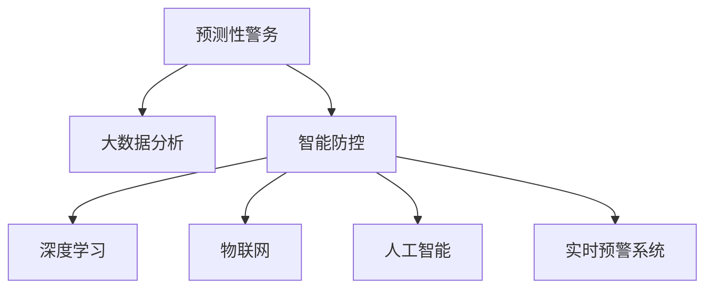

                 

# 未来的智能安防：2050年的预测性警务与智能防控

## 1. 背景介绍

### 1.1 问题由来
智能安防作为城市治理和社会管理的重要组成部分，随着社会经济的快速发展和技术进步，逐渐成为智慧城市建设的重要方向。预测性警务与智能防控，作为新一代智能安防的核心技术，通过大数据分析、人工智能、物联网等手段，实现对社会治安的智能化预测与实时监控，旨在提升公共安全水平，打造更加安全、便捷、高效的城市环境。

### 1.2 问题核心关键点
预测性警务与智能防控技术的发展，其核心在于构建强大的智能监控与分析平台，通过物联网设备采集大量数据，结合深度学习和大数据分析技术，对潜在的安全威胁进行预测和预警。此技术覆盖了从城市监控、人脸识别、行为分析、异常检测到实时预警和应急处置的全过程，对社会治安管理的智能化水平有极大提升。

然而，目前该技术在实际应用中仍面临诸多挑战，如数据隐私保护、算法透明性、模型公平性等问题。因此，如何构建一个高效、安全、透明的智能安防系统，成为当今技术研究的重要课题。

### 1.3 问题研究意义
构建未来的智能安防系统，对于保障社会安全、提升城市管理水平、优化公共资源配置等方面具有重要意义：

1. 提高公共安全水平：通过实时监控和预测预警，有效应对各类安全威胁，保障人民群众生命财产安全。
2. 优化城市管理：智能安防系统通过数据驱动决策，提升城市治理的效率和精准度，促进资源优化配置。
3. 推动产业升级：智能安防技术的广泛应用，将带动安防、物联网、人工智能等相关产业的发展，提升整体技术水平。
4. 促进社会公平：智能安防通过数据共享与分析，提升社会治理的透明性和公正性，推动社会公平正义。
5. 增强国际竞争力：智能安防技术作为智慧城市建设的重要组成部分，将为我国智慧城市建设树立新标杆，提升国际竞争力。

## 2. 核心概念与联系

### 2.1 核心概念概述

为了更好地理解2050年预测性警务与智能防控的核心技术，本节将介绍几个密切相关的核心概念：

- 预测性警务(Predictive Policing)：通过数据分析和机器学习技术，对犯罪行为进行预测，提前部署警力，预防犯罪发生。
- 智能防控(Intelligent Security)：结合物联网设备、人工智能技术，实时监控和分析城市中的各类异常行为，及时发现和处置潜在的安全威胁。
- 大数据分析(Big Data Analytics)：通过处理和分析海量数据，提取有价值的信息和模式，为预测和决策提供支持。
- 深度学习(Deep Learning)：一种基于神经网络的机器学习技术，通过训练大规模数据集，实现对复杂模式和关系的深度学习。
- 物联网(IoT)：通过各种传感器和设备，实时收集城市数据，实现智能监控和分析。
- 人工智能(AI)：通过模拟人类智能行为，实现自主决策和复杂任务的自动化处理。
- 实时预警系统(Real-Time Alerting)：利用先进算法和高速网络，实现对紧急事件的快速响应和预警。

这些核心概念之间的逻辑关系可以通过以下Mermaid流程图来展示：



这个流程图展示了大规模预测性警务与智能防控的核心概念及其之间的关系：

1. 预测性警务通过大数据分析来挖掘犯罪模式和趋势。
2. 智能防控结合物联网技术实时监控异常行为，再通过人工智能进行分析决策。
3. 深度学习在此过程中用于模型训练和复杂模式学习。
4. 实时预警系统保证对紧急事件的快速响应。

## 3. 核心算法原理 & 具体操作步骤
### 3.1 算法原理概述

预测性警务与智能防控系统，其核心算法原理主要包括以下几个方面：

1. 数据采集与预处理：通过物联网设备收集各类城市数据，如视频监控、传感器数据等，并进行清洗和预处理，保证数据的质量和完整性。
2. 数据分析与特征提取：利用大数据分析技术，从采集到的数据中提取有价值的特征，如行为模式、异常行为等。
3. 模型训练与优化：通过深度学习模型对数据进行分析，并不断优化模型以提升准确率和泛化能力。
4. 实时监控与预警：将训练好的模型应用于实时监控系统，实现对异常行为的即时检测和预警。
5. 应急响应与处置：当预警系统发出报警时，结合地理信息系统(GIS)和警力调度系统，快速部署警力进行应急响应和处置。

### 3.2 算法步骤详解

预测性警务与智能防控系统的算法步骤主要包括以下几个关键步骤：

**Step 1: 数据采集与预处理**
- 安装和部署各类传感器和物联网设备，如视频监控、红外传感器、温度传感器等。
- 数据采集后进行清洗，包括去除噪声、填充缺失值、标准化处理等。

**Step 2: 特征提取与分析**
- 使用大数据分析技术，如聚类、降维等，从原始数据中提取有价值的特征。
- 对特征数据进行可视化，通过热力图、散点图等方式分析数据分布和模式。

**Step 3: 模型训练与优化**
- 选择合适的深度学习模型，如卷积神经网络(CNN)、循环神经网络(RNN)、长短期记忆网络(LSTM)等。
- 使用历史数据训练模型，调整超参数，优化模型性能。
- 使用交叉验证、正则化等技术，防止模型过拟合。

**Step 4: 实时监控与预警**
- 将训练好的模型部署到实时监控系统中，进行实时数据流处理。
- 使用算法检测异常行为，如人脸识别、行为轨迹分析等。
- 当检测到异常行为时，发出报警信息，并提供预警报告。

**Step 5: 应急响应与处置**
- 结合GIS和警力调度系统，快速定位异常事件，并调度警力进行处置。
- 记录和分析应急事件数据，为后续模型优化提供支持。

### 3.3 算法优缺点

预测性警务与智能防控系统的优点包括：
1. 预测准确：利用大数据分析和深度学习技术，能够准确预测潜在安全威胁，提前采取措施。
2. 实时响应：通过实时监控和预警系统，能够快速响应紧急事件，提高应急处置效率。
3. 资源优化：通过智能调度系统，优化警力资源配置，减少不必要的巡逻和响应。
4. 数据驱动：以数据为核心，实现数据驱动的智能决策，提升社会治理的科学性和透明度。
5. 技术前沿：结合最新的人工智能技术，实现复杂的模式识别和行为分析。

同时，该系统也存在一定的局限性：
1. 数据隐私：大规模数据采集可能涉及个人隐私问题，需要严格的隐私保护措施。
2. 算法透明：深度学习模型通常被视为"黑盒"，其决策过程难以解释，需要增加算法透明性和可解释性。
3. 模型公平：模型可能存在偏见，需要确保公平性和非歧视性。
4. 硬件要求：实时监控和分析需要高性能硬件支持，硬件成本较高。
5. 数据质量：数据采集和处理质量直接影响模型性能，需要保证数据准确和完整。

尽管存在这些局限性，但整体而言，预测性警务与智能防控系统在提升公共安全和社会治理水平方面具有巨大潜力。

### 3.4 算法应用领域

预测性警务与智能防控技术在多个领域得到了广泛应用，如：

1. 城市安全管理：通过实时监控和预测预警，提升城市安全管理水平。
2. 社会治理：实现对各类犯罪行为和异常事件的实时监控和处置。
3. 灾害预警：结合GIS和气象数据，实现自然灾害的预测和预警。
4. 公共卫生：通过监控人流和公共场所环境，预防传染病扩散。
5. 交通管理：利用视频监控和车辆传感器，优化交通流量和减少交通拥堵。

除了上述这些应用外，预测性警务与智能防控技术还被创新性地应用于智慧楼宇、智慧社区、智慧园区等场景，提升社会治理的整体水平。

## 4. 数学模型和公式 & 详细讲解 & 举例说明

### 4.1 数学模型构建

预测性警务与智能防控系统，其数学模型构建主要包括以下几个方面：

- 数据采集与预处理模型：通过时间序列分析和异常检测技术，实现对传感器数据的清洗和处理。
- 特征提取与分析模型：利用PCA、LDA等降维技术，提取数据中的主要特征。
- 深度学习模型：基于CNN、LSTM等神经网络结构，训练预测模型，实现对异常行为的预测。
- 实时监控与预警模型：结合警报规则和地理信息，实现实时预警和应急响应。

### 4.2 公式推导过程

以下我们将以异常检测为例，介绍预测性警务与智能防控系统中的一些核心数学公式。

假设我们有一个时间序列数据 $X_t$，其中 $t=1,2,\ldots,T$，表示从 $t$ 时刻开始连续 $T$ 个时间点的数据值。我们希望通过检测该序列中的异常点，实现实时监控。常见的异常检测方法包括统计方法和机器学习方法，这里以统计方法为例。

**统计方法：基于标准差和移动平均的异常检测**

1. 计算数据均值 $\mu$ 和标准差 $\sigma$：
$$
\mu = \frac{1}{T}\sum_{t=1}^T X_t
$$
$$
\sigma = \sqrt{\frac{1}{T}\sum_{t=1}^T (X_t - \mu)^2}
$$

2. 设定异常阈值 $\theta$：通常将数据均值加减一个标准差作为正常范围，超出此范围的数据点即为异常点。
$$
\theta = \mu \pm k\sigma
$$

3. 检测异常点：对于每个数据点 $X_t$，若 $|X_t - \mu| > k\sigma$，则认为该点为异常点。

**机器学习方法：基于支持向量机(SVM)的异常检测**

1. 构建训练数据集：将正常数据和异常数据混合在一起，作为训练数据集。
$$
\mathcal{D} = \{(X_i, y_i)\}_{i=1}^N, y_i \in \{0, 1\}, y_i=0 \text{表示正常数据}, y_i=1 \text{表示异常数据}
$$

2. 训练支持向量机模型：
$$
\min_{w, b, \xi} \frac{1}{2} \|w\|^2 + C\sum_{i=1}^N \xi_i
$$
$$
y_i(w^T\phi(X_i) + b) \geq 1 - \xi_i
$$

3. 预测异常点：对于新数据 $X_t$，若 $w^T\phi(X_t) + b \geq 1$，则认为该点为异常点。

这里 $\phi$ 是特征映射函数，$w$ 是权重向量，$b$ 是偏置项，$\xi_i$ 是松弛变量，$C$ 是正则化系数。

### 4.3 案例分析与讲解

以下是一个基于Python的异常检测案例，使用sklearn库中的Isolation Forest算法实现。

```python
from sklearn.ensemble import IsolationForest
import numpy as np

# 构造模拟数据
X = np.random.normal(0, 1, size=(1000, 2))

# 构造Isolation Forest模型
model = IsolationForest(n_estimators=100, contamination=0.05)

# 训练模型
model.fit(X)

# 预测异常点
outliers = model.predict(X)

# 可视化结果
import matplotlib.pyplot as plt
plt.scatter(X[:, 0], X[:, 1])
plt.plot(X[outliers == -1, 0], X[outliers == -1, 1], 'ro', markersize=10)
plt.show()
```

通过该代码，可以看到Isolation Forest算法能够有效地检测到异常点，并进行可视化展示。在实际应用中，我们可以将此算法应用于各类监控数据中，实现异常检测和实时预警。

## 5. 项目实践：代码实例和详细解释说明

### 5.1 开发环境搭建

在进行预测性警务与智能防控系统的开发时，我们需要准备相应的开发环境。以下是Python开发环境搭建的步骤：

1. 安装Python：根据系统平台下载并安装Python，建议选择3.8及以上版本。
2. 安装相关依赖：安装numpy、pandas、scikit-learn、matplotlib、tqdm、jupyter notebook等常用库。
3. 配置虚拟环境：使用conda或virtualenv创建Python虚拟环境，避免环境冲突。
4. 安装GPU驱动：如果需要进行深度学习模型训练，需要安装GPU驱动。

完成上述步骤后，即可在虚拟环境中开始开发预测性警务与智能防控系统的代码实现。

### 5.2 源代码详细实现

这里我们以视频监控异常检测为例，给出使用Python和OpenCV库实现的视频监控异常检测代码。

```python
import cv2
import numpy as np
import pandas as pd

# 构造视频流
cap = cv2.VideoCapture('video.mp4')

# 定义帧差阈值
frame_diff_thresh = 20

# 初始化背景模型
bgd_model = cv2.createBackgroundSubtractorMOG2()

# 读取视频流中的每一帧
while cap.isOpened():
    ret, frame = cap.read()
    if not ret:
        break

    # 将帧转换为灰度图像
    gray = cv2.cvtColor(frame, cv2.COLOR_BGR2GRAY)

    # 更新背景模型
    fg_mask = bgd_model.apply(frame)
    fg_mask = cv2.dilate(fg_mask, None)

    # 计算帧差
    prev_frame = np.zeros_like(frame)
    frame_diff = np.abs(frame - prev_frame)

    # 检测异常点
    binary_diff = frame_diff > frame_diff_thresh
    result = fg_mask & binary_diff

    # 显示结果
    cv2.imshow('Result', frame)
    if cv2.waitKey(1) & 0xFF == ord('q'):
        break

# 关闭窗口并释放资源
cv2.destroyAllWindows()
cap.release()
```

通过上述代码，我们可以实现基于帧差和背景模型的视频监控异常检测。在实际应用中，我们需要根据具体需求对代码进行调整，如选择合适的帧差阈值、调整背景模型参数等，以提高检测的准确率和鲁棒性。

### 5.3 代码解读与分析

让我们再详细解读一下关键代码的实现细节：

**cap = cv2.VideoCapture('video.mp4')**
- 使用OpenCV库打开视频文件，读取其中的每一帧。

**bgd_model = cv2.createBackgroundSubtractorMOG2()**
- 创建背景模型，用于实时更新背景信息。

**fg_mask = bgd_model.apply(frame)**
- 将当前帧应用背景模型，得到前景掩码，标记出前景区域。

**frame_diff = np.abs(frame - prev_frame)**
- 计算当前帧与前一帧的像素差值，得到帧差矩阵。

**binary_diff = frame_diff > frame_diff_thresh**
- 将帧差矩阵与设定的阈值进行比较，得到二值化结果。

**result = fg_mask & binary_diff**
- 将前景掩码和二值化结果进行按位与操作，得到最终的异常检测结果。

通过这些步骤，我们实现了基于背景模型和帧差的异常检测算法。在实际应用中，还需要进一步优化算法参数和处理逻辑，以适应不同的视频监控场景。

## 6. 实际应用场景

### 6.1 智能社区安全监控

智能社区作为城市治理的重要组成部分，结合预测性警务与智能防控技术，可以实现更高效、智能的安全监控。通过部署智能摄像头和传感器，实时监控社区环境，实现人脸识别、行为分析等复杂任务，提升社区安全性。

在技术实现上，可以结合人脸识别技术，对社区中的行人进行身份识别，发现异常行为时自动报警。结合视频监控，对异常行为进行实时跟踪和记录，实现紧急情况下的快速响应和处置。

### 6.2 智慧园区安全管理

智慧园区通过预测性警务与智能防控技术，实现对园区内的全方位监控和实时预警。结合视频监控、传感器数据和物联网设备，对园区内的各类异常行为进行实时检测和预警。

在实际应用中，可以结合视频监控和行为分析技术，实现对园区内人员的实时跟踪和异常检测。结合地理信息系统和警力调度系统，快速响应和处置各类安全事件。

### 6.3 智慧楼宇安防系统

智慧楼宇通过预测性警务与智能防控技术，实现对楼宇内人员和物品的全面监控和预警。结合视频监控、红外传感器、门禁系统等设备，实时监控楼宇内的人员和物品流动情况。

在技术实现上，可以结合视频监控和行为分析技术，实现对楼宇内人员的实时跟踪和异常检测。结合门禁系统和警力调度系统，实现对异常行为的快速响应和处置。

### 6.4 未来应用展望

随着预测性警务与智能防控技术的发展，未来的应用场景将更加广泛，以下是几个展望方向：

1. 自动驾驶：通过预测性警务与智能防控技术，实现对交通流的实时监控和预警，提高自动驾驶的安全性和可靠性。
2. 应急救援：结合GIS和物联网设备，实现对自然灾害和突发事件的实时预警和应急响应。
3. 工业安全：通过预测性警务与智能防控技术，实现对工业园区和生产车间的实时监控和预警，提高安全生产水平。
4. 公共卫生：通过实时监控和预警系统，实现对公共卫生事件的快速响应和处置。

以上展望方向，将进一步推动预测性警务与智能防控技术的深度应用，提升社会治理的智能化水平。

## 7. 工具和资源推荐

### 7.1 学习资源推荐

为了帮助开发者系统掌握预测性警务与智能防控技术的理论基础和实践技巧，这里推荐一些优质的学习资源：

1. 《深度学习实战：Python和TensorFlow深度学习应用》：介绍深度学习的基本概念和常用算法，适合初学者入门。
2. 《Python数据科学手册》：涵盖数据科学和机器学习的基本技能，适合数据工程师和算法开发者。
3. 《机器学习实战》：提供丰富的机器学习算法案例，适合实践操作。
4. 《Kaggle机器学习竞赛指南》：通过参与Kaggle竞赛，提升实战能力和问题解决能力。
5. 《TensorFlow官方文档》：提供全面的TensorFlow教程和API文档，适合深度学习开发者。
6. 《预测性警务与智能防控技术白皮书》：详细解读预测性警务与智能防控技术的原理和应用场景。

通过对这些资源的学习实践，相信你一定能够快速掌握预测性警务与智能防控技术的精髓，并用于解决实际的智能安防问题。

### 7.2 开发工具推荐

高效的开发离不开优秀的工具支持。以下是几款用于预测性警务与智能防控系统开发的常用工具：

1. Python：基于Python的开源编程语言，生态丰富，适用于各类算法和数据处理任务。
2. TensorFlow：由Google主导开发的开源深度学习框架，支持分布式计算和模型优化，适合大规模模型训练。
3. PyTorch：基于Python的深度学习框架，灵活易用，适合快速原型开发。
4. Jupyter Notebook：交互式编程环境，方便代码调试和可视化展示。
5. Kaggle：数据科学竞赛平台，提供大量数据集和算法案例，适合学习实践。
6. OpenCV：开源计算机视觉库，提供丰富的图像处理和分析工具。

合理利用这些工具，可以显著提升预测性警务与智能防控系统的开发效率，加快创新迭代的步伐。

### 7.3 相关论文推荐

预测性警务与智能防控技术的发展源于学界的持续研究。以下是几篇奠基性的相关论文，推荐阅读：

1. Anomaly Detection in Network Traffic: A Survey ：介绍网络流量异常检测的各类算法和技术。
2. Deep Learning for Video Anomaly Detection ：利用深度学习技术，实现视频监控异常检测的最新进展。
3. Predictive Policing: A Systematic Review and Comparative Analysis ：通过文献综述，对比各类预测性警务算法和模型的性能。
4. Smart Security and Surveillance in the Age of IoT ：探讨物联网技术在智能安防中的应用前景。
5. AI for Public Safety: A Survey ：通过综述，介绍人工智能在公共安全领域的应用和挑战。

这些论文代表了大规模预测性警务与智能防控技术的发展脉络。通过学习这些前沿成果，可以帮助研究者把握学科前进方向，激发更多的创新灵感。

## 8. 总结：未来发展趋势与挑战

### 8.1 研究成果总结

本文对预测性警务与智能防控技术进行了全面系统的介绍。首先阐述了该技术的研究背景和意义，明确了其在智能安防中的应用前景和重要价值。其次，从原理到实践，详细讲解了预测性警务与智能防控的数学模型和核心算法步骤，给出了实际的代码实例和详细解释。同时，本文还广泛探讨了该技术在智能社区、智慧园区、智慧楼宇等实际应用场景中的具体应用，展示了其广阔的落地空间。最后，本文精选了预测性警务与智能防控技术的各类学习资源和工具推荐，力求为开发者提供全方位的技术指引。

通过本文的系统梳理，可以看到，预测性警务与智能防控技术作为新一代智能安防的核心范式，已经具备较高的成熟度，并在多个行业得到了广泛应用。未来，伴随技术的持续演进，该技术将在智能化、高效化、安全化方面取得更大的突破。

### 8.2 未来发展趋势

展望未来，预测性警务与智能防控技术将呈现以下几个发展趋势：

1. 深度学习模型的优化：随着深度学习技术的发展，未来的预测性警务与智能防控系统将采用更加高效、鲁棒的模型，提升算法的性能和泛化能力。
2. 大数据融合：结合更多类型的数据，如天气数据、地理信息数据等，提升系统决策的全面性和准确性。
3. 实时通信技术：引入5G等先进通信技术，提升数据传输速度和实时性，实现对紧急事件的快速响应。
4. 多模态融合：结合视觉、听觉、文本等多种数据类型，实现多模态信息融合，提升系统综合分析和决策能力。
5. 模型公平性：通过算法透明性和公平性优化，确保模型在各类人群中公平公正，避免偏见和歧视。
6. 跨领域应用：扩展到智慧农业、智慧交通、智慧医疗等领域，提升各个行业的智能化水平。

以上趋势凸显了预测性警务与智能防控技术的广阔前景。这些方向的探索发展，将进一步提升预测性警务与智能防控系统的性能和应用范围，为社会治理带来更大的智能化变革。

### 8.3 面临的挑战

尽管预测性警务与智能防控技术已经取得了瞩目成就，但在迈向更加智能化、普适化应用的过程中，它仍面临诸多挑战：

1. 数据隐私：大规模数据采集可能涉及个人隐私问题，需要严格的隐私保护措施。
2. 算法透明：深度学习模型通常被视为"黑盒"，其决策过程难以解释，需要增加算法透明性和可解释性。
3. 模型公平：模型可能存在偏见，需要确保公平性和非歧视性。
4. 硬件要求：实时监控和分析需要高性能硬件支持，硬件成本较高。
5. 数据质量：数据采集和处理质量直接影响模型性能，需要保证数据准确和完整。

尽管存在这些挑战，但整体而言，预测性警务与智能防控系统在提升公共安全和社会治理水平方面具有巨大潜力。未来需要积极应对并寻求突破，才能实现技术的可持续发展。

### 8.4 研究展望

面对预测性警务与智能防控技术所面临的种种挑战，未来的研究需要在以下几个方面寻求新的突破：

1. 探索无监督和半监督学习范式：摆脱对大规模标注数据的依赖，利用自监督学习、主动学习等无监督和半监督范式，最大限度利用非结构化数据，实现更加灵活高效的预测性警务与智能防控。
2. 研究参数高效和计算高效的预测性算法：开发更加参数高效的预测性算法，在固定大部分预训练参数的同时，只更新极少量的任务相关参数。同时优化算法的计算图，减少前向传播和反向传播的资源消耗，实现更加轻量级、实时性的部署。
3. 融合因果和对比学习范式：通过引入因果推断和对比学习思想，增强预测性警务与智能防控系统建立稳定因果关系的能力，学习更加普适、鲁棒的语言表征，从而提升系统泛化性和抗干扰能力。
4. 引入更多先验知识：将符号化的先验知识，如知识图谱、逻辑规则等，与神经网络模型进行巧妙融合，引导预测性警务与智能防控过程学习更准确、合理的语言模型。同时加强不同模态数据的整合，实现视觉、语音等多模态信息与文本信息的协同建模。
5. 结合因果分析和博弈论工具：将因果分析方法引入预测性警务与智能防控模型，识别出模型决策的关键特征，增强输出解释的因果性和逻辑性。借助博弈论工具刻画人机交互过程，主动探索并规避模型的脆弱点，提高系统稳定性。
6. 纳入伦理道德约束：在模型训练目标中引入伦理导向的评估指标，过滤和惩罚有偏见、有害的输出倾向。同时加强人工干预和审核，建立模型行为的监管机制，确保输出符合人类价值观和伦理道德。

这些研究方向的探索，将引领预测性警务与智能防控技术迈向更高的台阶，为构建安全、可靠、可解释、可控的智能系统铺平道路。面向未来，预测性警务与智能防控技术还需要与其他人工智能技术进行更深入的融合，如知识表示、因果推理、强化学习等，多路径协同发力，共同推动自然语言理解和智能交互系统的进步。只有勇于创新、敢于突破，才能不断拓展预测性警务与智能防控技术的边界，让智能技术更好地造福人类社会。

## 9. 附录：常见问题与解答

**Q1：预测性警务与智能防控技术是否适用于所有安防场景？**

A: 预测性警务与智能防控技术在大多数安防场景上都能取得不错的效果，特别是对于数据量较大的场景。但对于一些特殊场景，如地下车库、隧道等，由于数据采集和传输困难，可能无法实现实时监控和预警。因此，需要根据具体场景和需求进行合理设计和选择。

**Q2：预测性警务与智能防控技术是否需要大量标注数据？**

A: 预测性警务与智能防控技术通常需要一定量的标注数据，用于训练和优化模型。但对于数据稀缺的场景，可以通过半监督学习、迁移学习等技术，利用未标注数据进行训练，提升模型的泛化能力。未来，随着技术的发展，可能会逐步减少对标注数据的依赖。

**Q3：预测性警务与智能防控技术如何保护数据隐私？**

A: 保护数据隐私是预测性警务与智能防控技术的重要挑战之一。可以通过数据匿名化、差分隐私、加密存储等技术手段，保护个人隐私和数据安全。同时，采用联邦学习等技术，将模型训练分散在各个节点上进行，不共享原始数据，提升数据隐私保护水平。

**Q4：预测性警务与智能防控技术的部署成本是否较高？**

A: 预测性警务与智能防控技术的部署成本较高，主要集中在硬件设备和数据处理方面。需要高性能的服务器、存储设备和通信网络，同时需要对数据进行实时处理和分析。但随着技术的进步和成本的下降，未来预测性警务与智能防控系统的部署将更加便捷和经济。

**Q5：预测性警务与智能防控技术的应用前景如何？**

A: 预测性警务与智能防控技术作为智能安防的重要方向，未来将有更广阔的应用前景。通过提升监控和预警能力，提升社会治理的智能化水平，保障公共安全，优化资源配置，提升社会公平性，促进产业升级。在智慧城市建设、智慧园区、智慧楼宇等多个领域，预测性警务与智能防控技术将发挥越来越重要的作用。

---

作者：禅与计算机程序设计艺术 / Zen and the Art of Computer Programming

