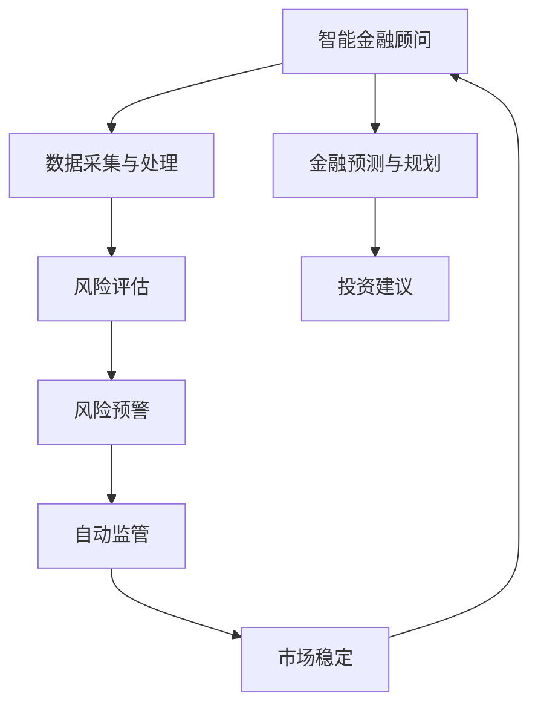
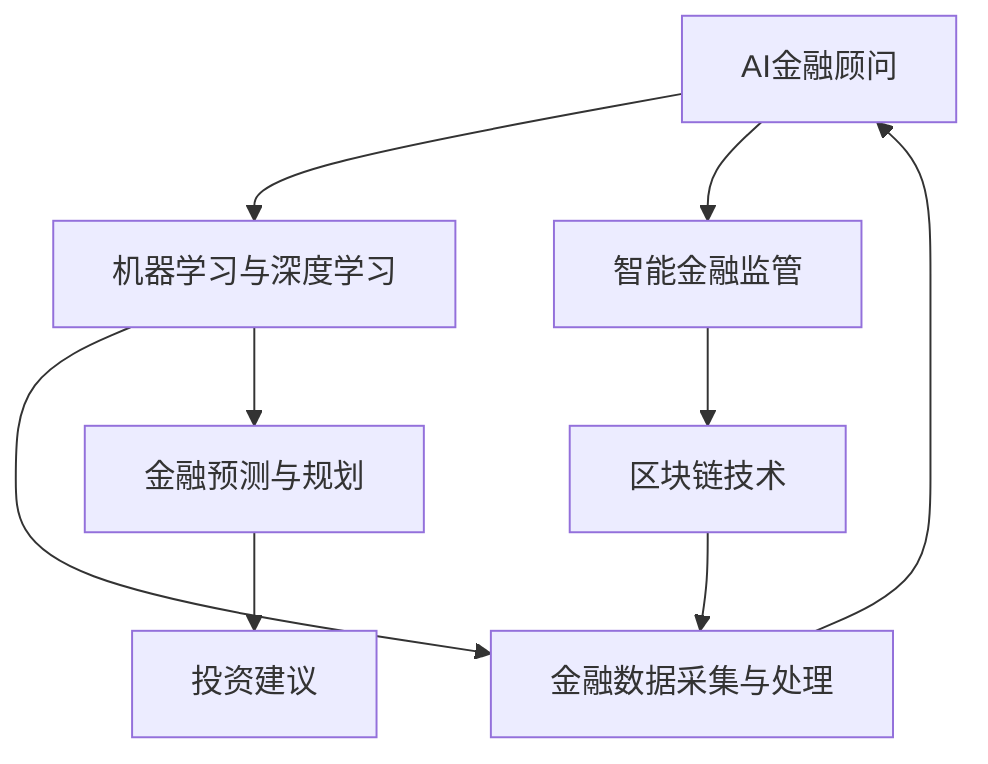

                 

# 未来的智能金融：2050年的AI金融顾问与智能金融监管

> 关键词：人工智能,智能金融顾问,金融监管,自动化交易,风险管理,机器学习,区块链,金融科技

## 1. 背景介绍

### 1.1 问题由来
金融行业一直以来都是科技创新的前沿阵地。随着科技的不断进步，金融行业正经历着从传统业务模式向智能化、数字化转型的深刻变革。智能化和数字化已经成为提升金融服务效率、优化客户体验、防控风险的重要推动力。

在金融科技领域，AI技术的应用已经逐渐从金融业务的后端逐渐渗透到前端，带来智能投顾、智能风控、智能监管等全新形态的金融服务。未来，AI将成为金融行业不可或缺的一部分，重塑整个行业的生态和业务模式。

### 1.2 问题核心关键点
智能金融顾问和智能金融监管作为未来金融科技的重要发展方向，其核心在于如何结合AI技术，实现金融业务的智能化和自动化。智能金融顾问通过AI技术提供个性化的理财规划和投资建议，帮助客户实现资产增值。智能金融监管通过AI技术实现风险的自动化识别和防范，确保金融市场的稳定运行。

智能金融顾问和智能金融监管的实施离不开高质量的金融数据、先进的AI算法和强大的计算资源。它们之间的联系可以通过以下Mermaid流程图来展示：



这个流程图展示了智能金融顾问和智能金融监管的基本流程和相互关系：

1. 智能金融顾问从数据采集与处理开始，结合金融预测与规划，为客户提供个性化的投资建议。
2. 智能金融监管则在风险评估的基础上，进行风险预警，并辅助进行自动监管。
3. 市场稳定则通过风险预警和自动监管来实现，并不断反馈给智能金融顾问，优化其服务质量。

## 2. 核心概念与联系

### 2.1 核心概念概述

为更好地理解AI在金融领域的应用，本节将介绍几个密切相关的核心概念：

- **AI金融顾问**：基于AI技术的金融咨询服务，通过大数据分析、机器学习等技术手段，提供个性化的理财规划和投资建议。
- **智能金融监管**：利用AI技术对金融市场进行实时监控和风险评估，及时发现并防范风险，保障金融市场的稳定运行。
- **机器学习与深度学习**：用于处理和分析金融数据的AI算法，能够从海量数据中提取有价值的特征，进行预测和分类。
- **区块链技术**：一种分布式账本技术，用于记录交易历史，保证数据的透明和不可篡改，应用于跨境支付、供应链金融等领域。
- **金融科技(FinTech)**：金融科技是金融业与信息技术的深度融合，旨在通过科技手段创新金融服务，提高效率，降低成本，提升客户体验。

这些核心概念之间的逻辑关系可以通过以下Mermaid流程图来展示：



这个流程图展示了AI金融顾问和智能金融监管之间的关系及其与机器学习、区块链等技术的关系：

1. 机器学习与深度学习作为AI金融顾问和智能金融监管的技术支撑，提供了强大的数据分析和处理能力。
2. 区块链技术则提供了数据安全和透明性保障，用于记录和验证交易信息。
3. 金融数据采集与处理是AI金融顾问和智能金融监管的基础，通过数据的有效采集和处理，才能进行后续的分析和决策。
4. 金融预测与规划、投资建议、风险评估和预警都是AI金融顾问的具体实现，而自动监管则是智能金融监管的核心功能。

## 3. 核心算法原理 & 具体操作步骤
### 3.1 算法原理概述

AI金融顾问和智能金融监管的核心算法原理主要基于机器学习和深度学习，结合金融数据和业务逻辑，实现金融服务的智能化和自动化。以下是核心算法原理的概述：

- **机器学习与深度学习**：通过训练数据集，构建金融预测模型，用于对市场趋势、股票价格等进行预测。
- **强化学习**：用于优化投资组合，通过模拟市场环境，不断调整投资策略，以获得最优收益。
- **自然语言处理(NLP)**：用于理解金融公告、新闻等文本信息，从中提取有价值的信息，辅助风险预警和投资建议。
- **图神经网络(Graph Neural Network)**：用于分析复杂金融网络关系，进行风险管理和金融监管。

### 3.2 算法步骤详解

以下是基于机器学习的AI金融顾问和智能金融监管的具体操作步骤：

**Step 1: 数据采集与处理**

- 收集市场交易数据、企业财务报表、新闻公告、社交媒体数据等多种金融数据。
- 对收集到的数据进行清洗、去重、归一化等预处理，确保数据的质量和一致性。

**Step 2: 特征工程与模型训练**

- 设计合适的特征工程流程，提取有价值的数据特征。
- 选择合适的机器学习或深度学习算法，构建预测模型。
- 使用历史数据对模型进行训练，调整超参数，优化模型性能。

**Step 3: 金融预测与规划**

- 根据训练好的模型，对未来的市场走势、股票价格等进行预测。
- 结合客户的风险偏好和财务状况，提供个性化的投资建议。

**Step 4: 风险评估与预警**

- 使用训练好的模型，对客户的投资组合进行风险评估，计算VaR（Value at Risk）等风险指标。
- 根据评估结果，进行风险预警，及时调整投资策略。

**Step 5: 自动监管与市场稳定**

- 使用训练好的模型，对金融市场进行实时监控，发现异常交易、欺诈行为等。
- 根据监管策略，进行自动干预，确保市场的稳定运行。

### 3.3 算法优缺点

AI金融顾问和智能金融监管具有以下优点：

- **高效性**：通过自动化和智能化算法，显著提高金融服务的效率，降低人工干预的成本。
- **精准性**：利用机器学习和深度学习技术，可以从海量数据中提取精准的信息，进行预测和决策。
- **个性化**：通过个性化的投资建议和风险评估，满足不同客户的需求。
- **风险管理**：实时监控金融市场，及时发现和防范风险，保障金融市场的稳定。

同时，这些方法也存在一定的局限性：

- **数据依赖性**：模型的性能高度依赖于数据的质量和数量，获取高质量金融数据需要较高的成本。
- **模型复杂性**：复杂的模型需要较高的计算资源和计算能力，对硬件设备要求较高。
- **监管挑战**：自动化监管可能引发新的法律和道德问题，需要监管机构的持续监督和指导。

### 3.4 算法应用领域

AI金融顾问和智能金融监管的应用领域非常广泛，涵盖了金融业务的各个环节，包括但不限于：

- **智能投顾**：为个人和企业提供个性化的投资建议和资产管理服务。
- **智能风控**：通过实时监控和风险评估，防范金融风险，保护投资者利益。
- **智能监管**：对金融市场进行自动化监控，防范欺诈行为，维护市场稳定。
- **量化交易**：利用机器学习算法，进行高频交易，优化投资策略。
- **自动化合规**：通过机器学习算法，自动审核金融交易，确保合规性。

## 4. 数学模型和公式 & 详细讲解 & 举例说明

### 4.1 数学模型构建

AI金融顾问和智能金融监管的数学模型主要基于金融数学和统计学理论，结合机器学习和深度学习技术。以下是一些常用的数学模型及其构建方法：

**线性回归模型**：
- 用于预测连续变量，如股票价格、市场指数等。
- 公式：$y = \beta_0 + \beta_1x_1 + \beta_2x_2 + ... + \beta_nx_n + \epsilon$
- 其中 $y$ 为预测值，$x_i$ 为自变量，$\beta_i$ 为回归系数，$\epsilon$ 为误差项。

**支持向量机(SVM)**：
- 用于分类和回归问题，能够处理高维数据。
- 公式：$\min_{\alpha} \frac{1}{2} \sum_{i=1}^N \alpha_i - \sum_{i=1}^N \alpha_i y_i < \xi >$
- 其中 $\alpha$ 为拉格朗日乘子，$y_i$ 为分类标签，$\xi$ 为松弛变量。

**随机森林**：
- 用于处理多分类和回归问题，能够处理噪声和异常值。
- 公式：$\hat{y} = \frac{1}{n} \sum_{i=1}^n \hat{y}_i$
- 其中 $\hat{y}_i$ 为随机森林中的预测结果，$n$ 为随机森林中的树的数量。

### 4.2 公式推导过程

以线性回归模型为例，进行公式推导过程：

设样本集为 $D=\{(x_1,y_1),(x_2,y_2),...,(x_n,y_n)\}$，其中 $x_i$ 为自变量，$y_i$ 为因变量，$\theta=(\beta_0,\beta_1,\beta_2,...,\beta_n)$ 为模型参数。

线性回归模型的最小二乘法目标函数为：
$$
\min_{\theta} \frac{1}{2N} \sum_{i=1}^N (y_i - \hat{y}_i)^2
$$
其中 $\hat{y}_i = \beta_0 + \beta_1x_{1,i} + \beta_2x_{2,i} + ... + \beta_nx_{n,i}$ 为预测值，$N$ 为样本数量。

目标函数对 $\theta$ 的梯度为：
$$
\nabla_{\theta}\mathcal{L}(\theta) = \frac{1}{N} \sum_{i=1}^N (y_i - \hat{y}_i) x_i
$$

通过梯度下降算法，不断迭代更新模型参数，直到目标函数收敛，得到最终的线性回归模型：
$$
\hat{y} = \beta_0 + \beta_1x_1 + \beta_2x_2 + ... + \beta_nx_n
$$

### 4.3 案例分析与讲解

以下是一个简单的案例分析：假设我们要预测某股票明天的收盘价，根据历史数据建立线性回归模型。

**数据准备**：收集股票的历史交易数据，包括收盘价、开盘价、成交量等。

**特征选择**：选择开盘价、成交量等作为自变量，收盘价作为因变量。

**模型构建**：使用线性回归模型，对收盘价进行预测。

**模型评估**：使用测试集数据对模型进行评估，计算均方误差等指标。

**模型优化**：调整模型参数，进行交叉验证，选择最优的模型。

## 5. 项目实践：代码实例和详细解释说明

### 5.1 开发环境搭建

在进行AI金融顾问和智能金融监管的开发前，我们需要准备好开发环境。以下是使用Python进行PyTorch开发的环境配置流程：

1. 安装Anaconda：从官网下载并安装Anaconda，用于创建独立的Python环境。

2. 创建并激活虚拟环境：
```bash
conda create -n pytorch-env python=3.8 
conda activate pytorch-env
```

3. 安装PyTorch：根据CUDA版本，从官网获取对应的安装命令。例如：
```bash
conda install pytorch torchvision torchaudio cudatoolkit=11.1 -c pytorch -c conda-forge
```

4. 安装TensorFlow：由Google主导开发的开源深度学习框架，生产部署方便，适合大规模工程应用。同样有丰富的预训练语言模型资源。

5. 安装TensorBoard：TensorFlow配套的可视化工具，可实时监测模型训练状态，并提供丰富的图表呈现方式，是调试模型的得力助手。

6. 安装Weights & Biases：模型训练的实验跟踪工具，可以记录和可视化模型训练过程中的各项指标，方便对比和调优。与主流深度学习框架无缝集成。

7. 安装HuggingFace Transformers库：用于加载和微调预训练语言模型，方便进行金融文本处理。

8. 安装金融数据处理库：如Pandas、NumPy、Scikit-learn等，用于数据预处理和分析。

9. 安装金融数据分析库：如Yahoo Finance、Alpha Vantage等，用于获取金融数据。

完成上述步骤后，即可在`pytorch-env`环境中开始开发实践。

### 5.2 源代码详细实现

这里我们以一个简单的金融数据处理和线性回归模型实现为例，给出代码实现。

首先，定义数据处理函数：

```python
import pandas as pd
import numpy as np
from sklearn.model_selection import train_test_split
from sklearn.linear_model import LinearRegression

def load_data(file_path):
    data = pd.read_csv(file_path)
    X = data.drop(['close_price'], axis=1)
    y = data['close_price']
    return X, y

def train_test_split_data(X, y, test_size=0.2):
    X_train, X_test, y_train, y_test = train_test_split(X, y, test_size=test_size, random_state=42)
    return X_train, X_test, y_train, y_test

def evaluate_model(X_train, y_train, X_test, y_test):
    model = LinearRegression()
    model.fit(X_train, y_train)
    y_pred = model.predict(X_test)
    rmse = np.sqrt(np.mean((y_pred - y_test) ** 2))
    print(f"RMSE: {rmse:.4f}")
```

然后，使用以上函数进行数据加载和模型训练：

```python
# 加载数据
X, y = load_data('stock_data.csv')

# 划分数据集
X_train, X_test, y_train, y_test = train_test_split_data(X, y)

# 训练模型
evaluate_model(X_train, y_train, X_test, y_test)
```

在实际应用中，我们需要根据具体的金融场景和需求，进一步优化数据处理流程和模型训练算法，例如使用随机森林、支持向量机等算法，并进行特征工程、超参数调优等操作。

### 5.3 代码解读与分析

让我们再详细解读一下关键代码的实现细节：

**load_data函数**：
- 从CSV文件中加载金融数据，将其拆分为特征和标签。
- 使用Pandas库进行数据处理，确保数据的质量和一致性。

**train_test_split_data函数**：
- 使用Scikit-learn库的train_test_split函数，将数据集划分为训练集和测试集。
- 设置测试集的比例和随机种子，确保结果的可复现性。

**evaluate_model函数**：
- 定义线性回归模型，使用训练集数据进行拟合。
- 在测试集上进行预测，计算均方误差。
- 输出模型的RMSE指标，评估模型的预测性能。

可以看到，使用Python进行金融数据分析和模型训练的代码实现相对简洁高效。开发者可以根据具体需求，灵活设计数据处理流程和模型训练算法，满足不同的业务需求。

## 6. 实际应用场景

### 6.1 智能投顾

智能投顾是AI金融顾问的核心应用场景之一。通过分析客户的财务状况、风险偏好、市场数据等，智能投顾可以提供个性化的投资建议和资产管理方案。

**实现思路**：
- 收集客户的财务信息、风险偏好等数据。
- 使用机器学习算法对客户的投资风险和收益进行预测。
- 结合市场数据，生成个性化的投资组合。
- 实时监控市场变化，动态调整投资策略。

**实际案例**：某金融公司开发了智能投顾系统，通过分析客户的资产配置和风险偏好，提供个性化的投资建议，帮助客户实现资产增值。系统使用机器学习算法进行投资组合优化，结合市场数据实时调整策略，客户满意度和投资收益均有显著提升。

### 6.2 智能风控

智能风控是智能金融监管的核心应用场景之一。通过实时监控和分析金融市场，智能风控可以及时发现和防范金融风险，保障金融市场的稳定运行。

**实现思路**：
- 收集金融市场的数据，包括交易量、价格波动、市场情绪等。
- 使用机器学习算法进行风险识别和预警。
- 根据风险预警结果，进行自动干预，如限制交易、调整保证金等。
- 实时监控金融市场，及时发现异常交易行为。

**实际案例**：某银行开发了智能风控系统，通过分析交易数据和市场情绪，实时监控金融市场风险。系统使用机器学习算法进行风险识别和预警，及时调整交易策略，防范潜在的金融风险。在项目实施后，银行的风控能力和市场稳定性显著提升。

### 6.3 智能监管

智能监管是AI金融顾问和智能风控的重要组成部分。通过自动化监控和风险预警，智能监管可以及时发现和防范金融欺诈行为，维护金融市场的稳定。

**实现思路**：
- 收集金融市场的数据，包括交易数据、公司财务报表等。
- 使用机器学习算法进行异常交易检测。
- 根据异常检测结果，进行自动干预，如冻结账户、报警等。
- 实时监控金融市场，及时发现异常行为。

**实际案例**：某监管机构开发了智能监管系统，通过分析金融市场数据，实时监控异常交易行为。系统使用机器学习算法进行异常检测和预警，及时发现并防范金融欺诈行为，保障金融市场的稳定运行。

## 7. 工具和资源推荐

### 7.1 学习资源推荐

为了帮助开发者系统掌握AI在金融领域的应用，这里推荐一些优质的学习资源：

1. 《Python for Finance》：这是一本关于Python在金融领域应用的经典书籍，涵盖金融数据分析、量化交易、风险管理等内容。
2. 《Deep Learning for Trading》：该书介绍了深度学习在金融交易中的应用，涵盖市场预测、交易策略优化等内容。
3. 《Financial Machine Learning》：该书介绍了机器学习在金融领域的应用，涵盖金融预测、风险管理、量化交易等内容。
4. 《Quantitative Finance with Python》：该书介绍了Python在量化金融中的应用，涵盖金融模型、风险管理等内容。

通过对这些资源的学习实践，相信你一定能够快速掌握AI在金融领域的应用，并用于解决实际的金融问题。

### 7.2 开发工具推荐

高效的开发离不开优秀的工具支持。以下是几款用于AI金融顾问和智能金融监管开发的常用工具：

1. Jupyter Notebook：一个交互式的开发环境，支持Python、R、Scala等多种编程语言。
2. PyTorch：基于Python的开源深度学习框架，灵活动态的计算图，适合快速迭代研究。大部分预训练语言模型都有PyTorch版本的实现。
3. TensorFlow：由Google主导开发的开源深度学习框架，生产部署方便，适合大规模工程应用。同样有丰富的预训练语言模型资源。
4. Transformers：HuggingFace开发的NLP工具库，集成了众多SOTA语言模型，支持PyTorch和TensorFlow，是进行金融文本处理的重要工具。
5. Weights & Biases：模型训练的实验跟踪工具，可以记录和可视化模型训练过程中的各项指标，方便对比和调优。与主流深度学习框架无缝集成。
6. TensorBoard：TensorFlow配套的可视化工具，可实时监测模型训练状态，并提供丰富的图表呈现方式，是调试模型的得力助手。

合理利用这些工具，可以显著提升AI金融顾问和智能金融监管的开发效率，加快创新迭代的步伐。

### 7.3 相关论文推荐

AI金融顾问和智能金融监管的研究源于学界的持续研究。以下是几篇奠基性的相关论文，推荐阅读：

1. "Portfolio Selection: Efficient Diversification of Investments"（马科维茨的现代投资组合理论）：提出了投资组合优化和风险管理的基本框架。
2. "The Capital Asset Pricing Model: Theory and Evidence"（资本资产定价模型）：研究了资产价格与风险之间的关系，是现代金融理论的重要基础。
3. "Machine Learning and the Interpretability of Deep Learning in Finance"（深度学习在金融领域的可解释性）：探讨了深度学习在金融领域的可解释性和应用前景。
4. "Blockchain Technology for Securities Settlement"（区块链技术在证券结算中的应用）：介绍了区块链技术在金融行业中的应用和优势。
5. "AI for Risk Management in the Banking Sector"（AI在银行风险管理中的应用）：探讨了AI在银行风险管理中的应用和挑战。

这些论文代表了大语言模型微调技术的发展脉络。通过学习这些前沿成果，可以帮助研究者把握学科前进方向，激发更多的创新灵感。

## 8. 总结：未来发展趋势与挑战

### 8.1 总结

本文对AI金融顾问和智能金融监管进行了全面系统的介绍。首先阐述了AI技术在金融领域的应用背景和意义，明确了智能投顾和智能风控在金融科技发展中的重要价值。其次，从原理到实践，详细讲解了AI金融顾问和智能金融监管的数学模型和关键步骤，给出了实际应用中的代码实例和详细解释。同时，本文还广泛探讨了这些技术在智能投顾、智能风控、智能监管等多个行业领域的应用前景，展示了AI技术在金融领域的前景和潜力。

通过本文的系统梳理，可以看到，AI金融顾问和智能金融监管正在成为金融科技的重要发展方向，极大地拓展了金融服务的智能化和自动化水平。AI技术能够提高金融服务的效率，优化客户体验，防范金融风险，保障金融市场的稳定运行。未来，随着AI技术的不断进步，智能金融顾问和智能金融监管必将在金融科技领域发挥更大的作用，推动金融行业的数字化转型。

### 8.2 未来发展趋势

展望未来，AI金融顾问和智能金融监管将呈现以下几个发展趋势：

1. **智能化水平提升**：随着机器学习算法的不断进步，智能投顾和智能风控的智能化水平将不断提高，能够更好地理解和处理复杂的金融问题。
2. **自动化程度加深**：随着自动化技术的不断成熟，智能投顾和智能风控将实现更加自动化的决策和执行，减少人工干预。
3. **跨领域融合**：AI金融顾问和智能金融监管将与其他金融科技技术，如区块链、大数据等，进行更深入的融合，实现更全面的金融服务。
4. **风险管理优化**：智能风控将更加注重风险管理，结合机器学习算法和金融专业知识，实现更精准的风险评估和预警。
5. **市场监管创新**：智能监管将通过自动化监控和预警，实现更高效的市场监管，提升金融市场的稳定性和透明度。

以上趋势凸显了AI金融顾问和智能金融监管技术的广阔前景。这些方向的探索发展，必将进一步提升金融服务的智能化和自动化水平，为金融行业带来变革性影响。

### 8.3 面临的挑战

尽管AI金融顾问和智能金融监管技术已经取得了瞩目成就，但在迈向更加智能化、普适化应用的过程中，它仍面临着诸多挑战：

1. **数据依赖性**：模型的性能高度依赖于数据的质量和数量，获取高质量金融数据需要较高的成本。如何进一步降低对数据的要求，是未来的一个重要研究方向。
2. **模型复杂性**：复杂的模型需要较高的计算资源和计算能力，对硬件设备要求较高。如何优化模型结构，降低计算复杂度，是未来的一个重要研究方向。
3. **监管挑战**：自动化监管可能引发新的法律和道德问题，需要监管机构的持续监督和指导。如何确保算法的合法性和伦理安全性，是未来的一个重要研究方向。
4. **风险管理**：尽管智能风控可以实时监控金融市场，但仍存在模型误判和算法漏洞的风险。如何增强模型的鲁棒性和可靠性，是未来的一个重要研究方向。
5. **客户体验**：智能投顾和智能风控需要与客户进行自然流畅的交互，如何提升客户体验，是未来的一个重要研究方向。

正视这些挑战，积极应对并寻求突破，将是大语言模型微调走向成熟的必由之路。相信随着学界和产业界的共同努力，这些挑战终将一一被克服，大语言模型微调必将在构建人机协同的智能金融时代中扮演越来越重要的角色。

### 8.4 研究展望

面对AI金融顾问和智能金融监管所面临的种种挑战，未来的研究需要在以下几个方面寻求新的突破：

1. **无监督学习和半监督学习**：摆脱对大规模标注数据的依赖，利用自监督学习、主动学习等无监督和半监督范式，最大限度利用非结构化数据，实现更加灵活高效的智能投顾和智能风控。
2. **参数高效和计算高效的微调范式**：开发更加参数高效的微调方法，在固定大部分预训练参数的同时，只更新极少量的任务相关参数。同时优化微调模型的计算图，减少前向传播和反向传播的资源消耗，实现更加轻量级、实时性的部署。
3. **因果分析和博弈论工具**：将因果分析方法引入智能投顾和智能风控，识别出模型决策的关键特征，增强输出解释的因果性和逻辑性。借助博弈论工具刻画人机交互过程，主动探索并规避模型的脆弱点，提高系统稳定性。
4. **知识表示和融合**：将符号化的先验知识，如知识图谱、逻辑规则等，与神经网络模型进行巧妙融合，引导微调过程学习更准确、合理的金融模型。同时加强不同模态数据的整合，实现视觉、语音等多模态信息与文本信息的协同建模。
5. **伦理和合规**：在模型训练目标中引入伦理导向的评估指标，过滤和惩罚有偏见、有害的输出倾向。同时加强人工干预和审核，建立模型行为的监管机制，确保输出符合人类价值观和伦理道德。

这些研究方向的探索，必将引领AI金融顾问和智能金融监管技术迈向更高的台阶，为构建安全、可靠、可解释、可控的智能金融系统铺平道路。面向未来，AI金融顾问和智能金融监管技术还需要与其他人工智能技术进行更深入的融合，如知识表示、因果推理、强化学习等，多路径协同发力，共同推动金融服务的数字化转型。只有勇于创新、敢于突破，才能不断拓展金融服务的边界，让智能技术更好地造福金融市场。

## 9. 附录：常见问题与解答

**Q1：AI金融顾问和智能金融监管的实现过程中，如何保证算法的合法性和伦理安全性？**

A: 在AI金融顾问和智能金融监管的实现过程中，算法的合法性和伦理安全性是一个重要问题。以下是一些常见措施：

1. **数据合规性**：确保数据来源合法，保护个人隐私和数据安全。对敏感数据进行脱敏和匿名化处理，防止数据泄露。
2. **算法透明性**：保证算法的透明性，使其可解释和可审查。定期进行算法审计，发现并修复潜在问题。
3. **伦理导向**：在算法设计和应用中引入伦理导向，避免有偏见、有害的输出。建立算法伦理委员会，对算法的决策过程进行监督和指导。
4. **人工干预**：在重要决策环节引入人工干预，确保算法的合理性和合法性。建立人工干预机制，对算法的输出进行复核和调整。

这些措施可以有效地保障AI金融顾问和智能金融监管的合法性和伦理安全性，确保算法的可靠性和公正性。

**Q2：AI金融顾问和智能金融监管在实际应用中，如何处理异常交易和风险预警？**

A: 在AI金融顾问和智能金融监管的实际应用中，处理异常交易和风险预警是一个关键问题。以下是一些常见措施：

1. **异常交易检测**：使用机器学习算法进行异常交易检测，识别出异常交易行为。常见的方法包括基于统计学的离群值检测、基于规则的异常检测等。
2. **风险预警机制**：根据异常交易检测结果，进行风险预警。常见的方法包括基于阈值的预警、基于概率的预警等。
3. **自动干预措施**：根据风险预警结果，进行自动干预措施，如冻结账户、报警等。常见的方法包括基于规则的自动干预、基于模型的自动干预等。
4. **人工审核机制**：在重要决策环节引入人工审核，确保自动干预的合理性和合法性。建立人工审核机制，对自动干预的决策进行复核和调整。

这些措施可以有效地处理异常交易和风险预警，防范金融风险，保障金融市场的稳定运行。

**Q3：AI金融顾问和智能金融监管在实际应用中，如何保证算法的鲁棒性和可靠性？**

A: 在AI金融顾问和智能金融监管的实际应用中，保证算法的鲁棒性和可靠性是一个重要问题。以下是一些常见措施：

1. **数据多样性**：确保数据的多样性和代表性，避免数据偏差和过拟合。在数据集中加入噪声和异常值，增强算法的鲁棒性。
2. **模型验证**：通过交叉验证和A/B测试等方法，验证算法的性能和稳定性。使用多个算法进行对比，选择最优的算法。
3. **参数调优**：通过超参数调优，找到最优的算法参数。使用网格搜索、贝叶斯优化等方法，优化算法性能。
4. **模型监控**：实时监控算法的性能和输出，及时发现并修复潜在问题。建立模型监控机制，对算法的输出进行复核和调整。

这些措施可以有效地保证AI金融顾问和智能金融监管的鲁棒性和可靠性，确保算法的稳定性和准确性。

**Q4：AI金融顾问和智能金融监管在实际应用中，如何优化算法的计算效率和资源利用率？**

A: 在AI金融顾问和智能金融监管的实际应用中，优化算法的计算效率和资源利用率是一个重要问题。以下是一些常见措施：

1. **模型压缩和剪枝**：通过模型压缩和剪枝，减少模型的参数量和计算复杂度。常见的方法包括基于权重的剪枝、基于梯度的剪枝等。
2. **分布式计算**：使用分布式计算框架，进行并行计算，提高计算效率。常见的方法包括基于Hadoop的分布式计算、基于Spark的分布式计算等。
3. **硬件优化**：使用高效的硬件设备，如GPU、TPU等，提高计算效率。常见的方法包括使用CUDA加速、使用TensorRT加速等。
4. **算法优化**：优化算法的计算图和实现方式，减少计算复杂度。常见的方法包括使用深度优化算法、使用高效的计算库等。

这些措施可以有效地优化AI金融顾问和智能金融监管的计算效率和资源利用率，提高算法的计算速度和系统性能。

**Q5：AI金融顾问和智能金融监管在实际应用中，如何保证算法的可解释性和可解释性？**

A: 在AI金融顾问和智能金融监管的实际应用中，保证算法的可解释性和可解释性是一个重要问题。以下是一些常见措施：

1. **模型可视化**：通过可视化工具，展示算法的决策过程和特征重要性。常见的方法包括LIME、SHAP等。
2. **特征解释**：通过解释模型特征，解释算法的决策依据。常见的方法包括基于规则的解释、基于模型的解释等。
3. **用户反馈**：通过用户反馈，了解算法的表现和问题。收集用户意见和建议，优化算法的性能和解释性。
4. **文档记录**：记录算法的开发过程和关键决策，方便后续的维护和改进。编写详细的文档和用户手册，帮助用户理解算法的应用场景和使用方法。

这些措施可以有效地保证AI金融顾问和智能金融监管的可解释性和可解释性，提高算法的透明度和可靠性。

---

作者：禅与计算机程序设计艺术 / Zen and the Art of Computer Programming

