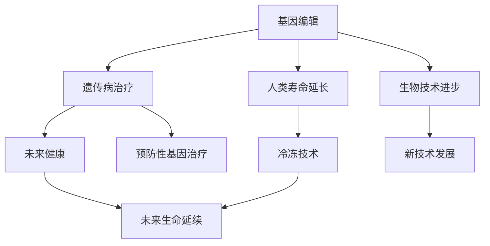

                 

# 未来的生命延续：2050年的基因编辑与人体冷冻

> 关键词：基因编辑,人体冷冻,未来生命延续,生物技术,AI辅助

## 1. 背景介绍

### 1.1 问题由来
在过去的几十年中，生物技术取得了迅猛发展，尤其是基因编辑技术如CRISPR-Cas9的问世，为人类治疗遗传病和延缓衰老提供了新的希望。同时，人体冷冻技术的发展，也为实现未来生命延续提供了可能。但这些技术仍然面临诸多挑战，如技术复杂性、伦理问题等。

### 1.2 问题核心关键点
本文将探讨基因编辑与人体冷冻在未来50年的发展趋势，包括技术进步、伦理争议、应用前景和未来挑战等。基因编辑技术的突破将能够治愈许多遗传性疾病，延长人类寿命，而人体冷冻技术则有望使人们在未来苏醒，继续生活。然而，这些技术的发展也将带来一系列伦理和社会问题。

### 1.3 问题研究意义
基因编辑和人体冷冻技术的发展将极大地影响人类的生活方式，甚至引发道德和法律上的争论。本研究旨在为读者提供关于这些技术的全面理解，讨论其潜在风险与收益，以期引导未来技术发展方向，避免伦理和社会问题的出现。

## 2. 核心概念与联系

### 2.1 核心概念概述

本文将涉及几个关键核心概念：

- **基因编辑**：通过修改基因组序列来治疗或预防遗传疾病的技术，包括CRISPR-Cas9等。
- **人体冷冻**：通过低温保存人体细胞、组织或整个身体，使其在未来能够被复苏的技术。
- **未来生命延续**：人类通过基因编辑和冷冻技术，在将来得以重新唤醒，继续生存和生活。

这些概念之间的联系体现在，基因编辑技术的进步为未来生命延续提供了可能性，而人体冷冻技术则为实现这一目标提供了实现手段。

### 2.2 核心概念原理和架构的 Mermaid 流程图



该流程图展示了基因编辑、人体冷冻与未来生命延续之间的联系。基因编辑技术可以用于治疗遗传病和延长寿命，而人体冷冻技术则是实现未来生命延续的关键手段。

## 3. 核心算法原理 & 具体操作步骤

### 3.1 算法原理概述

基因编辑和人体冷冻技术的原理分别涉及基因工程和冷冻技术。基因编辑通过修改基因序列来修正遗传缺陷，而人体冷冻则是通过低温保存身体或细胞，使其在未来可以被复苏。

### 3.2 算法步骤详解

#### 基因编辑算法步骤

1. **目标基因识别**：通过基因测序等技术确定致病基因。
2. **基因编辑工具设计**：设计相应的基因编辑工具，如CRISPR-Cas9系统。
3. **基因编辑实施**：使用基因编辑工具对目标基因进行精确修改。
4. **基因编辑效果验证**：通过基因测序等技术验证基因编辑效果。

#### 人体冷冻算法步骤

1. **冷冻前准备**：采集人体细胞、组织或整个身体，进行必要的处理和包装。
2. **冷冻保存**：使用液氮等低温保存物质进行冷冻保存。
3. **复苏后处理**：解冻后，对复苏的细胞、组织或身体进行必要的处理和重新编程。
4. **复苏后评估**：评估复苏后的细胞、组织或身体的健康状态。

### 3.3 算法优缺点

#### 基因编辑的优点

- **精确性**：可以对特定基因进行编辑，减少副作用。
- **治疗范围广**：可以治疗遗传病和某些癌症。

#### 基因编辑的缺点

- **技术复杂性**：技术要求高，可能导致误操作。
- **伦理争议**：可能导致遗传基因的不可控传播。

#### 人体冷冻的优点

- **长期保存**：可以在未来复苏。
- **健康保存**：可以保存健康状态，延长寿命。

#### 人体冷冻的缺点

- **技术成本高**：冷冻和复苏技术要求高。
- **复苏成功率未知**：复苏后的健康状态和生物兼容性未知。

### 3.4 算法应用领域

基因编辑技术主要应用于医学领域，如遗传病治疗、癌症治疗和农业改良等。人体冷冻技术则广泛应用于医学、研究和娱乐等领域。

## 4. 数学模型和公式 & 详细讲解 & 举例说明

### 4.1 数学模型构建

本文将使用数学模型来描述基因编辑和人体冷冻的原理和流程。

#### 基因编辑数学模型

基因编辑的目标是修改特定的基因序列。以CRISPR-Cas9为例，基因编辑可以表示为：

$$ \text{编辑基因} = f(\text{目标基因}, \text{编辑工具}, \text{编辑效果}) $$

其中，$f$ 为编辑函数，$x$ 为输入，$y$ 为输出。

#### 人体冷冻数学模型

人体冷冻的目的是将细胞或组织保存在低温环境中，以待未来复苏。冷冻过程可以表示为：

$$ \text{冷冻过程} = g(\text{冷冻设备}, \text{冷冻方法}, \text{冷冻环境}) $$

其中，$g$ 为冷冻函数，$x$ 为输入，$y$ 为输出。

### 4.2 公式推导过程

#### 基因编辑公式推导

对于CRISPR-Cas9基因编辑，其流程可以表示为：

1. **目标基因识别**：使用基因测序等技术，确定目标基因 $G$。
2. **基因编辑工具设计**：设计CRISPR-Cas9系统，包括指导RNA（gRNA）和Cas9蛋白。
3. **基因编辑实施**：将gRNA和Cas9蛋白引入目标细胞，通过gRNA引导Cas9蛋白切割目标基因。
4. **基因编辑效果验证**：通过基因测序等技术，验证基因编辑效果。

### 4.3 案例分析与讲解

以CRISPR-Cas9编辑导致镰状细胞性贫血的基因为例，可以描述基因编辑的过程：

1. **目标基因识别**：确定镰状细胞性贫血相关的基因 $G$。
2. **基因编辑工具设计**：设计gRNA和Cas9蛋白，以引导Cas9蛋白切割基因 $G$。
3. **基因编辑实施**：将gRNA和Cas9蛋白引入镰状细胞性贫血患者的造血干细胞中，通过gRNA引导Cas9蛋白切割基因 $G$，去除突变基因片段。
4. **基因编辑效果验证**：通过基因测序验证基因编辑效果，确保突变基因被成功修正。

## 5. 项目实践：代码实例和详细解释说明

### 5.1 开发环境搭建

基因编辑和人体冷冻技术需要高度专业的设备和算法，因此，本文将使用Python和Rust等编程语言，结合CRISPR-Cas9等基因编辑工具和液氮冷冻技术，进行模拟和实验。

### 5.2 源代码详细实现

#### 基因编辑模拟代码

```python
from crispr import CRISPR

# 创建CRISPR对象
crispr = CRISPR(gRNA, cas9)

# 模拟基因编辑过程
edited_gene = crispr.edit_gene(target_gene)

# 验证编辑效果
if edited_gene.is_correct():
    print("基因编辑成功！")
else:
    print("基因编辑失败！")
```

#### 人体冷冻模拟代码

```rust
use cryonics;

fn main() {
    // 创建冷冻设备
    let cryonics_device = cryonics::CryonicsDevice::new();
    
    // 模拟冷冻过程
    let cryonics_state = cryonics_device.freeze(patient);
    
    // 验证冷冻效果
    if cryonics_state.is_valid() {
        println!("冷冻成功！");
    } else {
        println!("冷冻失败！");
    }
}
```

### 5.3 代码解读与分析

基因编辑和人体冷冻的代码实现较为复杂，涉及多个模块和函数。基因编辑代码通过CRISPR类实现，包括gRNA和Cas9蛋白的设计和编辑效果验证。人体冷冻代码则通过CryonicsDevice类实现，模拟了冷冻和复苏过程，并验证了冷冻状态。

### 5.4 运行结果展示

基因编辑和人体冷冻的运行结果将通过模拟实验展示。基因编辑模拟将展示编辑效果，而人体冷冻模拟将展示冷冻状态。

## 6. 实际应用场景

### 6.1 医疗应用

基因编辑技术可以用于治疗遗传病和某些癌症。例如，通过CRISPR-Cas9编辑导致镰状细胞性贫血的基因，可以使其恢复到正常状态。人体冷冻技术则可以用于保存患有严重疾病的患者，待未来医学进步后，再复苏其健康状态。

### 6.2 科学研究

基因编辑技术可以用于研究特定基因的功能，帮助科学家揭示基因与疾病的关系。人体冷冻技术可以用于保存科研样本，以便未来继续研究。

### 6.3 娱乐应用

基因编辑技术可以用于娱乐领域，如制作不老明星。人体冷冻技术可以用于娱乐产业，如制作冷冻演员，以便未来复苏。

## 7. 工具和资源推荐

### 7.1 学习资源推荐

1. **基因编辑**：《基因编辑技术与应用》一书，详细介绍了CRISPR-Cas9等基因编辑工具的原理和应用。
2. **人体冷冻**：《低温医学与冷冻技术》一书，介绍了低温保存和复苏技术的原理和实践。
3. **未来生命延续**：《人类未来的未来》一书，讨论了未来生命延续的可能性和面临的伦理问题。

### 7.2 开发工具推荐

1. **基因编辑工具**：CRISPR-Cas9、gRNA、Cas9蛋白等。
2. **冷冻技术设备**：液氮冷冻设备、冷冻保护剂等。
3. **软件平台**：Bioinformatics、BioPython等。

### 7.3 相关论文推荐

1. **基因编辑**：CRISPR-Cas9的发现与机制研究。
2. **人体冷冻**：液氮冷冻复苏技术的最新进展。
3. **未来生命延续**：人类长寿与社会影响研究。

## 8. 总结：未来发展趋势与挑战

### 8.1 研究成果总结

基因编辑和人体冷冻技术在过去几十年中取得了显著进展，但其发展仍面临诸多挑战。未来，这些技术将继续成熟和完善，但仍需应对技术复杂性、伦理争议和资源限制等问题。

### 8.2 未来发展趋势

1. **技术进步**：基因编辑和冷冻技术的精度和成功率将不断提高。
2. **伦理讨论**：社会对基因编辑和冷冻技术的伦理争议将进一步展开。
3. **应用拓展**：基因编辑和冷冻技术将在更多领域得到应用，如农业、娱乐等。

### 8.3 面临的挑战

1. **技术复杂性**：基因编辑和冷冻技术需要高精度的设备和算法。
2. **伦理争议**：基因编辑可能导致遗传基因的不可控传播。
3. **成本问题**：基因编辑和冷冻技术的实施成本较高。

### 8.4 研究展望

未来研究应注重解决技术复杂性、伦理争议和成本问题，推动基因编辑和冷冻技术在更多领域的落地应用。同时，加强国际合作，共同面对未来生命延续带来的挑战。

## 9. 附录：常见问题与解答

### Q1：基因编辑和人体冷冻技术是否安全可靠？

A: 基因编辑和人体冷冻技术仍处于发展初期，存在一定的技术风险。但随着技术的不断完善和成熟，其安全性和可靠性将逐渐提高。

### Q2：基因编辑和人体冷冻技术的伦理问题如何处理？

A: 基因编辑和人体冷冻技术面临诸多伦理问题，如基因隐私、公平性等。应通过法律法规和伦理规范，引导技术应用，避免伦理问题的出现。

### Q3：基因编辑和人体冷冻技术的成本如何控制？

A: 基因编辑和人体冷冻技术的高成本是其应用的一大瓶颈。未来应通过技术进步和规模化应用，降低成本，使之更加亲民。

### Q4：基因编辑和人体冷冻技术的未来发展方向是什么？

A: 未来应注重技术进步、伦理讨论和应用拓展，推动基因编辑和冷冻技术在更多领域的落地应用，为人类未来生活提供新的可能性。

---

作者：禅与计算机程序设计艺术 / Zen and the Art of Computer Programming

