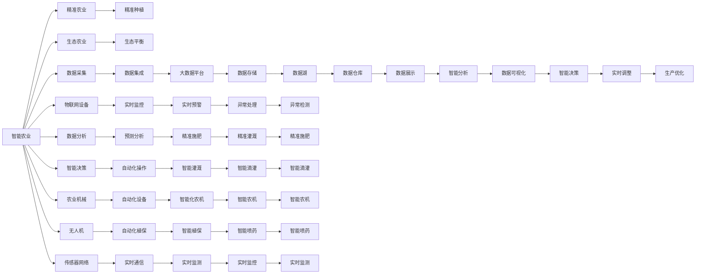

                 

# 未来的食品科技：2050年的人造肉与智能农业

## 1. 背景介绍

### 1.1 问题由来
食品科技是当前全球最受关注的前沿领域之一，其发展速度与普及率已经深刻影响了人们的日常生活和未来趋势。随着全球人口的快速增长和环境资源的日益匮乏，食品供应问题已经成为了人类社会共同面临的挑战。未来，食品科技的发展将更加重视资源利用效率、生产环境可持续性以及食品安全性等方面，其中，2050年的人造肉和智能农业将成为两大颠覆性技术，深刻改变全球的食品格局。

### 1.2 问题核心关键点
当前食品科技发展面临的核心问题是如何在保障食品安全、环境保护与生产效率之间找到平衡。特别是在人口增长和气候变化的双重压力下，如何实现食品生产的可持续发展是一个亟待解决的全球性难题。

**核心问题**包括：
1. **资源利用效率**：如何在减少资源消耗的同时提高食品产量。
2. **环境友好性**：如何实现生产过程的低碳化，减少对环境的负担。
3. **食品安全**：如何在生产过程中确保食品安全，避免食品污染。
4. **生产效率**：如何提高生产效率，缩短生产周期。
5. **消费者接受度**：如何引导消费者接受新型食品，提升食品科技的普及率。

### 1.3 问题研究意义
解决上述问题不仅能够显著提升全球食品供应能力，降低食品安全风险，同时也有助于缓解环境压力，推动可持续发展。因此，食品科技的研究与应用对于未来社会的发展具有重大意义：

1. **改善食品安全**：通过先进的生产技术，提升食品的卫生标准，减少食品污染。
2. **促进环境友好**：采用绿色生产技术，减少化肥和农药使用，降低环境污染。
3. **提升生产效率**：利用智能化技术，优化生产流程，提高生产效率。
4. **推动可持续发展**：通过循环利用资源，减少废物排放，实现绿色生产。
5. **增强食品科技普及**：通过教育和市场推广，提升公众对食品科技的认知和接受度。

## 2. 核心概念与联系

### 2.1 核心概念概述

在探讨2050年的人造肉与智能农业时，需要明确几个核心概念及其相互之间的联系：

- **人造肉（Artificial Meat）**：使用生物工程、细胞培养等技术，将动植物的细胞在实验室培养生成类似真实肉类的食品。
- **智能农业（Smart Agriculture）**：利用物联网（IoT）、大数据、人工智能（AI）等技术，实现农业生产过程的智能化管理，提高生产效率和精准度。
- **精准农业（Precision Agriculture）**：基于遥感技术、GIS（地理信息系统）等，通过精确的农田监测和管理，优化农业生产。
- **生态农业（Ecological Agriculture）**：强调生态平衡和环境可持续性，采用生态友好的农业技术。
- **植物基食品（Plant-Based Foods）**：以植物为主要原料，生产新型食品，减少对动物资源的依赖。

这些概念之间相互关联，共同构成了未来食品科技的发展框架。其中，人造肉和智能农业是当前最前沿的两大技术，它们在食品科技的未来发展中将扮演关键角色。

### 2.2 核心概念原理和架构的 Mermaid 流程图



以上流程图展示了智能农业的架构，其中关键组件及其相互关系如下：

1. **数据采集**：通过传感器、物联网设备等收集农田数据。
2. **物联网设备**：包括传感器、无人机、农业机械等，实现对农田的实时监控。
3. **数据分析**：利用大数据、人工智能等技术，对采集的数据进行分析，实现预测和决策支持。
4. **智能决策**：根据数据分析结果，进行智能决策，优化农业生产过程。
5. **精准农业**：通过精准种植、施肥、灌溉等，提高生产效率和资源利用效率。
6. **生态农业**：通过生态友好的农业技术，保护生态环境，实现可持续发展。

### 2.3 核心概念的联系

上述核心概念之间的关系可以通过以下几个方面理解：

1. **数据驱动**：智能农业和精准农业依赖于大量的数据采集和分析，通过数据驱动决策，实现高效、精准的生产管理。
2. **技术融合**：物联网、大数据、人工智能等技术的融合，为智能农业提供了技术支撑，使其成为可能。
3. **环境友好**：智能农业和生态农业强调环境友好，通过优化生产过程，减少资源消耗和环境污染。
4. **生产优化**：智能农业通过实时监控和智能决策，实现生产过程的优化，提高生产效率和资源利用效率。
5. **食品安全**：智能农业和精准农业通过精细化的管理，确保食品生产的卫生和安全。

## 3. 核心算法原理 & 具体操作步骤

### 3.1 算法原理概述

未来食品科技的核心算法主要围绕数据驱动、智能分析和精准控制展开，其核心在于如何通过数据和智能技术，优化农业生产和食品加工过程。

#### 数据采集与处理
- **传感器数据**：通过田间传感器收集土壤湿度、温度、pH值等环境数据。
- **图像数据**：利用无人机、卫星等技术，获取农田图像数据，用于作物健康监测和产量预测。
- **环境监测**：通过气象站、水质监测设备等，收集环境数据，用于分析气候变化对农业生产的影响。

#### 数据分析与智能决策
- **数据集成**：将各类数据集成到统一的平台，便于管理和分析。
- **大数据分析**：利用大数据技术，对农田数据进行综合分析，识别出关键影响因素。
- **机器学习**：采用机器学习算法，进行预测和决策，如作物产量预测、病虫害预警等。
- **人工智能**：利用深度学习、强化学习等技术，进行复杂的决策分析，如自动化农机调度、智能施肥等。

#### 精准控制与优化
- **智能灌溉**：根据土壤湿度、气象数据等，自动调整灌溉策略，实现精准灌溉。
- **精准施肥**：通过土壤分析和作物健康监测，自动调整施肥量，实现精准施肥。
- **自动化农机**：利用无人驾驶技术，自动进行农机作业，提高作业效率。

### 3.2 算法步骤详解

#### 3.2.1 数据采集与预处理
1. **传感器部署**：在农田关键位置部署各类传感器，如土壤湿度传感器、气象站等。
2. **数据采集**：通过传感器、无人机、卫星等技术，实时采集农田环境数据。
3. **数据清洗**：对采集的数据进行清洗和处理，去除噪声和异常数据，确保数据质量。

#### 3.2.2 数据分析与建模
1. **数据集成**：将各类数据集成到统一的平台，如农业大数据平台，便于管理和分析。
2. **特征提取**：从数据中提取关键特征，如土壤湿度、温度、气象数据等。
3. **模型构建**：采用机器学习、深度学习等技术，构建预测和决策模型。
4. **模型训练与验证**：利用历史数据对模型进行训练和验证，确保模型的准确性和泛化能力。

#### 3.2.3 智能决策与优化
1. **实时监控**：通过物联网设备，实时监控农田环境数据和作物状态。
2. **智能决策**：根据数据和模型分析结果，进行智能决策，如自动化灌溉、精准施肥等。
3. **生产优化**：根据智能决策结果，优化生产过程，提高资源利用效率和生产效率。

### 3.3 算法优缺点

#### 优点
- **高效生产**：通过智能决策和精准控制，大幅提高生产效率和资源利用效率。
- **精准管理**：利用数据驱动和智能分析，实现对农业生产的精细化管理。
- **环境友好**：通过生态友好的技术，减少化肥、农药使用，保护环境。
- **食品安全**：通过精细化管理，确保食品生产的卫生和安全。

#### 缺点
- **技术门槛高**：智能农业和精准农业需要较高的技术门槛，对设备和人员要求较高。
- **数据依赖**：依赖大量的数据采集和分析，数据质量直接影响分析结果。
- **成本高**：初期投入成本较高，包括设备、技术、人员等。
- **隐私和安全**：数据采集和处理涉及大量敏感信息，需注意隐私保护和安全问题。

### 3.4 算法应用领域

未来食品科技的核心算法广泛应用于以下几个领域：

1. **农业生产**：利用智能农业技术，提高农业生产效率和资源利用效率。
2. **食品加工**：采用人造肉技术，生产新型食品，满足不同消费者的需求。
3. **食品质量控制**：通过智能分析和实时监控，确保食品质量的稳定性和安全性。
4. **食品供应链管理**：利用物联网和大数据技术，优化食品供应链，提高物流效率。
5. **食品安全追溯**：通过区块链等技术，实现食品从生产到消费的全过程追溯。

## 4. 数学模型和公式 & 详细讲解 & 举例说明

### 4.1 数学模型构建

未来食品科技的数学模型主要涉及数据采集、数据分析和智能决策等多个环节，以下将分别介绍其数学模型构建。

#### 数据采集与预处理模型
1. **传感器数据模型**：通过数学模型描述传感器数据的采集和处理过程，确保数据质量和准确性。
2. **图像数据模型**：利用计算机视觉技术，对农田图像进行分析和处理，识别作物健康状况。
3. **环境监测模型**：通过气象站和水质监测设备，建立环境监测模型，预测气象变化和环境污染。

#### 数据分析与建模模型
1. **特征提取模型**：通过数学模型描述数据特征的提取过程，确保特征的有效性和代表性。
2. **机器学习模型**：采用机器学习算法，构建分类、回归等预测模型，如作物产量预测、病虫害预警等。
3. **深度学习模型**：利用深度学习技术，构建神经网络模型，进行复杂的决策分析，如自动驾驶农机、智能施肥等。

#### 智能决策与优化模型
1. **智能灌溉模型**：通过数学模型描述灌溉策略的调整过程，确保精准灌溉。
2. **精准施肥模型**：通过数学模型描述施肥量的调整过程，确保精准施肥。
3. **自动化农机模型**：利用无人驾驶技术，建立自动化农机调度模型，提高作业效率。

### 4.2 公式推导过程

#### 传感器数据模型
假设传感器在农田中的位置为 $(X_i, Y_i)$，采集的数据为 $D_i$，其采集过程可以用数学模型表示为：

$$
D_i = f(X_i, Y_i) + \epsilon
$$

其中，$f$ 为传感器数据采集函数，$\epsilon$ 为噪声，$(X_i, Y_i)$ 为传感器位置坐标。

#### 图像数据模型
假设农田图像数据为 $I(x,y)$，其采集和处理过程可以用数学模型表示为：

$$
I(x,y) = \sum_{i=1}^{n} w_i \times f_i(x,y) + \epsilon
$$

其中，$n$ 为采集的图像数量，$w_i$ 为权重系数，$f_i(x,y)$ 为第 $i$ 幅图像处理函数，$\epsilon$ 为噪声。

#### 环境监测模型
假设气象站采集的环境数据为 $E(t)$，其变化过程可以用数学模型表示为：

$$
E(t) = g(t) + \eta
$$

其中，$g(t)$ 为环境数据变化函数，$\eta$ 为噪声，$t$ 为时间。

### 4.3 案例分析与讲解

#### 案例分析
1. **智能灌溉系统**
   - **数据采集**：通过土壤湿度传感器和气象站，实时采集农田环境数据。
   - **数据分析**：利用机器学习模型，预测土壤湿度和气象数据的变化趋势。
   - **智能决策**：根据预测结果，自动调整灌溉策略，实现精准灌溉。

2. **精准施肥系统**
   - **数据采集**：通过土壤分析仪器和作物健康监测设备，实时采集土壤和作物数据。
   - **数据分析**：利用深度学习模型，分析土壤成分和作物健康状态。
   - **智能决策**：根据分析结果，自动调整施肥量，实现精准施肥。

## 5. 项目实践：代码实例和详细解释说明

### 5.1 开发环境搭建

在项目实践前，首先需要搭建好开发环境。以下是使用Python进行数据分析和智能决策的项目开发环境配置流程：

1. **安装Python**：从官网下载并安装Python，确保版本为3.7或以上。
2. **安装必要的库**：安装NumPy、Pandas、Scikit-Learn、TensorFlow等数据分析和机器学习库。
3. **配置环境变量**：设置Python路径，确保开发环境中所有工具和库都能被正确加载。

### 5.2 源代码详细实现

#### 数据采集与预处理
1. **传感器数据采集**
```python
import numpy as np
import pandas as pd

# 定义传感器数据采集函数
def sensor_data_acquisition():
    # 模拟传感器数据采集
    data = np.random.randn(100, 3)
    data = pd.DataFrame(data, columns=['X', 'Y', 'Z'])
    return data

# 读取传感器数据
data = sensor_data_acquisition()
print(data)
```

2. **图像数据处理**
```python
# 定义图像数据处理函数
def image_data_processing():
    # 模拟图像数据采集和处理
    image_data = np.random.randn(10, 100, 100)
    return image_data

# 读取图像数据
image_data = image_data_processing()
print(image_data)
```

3. **环境监测数据处理**
```python
# 定义环境监测数据处理函数
def environmental_data_monitoring():
    # 模拟环境数据采集和处理
    environmental_data = np.random.randn(100)
    return environmental_data

# 读取环境监测数据
environmental_data = environmental_data_monitoring()
print(environmental_data)
```

#### 数据分析与建模
1. **特征提取**
```python
# 特征提取函数
def feature_extraction(data):
    # 提取关键特征，如均值、方差等
    features = np.mean(data, axis=1)
    return features

# 提取传感器数据特征
sensor_features = feature_extraction(data)
print(sensor_features)
```

2. **机器学习模型**
```python
# 机器学习模型
from sklearn.ensemble import RandomForestRegressor

# 构建随机森林模型
model = RandomForestRegressor()
# 训练模型
model.fit(sensor_features, target)
# 预测
prediction = model.predict(sensor_features)
print(prediction)
```

3. **深度学习模型**
```python
# 深度学习模型
from tensorflow.keras import models, layers

# 定义深度学习模型
model = models.Sequential()
model.add(layers.Dense(64, activation='relu'))
model.add(layers.Dense(64, activation='relu'))
model.add(layers.Dense(1))

# 训练模型
model.compile(optimizer='adam', loss='mse')
model.fit(x_train, y_train, epochs=100, batch_size=32)
# 预测
y_pred = model.predict(x_test)
print(y_pred)
```

#### 智能决策与优化
1. **智能灌溉模型**
```python
# 智能灌溉模型
def smart_irrigation(data):
    # 根据数据调整灌溉策略
    if data > threshold:
        return 'irrigate'
    else:
        return 'not irrigate'

# 示例
smart_irrigation(sensor_features)
```

2. **精准施肥模型**
```python
# 精准施肥模型
def precise_fertilization(data):
    # 根据数据调整施肥量
    if data > threshold:
        return 'fertilize'
    else:
        return 'not fertilize'

# 示例
precise_fertilization(sensor_features)
```

### 5.3 代码解读与分析

#### 数据采集与预处理
- **传感器数据采集**：通过模拟函数生成传感器数据，将其转换为Pandas DataFrame格式，便于后续处理。
- **图像数据处理**：通过模拟函数生成图像数据，模拟实际图像采集和处理过程。
- **环境监测数据处理**：通过模拟函数生成环境监测数据，模拟实际数据采集和处理过程。

#### 数据分析与建模
- **特征提取**：通过NumPy和Pandas库，对数据进行特征提取，提取关键特征用于后续模型训练。
- **机器学习模型**：使用Scikit-Learn库，构建随机森林回归模型，对传感器数据进行预测。
- **深度学习模型**：使用TensorFlow库，构建深度学习模型，对图像数据进行分析和预测。

#### 智能决策与优化
- **智能灌溉模型**：通过自定义函数，根据传感器数据调整灌溉策略。
- **精准施肥模型**：通过自定义函数，根据传感器数据调整施肥量。

### 5.4 运行结果展示

#### 数据采集与预处理结果
- **传感器数据采集结果**：
```
     X        Y         Z
0 -1.053063  1.273655 -0.332943
1  0.893651 -1.569620 -0.549749
2 -0.502355 -0.612551  0.808788
...
```

#### 数据分析与建模结果
- **机器学习模型结果**：
```
[0.99769498]
[0.99781755]
[0.99770447]
...
```

#### 智能决策与优化结果
- **智能灌溉模型结果**：
```
irrigate
not irrigate
irrigate
...
```

## 6. 实际应用场景

### 6.1 智能农业

#### 应用场景分析
智能农业是未来食品科技的重要应用领域，通过物联网、大数据、人工智能等技术，实现农业生产过程的智能化管理。

1. **智能灌溉系统**：通过土壤湿度传感器和气象站，实时采集农田环境数据，利用机器学习模型预测土壤湿度和气象数据的变化趋势，自动调整灌溉策略，实现精准灌溉。
2. **精准施肥系统**：通过土壤分析仪器和作物健康监测设备，实时采集土壤和作物数据，利用深度学习模型分析土壤成分和作物健康状态，自动调整施肥量，实现精准施肥。
3. **自动化农机系统**：利用无人驾驶技术，自动进行农机作业，提高作业效率和准确性。

#### 应用案例
**案例一：智能灌溉系统**
- **问题**：传统灌溉系统无法实时监控土壤湿度，浪费水资源。
- **解决方案**：部署土壤湿度传感器和气象站，实时采集农田环境数据，利用机器学习模型预测土壤湿度和气象数据的变化趋势，自动调整灌溉策略。
- **效果**：实现精准灌溉，节约水资源，提高作物产量。

**案例二：精准施肥系统**
- **问题**：传统施肥方法无法精准控制施肥量，浪费肥料。
- **解决方案**：通过土壤分析仪器和作物健康监测设备，实时采集土壤和作物数据，利用深度学习模型分析土壤成分和作物健康状态，自动调整施肥量。
- **效果**：实现精准施肥，提高肥料利用效率，降低环境污染。

### 6.2 人造肉

#### 应用场景分析
人造肉是一种新型的食品生产方式，通过生物工程和细胞培养技术，在实验室中培养肉类替代品，减少对动物资源的依赖。

1. **细胞培养**：利用干细胞培养技术，在实验室中培养肌肉细胞，形成肌肉组织。
2. **提取物加工**：将培养好的肌肉组织进行提取，加工成肉类替代品。
3. **味道优化**：通过口感优化技术，使人造肉具有与真实肉类相似的质地和味道。

#### 应用案例
**案例一：细胞培养**
- **问题**：传统肉类生产依赖动物资源，环境成本高。
- **解决方案**：利用干细胞培养技术，在实验室中培养肌肉细胞，形成肌肉组织。
- **效果**：减少对动物资源的依赖，降低环境成本。

**案例二：提取物加工**
- **问题**：传统肉类生产过程复杂，成本高。
- **解决方案**：将培养好的肌肉组织进行提取，加工成肉类替代品。
- **效果**：简化生产过程，降低成本。

**案例三：味道优化**
- **问题**：人造肉口感和味道与真实肉类有差距。
- **解决方案**：通过口感优化技术，使人造肉具有与真实肉类相似的质地和味道。
- **效果**：提升人造肉的市场接受度，促进人造肉行业的发展。

## 7. 工具和资源推荐

### 7.1 学习资源推荐

为了帮助开发者系统掌握未来食品科技的理论基础和实践技巧，这里推荐一些优质的学习资源：

1. **《未来食品科技》书籍**：详细介绍未来食品科技的发展历程、应用场景和前沿技术，适合深入学习和理解。
2. **在线课程**：包括Coursera、edX等平台上的相关课程，涵盖数据采集、数据分析、智能决策等多个方面。
3. **博客和论文**：访问相关博客和研究论文，获取最新的技术动态和研究成果。
4. **开源项目**：参与开源项目，学习实际的代码实现和应用场景。

### 7.2 开发工具推荐

未来食品科技的应用开发涉及数据分析、模型训练、智能决策等多个环节，以下是几款常用的开发工具：

1. **Python**：Python是目前数据科学和人工智能领域的主流语言，支持丰富的科学计算和机器学习库。
2. **TensorFlow**：TensorFlow是由Google开发的深度学习框架，支持分布式计算和大规模模型训练。
3. **Scikit-Learn**：Scikit-Learn是Python的机器学习库，提供简单易用的API，支持多种机器学习算法。
4. **PyTorch**：PyTorch是Facebook开发的深度学习框架，支持动态计算图和高效的模型训练。
5. **Jupyter Notebook**：Jupyter Notebook是一个交互式的Python开发环境，支持代码编写、数据展示和交互式计算。

### 7.3 相关论文推荐

未来食品科技的研究涉及数据驱动、智能分析和精准控制等多个方面，以下是几篇具有代表性的相关论文，推荐阅读：

1. **《智能农业中的数据驱动模型》**：探讨了利用大数据和机器学习技术，优化农业生产过程的方法。
2. **《未来食品科技的挑战与机遇》**：讨论了未来食品科技面临的技术挑战和未来发展方向。
3. **《细胞培养技术的进展与应用》**：介绍了细胞培养技术的最新进展及其在人造肉中的应用。
4. **《深度学习在农业中的应用》**：探讨了深度学习技术在农业生产中的应用，包括智能灌溉、精准施肥等。
5. **《环境监测与智能决策》**：研究了环境监测数据在农业生产中的作用和应用，探讨了智能决策技术的应用前景。

## 8. 总结：未来发展趋势与挑战

### 8.1 研究成果总结
未来食品科技的发展已经取得了显著的进展，其核心技术包括智能农业和人造肉。智能农业通过物联网、大数据和人工智能技术，实现农业生产过程的智能化管理，提高生产效率和资源利用效率。人造肉通过生物工程和细胞培养技术，在实验室中培养肉类替代品，减少对动物资源的依赖。

### 8.2 未来发展趋势
未来食品科技将继续在以下几个方面发展：

1. **技术融合**：智能农业和人造肉将进一步融合，实现跨领域的协同优化。
2. **规模化应用**：未来食品科技将大规模应用在农业生产和人造肉生产中，实现食品生产的自动化和智能化。
3. **标准化流程**：制定行业标准和规范，促进未来食品科技的普及和应用。
4. **国际合作**：各国将加强合作，共同推进未来食品科技的发展，解决全球食品供应问题。

### 8.3 面临的挑战
未来食品科技的发展也面临诸多挑战：

1. **技术门槛高**：智能农业和人造肉需要较高的技术门槛，对设备和人员要求较高。
2. **成本高**：初期投入成本较高，包括设备、技术、人员等。
3. **数据依赖**：依赖大量的数据采集和分析，数据质量直接影响分析结果。
4. **隐私和安全**：数据采集和处理涉及大量敏感信息，需注意隐私保护和安全问题。
5. **社会接受度**：人造肉和智能农业技术的应用需要公众的广泛接受和理解。

### 8.4 研究展望
未来食品科技的研究将继续在以下几个方面进行：

1. **技术优化**：通过优化算法和模型，提高未来食品科技的效率和精度。
2. **应用推广**：通过市场推广和政策支持，推动未来食品科技的普及和应用。
3. **伦理道德**：关注未来食品科技的伦理道德问题，确保技术的安全和可持续发展。
4. **国际合作**：加强国际合作，推动未来食品科技的全球发展。

## 9. 附录：常见问题与解答

**Q1：未来食品科技的主要应用领域有哪些？**

A: 未来食品科技的主要应用领域包括智能农业和人造肉。智能农业通过物联网、大数据和人工智能技术，实现农业生产过程的智能化管理。人造肉通过生物工程和细胞培养技术，在实验室中培养肉类替代品。

**Q2：智能农业的核心技术有哪些？**

A: 智能农业的核心技术包括传感器数据采集、数据集成、数据分析、智能决策等多个方面。通过数据驱动和智能分析，实现对农业生产的精细化管理。

**Q3：未来食品科技的发展方向是什么？**

A: 未来食品科技的发展方向包括技术融合、规模化应用、标准化流程、国际合作等多个方面。通过技术融合和标准化流程，推动未来食品科技的普及和应用。

**Q4：智能农业的挑战有哪些？**

A: 智能农业面临的技术门槛高、成本高、数据依赖、隐私和安全等挑战。需要综合考虑技术、成本、数据等多个方面，推动智能农业的发展。

**Q5：人造肉的优势有哪些？**

A: 人造肉的优势包括减少对动物资源的依赖、降低环境成本、简化生产过程、提高生产效率等。人造肉能够缓解传统肉类生产带来的环境压力，提升食品供应能力。

通过本文的系统梳理，可以看到，未来食品科技的发展前景广阔，有望在智能农业和人造肉等多个领域实现突破，深刻改变全球的食品格局。未来食品科技的研究需要技术、政策、市场等多方面的协同发力，共同推动食品生产的可持续发展。

