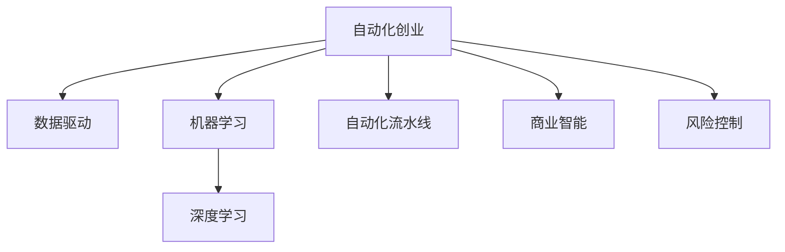

                 

# 机器学习在自动化创业中的应用

> 关键词：自动化创业, 机器学习, 深度学习, 数据驱动, 自动化流水线, 商业智能, 风险控制

## 1. 背景介绍

### 1.1 问题由来
自动化创业，顾名思义，是指利用自动化技术实现企业运营的各项职能。从采购、生产、物流到营销、客户服务、财务管理，自动化技术已经渗透到企业运营的方方面面。机器学习作为自动化技术的重要一环，正在不断推动自动化创业的深化与创新。

自动化创业的核心在于提升企业的运营效率，降低成本，并通过数据分析增强企业的决策能力。机器学习通过数据挖掘、预测分析等技术，帮助企业发现潜在的运营瓶颈和优化空间，从而实现数字化转型。但机器学习的深度应用，特别是在创业初期，常常面临数据资源有限、算法选择复杂、模型优化难度大等问题，这使得机器学习在自动化创业中的推广和应用存在较大挑战。

### 1.2 问题核心关键点
机器学习在自动化创业中的应用，主要体现在以下几个方面：

- 自动化数据处理：通过机器学习算法对原始数据进行清洗、归一化、特征工程等预处理操作，自动化生成高质量的数据集。
- 自动化业务流程：将机器学习模型嵌入到企业的业务流程中，实现对业务过程的自动优化和决策支持。
- 自动化风险控制：利用机器学习模型对业务风险进行预测和评估，建立自动化的风险预警机制。
- 自动化客户服务：通过机器学习模型实现自动化客服、智能推荐、情感分析等，提升客户服务体验。
- 自动化商业智能：利用机器学习模型进行数据挖掘和商业预测，提供智能化的商业决策支持。

本文旨在探讨机器学习在自动化创业中的具体应用，帮助创业者和企业理解如何利用机器学习技术，提升自身的自动化水平，从而在激烈的市场竞争中取得优势。

## 2. 核心概念与联系

### 2.1 核心概念概述

为更好地理解机器学习在自动化创业中的应用，本节将介绍几个密切相关的核心概念：

- 自动化创业(Automation Ventures)：指通过自动化技术实现企业各项职能的自动化处理，提升运营效率，降低成本，并通过数据分析增强决策能力的一种商业模式。
- 机器学习(Machine Learning)：一种通过数据驱动的方法，使计算机能够从经验中学习并改进任务执行的算法。
- 深度学习(Deep Learning)：机器学习的一种特殊形式，通过多层次神经网络，自动从原始数据中提取高层次的抽象特征。
- 数据驱动(Data-Driven)：指决策和运营依据数据来进行，而非主观经验或直觉。
- 自动化流水线(Automated Pipeline)：通过一系列自动化步骤，将数据输入和输出直接连接，减少人工干预，提高处理效率。
- 商业智能(Business Intelligence, BI)：利用数据分析、数据挖掘等技术，为商业决策提供支持。
- 风险控制(Risk Control)：通过预测和评估，降低或消除潜在的业务风险。

这些核心概念之间的逻辑关系可以通过以下Mermaid流程图来展示：



这个流程图展示出自动化创业与机器学习相关概念之间的联系：

1. 自动化创业通过数据驱动和自动化流水线，利用机器学习提升运营效率。
2. 机器学习，特别是深度学习，提供数据驱动的基础技术支持。
3. 商业智能和风险控制，通过机器学习对数据进行挖掘和预测，提供决策支持和风险预警。

## 3. 核心算法原理 & 具体操作步骤

### 3.1 算法原理概述

机器学习在自动化创业中的应用，基于数据驱动的算法思想，主要分为以下几个步骤：

1. **数据收集与预处理**：通过传感器、日志文件、API接口等方式收集企业运营数据，并进行清洗、归一化、特征工程等预处理操作。
2. **模型训练与选择**：选择合适的机器学习算法（如线性回归、决策树、神经网络等），基于历史数据进行模型训练，并评估模型效果。
3. **自动化模型部署**：将训练好的模型集成到自动化流水线中，实现自动化决策支持。
4. **持续优化与反馈**：根据实时运营数据，不断调整模型参数，优化模型性能。
5. **自动化风险控制**：利用机器学习模型进行风险预测和评估，建立自动化的风险预警机制。
6. **自动化客户服务**：通过机器学习模型实现自动化客服、智能推荐、情感分析等，提升客户服务体验。

### 3.2 算法步骤详解

基于机器学习的自动化创业流程，主要包括以下关键步骤：

**Step 1: 数据收集与预处理**
- 收集企业运营中的各类数据，包括销售数据、客户数据、财务数据等。
- 对原始数据进行清洗、去重、缺失值填补等预处理操作。
- 进行特征工程，提取关键特征，包括但不限于销售量、客单价、订单周期等。

**Step 2: 模型训练与选择**
- 选择合适的机器学习算法进行模型训练，如决策树、随机森林、支持向量机等。
- 将训练数据分为训练集、验证集和测试集，进行交叉验证和参数调优。
- 选择最优模型进行预测，并评估其准确率、召回率、F1值等指标。

**Step 3: 自动化模型部署**
- 将训练好的模型集成到自动化流水线中，实现自动化决策支持。
- 利用API接口、消息队列等方式，将模型输出与其他系统集成。
- 设计监控系统，实时监控模型运行状态，及时发现并解决问题。

**Step 4: 持续优化与反馈**
- 根据实时运营数据，不断调整模型参数，优化模型性能。
- 定期对模型进行重新训练，以适应数据分布的变化。
- 引入新的业务场景，扩展模型的应用范围。

**Step 5: 自动化风险控制**
- 利用机器学习模型进行风险预测，如信用风险、欺诈风险等。
- 根据预测结果，建立自动化的风险预警机制。
- 实时监控风险指标，及时采取措施降低风险。

**Step 6: 自动化客户服务**
- 利用机器学习模型进行情感分析、意图识别、智能推荐等。
- 实现自动化的客户服务，如智能客服、智能推荐系统等。
- 设计用户反馈机制，持续改进模型效果。

### 3.3 算法优缺点

机器学习在自动化创业中的应用，具有以下优点：

- 提升运营效率：通过自动化流水线，减少人工干预，提高处理速度和准确性。
- 降低运营成本：减少人工成本，提高资源利用效率。
- 增强决策支持：通过数据驱动的算法，提供更准确的决策依据。
- 快速响应变化：机器学习模型可以不断优化，快速适应新的业务场景。

同时，该方法也存在一定的局限性：

- 数据质量要求高：数据收集、清洗和预处理需要较高的技术门槛。
- 算法选择复杂：选择错误的算法可能导致预测结果偏差。
- 模型复杂度高：部分模型可能存在较复杂的参数优化问题。
- 模型解释性差：部分模型（如神经网络）难以解释其内部工作机制。

尽管存在这些局限性，但就目前而言，机器学习在自动化创业中的应用仍具有不可替代的价值。未来相关研究的重点在于如何进一步降低数据质量要求，提高算法易用性，增强模型的可解释性等，以促进机器学习技术的广泛应用。

### 3.4 算法应用领域

机器学习在自动化创业中的应用，广泛涵盖以下几个领域：

- **供应链优化**：利用机器学习模型进行库存管理、需求预测等，提升供应链效率。
- **客户服务自动化**：通过机器学习模型实现自动化客服、智能推荐、情感分析等，提升客户服务体验。
- **销售与营销**：利用机器学习模型进行客户细分、销售预测、广告投放优化等。
- **财务与成本控制**：通过机器学习模型进行财务预测、成本分析、风险评估等。
- **生产与制造**：利用机器学习模型进行设备预测维护、生产计划优化等。

除了上述这些经典应用外，机器学习还在物流管理、人力资源管理、客户关系管理等众多领域得到了广泛应用，为企业的自动化转型提供了强有力的技术支持。

## 4. 数学模型和公式 & 详细讲解 & 举例说明

### 4.1 数学模型构建

本节将使用数学语言对基于机器学习的自动化创业模型进行更加严格的刻画。

记企业运营数据集为 $D=\{(x_i,y_i)\}_{i=1}^N$，其中 $x_i$ 为输入变量，$y_i$ 为输出变量。

定义机器学习模型为 $f(x;\theta)$，其中 $\theta$ 为模型参数。目标函数为 $L(f(x;\theta),y)$，表示模型预测输出与真实标签之间的差异。则目标函数可以表示为：

$$
L(f(x;\theta),y) = \frac{1}{N} \sum_{i=1}^N \ell(f(x_i;\theta),y_i)
$$

其中 $\ell$ 为损失函数，如均方误差、交叉熵等。

### 4.2 公式推导过程

以下我们以线性回归模型为例，推导最小二乘法的训练公式及其梯度计算公式。

假设模型 $f(x;\theta) = \theta_0 + \theta_1x_1 + \theta_2x_2 + \cdots + \theta_nx_n$，则目标函数为：

$$
L(f(x;\theta),y) = \frac{1}{N} \sum_{i=1}^N (y_i - \theta_0 - \theta_1x_{i1} - \theta_2x_{i2} - \cdots - \theta_nx_{in})^2
$$

对该目标函数求偏导，得：

$$
\frac{\partial L}{\partial \theta_k} = -2\sum_{i=1}^N (y_i - \theta_0 - \theta_1x_{i1} - \theta_2x_{i2} - \cdots - \theta_nx_{in})x_{ik}
$$

因此，最小二乘法的训练公式为：

$$
\theta_k = \theta_k - \frac{\partial L}{\partial \theta_k} / N
$$

将上述公式进行简写，得：

$$
\theta_k = \theta_k - 2\sum_{i=1}^N (y_i - f(x_i;\theta))x_{ik} / N
$$

这就是线性回归模型的最小二乘法训练公式。

## 5. 项目实践：代码实例和详细解释说明

### 5.1 开发环境搭建

在进行机器学习项目实践前，我们需要准备好开发环境。以下是使用Python进行PyTorch开发的环境配置流程：

1. 安装Anaconda：从官网下载并安装Anaconda，用于创建独立的Python环境。

2. 创建并激活虚拟环境：
```bash
conda create -n pytorch-env python=3.8 
conda activate pytorch-env
```

3. 安装PyTorch：根据CUDA版本，从官网获取对应的安装命令。例如：
```bash
conda install pytorch torchvision torchaudio cudatoolkit=11.1 -c pytorch -c conda-forge
```

4. 安装各类工具包：
```bash
pip install numpy pandas scikit-learn matplotlib tqdm jupyter notebook ipython
```

完成上述步骤后，即可在`pytorch-env`环境中开始机器学习项目实践。

### 5.2 源代码详细实现

这里我们以供应链优化中的库存管理为例，使用机器学习模型进行需求预测，给出一个使用PyTorch实现的代码实例。

首先，定义数据处理函数：

```python
import pandas as pd
import numpy as np
from sklearn.model_selection import train_test_split
from torch.utils.data import Dataset
import torch

class InventoryDataset(Dataset):
    def __init__(self, df, target_col):
        self.df = df
        self.target_col = target_col
        self.scaler = StandardScaler()
        
    def __len__(self):
        return len(self.df)
    
    def __getitem__(self, item):
        x = self.df.iloc[item, :-1]
        y = self.df.iloc[item, -1]
        x = self.scaler.fit_transform(x)
        return torch.tensor(x), torch.tensor(y)
```

然后，定义训练和评估函数：

```python
from transformers import LinearRegressionModel
from torch import nn
import torch.optim as optim
from tqdm import tqdm

def train_epoch(model, train_loader, optimizer, criterion):
    model.train()
    epoch_loss = 0
    for batch in tqdm(train_loader, desc='Training'):
        inputs, targets = batch
        optimizer.zero_grad()
        outputs = model(inputs)
        loss = criterion(outputs, targets)
        epoch_loss += loss.item()
        loss.backward()
        optimizer.step()
    return epoch_loss / len(train_loader)

def evaluate(model, test_loader, criterion):
    model.eval()
    total_loss = 0
    with torch.no_grad():
        for batch in test_loader:
            inputs, targets = batch
            outputs = model(inputs)
            total_loss += criterion(outputs, targets).item()
    return total_loss / len(test_loader)
```

接着，定义模型训练和优化流程：

```python
# 数据集划分
train_df, test_df = train_test_split(df, test_size=0.2)

# 数据标准化
train_scaler = StandardScaler()
test_scaler = StandardScaler()
train_df = train_scaler.fit_transform(train_df)
test_df = test_scaler.transform(test_df)

# 模型定义与优化器设置
model = LinearRegressionModel(input_dim=len(train_df[0])-1, output_dim=1)
optimizer = optim.SGD(model.parameters(), lr=0.01)

# 训练与评估
criterion = nn.MSELoss()
train_loader = torch.utils.data.DataLoader(train_df, batch_size=32, shuffle=True)
test_loader = torch.utils.data.DataLoader(test_df, batch_size=32, shuffle=False)
num_epochs = 50
for epoch in range(num_epochs):
    train_loss = train_epoch(model, train_loader, optimizer, criterion)
    test_loss = evaluate(model, test_loader, criterion)
    print(f'Epoch {epoch+1}, train loss: {train_loss:.4f}, test loss: {test_loss:.4f}')
```

以上就是使用PyTorch进行线性回归模型需求预测的完整代码实现。可以看到，借助PyTorch的简洁接口和强大工具，机器学习模型的训练和评估变得非常简单。

### 5.3 代码解读与分析

让我们再详细解读一下关键代码的实现细节：

**InventoryDataset类**：
- `__init__`方法：初始化数据集，加载数据，并进行标准化处理。
- `__len__`方法：返回数据集样本数量。
- `__getitem__`方法：对单个样本进行处理，将数据标准化并转换为PyTorch张量。

**train_epoch和evaluate函数**：
- 训练函数`train_epoch`：对数据集以批为单位进行迭代，前向传播计算损失，反向传播更新模型参数，返回平均损失。
- 评估函数`evaluate`：与训练类似，不更新模型参数，返回评估集上的平均损失。

**训练流程**：
- 数据集划分：将数据集划分为训练集和测试集。
- 数据标准化：对数据进行标准化处理，以提高模型训练的稳定性和效果。
- 模型定义：定义线性回归模型，设置输入和输出维度。
- 优化器设置：设置优化器和学习率。
- 训练与评估：循环迭代训练，在验证集上评估模型性能，输出平均损失。

可以看到，机器学习模型的开发，借助PyTorch等工具，变得非常高效和便捷。开发者可以将更多精力放在模型设计、数据处理、性能优化等方面，而不必过多关注底层实现细节。

当然，工业级的系统实现还需考虑更多因素，如模型的保存和部署、超参数的自动搜索、更多的评估指标等。但核心的训练流程基本与此类似。

## 6. 实际应用场景

### 6.1 供应链优化

在供应链管理中，需求预测是核心环节之一。通过机器学习模型进行需求预测，可以提升库存管理效率，降低库存成本，减少供应链断链风险。

具体而言，可以收集历史销售数据、季节性因素、促销活动等相关信息，构建需求预测模型。利用线性回归、随机森林等算法，对需求进行预测，并实时调整库存水平，避免过多或缺货的情况。例如，某电商平台可以利用机器学习模型预测每日的订单数量，提前进行库存补货，保证高峰期的供货充足。

### 6.2 客户服务自动化

客户服务是企业运营中重要的环节之一，但传统的客服模式效率低下，成本高昂。通过机器学习模型，可以实现自动化客服、智能推荐、情感分析等功能，提升客户服务体验。

例如，某在线教育平台可以利用机器学习模型进行智能推荐，根据用户的学习历史和兴趣，推荐个性化的课程和学习资源。同时，通过情感分析，识别用户情感变化，及时调整推荐策略，提升用户满意度。

### 6.3 销售与营销

销售与营销是企业收入的重要来源，通过机器学习模型，可以进行客户细分、销售预测、广告投放优化等，提升营销效果。

例如，某电商平台可以利用机器学习模型进行客户细分，将客户分成高价值客户、潜在客户等不同类型，针对不同客户进行个性化营销。通过销售预测，预测产品需求趋势，制定合理的库存和销售策略。同时，通过广告投放优化，实时调整广告投放策略，提升广告投放效果。

### 6.4 未来应用展望

随着机器学习技术的发展，其在自动化创业中的应用将更加广泛和深入。未来，以下几个方向值得关注：

- **多模态学习**：将文本、图像、语音等多种模态数据融合，提升模型对复杂场景的识别和处理能力。
- **联邦学习**：通过分布式协同学习，保护数据隐私的同时，提升模型的泛化能力和鲁棒性。
- **强化学习**：将机器学习模型与强化学习结合，进行动态决策优化，提升自动化系统的主动性和灵活性。
- **可解释性**：提高模型的可解释性，增强决策的透明度和可信度。
- **伦理与隐私保护**：在模型设计和训练过程中，引入伦理和隐私保护机制，确保模型的公平性和安全性。

这些方向将进一步推动机器学习技术在自动化创业中的应用，为企业的数字化转型和智能化升级提供有力支持。

## 7. 工具和资源推荐

### 7.1 学习资源推荐

为了帮助开发者系统掌握机器学习在自动化创业中的应用，这里推荐一些优质的学习资源：

1. 《机器学习实战》书籍：讲解了机器学习的基本概念和常用算法，通过实例演示，帮助理解机器学习的应用场景。
2. 《深度学习入门》课程：由斯坦福大学教授主讲，系统讲解深度学习的基础知识和应用案例。
3. Kaggle竞赛平台：通过参加Kaggle竞赛，实践机器学习算法，提升解决实际问题的能力。
4. PyTorch官方文档：详细介绍了PyTorch的各项功能，包括数据处理、模型定义、训练和评估等。
5. TensorFlow官方文档：提供了TensorFlow的各项功能和工具，适用于大规模深度学习应用。

通过对这些资源的学习实践，相信你一定能够快速掌握机器学习在自动化创业中的应用，并用于解决实际的业务问题。

### 7.2 开发工具推荐

高效的开发离不开优秀的工具支持。以下是几款用于机器学习项目开发的常用工具：

1. PyTorch：基于Python的开源深度学习框架，灵活动态的计算图，适合快速迭代研究。大部分机器学习模型都有PyTorch版本的实现。
2. TensorFlow：由Google主导开发的开源深度学习框架，生产部署方便，适合大规模工程应用。同样有丰富的机器学习资源。
3. Scikit-learn：基于Python的机器学习库，提供了丰富的算法实现和评估工具。
4. Jupyter Notebook：交互式的开发环境，支持代码编写、数据可视化、模型评估等多种功能。
5. H2O.ai：开源的机器学习平台，支持多种算法，适用于大规模数据处理和部署。

合理利用这些工具，可以显著提升机器学习项目的开发效率，加快创新迭代的步伐。

### 7.3 相关论文推荐

机器学习在自动化创业中的应用，源于学界的持续研究。以下是几篇奠基性的相关论文，推荐阅读：

1. "A Survey of Machine Learning in Supply Chain Management"：回顾了机器学习在供应链管理中的应用，提供了详细的算法和技术方案。
2. "Customer Service Analytics: A Literature Review"：综述了客户服务分析领域的研究现状，包括机器学习在客户服务中的应用。
3. "Sales Forecasting with Machine Learning: A Comprehensive Review"：介绍了机器学习在销售预测中的应用，提供了不同算法的比较和分析。
4. "Adaptive Client Resource Allocation using Reinforcement Learning"：利用强化学习进行动态资源分配，提升了自动化系统的适应性和灵活性。
5. "Ethical and Fair Machine Learning: Challenges and Prospects"：讨论了机器学习中的伦理与公平问题，提出了具体的解决方案。

这些论文代表了大数据驱动的自动化创业研究的前沿，通过学习这些前沿成果，可以帮助研究者把握学科前进方向，激发更多的创新灵感。

## 8. 总结：未来发展趋势与挑战

### 8.1 研究成果总结

本文对机器学习在自动化创业中的应用进行了全面系统的介绍。首先阐述了机器学习在自动化创业中的研究背景和应用意义，明确了机器学习在提升运营效率、降低成本、增强决策支持方面的独特价值。其次，从原理到实践，详细讲解了机器学习算法的数学模型和核心步骤，给出了机器学习项目开发的完整代码实例。同时，本文还广泛探讨了机器学习技术在供应链优化、客户服务自动化、销售与营销等实际应用场景中的具体应用，展示了机器学习技术的巨大潜力。

### 8.2 未来发展趋势

展望未来，机器学习在自动化创业中的应用将呈现以下几个发展趋势：

1. 数据质量要求降低：未来机器学习将进一步降低对数据质量的要求，利用更丰富的数据源进行模型训练。
2. 算法易用性提高：未来的机器学习算法将更加易用，无需高深的数学背景，即可实现高效的应用。
3. 模型可解释性增强：提高模型的可解释性，增强决策的透明度和可信度。
4. 自动化流程深化：通过机器学习优化更多的业务流程，提升自动化系统的覆盖面和效率。
5. 多模态学习融合：将文本、图像、语音等多种模态数据融合，提升模型对复杂场景的识别和处理能力。
6. 联邦学习普及：通过分布式协同学习，保护数据隐私的同时，提升模型的泛化能力和鲁棒性。

这些趋势凸显了机器学习在自动化创业中的广阔前景。这些方向的探索发展，必将进一步提升企业的运营效率，推动数字化转型和智能化升级。

### 8.3 面临的挑战

尽管机器学习在自动化创业中的应用已经取得了显著成就，但在迈向更加智能化、普适化应用的过程中，仍面临诸多挑战：

1. 数据质量瓶颈：尽管机器学习降低了对数据质量的要求，但对于部分场景，仍需收集高质量的数据进行训练。如何获取更多数据，降低数据质量瓶颈，将是一大难题。
2. 算法复杂度高：部分机器学习算法，如神经网络，存在较复杂的参数优化问题，对计算资源要求较高。如何在降低计算成本的同时，提高模型性能，将是一大挑战。
3. 模型鲁棒性不足：机器学习模型在处理复杂场景和异常数据时，泛化性能往往不足，容易出现模型过拟合或欠拟合的问题。如何提高模型鲁棒性，增强泛化能力，将是重要的研究课题。
4. 模型可解释性差：部分机器学习模型，如深度神经网络，难以解释其内部工作机制和决策逻辑。如何赋予机器学习模型更强的可解释性，将是亟待攻克的难题。
5. 伦理与隐私保护：机器学习模型可能会学习到有偏见、有害的信息，如何保护数据隐私，防止有害信息传播，确保模型的公平性和安全性，也将是重要的研究课题。

### 8.4 研究展望

面对机器学习在自动化创业中面临的挑战，未来的研究需要在以下几个方面寻求新的突破：

1. 探索更高效的数据收集和处理方法，降低对数据质量的要求，提高数据处理的自动化程度。
2. 开发更易用的机器学习算法，降低算法使用门槛，提升模型的可解释性和鲁棒性。
3. 引入更多先验知识，将符号化的先验知识与神经网络模型结合，提升模型的泛化能力和决策支持能力。
4. 结合因果分析和博弈论工具，增强机器学习模型的因果关系分析和主动决策能力。
5. 纳入伦理和隐私保护机制，确保模型的公平性和安全性，构建更加可信的自动化系统。

这些研究方向的探索，必将引领机器学习技术在自动化创业中的应用，为构建安全、可靠、可解释、可控的自动化系统铺平道路。面向未来，机器学习技术还需要与其他人工智能技术进行更深入的融合，如知识表示、因果推理、强化学习等，多路径协同发力，共同推动自动化创业的进步。只有勇于创新、敢于突破，才能不断拓展机器学习技术的边界，让智能技术更好地造福人类社会。

## 9. 附录：常见问题与解答

**Q1：机器学习在自动化创业中的应用是否适用于所有业务场景？**

A: 机器学习在自动化创业中的应用，具有一定的适用性，但并非所有业务场景都适合。对于一些需要高度专业知识和领域经验的业务，如医疗、法律等，机器学习可能难以满足要求。此外，对于数据量较小、数据分布复杂的场景，机器学习模型的泛化能力可能也有限。因此，在应用机器学习时，需要根据具体业务特点进行评估和选择。

**Q2：机器学习在自动化创业中如何确保数据质量？**

A: 确保数据质量是机器学习在自动化创业中应用的基础。以下是一些常见的数据质量保障措施：

- 数据收集：确保数据来源可靠，避免数据缺失和异常值。
- 数据清洗：对数据进行清洗、去重、缺失值填补等预处理操作，去除噪声和无用信息。
- 数据标准化：对数据进行标准化处理，如归一化、正则化等，提高数据的一致性和稳定性。
- 数据增强：通过数据增强技术，如回译、近义替换等方式，扩充训练集，提高数据多样性。
- 数据标注：对标注数据进行严格审查，确保标注的正确性和一致性。

**Q3：如何选择合适的机器学习算法？**

A: 选择合适的机器学习算法需要考虑以下几个方面：

- 数据类型：根据数据类型（如文本、图像、时序数据等）选择合适的算法。
- 业务目标：根据业务目标（如分类、回归、聚类等）选择合适的算法。
- 数据规模：根据数据规模选择合适的算法，如线性回归适用于小规模数据，神经网络适用于大规模数据。
- 计算资源：根据计算资源（如GPU、TPU等）选择合适的算法，如深度神经网络计算量大，需要较强的计算资源支持。

**Q4：机器学习在自动化创业中如何优化模型性能？**

A: 优化机器学习模型性能是提高自动化系统效果的关键。以下是一些常见的优化策略：

- 模型选择：选择合适的机器学习算法，如决策树、随机森林、神经网络等。
- 超参数调优：通过交叉验证、网格搜索等方法，优化模型参数，提高模型泛化能力。
- 数据增强：通过数据增强技术，如回译、近义替换等方式，扩充训练集，提高模型泛化能力。
- 正则化技术：使用L2正则、Dropout等正则化技术，防止模型过拟合。
- 集成学习：将多个模型集成，提升模型泛化能力和鲁棒性。

这些策略往往需要根据具体业务场景进行灵活组合，不断迭代和优化模型，方能得到理想的效果。

**Q5：机器学习在自动化创业中如何进行持续优化？**

A: 持续优化是机器学习在自动化创业中应用的重要环节。以下是一些常见的持续优化策略：

- 在线学习：将机器学习模型集成到自动化流程中，通过实时数据不断优化模型。
- 定期重新训练：定期重新训练机器学习模型，适应数据分布的变化。
- 数据标注：通过定期数据标注，扩充训练集，提高模型泛化能力。
- 算法更新：引入新的算法和模型，提升自动化系统的效率和效果。

通过持续优化，可以不断提高机器学习模型的性能，适应企业业务的动态变化。

