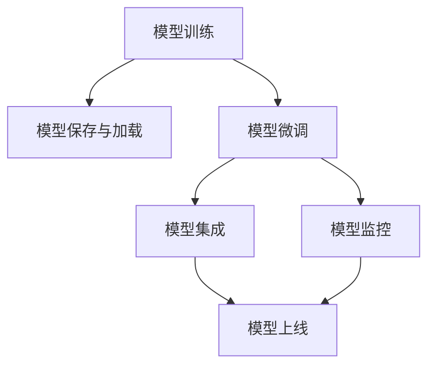

                 

# 机器学习模型部署：从训练到生产

> 关键词：机器学习模型部署, 模型训练, 模型评估, 模型微调, 模型集成, 模型监控, 模型上线

## 1. 背景介绍

### 1.1 问题由来
在人工智能领域，模型训练（Model Training）往往只占整个项目周期的一小部分，而模型部署（Model Deployment）才是最终目的。模型训练得到的结果需要能够稳定、可靠地服务于实际应用场景，这就需要对模型进行有效的部署和管理。

模型部署通常涉及以下几个关键环节：
1. 模型保存和加载：将训练好的模型保存为特定格式，便于后续加载使用。
2. 模型微调：根据具体应用场景，对模型进行微调，提升模型性能。
3. 模型集成：将多个模型进行组合，实现模型的功能增强。
4. 模型监控：实时监测模型的运行状态，及时发现并解决问题。
5. 模型上线：将模型集成到实际应用系统中，提供服务。

然而，由于这些环节的复杂性和多样性，模型部署通常面临诸多挑战。本文旨在系统性地介绍这些关键环节的实现方法，并给出具体实践中的建议和技巧，帮助开发者构建稳定、高效的模型部署系统。

### 1.2 问题核心关键点
模型部署的核心在于将训练好的模型，通过有效的技术手段，转化为实际应用中的服务，同时确保模型的稳定性和性能。主要包括以下几个关键点：
1. 模型保存与加载：选择合适的格式和位置，保证模型的可复现性和加载效率。
2. 模型微调：根据特定任务，对模型进行参数更新，提升模型精度。
3. 模型集成：通过组合多个模型，实现功能扩展和性能提升。
4. 模型监控：实时监控模型的运行状态，及时发现并解决异常问题。
5. 模型上线：将模型集成到实际应用系统中，提供高效、可靠的服务。

这些关键点共同构成了模型部署的技术框架，使得模型能够从训练到生产的全生命周期中，保持高水平的服务质量。

### 1.3 问题研究意义
模型部署是机器学习项目成功的关键环节，其质量直接影响应用的实际效果和用户体验。通过系统地介绍模型部署的技术，可以大大提升模型应用的成功率，推动人工智能技术的广泛落地。

1. 提升模型性能。通过模型微调和集成，能够更好地适应特定任务，提升模型精度。
2. 提高部署效率。通过自动化和标准化流程，减少人工干预，降低部署成本。
3. 增强系统稳定性。通过实时监控和异常检测，确保模型服务的稳定性和可靠性。
4. 促进模型普及。通过合理的部署策略，降低模型应用的技术门槛，加速人工智能技术的普及。
5. 优化用户体验。通过高效、可靠的模型服务，提升用户的满意度和使用体验。

## 2. 核心概念与联系

### 2.1 核心概念概述

为更好地理解模型部署的过程，本节将介绍几个关键的概念：

- 模型训练（Model Training）：通过数据和算法的训练过程，使得模型学习到输入与输出之间的映射关系。
- 模型保存与加载（Model Saving and Loading）：将训练好的模型保存为特定格式，便于后续加载使用。
- 模型微调（Model Fine-Tuning）：根据特定任务，对模型进行参数更新，提升模型精度。
- 模型集成（Model Ensemble）：通过组合多个模型，实现功能扩展和性能提升。
- 模型监控（Model Monitoring）：实时监测模型的运行状态，及时发现并解决异常问题。
- 模型上线（Model Deployment）：将模型集成到实际应用系统中，提供高效、可靠的服务。

这些核心概念之间的逻辑关系可以通过以下Mermaid流程图来展示：



这个流程图展示了模型部署的关键流程和技术点：

1. 模型训练得到初始模型。
2. 通过模型保存与加载，保存模型以便后续使用。
3. 根据特定任务，对模型进行微调，提升模型精度。
4. 通过模型集成，组合多个模型，实现功能扩展。
5. 实时监测模型运行状态，及时发现并解决异常问题。
6. 将模型集成到实际应用系统中，提供高效、可靠的服务。

这些概念共同构成了模型部署的技术框架，使得模型能够从训练到生产的全生命周期中，保持高水平的服务质量。

## 3. 核心算法原理 & 具体操作步骤
### 3.1 算法原理概述

模型部署的过程主要涉及模型保存与加载、模型微调、模型集成、模型监控和模型上线等关键环节。其核心原理是通过有效的技术手段，将训练好的模型转化为实际应用中的服务，同时确保模型的稳定性和性能。

### 3.2 算法步骤详解

#### 3.2.1 模型保存与加载

模型保存是将训练好的模型参数以特定格式保存，以便后续加载使用。常见的保存格式包括但不限于：

- TensorFlow模型格式：通过TensorFlow的`tf.saved_model`模块保存模型，可以保存为 SavedModel 格式。
- PyTorch模型格式：通过 PyTorch 的 `torch.save` 方法保存模型，可以保存为 pickle 格式。
- ONNX模型格式：通过 ONNX 工具将 PyTorch 模型转换为 ONNX 格式，支持多种深度学习框架和部署环境。

模型加载则是将保存的模型文件读取到内存中，以便进行推理或微调。常见的加载方法包括但不限于：

- TensorFlow模型加载：使用 TensorFlow 的 `tf.saved_model.load` 方法加载 SavedModel 格式的文件。
- PyTorch模型加载：使用 PyTorch 的 `torch.load` 方法加载 pickle 格式的文件。
- ONNX模型加载：使用 ONNX 工具将 ONNX 模型转换为对应的深度学习框架，然后进行加载。

#### 3.2.2 模型微调

模型微调是根据特定任务，对模型进行参数更新，提升模型精度。微调过程通常包括以下步骤：

1. 数据准备：收集特定任务的标注数据集，划分为训练集、验证集和测试集。
2. 模型选择：选择适用于特定任务的预训练模型或自定义模型。
3. 任务适配：根据任务类型，在预训练模型基础上设计合适的输出层和损失函数。
4. 训练过程：使用标注数据集对模型进行有监督的微调，更新模型参数。
5. 模型评估：在验证集上评估模型性能，根据评估结果进行参数调整。
6. 测试与上线：在测试集上评估微调后的模型性能，将模型上线提供服务。

#### 3.2.3 模型集成

模型集成是通过组合多个模型，实现功能扩展和性能提升。常见的模型集成方法包括但不限于：

- 投票集成：多个模型的输出结果进行投票，最终结果取多数。
- 权重集成：根据模型性能，赋予不同的权重，加权平均得到最终结果。
- 串行集成：多个模型依次进行推理，得到最终结果。
- 并行集成：多个模型并行进行推理，得到最终结果。

#### 3.2.4 模型监控

模型监控是实时监测模型的运行状态，及时发现并解决异常问题。常见的模型监控方法包括但不限于：

- 日志记录：记录模型的运行日志，便于问题定位和分析。
- 性能监控：监测模型的推理速度和内存占用，保证模型服务的高效性。
- 异常检测：使用机器学习算法或规则引擎，检测模型推理的异常结果。
- 告警系统：建立告警机制，在检测到异常时自动发送告警信息。

#### 3.2.5 模型上线

模型上线是将模型集成到实际应用系统中，提供高效、可靠的服务。常见的模型上线方法包括但不限于：

- RESTful API：通过 RESTful API 提供模型的服务接口，支持多种客户端调用。
- Web 应用：将模型嵌入到 Web 应用中，提供浏览器访问服务。
- 移动应用：将模型集成到移动应用中，提供移动端服务。

### 3.3 算法优缺点

模型部署技术具有以下优点：

1. 提高模型性能。通过模型微调和集成，能够更好地适应特定任务，提升模型精度。
2. 提高部署效率。通过自动化和标准化流程，减少人工干预，降低部署成本。
3. 增强系统稳定性。通过实时监控和异常检测，确保模型服务的稳定性和可靠性。
4. 促进模型普及。通过合理的部署策略，降低模型应用的技术门槛，加速人工智能技术的普及。
5. 优化用户体验。通过高效、可靠的模型服务，提升用户的满意度和使用体验。

同时，模型部署技术也存在以下缺点：

1. 对数据质量要求高。模型微调和集成需要高质量的数据支持，数据的获取和预处理成本较高。
2. 模型复杂度高。大规模模型的部署和维护需要较高的技术门槛和资源投入。
3. 模型更新难度大。模型更新通常需要重新部署和微调，过程繁琐。
4. 模型安全风险高。模型的数据泄露和攻击风险较高，需要严格的保护措施。

尽管存在这些缺点，但就目前而言，模型部署技术仍然是人工智能应用的关键环节，对于模型的性能提升和服务稳定具有重要意义。

### 3.4 算法应用领域

模型部署技术已经广泛应用于各种人工智能应用领域，包括但不限于：

- 智能客服：通过模型部署，实现智能客服系统的高效运转，提升用户满意度。
- 金融风控：通过模型部署，实现金融风控系统的实时监测和预警，降低风险。
- 医疗诊断：通过模型部署，实现医疗诊断系统的自动化，提高诊断准确性。
- 自动驾驶：通过模型部署，实现自动驾驶系统的实时决策，保证行车安全。
- 推荐系统：通过模型部署，实现推荐系统的个性化推荐，提升用户体验。

## 4. 数学模型和公式 & 详细讲解  
### 4.1 数学模型构建

模型部署的过程涉及多个环节，包括模型保存、微调、集成、监控和上线等。以下将以机器学习模型为例，给出模型部署的数学模型构建。

假设模型的输入为 $x$，输出为 $y$，模型的权重参数为 $\theta$。模型训练过程可以表示为：

$$
\theta^* = \mathop{\arg\min}_{\theta} \frac{1}{N}\sum_{i=1}^N [y_i - f(x_i; \theta)]^2
$$

其中 $f(x; \theta)$ 为模型对输入 $x$ 的预测函数，$y_i$ 为第 $i$ 个样本的真实标签，$N$ 为样本数量。

### 4.2 公式推导过程

以下我们以线性回归为例，推导模型保存、微调、集成和监控的数学公式。

假设模型为线性回归模型 $f(x; \theta) = \theta_0 + \theta_1 x_1 + \theta_2 x_2 + \ldots + \theta_n x_n$，其中 $\theta = (\theta_0, \theta_1, \theta_2, \ldots, \theta_n)$。

**模型保存：**
将模型参数 $\theta$ 保存为文件或数据库，便于后续加载。保存格式为 pickle 或 csv。

**模型微调：**
假设微调数据集为 $D = \{(x_i, y_i)\}_{i=1}^N$，微调过程可以表示为：

$$
\theta^* = \mathop{\arg\min}_{\theta} \frac{1}{N}\sum_{i=1}^N [y_i - f(x_i; \theta)]^2
$$

通过梯度下降算法更新参数，得到最优解 $\theta^*$。

**模型集成：**
假设集成多个模型 $f_1(x; \theta_1), f_2(x; \theta_2), \ldots, f_m(x; \theta_m)$，集成函数为 $F(x; \Theta) = \sum_{i=1}^m \alpha_i f_i(x; \theta_i)$，其中 $\alpha_i$ 为模型的权重系数，$\Theta$ 为模型集成的参数。

**模型监控：**
假设模型在时间 $t$ 时的状态为 $s_t$，模型监控的目标是：

$$
\mathop{\arg\min}_{s_t} \sum_{t=1}^T L(s_t, s_{t-1})
$$

其中 $L(s_t, s_{t-1})$ 为监控指标，如推理时间、内存占用等。

### 4.3 案例分析与讲解

**案例：智能客服系统**

智能客服系统通过模型部署，实现智能客服的高效运转。具体步骤如下：

1. 数据准备：收集历史客服数据，划分为训练集、验证集和测试集。
2. 模型选择：选择预训练的BERT模型，并进行微调。
3. 任务适配：添加分类器，使用交叉熵损失函数。
4. 训练过程：在训练集上进行有监督的微调。
5. 模型评估：在验证集上评估模型性能，调整参数。
6. 测试与上线：在测试集上评估模型性能，将模型上线提供服务。

## 5. 项目实践：代码实例和详细解释说明
### 5.1 开发环境搭建

在进行模型部署实践前，我们需要准备好开发环境。以下是使用Python进行TensorFlow和PyTorch开发的环境配置流程：

1. 安装Anaconda：从官网下载并安装Anaconda，用于创建独立的Python环境。

2. 创建并激活虚拟环境：
```bash
conda create -n pytensor-env python=3.8 
conda activate pytensor-env
```

3. 安装TensorFlow和PyTorch：根据CUDA版本，从官网获取对应的安装命令。例如：
```bash
conda install tensorflow tensorflow-gpu=2.8 -c tf -c conda-forge
pip install torch torchvision torchaudio cudatoolkit=11.1 -c pytorch -c conda-forge
```

4. 安装各类工具包：
```bash
pip install numpy pandas scikit-learn matplotlib tqdm jupyter notebook ipython
```

完成上述步骤后，即可在`pytensor-env`环境中开始模型部署实践。

### 5.2 源代码详细实现

下面我们以线性回归模型为例，给出使用TensorFlow和PyTorch进行模型部署的PyTorch代码实现。

首先，定义线性回归模型的代码：

```python
import torch
import torch.nn as nn

class LinearRegression(nn.Module):
    def __init__(self, input_size, output_size):
        super(LinearRegression, self).__init__()
        self.linear = nn.Linear(input_size, output_size)
    
    def forward(self, x):
        y_pred = self.linear(x)
        return y_pred
```

然后，定义模型保存和加载的代码：

```python
import torch

# 保存模型
model = LinearRegression(3, 1)
torch.save(model.state_dict(), 'model.pth')

# 加载模型
model = LinearRegression(3, 1)
model.load_state_dict(torch.load('model.pth'))
```

接着，定义模型微调的代码：

```python
import torch
import torch.nn as nn
import torch.optim as optim

# 加载模型
model = LinearRegression(3, 1)
model.load_state_dict(torch.load('model.pth'))

# 定义优化器和损失函数
optimizer = optim.SGD(model.parameters(), lr=0.01)
criterion = nn.MSELoss()

# 数据准备
X_train = torch.randn(100, 3)
y_train = 2 * X_train[:, 0] + 1 * X_train[:, 1] + 3 * X_train[:, 2] + torch.randn(100, 1)
X_test = torch.randn(10, 3)
y_test = 2 * X_test[:, 0] + 1 * X_test[:, 1] + 3 * X_test[:, 2] + torch.randn(10, 1)

# 微调过程
for epoch in range(100):
    optimizer.zero_grad()
    y_pred = model(X_train)
    loss = criterion(y_pred, y_train)
    loss.backward()
    optimizer.step()

    y_pred = model(X_test)
    loss = criterion(y_pred, y_test)
    print('Epoch {}: Loss = {:.4f}'.format(epoch+1, loss.item()))
```

最后，定义模型集成的代码：

```python
import torch
import torch.nn as nn

# 定义两个模型
model1 = LinearRegression(3, 1)
model2 = LinearRegression(3, 1)

# 集成函数
def ensemble(X):
    y_pred1 = model1(X)
    y_pred2 = model2(X)
    y_pred = 0.5 * y_pred1 + 0.5 * y_pred2
    return y_pred
```

### 5.3 代码解读与分析

让我们再详细解读一下关键代码的实现细节：

**LinearRegression类**：
- `__init__`方法：初始化模型参数。
- `forward`方法：定义模型前向传播过程。

**模型保存和加载**：
- `torch.save`和`torch.load`方法：用于模型的保存和加载。

**模型微调**：
- `optim.SGD`优化器：定义优化器的参数和超参数。
- `nn.MSELoss`损失函数：定义损失函数。
- 数据准备：定义训练集和测试集。
- 微调过程：通过循环迭代，更新模型参数。

**模型集成**：
- `ensemble`函数：定义集成函数，将两个模型的输出进行线性加权。

以上代码展示了模型部署的关键步骤，包括保存和加载、微调、集成等。开发者可以根据具体任务，灵活调整模型参数和训练过程，实现高效的模型部署。

## 6. 实际应用场景
### 6.1 智能客服系统

智能客服系统通过模型部署，实现智能客服的高效运转。具体步骤如下：

1. 数据准备：收集历史客服数据，划分为训练集、验证集和测试集。
2. 模型选择：选择预训练的BERT模型，并进行微调。
3. 任务适配：添加分类器，使用交叉熵损失函数。
4. 训练过程：在训练集上进行有监督的微调。
5. 模型评估：在验证集上评估模型性能，调整参数。
6. 测试与上线：在测试集上评估模型性能，将模型上线提供服务。

### 6.2 金融风控

金融风控系统通过模型部署，实现风险预测和预警。具体步骤如下：

1. 数据准备：收集金融数据，划分为训练集、验证集和测试集。
2. 模型选择：选择预训练的XGBoost模型，并进行微调。
3. 任务适配：添加分类器，使用交叉熵损失函数。
4. 训练过程：在训练集上进行有监督的微调。
5. 模型评估：在验证集上评估模型性能，调整参数。
6. 测试与上线：在测试集上评估模型性能，将模型上线提供服务。

### 6.3 医疗诊断

医疗诊断系统通过模型部署，实现疾病预测和诊断。具体步骤如下：

1. 数据准备：收集医疗数据，划分为训练集、验证集和测试集。
2. 模型选择：选择预训练的CNN模型，并进行微调。
3. 任务适配：添加分类器，使用交叉熵损失函数。
4. 训练过程：在训练集上进行有监督的微调。
5. 模型评估：在验证集上评估模型性能，调整参数。
6. 测试与上线：在测试集上评估模型性能，将模型上线提供服务。

### 6.4 未来应用展望

随着模型部署技术的不断发展，未来模型部署将呈现以下几个趋势：

1. 自动化部署：通过自动化工具，减少人工干预，提升部署效率。
2. 边缘计算：将模型部署在边缘设备上，降低延迟和带宽消耗。
3. 微服务架构：将模型部署为微服务，便于扩展和维护。
4. 模型压缩和优化：通过模型压缩和优化技术，降低模型大小和推理速度。
5. 联邦学习：在分布式环境中，通过联邦学习技术，实现模型联合优化。

这些趋势将进一步提升模型部署的效率和稳定性，使得模型能够更好地服务于实际应用。

## 7. 工具和资源推荐
### 7.1 学习资源推荐

为了帮助开发者系统掌握模型部署的理论基础和实践技巧，这里推荐一些优质的学习资源：

1. 《深度学习实战》系列书籍：深入浅出地介绍了深度学习模型的训练、微调、集成和部署，适合初学者和进阶者。
2. TensorFlow官方文档：包含TensorFlow的模型保存、微调、集成、监控和部署等详细指南，是官方推荐的文档。
3. PyTorch官方文档：包含PyTorch的模型保存、微调、集成、监控和部署等详细指南，是官方推荐的文档。
4. 《深度学习框架入门》在线课程：介绍多种深度学习框架的模型部署方法，适合初学者和进阶者。
5. 《机器学习实战》书籍：介绍了多种机器学习模型的训练、微调、集成和部署方法，适合初学者和进阶者。

通过对这些资源的学习实践，相信你一定能够系统掌握模型部署的技术，并将其应用于实际项目中。

### 7.2 开发工具推荐

高效的开发离不开优秀的工具支持。以下是几款用于模型部署开发的常用工具：

1. TensorFlow Serving：由Google开发的模型服务框架，支持多种模型格式和部署环境，适合大规模生产环境。
2. Flask：Python的轻量级Web框架，适合快速搭建模型服务接口。
3. FastAPI：Python的异步Web框架，支持多种模型格式和部署环境，适合高性能模型服务。
4. Docker：通过容器化技术，实现模型的打包和部署，支持多平台运行。
5. Kubernetes：基于容器编排的开源平台，实现模型的自动化部署和扩展。

合理利用这些工具，可以显著提升模型部署的效率和稳定性，加快模型服务的部署速度。

### 7.3 相关论文推荐

模型部署技术的发展源于学界的持续研究。以下是几篇奠基性的相关论文，推荐阅读：

1. 《TensorFlow: A System for Large-Scale Machine Learning》：介绍TensorFlow模型的保存、微调、集成和部署等核心技术。
2. 《PyTorch: Accelerating Deep Learning Research》：介绍PyTorch模型的保存、微调、集成和部署等核心技术。
3. 《Model-Based Recommender Systems》：介绍推荐系统的模型保存、微调、集成和部署等核心技术。
4. 《Effective Model Deployment Strategies for Real-World AI Applications》：总结了多种模型部署策略，适用于实际应用场景。
5. 《Hyperparameter Optimization in Machine Learning: A Survey》：总结了多种模型超参数优化方法，提升模型部署的效率和性能。

这些论文代表了大模型部署技术的发展脉络。通过学习这些前沿成果，可以帮助研究者把握学科前进方向，激发更多的创新灵感。

## 8. 总结：未来发展趋势与挑战

### 8.1 总结

本文对模型部署的过程进行了系统性的介绍，涵盖模型保存、微调、集成、监控和上线等多个关键环节。通过详细的案例分析和代码示例，帮助开发者掌握模型部署的实现方法，并给出了具体实践中的建议和技巧。

模型部署是机器学习项目成功的关键环节，其质量直接影响应用的实际效果和用户体验。通过系统地介绍模型部署的技术，可以大大提升模型应用的成功率，推动人工智能技术的广泛落地。

### 8.2 未来发展趋势

展望未来，模型部署技术将呈现以下几个趋势：

1. 自动化部署：通过自动化工具，减少人工干预，提升部署效率。
2. 边缘计算：将模型部署在边缘设备上，降低延迟和带宽消耗。
3. 微服务架构：将模型部署为微服务，便于扩展和维护。
4. 模型压缩和优化：通过模型压缩和优化技术，降低模型大小和推理速度。
5. 联邦学习：在分布式环境中，通过联邦学习技术，实现模型联合优化。

这些趋势将进一步提升模型部署的效率和稳定性，使得模型能够更好地服务于实际应用。

### 8.3 面临的挑战

尽管模型部署技术已经取得了一定的进展，但在实际应用中仍然面临诸多挑战：

1. 对数据质量要求高。模型微调和集成需要高质量的数据支持，数据的获取和预处理成本较高。
2. 模型复杂度高。大规模模型的部署和维护需要较高的技术门槛和资源投入。
3. 模型更新难度大。模型更新通常需要重新部署和微调，过程繁琐。
4. 模型安全风险高。模型的数据泄露和攻击风险较高，需要严格的保护措施。

尽管存在这些挑战，但模型部署技术仍然是人工智能应用的关键环节，对于模型的性能提升和服务稳定具有重要意义。

### 8.4 研究展望

面对模型部署所面临的种种挑战，未来的研究需要在以下几个方面寻求新的突破：

1. 探索无监督和半监督微调方法。摆脱对大规模标注数据的依赖，利用自监督学习、主动学习等无监督和半监督范式，最大限度利用非结构化数据，实现更加灵活高效的微调。
2. 研究参数高效和计算高效的微调范式。开发更加参数高效的微调方法，在固定大部分预训练参数的同时，只更新极少量的任务相关参数。同时优化微调模型的计算图，减少前向传播和反向传播的资源消耗，实现更加轻量级、实时性的部署。
3. 融合因果和对比学习范式。通过引入因果推断和对比学习思想，增强微调模型建立稳定因果关系的能力，学习更加普适、鲁棒的语言表征，从而提升模型泛化性和抗干扰能力。
4. 引入更多先验知识。将符号化的先验知识，如知识图谱、逻辑规则等，与神经网络模型进行巧妙融合，引导微调过程学习更准确、合理的语言模型。同时加强不同模态数据的整合，实现视觉、语音等多模态信息与文本信息的协同建模。
5. 结合因果分析和博弈论工具。将因果分析方法引入微调模型，识别出模型决策的关键特征，增强输出解释的因果性和逻辑性。借助博弈论工具刻画人机交互过程，主动探索并规避模型的脆弱点，提高系统稳定性。
6. 纳入伦理道德约束。在模型训练目标中引入伦理导向的评估指标，过滤和惩罚有偏见、有害的输出倾向。同时加强人工干预和审核，建立模型行为的监管机制，确保输出符合人类价值观和伦理道德。

这些研究方向的探索，必将引领模型部署技术迈向更高的台阶，为构建安全、可靠、可解释、可控的智能系统铺平道路。面向未来，模型部署技术还需要与其他人工智能技术进行更深入的融合，如知识表示、因果推理、强化学习等，多路径协同发力，共同推动自然语言理解和智能交互系统的进步。只有勇于创新、敢于突破，才能不断拓展语言模型的边界，让智能技术更好地造福人类社会。

## 9. 附录：常见问题与解答

**Q1：模型保存与加载时需要注意哪些细节？**

A: 模型保存与加载是模型部署的第一步，需要注意以下细节：

1. 选择合适保存格式。常见的格式包括pickle、torch、ONNX等，需要根据具体情况选择。
2. 保存时设置参数名。在保存时设置参数名，便于后续加载使用。
3. 加载时确保模型一致。加载时检查保存和加载的模型参数是否一致，防止模型偏差。

**Q2：模型微调时如何选择优化器和学习率？**

A: 模型微调时，优化器和超参数的选择对模型性能影响较大。常用的优化器包括SGD、Adam、Adagrad等，一般建议选择Adam优化器。学习率的选择通常从0.001开始调参，逐步减小。

**Q3：模型集成时需要注意哪些问题？**

A: 模型集成时需要注意以下问题：

1. 选择合适集成方法。常见的集成方法包括投票、权重、串行、并行等，需要根据具体情况选择。
2. 调整模型权重。根据模型性能，调整各个模型的权重，提升集成效果。
3. 处理模型冲突。集成多个模型时，可能会存在模型输出不一致的问题，需要处理模型冲突。

**Q4：模型监控时需要注意哪些细节？**

A: 模型监控时需要注意以下细节：

1. 记录运行日志。记录模型的运行日志，便于问题定位和分析。
2. 监测关键指标。监测模型的推理速度、内存占用等关键指标，保证模型服务的高效性。
3. 检测异常结果。使用机器学习算法或规则引擎，检测模型推理的异常结果。
4. 建立告警机制。建立告警机制，在检测到异常时自动发送告警信息。

**Q5：模型上线时需要注意哪些问题？**

A: 模型上线时需要注意以下问题：

1. 选择合适服务方式。常见的服务方式包括RESTful API、Web应用、移动应用等，需要根据具体情况选择。
2. 部署前进行测试。在部署前进行全面测试，确保模型服务的稳定性和可靠性。
3. 部署后进行监控。部署后持续监测模型服务，及时发现并解决异常问题。

综上所述，模型部署是一个复杂但至关重要的环节，涉及到模型保存、微调、集成、监控和上线等多个方面。通过系统地掌握这些技术，可以大大提升模型应用的效率和效果，推动人工智能技术的广泛落地。

---

作者：禅与计算机程序设计艺术 / Zen and the Art of Computer Programming

