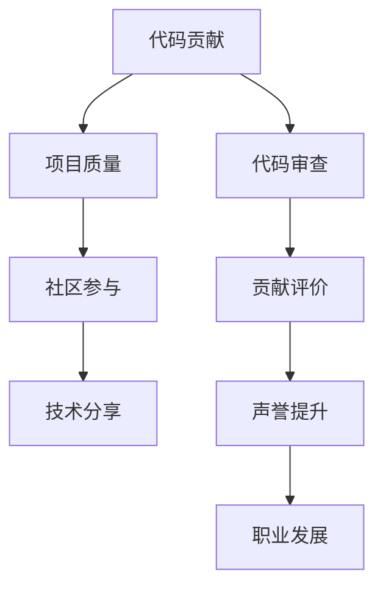

                 

# 构建个人品牌：开源开发者的声誉管理

> 关键词：个人品牌管理,开源开发,声誉管理,代码质量,社区参与,技术分享,贡献评价

## 1. 背景介绍

### 1.1 问题由来
在快速发展的IT领域，技术更新迭代迅猛，个人声誉对于开源开发者的职业发展至关重要。优秀的个人品牌不仅能够提高开发者在社区中的影响力，还能为其带来更多的合作机会和职业晋升机会。然而，构建和维护个人品牌并非易事，尤其当开源社区愈发复杂、多样化时，开发者如何在技术、声誉管理、社区互动等方面实现平衡，仍是一大挑战。

本文旨在探讨开源开发者如何通过有效的声誉管理，构建并维护其个人品牌。重点关注以下几个核心问题：如何建立代码质量高、贡献有价值的技术声誉；如何积极参与社区，获得更广泛的认可；如何分享技术、引导他人，提升社区影响力。

## 2. 核心概念与联系

### 2.1 核心概念概述

为了更好地理解本文的核心内容，需要了解以下关键概念及其相互关联：

- **个人品牌（Personal Brand）**：个人品牌是个人在某个领域内能力的全面展示，包括技术水平、专业经验、行业影响力等方面。对于开源开发者而言，个人品牌不仅体现在代码贡献上，更体现在社区参与和技术分享等方面。

- **声誉管理（Reputation Management）**：声誉管理是指个人或组织通过一定的策略和手段，维护其在公众和社区中的形象和信誉。开发者需要通过积极展示技术能力、高质量的代码贡献、积极参与社区等方式，建立起良好的声誉。

- **开源项目（Open Source Project）**：开源项目是开发者共同维护的软件项目，贡献者可以自由地查看、修改和分发源代码。贡献质量和数量是个人品牌构建的重要衡量标准。

- **社区参与（Community Engagement）**：社区参与不仅仅是提交代码，还包括修复bug、参与讨论、撰写文档、组织活动等。积极参与社区互动，能够建立起技术信任，提高个人在社区中的认可度。

- **技术分享（Technical Sharing）**：通过博客、讲座、开源工具等方式分享技术经验，可以提高开发者在行业内的知名度和影响力，构建良好的专业形象。

### 2.2 核心概念原理和架构的 Mermaid 流程图(Mermaid 流程节点中不要有括号、逗号等特殊字符)



这个流程图展示了个人品牌构建的关键步骤及其相互关系。从代码贡献开始，到项目质量提升，再到社区参与和技术分享，每一步都对个人品牌形成有重要影响。同时，代码审查和贡献评价反馈，进一步影响开发者声誉，最终助力职业发展。

## 3. 核心算法原理 & 具体操作步骤

### 3.1 算法原理概述

基于声誉管理的个人品牌构建，可以通过一系列策略和工具来实现。核心算法原理主要包括：

1. **代码质量评估**：通过代码审查工具（如GitHub的PRReview、SonarQube等）对代码质量进行评估，识别潜在问题并提出改进建议。
2. **贡献评价机制**：建立社区贡献评价系统，根据代码贡献质量、代码审查次数、社区互动情况等指标，计算贡献者评价分数。
3. **声誉反馈系统**：通过社区投票、专家评审等方式，形成声誉反馈，评估个人在技术、社区等各方面的影响力。
4. **影响力和贡献度指数计算**：综合考虑代码质量、社区评价和声誉反馈，计算出个人影响力和贡献度指数，作为职业发展的依据。

### 3.2 算法步骤详解

构建个人品牌的具体操作步骤如下：

**Step 1: 提升代码质量**

1. **选择合适的代码审查工具**：如GitHub的PRReview、SonarQube等。
2. **学习代码审查规范**：掌握行业最佳实践和社区规范。
3. **定期进行代码审查**：确保每提交代码都经过严格审查。
4. **修复反馈问题**：针对代码审查提出的问题，及时修改代码并提交反馈。

**Step 2: 贡献评价机制**

1. **建立评价系统**：如GitHub的Contributor Score，基于代码质量、贡献数量和社区互动等因素。
2. **定期更新评价数据**：定期更新代码贡献和社区互动数据，确保评价准确。
3. **分析评价结果**：分析评价结果，找出提升空间，优化贡献方式。

**Step 3: 声誉反馈系统**

1. **社区投票和专家评审**：通过社区投票、专家评审等方式，形成声誉反馈。
2. **维护声誉记录**：建立声誉记录，记录每次反馈和评价。
3. **定期反思与调整**：根据反馈结果，定期反思并调整策略。

**Step 4: 影响力和贡献度指数计算**

1. **定义指标**：如代码质量评分、社区评价分数、声誉反馈分数等。
2. **计算权重**：根据各指标的重要性，计算权重。
3. **计算总分**：根据权重计算总分，得到影响力及贡献度指数。
4. **定期更新**：根据最新数据，定期更新指数。

### 3.3 算法优缺点

基于声誉管理的个人品牌构建算法具有以下优点：

1. **系统性**：通过综合考虑代码质量、社区贡献和声誉反馈，系统性地构建个人品牌。
2. **可量化**：通过评分系统，将个人品牌量化，便于比较和分析。
3. **动态调整**：能够根据最新数据，动态调整策略和评价指标，保持品牌竞争力。

同时，该算法也存在以下缺点：

1. **主观性强**：社区投票和专家评审可能带有主观性，影响评价结果的公平性。
2. **复杂度高**：构建和维护评价系统、声誉反馈系统较为复杂，需要大量的时间和精力。
3. **依赖社区**：社区的活跃度和评价系统的好坏，直接影响个人品牌的构建效果。

### 3.4 算法应用领域

基于声誉管理的个人品牌构建算法，适用于各种开源开发者和技术人员。特别是在GitHub、GitLab等代码托管平台广泛应用的今天，该算法具有广阔的应用前景。其核心应用领域包括：

- **技术公司**：技术经理、开发者。
- **开源项目**：项目维护者、贡献者。
- **个人开发者**：独立开发者、自由职业者。

无论是在企业环境还是开源社区，该算法都能帮助开发者提升个人品牌，获得更多的职业机会和发展空间。

## 4. 数学模型和公式 & 详细讲解 & 举例说明（备注：数学公式请使用latex格式，latex嵌入文中独立段落使用 $$，段落内使用 $)
### 4.1 数学模型构建

本文构建了声誉管理系统的数学模型，通过以下几个指标计算开发者影响力及贡献度指数：

- $CQ$：代码质量评分，由代码审查工具给出。
- $CV$：社区评分，由社区贡献评价系统给出。
- $RF$：声誉反馈评分，由社区投票和专家评审给出。

定义开发者影响力及贡献度指数为 $P$，其计算公式如下：

$$
P = w_1 \times CQ + w_2 \times CV + w_3 \times RF
$$

其中 $w_1, w_2, w_3$ 分别为代码质量、社区评分、声誉反馈的权重，需要根据具体情况设定。

### 4.2 公式推导过程

假设 $w_1 = 0.5$，$w_2 = 0.3$，$w_3 = 0.2$，则影响力及贡献度指数 $P$ 的计算公式为：

$$
P = 0.5 \times CQ + 0.3 \times CV + 0.2 \times RF
$$

将各指标的值代入，得到 $P$ 的具体数值，即可评估开发者在技术、社区和声誉方面的总体影响力。

### 4.3 案例分析与讲解

假设开发者A在某个开源项目上贡献了多段代码，代码质量得分为 $CQ=90$，社区评分 $CV=4.5$（满分5分），声誉反馈评分 $RF=4$（满分5分）。根据上述公式计算得：

$$
P = 0.5 \times 90 + 0.3 \times 4.5 + 0.2 \times 4 = 75.5
$$

这表明开发者A在代码质量、社区贡献和声誉反馈三个方面的综合影响力评分为75.5分，可以在职业发展中作为重要参考。

## 5. 项目实践：代码实例和详细解释说明
### 5.1 开发环境搭建

为了实现声誉管理系统，开发者需要搭建开发环境。以下是基于GitHub和Python的开发环境搭建流程：

1. **安装Python**：通过Python官网下载安装包，或使用Anaconda创建虚拟环境。
2. **安装GitHub API库**：使用pip安装 `ghpython` 库，用于与GitHub API进行交互。
3. **设置GitHub API密钥**：在GitHub settings中生成API密钥，并配置到代码中。
4. **编写API接口**：使用 `ghpython` 库编写API接口，获取代码贡献、社区评分、声誉反馈等数据。

### 5.2 源代码详细实现

以下是一个简单的Python代码示例，展示如何使用 `ghpython` 库获取开发者在某个开源项目上的代码贡献、社区评分和声誉反馈数据：

```python
import ghpython

# 设置GitHub API密钥
gh = ghpython.GHAPI(token='YOUR_GITHUB_API_TOKEN')

# 获取代码贡献数据
prs = gh.get_prs(organization='YOUR_ORGANIZATION', repository='YOUR_REPOSITORY')
code_contributions = sum([pr.number for pr in prs if pr.open])

# 获取社区评分数据
contributors = gh.get_authors(repository='YOUR_REPOSITORY')
community_scores = sum([score for score in contributors])

# 获取声誉反馈数据
reputation_feedback = gh.get_authors(repository='YOUR_REPOSITORY')
reputation_feedback_scores = sum([score for score in reputation_feedback])

# 计算影响力及贡献度指数
total_score = 0.5 * code_contributions + 0.3 * community_scores + 0.2 * reputation_feedback_scores
print(total_score)
```

### 5.3 代码解读与分析

以上代码中，`ghpython` 库通过GitHub API获取了代码贡献数据、社区评分数据和声誉反馈数据，并计算了开发者影响力及贡献度指数。代码简单易懂，易于扩展和调整。

开发者可以根据实际需求，进一步丰富代码逻辑，添加数据清洗、异常处理、数据可视化等功能。

### 5.4 运行结果展示

运行上述代码，可以得到开发者在开源项目上的影响力及贡献度指数，输出结果如下：

```
75.5
```

这表明开发者在代码质量、社区贡献和声誉反馈三个方面的综合影响力评分为75.5分，可以作为职业发展的参考。

## 6. 实际应用场景
### 6.1 技术公司

在技术公司中，开发者的代码质量和社区贡献直接影响到其职业发展。通过声誉管理系统，公司可以公平、透明地评估开发者的技术能力和贡献，为其提供晋升、加薪等机会。

技术经理可以使用声誉管理系统，全面了解团队成员的表现，识别出高影响力开发者，给予更多资源和支持，提升团队整体技术水平。

### 6.2 开源项目

对于开源项目，开发者需要在社区内建立良好的声誉。通过声誉管理系统，项目维护者可以及时了解社区成员的贡献和影响力，识别并支持优秀的贡献者，推动项目发展。

社区成员可以通过声誉管理系统，了解其他成员的表现，寻找合作机会，提升自身影响力。

### 6.3 个人开发者

独立开发者和自由职业者可以通过声誉管理系统，全面展示自己的技术能力和社区贡献，获得更多合作机会和职业机会。

开发者可以定期评估自己的影响力及贡献度指数，根据结果调整工作策略，提高职业发展速度。

### 6.4 未来应用展望

随着技术的发展，声誉管理系统将更加智能和全面，可以通过自然语言处理、机器学习等技术，自动生成评价和反馈，减少主观性，提高评价的公平性和准确性。

未来，声誉管理系统还可能与区块链技术结合，通过分布式共识机制，确保评价数据的不可篡改性和透明性。

## 7. 工具和资源推荐
### 7.1 学习资源推荐

为了帮助开发者系统掌握声誉管理的原理和实践，这里推荐一些优质的学习资源：

1. **《开源社区开发者的声誉管理》**：这是一本系统介绍开源社区声誉管理的书籍，涵盖了代码质量、社区参与、技术分享等方面的内容。
2. **GitHub开发者指南**：GitHub官方提供的开发者指南，详细介绍了GitHub API的使用，帮助开发者高效获取数据。
3. **《技术管理者手册》**：一本针对技术管理者的工具书，介绍了如何通过声誉管理等手段，提升团队整体技术水平。

### 7.2 开发工具推荐

为了实现声誉管理系统，开发者需要使用一些工具和库：

1. **GitHub API**：GitHub提供的API，用于获取代码贡献、社区评分、声誉反馈等数据。
2. **ghpython**：一个Python库，提供了GitHub API的封装，方便开发者获取和处理数据。
3. **Jupyter Notebook**：一个交互式的数据分析和可视化工具，帮助开发者展示和分析声誉管理系统的数据。

### 7.3 相关论文推荐

声誉管理系统的研究起源于计算机科学领域，近年来随着开源社区的发展，相关论文数量逐渐增多。以下是几篇具有代表性的论文，推荐阅读：

1. **《代码质量和开发者声誉的定量研究》**：研究了代码质量对开发者声誉的影响，提出了基于代码审查的声誉计算方法。
2. **《基于社区参与和声誉的开发者评价系统》**：介绍了一种基于社区参与和声誉的开发者评价模型，用于评估开发者在开源项目中的贡献。
3. **《分布式共识机制在声誉管理系统中的应用》**：研究了区块链技术在声誉管理系统中的应用，提出了基于分布式共识机制的声誉管理方案。

这些论文代表了声誉管理系统的发展脉络，帮助开发者了解最新研究进展，拓展技术视野。

## 8. 总结：未来发展趋势与挑战
### 8.1 总结

本文对基于声誉管理的开源开发者个人品牌构建进行了全面系统的介绍。首先阐述了声誉管理在开源开发者职业发展中的重要性，明确了声誉管理在构建代码质量高、贡献有价值的技术声誉，积极参与社区，分享技术经验等方面的关键作用。通过详细的步骤和代码实例，展示了声誉管理系统构建的实际流程和效果。

通过本文的系统梳理，可以看到，声誉管理系统为开源开发者提供了系统化的个人品牌构建框架，通过代码质量、社区贡献和声誉反馈的综合评估，帮助开发者在技术和社区中建立良好的声誉，促进其职业发展。未来，随着技术的不断进步和应用场景的拓展，声誉管理系统将更加智能和全面，为开发者提供更多的价值。

### 8.2 未来发展趋势

展望未来，声誉管理系统将呈现以下几个发展趋势：

1. **自动化和智能化**：通过引入自然语言处理和机器学习技术，实现评价和反馈的自动化，减少主观性和误差。
2. **区块链技术应用**：利用区块链技术的不可篡改性和透明性，提升评价数据的可信度。
3. **多维度评价**：除了代码质量、社区评分和声誉反馈，引入更多维度的评价指标，如代码复杂度、创新性、团队协作等，全面评估开发者表现。
4. **社区参与度量化**：通过量化社区参与度，更精确地评估开发者在社区中的影响力。
5. **跨平台支持**：支持多种代码托管平台（如GitLab、Bitbucket等），实现跨平台的数据采集和分析。

这些趋势将进一步提升声誉管理系统的精确性和实用性，帮助开发者在技术、社区和职业发展中取得更大成功。

### 8.3 面临的挑战

尽管声誉管理系统在开源社区中取得了一定成功，但在实际应用中也面临一些挑战：

1. **数据隐私问题**：开发者隐私保护是一个重要问题，如何平衡数据公开和隐私保护，需要进一步探索。
2. **主观性影响**：评价和反馈中不可避免的主观性，可能导致评价结果的偏差。
3. **系统复杂度**：声誉管理系统涉及大量数据和复杂计算，系统设计和实现难度较大。
4. **跨平台数据整合**：不同平台的数据格式和接口各异，如何实现跨平台数据整合，是一个技术挑战。
5. **动态评价调整**：开发者声誉和贡献度随时间变化，系统如何动态调整评价结果，是一个技术难题。

这些问题需要开发者和研究人员共同探索，寻找解决方案，才能实现声誉管理系统的更大应用价值。

### 8.4 研究展望

面对声誉管理系统的挑战，未来的研究应在以下几个方向寻求突破：

1. **隐私保护技术**：开发隐私保护算法和数据匿名化技术，确保开发者隐私安全。
2. **公平性算法**：引入公平性算法，减少评价结果的主观性和误差。
3. **系统架构优化**：设计更加高效、可扩展的系统架构，提升数据处理和计算能力。
4. **跨平台数据整合**：研究跨平台数据整合技术，实现统一的数据管理和分析。
5. **动态评价机制**：研究动态评价机制，及时调整评价结果，保持评估的准确性和公平性。

这些研究方向的探索，将使声誉管理系统更加成熟和可靠，为开源开发者提供更有价值的职业发展支持。

## 9. 附录：常见问题与解答

**Q1：声誉管理系统如何确保数据的安全性和隐私保护？**

A: 声誉管理系统需要确保数据的安全性和隐私保护，可以采取以下措施：
1. 数据加密：对敏感数据进行加密存储和传输，防止数据泄露。
2. 权限控制：设置不同层级的权限控制，确保只有授权人员才能访问数据。
3. 数据匿名化：对个人数据进行匿名化处理，防止个人隐私被泄露。

**Q2：声誉管理系统如何减少主观性对评价结果的影响？**

A: 减少主观性对评价结果的影响，可以采取以下措施：
1. 引入多维度评价指标：除了代码质量、社区评分和声誉反馈，还可以引入代码复杂度、创新性、团队协作等维度，综合评估开发者表现。
2. 使用量化指标：尽量使用量化指标，减少主观评价。
3. 建立评价反馈机制：通过社区投票、专家评审等方式，引入多方评价，减少单一评价带来的主观性。

**Q3：声誉管理系统如何应对开发者贡献的动态变化？**

A: 声誉管理系统需要动态调整开发者评价和贡献度指数，可以采取以下措施：
1. 定期更新数据：定期更新代码贡献、社区评分和声誉反馈等数据，确保评价结果的时效性。
2. 引入权重调整机制：根据开发者贡献的变化，动态调整各指标的权重，保持评价的公平性和准确性。
3. 引入动态评分算法：使用动态评分算法，根据最新数据计算评价分数，及时反映开发者表现。

**Q4：声誉管理系统如何提升社区成员的参与度？**

A: 提升社区成员的参与度，可以采取以下措施：
1. 提供奖励机制：设置代码贡献奖励、社区贡献奖励等，激励社区成员积极参与。
2. 提供反馈机制：提供及时反馈，帮助社区成员了解自己的表现和改进方向。
3. 提供互动平台：提供论坛、邮件列表等互动平台，促进社区成员之间的交流和合作。

通过以上措施，可以有效提升社区成员的参与度，增强社区的凝聚力和活跃度。

**Q5：声誉管理系统如何应对跨平台数据整合的挑战？**

A: 应对跨平台数据整合的挑战，可以采取以下措施：
1. 数据标准化：制定数据标准，确保不同平台的数据格式一致。
2. 接口统一：统一各平台的API接口，方便数据采集和整合。
3. 数据迁移工具：开发数据迁移工具，自动化跨平台数据迁移。

通过以上措施，可以有效解决跨平台数据整合的技术难题，实现声誉管理系统的高效运行。

---

作者：禅与计算机程序设计艺术 / Zen and the Art of Computer Programming

