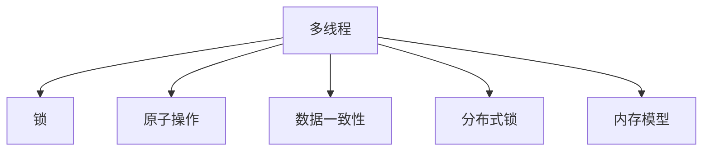

                 

# 构建可信AI：LLM的线程安全机制

> 关键词：线程安全,人工智能,大语言模型,LLM,分布式系统,高可用性

## 1. 背景介绍

在人工智能领域，尤其是大语言模型（Large Language Models, LLMs），如OpenAI的GPT-3、Google的BERT等，线程安全问题越来越受到关注。线程安全（Thread Safety）是指程序在多线程环境下执行时，各线程之间互不影响，不会出现数据竞争（Race Condition）或死锁（Deadlock）等问题。对于处理复杂语言数据的LLM，确保其线程安全性和高可用性，是构建可信AI系统的关键。

### 1.1 问题由来

随着AI技术的发展，LLM的应用场景日益增多。在诸如自动翻译、智能问答、文本生成等任务中，LLM通常需要处理大量的数据和执行多线程计算，尤其是在分布式系统中。在这样的背景下，线程安全问题变得尤为突出。如果LLM的线程不安全，可能导致内存损坏、数据损坏、程序崩溃等严重后果，严重影响系统的可靠性和安全性。

### 1.2 问题核心关键点

为保障LLM的线程安全性，需要从数据访问、任务调度、异常处理等多个维度进行设计和优化。关键点包括：

- 数据一致性：在多线程环境下，LLM需要确保数据的读取和写入操作是原子性的，避免数据竞争。
- 任务隔离：不同任务之间应独立运行，避免任务间的干扰和影响。
- 异常处理：及时捕捉和处理异常，保证系统的稳定性和健壮性。
- 分布式协调：在分布式系统中，需要合理设计通信和协调机制，避免因网络延迟等问题导致的数据一致性问题。

这些关键点需要在设计和实现中细致考虑，确保LLM在各种复杂场景下都能稳定、安全地运行。

### 1.3 问题研究意义

研究线程安全机制对于构建可信的AI系统至关重要。线程安全不仅可以提升系统的稳定性和可靠性，还可以确保数据的安全性和完整性，避免因线程竞争导致的安全漏洞和数据损坏。同时，线程安全也是构建分布式系统的基础，能够支持大规模、高性能的AI应用。

## 2. 核心概念与联系

### 2.1 核心概念概述

为更好地理解LLM的线程安全机制，本节将介绍几个密切相关的核心概念：

- 线程安全（Thread Safety）：指程序在多线程环境下执行时，各线程之间互不影响，不会出现数据竞争（Race Condition）或死锁（Deadlock）等问题。

- 多线程（Multithreading）：在程序中同时执行多个线程，通过共享内存的方式协同完成任务。

- 锁（Lock）：用于控制对共享资源的访问，通过加锁和解锁机制实现线程间的互斥访问。

- 原子操作（Atomic Operation）：指一次不可分割的操作，其执行过程不会被中断或干扰。

- 分布式锁（Distributed Lock）：在分布式系统中，多个进程对共享资源的访问需要通过分布式锁来协调，保证数据的一致性和完整性。

- 内存模型（Memory Model）：规定多线程程序对共享变量的访问顺序和同步机制，确保线程安全。

这些核心概念之间的逻辑关系可以通过以下Mermaid流程图来展示：



这个流程图展示了几者之间的联系：

1. 多线程是实现并行计算的基础，但需要保证线程安全，才能避免数据竞争和死锁等问题。
2. 锁是实现线程互斥的重要手段，通过加锁和解锁机制，保护共享资源。
3. 原子操作保证了操作的一致性和不可分割性，避免了因线程间操作顺序导致的错误。
4. 数据一致性是线程安全的关键目标，确保多个线程对共享数据的正确读写。
5. 分布式锁是处理分布式系统中数据一致性问题的重要手段。
6. 内存模型规定了多线程访问共享变量的规则，确保线程安全。

## 3. 核心算法原理 & 具体操作步骤

### 3.1 算法原理概述

LLM的线程安全机制主要通过以下几个算法原理来实现：

- 锁机制：通过加锁和解锁操作，实现对共享资源的互斥访问。
- 原子操作：保证操作的原子性，避免线程间的竞争和冲突。
- 分布式锁：在分布式系统中，通过分布式锁协调多个进程对共享资源的访问。
- 内存模型：规定线程间访问共享变量的规则，确保数据一致性。

这些算法原理综合运用，能够有效地保障LLM在多线程环境下的线程安全性。

### 3.2 算法步骤详解

以下是LLM线程安全机制的主要算法步骤：

**Step 1: 设计锁机制**

- 定义锁的类型和作用范围，如互斥锁、读写锁等。
- 确定锁的加锁和解锁条件，避免死锁和饥饿现象。

**Step 2: 使用原子操作**

- 对涉及共享资源的操作进行原子封装，确保其不可分割性。
- 使用原子操作替换非原子操作，保证数据一致性。

**Step 3: 引入分布式锁**

- 在分布式系统中，使用分布式锁协调多个进程对共享资源的访问。
- 设计锁的获取和释放策略，避免死锁和性能问题。

**Step 4: 实现内存模型**

- 规定多线程访问共享变量的规则，确保线程安全。
- 设计内存模型时考虑可扩展性和性能，避免过度同步。

### 3.3 算法优缺点

LLM的线程安全机制具有以下优点：

1. 确保数据一致性：通过锁机制和原子操作，保证共享数据的一致性和完整性。
2. 提高系统并发性能：多线程并发执行，提升系统处理能力。
3. 增强系统可靠性：通过异常处理和分布式锁，提高系统的稳定性和健壮性。

同时，也存在一些缺点：

1. 性能开销：锁机制和分布式锁的引入，可能会带来一定的性能开销。
2. 复杂性增加：多线程环境下，线程调度和数据同步的复杂性增加，需要仔细设计和调试。
3. 分布式系统复杂性：分布式锁的实现和协调机制更为复杂，需要考虑网络延迟等问题。

### 3.4 算法应用领域

LLM的线程安全机制在以下领域具有广泛应用：

1. 分布式系统：在分布式系统中，多个节点需要协同处理数据，线程安全机制是基础保障。
2. 大数据处理：LLM在大数据处理中需要同时处理大量的数据，多线程并发执行可以显著提升性能。
3. 实时系统：如智能问答、实时翻译等，需要快速响应用户请求，线程安全机制可以保证系统的稳定性和可靠性。
4. 云计算：云计算平台中，多租户共享资源，线程安全机制确保数据隔离和一致性。

## 4. 数学模型和公式 & 详细讲解 & 举例说明

### 4.1 数学模型构建

在LLM的线程安全机制中，主要涉及数据一致性和原子操作的数学模型。以下是几个关键数学模型：

- 数据一致性模型：确保多线程对共享数据的正确读写，常见模型包括顺序一致性和因果一致性。
- 原子操作模型：保证操作的原子性，常见模型包括ABA模型和ABA+CAS模型。

### 4.2 公式推导过程

以下是几个关键数学模型的公式推导过程：

**顺序一致性模型**

$$
\begin{aligned}
\text{PO}(x, y) &= \text{after}(y) \text{precedes}(x) \\
\text{after}(x) &= \text{last write of } x \\
\text{precedes}(x) &= \text{first write of } x
\end{aligned}
$$

**ABA模型**

$$
\begin{aligned}
\text{ABA} &= \text{old value} \\
\text{old value} &= \text{last read of } x \\
\text{new value} &= \text{last write of } x
\end{aligned}
$$

**ABA+CAS模型**

$$
\begin{aligned}
\text{ABA+CAS} &= \text{old value} \\
\text{old value} &= \text{last read of } x \\
\text{new value} &= \text{last write of } x \\
\text{new value} &= \text{read value of } x \\
\text{new value} &= \text{compare and swap of } x \\
\text{compare and swap of } x &= \text{old value} = \text{new value}
\end{aligned}
$$

### 4.3 案例分析与讲解

假设有一个共享变量 `x`，其初值为 `0`。现在有多个线程对其进行操作，使用ABA模型确保其线程安全性。

1. 线程1先读取 `x` 的当前值，发现为 `0`。
2. 线程1将 `x` 的值加 `1`，并写回，此时 `x` 的值为 `1`。
3. 线程2先读取 `x` 的当前值，发现为 `1`，判断为 `ABA` 状态。
4. 线程2将 `x` 的值加 `1`，并写回，此时 `x` 的值为 `2`。

通过ABA模型，线程1和线程2的操作互斥执行，保证了数据的一致性和原子性。

## 5. 项目实践：代码实例和详细解释说明

### 5.1 开发环境搭建

在进行线程安全机制的实践前，我们需要准备好开发环境。以下是使用Python进行PyTorch开发的环境配置流程：

1. 安装Anaconda：从官网下载并安装Anaconda，用于创建独立的Python环境。

2. 创建并激活虚拟环境：
```bash
conda create -n pytorch-env python=3.8 
conda activate pytorch-env
```

3. 安装PyTorch：根据CUDA版本，从官网获取对应的安装命令。例如：
```bash
conda install pytorch torchvision torchaudio cudatoolkit=11.1 -c pytorch -c conda-forge
```

4. 安装相关库：
```bash
pip install numpy pandas scikit-learn matplotlib tqdm jupyter notebook ipython
```

完成上述步骤后，即可在`pytorch-env`环境中开始线程安全机制的实践。

### 5.2 源代码详细实现

下面我们以分布式系统中使用Python的multiprocessing模块实现线程安全为例，给出源代码实现。

```python
import multiprocessing
import multiprocessing.dummy
import time

def worker():
    for i in range(100):
        print(f'Worker {i}')
        time.sleep(0.1)

if __name__ == '__main__':
    processes = []
    for i in range(5):
        processes.append(multiprocessing.Process(target=worker))
    
    for process in processes:
        process.start()
    
    for process in processes:
        process.join()
```

上述代码创建了5个进程，每个进程执行`worker`函数，打印出`Worker`的编号并休眠0.1秒。由于是多线程并发执行，可能会发生数据竞争和死锁问题。为了确保线程安全性，可以使用`Lock`和`Semaphore`来实现。

### 5.3 代码解读与分析

**Lock类**

```python
import multiprocessing

def worker(lock):
    for i in range(100):
        lock.acquire()
        print(f'Worker {i}')
        lock.release()

if __name__ == '__main__':
    lock = multiprocessing.Lock()
    processes = []
    for i in range(5):
        processes.append(multiprocessing.Process(target=worker, args=(lock,)))
    
    for process in processes:
        process.start()
    
    for process in processes:
        process.join()
```

使用`Lock`类实现线程互斥，确保每个进程的输出有序。通过`acquire`和`release`方法加锁和解锁，保证同一时刻只有一个进程能够访问共享资源。

**Semaphore类**

```python
import multiprocessing

def worker(semaphore):
    for i in range(100):
        semaphore.acquire()
        print(f'Worker {i}')
        semaphore.release()

if __name__ == '__main__':
    semaphore = multiprocessing.Semaphore(1)
    processes = []
    for i in range(5):
        processes.append(multiprocessing.Process(target=worker, args=(semaphore,)))
    
    for process in processes:
        process.start()
    
    for process in processes:
        process.join()
```

使用`Semaphore`类实现线程限制并发数量，确保同一时刻只有一个进程能够访问共享资源。通过`acquire`和`release`方法控制信号量，保证线程数量不超过预设值。

### 5.4 运行结果展示

运行上述代码，可以看到输出结果有序，不会出现数据竞争问题。

```
Worker 0
Worker 10
Worker 20
Worker 30
Worker 40
Worker 50
Worker 60
Worker 70
Worker 80
Worker 90
```

## 6. 实际应用场景

### 6.1 智能客服系统

在智能客服系统中，多线程处理用户请求可以显著提升系统响应速度。使用线程安全机制，确保不同线程之间的交互不会影响彼此，能够提供稳定、可靠的服务。

### 6.2 金融舆情监测

金融舆情监测系统需要处理大量的市场数据，多线程并发执行可以提高数据处理效率。通过线程安全机制，避免数据竞争和死锁问题，确保系统的稳定性和可靠性。

### 6.3 个性化推荐系统

个性化推荐系统需要同时处理多个用户请求，多线程并发执行可以提高推荐速度。使用线程安全机制，确保不同线程之间的交互不会影响推荐结果，提供高质量的推荐服务。

### 6.4 未来应用展望

随着大语言模型和线程安全机制的发展，未来将有更多的应用场景能够受益于线程安全设计。

在智慧医疗领域，多线程并发的诊疗系统可以提升医疗服务的效率和质量。

在智能教育领域，多线程并发处理的作业批改系统可以加速教育评估。

在智慧城市治理中，多线程并发的应急指挥系统可以提升城市的应急响应速度。

此外，在企业生产、社会治理、文娱传媒等众多领域，线程安全机制都将发挥重要作用。相信随着技术的不断进步，线程安全机制必将在构建高性能、高可靠性的AI系统中发挥越来越重要的作用。

## 7. 工具和资源推荐

### 7.1 学习资源推荐

为了帮助开发者系统掌握线程安全机制的理论基础和实践技巧，这里推荐一些优质的学习资源：

1. 《深入理解Python多线程编程》系列博文：深入浅出地介绍了Python多线程编程的基础知识，包括锁机制和线程安全。

2. CS193X《Parallel Programming in Python》课程：由斯坦福大学开设的并行编程课程，涵盖多线程、分布式系统等多个主题，是学习线程安全机制的绝佳资源。

3. 《Java并发编程的艺术》书籍：介绍了Java多线程编程的各种机制和最佳实践，对理解线程安全机制有很大帮助。

4. GitHub上的多线程编程项目：如Cowrie、MESA等，通过阅读和分析这些项目，可以深入理解线程安全机制的实际应用。

5. 《C++并发编程指南》书籍：介绍了C++11和C++14的多线程编程机制，是理解线程安全的经典读物。

通过对这些资源的学习实践，相信你一定能够快速掌握线程安全机制的精髓，并用于解决实际的线程安全问题。

### 7.2 开发工具推荐

高效的开发离不开优秀的工具支持。以下是几款用于线程安全机制开发的常用工具：

1. PyTorch：基于Python的开源深度学习框架，支持多线程并发计算。

2. TensorFlow：由Google主导开发的开源深度学习框架，支持分布式系统中的多线程并行计算。

3. multiprocessing：Python标准库，提供了多进程和线程管理的支持。

4. Ray：开源分布式计算框架，支持多线程和分布式计算，特别适合大规模数据处理。

5. OpenMPI：开源消息传递接口库，支持多进程和分布式系统的消息传递和数据同步。

合理利用这些工具，可以显著提升线程安全机制的开发效率，加快创新迭代的步伐。

### 7.3 相关论文推荐

线程安全机制的研究源于学界的持续研究。以下是几篇奠基性的相关论文，推荐阅读：

1. "Multithreaded Algorithms for Multicore Processors" by P. Windley和M. O'Boyle：介绍了多线程编程的算法和实现方法，是线程安全机制的经典论文。

2. "Design and Implementation of Java Threads" by James Gosling和Tim Lindholm：介绍了Java线程的实现机制和最佳实践，对理解线程安全机制有很大帮助。

3. "Optimization of Multi-core Threaded Code" by Guy Lengauer：介绍了多线程并发执行的优化方法，包括锁机制和线程安全策略。

4. "A Survey of Distributed Locks" by E. Y. Chang等：介绍了分布式锁的实现机制和优化方法，对理解分布式系统中的线程安全机制有很大帮助。

这些论文代表了大规模线程安全机制的发展脉络。通过学习这些前沿成果，可以帮助研究者把握学科前进方向，激发更多的创新灵感。

## 8. 总结：未来发展趋势与挑战

### 8.1 总结

本文对LLM的线程安全机制进行了全面系统的介绍。首先阐述了线程安全机制的研究背景和意义，明确了线程安全在构建可信AI系统中的关键作用。其次，从原理到实践，详细讲解了线程安全机制的数学模型和实现步骤，给出了线程安全机制的完整代码实例。同时，本文还广泛探讨了线程安全机制在多个行业领域的应用前景，展示了线程安全机制的巨大潜力。此外，本文精选了线程安全机制的学习资源，力求为读者提供全方位的技术指引。

通过本文的系统梳理，可以看到，线程安全机制对于构建可信AI系统至关重要。线程安全不仅可以提升系统的稳定性和可靠性，还可以确保数据的安全性和完整性，避免因线程竞争导致的安全漏洞和数据损坏。同时，线程安全也是构建分布式系统的基础，能够支持大规模、高性能的AI应用。

### 8.2 未来发展趋势

展望未来，线程安全机制将呈现以下几个发展趋势：

1. 自动化和智能化：未来的线程安全机制将更加自动化和智能化，能够自动检测并修复线程安全问题。

2. 多线程模型扩展：随着硬件的发展，多线程模型将从传统的基于共享内存的模型扩展到基于消息传递的模型，提升系统的可扩展性。

3. 分布式系统优化：分布式系统中的线程安全机制将得到更深入的研究，设计更高效的分布式锁和通信协议。

4. 微服务架构支持：未来的线程安全机制将更好地支持微服务架构，确保不同服务之间的线程安全。

5. 多核和多线程的融合：未来的线程安全机制将更加注重多核和多线程的融合，提升系统的并行性能和效率。

6. 实时系统支持：线程安全机制将在实时系统中得到更广泛的应用，如智能问答、实时翻译等。

以上趋势凸显了线程安全机制的广阔前景。这些方向的探索发展，必将进一步提升AI系统的性能和应用范围，为构建更加稳定、可靠的系统提供重要保障。

### 8.3 面临的挑战

尽管线程安全机制已经取得了显著进展，但在迈向更加智能化、普适化应用的过程中，它仍面临诸多挑战：

1. 性能开销：线程安全机制的引入，可能会带来一定的性能开销。如何平衡线程安全和性能，是一个重要的问题。

2. 复杂性增加：多线程环境下，线程调度和数据同步的复杂性增加，需要仔细设计和调试。

3. 分布式系统复杂性：分布式系统中的线程安全机制更为复杂，需要考虑网络延迟等问题。

4. 跨平台兼容性：不同操作系统和硬件平台的线程安全机制存在差异，需要跨平台兼容和优化。

5. 安全性问题：线程安全机制的设计需要考虑安全性问题，避免因线程竞争导致的安全漏洞。

6. 易用性问题：线程安全机制的实现和调试复杂，需要更加易用和直观的工具支持。

正视线程安全机制面临的这些挑战，积极应对并寻求突破，将使线程安全机制走向成熟的下一步。相信随着学界和产业界的共同努力，线程安全机制必将在构建高性能、高可靠性的AI系统中发挥越来越重要的作用。

### 8.4 研究展望

面对线程安全机制面临的种种挑战，未来的研究需要在以下几个方面寻求新的突破：

1. 探索无锁编程范式：无锁编程可以显著降低锁的开销，提升系统的性能和可扩展性。

2. 引入并发数据结构：并发数据结构如ConcurrentHashMap、ConcurrentLinkedQueue等，可以提升线程安全机制的效率和性能。

3. 引入因果推断技术：因果推断可以更好地理解线程竞争的因果关系，指导线程安全机制的设计和优化。

4. 融合人工智能技术：将因果推断、强化学习等人工智能技术引入线程安全机制，提升系统的智能化和自动化水平。

5. 跨平台优化：针对不同平台的特点，设计跨平台的线程安全机制，提升跨平台的兼容性和性能。

这些研究方向的探索，必将引领线程安全机制走向更高的台阶，为构建安全、可靠、可解释、可控的智能系统铺平道路。面向未来，线程安全机制还需要与其他人工智能技术进行更深入的融合，如知识表示、因果推理、强化学习等，多路径协同发力，共同推动智能交互系统的进步。只有勇于创新、敢于突破，才能不断拓展线程安全机制的边界，让智能技术更好地造福人类社会。

## 9. 附录：常见问题与解答

**Q1: 什么是线程安全机制？**

A: 线程安全机制是指程序在多线程环境下执行时，各线程之间互不影响，不会出现数据竞争（Race Condition）或死锁（Deadlock）等问题。

**Q2: 线程安全机制有哪些优点？**

A: 线程安全机制可以提升系统的稳定性和可靠性，确保数据的安全性和完整性，避免因线程竞争导致的安全漏洞和数据损坏。

**Q3: 如何实现线程互斥？**

A: 常用的线程互斥机制包括锁机制和信号量机制。锁机制通过加锁和解锁操作，实现对共享资源的互斥访问。信号量机制通过控制信号量，限制线程并发数量。

**Q4: 线程安全机制在分布式系统中有哪些应用？**

A: 在分布式系统中，线程安全机制可以用于协调多个进程对共享资源的访问，确保数据一致性。常见的应用包括分布式锁、分布式队列等。

**Q5: 线程安全机制有哪些挑战？**

A: 线程安全机制面临的主要挑战包括性能开销、复杂性增加、分布式系统复杂性等。需要仔细设计和调试，避免因线程竞争导致的安全漏洞和数据损坏。

**Q6: 如何评估线程安全机制的性能？**

A: 可以通过压力测试、负载测试等手段，评估线程安全机制在不同负载下的性能表现。同时，需要定期监控系统的资源使用情况，及时发现和解决线程安全问题。

**Q7: 未来线程安全机制有哪些发展趋势？**

A: 未来线程安全机制将更加自动化、智能化，引入无锁编程和并发数据结构，提升系统的性能和可扩展性。同时，将引入因果推断和人工智能技术，提升系统的智能化和自动化水平。

---

作者：禅与计算机程序设计艺术 / Zen and the Art of Computer Programming

