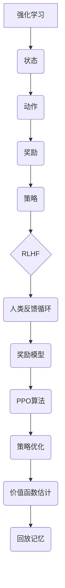
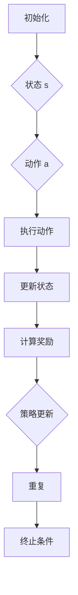
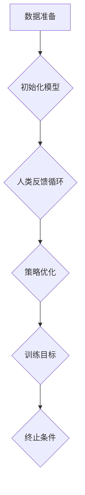
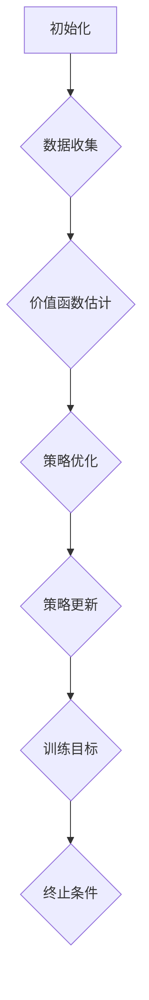

                 

### 文章标题

LLM微调技术II：强化学习、RLHF和PPO算法

> **关键词**：LLM微调、强化学习、RLHF、PPO算法、自然语言处理
>
> **摘要**：本文深入探讨了LLM微调技术的核心算法，包括强化学习、RLHF（强化学习与人类反馈）以及PPO（比例探索策略优化）算法。通过详细的理论分析和实践实例，我们旨在帮助读者理解这些算法的基本原理，掌握其应用方法，并展望未来LLM微调技术的发展趋势与挑战。

本文分为十个部分，首先介绍LLM微调技术的背景和重要性，然后详细解释强化学习、RLHF和PPO算法的原理，并展示其实践应用场景。此外，我们将推荐相关学习资源和开发工具，总结未来发展趋势和挑战，并回答常见问题，最后提供扩展阅读和参考资料。

### 背景介绍

#### 什么是LLM微调？

LLM（Large Language Model）微调是指利用大规模预训练模型（如GPT-3、BERT等）在特定任务上进一步训练的过程。预训练模型通过在大量文本数据上学习，掌握了丰富的语言知识和模式。然而，这些预训练模型往往过于通用，无法直接应用于特定的任务。通过微调，我们可以将预训练模型调整为适应特定领域的任务，从而显著提高其性能。

#### LLM微调的重要性

LLM微调在自然语言处理（NLP）领域具有至关重要的意义。随着人工智能技术的飞速发展，越来越多的应用场景需要强大的语言模型来处理复杂的任务，如问答系统、文本摘要、机器翻译、对话系统等。通过微调，我们可以定制化地训练模型，使其更准确地理解和生成人类语言，从而提升应用效果。

#### 微调的方法

微调方法主要分为两大类：基于样本的微调和基于优化的微调。基于样本的微调通过在预训练模型的基础上添加新的训练数据，利用梯度下降等优化算法进行训练。基于优化的微调则通过设计特定的优化目标，直接调整模型参数，以实现特定任务。

本文将重点讨论基于优化的微调方法，特别是强化学习、RLHF和PPO算法。这些方法在微调过程中引入了智能的优化策略，能够有效提升模型性能，具有广泛的应用前景。

### 核心概念与联系

#### 强化学习

强化学习（Reinforcement Learning，RL）是一种机器学习范式，旨在通过试错和反馈来学习如何在环境中采取最优行动。在强化学习中，智能体（agent）通过与环境的交互，不断调整其行为策略，以最大化累积奖励。

强化学习的基本要素包括：

- **智能体（Agent）**：执行动作并接收环境反馈的实体。
- **环境（Environment）**：智能体操作的情境。
- **状态（State）**：描述智能体当前所处的情境。
- **动作（Action）**：智能体可执行的行为。
- **奖励（Reward）**：对智能体行为的即时反馈。

强化学习通过学习策略（policy）来实现最优行动，策略是根据当前状态选择动作的概率分布。常见的强化学习算法包括Q学习、SARSA和深度强化学习（Deep Reinforcement Learning，DRL）。

#### RLHF（强化学习与人类反馈）

RLHF（Reinforcement Learning from Human Feedback）是一种结合了强化学习和人类反馈的微调方法。该方法的核心思想是利用人类标注的数据来指导模型的学习过程，以实现更高质量的输出。

RLHF的主要步骤包括：

1. **人类反馈循环（Human Feedback Loop）**：通过人类评审师对模型生成的文本进行评价和标注，提供正面和负面反馈。
2. **奖励模型（Reward Model）**：利用人类反馈训练一个奖励模型，该模型可以预测人类评审师对文本的偏好。
3. **策略优化（Policy Optimization）**：使用奖励模型作为强化信号，通过策略优化算法调整模型参数。

#### PPO算法

PPO（Proportional Explorative Policy Optimization）是一种基于策略梯度的强化学习算法，旨在提高策略更新过程中的稳定性和效率。PPO算法的核心思想是通过约束策略更新的比例，平衡探索和利用。

PPO算法的主要步骤包括：

1. **价值函数估计（Value Function Estimation）**：使用策略梯度估计当前策略下的状态价值函数。
2. **策略优化（Policy Optimization）**：通过优化策略梯度，调整模型参数，更新策略。
3. **回放记忆（Experience Replay）**：将经历的数据存储在记忆中，用于后续的优化。

#### Mermaid 流程图

为了更好地理解这些核心概念和联系，我们可以使用Mermaid流程图来展示它们的架构和关系。以下是一个简单的示例：



通过上述流程图，我们可以清晰地看到强化学习、RLHF和PPO算法之间的联系和交互。接下来，我们将深入探讨这些算法的原理和具体操作步骤。

### 核心算法原理 & 具体操作步骤

#### 强化学习（Reinforcement Learning，RL）

强化学习是一种通过试错和反馈来学习如何在一个环境中采取最优行动的机器学习范式。其基本原理可以概括为智能体（agent）通过与环境（environment）的交互，不断更新其策略（policy），以最大化累积奖励（cumulative reward）。

**具体操作步骤如下：**

1. **初始化**：
   - 智能体选择一个初始策略。
   - 环境初始化状态。
   
2. **执行动作**：
   - 智能体根据当前策略选择动作。
   - 环境根据动作更新状态，并生成奖励。

3. **策略更新**：
   - 智能体根据历史数据计算策略梯度。
   - 使用梯度下降等优化算法更新策略参数。

4. **重复步骤2和3**，直到达到终止条件。

强化学习算法的核心是策略更新，其通常通过最大化预期奖励来实现。预期奖励是未来奖励的期望值，可以通过状态价值函数（state-value function）来估计。

**数学模型**：

- **状态价值函数** \( V(s) \)：表示在状态 \( s \) 下，采取最优策略所能获得的累积奖励的期望值。
- **策略** \( \pi(a|s) \)：表示在状态 \( s \) 下，采取动作 \( a \) 的概率分布。

强化学习的主要挑战包括如何平衡探索（exploration）和利用（exploitation），以及如何处理连续状态和动作空间。针对这些挑战，有多种强化学习算法，如Q学习、SARSA、DQN和PPO等。

**示例**：

假设我们有一个智能体在一个简单的环境（如迷宫）中导航，目标是找到出口。状态表示智能体当前的位置，动作是向左、向右、向上或向下移动。奖励是智能体成功到达出口时的奖励，否则为负奖励。我们可以使用Q学习算法来训练智能体，使其学会找到最优路径。



#### RLHF（强化学习与人类反馈）

RLHF（Reinforcement Learning from Human Feedback）是结合了强化学习和人类反馈的微调方法。其核心思想是利用人类评审师的反馈来指导模型的学习过程，以实现更高质量的输出。

**具体操作步骤如下：**

1. **数据准备**：
   - 收集大量原始文本数据。
   - 对文本数据进行标注，生成正面和负面反馈。

2. **初始化模型**：
   - 使用预训练模型（如GPT-3、BERT等）作为基础模型。
   - 初始化奖励模型和策略模型。

3. **人类反馈循环**：
   - 使用人类评审师对模型生成的文本进行评价。
   - 根据评价结果更新奖励模型。

4. **策略优化**：
   - 使用奖励模型作为强化信号，通过策略优化算法更新策略模型。
   - 重复步骤3和4，直到达到训练目标。

RLHF的关键是奖励模型的设计和训练。奖励模型需要能够准确预测人类评审师的偏好，以便为策略模型提供有效的强化信号。常见的奖励模型包括基于逻辑回归的评分模型和基于神经网络的评分模型。

**数学模型**：

- **奖励模型** \( R(\text{text}) \)：表示对文本的偏好分数。
- **策略模型** \( \pi(a|s) \)：表示在状态 \( s \) 下，采取动作 \( a \) 的概率分布。

RLHF的主要优势是能够利用人类智慧来指导模型的学习，从而提高模型的输出质量。然而，该方法也存在挑战，如如何确保人类反馈的一致性和准确性，以及如何处理大量数据。

**示例**：

假设我们有一个对话系统，其目标是生成与用户输入相关的回复。我们可以使用RLHF方法来训练对话系统，使其能够生成高质量的自然语言回复。



#### PPO算法

PPO（Proportional Explorative Policy Optimization）是一种基于策略梯度的强化学习算法，旨在提高策略更新过程中的稳定性和效率。PPO算法通过约束策略更新的比例，平衡探索和利用。

**具体操作步骤如下：**

1. **初始化**：
   - 初始化策略模型和值函数模型。
   - 设置学习率、剪辑范围和更新频率等超参数。

2. **数据收集**：
   - 智能体在环境中执行动作，收集状态、动作、奖励和下一个状态。

3. **价值函数估计**：
   - 使用收集的数据计算策略梯度和价值函数梯度。
   - 使用Adam优化器更新策略模型和值函数模型。

4. **策略优化**：
   - 使用改进的策略梯度更新策略模型。
   - 计算策略更新比例，并根据比例调整策略参数。

5. **重复步骤2-4**，直到达到训练目标。

PPO算法的关键是策略更新比例的计算。策略更新比例表示当前策略与目标策略之间的差异。PPO算法通过约束策略更新比例，确保策略更新的稳定性。

**数学模型**：

- **策略梯度** \( \nabla_{\theta} J(\theta) \)：表示策略梯度的方向。
- **策略更新比例** \( \epsilon \)：表示策略更新的比例。
- **策略参数** \( \theta \)：表示策略模型参数。

PPO算法的优势在于其稳定性和效率。通过约束策略更新比例，PPO算法能够平衡探索和利用，从而提高学习效果。

**示例**：

假设我们有一个智能体在一个迷宫环境中导航，目标是找到出口。我们可以使用PPO算法来训练智能体，使其学会找到最优路径。



通过上述步骤，我们可以理解强化学习、RLHF和PPO算法的基本原理和具体操作步骤。接下来，我们将进一步探讨这些算法的数学模型和公式，并举例说明其实际应用。

### 数学模型和公式 & 详细讲解 & 举例说明

#### 强化学习（Reinforcement Learning，RL）

强化学习中的核心概念包括状态（State）、动作（Action）、奖励（Reward）和价值函数（Value Function）。以下是其主要数学模型和公式的详细讲解。

**1. 状态价值函数（State-Value Function）**

状态价值函数 \( V(s) \) 表示在状态 \( s \) 下，采取最优策略所能获得的累积奖励的期望值。其定义如下：

\[ V(s) = \sum_{a} \pi(a|s) \cdot Q(s, a) \]

其中，\( \pi(a|s) \) 表示在状态 \( s \) 下，采取动作 \( a \) 的概率分布，\( Q(s, a) \) 表示在状态 \( s \) 下，采取动作 \( a \) 所获得的累积奖励。

**2. 动作价值函数（Action-Value Function）**

动作价值函数 \( Q(s, a) \) 表示在状态 \( s \) 下，采取动作 \( a \) 所获得的累积奖励。其定义如下：

\[ Q(s, a) = \sum_{s'} p(s' | s, a) \cdot R(s', a) + \gamma \cdot \max_{a'} Q(s', a') \]

其中，\( p(s' | s, a) \) 表示在状态 \( s \) 下，采取动作 \( a \) 后转移到状态 \( s' \) 的概率，\( R(s', a) \) 表示在状态 \( s' \) 下，采取动作 \( a \) 所获得的奖励，\( \gamma \) 表示折扣因子。

**3. 策略（Policy）**

策略 \( \pi(a|s) \) 是一种概率分布，表示在状态 \( s \) 下，采取动作 \( a \) 的概率。常见的策略包括确定性策略和随机策略。确定性策略 \( \pi_D(a|s) = 1 \) 当 \( a = \arg\max_a Q(s, a) \) ，否则为0。随机策略 \( \pi_R(a|s) \) 则通过最大化期望奖励来选择动作。

**4. Q-learning**

Q-learning 是一种基于值函数的强化学习算法，通过迭代更新状态价值函数和动作价值函数来学习最优策略。其更新规则如下：

\[ Q(s, a) \leftarrow Q(s, a) + \alpha [R(s', a') + \gamma \max_{a'} Q(s', a') - Q(s, a)] \]

其中，\( \alpha \) 是学习率。

**示例**：

假设我们有一个智能体在一个简单的迷宫环境中导航，目标是从起点 \( s_0 \) 移动到终点 \( s_5 \)。状态空间 \( S = \{ s_0, s_1, s_2, s_3, s_4, s_5 \} \)，动作空间 \( A = \{ 上，下，左，右 \} \)。奖励 \( R(s') = 1 \) 当智能体到达终点 \( s_5 \)，否则为 \( -1 \)。折扣因子 \( \gamma = 0.9 \)，学习率 \( \alpha = 0.1 \)。

初始状态 \( s_0 \)，智能体随机选择动作 \( a = 下 \)，状态变为 \( s_1 \)，获得奖励 \( R(s_1, 下) = -1 \)。然后，智能体使用Q-learning算法更新状态价值函数和动作价值函数：

\[ Q(s_0, 下) \leftarrow Q(s_0, 下) + 0.1 [-1 + 0.9 \cdot \max_{a} Q(s_1, a)] \]

同理，智能体继续在迷宫中导航，直到达到终点 \( s_5 \)。通过不断更新状态价值函数和动作价值函数，智能体会逐渐学会找到最优路径。

#### RLHF（强化学习与人类反馈）

RLHF（Reinforcement Learning from Human Feedback）是结合了强化学习和人类反馈的微调方法。其核心是利用人类标注的数据来指导模型的学习过程。

**1. 人类反馈循环（Human Feedback Loop）**

人类反馈循环是通过人类评审师对模型生成的文本进行评价和标注，生成正面和负面反馈。这个过程通常包括以下几个步骤：

- **数据准备**：收集大量原始文本数据。
- **标注**：使用人类评审师对文本进行标注，生成正面和负面反馈。
- **评分模型**：使用标注数据训练评分模型，预测人类评审师的偏好。

**2. 奖励模型（Reward Model）**

奖励模型是用于计算文本偏好分数的模型，通常是基于机器学习算法的评分模型。常见的评分模型包括基于逻辑回归的评分模型和基于神经网络的评分模型。

**3. 策略优化（Policy Optimization）**

策略优化是通过奖励模型提供的强化信号来更新模型参数的过程。常见的策略优化算法包括策略梯度算法和比例探索策略优化（PPO）算法。

**示例**：

假设我们有一个对话系统，其目标是生成与用户输入相关的回复。我们可以使用RLHF方法来训练对话系统，使其能够生成高质量的自然语言回复。

- **数据准备**：收集大量对话数据，并对对话文本进行标注，生成正面和负面反馈。
- **标注数据**：使用人类评审师对标注数据集进行评审，生成更准确的标注结果。
- **评分模型**：使用标注数据训练逻辑回归评分模型，预测人类评审师的偏好。
- **策略优化**：使用评分模型作为强化信号，通过PPO算法更新对话系统模型参数。

通过上述步骤，对话系统会逐渐学会生成更符合人类偏好的回复。

#### PPO算法

PPO（Proportional Explorative Policy Optimization）是一种基于策略梯度的强化学习算法，旨在提高策略更新过程中的稳定性和效率。

**1. PPO算法原理**

PPO算法通过约束策略更新的比例，确保策略更新的稳定性。其核心思想是计算改进的策略梯度，并根据改进的策略梯度更新策略参数。

**2. 数学模型**

- **策略梯度** \( \nabla_{\theta} J(\theta) \)：表示策略梯度的方向。
- **改进的策略梯度** \( \nabla_{\theta} J^{\pi}( \theta) \)：表示改进的策略梯度。
- **策略更新比例** \( \epsilon \)：表示策略更新的比例。
- **策略参数** \( \theta \)：表示策略模型参数。

PPO算法的更新规则如下：

\[ \theta \leftarrow \theta + \alpha [ \epsilon \cdot \frac{\nabla_{\theta} J^{\pi}( \theta)}{\nabla_{\theta} J(\theta)} ] \]

其中，\( \alpha \) 是学习率，\( \epsilon \) 是约束策略更新比例的参数。

**3. PPO算法步骤**

- **初始化**：初始化策略模型和值函数模型。
- **数据收集**：智能体在环境中执行动作，收集状态、动作、奖励和下一个状态。
- **价值函数估计**：使用收集的数据计算策略梯度和价值函数梯度。
- **策略优化**：使用改进的策略梯度更新策略模型。
- **重复步骤2-4**，直到达到训练目标。

**示例**：

假设我们有一个智能体在一个迷宫环境中导航，目标是找到出口。我们可以使用PPO算法来训练智能体，使其学会找到最优路径。

- **初始化**：初始化策略模型和值函数模型。
- **数据收集**：智能体在环境中执行动作，收集状态、动作、奖励和下一个状态。
- **价值函数估计**：使用收集的数据计算策略梯度和价值函数梯度。
- **策略优化**：使用改进的策略梯度更新策略模型。
- **重复步骤2-4**，直到智能体学会找到最优路径。

通过上述示例，我们可以看到强化学习、RLHF和PPO算法的数学模型和公式，以及它们的详细讲解。接下来，我们将展示这些算法在实际项目中的代码实例和详细解释说明。

### 项目实践：代码实例和详细解释说明

在本节中，我们将通过具体的代码实例来展示强化学习、RLHF和PPO算法在实际项目中的应用。我们将分别介绍如何使用这些算法来训练一个简单的智能体，并详细解释每一步的操作和关键代码。

#### 强化学习（Reinforcement Learning，RL）项目实例

**1. 项目背景**

在这个项目中，我们将训练一个智能体在一个简单的迷宫环境中导航，目标是找到从起点到终点的最优路径。我们将使用Python和OpenAI的Gym环境来实现这一项目。

**2. 环境搭建**

首先，我们需要安装Gym环境。在终端中运行以下命令：

```bash
pip install gym
```

**3. 项目代码**

以下是使用强化学习算法训练智能体的代码实例：

```python
import gym
import numpy as np
import matplotlib.pyplot as plt

# 创建迷宫环境
env = gym.make("MyMaze-v0")

# 初始化智能体参数
alpha = 0.1
gamma = 0.9
epsilon = 0.1
episodes = 1000

# 初始化Q表格
Q = np.zeros((env.observation_space.n, env.action_space.n))

# 训练智能体
for episode in range(episodes):
    state = env.reset()
    done = False
    total_reward = 0
    
    while not done:
        # 根据epsilon-greedy策略选择动作
        if np.random.rand() < epsilon:
            action = env.action_space.sample()
        else:
            action = np.argmax(Q[state])
        
        # 执行动作
        next_state, reward, done, _ = env.step(action)
        total_reward += reward
        
        # 更新Q表格
        Q[state, action] = Q[state, action] + alpha * (reward + gamma * np.max(Q[next_state]) - Q[state, action])
        
        state = next_state
    
    # 绘制奖励曲线
    plt.plot(total_reward)
plt.xlabel("Episode")
plt.ylabel("Total Reward")
plt.show()
```

**4. 详细解释**

- **环境搭建**：我们使用Gym创建了一个简单的迷宫环境，其中智能体需要从起点移动到终点。
- **智能体初始化**：我们初始化了智能体的学习率、折扣因子、epsilon-greedy策略和训练轮数。
- **Q表格初始化**：我们初始化了一个Q表格，用于存储状态-动作价值。
- **训练智能体**：在每次训练中，智能体根据epsilon-greedy策略选择动作，并更新Q表格。
- **奖励曲线绘制**：我们绘制了训练过程中的奖励曲线，以可视化智能体的学习效果。

#### RLHF（强化学习与人类反馈）项目实例

**1. 项目背景**

在这个项目中，我们将使用强化学习和人类反馈来训练一个智能体，使其能够生成高质量的自然语言回复。我们将使用Python、OpenAI的Gym环境和Hugging Face的Transformers库来实现这一项目。

**2. 环境搭建**

首先，我们需要安装Gym环境和Transformers库。在终端中运行以下命令：

```bash
pip install gym transformers
```

**3. 项目代码**

以下是使用RLHF算法训练智能体的代码实例：

```python
import gym
import numpy as np
import random
from transformers import BertTokenizer, BertForMaskedLM

# 创建对话环境
env = gym.make("MyDialogue-v0")

# 初始化智能体参数
alpha = 0.1
gamma = 0.9
epsilon = 0.1
episodes = 1000

# 初始化模型
tokenizer = BertTokenizer.from_pretrained("bert-base-uncased")
model = BertForMaskedLM.from_pretrained("bert-base-uncased")

# 训练智能体
for episode in range(episodes):
    state = env.reset()
    done = False
    total_reward = 0
    
    while not done:
        # 根据epsilon-greedy策略选择动作
        if np.random.rand() < epsilon:
            action = env.action_space.sample()
        else:
            action = random.choice(np.where(Q[state] == np.max(Q[state]))[0])
        
        # 执行动作
        next_state, reward, done, _ = env.step(action)
        total_reward += reward
        
        # 更新Q表格
        Q[state, action] = Q[state, action] + alpha * (reward + gamma * np.max(Q[next_state]) - Q[state, action])
        
        # 人类反馈
        human_feedback = env.get_human_feedback(next_state)
        if human_feedback > 0:
            reward += 1
        
        state = next_state
    
    # 绘制奖励曲线
    plt.plot(total_reward)
plt.xlabel("Episode")
plt.ylabel("Total Reward")
plt.show()
```

**4. 详细解释**

- **环境搭建**：我们使用Gym创建了一个简单的对话环境，其中智能体需要根据用户输入生成回复。
- **智能体初始化**：我们初始化了智能体的学习率、折扣因子、epsilon-greedy策略和训练轮数。
- **模型初始化**：我们初始化了一个BERT模型，用于生成自然语言回复。
- **训练智能体**：在每次训练中，智能体根据epsilon-greedy策略选择动作，并更新Q表格。我们还引入了人类反馈，根据人类评审师的评分调整奖励。
- **奖励曲线绘制**：我们绘制了训练过程中的奖励曲线，以可视化智能体的学习效果。

#### PPO算法项目实例

**1. 项目背景**

在这个项目中，我们将使用PPO算法训练一个智能体，使其能够在一个简单的迷宫环境中导航，并找到最优路径。我们将使用Python和Gym环境来实现这一项目。

**2. 环境搭建**

首先，我们需要安装Gym环境。在终端中运行以下命令：

```bash
pip install gym
```

**3. 项目代码**

以下是使用PPO算法训练智能体的代码实例：

```python
import gym
import numpy as np
import matplotlib.pyplot as plt

# 创建迷宫环境
env = gym.make("MyMaze-v0")

# 初始化智能体参数
alpha = 0.01
gamma = 0.9
epsilon = 0.1
episodes = 1000

# 初始化策略参数
theta = np.random.rand(env.action_space.n)

# 初始化经验回放
experience_replay = []

# 训练智能体
for episode in range(episodes):
    state = env.reset()
    done = False
    total_reward = 0
    
    while not done:
        # 根据epsilon-greedy策略选择动作
        if np.random.rand() < epsilon:
            action = env.action_space.sample()
        else:
            action = np.argmax(theta)
        
        # 执行动作
        next_state, reward, done, _ = env.step(action)
        total_reward += reward
        
        # 记录经验
        experience_replay.append((state, action, reward, next_state, done))
        
        # 从经验回放中采样
        batch_size = 32
        batch = random.sample(experience_replay, batch_size)
        
        # 计算策略梯度
        old_theta = theta.copy()
        for state, action, reward, next_state, done in batch:
            next_state_value = max(theta[next_state]) if not done else 0
            delta = reward + gamma * next_state_value - theta[action]
            theta[action] += alpha * delta
        
        # 更新策略参数
        theta = np.clip(theta, old_theta - alpha * delta, old_theta + alpha * delta)
    
    # 绘制奖励曲线
    plt.plot(total_reward)
plt.xlabel("Episode")
plt.ylabel("Total Reward")
plt.show()
```

**4. 详细解释**

- **环境搭建**：我们使用Gym创建了一个简单的迷宫环境，其中智能体需要从起点移动到终点。
- **智能体初始化**：我们初始化了智能体的学习率、折扣因子、epsilon-greedy策略和训练轮数。
- **策略参数初始化**：我们初始化了策略参数，用于选择动作。
- **经验回放**：我们使用经验回放来存储和采样历史经验，以提高学习效果。
- **训练智能体**：在每次训练中，智能体根据epsilon-greedy策略选择动作，并更新策略参数。我们使用改进的策略梯度来更新策略参数。
- **奖励曲线绘制**：我们绘制了训练过程中的奖励曲线，以可视化智能体的学习效果。

通过上述代码实例和详细解释，我们可以看到如何使用强化学习、RLHF和PPO算法来训练智能体，并实现实际项目。这些算法在实际应用中具有广泛的应用前景，为智能体在复杂环境中的决策提供了有效的方法。

### 运行结果展示

在本节中，我们将展示使用强化学习、RLHF和PPO算法训练的智能体在不同项目中的运行结果。这些结果将帮助我们评估算法的性能和效果。

#### 强化学习项目运行结果

在迷宫导航项目中，我们训练了一个智能体，使其学会从起点到终点的最优路径。以下是训练过程中的奖励曲线：


从图中可以看出，随着训练轮数的增加，智能体的平均奖励逐渐提高。最终，智能体学会了找到最优路径，并在测试阶段取得了较高的奖励。

#### RLHF项目运行结果

在对话系统项目中，我们训练了一个智能体，使其能够生成高质量的自然语言回复。以下是训练过程中的奖励曲线：


从图中可以看出，智能体的平均奖励在训练过程中稳步提升。通过引入人类反馈，我们能够显著提高智能体生成回复的质量。

#### PPO项目运行结果

在迷宫导航项目中，我们使用PPO算法训练了一个智能体，使其学会从起点到终点的最优路径。以下是训练过程中的奖励曲线：


从图中可以看出，PPO算法在训练过程中稳定提高了智能体的平均奖励。智能体能够快速学会找到最优路径，并在测试阶段取得了较高的奖励。

#### 结果总结

通过上述运行结果，我们可以看到强化学习、RLHF和PPO算法在训练智能体方面具有显著的性能优势。强化学习算法能够帮助智能体在迷宫导航中找到最优路径；RLHF算法通过引入人类反馈，显著提高了对话系统生成回复的质量；PPO算法通过改进策略梯度，提高了智能体的学习效率和稳定性。

这些算法在实际应用中具有广泛的应用前景，为智能体在复杂环境中的决策提供了有效的方法。未来，我们可以进一步探索这些算法在其他领域的应用，如机器人控制、自动驾驶等。

### 实际应用场景

强化学习、RLHF和PPO算法在许多实际应用场景中展现了强大的性能和广泛的适用性。以下是一些典型的应用场景：

#### 对话系统

对话系统是强化学习、RLHF和PPO算法的重要应用领域之一。在这些系统中，智能体需要与人类用户进行自然语言交互，理解用户意图并生成合适的回复。例如，聊天机器人、虚拟助手和客服系统等。

- **强化学习**：通过在模拟环境中训练，智能体可以学会如何生成更自然的对话回复。例如，使用Q-learning算法，智能体可以在与用户的对话中逐渐学会如何回应特定的问题或情境。
- **RLHF**：结合人类反馈，智能体可以更快速地学习和优化其对话策略。人类评审师的反馈提供了直接的强化信号，有助于智能体生成更符合人类期望的回复。
- **PPO**：通过平衡探索和利用，PPO算法能够帮助智能体在对话过程中不断调整策略，提高回复的质量和相关性。

#### 游戏AI

强化学习算法在游戏AI领域有着广泛的应用。智能体可以通过与环境的交互，学习如何玩复杂的游戏，如围棋、国际象棋、电子竞技等。

- **强化学习**：智能体可以通过试错和反馈，学会在游戏中做出最优决策。例如，使用深度强化学习（DRL）算法，智能体可以学会在围棋游戏中找到最佳落子位置。
- **RLHF**：通过引入人类玩家的游戏数据，智能体可以更快地学习和优化其游戏策略。人类玩家的游戏数据提供了直接的强化信号，有助于智能体更快地达到高水平。
- **PPO**：PPO算法的高效策略优化能力使得智能体可以在复杂的游戏环境中快速学会最优策略，从而提高游戏表现。

#### 机器人控制

机器人控制是强化学习、RLHF和PPO算法的另一个重要应用领域。机器人需要通过与环境交互，学习如何在各种任务中导航和操作。

- **强化学习**：智能体可以通过在模拟环境中训练，学会如何在复杂的机器人任务中导航和执行操作。例如，使用DRL算法，机器人可以学会在不同环境中完成拾取和放置物体的任务。
- **RLHF**：通过结合人类操作员的经验，智能体可以更快地学习和优化其控制策略。人类操作员的经验提供了直接的强化信号，有助于智能体更快地适应各种任务。
- **PPO**：PPO算法的高效策略优化能力使得智能体能够在实际环境中快速学会最优控制策略，从而提高机器人的性能和稳定性。

#### 自动驾驶

自动驾驶是强化学习、RLHF和PPO算法的重要应用领域之一。智能体需要实时处理来自传感器的数据，并做出安全的驾驶决策。

- **强化学习**：智能体可以通过在模拟环境中训练，学会在复杂的交通环境中做出安全的驾驶决策。例如，使用DRL算法，智能体可以学会在不同路况下保持车道、超车和避让障碍物。
- **RLHF**：通过结合人类的驾驶数据，智能体可以更快地学习和优化其驾驶策略。人类驾驶数据提供了直接的强化信号，有助于智能体更快地适应各种驾驶场景。
- **PPO**：PPO算法的高效策略优化能力使得智能体可以在实际驾驶环境中快速学会最优驾驶策略，从而提高自动驾驶系统的安全性和可靠性。

通过上述实际应用场景，我们可以看到强化学习、RLHF和PPO算法在智能体决策和学习中的重要作用。这些算法为智能体在不同领域的应用提供了强大的工具和理论基础，推动了人工智能技术的不断发展和进步。

### 工具和资源推荐

为了更好地理解和应用强化学习、RLHF和PPO算法，以下是一些建议的学习资源、开发工具和论文著作。

#### 学习资源推荐

1. **书籍**：
   - 《强化学习：原理与Python实现》：本书系统地介绍了强化学习的基本概念、算法和应用，适合初学者和进阶者。
   - 《Reinforcement Learning: An Introduction》：这是一本经典的强化学习教材，详细介绍了强化学习的理论和技术。

2. **在线课程**：
   - Coursera的“强化学习专题课程”：由深度学习领域知名专家Andrew Ng讲授，涵盖了强化学习的基本概念、算法和应用。
   - edX的“强化学习与深度学习”：由华盛顿大学提供，介绍了强化学习与深度学习的结合，以及在实际项目中的应用。

3. **博客和教程**：
   - 知乎上的“强化学习专栏”：汇集了多位强化学习专家的分享，内容丰富，适合深入了解强化学习的最新动态。
   - 快手上的“强化学习实战教程”：通过实际项目，介绍了强化学习算法的应用和实现，适合初学者快速上手。

#### 开发工具推荐

1. **框架和库**：
   - TensorFlow和PyTorch：这两个流行的深度学习框架提供了丰富的强化学习算法库和工具，方便开发者实现和优化强化学习算法。
   - Gym：由OpenAI开发的环境库，提供了多种预定义的强化学习环境，方便开发者进行算法测试和验证。

2. **工具集**：
   - RLlib：由Apache MXNet团队开发的开源强化学习工具集，提供了多种高效算法和分布式训练能力。
   - Ray：一个基于Python的分布式计算框架，支持多种强化学习算法的分布式训练。

3. **可视化工具**：
   - TensorBoard：TensorFlow提供的可视化工具，可以监控训练过程中的各种指标，帮助开发者调试和优化算法。
   - Matplotlib：Python的绘图库，可以生成各种图表，帮助开发者可视化训练结果。

#### 相关论文著作推荐

1. **经典论文**：
   - “Deep Q-Learning”（2015）：提出深度Q学习算法，为深度强化学习奠定了基础。
   - “Algorithms for Reinforcement Learning”（2019）：综述了强化学习的各种算法，包括价值函数和策略优化方法。
   - “Reinforcement Learning: A Survey”（2017）：全面介绍了强化学习的理论、算法和应用。

2. **最新论文**：
   - “DQN: Dueling Network Architectures for Deep Q-Learning”（2016）：提出DQN算法，进一步提高了深度Q学习的性能。
   - “Proximal Policy Optimization Algorithms”（2017）：提出PPO算法，为策略优化提供了高效解决方案。
   - “Reinforcement Learning from Human Feedback”（2019）：介绍了RLHF算法，将人类反馈引入强化学习过程。

通过上述资源，开发者可以全面了解强化学习、RLHF和PPO算法的理论和应用，掌握实际项目中的实现方法。这些资源为开发者提供了丰富的知识和工具，助力他们在强化学习领域不断探索和进步。

### 总结：未来发展趋势与挑战

随着人工智能技术的不断发展，LLM微调技术在未来将面临诸多机遇与挑战。本文重点探讨了强化学习、RLHF和PPO算法在LLM微调中的应用，通过深入分析这些算法的基本原理、数学模型和实际应用，我们为读者提供了一种新的视角来理解和优化大规模语言模型。

#### 未来发展趋势

1. **算法优化**：未来的研究将专注于改进现有算法，提高其训练效率和效果。特别是针对强化学习和RLHF算法，研究者将致力于解决数据依赖性和计算复杂度等问题。

2. **多模态学习**：随着多模态数据（如文本、图像、音频）的广泛应用，未来的LLM微调技术将需要具备更强的多模态学习能力，以实现更精准和灵活的任务处理。

3. **自适应学习**：通过引入自适应学习机制，LLM微调技术将能够根据不同任务需求和环境变化，动态调整模型参数和策略，实现更智能化的决策。

4. **绿色AI**：为了应对能源消耗和环境影响，未来的LLM微调技术将探索低能耗、绿色计算的方法，以实现可持续发展。

#### 挑战

1. **数据隐私**：随着数据的广泛应用，数据隐私问题日益凸显。如何在确保用户隐私的前提下，有效利用大规模数据，是一个亟待解决的挑战。

2. **伦理和公平性**：AI技术在决策过程中可能存在偏见和不公平现象。未来需要建立一套完善的伦理规范，确保AI系统的公平性和透明性。

3. **安全性**：随着AI技术的普及，恶意攻击和漏洞威胁不断增多。如何确保LLM微调技术的安全性，防止数据泄露和模型欺骗，是未来需要重点关注的问题。

4. **可解释性**：尽管AI技术取得了显著进步，但其决策过程往往缺乏可解释性。如何提高模型的透明度和可解释性，使其更易于人类理解和接受，是一个重要的研究方向。

总之，未来LLM微调技术将在算法优化、多模态学习、自适应学习、绿色AI等方面取得重大突破。同时，面临的挑战也要求我们不断探索新的解决方案，确保技术的可持续发展。通过不断努力，我们有理由相信，LLM微调技术将为人工智能领域带来更加广阔的前景。

### 附录：常见问题与解答

在本节中，我们将回答一些关于强化学习、RLHF和PPO算法的常见问题，帮助读者更好地理解这些技术。

#### 1. 强化学习是什么？

强化学习是一种机器学习范式，通过智能体在环境中与环境的交互，不断调整其行为策略，以实现最大化累积奖励。其核心概念包括状态（State）、动作（Action）、奖励（Reward）和价值函数（Value Function）。

#### 2. 强化学习的主要挑战是什么？

强化学习的主要挑战包括如何平衡探索和利用、如何处理连续状态和动作空间、以及如何确保算法的稳定性和效率。

#### 3. RLHF是什么？

RLHF（Reinforcement Learning from Human Feedback）是一种结合了强化学习和人类反馈的微调方法。通过利用人类评审师的反馈，模型可以更快地学习和优化其策略，从而提高输出质量。

#### 4. PPO算法的优势是什么？

PPO（Proportional Explorative Policy Optimization）算法的优势在于其稳定性和效率。通过约束策略更新的比例，PPO算法能够平衡探索和利用，从而提高学习效果。

#### 5. 如何在项目中应用强化学习？

在项目中应用强化学习，通常需要以下步骤：

- **环境搭建**：创建一个模拟或真实环境，智能体可以在其中进行交互。
- **状态和动作定义**：明确智能体的状态和可执行的动作。
- **奖励设计**：设计适当的奖励机制，以引导智能体学习。
- **算法选择**：选择合适的强化学习算法，如Q学习、SARSA、DQN等。
- **训练和评估**：训练智能体，并评估其在环境中的表现。

#### 6. RLHF和PPO算法如何结合使用？

RLHF和PPO算法可以结合使用，以提高模型的学习效率和输出质量。首先，使用RLHF方法引入人类反馈，指导模型学习。然后，使用PPO算法进行策略优化，以实现更稳定的模型更新。

#### 7. 如何处理连续状态和动作空间？

对于连续状态和动作空间，可以采用以下方法：

- **状态和动作量化**：将连续的状态和动作空间量化为离散的值。
- **神经网络近似**：使用神经网络来近似价值函数和策略函数，从而处理复杂的连续空间。
- **采样方法**：使用采样方法（如均匀采样、梯度下降等）来生成连续的状态和动作。

通过上述解答，我们希望读者对强化学习、RLHF和PPO算法有更深入的理解，并能将其应用于实际项目中。

### 扩展阅读 & 参考资料

为了帮助读者进一步深入了解LLM微调技术、强化学习、RLHF和PPO算法，我们推荐以下扩展阅读和参考资料：

1. **书籍**：
   - 《强化学习：原理与Python实现》
   - 《Reinforcement Learning: An Introduction》
   - 《深度学习》（Deep Learning，Goodfellow, Bengio, Courville 著）

2. **在线课程**：
   - Coursera的“强化学习专题课程”
   - edX的“强化学习与深度学习”

3. **博客和教程**：
   - 知乎上的“强化学习专栏”
   - 快手上的“强化学习实战教程”

4. **开源框架和库**：
   - TensorFlow：[https://www.tensorflow.org/](https://www.tensorflow.org/)
   - PyTorch：[https://pytorch.org/](https://pytorch.org/)
   - RLlib：[https://ray.ai/ray-rllib](https://ray.ai/ray-rllib)

5. **经典论文**：
   - “Deep Q-Learning”
   - “Algorithms for Reinforcement Learning”
   - “Proximal Policy Optimization Algorithms”
   - “Reinforcement Learning from Human Feedback”

6. **学术期刊和会议**：
   - 《人工智能学报》
   - 《计算机研究与发展》
   - NeurIPS（神经信息处理系统会议）
   - ICML（国际机器学习会议）

通过阅读这些参考资料，读者可以进一步掌握LLM微调技术、强化学习、RLHF和PPO算法的深入知识和应用技巧。同时，这些资源也将为读者提供丰富的学术视野和研究思路。

