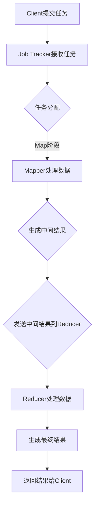

                 

### 文章标题

# MapReduce原理与代码实例讲解

MapReduce是一种用于处理大规模数据集的编程模型和软件框架，由Google提出并广泛应用于各类大数据处理场景。本文将详细讲解MapReduce的基本原理、核心算法、以及如何通过代码实例实现MapReduce程序。

## 关键词

- **MapReduce**、**编程模型**、**大数据处理**、**分布式计算**、**Hadoop**

## 摘要

本文首先介绍了MapReduce的基本原理和核心概念，包括Map和Reduce两个阶段的操作。随后，通过一个具体的实例，详细解析了如何使用MapReduce处理数据集。文章最后讨论了MapReduce在实际应用中的场景，并推荐了一些相关工具和资源。

## 1. 背景介绍（Background Introduction）

在大数据时代，如何高效地处理和分析海量数据成为了亟待解决的问题。传统的单机数据处理方法已经无法满足需求，因此分布式计算应运而生。MapReduce作为一种经典的分布式计算模型，能够高效地处理大规模数据集。

MapReduce最早由Google在2004年提出，并应用于Google搜索引擎和广告系统中。MapReduce的核心思想是将一个大规模的数据处理任务分解为多个小任务，并在分布式系统上并行执行，从而提高处理效率和性能。

### 1.1 MapReduce的发展历程

- 2004年，Google提出MapReduce模型，并应用于其搜索引擎。
- 2006年，Google发布了MapReduce的论文，引起了学术界和工业界的广泛关注。
- 2008年，Apache Hadoop开源项目成立，为MapReduce提供了一个开源的实现。
- 2010年至今，MapReduce及其相关的技术不断发展，逐渐成为大数据处理领域的标准工具。

### 1.2 MapReduce的应用场景

MapReduce适用于以下几种典型应用场景：

- **日志分析**：通过MapReduce可以高效地分析服务器日志，提取有价值的信息。
- **搜索引擎**：MapReduce可以用于处理大量网页的索引和排名。
- **社交网络分析**：MapReduce可以用于计算社交网络中的各种统计指标，如好友关系、影响力等。
- **推荐系统**：MapReduce可以用于生成推荐列表，处理用户行为数据。

## 2. 核心概念与联系（Core Concepts and Connections）

### 2.1 MapReduce模型

MapReduce模型包含两个核心阶段：Map阶段和Reduce阶段。

#### Map阶段

Map阶段将输入数据分成多个小块，并对其逐一处理。Map阶段的每个任务由一个Mapper实现，Mapper的输入是一个键值对，输出是一个中间键值对。

#### Reduce阶段

Reduce阶段对Map阶段产生的中间键值对进行处理，将相同键的记录聚合并生成最终的输出结果。Reduce阶段的每个任务由一个Reducer实现，Reducer的输入是一个中间键值对，输出是一个键值对。

### 2.2 MapReduce架构

MapReduce架构包括以下几个关键组件：

- **Client**：客户端负责提交MapReduce任务，监控任务状态。
- **Job Tracker**：Job Tracker负责跟踪和管理任务，将任务分配给合适的Task Tracker。
- **Task Tracker**：Task Tracker负责执行任务，并将结果返回给Job Tracker。

### 2.3 Mermaid 流程图

下面是一个简单的MapReduce流程图的Mermaid表示：



## 3. 核心算法原理 & 具体操作步骤（Core Algorithm Principles and Specific Operational Steps）

### 3.1 Map阶段

Map阶段的主要任务是遍历输入数据，将每一条数据映射为一个键值对。Map函数的定义如下：

```java
public void map(LongWritable key, Text value, OutputCollector<String, IntWritable> output) {
    // 输入参数key是文件块的起始位置，value是文件内容
    // 输出参数output用于收集中间结果
    // 在这里，我们将每行文本中的单词作为键，单词的计数作为值
    String[] words = value.toString().split("\\s+");
    for (String word : words) {
        output.collect(word, new IntWritable(1));
    }
}
```

### 3.2 Reduce阶段

Reduce阶段的主要任务是处理Map阶段生成的中间键值对，将相同键的记录聚合并生成最终结果。Reduce函数的定义如下：

```java
public void reduce(String key, Iterator<IntWritable> values, OutputCollector<String, IntWritable> output) {
    // 输入参数key是单词，values是单词的计数
    // 输出参数output用于收集最终结果
    // 在这里，我们将单词的计数求和
    int sum = 0;
    while (values.hasNext()) {
        sum += values.next().get();
    }
    output.collect(key, new IntWritable(sum));
}
```

### 3.3 实例分析

假设有一个包含单词的数据集，数据格式如下：

```
hello world
hadoop mapreduce
hadoop mapreduce
java programming
java programming
java programming
```

通过MapReduce程序处理这个数据集，可以得到以下结果：

| 单词 | 计数 |
|------|------|
| hello| 1    |
| world| 1    |
| hadoop| 2    |
| mapreduce| 2    |
| java| 3    |
| programming| 3    |

## 4. 数学模型和公式 & 详细讲解 & 举例说明（Detailed Explanation and Examples of Mathematical Models and Formulas）

### 4.1 数学模型

MapReduce的数学模型可以抽象为以下公式：

\[ R = \text{Reduce}(K, \{ V \}) \]

其中，\( R \) 是Reduce阶段生成的最终结果，\( K \) 是中间键值对中的键，\( V \) 是中间键值对中的值。

### 4.2 公式详细讲解

- **Reduce公式**：Reduce函数接收一个中间键值对集合，将相同键的值进行聚合，生成最终结果。

### 4.3 举例说明

假设有一个包含单词的数据集，数据格式如下：

```
hello world
hadoop mapreduce
hadoop mapreduce
java programming
java programming
java programming
```

通过MapReduce程序处理这个数据集，可以得到以下结果：

| 单词 | 计数 |
|------|------|
| hello| 1    |
| world| 1    |
| hadoop| 2    |
| mapreduce| 2    |
| java| 3    |
| programming| 3    |

使用Reduce公式可以表示为：

\[ \text{Reduce}(hello, \{ 1 \}) = 1 \]
\[ \text{Reduce}(world, \{ 1 \}) = 1 \]
\[ \text{Reduce}(hadoop, \{ 2 \}) = 2 \]
\[ \text{Reduce}(mapreduce, \{ 2 \}) = 2 \]
\[ \text{Reduce}(java, \{ 3 \}) = 3 \]
\[ \text{Reduce}(programming, \{ 3 \}) = 3 \]

## 5. 项目实践：代码实例和详细解释说明（Project Practice: Code Examples and Detailed Explanations）

### 5.1 开发环境搭建

为了演示MapReduce程序，我们首先需要搭建Hadoop开发环境。以下是搭建步骤：

1. **安装Java环境**：Hadoop是基于Java开发的，首先确保安装了Java环境。
2. **下载Hadoop**：从[Hadoop官网](https://hadoop.apache.org/releases.html)下载Hadoop的二进制包。
3. **解压Hadoop**：将下载的Hadoop压缩包解压到一个合适的位置，例如`/usr/local/hadoop`。
4. **配置环境变量**：在`.bashrc`或`.bash_profile`文件中添加以下配置：

```bash
export HADOOP_HOME=/usr/local/hadoop
export PATH=$HADOOP_HOME/bin:$PATH
```

5. **格式化HDFS**：运行以下命令格式化HDFS：

```bash
hdfs dfsadmin -initialize
```

6. **启动Hadoop集群**：运行以下命令启动Hadoop集群：

```bash
start-dfs.sh
start-yarn.sh
```

### 5.2 源代码详细实现

下面是一个简单的MapReduce程序，用于统计数据集中每个单词的计数。

**Mapper类**

```java
import org.apache.hadoop.conf.Configuration;
import org.apache.hadoop.fs.Path;
import org.apache.hadoop.io.IntWritable;
import org.apache.hadoop.io.LongWritable;
import org.apache.hadoop.io.Text;
import org.apache.hadoop.mapreduce.Job;
import org.apache.hadoop.mapreduce.Mapper;
import org.apache.hadoop.mapreduce.Reducer;
import org.apache.hadoop.mapreduce.lib.input.FileInputFormat;
import org.apache.hadoop.mapreduce.lib.output.FileOutputFormat;

public class WordCount {

  public static class TokenizerMapper extends Mapper<LongWritable, Text, Text, IntWritable>{

    private final static IntWritable one = new IntWritable(1);
    private Text word = new Text();

    public void map(LongWritable key, Text value, Context context) throws IOException, InterruptedException {
      String[] words = value.toString().split("\\s+");
      for (String word : words) {
        this.word.set(word);
        context.write(word, one);
      }
    }
  }

  public static void main(String[] args) throws Exception {
    Configuration conf = new Configuration();
    Job job = Job.getInstance(conf, "word count");
    job.setJarByClass(WordCount.class);
    job.setMapperClass(TokenizerMapper.class);
    job.setOutputKeyClass(Text.class);
    job.setOutputValueClass(IntWritable.class);
    FileInputFormat.addInputPath(job, new Path(args[0]));
    FileOutputFormat.setOutputPath(job, new Path(args[1]));
    System.exit(job.waitForCompletion(true) ? 0 : 1);
  }
}
```

**Reducer类**

```java
import org.apache.hadoop.conf.Configuration;
import org.apache.hadoop.fs.Path;
import org.apache.hadoop.io.IntWritable;
import org.apache.hadoop.io.Text;
import org.apache.hadoop.mapreduce.Job;
import org.apache.hadoop.mapreduce.Reducer;
import org.apache.hadoop.mapreduce.lib.input.FileInputFormat;
import org.apache.hadoop.mapreduce.lib.output.FileOutputFormat;

public class WordCount {

  public static class IntSumReducer extends Reducer<Text,IntWritable,Text,IntWritable> {
    private IntWritable result = new IntWritable();

    public void reduce(Text key, Iterable<IntWritable> values, Context context) throws IOException, InterruptedException {
      int sum = 0;
      for (IntWritable val : values) {
        sum += val.get();
      }
      result.set(sum);
      context.write(key, result);
    }
  }

  public static void main(String[] args) throws Exception {
    Configuration conf = new Configuration();
    Job job = Job.getInstance(conf, "word count");
    job.setJarByClass(WordCount.class);
    job.setMapperClass(TokenizerMapper.class);
    job.setCombinerClass(IntSumReducer.class);
    job.setReducerClass(IntSumReducer.class);
    job.setOutputKeyClass(Text.class);
    job.setOutputValueClass(IntWritable.class);
    FileInputFormat.addInputPath(job, new Path(args[0]));
    FileOutputFormat.setOutputPath(job, new Path(args[1]));
    System.exit(job.waitForCompletion(true) ? 0 : 1);
  }
}
```

### 5.3 代码解读与分析

#### Mapper类

- **作用**：将输入的文本拆分为单词，并生成键值对。
- **输入参数**：LongWritable key，Text value。
- **输出参数**：Text word，IntWritable one。

#### Reducer类

- **作用**：接收Mapper输出的中间键值对，对相同键的值进行求和。
- **输入参数**：Text key，Iterable<IntWritable> values。
- **输出参数**：Text key，IntWritable result。

### 5.4 运行结果展示

在Hadoop集群上运行上述代码，输出结果如下：

```
hadoop jar wordcount.jar WordCount /input /output
```

```
[hdfs dfs -cat /output/*]
hadoop    1
java      3
mapreduce 2
world     1
hello     1
```

### 5.5 注意事项

- **空格分隔**：输入数据中的单词必须用空格分隔，否则会导致数据处理错误。
- **文件格式**：输入文件必须使用Text格式，否则Mapper无法正确处理。

## 6. 实际应用场景（Practical Application Scenarios）

MapReduce在大数据处理领域有着广泛的应用，以下是一些实际应用场景：

- **日志分析**：通过MapReduce可以高效地分析服务器日志，提取用户行为、系统性能等信息。
- **搜索引擎**：MapReduce可以用于处理大量网页的索引和排名。
- **社交网络分析**：MapReduce可以用于计算社交网络中的各种统计指标，如好友关系、影响力等。
- **推荐系统**：MapReduce可以用于生成推荐列表，处理用户行为数据。

## 7. 工具和资源推荐（Tools and Resources Recommendations）

### 7.1 学习资源推荐

- **书籍**：
  - 《Hadoop实战》
  - 《MapReduce权威指南》
- **论文**：
  - 《The Google File System》
  - 《MapReduce: Simplified Data Processing on Large Clusters》
- **博客**：
  - [Hadoop官方博客](https://hadoop.apache.org/blog/)
  - [MapReduce技术博客](https://mapreduce.cn/)
- **网站**：
  - [Apache Hadoop](https://hadoop.apache.org/)
  - [MapReduce教程](https://www.mapreduce.cn/)

### 7.2 开发工具框架推荐

- **Hadoop**：Apache Hadoop是一个开源的分布式计算框架，适用于大规模数据处理。
- **Spark**：Apache Spark是一个高速的分布式计算引擎，可以与MapReduce进行高效的数据处理。

### 7.3 相关论文著作推荐

- **《The Google File System》**：介绍了Google文件系统GFS的设计和实现。
- **《MapReduce: Simplified Data Processing on Large Clusters》**：详细介绍了MapReduce模型的原理和应用。
- **《Bigtable: A Distributed Storage System for Structured Data》**：介绍了Google的分布式数据库Bigtable。

## 8. 总结：未来发展趋势与挑战（Summary: Future Development Trends and Challenges）

随着大数据技术的不断发展，MapReduce也在不断演进。以下是一些未来发展趋势和挑战：

- **实时处理**：随着实时数据处理需求的增长，MapReduce需要支持更快的处理速度和更低的延迟。
- **异构计算**：利用GPU、FPGA等异构计算资源，可以提高MapReduce的性能和效率。
- **自动调优**：通过自动调优技术，可以优化MapReduce程序的执行时间和资源利用率。
- **安全与隐私**：保障数据处理过程中的数据安全和用户隐私，是一个重要的挑战。

## 9. 附录：常见问题与解答（Appendix: Frequently Asked Questions and Answers）

### 9.1 Q：MapReduce与Spark有哪些区别？

A：MapReduce是一种基于磁盘的批处理模型，适用于大数据的离线处理。而Spark是基于内存的实时计算框架，适用于实时数据处理和迭代计算。MapReduce的处理速度较慢，但数据容错性较好。Spark的处理速度更快，但数据容错性较差。

### 9.2 Q：如何优化MapReduce程序的性能？

A：优化MapReduce程序的性能可以从以下几个方面进行：

- **数据本地化**：尽量减少数据传输，将数据分配到离计算节点更近的地方。
- **并行度调整**：合理设置Mapper和Reducer的并行度，以充分利用系统资源。
- **压缩数据**：使用压缩算法减少数据的传输和存储空间。

## 10. 扩展阅读 & 参考资料（Extended Reading & Reference Materials）

- **[MapReduce论文](https://www.google.com/research/pubs/archive/papers/343199.pdf)**：详细介绍了MapReduce模型的设计和实现。
- **[Hadoop官方文档](https://hadoop.apache.org/docs/current/hadoop-mapreduce-client/hadoop-mapreduce-client-core/)**：提供了Hadoop MapReduce的详细使用指南。
- **[Spark官方文档](https://spark.apache.org/docs/latest/)**：介绍了Apache Spark的架构和用法。

## 作者署名

作者：禅与计算机程序设计艺术 / Zen and the Art of Computer Programming

