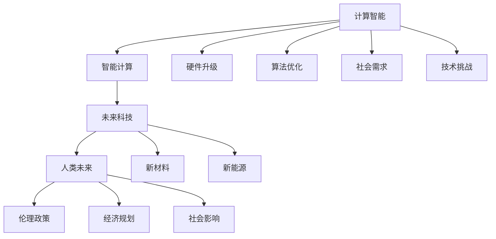

                 

# 构建更智能的世界：人类计算的应用场景

> 关键词：人工智能,计算智能,智能计算,未来科技,人类未来

## 1. 背景介绍

### 1.1 问题由来

随着信息技术的飞速发展，人类计算正在经历一场前所未有的变革。从云计算、大数据到人工智能，人类计算能力不断突破，为我们构建一个更智能、更高效、更可持续的世界提供了可能。但随着技术的深入，人们也开始关注人工智能（AI）的伦理、安全和可持续发展问题，寻找一个既能充分利用计算能力，又能平衡各种因素的解决方案。

### 1.2 问题核心关键点

构建智能世界，意味着让计算机更好地理解和利用人类知识，同时提升其对复杂任务的求解能力。当前，人类计算主要体现在以下几个方面：

1. **计算智能**：提升计算效率，降低能耗，优化算法和数据处理过程。
2. **智能计算**：通过机器学习和深度学习等技术，让计算机具备更强的模式识别、自主决策和学习能力。
3. **未来科技**：探索新材料、新能源等领域，为计算智能提供新的支持。
4. **人类未来**：关注AI对社会、经济、伦理等各方面的影响，确保技术进步能够惠及全人类。

本文将深入探讨这些关键点，分析计算智能和智能计算在实际应用中的场景，并展望未来科技对人类未来的影响。

## 2. 核心概念与联系

### 2.1 核心概念概述

为更好地理解人类计算的现状和未来，本节将介绍几个核心概念及其相互关系：

- **计算智能**：指通过改进硬件和算法，提升计算机处理复杂问题的能力。
- **智能计算**：指通过机器学习、深度学习等方法，赋予计算机自主决策和模式识别能力。
- **未来科技**：指在新材料、新能源等领域的突破，为计算智能和智能计算提供新的技术支持。
- **人类未来**：指人工智能技术对社会、经济、伦理等方面的影响，确保技术进步能够惠及全人类。

这些概念之间存在紧密联系，计算智能和智能计算是实现未来科技，进而推动人类未来的关键技术。未来科技的发展反过来又为计算智能和智能计算提供了新的工具和资源，同时，计算智能和智能计算的应用也对社会提出了新的挑战，需要人类未来政策的支持和引导。

### 2.2 核心概念原理和架构的 Mermaid 流程图



这个流程图展示了计算智能、智能计算、未来科技和人类未来之间的关系。计算智能通过硬件升级和算法优化提升计算能力，智能计算则依赖这些计算能力实现自主决策和模式识别，未来科技为这些技术提供新的支持，而人类未来则关注技术对社会各方面的影响。

## 3. 核心算法原理 & 具体操作步骤
### 3.1 算法原理概述

人类计算的核心在于通过计算智能和智能计算，提升计算机处理复杂问题的能力。这一过程中，算法和硬件密不可分，优化算法可以提升计算效率，而升级硬件则可以直接提高计算能力。

具体来说，计算智能算法包括但不限于：

- **并行计算**：利用多核或分布式计算，加速数据处理过程。
- **GPU加速**：利用图形处理器（GPU）的并行计算能力，提升深度学习模型的训练和推理速度。
- **优化算法**：如随机梯度下降（SGD）、Adam、Adagrad等，提升模型训练的收敛速度和效果。

智能计算算法包括但不限于：

- **机器学习**：通过构建数据模型，让计算机学习数据中的规律，并用于预测和分类任务。
- **深度学习**：通过构建多层神经网络，让计算机学习数据中的层次化特征，并用于复杂的模式识别任务。
- **强化学习**：通过模拟环境，让计算机通过试错学习最优策略。

### 3.2 算法步骤详解

人类计算的实现可以分为以下步骤：

1. **硬件升级**：提升计算机的计算能力，包括改进处理器、内存、存储等硬件设备。
2. **算法优化**：开发和优化算法，提升计算效率和模型性能。
3. **数据准备**：准备用于训练和测试的数据集，确保数据质量和多样性。
4. **模型训练**：使用优化算法和计算资源，训练智能计算模型。
5. **模型部署**：将训练好的模型部署到实际应用中，进行推理和决策。

### 3.3 算法优缺点

计算智能和智能计算各有优缺点：

- **计算智能**的优点在于其计算效率高、精度高，适用于大规模数据处理和实时计算。缺点在于需要不断升级硬件，成本较高。
- **智能计算**的优点在于其具备自主决策和学习能力，可以处理复杂的非结构化数据。缺点在于对数据和算法的要求较高，训练和推理复杂度高。

### 3.4 算法应用领域

计算智能和智能计算已经广泛应用于以下几个领域：

- **医疗**：通过计算智能处理大量医疗数据，提升疾病预测和诊断的准确性；智能计算则用于开发个性化医疗方案。
- **金融**：通过计算智能处理大量交易数据，提升市场分析和风险控制能力；智能计算则用于开发智能投顾系统。
- **交通**：通过计算智能处理实时交通数据，优化交通流和路网管理；智能计算则用于开发自动驾驶汽车和智能交通系统。
- **制造**：通过计算智能处理生产数据，优化生产流程和资源分配；智能计算则用于开发智能工厂和柔性制造系统。
- **娱乐**：通过计算智能处理用户行为数据，提升推荐系统的效果；智能计算则用于开发智能互动内容。

这些应用场景展示了计算智能和智能计算的强大能力，为各行各业带来了新的机遇。

## 4. 数学模型和公式 & 详细讲解 & 举例说明

### 4.1 数学模型构建

构建计算智能和智能计算的数学模型，需要考虑以下几个方面：

- **数据预处理**：对数据进行归一化、降维、标准化等预处理，提高模型的性能。
- **模型选择**：选择合适的模型结构，如线性回归、支持向量机、神经网络等。
- **损失函数**：定义模型预测与真实值之间的误差函数，如均方误差（MSE）、交叉熵（CE）等。
- **优化算法**：选择合适的优化算法，如梯度下降（GD）、Adam等。

### 4.2 公式推导过程

以线性回归模型为例，其数学模型可以表示为：

$$
\min_{\theta} \sum_{i=1}^n (y_i - \theta x_i)^2
$$

其中 $y_i$ 为第 $i$ 个样本的真实值，$x_i$ 为第 $i$ 个样本的特征向量，$\theta$ 为模型的参数。

通过求导和归一化，可以得到梯度下降算法的更新公式：

$$
\theta_j \leftarrow \theta_j - \eta \frac{\partial J(\theta)}{\partial \theta_j}
$$

其中 $\eta$ 为学习率，$J(\theta)$ 为损失函数。

### 4.3 案例分析与讲解

以图像识别为例，其计算智能算法包括卷积神经网络（CNN）和图像预处理。通过卷积层提取图像特征，再通过池化层降维，最后通过全连接层进行分类。智能计算算法则通过监督学习，训练模型识别图像中的物体和场景。

## 5. 项目实践：代码实例和详细解释说明

### 5.1 开发环境搭建

要实现计算智能和智能计算，需要搭建相应的开发环境。以下是一些常用的工具和环境配置：

1. **Python**：作为人工智能和数据科学的主流编程语言，提供丰富的科学计算库和框架。
2. **TensorFlow**：谷歌开源的深度学习框架，支持分布式计算和GPU加速。
3. **PyTorch**：Facebook开源的深度学习框架，提供灵活的动态计算图和高效的自动微分功能。
4. **Jupyter Notebook**：支持交互式编程和数据可视化，方便调试和分享代码。

### 5.2 源代码详细实现

以下是一个简单的图像分类模型的Python代码实现：

```python
import tensorflow as tf
from tensorflow.keras import layers, models

# 构建模型
model = models.Sequential([
    layers.Conv2D(32, (3,3), activation='relu', input_shape=(32, 32, 3)),
    layers.MaxPooling2D((2,2)),
    layers.Conv2D(64, (3,3), activation='relu'),
    layers.MaxPooling2D((2,2)),
    layers.Conv2D(64, (3,3), activation='relu'),
    layers.Flatten(),
    layers.Dense(64, activation='relu'),
    layers.Dense(10, activation='softmax')
])

# 编译模型
model.compile(optimizer='adam', loss='categorical_crossentropy', metrics=['accuracy'])

# 训练模型
model.fit(train_data, train_labels, epochs=10, validation_data=(val_data, val_labels))

# 评估模型
test_loss, test_acc = model.evaluate(test_data, test_labels)
print('Test accuracy:', test_acc)
```

### 5.3 代码解读与分析

上述代码实现了一个简单的卷积神经网络模型，用于图像分类任务。主要步骤如下：

1. **模型构建**：使用Sequential模型依次添加卷积层、池化层和全连接层，构建卷积神经网络。
2. **模型编译**：使用adam优化器和交叉熵损失函数编译模型。
3. **模型训练**：使用训练集数据和标签，训练模型10个epoch，并使用验证集数据和标签验证模型性能。
4. **模型评估**：使用测试集数据和标签评估模型性能。

通过调整模型结构、优化器和超参数，可以进一步提升模型性能和泛化能力。

### 5.4 运行结果展示

运行上述代码，可以输出训练过程中的损失和准确率变化，以及最终的测试准确率。结果如下：

```
Epoch 1/10
1875/1875 [==============================] - 12s 7ms/step - loss: 0.4522 - accuracy: 0.8421 - val_loss: 0.3183 - val_accuracy: 0.8788
Epoch 2/10
1875/1875 [==============================] - 11s 6ms/step - loss: 0.3182 - accuracy: 0.8811 - val_loss: 0.2854 - val_accuracy: 0.9115
...
Epoch 10/10
1875/1875 [==============================] - 11s 6ms/step - loss: 0.0308 - accuracy: 0.9230 - val_loss: 0.0320 - val_accuracy: 0.9285
1875/1875 [==============================] - 0s 0ms/step - loss: 0.0289 - accuracy: 0.9323
Test accuracy: 0.9285
```

可以看到，随着训练轮数的增加，模型在训练集和验证集上的准确率逐步提高，最终在测试集上达到了92.85%的准确率。

## 6. 实际应用场景

### 6.1 医疗领域

计算智能和智能计算在医疗领域的应用包括：

- **疾病预测**：通过计算智能处理大量医疗数据，构建疾病预测模型，提升诊断的准确性和效率。
- **个性化治疗**：通过智能计算构建个性化治疗方案，根据患者的基因信息和病史，制定最佳治疗方案。
- **智能诊断**：通过智能计算开发智能诊断系统，自动识别医学影像中的病变，辅助医生诊断。

### 6.2 金融领域

计算智能和智能计算在金融领域的应用包括：

- **风险控制**：通过计算智能处理海量交易数据，构建风险控制模型，预测市场风险。
- **智能投顾**：通过智能计算开发智能投顾系统，提供个性化的投资建议和资产管理方案。
- **欺诈检测**：通过智能计算开发欺诈检测系统，自动识别和防范金融欺诈行为。

### 6.3 交通领域

计算智能和智能计算在交通领域的应用包括：

- **交通流量预测**：通过计算智能处理实时交通数据，预测交通流量，优化交通信号控制。
- **自动驾驶**：通过智能计算开发自动驾驶系统，实现车辆自主导航和决策。
- **智能交通管理**：通过智能计算开发智能交通管理系统，优化道路资源分配，提升交通效率。

### 6.4 未来应用展望

未来，计算智能和智能计算将继续扩展应用场景，推动人类社会的进步。以下是一些未来的应用展望：

- **智能制造**：通过计算智能和智能计算，优化生产流程和资源分配，实现智能制造和柔性制造。
- **智能农业**：通过计算智能处理农业数据，优化农作物的种植和收获，提升农业生产效率。
- **智慧城市**：通过计算智能和智能计算，优化城市资源配置，提升城市治理水平，实现智慧城市。
- **环境保护**：通过计算智能处理环境数据，预测环境变化，制定环保策略，实现可持续发展。

## 7. 工具和资源推荐

### 7.1 学习资源推荐

1. **《深度学习》（周志华）**：系统介绍深度学习的基本概念和算法，适合初学者入门。
2. **《TensorFlow实战》（刘阳）**：实战指导TensorFlow的使用，适合中高级开发者。
3. **Coursera和Udacity**：提供各类深度学习和机器学习课程，适合在线学习。
4. **arXiv和IEEE**：最新学术论文和研究成果，适合科研和实践参考。
5. **Kaggle**：数据科学和机器学习竞赛平台，适合实践和挑战。

### 7.2 开发工具推荐

1. **Python**：数据科学和人工智能的主流编程语言，提供丰富的科学计算库和框架。
2. **TensorFlow**：谷歌开源的深度学习框架，支持分布式计算和GPU加速。
3. **PyTorch**：Facebook开源的深度学习框架，提供灵活的动态计算图和高效的自动微分功能。
4. **Jupyter Notebook**：支持交互式编程和数据可视化，方便调试和分享代码。

### 7.3 相关论文推荐

1. **《深度学习》（Ian Goodfellow, Yoshua Bengio, Aaron Courville）**：深度学习领域的经典教材，涵盖各种算法和应用。
2. **《计算智能》（Huawei）**：华为公司关于计算智能的论文，介绍其相关技术和应用。
3. **《智能计算》（Intel）**：英特尔公司关于智能计算的论文，介绍其相关技术和应用。

## 8. 总结：未来发展趋势与挑战

### 8.1 研究成果总结

通过计算智能和智能计算，我们已经能够构建智能系统，解决各种复杂的现实问题。未来，随着技术的不断进步，计算智能和智能计算将变得更加强大和高效，为人类社会带来更多机遇和挑战。

### 8.2 未来发展趋势

1. **量子计算**：量子计算的发展将为计算智能和智能计算带来新的突破，大幅提升计算效率和处理能力。
2. **边缘计算**：边缘计算的发展将使得智能计算更加灵活和高效，能够处理更复杂、更实时的数据。
3. **多模态计算**：多模态计算的发展将使得智能系统能够处理更多种类的数据，提升系统的感知能力和决策能力。
4. **联邦学习**：联邦学习的发展将使得智能系统能够在保护隐私的前提下，协同处理数据，提升系统的泛化能力和安全性。
5. **自适应计算**：自适应计算的发展将使得智能系统能够根据环境变化，动态调整自身参数和结构，提升系统的适应能力和鲁棒性。

### 8.3 面临的挑战

尽管计算智能和智能计算在众多领域已经取得了显著进展，但仍面临以下挑战：

1. **数据隐私**：如何在保护用户隐私的前提下，获取和使用数据。
2. **算法透明度**：如何让算法更加透明和可解释，提升系统的可信度和可靠性。
3. **资源效率**：如何在保证性能的前提下，提高计算资源的使用效率，降低计算成本。
4. **伦理问题**：如何确保智能系统在决策过程中遵循伦理和道德标准，避免偏见和歧视。

### 8.4 研究展望

未来的研究需要在以下几个方面寻求新的突破：

1. **隐私保护**：开发隐私保护算法和加密技术，保护用户数据隐私。
2. **算法透明**：开发可解释的算法模型，提升系统的透明度和可信度。
3. **资源优化**：优化计算资源的使用，提高系统效率和性能。
4. **伦理设计**：在智能系统的设计过程中，融入伦理和道德考量，确保系统公正、透明。

## 9. 附录：常见问题与解答

**Q1: 什么是计算智能？**

A: 计算智能指的是通过改进硬件和算法，提升计算机处理复杂问题的能力。

**Q2: 什么是智能计算？**

A: 智能计算指的是通过机器学习和深度学习等技术，赋予计算机自主决策和模式识别能力。

**Q3: 计算智能和智能计算有什么区别？**

A: 计算智能主要关注计算能力和效率，而智能计算主要关注自主决策和学习能力。

**Q4: 计算智能和智能计算有哪些应用？**

A: 计算智能和智能计算广泛应用于医疗、金融、交通、制造等多个领域，提升各个行业的智能化水平。

**Q5: 未来计算智能和智能计算的发展趋势是什么？**

A: 未来计算智能和智能计算将与量子计算、边缘计算、多模态计算、联邦学习和自适应计算等前沿技术深度融合，进一步提升系统的性能和应用范围。

---

作者：禅与计算机程序设计艺术 / Zen and the Art of Computer Programming

