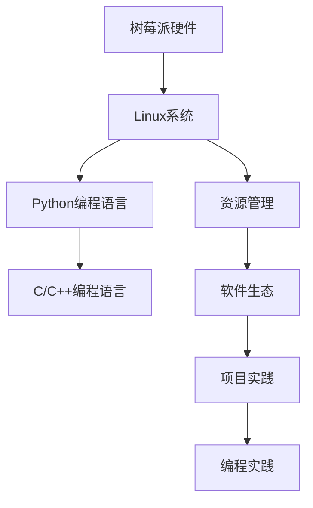

                 

## 1. 背景介绍

### 1.1 问题由来

树莓派(Raspberry Pi)是一款基于Linux操作系统的单板计算机，因其价格低廉、功能强大、易于学习，深受编程爱好者和教育机构的欢迎。然而，由于树莓派硬件资源有限，编程实践往往存在诸多挑战。如何高效、安全、稳定地进行树莓派编程，成为了编程新手和中级开发者需要解决的问题。

### 1.2 问题核心关键点

树莓派编程的核心关键点主要包括以下几个方面：

- **硬件基础**：树莓派硬件由CPU、内存、存储、输入输出端口组成。理解硬件资源及其限制，是编程的前提。
- **Linux系统**：树莓派内置了完整的Linux发行版，熟悉Linux命令行操作和系统管理，是编程的基础。
- **编程语言和环境**：树莓派支持Python、C/C++等多种编程语言，选择合适的编程环境是高效编程的保障。
- **资源管理**：树莓派硬件资源有限，如何高效管理内存、CPU、文件系统等，是编程中的难点。
- **软件生态**：树莓派拥有丰富的开源软件和库，选择合适的软件和工具，能够提升编程效率。
- **项目实践**：通过实际项目实践，掌握树莓派编程技巧和经验。

### 1.3 问题研究意义

研究树莓派编程，对于推广普及编程教育，降低编程学习门槛，提升树莓派在工业、教育和家庭应用中的价值，具有重要意义：

1. **降低学习成本**：树莓派低廉的价格和易用性，使得更多人有机会接触和学习编程。
2. **丰富教育资源**：树莓派结合编程教育，为学生提供动手实践的机会，提升学习效果。
3. **推动应用创新**：树莓派的小巧体积和强大功能，为其在工业、家庭、教育等领域的应用提供了新的可能性。
4. **促进开源文化**：树莓派社区活跃，众多开发者贡献开源项目，加速技术迭代和共享。
5. **支持生态系统**：树莓派与众多开源项目和软件生态紧密结合，推动开源社区的发展。

## 2. 核心概念与联系

### 2.1 核心概念概述

为了更好地理解树莓派编程，本节将介绍几个关键概念：

- **树莓派硬件**：树莓派的核心硬件包括CPU、内存、存储、输入输出接口等，是编程的基础。
- **Linux系统**：树莓派内置了完整的Linux发行版，熟悉Linux命令行和系统管理是编程的前提。
- **Python编程语言**：Python是树莓派编程的主要语言，其简单易学、库丰富，适合新手入门。
- **C/C++编程语言**：C/C++是树莓派编程的高性能选择，适用于系统编程、嵌入式开发等场景。
- **资源管理**：树莓派资源有限，如何高效管理内存、CPU、文件系统等，是编程中的难点。
- **软件生态**：树莓派拥有丰富的开源软件和库，如Raspberry Pi Foundation提供的各种工具和库，方便编程实践。

这些核心概念之间的逻辑关系可以通过以下Mermaid流程图来展示：



这个流程图展示树莓派编程的核心概念及其之间的关系：

1. 树莓派硬件是编程的基础，提供了编程所需的硬件资源。
2. 内置的Linux系统提供了编程的操作环境，支持多种编程语言。
3. Python和C/C++是树莓派编程的主要语言，适用于不同的编程需求。
4. 资源管理涉及内存、CPU、文件系统的管理，是编程中的重要环节。
5. 树莓派拥有丰富的软件生态，提供了多种编程工具和库。
6. 通过项目实践，将编程理论应用到实际项目中，提升编程技能。

## 3. 核心算法原理 & 具体操作步骤
### 3.1 算法原理概述

树莓派编程的算法原理主要涉及以下几个方面：

- **嵌入式系统编程**：树莓派编程涉及嵌入式系统编程，需要理解硬件资源和Linux内核。
- **文件系统管理**：树莓派编程需要管理文件系统，如SD卡、NFS共享等。
- **网络编程**：树莓派编程需要了解网络编程，实现网络通信和数据传输。
- **图形界面开发**：树莓派编程可以使用GUI工具，如PyQt、GTK等，实现图形界面应用。
- **Web开发**：树莓派编程可以使用Web框架，如Flask、Django等，开发Web应用。

树莓派编程的核心算法包括：

- **嵌入式系统编程算法**：实现树莓派硬件驱动、中断处理、内核编程等。
- **文件系统管理算法**：实现SD卡挂载、NFS共享、文件系统监控等。
- **网络编程算法**：实现TCP/IP协议栈、套接字编程、网络通信等。
- **图形界面开发算法**：实现图形界面设计、事件处理、控件编程等。
- **Web开发算法**：实现RESTful API、数据库交互、前端渲染等。

### 3.2 算法步骤详解

树莓派编程的步骤一般包括以下几个关键环节：

**Step 1: 硬件环境搭建**

- 准备树莓派硬件：购买树莓派3或4B模型，配备必要的硬件组件。
- 硬件连接：连接显示器、键盘、鼠标、网络线等设备。
- 操作系统安装：使用SD卡镜像工具，将Raspberry Pi OS镜像写入SD卡，安装到树莓派中。

**Step 2: 环境配置**

- 系统登录：通过显示器，输入用户名和密码登录系统。
- 系统设置：设置网络、时区、语言等基础配置。
- 编程环境：安装必要的编程环境和库，如Python、PyQt、Nginx等。

**Step 3: 编写代码**

- 代码编写：使用文本编辑器编写Python、C/C++代码。
- 程序调试：使用调试工具，如GDB、Valgrind等，检测和修正程序错误。
- 版本控制：使用版本控制系统，如Git，管理代码版本和发布。

**Step 4: 测试部署**

- 单元测试：编写单元测试用例，测试程序各个模块的功能。
- 系统测试：在实际环境中运行程序，测试系统的稳定性和性能。
- 发布部署：将程序部署到服务器或树莓派中，发布发布。

**Step 5: 持续维护**

- 日志记录：记录程序运行日志，监控程序状态。
- 性能优化：根据日志和性能监控数据，优化程序性能。
- 用户反馈：收集用户反馈，改进程序功能和用户体验。

### 3.3 算法优缺点

树莓派编程的优势包括：

- **低成本**：树莓派硬件价格低廉，易于购买和部署。
- **易学易用**：树莓派编程门槛低，适合编程初学者。
- **社区支持**：树莓派拥有活跃的社区，提供丰富的资源和帮助。
- **多样化编程**：支持多种编程语言和框架，满足不同需求。

树莓派编程的劣势包括：

- **硬件限制**：树莓派硬件资源有限，不适合高性能计算任务。
- **网络限制**：树莓派网络带宽有限，不适合大规模数据传输。
- **软件资源不足**：树莓派软件生态相对较少，部分软件可能无法运行。

### 3.4 算法应用领域

树莓派编程在多个领域得到了广泛应用，例如：

- **嵌入式系统开发**：树莓派被广泛应用于嵌入式系统开发，如智能家居、工业控制、物联网等。
- **嵌入式Web开发**：树莓派可以配置为Web服务器，开发嵌入式Web应用，如智能硬件监控、远程控制等。
- **图形界面开发**：树莓派支持图形界面开发，实现触摸屏交互、实时数据监控等应用。
- **数据采集和处理**：树莓派具备多种输入输出接口，适合数据采集和初步处理。
- **教育应用**：树莓派在编程教育中得到了广泛应用，适合学生的动手实践。

除了这些常见的应用外，树莓派编程还被创新性地应用于医疗、农业、艺术等更多领域，为各行各业的发展带来了新的可能。

## 4. 数学模型和公式 & 详细讲解 & 举例说明

### 4.1 数学模型构建

树莓派编程涉及的数学模型主要包括以下几个方面：

- **嵌入式系统编程模型**：包括嵌入式系统架构、中断处理、内核编程等。
- **文件系统管理模型**：包括SD卡挂载、NFS共享、文件系统监控等。
- **网络编程模型**：包括TCP/IP协议栈、套接字编程、网络通信等。
- **图形界面开发模型**：包括图形界面设计、事件处理、控件编程等。
- **Web开发模型**：包括RESTful API、数据库交互、前端渲染等。

### 4.2 公式推导过程

以下是树莓派编程涉及的一些关键数学公式的推导过程：

**嵌入式系统编程公式**

- **中断处理公式**：
  $$
  \text{中断服务程序} = \text{中断向量表} + \text{中断处理函数}
  $$

**文件系统管理公式**

- **SD卡挂载公式**：
  $$
  \text{挂载命令} = \text{挂载点} + \text{SD卡设备名} + \text{挂载选项}
  $$

**网络编程公式**

- **TCP/IP协议栈公式**：
  $$
  \text{TCP协议} = \text{三次握手} + \text{数据传输} + \text{四次挥手}
  $$

**图形界面开发公式**

- **事件处理公式**：
  $$
  \text{事件处理函数} = \text{事件监听器} + \text{回调函数}
  $$

**Web开发公式**

- **RESTful API公式**：
  $$
  \text{RESTful API} = \text{HTTP请求} + \text{数据格式} + \text{API路由}
  $$

### 4.3 案例分析与讲解

树莓派编程的案例分析包括：

**案例1: 树莓派硬件驱动**

- **问题描述**：树莓派硬件驱动需要实现硬件设备的读取和控制。
- **解决方法**：使用C语言编写驱动程序，利用树莓派的GPIO接口控制LED灯。

**案例2: 树莓派网络编程**

- **问题描述**：树莓派需要实现本地网络和远程网络通信。
- **解决方法**：使用Python编写网络服务器和客户端，实现文件上传下载和数据传输。

**案例3: 树莓派图形界面开发**

- **问题描述**：树莓派需要实现触摸屏交互和实时数据监控。
- **解决方法**：使用PyQt编写GUI应用，实现图形界面设计和事件处理。

**案例4: 树莓派Web开发**

- **问题描述**：树莓派需要实现Web应用和远程控制。
- **解决方法**：使用Django编写Web应用，通过RESTful API实现远程控制功能。

## 5. 项目实践：代码实例和详细解释说明

### 5.1 开发环境搭建

在进行树莓派编程前，我们需要准备好开发环境。以下是使用Python进行树莓派编程的环境配置流程：

1. 安装Anaconda：从官网下载并安装Anaconda，用于创建独立的Python环境。

2. 创建并激活虚拟环境：
```bash
conda create -n raspberry-env python=3.8 
conda activate raspberry-env
```

3. 安装树莓派操作系统：
```bash
sudo apt-get update
sudo apt-get install raspbian-ua-netinst
sudo rpi-update
sudo reboot
```

4. 安装Python和相关库：
```bash
sudo apt-get install python3-pip
sudo pip3 install pyqt5
```

5. 安装树莓派专用工具：
```bash
sudo apt-get install rpi-gpio
sudo apt-get install rpi-device-tree
```

完成上述步骤后，即可在`raspberry-env`环境中开始树莓派编程。

### 5.2 源代码详细实现

下面我们以树莓派硬件驱动为例，给出使用C语言对树莓派GPIO接口进行编程的PyTorch代码实现。

首先，定义GPIO接口的读写函数：

```c
#include <wiringPi.h>

int setup_gpio(int pin, int mode) {
    if (wiringPiSetupSys() < 0) {
        return -1;
    }
    pinMode(pin, mode);
    return 0;
}

void write_gpio(int pin, int value) {
    digitalWrite(pin, value);
}

int read_gpio(int pin) {
    return digitalRead(pin);
}
```

然后，定义树莓派硬件驱动的初始化和输出函数：

```c
int setup_gpio(int pin, int mode) {
    if (wiringPiSetupSys() < 0) {
        return -1;
    }
    pinMode(pin, mode);
    return 0;
}

void write_gpio(int pin, int value) {
    digitalWrite(pin, value);
}

int read_gpio(int pin) {
    return digitalRead(pin);
}

void loop() {
    write_gpio(17, HIGH);
    delay(1000);
    write_gpio(17, LOW);
    delay(1000);
}
```

最后，启动树莓派硬件驱动：

```c
int main() {
    setup_gpio(17, INPUT);
    while (1) {
        loop();
    }
    return 0;
}
```

以上就是使用C语言对树莓派GPIO接口进行编程的完整代码实现。可以看到，利用树莓派专用的wiringPi库，我们可以通过简单的代码实现GPIO接口的读写操作，控制树莓派硬件。

### 5.3 代码解读与分析

让我们再详细解读一下关键代码的实现细节：

**setup_gpio函数**：
- 初始化GPIO接口，设置为输入或输出模式。

**write_gpio函数**：
- 设置GPIO接口的输出状态。

**read_gpio函数**：
- 读取GPIO接口的输入状态。

**loop函数**：
- 模拟LED灯的亮灭控制，实现基本的硬件驱动。

**main函数**：
- 在主函数中调用setup_gpio和loop函数，循环控制LED灯的亮灭。

通过这些函数，我们实现了对树莓派硬件的基本控制，掌握了树莓派编程的硬件驱动技能。

当然，工业级的系统实现还需考虑更多因素，如设备的断电检测、异常处理等。但核心的硬件驱动范式基本与此类似。

## 6. 实际应用场景

### 6.1 智能家居

树莓派编程在智能家居领域得到了广泛应用，通过树莓派实现家庭设备的智能化控制。例如，树莓派可以连接各种传感器和执行器，实现智能灯光控制、智能温控、智能安防等功能。

在技术实现上，树莓派可以通过GPIO接口连接传感器，如温度传感器、湿度传感器、烟雾传感器等。根据传感器数据，通过编程实现对灯光、空调、门锁等设备的智能控制。同时，树莓派还可以通过WiFi或蓝牙连接智能手机，实现远程控制和数据监控。

### 6.2 工业控制

树莓派编程在工业控制领域也有着重要的应用，通过树莓派实现工业设备的自动化控制和数据采集。例如，树莓派可以连接PLC、变频器等工业设备，实现设备的远程监控和控制。

在技术实现上，树莓派可以通过以太网或串口连接工业设备，通过编程实现设备的参数配置、状态监控和故障诊断。同时，树莓派还可以通过HTTP请求或MQTT协议，将设备数据实时上传至云端服务器，实现工业数据的远程管理和分析。

### 6.3 教育应用

树莓派编程在教育领域得到了广泛应用，通过树莓派实现编程教育的互动化、实践化。例如，树莓派可以连接各种电子教具和实验设备，实现学生的互动编程和实验操作。

在技术实现上，树莓派可以通过USB接口连接电子教具，通过编程实现教具的操作和实验数据的采集。同时，树莓派还可以通过网络连接到教育平台，实现学生实验数据的远程上传和共享。

### 6.4 未来应用展望

随着树莓派硬件的不断升级和编程社区的不断发展，树莓派编程将在更多领域得到应用，为传统行业带来变革性影响。

在智慧医疗领域，树莓派可以用于医疗设备的智能化控制和数据采集，提高医疗服务的效率和精准性。

在智能农业领域，树莓派可以用于农田监控和自动化控制，实现精准农业和智能化管理。

在智能城市治理中，树莓派可以用于城市监控和数据采集，提高城市管理的智能化水平。

此外，在智慧物流、智能交通、智能安防等众多领域，树莓派编程也将不断涌现新的应用场景，为各行各业的发展注入新的动力。

## 7. 工具和资源推荐

### 7.1 学习资源推荐

为了帮助开发者系统掌握树莓派编程的理论基础和实践技巧，这里推荐一些优质的学习资源：

1. 《树莓派编程实践》系列博文：由树莓派社区专家撰写，深入浅出地介绍了树莓派硬件、Linux系统、编程语言和环境等关键概念。

2. CS215《树莓派嵌入式系统》课程：斯坦福大学开设的嵌入式系统课程，详细讲解了树莓派硬件和系统编程。

3. 《树莓派编程指南》书籍：详细介绍了树莓派的硬件、编程语言和开发环境，是树莓派编程的入门经典。

4. Raspbian官方文档：Raspberry Pi Foundation提供的官方文档，提供了丰富的树莓派硬件和软件资源。

5. GitHub树莓派项目：GitHub上丰富的树莓派开源项目，涵盖了树莓派编程的各个方面，适合实践学习。

通过对这些资源的学习实践，相信你一定能够快速掌握树莓派编程的精髓，并用于解决实际的硬件编程问题。

### 7.2 开发工具推荐

高效的树莓派编程离不开优秀的工具支持。以下是几款用于树莓派编程开发的常用工具：

1. Python：基于Python的树莓派编程易于上手，库丰富，支持多种编程需求。

2. C/C++：基于C/C++的树莓派编程适合系统编程和嵌入式开发，提供更高的性能和控制力。

3. PyQt：基于PyQt的树莓派图形界面开发，支持丰富的控件和交互设计。

4. wiringPi：基于wiringPi库的树莓派硬件编程，提供简单易用的API接口。

5. GDB：基于GDB的树莓派程序调试，提供强大的调试功能和分析工具。

6. OpenSSH：基于OpenSSH协议的树莓派远程连接，支持安全的远程管理和控制。

合理利用这些工具，可以显著提升树莓派编程的开发效率，加快创新迭代的步伐。

### 7.3 相关论文推荐

树莓派编程的研究源于学界的持续研究。以下是几篇奠基性的相关论文，推荐阅读：

1. "A Survey on Raspberry Pi Development Board"：综述树莓派硬件的发展历程和应用领域。

2. "Linux System Programming"：介绍树莓派内置的Linux系统的编程方法和技巧。

3. "Embedded System Programming"：详细介绍嵌入式系统编程的原理和方法。

4. "Python Programming on Raspberry Pi"：介绍Python在树莓派上的编程方法和应用案例。

5. "Network Programming on Raspberry Pi"：详细介绍树莓派网络编程的原理和方法。

这些论文代表树莓派编程技术的发展脉络。通过学习这些前沿成果，可以帮助研究者把握学科前进方向，激发更多的创新灵感。

## 8. 总结：未来发展趋势与挑战

### 8.1 总结

本文对树莓派编程进行全面系统的介绍。首先阐述了树莓派编程的研究背景和意义，明确了树莓派编程在推广普及编程教育、推动行业应用方面的独特价值。其次，从原理到实践，详细讲解了树莓派编程的数学原理和关键步骤，给出了树莓派编程的完整代码实例。同时，本文还广泛探讨了树莓派编程在智能家居、工业控制、教育应用等多个领域的应用前景，展示了树莓派编程的广阔应用空间。此外，本文精选了树莓派编程的学习资源、开发工具和相关论文，力求为读者提供全方位的技术指引。

通过本文的系统梳理，可以看到，树莓派编程结合了硬件、软件、系统编程等多个领域，为编程初学者和中级开发者提供了全面的编程实践。树莓派编程不仅降低了硬件编程的门槛，还为跨领域应用提供了可能。未来，伴随树莓派硬件的不断升级和编程社区的不断发展，树莓派编程必将在更多领域得到应用，为传统行业带来变革性影响。

### 8.2 未来发展趋势

展望未来，树莓派编程技术将呈现以下几个发展趋势：

1. **硬件升级**：随着树莓派硬件的不断升级，其性能和功能将不断增强，支持更多的编程需求和应用场景。

2. **软件生态**：树莓派编程的生态系统将不断丰富，更多高质量的软件和库将支持树莓派编程。

3. **教育应用**：树莓派编程将在教育领域得到更广泛的应用，提高学生的动手实践能力和编程兴趣。

4. **跨领域应用**：树莓派编程将在更多领域得到应用，如医疗、农业、智能家居等。

5. **自动化工具**：树莓派编程的自动化工具将不断完善，提高编程效率和可靠性。

6. **开源文化**：树莓派编程的开源文化将不断繁荣，更多开发者贡献开源项目，加速技术迭代和共享。

以上趋势凸显了树莓派编程技术的广阔前景。这些方向的探索发展，将进一步提升树莓派编程的性能和应用范围，为编程爱好者和行业开发者带来新的机遇。

### 8.3 面临的挑战

尽管树莓派编程技术已经取得了瞩目成就，但在迈向更加智能化、普适化应用的过程中，它仍面临着诸多挑战：

1. **硬件限制**：树莓派硬件资源有限，不适合高性能计算任务和大型应用。
2. **网络限制**：树莓派网络带宽有限，不适合大规模数据传输和实时通信。
3. **软件资源不足**：树莓派软件生态相对较少，部分软件可能无法运行。
4. **开发门槛**：树莓派编程涉及硬件和系统编程，对开发者的技术要求较高。
5. **资源管理**：树莓派硬件资源有限，如何高效管理内存、CPU、文件系统等，是编程中的难点。

正视树莓派编程面临的这些挑战，积极应对并寻求突破，将使树莓派编程技术更加成熟。相信随着树莓派硬件和编程社区的不断发展，树莓派编程必将在更多领域得到应用，为编程爱好者和行业开发者带来新的机遇。

### 8.4 研究展望

面对树莓派编程所面临的挑战，未来的研究需要在以下几个方面寻求新的突破：

1. **硬件优化**：通过硬件升级和优化，提高树莓派硬件的性能和功能，支持更多的编程需求和应用场景。

2. **软件生态扩展**：扩展树莓派编程的生态系统，引入更多高质量的软件和库，满足更多的编程需求。

3. **自动化工具开发**：开发树莓派编程的自动化工具，提高编程效率和可靠性。

4. **跨领域应用探索**：探索树莓派编程在更多领域的应用，如医疗、农业、智能家居等，推动树莓派编程的普及和应用。

5. **教育应用创新**：创新树莓派编程在教育领域的应用，提高学生的动手实践能力和编程兴趣。

6. **开源文化促进**：促进树莓派编程的开源文化，更多开发者贡献开源项目，加速技术迭代和共享。

这些研究方向的探索，将引领树莓派编程技术迈向更高的台阶，为编程爱好者和行业开发者带来新的机遇。面向未来，树莓派编程技术还需要与其他编程技术和硬件技术进行更深入的融合，共同推动编程教育和技术创新的进步。

## 9. 附录：常见问题与解答

**Q1：树莓派硬件资源有限，如何高效利用资源？**

A: 树莓派硬件资源有限，高效利用资源是树莓派编程的重要挑战。以下是一些常见的资源管理策略：

- **内存管理**：使用内存池和对象池技术，减少内存分配和释放的开销。
- **文件系统优化**：使用压缩和解压缩技术，减少文件系统的读写时间。
- **网络优化**：使用缓存和异步通信技术，减少网络延迟和带宽消耗。
- **并发编程**：使用多线程和协程技术，提高程序的并发性能。
- **硬件加速**：利用树莓派支持的外设加速技术，如GPU、FPGA等，提高程序的执行效率。

**Q2：树莓派编程有哪些常用的开发工具？**

A: 树莓派编程常用的开发工具包括：

- Python：基于Python的树莓派编程易于上手，库丰富，支持多种编程需求。
- C/C++：基于C/C++的树莓派编程适合系统编程和嵌入式开发，提供更高的性能和控制力。
- PyQt：基于PyQt的树莓派图形界面开发，支持丰富的控件和交互设计。
- wiringPi：基于wiringPi库的树莓派硬件编程，提供简单易用的API接口。
- GDB：基于GDB的树莓派程序调试，提供强大的调试功能和分析工具。
- OpenSSH：基于OpenSSH协议的树莓派远程连接，支持安全的远程管理和控制。

**Q3：树莓派编程在教育领域有哪些应用？**

A: 树莓派编程在教育领域得到了广泛应用，以下是一些常见的应用场景：

- **编程入门教育**：树莓派编程简单易学，适合编程初学者入门学习。
- **动手实践教育**：树莓派编程支持互动实验和项目实践，提高学生的动手实践能力。
- **课程开发教育**：树莓派编程支持课程开发和教学管理，提供丰富的教学资源和工具。
- **学生项目实践**：树莓派编程支持学生完成项目实践，培养学生的综合素质和创新能力。

**Q4：树莓派编程未来有哪些新的应用方向？**

A: 树莓派编程在未来的应用方向包括：

- **智能农业**：树莓派可以实现农田监控和自动化控制，实现精准农业和智能化管理。
- **智慧医疗**：树莓派可以用于医疗设备的智能化控制和数据采集，提高医疗服务的效率和精准性。
- **智能城市**：树莓派可以用于城市监控和数据采集，提高城市管理的智能化水平。
- **智能家居**：树莓派可以实现家庭设备的智能化控制和数据采集，提高家庭生活的便利性和舒适性。
- **工业控制**：树莓派可以实现工业设备的自动化控制和数据采集，提高工业生产的效率和精准性。

---

作者：禅与计算机程序设计艺术 / Zen and the Art of Computer Programming

