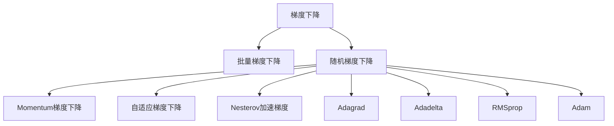

                 

## 1. 背景介绍

### 1.1 问题由来
在深度学习中，优化算法是训练神经网络不可或缺的一部分。特别是对于深度神经网络，由于参数众多，梯度优化算法的作用尤为关键。梯度下降（Gradient Descent, GD）是一种基础的梯度优化算法，其核心思想是通过迭代更新模型参数，使损失函数最小化。

然而，传统的梯度下降方法存在一些局限性，如收敛速度慢、容易陷入局部最优解等。为了克服这些缺陷，多种改进的梯度下降方法被提出，如批量梯度下降（Batch Gradient Descent, BGD）、随机梯度下降（Stochastic Gradient Descent, SGD）、动量梯度下降（Momentum Gradient Descent）、自适应梯度下降（Adaptive Gradient Descent）等。这些改进方法在理论上有一定突破，但实际应用中如何高效、稳定地训练模型仍是当前深度学习研究的重要课题。

### 1.2 问题核心关键点
本节将详细介绍梯度下降算法的核心概念及其优化策略。

- 梯度下降算法：通过计算损失函数对模型参数的梯度，并沿着梯度的反方向更新参数，使损失函数最小化。
- 批量梯度下降（BGD）：在每次更新时使用所有训练样本的梯度，计算稳定但速度慢。
- 随机梯度下降（SGD）：在每次更新时使用单个样本的梯度，速度较快但不稳定。
- 动量梯度下降（Momentum GD）：结合历史梯度信息，增加更新方向的速度和稳定性。
- 自适应梯度下降（Adaptive GD）：根据梯度大小动态调整学习率，进一步提升训练效果。
- Nesterov加速梯度（NAG）：在更新方向上提前一步，使动量梯度下降更准确。

### 1.3 问题研究意义
研究梯度下降算法及其优化策略，对深度学习模型的训练效率、稳定性、可解释性等方面具有重要意义：

1. 提升训练速度：改进的梯度下降方法，如Momentum GD和NAG，能够有效加速模型的收敛速度。
2. 增强稳定性：通过引入动量、自适应学习率等技术，算法能够更好地避免陷入局部最优解，提升模型的泛化性能。
3. 提高可解释性：通过对不同梯度下降方法的性能进行分析和比较，能够更好地理解深度学习模型的优化过程。
4. 支持模型调参：掌握梯度下降算法的原理，有助于理解和学习如何选择合适的超参数，如学习率、批次大小等。

## 2. 核心概念与联系

### 2.1 核心概念概述

为更好地理解梯度下降算法及其优化方法，本节将介绍几个密切相关的核心概念：

- 梯度下降：通过计算损失函数对模型参数的梯度，并沿着梯度的反方向更新参数，使损失函数最小化。
- 批量梯度下降（BGD）：在每次更新时使用所有训练样本的梯度，计算稳定但速度慢。
- 随机梯度下降（SGD）：在每次更新时使用单个样本的梯度，速度较快但不稳定。
- 动量梯度下降（Momentum GD）：结合历史梯度信息，增加更新方向的速度和稳定性。
- 自适应梯度下降（Adaptive GD）：根据梯度大小动态调整学习率，进一步提升训练效果。
- Nesterov加速梯度（NAG）：在更新方向上提前一步，使动量梯度下降更准确。
- Adagrad：根据历史梯度平方和动态调整学习率，适应不同参数的更新速度。
- Adadelta：根据历史梯度和更新量的平方和动态调整学习率，进一步提升算法的性能。
- RMSprop：结合Adagrad和Adadelta的优点，在平滑性和收敛速度上取得平衡。
- Adam：结合动量和自适应学习率的优点，进一步提高训练效率和稳定性。

这些核心概念之间的逻辑关系可以通过以下Mermaid流程图来展示：



这个流程图展示了梯度下降及其优化方法之间的关系：

1. 梯度下降是基础，其他方法均在梯度下降的基础上进行改进。
2. 批量梯度下降计算稳定但速度慢，随机梯度下降速度快但不稳定。
3. 动量梯度下降、Nesterov加速梯度增加了更新方向的速度和稳定性。
4. 自适应梯度下降通过动态调整学习率，进一步提升训练效果。
5. Adagrad、Adadelta、RMSprop、Adam均是自适应梯度下降的变种，具有不同的动态调整策略。

这些核心概念共同构成了梯度下降算法的理论基础和实际应用框架，使其能够高效地优化深度学习模型的参数。通过理解这些核心概念，我们可以更好地把握梯度下降算法的优化策略，并在实际应用中灵活选择合适的方法。

## 3. 核心算法原理 & 具体操作步骤

### 3.1 算法原理概述

梯度下降算法的核心思想是通过计算损失函数对模型参数的梯度，并沿着梯度的反方向更新参数，使损失函数最小化。其数学公式可以表示为：

$$
\theta_{t+1} = \theta_t - \eta \nabla_{\theta} \mathcal{L}(\theta_t)
$$

其中，$\theta_t$ 表示在第 $t$ 次更新后的模型参数，$\eta$ 为学习率，$\nabla_{\theta} \mathcal{L}(\theta_t)$ 表示损失函数对参数的梯度。

梯度下降算法通过不断迭代更新参数，逐步优化模型的损失函数。在训练过程中，通过反向传播算法计算梯度，使用随机梯度下降方法（SGD）等优化方法进行参数更新，使得模型能够逐渐接近最优解。

### 3.2 算法步骤详解

梯度下降算法的具体操作步骤如下：

**Step 1: 初始化模型参数**

首先，我们需要对模型参数进行初始化。在深度学习中，常用的初始化方法包括：

- 随机初始化：随机生成模型参数的初始值。
- 正态分布初始化：按照正态分布生成模型参数的初始值。
- Xavier初始化：将模型参数的初始值按正态分布或均匀分布进行初始化，以保持神经元之间的平衡激活。
- He初始化：针对ReLU激活函数，将模型参数的初始值按正态分布进行初始化，以保持神经元之间的平衡激活。

**Step 2: 定义损失函数**

接下来，我们需要定义损失函数 $\mathcal{L}$，用于衡量模型在训练集上的性能。常用的损失函数包括：

- 均方误差损失：用于回归任务，计算预测值与真实值之间的平方误差。
- 交叉熵损失：用于分类任务，计算预测概率与真实标签之间的差异。
- KL散度损失：用于度量概率分布之间的差异，常用于生成模型。

**Step 3: 计算梯度**

使用反向传播算法，计算损失函数对模型参数的梯度 $\nabla_{\theta} \mathcal{L}(\theta)$。这一步通常需要借助深度学习框架，如TensorFlow、PyTorch等，自动化地计算梯度。

**Step 4: 更新模型参数**

根据梯度信息，使用梯度下降方法更新模型参数。具体步骤如下：

1. 初始化学习率 $\eta$，通常设定为0.01或0.001。
2. 根据定义的损失函数和梯度计算方法，计算损失函数对模型参数的梯度。
3. 使用梯度信息更新模型参数，通常使用随机梯度下降方法（SGD）进行更新。
4. 记录更新次数和损失值，判断是否达到预设的停止条件。

**Step 5: 重复迭代**

重复执行上述步骤，直到达到预设的停止条件，如最大迭代次数、最小损失值或模型收敛。

### 3.3 算法优缺点

梯度下降算法具有以下优点：

1. 简单易懂：梯度下降算法逻辑清晰，易于理解。
2. 灵活性强：根据不同的任务和数据分布，可以调整学习率、批次大小等超参数。
3. 收敛可靠：在训练集上，梯度下降算法能够收敛到全局最优解或局部最优解。

同时，梯度下降算法也存在一些缺点：

1. 收敛速度慢：对于大规模数据集，梯度下降算法的收敛速度较慢。
2. 容易陷入局部最优解：在复杂的数据分布中，梯度下降算法容易陷入局部最优解。
3. 需要手动调整超参数：梯度下降算法需要手动调整学习率、批次大小等超参数，影响模型性能。

尽管存在这些局限性，但梯度下降算法仍是深度学习中最基础、最常用的优化方法之一。

### 3.4 算法应用领域

梯度下降算法及其变种在深度学习领域得到了广泛应用，主要应用于以下领域：

1. 图像识别：使用梯度下降算法训练卷积神经网络，实现图像分类、目标检测等任务。
2. 语音识别：使用梯度下降算法训练循环神经网络，实现语音识别、语音合成等任务。
3. 自然语言处理：使用梯度下降算法训练循环神经网络、Transformer等模型，实现机器翻译、文本生成等任务。
4. 强化学习：使用梯度下降算法训练深度强化学习模型，实现游戏智能、机器人控制等任务。

除了上述这些经典应用领域外，梯度下降算法还被创新性地应用于更多场景中，如优化、物理学、金融预测等，为深度学习技术带来了新的突破。

## 4. 数学模型和公式 & 详细讲解 & 举例说明

### 4.1 数学模型构建

本节将使用数学语言对梯度下降算法的核心步骤进行更加严格的刻画。

假设模型 $f(\theta)$ 的损失函数为 $\mathcal{L}(\theta)$，其中 $\theta$ 为模型参数，$x$ 为输入样本。梯度下降算法的目标是最小化损失函数 $\mathcal{L}(\theta)$，即：

$$
\theta^* = \mathop{\arg\min}_{\theta} \mathcal{L}(\theta)
$$

在训练过程中，我们使用随机梯度下降（SGD）方法更新模型参数，其数学公式为：

$$
\theta_{t+1} = \theta_t - \eta \nabla_{\theta} f(x_t)
$$

其中 $\eta$ 为学习率，$\nabla_{\theta} f(x_t)$ 为模型 $f(\theta)$ 在输入样本 $x_t$ 上的梯度。

### 4.2 公式推导过程

以下我们以二分类任务为例，推导梯度下降算法的核心公式。

假设模型 $f(\theta)$ 在输入 $x$ 上的输出为 $y = f(\theta(x))$，表示样本属于正类的概率。真实标签 $y \in \{0,1\}$。则二分类交叉熵损失函数定义为：

$$
\ell(f(x), y) = -y \log y - (1-y) \log (1-y)
$$

将其代入经验风险公式，得：

$$
\mathcal{L}(\theta) = -\frac{1}{N} \sum_{i=1}^N \ell(f(x_i), y_i)
$$

根据链式法则，损失函数对参数 $\theta_k$ 的梯度为：

$$
\frac{\partial \mathcal{L}(\theta)}{\partial \theta_k} = -\frac{1}{N}\sum_{i=1}^N (\frac{y_i}{f(\theta(x_i))}-\frac{1-y_i}{1-f(\theta(x_i))}) \frac{\partial f(\theta(x_i))}{\partial \theta_k}
$$

其中 $\frac{\partial f(\theta(x_i))}{\partial \theta_k}$ 可进一步递归展开，利用自动微分技术完成计算。

在得到损失函数的梯度后，即可带入梯度下降算法的核心公式，进行模型参数的更新。

### 4.3 案例分析与讲解

以图像识别任务为例，详细分析梯度下降算法的应用。

首先，定义模型 $f(\theta)$ 和损失函数 $\mathcal{L}(\theta)$：

```python
import tensorflow as tf
import numpy as np

# 定义模型
class CNN(tf.keras.Model):
    def __init__(self):
        super(CNN, self).__init__()
        self.conv1 = tf.keras.layers.Conv2D(32, (3, 3), activation='relu')
        self.pool1 = tf.keras.layers.MaxPooling2D((2, 2))
        self.conv2 = tf.keras.layers.Conv2D(64, (3, 3), activation='relu')
        self.pool2 = tf.keras.layers.MaxPooling2D((2, 2))
        self.flatten = tf.keras.layers.Flatten()
        self.dense1 = tf.keras.layers.Dense(128, activation='relu')
        self.dense2 = tf.keras.layers.Dense(10, activation='softmax')

    def call(self, x):
        x = self.conv1(x)
        x = self.pool1(x)
        x = self.conv2(x)
        x = self.pool2(x)
        x = self.flatten(x)
        x = self.dense1(x)
        x = self.dense2(x)
        return x

# 定义损失函数
def loss_fn(y_true, y_pred):
    return tf.keras.losses.sparse_categorical_crossentropy(y_true, y_pred, from_logits=True)

# 构建模型
model = CNN()
```

然后，定义数据集并划分训练集和验证集：

```python
# 加载数据集
(x_train, y_train), (x_val, y_val) = tf.keras.datasets.mnist.load_data()

# 数据预处理
x_train = x_train.reshape(-1, 28, 28, 1).astype('float32') / 255.0
x_val = x_val.reshape(-1, 28, 28, 1).astype('float32') / 255.0
y_train = tf.keras.utils.to_categorical(y_train)
y_val = tf.keras.utils.to_categorical(y_val)

# 划分训练集和验证集
train_size = int(0.8 * len(x_train))
val_size = len(x_train) - train_size
train_x = x_train[:train_size]
train_y = y_train[:train_size]
val_x = x_val
val_y = y_val
```

接下来，定义梯度下降算法的核心部分：

```python
# 定义学习率
learning_rate = 0.01

# 定义梯度下降算法
optimizer = tf.keras.optimizers.SGD(learning_rate)

# 定义训练函数
@tf.function
def train_step(x, y):
    with tf.GradientTape() as tape:
        logits = model(x)
        loss = loss_fn(y, logits)
    gradients = tape.gradient(loss, model.trainable_variables)
    optimizer.apply_gradients(zip(gradients, model.trainable_variables))

# 定义评估函数
@tf.function
def evaluate(x, y):
    logits = model(x)
    loss = loss_fn(y, logits)
    return loss
```

最后，启动训练流程并在验证集上评估：

```python
# 训练模型
epochs = 10
batch_size = 128

for epoch in range(epochs):
    total_loss = 0
    for i in range(0, len(train_x), batch_size):
        x_batch = train_x[i:i+batch_size]
        y_batch = train_y[i:i+batch_size]
        train_step(x_batch, y_batch)
        total_loss += evaluate(val_x, val_y)
    print(f"Epoch {epoch+1}, validation loss: {total_loss}")
```

以上就是使用TensorFlow对CNN模型进行梯度下降算法训练的完整代码实现。可以看到，TensorFlow提供了方便的API进行梯度计算和模型更新，大大简化了深度学习模型的训练过程。

## 5. 项目实践：代码实例和详细解释说明

### 5.1 开发环境搭建

在进行梯度下降算法实践前，我们需要准备好开发环境。以下是使用Python进行TensorFlow开发的环境配置流程：

1. 安装Anaconda：从官网下载并安装Anaconda，用于创建独立的Python环境。

2. 创建并激活虚拟环境：
```bash
conda create -n tf-env python=3.8 
conda activate tf-env
```

3. 安装TensorFlow：根据CUDA版本，从官网获取对应的安装命令。例如：
```bash
conda install tensorflow -c tf -c conda-forge
```

4. 安装各类工具包：
```bash
pip install numpy pandas scikit-learn matplotlib tqdm jupyter notebook ipython
```

完成上述步骤后，即可在`tf-env`环境中开始梯度下降算法的实践。

### 5.2 源代码详细实现

这里我们以线性回归任务为例，给出使用TensorFlow实现梯度下降算法的PyTorch代码实现。

首先，定义线性回归模型的输入和输出：

```python
import tensorflow as tf

# 定义模型
class LinearRegression(tf.keras.Model):
    def __init__(self):
        super(LinearRegression, self).__init__()
        self.w = tf.Variable(tf.random.normal([1]))
        self.b = tf.Variable(tf.random.normal([1]))

    def call(self, x):
        return self.w * x + self.b

# 定义损失函数
def loss_fn(y_true, y_pred):
    return tf.keras.losses.mean_squared_error(y_true, y_pred)

# 构建模型
model = LinearRegression()
```

然后，定义数据集并划分训练集和验证集：

```python
# 加载数据集
(x_train, y_train), (x_val, y_val) = tf.keras.datasets.boston_housing.load_data()

# 数据预处理
x_train = x_train.astype('float32') / 10.0
x_val = x_val.astype('float32') / 10.0
y_train = y_train.reshape(-1, 1).astype('float32')
y_val = y_val.reshape(-1, 1).astype('float32')

# 划分训练集和验证集
train_size = int(0.8 * len(x_train))
val_size = len(x_train) - train_size
train_x = x_train[:train_size]
train_y = y_train[:train_size]
val_x = x_val
val_y = y_val
```

接下来，定义梯度下降算法的核心部分：

```python
# 定义学习率
learning_rate = 0.01

# 定义梯度下降算法
optimizer = tf.keras.optimizers.SGD(learning_rate)

# 定义训练函数
@tf.function
def train_step(x, y):
    with tf.GradientTape() as tape:
        logits = model(x)
        loss = loss_fn(y, logits)
    gradients = tape.gradient(loss, [model.w, model.b])
    optimizer.apply_gradients(zip(gradients, [model.w, model.b]))

# 定义评估函数
@tf.function
def evaluate(x, y):
    logits = model(x)
    loss = loss_fn(y, logits)
    return loss
```

最后，启动训练流程并在验证集上评估：

```python
# 训练模型
epochs = 100
batch_size = 32

for epoch in range(epochs):
    total_loss = 0
    for i in range(0, len(train_x), batch_size):
        x_batch = train_x[i:i+batch_size]
        y_batch = train_y[i:i+batch_size]
        train_step(x_batch, y_batch)
        total_loss += evaluate(val_x, val_y)
    print(f"Epoch {epoch+1}, validation loss: {total_loss}")
```

以上就是使用TensorFlow对线性回归模型进行梯度下降算法训练的完整代码实现。可以看到，TensorFlow提供了方便的API进行梯度计算和模型更新，大大简化了深度学习模型的训练过程。

### 5.3 代码解读与分析

让我们再详细解读一下关键代码的实现细节：

**LinearRegression类**：
- `__init__`方法：初始化线性回归模型的参数 $w$ 和 $b$。
- `call`方法：定义线性回归模型的前向传播过程，计算输出 $y$。

**loss_fn函数**：
- 定义均方误差损失函数，计算预测值与真实值之间的误差。

**train_step函数**：
- 定义梯度下降算法的核心部分，包括计算损失函数、梯度信息以及参数更新。

**evaluate函数**：
- 定义评估函数，计算模型在验证集上的损失。

**训练流程**：
- 定义总的epoch数和batch size，开始循环迭代
- 每个epoch内，对训练集进行迭代，每次迭代使用随机梯度下降方法进行参数更新
- 在验证集上评估，输出验证损失
- 重复上述步骤直至达到预设的迭代轮数

可以看到，TensorFlow提供了方便的API进行梯度计算和模型更新，大大简化了深度学习模型的训练过程。开发者可以将更多精力放在模型设计、超参数调优等高层逻辑上，而不必过多关注底层的实现细节。

当然，工业级的系统实现还需考虑更多因素，如模型的保存和部署、超参数的自动搜索、更灵活的任务适配层等。但核心的梯度下降算法基本与此类似。

## 6. 实际应用场景

### 6.1 深度学习模型训练

梯度下降算法是深度学习模型训练的基础，广泛应用于各种深度学习模型中。

在图像识别任务中，使用梯度下降算法训练卷积神经网络，可以实现图像分类、目标检测等任务。通过反向传播算法计算梯度，并使用随机梯度下降方法进行参数更新，模型逐渐优化损失函数，提高预测准确率。

在语音识别任务中，使用梯度下降算法训练循环神经网络，可以实现语音识别、语音合成等任务。通过反向传播算法计算梯度，并使用随机梯度下降方法进行参数更新，模型逐渐优化损失函数，提高识别准确率。

在自然语言处理任务中，使用梯度下降算法训练循环神经网络、Transformer等模型，可以实现机器翻译、文本生成等任务。通过反向传播算法计算梯度，并使用随机梯度下降方法进行参数更新，模型逐渐优化损失函数，提高翻译质量或文本生成质量。

除了上述这些经典应用领域外，梯度下降算法还被创新性地应用于更多场景中，如强化学习、推荐系统、游戏智能等，为深度学习技术带来了新的突破。

### 6.2 优化问题的求解

梯度下降算法不仅在深度学习中有广泛应用，还常常用于求解优化问题。

在数学优化领域，梯度下降算法被用于求解无约束和约束优化问题。通过不断迭代更新参数，梯度下降算法能够逐步逼近最优解，使得模型能够更好地适应复杂的数据分布，提高模型性能。

在物理学中，梯度下降算法被用于求解最小能量问题。通过不断迭代更新模型参数，梯度下降算法能够逐步逼近最小能量状态，帮助物理学家理解和模拟复杂物理现象。

在金融预测中，梯度下降算法被用于求解优化组合问题。通过不断迭代更新模型参数，梯度下降算法能够逐步逼近最优组合，帮助投资者最大化收益。

### 6.3 未来应用展望

随着深度学习技术的不断发展，梯度下降算法将在更多领域得到应用，为各个学科带来新的突破。

在智慧医疗领域，梯度下降算法可用于训练医学图像分类模型，实现自动医学影像诊断，辅助医生诊疗，提高诊断准确率。

在智能教育领域，梯度下降算法可用于训练学生学习模型，实现个性化推荐，因材施教，促进教育公平，提高教学质量。

在智慧城市治理中，梯度下降算法可用于训练交通预测模型，实现实时交通流量预测，优化城市交通管理，提高城市运行效率。

除了上述这些领域外，梯度下降算法还将被应用于更多学科，如物理、化学、金融等，为科学研究和技术创新带来新的助力。相信随着技术的日益成熟，梯度下降算法将发挥更大的作用，推动各个学科的进步。

## 7. 工具和资源推荐
### 7.1 学习资源推荐

为了帮助开发者系统掌握梯度下降算法的理论基础和实践技巧，这里推荐一些优质的学习资源：

1. 《深度学习》课程：斯坦福大学开设的深度学习课程，系统讲解深度学习的基本概念和算法，包括梯度下降算法。

2. 《Python深度学习》书籍：由深度学习专家Ian Goodfellow、Yoshua Bengio和Aaron Courville所著，全面介绍深度学习的理论基础和实践技巧，包括梯度下降算法。

3. 《TensorFlow实战深度学习》书籍：由TensorFlow团队成员所著，详细讲解TensorFlow的深度学习模型训练方法，包括梯度下降算法的实现。

4. DeepLearning.AI的深度学习课程：由Andrew Ng等深度学习专家主讲的深度学习课程，系统讲解深度学习的基本概念和算法，包括梯度下降算法。

5. Coursera的《TensorFlow for AI》课程：由Google和Coursera联合开设的深度学习课程，详细讲解TensorFlow的深度学习模型训练方法，包括梯度下降算法的实现。

通过对这些资源的学习实践，相信你一定能够快速掌握梯度下降算法的精髓，并用于解决实际的深度学习问题。

### 7.2 开发工具推荐

高效的开发离不开优秀的工具支持。以下是几款用于梯度下降算法开发的常用工具：

1. TensorFlow：由Google主导开发的深度学习框架，适合大规模工程应用。提供方便的API进行梯度计算和模型更新，支持各种深度学习模型的训练。

2. PyTorch：基于Python的开源深度学习框架，灵活动态的计算图，适合快速迭代研究。同样提供了方便的API进行梯度计算和模型更新，支持各种深度学习模型的训练。

3. Keras：基于TensorFlow和Theano的高级深度学习框架，适合快速原型设计和实验。提供了简单易用的API进行梯度计算和模型更新，支持各种深度学习模型的训练。

4. Weights & Biases：模型训练的实验跟踪工具，可以记录和可视化模型训练过程中的各项指标，方便对比和调优。与主流深度学习框架无缝集成。

5. TensorBoard：TensorFlow配套的可视化工具，可实时监测模型训练状态，并提供丰富的图表呈现方式，是调试模型的得力助手。

6. Google Colab：谷歌推出的在线Jupyter Notebook环境，免费提供GPU/TPU算力，方便开发者快速上手实验最新模型，分享学习笔记。

合理利用这些工具，可以显著提升梯度下降算法的开发效率，加快创新迭代的步伐。

### 7.3 相关论文推荐

梯度下降算法及其变种在深度学习领域得到了广泛研究，以下是几篇奠基性的相关论文，推荐阅读：

1. On the importance of initialization and momentum in deep learning（1989年）：提出动量梯度下降算法，通过引入历史梯度信息，增加更新方向的速度和稳定性。

2. Adaptive Subgradient Methods for Online Learning and Stochastic Optimization（2011年）：提出Adagrad算法，根据历史梯度平方和动态调整学习率，适应不同参数的更新速度。

3. Adaptive Moment Estimation（2014年）：提出RMSprop算法，结合Adagrad和Adadelta的优点，在平滑性和收敛速度上取得平衡。

4. Adam: A method for stochastic optimization（2014年）：提出Adam算法，结合动量和自适应学习率的优点，进一步提高训练效率和稳定性。

5. On the Convergence of Adaptive Gradient Methods in Online Learning and Stochastic Optimization（2016年）：总结和分析了梯度下降算法的收敛性，提出了Adagrad、Adadelta、Adam等变种的收敛条件。

6. The Parameter Server: A Simple Model for Distributed Deep Learning（2016年）：提出分布式梯度下降算法，用于大规模深度学习模型的训练。

这些论文代表了大梯度下降算法的研究脉络。通过学习这些前沿成果，可以帮助研究者把握学科前进方向，激发更多的创新灵感。

## 8. 总结：未来发展趋势与挑战

### 8.1 总结

本文对梯度下降算法的核心原理和优化策略进行了全面系统的介绍。首先阐述了梯度下降算法的背景和意义，明确了其在深度学习模型训练中的基础作用。其次，从原理到实践，详细讲解了梯度下降算法的数学模型和关键步骤，给出了梯度下降算法在深度学习中的完整代码实现。同时，本文还广泛探讨了梯度下降算法在图像识别、语音识别、自然语言处理等众多领域的应用前景，展示了梯度下降算法在深度学习中的广泛适用性。

通过本文的系统梳理，可以看到，梯度下降算法在深度学习中具有重要地位，是训练深度学习模型的基础方法。掌握梯度下降算法的原理和实现，对深度学习模型的设计和训练具有重要意义。未来，随着深度学习技术的不断发展，梯度下降算法将继续发挥重要作用，推动深度学习技术的进步。

### 8.2 未来发展趋势

展望未来，梯度下降算法及其变种将呈现以下几个发展趋势：

1. 优化算法的多样化。随着深度学习模型的复杂度增加，传统的梯度下降算法面临收敛速度慢、容易陷入局部最优解等问题，未来将涌现更多优化算法，如Adam、Adagrad、RMSprop等。

2. 自适应学习率策略的普及。自适应学习率策略能够根据梯度的大小动态调整学习率，适应不同参数的更新速度，进一步提升训练效果。

3. 分布式训练的普及。随着深度学习模型的规模不断扩大，分布式训练技术将更加成熟，能够高效地训练大规模深度学习模型。

4. 动态梯度计算的普及。动态梯度计算能够实时计算梯度，减少计算开销，提升训练效率。

5. 优化器的融合与创新。未来的优化器将融合多种算法，如动量、自适应学习率、正则化等，进一步提升训练效果。

6. 结合先验知识进行优化。结合先验知识，如知识图谱、逻辑规则等，优化梯度下降算法，提升模型的泛化性能。

以上趋势凸显了梯度下降算法的广阔前景。这些方向的探索发展，必将进一步提升深度学习模型的训练效率和稳定性，为深度学习技术的发展提供新动力。

### 8.3 面临的挑战

尽管梯度下降算法及其变种在深度学习中取得了巨大的成功，但在其应用过程中仍面临诸多挑战：

1. 数据质量问题。数据质量对深度学习模型的训练效果至关重要，但数据质量问题常常导致模型泛化性能差、过拟合等现象。

2. 超参数调优问题。梯度下降算法及其变种需要手动调整超参数，如学习率、批次大小等，超参数的调优难度大。

3. 模型可解释性问题。梯度下降算法及其变种是黑盒模型，难以解释其内部工作机制和决策逻辑，对于高风险应用，算法的可解释性尤为重要。

4. 训练稳定性问题。梯度下降算法及其变种在训练过程中可能遇到梯度爆炸、梯度消失等问题，导致训练过程不稳定。

5. 硬件资源问题。深度学习模型需要大量的计算资源，硬件资源的限制常常成为深度学习模型训练的瓶颈。

尽管存在这些挑战，但随着深度学习技术的不断发展，梯度下降算法及其变种将在更多领域得到应用，为各个学科带来新的突破。

### 8.4 研究展望

面对梯度下降算法及其变种所面临的挑战，未来的研究需要在以下几个方面寻求新的突破：

1. 优化算法的深度学习化。未来应探索更多基于深度学习的优化算法，如神经网络优化器、进化算法等，提升优化算法的性能。

2. 自适应学习率的改进。未来应探索更多自适应学习率策略，如自适应动量、自适应L2正则等，提升算法的泛化性能。

3. 分布式训练的改进。未来应探索更多分布式训练技术，如模型并行、数据并行等，提升大规模深度学习模型的训练效率。

4. 动态梯度计算的改进。未来应探索更多动态梯度计算技术，如增量梯度计算、增量SVD等，提升训练效率。

5. 结合先验知识进行优化。未来应探索更多结合先验知识进行优化的算法，如知识蒸馏、模型压缩等，提升模型的泛化性能。

6. 优化算法的融合与创新。未来应探索更多融合多种优化算法的技术，如混合优化器、融合优化器等，进一步提升训练效果。

这些研究方向的探索，必将引领梯度下降算法及其变种的研究进入新的高度，为深度学习技术的进步提供新动力。面向未来，梯度下降算法及其变种将继续发挥重要作用，推动深度学习技术的发展。

## 9. 附录：常见问题与解答

**Q1：梯度下降算法的收敛性如何保证？**

A: 梯度下降算法的收敛性主要依赖于学习率的选择。如果学习率过大，模型可能在每次更新时大幅改变权重，导致收敛速度慢或收敛失败。如果学习率过小，模型更新缓慢，难以跳出局部最优解。因此，选择合适的学习率是梯度下降算法成功的关键。

**Q2：如何避免梯度爆炸和梯度消失问题？**

A: 梯度爆炸和梯度消失问题通常是由于梯度范数过大或过小导致的。为了避免这些问题，可以采用以下方法：

1. 梯度裁剪：将梯度的范数限制在一定范围内，防止梯度爆炸。
2. 权重正则化：通过L2正则化等方法，防止权重过大，导致梯度消失。
3. 残差连接：在网络中引入残差连接，使梯度更容易流动，避免梯度消失。

**Q3：梯度下降算法的计算复杂度如何？**

A: 梯度下降算法的计算复杂度主要取决于样本数量和模型复杂度。在每次迭代中，需要计算样本的梯度，并更新模型参数。因此，计算复杂度为 $O(n \times p)$，其中 $n$ 为样本数量，$p$ 为模型参数数量。

**Q4：如何设计自适应学习率策略？**

A: 自适应学习率策略可以通过梯度信息动态调整学习率，适应不同参数的更新速度。常用的自适应学习率策略包括：

1. Adagrad：根据历史梯度平方和动态调整学习率，适应不同参数的更新速度。
2. RMSprop：结合Adagrad和Adadelta的优点，在平滑性和收敛速度上取得平衡。
3. Adam：结合动量和自适应学习率的优点，进一步提高训练效率和稳定性。

这些自适应学习率策略可以根据不同的应用场景选择合适的实现方式，提升训练效果。

**Q5：如何设计分布式梯度下降算法？**

A: 分布式梯度下降算法可以通过多个工作节点并行训练模型，提升训练效率。常用的分布式梯度下降算法包括：

1. 模型并行：将模型分割成多个子模型，每个子模型在独立的节点上训练。
2. 数据并行：将数据集分割成多个子集，每个节点独立处理数据集的一个子集。
3. 混合并行：结合模型并行和数据并行，提升训练效率。

这些分布式梯度下降算法可以根据不同的应用场景选择合适的实现方式，提升大规模深度学习模型的训练效率。

---

作者：禅与计算机程序设计艺术 / Zen and the Art of Computer Programming

