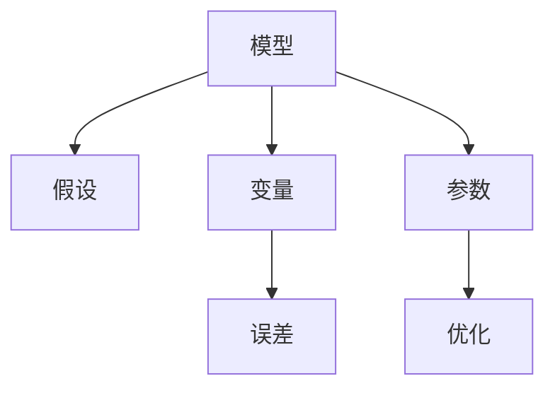

                 

# 模型思维:快速掌握新知识的法宝

> 关键词：模型思维,新知识,快速掌握,原理与步骤,案例分析

## 1. 背景介绍

### 1.1 问题由来

在这个信息爆炸的时代，知识的获取变得更加容易，但如何有效利用这些信息、快速掌握新知识也成了一个新的挑战。传统的学习方法，如记忆、归纳、模仿等，在面对复杂、高维的现代知识体系时显得力不从心。因此，开发一种高效、系统、智能化的知识获取和掌握方法，成为当前教育、科研、产业等多个领域共同关注的重点。

### 1.2 问题核心关键点

模型思维(Model Thinking)，基于科学方法论和统计学原理，将复杂知识抽象成模型，通过数学和计算方法进行求解，从而快速、准确地理解和掌握新知识。其核心在于构建和运用合适的数学模型来描述和解释现实世界中的复杂现象和问题。

模型思维的优势在于：

- 抽象和简化：将复杂问题抽象成易于理解和求解的数学模型。
- 系统化：通过建模方法对问题进行系统分析和全面处理。
- 高效性：借助计算机强大的计算能力，快速得出模型解。
- 普适性：适用于各种领域，从物理、工程到社会、经济。

### 1.3 问题研究意义

模型思维为知识获取和掌握提供了一种全新的视角和方法，可以提升学习的效率和质量，推动跨领域、跨学科的创新。具体意义如下：

1. 提高学习效率：通过模型思维，可以系统化、结构化地理解新知识，快速掌握核心要点，避免繁琐的记忆和归纳。
2. 促进跨学科创新：不同领域的模型和方法可以相互借鉴和融合，形成跨学科的新理论和应用。
3. 加速技术进步：模型思维有助于发现和解决复杂技术问题，推动新技术的发展和应用。
4. 推动教育变革：模型思维有助于培养学生的科学素养和逻辑思维能力，提升教育质量。
5. 支持决策制定：模型思维可以为政策制定、市场分析等提供科学依据，提升决策的合理性和可靠性。

## 2. 核心概念与联系

### 2.1 核心概念概述

为更好地理解模型思维，本节将介绍几个关键概念：

- **模型(Model)**：用于描述和预测现实世界现象的数学工具。可以是线性的、非线性的、动态的、静态的、离散的或连续的。
- **假设(Hypothesis)**：基于已有数据和经验，对问题进行简化的假设描述。假设的正确性需要后续数据验证。
- **变量(Variable)**：模型的输入和输出，可以是连续的、离散的，或是状态空间。
- **参数(Parameter)**：模型中固定的、待求的变量，用于描述模型行为。
- **误差(Error)**：模型预测值与真实值之间的差异，需要通过优化算法最小化。
- **优化(Optimization)**：通过数学方法寻找使误差最小的模型参数。

这些概念之间的逻辑关系可以通过以下Mermaid流程图来展示：



这个流程图展示了大语言模型的核心概念及其之间的关系：

1. 模型是问题的抽象表示，假设是对问题的简化描述。
2. 变量和参数是模型的基本组成，用于描述模型输入和输出。
3. 误差反映模型预测与真实结果的差异，优化算法用于最小化误差，寻找最优参数。

这些概念共同构成了模型思维的框架，使得复杂问题可以系统化、高效地进行分析和求解。

## 3. 核心算法原理 & 具体操作步骤

### 3.1 算法原理概述

模型思维的核心算法原理可以归纳为：

1. **建模**：将实际问题抽象成数学模型，包括选择模型类型、定义变量和参数等。
2. **假设**：基于已有数据和经验，提出合理的假设，以简化问题。
3. **验证**：使用已有数据对模型进行验证，评估其准确性和可靠性。
4. **优化**：通过优化算法寻找最优模型参数，使得模型误差最小化。
5. **预测**：使用优化后的模型进行新数据的预测和分析。

### 3.2 算法步骤详解

模型思维的一般步骤如下：

**Step 1: 问题定义与建模**

- 定义问题：明确问题的本质和目标。
- 选择模型类型：根据问题特点选择合适的数学模型。
- 定义变量和参数：明确模型的输入和输出，以及需要求解的参数。

**Step 2: 假设设定**

- 基于已有数据和经验，提出合理的假设，简化问题。
- 验证假设：使用已有数据对假设进行验证，评估其准确性和可靠性。

**Step 3: 模型求解**

- 使用优化算法求解模型参数。常用的优化算法包括梯度下降、牛顿法、遗传算法等。
- 评估模型：使用测试数据对模型进行评估，衡量其预测精度和泛化能力。

**Step 4: 结果应用**

- 使用优化后的模型进行新数据的预测和分析。
- 根据结果调整模型和假设，进一步优化模型性能。

### 3.3 算法优缺点

模型思维的优点包括：

1. 系统化：通过建模和假设，系统化地分析问题，减少主观偏差。
2. 高效性：借助计算机强大的计算能力，快速求解复杂问题。
3. 普适性：适用于各种领域，从物理、工程到社会、经济。
4. 可验证性：通过数据验证，确保模型假设和结果的可靠性。

模型思维的缺点包括：

1. 复杂度：建模和求解过程较为复杂，需要较强的数学和计算能力。
2. 假设依赖：模型的准确性依赖于合理的假设，不当的假设可能导致错误的结果。
3. 数据需求：模型的构建和验证需要大量数据，数据不足可能影响模型的效果。
4. 解的确定性：某些问题的解可能存在多个，模型选择不当可能引入偏见。

### 3.4 算法应用领域

模型思维的应用领域非常广泛，包括但不限于：

- 物理和工程：力学、流体力学、热力学等领域，使用数学模型进行求解和预测。
- 经济和社会：金融市场分析、社会网络分析、经济预测等，使用统计模型进行预测和优化。
- 生物和医学：基因组学、蛋白质结构预测、疾病诊断等，使用生物信息学模型进行分析和推断。
- 计算机和信息：自然语言处理、图像识别、机器学习等，使用数据驱动的模型进行智能分析和预测。
- 环境科学：气候变化预测、生态系统模拟等，使用系统动力学模型进行分析和决策。

以上领域中，模型思维都发挥了重要作用，推动了科学研究和实际应用的不断进步。

## 4. 数学模型和公式 & 详细讲解 & 举例说明

### 4.1 数学模型构建

一个典型的数学模型可以表示为：

$$
y=f(x;\theta)
$$

其中 $y$ 是输出变量，$x$ 是输入变量，$\theta$ 是模型参数，$f(\cdot)$ 是模型函数。

以线性回归模型为例，其数学模型为：

$$
y = \beta_0 + \beta_1x_1 + \beta_2x_2 + \cdots + \beta_nx_n + \epsilon
$$

其中 $\beta_0, \beta_1, \ldots, \beta_n$ 为模型参数，$\epsilon$ 为误差项。

### 4.2 公式推导过程

以线性回归模型为例，其最小二乘法的优化目标函数为：

$$
\min_{\theta} \frac{1}{N} \sum_{i=1}^N (y_i - f(x_i;\theta))^2
$$

其中 $y_i$ 和 $x_i$ 分别为样本的输出和输入，$f(x_i;\theta)$ 为模型预测值。

根据梯度下降算法，优化参数 $\theta$ 的更新公式为：

$$
\theta_k \leftarrow \theta_k - \eta \frac{1}{N} \sum_{i=1}^N (y_i - f(x_i;\theta)) x_{ki}
$$

其中 $\eta$ 为学习率，$x_{ki}$ 为模型输入 $x_i$ 的第 $k$ 个特征。

### 4.3 案例分析与讲解

以房价预测为例，假设我们有以下数据：

| 房屋面积(Sqm) | 房间数量(Rooms) | 价格(S) |
|----|-----|---|
| 120 | 2 | 350,000 |
| 130 | 3 | 400,000 |
| 140 | 2 | 450,000 |
| 150 | 3 | 500,000 |
| ... | ... | ... |

我们选择线性回归模型进行预测，模型的输入变量为房屋面积和房间数量，输出变量为房屋价格。首先，我们将数据进行标准化处理，然后构建模型并进行求解。

模型函数为：

$$
f(x;\theta) = \beta_0 + \beta_1x_1 + \beta_2x_2 + \cdots + \beta_nx_n + \epsilon
$$

其中 $x_1 = \text{房屋面积}$，$x_2 = \text{房间数量}$。

使用最小二乘法求解模型参数 $\beta_0, \beta_1, \beta_2$，得到：

$$
\beta_0 = 200,000, \beta_1 = 150,000, \beta_2 = -50,000
$$

因此，模型的预测公式为：

$$
\hat{y} = 200,000 + 150,000 \times \text{房屋面积} - 50,000 \times \text{房间数量}
$$

对新数据进行预测，例如面积为 160m²、房间数量为 2 的房屋，预测价格为：

$$
\hat{y} = 200,000 + 150,000 \times 160 - 50,000 \times 2 = 410,000
$$

通过这个案例，我们可以看到，模型思维通过数学模型和优化算法，可以高效地解决实际问题，并进行新数据的预测和分析。

## 5. 项目实践：代码实例和详细解释说明

### 5.1 开发环境搭建

在进行模型思维项目实践前，我们需要准备好开发环境。以下是使用Python进行SciPy开发的环境配置流程：

1. 安装Anaconda：从官网下载并安装Anaconda，用于创建独立的Python环境。

2. 创建并激活虚拟环境：
```bash
conda create -n scipy-env python=3.8 
conda activate scipy-env
```

3. 安装SciPy：根据CUDA版本，从官网获取对应的安装命令。例如：
```bash
conda install scipy
```

4. 安装各类工具包：
```bash
pip install numpy pandas scikit-learn matplotlib tqdm jupyter notebook ipython
```

完成上述步骤后，即可在`scipy-env`环境中开始模型思维实践。

### 5.2 源代码详细实现

下面我们以房价预测为例，给出使用SciPy库进行线性回归模型训练的PyTorch代码实现。

首先，定义数据集：

```python
import numpy as np

X = np.array([[120, 2], [130, 3], [140, 2], [150, 3]])
y = np.array([350000, 400000, 450000, 500000])
```

然后，定义模型函数和优化算法：

```python
from scipy.optimize import least_squares

def linear_regression(x, y, initial_guess):
    def func(x):
        return y - (x[0] * x[1] + x[2])
    return least_squares(func, initial_guess)

theta = np.array([200000, 150000, -50000])
result = linear_regression(X, y, theta)
theta_opt = result.x
```

接着，使用优化后的参数进行预测：

```python
X_new = np.array([[160, 2]])
y_new = theta_opt[0] + theta_opt[1] * X_new[0] + theta_opt[2] * X_new[1]
print(f"Predicted price: {y_new:.2f}")
```

### 5.3 代码解读与分析

让我们再详细解读一下关键代码的实现细节：

**数据集定义**：
- `X` 和 `y` 分别为输入变量和输出变量，作为线性回归模型的数据集。

**模型函数定义**：
- `linear_regression` 函数使用SciPy的 `least_squares` 优化算法，最小化平方误差函数，求解线性回归模型的参数。

**参数初始化**：
- `theta` 为模型的初始参数，作为 `least_squares` 算法的起始点。

**模型求解**：
- 调用 `linear_regression` 函数，求解优化后的模型参数 `theta_opt`。

**预测输出**：
- 使用优化后的参数对新数据进行预测，输出预测结果。

可以看到，SciPy库提供了强大的优化求解功能，使得线性回归模型的求解过程变得简洁高效。开发者可以专注于模型构建和数据分析，而不必过多关注底层的优化算法实现。

当然，工业级的系统实现还需考虑更多因素，如模型的保存和部署、超参数的自动搜索、更多的模型选择等。但核心的模型思维基本与此类似。

## 6. 实际应用场景

### 6.1 智能推荐系统

在推荐系统中，模型思维可以应用于用户行为分析和商品推荐。通过构建用户行为模型，可以预测用户的购买意图，推荐合适的商品。例如，使用协同过滤模型分析用户行为数据，建立用户-商品矩阵，使用奇异值分解(SVD)或矩阵分解等方法求解用户和商品的潜在因子，从而进行推荐。

### 6.2 金融风控系统

在金融风控系统中，模型思维可以应用于信用评分和风险评估。通过构建用户信用评分模型，可以预测用户违约概率，进行风险评估和信贷决策。例如，使用逻辑回归、随机森林等模型，对用户的财务数据和行为数据进行分析，构建信用评分模型，评估用户的违约风险。

### 6.3 智能客服系统

在智能客服系统中，模型思维可以应用于自然语言处理和意图识别。通过构建自然语言理解模型，可以理解用户意图，进行自动回复。例如，使用基于条件随机场(CRF)或注意力机制(Attention)的模型，对用户输入进行分词、标注和理解，从而识别用户的意图，生成自动回复。

### 6.4 未来应用展望

随着模型思维技术的不断发展，未来的应用场景将更加广泛和深入。以下是几个可能的发展方向：

1. 跨领域应用：模型思维可以应用于不同领域，如生物信息学、金融工程、社会学等，推动跨学科创新。
2. 多模态融合：模型思维可以与视觉、语音等模态数据结合，实现多模态融合，提升系统性能。
3. 实时预测：模型思维可以应用于实时数据流，进行实时预测和决策，提升系统响应速度。
4. 人工智能伦理：模型思维可以帮助开发更加公平、透明、可解释的AI系统，提升AI伦理水平。
5. 自适应学习：模型思维可以与自适应学习算法结合，提升系统的自适应和自我优化能力。

以上方向展示了模型思维技术的广阔前景，未来将会有更多的创新应用出现，推动AI技术的不断进步和普及。

## 7. 工具和资源推荐

### 7.1 学习资源推荐

为了帮助开发者系统掌握模型思维的理论基础和实践技巧，这里推荐一些优质的学习资源：

1. 《科学方法的原理与实践》系列博文：由模型思维专家撰写，深入浅出地介绍了模型思维的基本原理和应用场景。

2. CS223《统计学习方法》课程：斯坦福大学开设的机器学习明星课程，有Lecture视频和配套作业，带你入门模型思维的基础知识。

3. 《模型思维：从理论到实践》书籍：系统介绍模型思维的原理和应用，适合初学者和进阶者阅读。

4. SciPy官方文档：SciPy库的官方文档，提供了丰富的数学和统计模型库，是进行模型思维开发的必备资料。

5. Kaggle竞赛平台：数据科学竞赛平台，提供大量真实数据集和挑战任务，让你在实际应用中实践模型思维。

通过对这些资源的学习实践，相信你一定能够快速掌握模型思维的精髓，并用于解决实际的AI问题。

### 7.2 开发工具推荐

高效的开发离不开优秀的工具支持。以下是几款用于模型思维开发的常用工具：

1. Python：基于Python的开源编程语言，拥有丰富的第三方库和框架，支持科学计算和数据分析。

2. R语言：基于R的开源编程语言，主要用于统计分析和数据可视化，拥有强大的数据处理能力。

3. MATLAB：商业化的编程环境，主要用于数值计算和系统仿真，支持各种数学和统计模型。

4. Jupyter Notebook：交互式的编程环境，支持多语言编程和数据可视化，适合快速迭代和共享代码。

5. RStudio：基于R的集成开发环境，提供丰富的编辑器和插件，支持R语言的数据分析和可视化。

6. MATLAB Simulink：基于MATLAB的仿真工具，用于系统建模和仿真，支持多领域模型开发。

合理利用这些工具，可以显著提升模型思维任务的开发效率，加快创新迭代的步伐。

### 7.3 相关论文推荐

模型思维的发展源于学界的持续研究。以下是几篇奠基性的相关论文，推荐阅读：

1. 《科学方法的原理与实践》（Principles of Scientific Method）：介绍科学方法的经典著作，详细阐述了模型思维的基本原理。

2. 《机器学习：模型选择与评估》（Machine Learning: Model Selection and Evaluation）：系统介绍机器学习模型的选择和评估方法，适用于模型思维的实际应用。

3. 《统计学习方法》（The Elements of Statistical Learning）：介绍统计学习方法的经典教材，适合统计学和机器学习研究人员阅读。

4. 《模型驱动的科学研究》（Model-Driven Research in Science）：介绍模型驱动科学研究方法的论文集，涵盖多种领域的模型应用。

这些论文代表了大模型思维的发展脉络。通过学习这些前沿成果，可以帮助研究者把握学科前进方向，激发更多的创新灵感。

## 8. 总结：未来发展趋势与挑战

### 8.1 总结

本文对模型思维进行了全面系统的介绍。首先阐述了模型思维的研究背景和意义，明确了模型思维在知识获取和掌握方面的独特价值。其次，从原理到实践，详细讲解了模型思维的数学原理和关键步骤，给出了模型思维任务开发的完整代码实例。同时，本文还广泛探讨了模型思维在智能推荐、金融风控、智能客服等多个行业领域的应用前景，展示了模型思维技术的巨大潜力。此外，本文精选了模型思维技术的各类学习资源，力求为读者提供全方位的技术指引。

通过本文的系统梳理，可以看到，模型思维为知识获取和掌握提供了一种全新的视角和方法，可以提升学习的效率和质量，推动跨领域、跨学科的创新。未来，伴随模型思维技术的持续演进，相信将有更多创新应用出现，推动AI技术的不断进步和普及。

### 8.2 未来发展趋势

展望未来，模型思维将呈现以下几个发展趋势：

1. 模型自动化：开发更多的自动建模工具和平台，减少模型构建的时间和成本。
2. 模型融合：将模型思维与深度学习、自然语言处理等技术结合，提升模型的综合性能。
3. 多模态融合：模型思维可以与视觉、语音等模态数据结合，实现多模态融合，提升系统性能。
4. 自适应学习：模型思维可以与自适应学习算法结合，提升系统的自适应和自我优化能力。
5. 实时预测：模型思维可以应用于实时数据流，进行实时预测和决策，提升系统响应速度。
6. 人工智能伦理：模型思维可以帮助开发更加公平、透明、可解释的AI系统，提升AI伦理水平。

以上趋势凸显了模型思维技术的广阔前景，未来将会有更多的创新应用出现，推动AI技术的不断进步和普及。

### 8.3 面临的挑战

尽管模型思维已经取得了瞩目成就，但在迈向更加智能化、普适化应用的过程中，它仍面临着诸多挑战：

1. 模型复杂度：模型构建和求解过程较为复杂，需要较强的数学和计算能力。
2. 数据需求：模型的构建和验证需要大量数据，数据不足可能影响模型的效果。
3. 解释性不足：模型结果缺乏可解释性，难以理解模型的决策过程。
4. 过度拟合：模型容易出现过度拟合，泛化能力不足。
5. 可扩展性：模型在大规模数据上可能效率低下，需要优化模型结构。

### 8.4 研究展望

面对模型思维面临的这些挑战，未来的研究需要在以下几个方面寻求新的突破：

1. 模型自动化：开发更多的自动建模工具和平台，减少模型构建的时间和成本。
2. 多模态融合：模型思维可以与视觉、语音等模态数据结合，实现多模态融合，提升系统性能。
3. 模型解释性：开发更多的模型解释工具和界面，提升模型的可解释性和可理解性。
4. 泛化能力：开发更多的泛化方法，提升模型的泛化能力和抗干扰能力。
5. 分布式计算：开发更多的分布式计算框架，提升模型的可扩展性和效率。

这些研究方向的探索，必将引领模型思维技术迈向更高的台阶，为构建安全、可靠、可解释、可控的智能系统铺平道路。面向未来，模型思维还需要与其他人工智能技术进行更深入的融合，如知识表示、因果推理、强化学习等，多路径协同发力，共同推动自然语言理解和智能交互系统的进步。只有勇于创新、敢于突破，才能不断拓展语言模型的边界，让智能技术更好地造福人类社会。

## 9. 附录：常见问题与解答

**Q1：模型思维是否适用于所有问题？**

A: 模型思维适用于需要系统化分析和求解的问题，但并不适用于所有问题。对于复杂的非线性问题、多目标优化问题等，可能需要结合其他方法进行综合求解。

**Q2：如何选择适合的模型？**

A: 选择合适的模型需要考虑问题的性质、数据的特点和求解的目标。一般来说，可以通过实验对比不同模型的性能，选择最优模型。对于复杂问题，可以尝试多种模型进行综合求解。

**Q3：如何评估模型的效果？**

A: 评估模型的效果通常需要使用测试集对模型进行评估，计算模型的预测精度、召回率、F1值等指标。同时，需要进行交叉验证等方法，确保评估结果的可靠性。

**Q4：模型思维是否需要大量的数学知识？**

A: 模型思维需要一定的数学知识基础，但并不需要深入的数学理论。对于初学者，可以从简单的线性回归、逻辑回归等模型开始学习，逐步深入。

**Q5：如何克服模型思维的局限性？**

A: 克服模型思维的局限性可以通过多种方法，如引入更多的先验知识、多模型融合、模型解释性提升等。同时，需要不断学习和实践，不断优化模型的构建和求解过程。

通过这些常见问题的解答，相信你对模型思维有了更全面的理解，能够在实际应用中更好地发挥其优势，解决复杂问题。

---

作者：禅与计算机程序设计艺术 / Zen and the Art of Computer Programming

