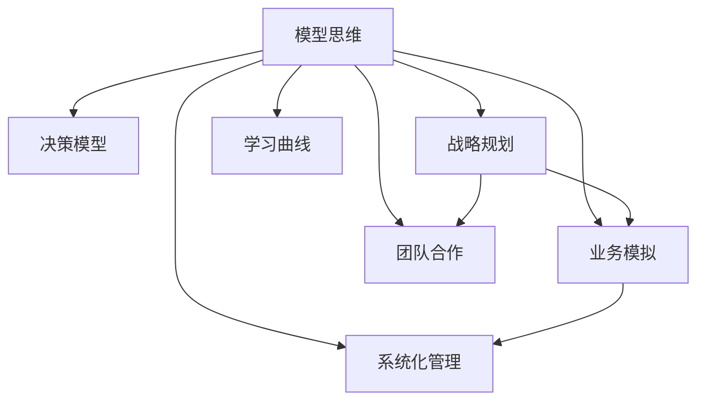

                 

# 模型思维在管理培训中的运用

> 关键词：模型思维,管理培训,决策模型,战略规划,业务模拟,学习曲线,团队合作,系统化管理

## 1. 背景介绍

### 1.1 问题由来
在当前快速变化的商业环境中，企业面临着前所未有的挑战。传统的管理方法往往基于直觉和经验，缺乏系统性和科学性。而现代管理则要求利用数据驱动、模型驱动的方法，对复杂的业务问题进行深入分析，制定科学、高效的决策方案。模型思维在管理培训中的应用，正是基于这一需求，旨在提升管理者的系统化思维能力和数据应用能力，培养能够应对未来挑战的管理精英。

### 1.2 问题核心关键点
模型思维的核心理念是通过构建数学模型和算法，对现实问题进行抽象和量化，从而获得决策依据。在管理培训中，模型思维可以帮助管理者理解和解决各类复杂的业务问题，提升其预测、优化和控制能力。模型思维的关键点包括：

1. 数据收集与处理：获取和清洗高质量的数据，是构建有效模型的基础。
2. 模型构建与选择：根据问题特点选择合适的模型，并进行参数优化。
3. 模型应用与分析：将模型应用于实际业务场景，进行预测、优化或控制。
4. 模型评估与迭代：对模型效果进行评估，根据结果进行模型迭代和优化。

## 2. 核心概念与联系

### 2.1 核心概念概述

为更好地理解模型思维在管理培训中的应用，本节将介绍几个密切相关的核心概念：

- 模型思维(Model Thinking)：指通过构建数学模型和算法，对现实问题进行抽象和量化，从而获得决策依据的思维方式。
- 决策模型(Decision Model)：指用于解决具体决策问题的数学模型，如线性规划、蒙特卡洛模拟等。
- 战略规划(Strategic Planning)：指通过模型预测未来发展趋势，制定长期发展战略的过程。
- 业务模拟(Business Simulation)：指构建虚拟环境，模拟现实业务运作过程，进行管理培训和策略测试。
- 学习曲线(Learning Curve)：指学习过程中技能和效率随时间提升的趋势，用于衡量培训效果。
- 团队合作(Team Collaboration)：指在模型构建和应用过程中，团队成员之间协作配合的过程。
- 系统化管理(Systematic Management)：指基于系统理论和模型方法，对企业管理活动进行全面管理的过程。

这些核心概念之间的逻辑关系可以通过以下Mermaid流程图来展示：



这个流程图展示了几大核心概念之间的联系：

1. 模型思维是基础，通过构建决策模型，支持战略规划和业务模拟。
2. 战略规划和业务模拟是模型思维的应用场景，用于检验模型效果。
3. 学习曲线和团队合作是模型思维应用过程中的重要环节，用于提升培训效果。
4. 系统化管理是模型思维的宏观应用，支持企业的全面管理提升。

这些概念共同构成了模型思维在管理培训中的应用框架，帮助管理者建立系统化的思维方式，提升决策科学性。

## 3. 核心算法原理 & 具体操作步骤
### 3.1 算法原理概述

模型思维在管理培训中的应用，本质上是将复杂的业务问题抽象为数学模型，通过模型求解获得决策依据。这一过程可以分为以下几个步骤：

1. 问题抽象：将业务问题抽象为数学形式，定义决策变量和约束条件。
2. 模型构建：选择合适的数学模型，确定模型参数和求解方法。
3. 模型求解：使用求解算法，计算模型最优解。
4. 模型验证：对模型结果进行验证，检验其真实性和可靠性。

### 3.2 算法步骤详解

模型思维在管理培训中的应用，一般包括以下几个关键步骤：

**Step 1: 数据准备与预处理**
- 收集和管理业务数据，清洗和整理数据，确保数据质量。
- 对数据进行探索性分析，提取关键特征和指标。

**Step 2: 模型构建与选择**
- 根据业务问题和数据特点，选择合适的数学模型。
- 确定模型的参数和求解方法，设计模型求解算法。

**Step 3: 模型训练与优化**
- 使用训练数据对模型进行训练，优化模型参数。
- 对模型效果进行评估，进行必要的模型迭代和优化。

**Step 4: 模型应用与决策**
- 将模型应用于实际业务场景，进行预测、优化或控制。
- 根据模型结果，制定决策方案，并实施和监控。

**Step 5: 模型评估与迭代**
- 对模型结果进行评估，检验其真实性和可靠性。
- 根据评估结果，进行模型迭代和优化，提升模型效果。

### 3.3 算法优缺点

模型思维在管理培训中的应用，具有以下优点：

1. 科学性：通过数据驱动和模型驱动，提升了决策的科学性和系统性。
2. 普适性：适用于各类复杂的业务问题，可以帮助管理者理解和解决问题。
3. 可操作性：模型求解结果直观明了，易于理解和操作。
4. 可验证性：模型结果可以通过实际应用进行验证，保证决策的可靠性。

同时，模型思维也存在一些局限性：

1. 数据依赖性：模型的构建和应用依赖高质量的数据，数据获取和处理成本较高。
2. 模型复杂性：模型构建和求解过程较为复杂，需要具备一定的数学和算法知识。
3. 模型假设性：模型的构建基于一定的假设，可能与实际情况有所偏差。
4. 模型解释性：模型求解结果缺乏直观的解释，难以理解其内部工作机制。
5. 模型应用性：模型求解结果可能过于理想化，难以在实际业务中直接应用。

尽管存在这些局限性，但模型思维在管理培训中的应用，仍然是提升管理者决策能力和系统化管理水平的重要手段。

### 3.4 算法应用领域

模型思维在管理培训中的应用，已经广泛应用于多个领域，具体包括：

1. **战略规划**：通过模型预测未来发展趋势，制定长期发展战略。
2. **业务模拟**：构建虚拟环境，模拟现实业务运作过程，进行管理培训和策略测试。
3. **运营优化**：使用模型进行生产计划、库存管理、物流优化等业务流程的优化。
4. **投资决策**：通过模型评估投资项目，进行风险分析和收益预测。
5. **风险管理**：使用模型预测和控制风险，制定风险应对策略。
6. **人力资源管理**：通过模型优化人力资源配置和培训计划，提升员工绩效。

这些应用领域展示了模型思维在管理培训中的广泛应用，为管理者提供了科学、系统化的决策支持。

## 4. 数学模型和公式 & 详细讲解 & 举例说明

### 4.1 数学模型构建

在管理培训中，常用的数学模型包括线性规划、蒙特卡洛模拟、决策树等。这里以线性规划为例，介绍模型构建的基本步骤。

**线性规划模型**：
$$
\min \quad \text{C}^T \text{X} \\
\text{s.t.} \quad \text{A} \text{X} = \text{b}, \quad \text{X} \geq 0
$$

其中，$\text{X}$ 为决策变量，$\text{C}$ 为目标函数的系数向量，$\text{A}$ 为约束条件矩阵，$\text{b}$ 为约束条件常数向量，$0$ 为决策变量的取值范围。

**模型求解步骤**：
1. 收集和管理业务数据，定义决策变量和约束条件。
2. 根据问题特点，构建线性规划模型。
3. 使用求解算法，计算模型最优解。

### 4.2 公式推导过程

以线性规划模型为例，其求解过程主要涉及单纯形法或内点法。这里以单纯形法为例，进行简要推导。

**单纯形法基本步骤**：
1. 初始化基础可行解，构造初始基矩阵。
2. 计算出进基量和出基量，更新基矩阵。
3. 迭代求解，直到最优解收敛。

具体推导过程涉及求解线性方程组和矩阵运算，在此不再赘述。

### 4.3 案例分析与讲解

**案例：供应链优化**

某物流公司需要优化其供应链管理，以提升运营效率和客户满意度。通过收集和整理历史订单数据、库存数据、运输成本数据等，构建线性规划模型：

$$
\min \quad \text{C}^T \text{X} \\
\text{s.t.} \quad \text{A} \text{X} = \text{b}, \quad \text{X} \geq 0
$$

其中，$\text{X}$ 为各个仓库的库存量，$\text{C}$ 为目标函数的系数向量，$\text{A}$ 为约束条件矩阵，$\text{b}$ 为约束条件常数向量，$0$ 为库存量的取值范围。

通过求解该线性规划模型，可以得到最优的库存配置方案，从而提升物流公司的运营效率。

## 5. 项目实践：代码实例和详细解释说明
### 5.1 开发环境搭建

在进行模型思维的实践前，我们需要准备好开发环境。以下是使用Python进行Pyomo开发的环境配置流程：

1. 安装Anaconda：从官网下载并安装Anaconda，用于创建独立的Python环境。

2. 创建并激活虚拟环境：
```bash
conda create -n pyomo-env python=3.8 
conda activate pyomo-env
```

3. 安装Pyomo：从官网获取对应的安装命令。例如：
```bash
conda install pyomo -c conda-forge
```

4. 安装各类工具包：
```bash
pip install numpy scipy sympy cvxpy
```

完成上述步骤后，即可在`pyomo-env`环境中开始模型思维的实践。

### 5.2 源代码详细实现

这里以线性规划模型为例，给出使用Pyomo进行模型构建和求解的PyTorch代码实现。

```python
from pyomo.environ import *
from pyomo.opt import SolverFactory

# 定义模型
model = ConcreteModel()

# 定义决策变量
model.x = Var([1, 2, 3], within=NonNegativeReals)

# 定义目标函数
model.objective = Objective(expr=3 * model.x[1] + 2 * model.x[2] + 1 * model.x[3], sense=minimize)

# 定义约束条件
model.constraint1 = Constraint(expr=model.x[1] + model.x[2] + model.x[3] == 10)
model.constraint2 = Constraint(expr=model.x[1] + model.x[2] == 8)

# 创建求解器
solver = SolverFactory('glpk')

# 求解模型
status = solver.solve(model)

# 输出结果
print(model.objective.value())
```

### 5.3 代码解读与分析

让我们再详细解读一下关键代码的实现细节：

**模型定义**：
- `ConcreteModel`类用于创建具体的模型实例，表示一个优化问题。
- `Var`类用于定义决策变量，`NonNegativeReals`表示非负实数。
- `Objective`类用于定义目标函数，`sense=minimize`表示最小化目标。

**约束条件**：
- `Constraint`类用于定义约束条件，使用`expr`参数传入表达式。

**求解器创建与求解**：
- `SolverFactory`类用于创建求解器，`glpk`表示使用GLPK求解器。
- `solver.solve(model)`方法用于求解模型，返回求解状态。

**结果输出**：
- `model.objective.value()`方法用于输出目标函数的最优值。

通过上述代码，可以清晰地看到使用Pyomo进行线性规划模型的构建和求解过程。Pyomo提供了丰富的模型构建工具和求解器，使得模型思维的应用更加便捷和高效。

## 6. 实际应用场景
### 6.1 智能制造

在智能制造领域，模型思维被广泛应用于生产计划优化、设备调度、物料管理等方面。传统制造业往往面临生产效率低、库存积压等问题，通过模型思维可以优化生产流程，提升运营效率。

以生产计划优化为例，可以收集历史订单数据、生产能力数据、设备状态数据等，构建线性规划模型：

$$
\min \quad \text{C}^T \text{X} \\
\text{s.t.} \quad \text{A} \text{X} = \text{b}, \quad \text{X} \geq 0
$$

其中，$\text{X}$ 为各时间段的生产量，$\text{C}$ 为目标函数的系数向量，$\text{A}$ 为约束条件矩阵，$\text{b}$ 为约束条件常数向量，$0$ 为生产量的取值范围。

通过求解该模型，可以得到最优的生产计划，从而提升生产效率和物料利用率。

### 6.2 金融风险管理

在金融风险管理领域，模型思维被广泛应用于信用评估、风险预测、资产配置等方面。金融行业数据量大、复杂度高，通过模型思维可以更好地管理风险，制定合理的投资策略。

以信用评估为例，可以收集历史贷款数据、客户数据、市场数据等，构建逻辑回归模型：

$$
\text{P(Y=1|X)} = \text{sigmoid}(\text{w}^T \text{X} + b)
$$

其中，$X$ 为客户的特征向量，$Y$ 为贷款违约标志，$w$ 为模型的权重向量，$b$ 为截距。

通过求解该模型，可以预测客户贷款违约的概率，从而进行信用评估和管理。

### 6.3 智能交通

在智能交通领域，模型思维被广泛应用于交通流量预测、路径规划、交通控制等方面。城市交通系统复杂，通过模型思维可以优化交通管理，提升出行效率。

以交通流量预测为例，可以收集历史交通数据、天气数据、道路状况数据等，构建时间序列模型：

$$
\text{y}_{t+1} = \alpha \text{y}_t + \beta \text{x}_t + \epsilon_t
$$

其中，$y_t$ 为交通流量，$x_t$ 为影响因子，$\alpha$ 和 $\beta$ 为模型参数，$\epsilon_t$ 为随机误差项。

通过求解该模型，可以预测未来交通流量，从而进行交通管理和控制。

### 6.4 未来应用展望

随着模型思维的不断发展和应用，未来其在管理培训中的应用前景将更加广阔。具体展望如下：

1. 数据驱动决策：未来管理培训将更多地基于数据驱动的决策模式，培养管理者的数据分析和模型应用能力。
2. 系统化管理：管理培训将更加注重系统化思维的培养，帮助管理者构建完整的管理体系。
3. 跨领域应用：模型思维将广泛应用于更多领域，如医疗、能源、环保等，推动各行业的智能化升级。
4. 协同式学习：管理培训将更加注重团队协作和协同式学习，培养管理者的团队合作和沟通能力。
5. 智能模拟：未来管理培训将更多地采用智能模拟技术，提供更加逼真的培训场景和反馈机制。
6. 人机协作：管理培训将更多地采用人机协作模式，结合AI技术和模型思维，提升培训效果和效率。

这些趋势展示了模型思维在管理培训中的广阔前景，将为管理者提供更加全面、系统、科学的决策支持。

## 7. 工具和资源推荐
### 7.1 学习资源推荐

为了帮助开发者系统掌握模型思维在管理培训中的应用，这里推荐一些优质的学习资源：

1. 《模型思维：从理论到应用》系列博文：由数据科学专家撰写，深入浅出地介绍了模型思维的基本概念和应用方法。

2. 《系统思维与管理决策》课程：清华大学开设的管理学课程，涵盖系统思维、决策模型等内容，适合系统化管理的学习。

3. 《模型驱动决策》书籍：作者深入讲解了模型思维在决策中的应用，提供了丰富的案例分析。

4. 《管理科学与决策》期刊：收录了大量系统化管理、模型思维的研究论文，是学术研究的参考资料。

5. 《管理科学基础》视频课程：斯坦福大学开设的管理学课程，详细介绍了系统化管理的方法和模型。

通过对这些资源的学习实践，相信你一定能够快速掌握模型思维在管理培训中的应用，并用于解决实际的业务问题。

### 7.2 开发工具推荐

高效的开发离不开优秀的工具支持。以下是几款用于模型思维开发的常用工具：

1. Pyomo：Python建模优化库，支持线性规划、整数规划、混合整数规划等多种模型求解器。

2. Gurobi：商业优化求解器，支持全球最优化求解，具有高效的求解速度和稳定性。

3. Scipy：Python科学计算库，提供了丰富的数学函数和优化算法。

4. Matplotlib：Python数据可视化库，用于展示模型求解结果和数据分布。

5. Jupyter Notebook：Python交互式编程环境，方便数据处理和模型验证。

6. Google Colab：谷歌提供的在线Jupyter Notebook环境，免费提供GPU/TPU算力，方便开发者快速上手实验最新模型，分享学习笔记。

合理利用这些工具，可以显著提升模型思维的应用效率，加快创新迭代的步伐。

### 7.3 相关论文推荐

模型思维在管理培训中的应用，得益于学界的持续研究。以下是几篇奠基性的相关论文，推荐阅读：

1. 《模型驱动的决策方法》：系统介绍了模型思维在决策中的应用，提供了丰富的案例分析。

2. 《系统思维与管理系统》：系统介绍了系统思维的基本概念和应用方法，适合管理培训的学习。

3. 《数据驱动的决策优化》：详细介绍了数据驱动决策的基本方法，适合模型思维的学习。

4. 《智能制造中的优化模型》：介绍了模型思维在智能制造中的应用，提供了丰富的案例分析。

5. 《金融风险管理的数学模型》：介绍了模型思维在金融风险管理中的应用，提供了丰富的案例分析。

这些论文代表了大语言模型微调技术的发展脉络。通过学习这些前沿成果，可以帮助研究者把握学科前进方向，激发更多的创新灵感。

## 8. 总结：未来发展趋势与挑战
### 8.1 总结

本文对模型思维在管理培训中的应用进行了全面系统的介绍。首先阐述了模型思维的基本概念和在管理培训中的重要性，明确了模型思维在提升决策科学性和系统化水平方面的独特价值。其次，从原理到实践，详细讲解了模型构建、求解和应用的基本步骤，给出了模型思维任务开发的完整代码实例。同时，本文还广泛探讨了模型思维在智能制造、金融风险管理、智能交通等多个行业领域的应用前景，展示了模型思维的广泛应用。最后，本文精选了模型思维的学习资源，力求为读者提供全方位的技术指引。

通过本文的系统梳理，可以看到，模型思维在管理培训中的应用，已经成为提升管理者决策能力和系统化管理水平的重要手段。随着数据驱动决策理念的普及和模型思维的不断发展，未来管理者将更加依赖数据和模型来支持其决策过程，从而提升企业的竞争力和效率。

### 8.2 未来发展趋势

展望未来，模型思维在管理培训中的应用将呈现以下几个发展趋势：

1. 数据驱动决策：管理培训将更多地基于数据驱动的决策模式，培养管理者的数据分析和模型应用能力。
2. 系统化管理：管理培训将更加注重系统化思维的培养，帮助管理者构建完整的管理体系。
3. 跨领域应用：模型思维将广泛应用于更多领域，如医疗、能源、环保等，推动各行业的智能化升级。
4. 协同式学习：管理培训将更加注重团队协作和协同式学习，培养管理者的团队合作和沟通能力。
5. 智能模拟：未来管理培训将更多地采用智能模拟技术，提供更加逼真的培训场景和反馈机制。
6. 人机协作：管理培训将更多地采用人机协作模式，结合AI技术和模型思维，提升培训效果和效率。

这些趋势展示了模型思维在管理培训中的广阔前景，将为管理者提供更加全面、系统、科学的决策支持。

### 8.3 面临的挑战

尽管模型思维在管理培训中的应用已经取得了瞩目成就，但在迈向更加智能化、普适化应用的过程中，它仍面临着诸多挑战：

1. 数据获取难度：模型的构建和应用依赖高质量的数据，数据获取和处理成本较高。
2. 模型复杂性：模型构建和求解过程较为复杂，需要具备一定的数学和算法知识。
3. 模型解释性：模型求解结果缺乏直观的解释，难以理解其内部工作机制。
4. 模型应用性：模型求解结果可能过于理想化，难以在实际业务中直接应用。
5. 模型优化性：模型的求解过程可能陷入局部最优解，需要进行多次迭代和优化。
6. 模型稳定性：模型的求解过程可能受到初始参数的影响，需要进行多次迭代和优化。

尽管存在这些挑战，但模型思维在管理培训中的应用，仍然具有广阔的前景。只有通过不断优化和迭代，才能克服这些挑战，实现模型思维在管理培训中的全面应用。

### 8.4 研究展望

面对模型思维面临的挑战，未来的研究需要在以下几个方面寻求新的突破：

1. 数据驱动决策：探索更加高效的数据获取和处理技术，降低数据获取成本。
2. 系统化管理：开发更加易用的模型构建工具和求解器，降低模型构建和求解的难度。
3. 模型解释性：引入模型解释技术，如因果分析、可解释AI等，增强模型求解结果的可解释性。
4. 模型应用性：开发更加实用的模型求解算法，提高模型求解结果的实际应用性。
5. 模型优化性：优化模型的求解过程，提高模型的求解速度和稳定性。
6. 模型稳定性：开发更加鲁棒的模型求解算法，提高模型的求解稳定性和鲁棒性。

这些研究方向的探索，必将引领模型思维在管理培训中迈向更高的台阶，为管理者提供更加全面、系统、科学的决策支持。

## 9. 附录：常见问题与解答
### 9.1 常见问题

**Q1: 模型思维在管理培训中是否适用于所有业务场景？**

A: 模型思维在大多数业务场景中都能适用，但对于一些特殊场景，如非线性问题、多目标优化等，可能需要其他数学模型来处理。因此，管理者需要根据具体问题选择合适的模型。

**Q2: 如何选择合适的模型？**

A: 选择合适的模型需要考虑问题类型、数据特点、求解难度等多方面因素。一般来说，对于线性问题，线性规划是一个不错的选择；对于非线性问题，可以尝试使用非线性规划或机器学习模型。

**Q3: 模型求解过程过于复杂，如何进行优化？**

A: 优化模型求解过程可以从以下几个方面入手：
1. 使用更高效的求解算法，如分支定界、粒子群优化等。
2. 进行参数优化，如使用遗传算法、贝叶斯优化等。
3. 引入模型简化技术，如松弛约束、引入惩罚项等。

**Q4: 模型求解结果难以理解，如何进行解释？**

A: 模型求解结果的解释可以通过以下方式进行：
1. 引入因果分析技术，解释模型的决策依据。
2. 开发模型解释工具，如LIME、SHAP等，辅助理解模型输出。
3. 结合专家知识，解释模型的决策机制。

这些常见问题展示了模型思维在管理培训中的挑战和解决方案，为管理者提供了实用的指导。

---

作者：禅与计算机程序设计艺术 / Zen and the Art of Computer Programming

