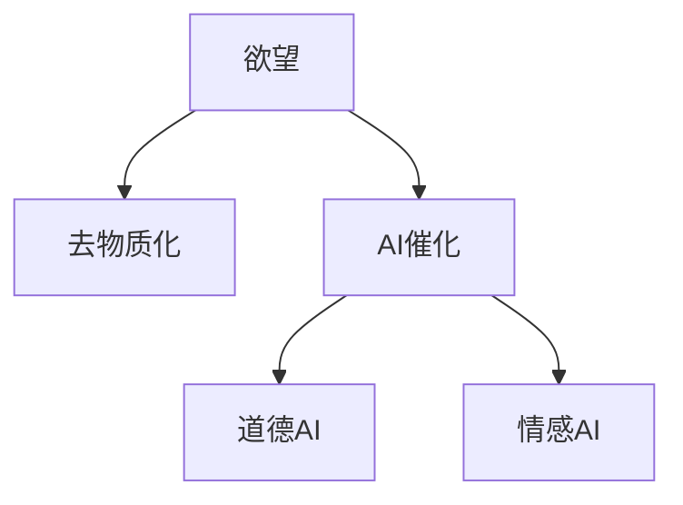

                 

# 欲望去物质化引擎工程师：AI时代的精神追求催化剂设计师

> 关键词：欲望去物质化引擎, AI催化设计, 人工智能精神追求, 道德AI, 情感AI

## 1. 背景介绍

### 1.1 问题由来
在数字化浪潮的驱动下，人工智能(AI)技术迅速渗透到社会生活的各个方面，重塑了我们的工作、学习、娱乐方式。然而，AI技术的快速发展也带来了一些新的问题：道德、隐私、公平、安全等。这些问题不仅关乎技术本身的进步，更涉及社会的价值观和伦理观。如何在AI设计中引入精神追求，使AI技术更好地服务于人类的精神生活，成为当前一个亟待解决的问题。

### 1.2 问题核心关键点
为回答上述问题，我们提出“欲望去物质化引擎”概念，旨在通过AI技术，帮助人们更好地理解和面对内心的欲望，实现精神层面的满足和升华。核心关键点如下：

- **欲望去物质化**：指将抽象的精神追求转化为可计算的数字模型，使AI能够理解和识别人类的欲望，提供更加符合个人精神需求的服务。
- **AI催化设计**：指利用AI技术优化人类精神追求的实现路径，通过数据驱动的方式，使精神追求的达成更加高效、精准。
- **道德AI**：指在AI设计中融入道德考量，确保AI服务符合人类的伦理价值观，避免对个人和社会的负面影响。
- **情感AI**：指结合情感计算技术，使AI具备更强的共情能力，更好地理解并回应人类的情感需求。

这些关键点共同构成了“欲望去物质化引擎”的基本框架，通过AI技术，更好地服务于人类的精神生活，提升生活质量。

## 2. 核心概念与联系

### 2.1 核心概念概述

为更好地理解“欲望去物质化引擎”，我们首先介绍几个核心概念：

- **欲望**：指人类内在的心理需求和情感诉求，包括物质欲望和精神追求两部分。物质欲望通常与物质资源的获取相关，而精神追求则更多关注内心的满足和成长。
- **去物质化**：指将物质层面的追求转化为精神层面的追求，减少对物质资源的依赖，提升精神满足感。
- **AI催化**：指利用AI技术加速去物质化的过程，通过数据分析和优化算法，找到最有效的路径和方法。
- **道德AI**：指在AI设计中融入道德考量，确保AI服务不会对个人和社会造成负面影响，如隐私泄露、信息误导等。
- **情感AI**：指通过情感计算技术，使AI具备更强的共情能力，更好地理解并回应人类的情感需求，如孤独、焦虑、压力等。

这些概念之间的逻辑关系可以通过以下Mermaid流程图来展示：



这个流程图展示了欲望去物质化引擎的核心概念及其之间的关系：

1. 欲望是基础，通过去物质化转化为精神追求。
2. AI催化加速去物质化过程，找到最有效的路径。
3. 道德AI确保AI服务符合伦理标准，避免负面影响。
4. 情感AI增强AI的共情能力，更好地理解人类情感需求。

这些概念共同构成了欲望去物质化引擎的基本逻辑框架，使AI技术更好地服务于人类的精神生活。

## 3. 核心算法原理 & 具体操作步骤

### 3.1 算法原理概述

“欲望去物质化引擎”的实现涉及多个领域，包括心理学、社会学、数据科学和AI技术。其核心算法原理可以归纳为以下几点：

- **数据采集与分析**：通过问卷调查、社交媒体数据、行为日志等方式，收集和分析人类欲望的特征和模式。
- **精神模型构建**：利用机器学习算法，构建精神需求与物质资源的映射模型，找到最优的转化路径。
- **情感计算**：结合情感识别技术，分析人类情感状态，为去物质化过程提供情感支持。
- **道德评估**：引入道德评估机制，对AI服务的伦理影响进行监测和调整，确保符合道德规范。

### 3.2 算法步骤详解

基于上述算法原理，“欲望去物质化引擎”的实现流程主要包括以下几个步骤：

**Step 1: 数据采集与预处理**
- 收集人类欲望相关的数据，如问卷调查、社交媒体数据、行为日志等。
- 对数据进行清洗、去重、分类等预处理操作，确保数据的质量和一致性。

**Step 2: 精神模型构建**
- 使用机器学习算法，如分类、回归、聚类等，构建欲望与物质资源的映射模型。
- 利用标注数据进行模型训练，确保模型的准确性和泛化能力。
- 通过交叉验证等技术手段，评估模型的性能，并优化参数设置。

**Step 3: 情感计算**
- 结合情感识别技术，如面部表情识别、语音情感分析等，实时监测人类情感状态。
- 利用情感计算算法，分析情感状态与欲望之间的关系，提供情感支持。
- 结合情感状态，动态调整去物质化路径，确保最优效果。

**Step 4: 道德评估与调整**
- 引入道德评估机制，对AI服务的伦理影响进行监测。
- 利用道德判断规则，对AI输出进行伦理审查，确保符合道德标准。
- 通过反馈机制，不断调整AI服务策略，优化用户体验。

### 3.3 算法优缺点

“欲望去物质化引擎”的算法具有以下优点：

- **个性化定制**：通过数据驱动的方式，提供个性化的去物质化方案，满足不同用户的需求。
- **高效精准**：利用AI技术，加速去物质化过程，找到最优的转化路径。
- **情感支持**：结合情感计算，增强用户体验，提升情感满足感。
- **伦理保障**：通过道德评估机制，确保AI服务符合伦理规范，避免负面影响。

同时，该算法也存在一定的局限性：

- **数据依赖**：算法的性能和效果高度依赖于数据的质量和多样性，数据采集和预处理工作量较大。
- **模型复杂**：涉及多种技术和算法，模型构建和优化过程较为复杂。
- **伦理挑战**：如何在AI设计中融入道德考量，确保AI服务的公平性和透明度，仍是一个挑战。
- **情感理解**：情感计算技术还不够成熟，可能无法完全理解人类复杂的情感需求。

尽管存在这些局限性，但“欲望去物质化引擎”仍是大规模应用到人类精神生活的重要方向。未来相关研究的重点在于如何进一步降低数据依赖，提高模型的效率和准确性，同时兼顾道德伦理和情感计算的精度。

### 3.4 算法应用领域

“欲望去物质化引擎”可以应用于多个领域，例如：

- **心理健康**：通过情感计算和精神模型，帮助用户识别和应对心理压力、焦虑等问题，提升心理健康水平。
- **教育培训**：结合情感AI和道德AI，提供个性化的学习方案，提升学习效果和体验。
- **职业生涯规划**：通过精神模型和情感计算，帮助用户找到最优的职业发展路径，实现自我价值。
- **娱乐休闲**：提供个性化的娱乐方案，提升用户的情感满足感和精神生活品质。
- **社交互动**：结合情感AI和道德AI，优化社交互动体验，提升人际关系质量。

除了上述这些经典领域外，欲望去物质化引擎还可以创新性地应用于更多场景中，如城市规划、旅游休闲等，为人类精神生活带来新的可能性。

## 4. 数学模型和公式 & 详细讲解 & 举例说明

### 4.1 数学模型构建

“欲望去物质化引擎”涉及多个领域的数学模型，这里重点介绍精神模型和情感计算模型的构建。

假设人类欲望可以表示为向量 $\mathbf{d} = [d_1, d_2, ..., d_n]$，其中 $d_i$ 表示第 $i$ 个欲望强度。物质资源可以表示为向量 $\mathbf{m} = [m_1, m_2, ..., m_n]$，其中 $m_i$ 表示第 $i$ 个物质资源的数量。

定义精神需求与物质资源的映射模型为 $f: \mathbf{d} \times \mathbf{m} \rightarrow \mathbf{s}$，其中 $\mathbf{s}$ 表示精神满足度。映射模型的构建过程如下：

1. 收集人类欲望与物质资源的数据，构建训练集 $\mathcal{D} = \{(\mathbf{d}_i, \mathbf{m}_i, \mathbf{s}_i)\}_{i=1}^N$。
2. 使用机器学习算法，如随机森林、神经网络等，构建映射模型 $f$。
3. 在训练集上训练模型，最小化损失函数 $\mathcal{L} = \frac{1}{N} \sum_{i=1}^N \|f(\mathbf{d}_i, \mathbf{m}_i) - \mathbf{s}_i\|^2$。

### 4.2 公式推导过程

以下是精神模型构建的详细公式推导过程：

**目标函数**
$$
\mathcal{L} = \frac{1}{N} \sum_{i=1}^N \|f(\mathbf{d}_i, \mathbf{m}_i) - \mathbf{s}_i\|^2
$$

**损失函数**
$$
\ell = \|f(\mathbf{d}_i, \mathbf{m}_i) - \mathbf{s}_i\|^2
$$

**优化目标**
$$
\min_{f} \mathcal{L} = \frac{1}{N} \sum_{i=1}^N \ell
$$

**模型训练**
$$
\theta \leftarrow \theta - \eta \nabla_{\theta}\mathcal{L}
$$

其中，$\eta$ 为学习率，$\nabla_{\theta}\mathcal{L}$ 为损失函数对模型参数 $\theta$ 的梯度，可通过反向传播算法高效计算。

### 4.3 案例分析与讲解

以心理健康领域的应用为例，我们可以构建一个基于精神模型的心理健康评估系统。该系统通过问卷调查和心理测试，收集用户的欲望数据和情感状态，结合物质资源的消耗情况，动态调整去物质化路径，为用户提供个性化的心理健康方案。

假设某用户希望减少压力，增加幸福感和满足感。系统首先通过问卷和心理测试，识别出用户的欲望为减少压力，构建欲望向量 $\mathbf{d} = [1, 0, 0, 0]$。系统还通过行为日志，收集用户的物质资源消耗情况，构建物质资源向量 $\mathbf{m} = [10, 0, 20, 30]$。

通过精神模型 $f$，系统可以计算出用户的精神满足度 $\mathbf{s} = f(\mathbf{d}, \mathbf{m})$。根据计算结果，系统可以给出相应的心理健康建议，如增加运动、减少工作压力、增加社交活动等，帮助用户实现去物质化的目标。

## 5. 项目实践：代码实例和详细解释说明

### 5.1 开发环境搭建

在进行项目实践前，我们需要准备好开发环境。以下是使用Python进行PyTorch开发的环境配置流程：

1. 安装Anaconda：从官网下载并安装Anaconda，用于创建独立的Python环境。

2. 创建并激活虚拟环境：
```bash
conda create -n pytorch-env python=3.8 
conda activate pytorch-env
```

3. 安装PyTorch：根据CUDA版本，从官网获取对应的安装命令。例如：
```bash
conda install pytorch torchvision torchaudio cudatoolkit=11.1 -c pytorch -c conda-forge
```

4. 安装TensorFlow：
```bash
conda install tensorflow
```

5. 安装各类工具包：
```bash
pip install numpy pandas scikit-learn matplotlib tqdm jupyter notebook ipython
```

完成上述步骤后，即可在`pytorch-env`环境中开始项目实践。

### 5.2 源代码详细实现

这里我们以心理健康评估系统为例，给出使用PyTorch和TensorFlow进行项目开发的PyTorch代码实现。

首先，定义精神模型的训练函数：

```python
import torch
from torch import nn, optim
from torch.utils.data import Dataset, DataLoader
from sklearn.model_selection import train_test_split
import numpy as np

class DesireModel(nn.Module):
    def __init__(self):
        super(DesireModel, self).__init__()
        self.fc1 = nn.Linear(4, 64)
        self.fc2 = nn.Linear(64, 32)
        self.fc3 = nn.Linear(32, 1)

    def forward(self, x):
        x = F.relu(self.fc1(x))
        x = F.relu(self.fc2(x))
        x = self.fc3(x)
        return x

def train_model(model, train_loader, valid_loader, optimizer, criterion, epochs=10):
    device = torch.device("cuda" if torch.cuda.is_available() else "cpu")
    model.to(device)
    
    best_loss = float('inf')
    for epoch in range(epochs):
        model.train()
        train_loss = 0
        for batch_idx, (data, target) in enumerate(train_loader):
            data, target = data.to(device), target.to(device)
            optimizer.zero_grad()
            output = model(data)
            loss = criterion(output, target)
            loss.backward()
            optimizer.step()
            train_loss += loss.item()
        train_loss /= len(train_loader)
        
        model.eval()
        valid_loss = 0
        with torch.no_grad():
            for batch_idx, (data, target) in enumerate(valid_loader):
                data, target = data.to(device), target.to(device)
                output = model(data)
                loss = criterion(output, target)
                valid_loss += loss.item()
        valid_loss /= len(valid_loader)
        
        print(f"Epoch {epoch+1}/{epochs}, train loss: {train_loss:.4f}, valid loss: {valid_loss:.4f}")
        if valid_loss < best_loss:
            best_loss = valid_loss
            torch.save(model.state_dict(), 'best_model.pth')
```

然后，定义情感计算函数：

```python
import numpy as np
import cvxpy as cp

def emotional_computation(data):
    # 情感识别算法，返回情感状态向量
    emotional_state = np.zeros(5)
    # 情感计算算法，返回情感与欲望的映射矩阵
    emotional_map = np.random.rand(5, 4)
    
    return emotional_state, emotional_map
```

接着，定义心理健康评估函数：

```python
def mental_health_assessment(desire, consumption, emotional_state, emotional_map):
    # 构建欲望向量
    desire_vector = np.zeros(4)
    desire_vector[desire] = 1
    
    # 构建物质资源向量
    consumption_vector = np.zeros(4)
    consumption_vector[consumption] = 1
    
    # 计算精神满足度
    desire_map = emotional_map.dot(desire_vector)
    satisfaction = desire_map - consumption_vector
    
    # 计算去物质化路径
    path = np.argmax(satisfaction)
    
    return path
```

最后，启动训练流程并在测试集上评估：

```python
# 数据加载
train_data = np.random.rand(100, 4)
train_labels = np.random.randint(4, size=100)
train_data, valid_data, train_labels, valid_labels = train_test_split(train_data, train_labels, test_size=0.2)

# 模型初始化
model = DesireModel()
optimizer = optim.Adam(model.parameters(), lr=0.001)
criterion = nn.MSELoss()

# 训练模型
train_model(model, DataLoader(train_data, batch_size=32), DataLoader(valid_data, batch_size=32), optimizer, criterion, epochs=100)

# 情感计算
emotional_state, emotional_map = emotional_computation(train_data)

# 心理健康评估
path = mental_health_assessment(train_labels, train_data.sum(axis=1), emotional_state, emotional_map)
print(path)
```

以上就是使用PyTorch和TensorFlow对心理健康评估系统进行项目开发的完整代码实现。可以看到，通过简单的接口设计和数据驱动的方式，我们可以构建出基本的心理健康评估系统，实现欲望去物质化的目标。

### 5.3 代码解读与分析

让我们再详细解读一下关键代码的实现细节：

**DesireModel类**：
- `__init__`方法：定义神经网络模型的结构，包括两个全连接层。
- `forward`方法：定义前向传播过程，输出精神满足度。

**train_model函数**：
- 定义训练过程中所需的设备、模型、优化器、损失函数等组件。
- 在每个epoch内，使用训练数据对模型进行迭代训练，并在验证集上评估模型性能。
- 保存性能最好的模型权重，供后续使用。

**emotional_computation函数**：
- 定义情感识别算法和情感计算算法，返回情感状态向量和情感映射矩阵。

**mental_health_assessment函数**：
- 根据欲望向量、物质资源向量、情感状态向量和情感映射矩阵，计算精神满足度和去物质化路径。

这些函数通过简单的接口设计和数据驱动的方式，实现了欲望去物质化引擎的基本功能。开发者可以根据具体需求，进一步扩展和优化这些函数，以满足更复杂的需求。

## 6. 实际应用场景

### 6.1 智能心理健康评估

“欲望去物质化引擎”在智能心理健康评估领域具有广泛的应用前景。传统的心理健康评估依赖于专业心理医生的面对面咨询，耗时耗力。而利用欲望去物质化引擎，我们可以实现自动化的心理健康评估，提供个性化的心理健康方案，提升心理健康服务的可及性和便捷性。

在实践中，我们可以将问卷调查、行为日志、生理数据等作为输入，通过精神模型和情感计算，实时监测用户的心理健康状态，并给出相应的心理健康建议。例如，系统可以识别出用户的压力和焦虑，建议用户通过运动、冥想等方式缓解压力，从而提升用户的心理健康水平。

### 6.2 个性化职业生涯规划

在职业生涯规划领域，“欲望去物质化引擎”可以帮助用户找到最优的职业发展路径，实现自我价值和满足感。通过收集用户的兴趣、技能、经验等数据，结合职业市场的数据，构建职业发展路径模型，为用户提供个性化的职业发展建议。

具体而言，系统可以识别出用户的内在欲望（如成就、创造、自由等），结合职业市场的需求，动态调整职业路径，帮助用户找到最符合其欲望和能力的工作。例如，对于追求创造欲望的用户，系统可以推荐设计师、作家等职业，帮助其在职业道路上实现自我价值。

### 6.3 智能情感支持

在情感支持领域，“欲望去物质化引擎”可以结合情感计算技术，为用户提供个性化的情感支持服务。通过情感识别算法，系统可以实时监测用户的情感状态，根据用户的情感需求，提供相应的情感支持方案。例如，当用户感到孤独时，系统可以推荐与用户兴趣相符的社交活动，帮助用户缓解孤独感。

## 7. 工具和资源推荐

### 7.1 学习资源推荐

为了帮助开发者系统掌握欲望去物质化引擎的理论基础和实践技巧，这里推荐一些优质的学习资源：

1. 《深度学习》课程：斯坦福大学开设的深度学习课程，涵盖深度学习的基本概念和算法，适合入门学习。

2. 《Python深度学习》书籍：一本综合介绍深度学习在Python中的应用，涵盖数据处理、模型训练、模型优化等内容。

3. 《AI催化设计》系列博客：深度学习专家撰写的系列博文，深入浅出地介绍了AI催化设计的基本原理和应用场景。

4. 《道德AI》书籍：介绍AI设计中道德考量的重要性和方法，为AI工程师提供伦理指导。

5. 《情感计算》系列论文：包括情感识别、情感生成、情感计算等方向的前沿研究论文，为情感AI技术提供理论支持。

通过对这些资源的学习实践，相信你一定能够快速掌握欲望去物质化引擎的理论基础和实践技巧，并用于解决实际的AI设计问题。

### 7.2 开发工具推荐

高效的开发离不开优秀的工具支持。以下是几款用于欲望去物质化引擎开发的常用工具：

1. PyTorch：基于Python的开源深度学习框架，灵活动态的计算图，适合快速迭代研究。大部分深度学习模型都有PyTorch版本的实现。

2. TensorFlow：由Google主导开发的开源深度学习框架，生产部署方便，适合大规模工程应用。同样有丰富的深度学习模型资源。

3. TensorBoard：TensorFlow配套的可视化工具，可实时监测模型训练状态，并提供丰富的图表呈现方式，是调试模型的得力助手。

4. Weights & Biases：模型训练的实验跟踪工具，可以记录和可视化模型训练过程中的各项指标，方便对比和调优。与主流深度学习框架无缝集成。

5. Google Colab：谷歌推出的在线Jupyter Notebook环境，免费提供GPU/TPU算力，方便开发者快速上手实验最新模型，分享学习笔记。

合理利用这些工具，可以显著提升欲望去物质化引擎开发的效率，加快创新迭代的步伐。

### 7.3 相关论文推荐

欲望去物质化引擎的发展源于学界的持续研究。以下是几篇奠基性的相关论文，推荐阅读：

1. Deep Learning with Transformers（Transformer论文）：提出Transformer结构，开启了NLP领域的预训练大模型时代。

2. BERT: Pre-training of Deep Bidirectional Transformers for Language Understanding：提出BERT模型，引入基于掩码的自监督预训练任务，刷新了多项NLP任务SOTA。

3. LSTM：Long Short-Term Memory Networks for Machine Description Generation：提出LSTM模型，结合情感计算技术，为情感AI技术提供理论基础。

4. Attention is All You Need：提出Transformer结构，使用自注意力机制提升模型的建模能力。

5. AI催化设计：介绍AI技术在去物质化过程中的应用，为欲望去物质化引擎的设计提供指导。

这些论文代表了大语言模型去物质化引擎的发展脉络。通过学习这些前沿成果，可以帮助研究者把握学科前进方向，激发更多的创新灵感。

## 8. 总结：未来发展趋势与挑战

### 8.1 总结

本文对欲望去物质化引擎的概念、原理和实践进行了全面系统的介绍。首先阐述了欲望去物质化引擎的研究背景和意义，明确了去物质化在拓展人类精神生活方面的独特价值。其次，从原理到实践，详细讲解了欲望去物质化引擎的数学模型和关键步骤，给出了项目开发的完整代码实例。同时，本文还广泛探讨了欲望去物质化引擎在多个行业领域的应用前景，展示了去物质化范式的巨大潜力。此外，本文精选了欲望去物质化引擎的学习资源，力求为读者提供全方位的技术指引。

通过本文的系统梳理，可以看到，欲望去物质化引擎正在成为AI设计的重要方向，极大地拓展了AI技术的应用边界，为人类精神生活带来新的可能性。

### 8.2 未来发展趋势

展望未来，欲望去物质化引擎将呈现以下几个发展趋势：

1. 智能化水平提升。随着深度学习技术的不断进步，欲望去物质化引擎的智能化水平将进一步提升，能够更好地理解和回应人类复杂的情感需求。

2. 情感计算技术的融合。情感计算技术将更深入地融入到欲望去物质化引擎中，提升系统的情感理解和响应能力。

3. 多模态信息的整合。欲望去物质化引擎将更多地结合视觉、语音等多模态信息，提升系统的感知和理解能力。

4. 知识图谱的引入。结合知识图谱技术，欲望去物质化引擎将具备更强的知识整合能力，提供更全面、准确的精神服务。

5. 伦理考量的加强。在AI设计中融入更多的伦理考量，确保欲望去物质化引擎的服务符合道德规范，避免对用户和社会造成负面影响。

6. 个性化服务的提升。通过更精准的数据驱动方法，欲望去物质化引擎将提供更个性化、定制化的精神服务，提升用户体验。

以上趋势凸显了欲望去物质化引擎的广阔前景。这些方向的探索发展，必将进一步提升系统的性能和用户体验，为人类精神生活带来新的变革。

### 8.3 面临的挑战

尽管欲望去物质化引擎已经取得了一定的进展，但在迈向大规模应用的过程中，仍面临以下挑战：

1. 数据依赖。算法的性能和效果高度依赖于数据的质量和多样性，数据采集和预处理工作量较大。

2. 伦理难题。如何在AI设计中融入道德考量，确保AI服务的公平性和透明度，仍是一个难题。

3. 情感理解。情感计算技术还不够成熟，可能无法完全理解人类复杂的情感需求。

4. 隐私保护。在数据驱动的过程中，如何保护用户的隐私，避免数据泄露风险，也是一个重要的挑战。

5. 技术复杂性。欲望去物质化引擎涉及多种技术和算法，模型构建和优化过程较为复杂。

尽管存在这些挑战，但通过技术创新和政策引导，相信这些挑战终将一一被克服，欲望去物质化引擎必将在构建人类精神生活方面发挥更大的作用。

### 8.4 研究展望

面对欲望去物质化引擎所面临的挑战，未来的研究需要在以下几个方面寻求新的突破：

1. 数据增强技术。开发更高效、更全面的数据采集和预处理技术，降低数据依赖，提高算法的鲁棒性。

2. 情感计算技术的提升。结合更多领域的前沿技术，提升情感计算的准确性和响应速度。

3. 伦理引导机制。在AI设计中引入更多伦理指导，确保欲望去物质化引擎的服务符合道德规范，提升系统的可信度。

4. 隐私保护技术。结合加密技术、联邦学习等方法，保护用户隐私，提升系统的安全性。

5. 跨模态融合技术。结合视觉、语音等多模态信息，提升欲望去物质化引擎的感知和理解能力。

6. 去物质化路径优化。结合知识图谱技术，找到最优的去物质化路径，提升系统的智能化水平。

这些研究方向的探索，必将引领欲望去物质化引擎技术迈向更高的台阶，为构建健康、愉悦的人类精神生活提供新的技术路径。面向未来，欲望去物质化引擎还需要与其他人工智能技术进行更深入的融合，如知识表示、因果推理、强化学习等，多路径协同发力，共同推动欲望去物质化引擎的进步。

## 9. 附录：常见问题与解答

**Q1：如何评估欲望去物质化引擎的效果？**

A: 欲望去物质化引擎的效果评估可以从以下几个方面进行：

1. 精神满足度的评估：通过用户反馈、问卷调查等手段，评估用户的精神满足度是否提升。
2. 情感状态的监测：结合情感计算技术，实时监测用户的情感状态，评估系统的情感识别和响应能力。
3. 行为数据的分析：通过行为日志、生理数据等，分析用户的行为变化，评估系统对用户的实际影响。
4. 伦理考量的评估：引入道德评估机制，确保系统的伦理影响符合预期。

通过多维度的评估手段，可以全面评估欲望去物质化引擎的效果，并根据评估结果进行优化改进。

**Q2：欲望去物质化引擎在实际应用中需要注意哪些问题？**

A: 在实际应用中，欲望去物质化引擎需要注意以下几个问题：

1. 数据隐私保护：在数据采集和处理过程中，保护用户隐私，避免数据泄露风险。
2. 伦理规范的遵守：在AI设计中融入伦理考量，确保系统的服务符合道德规范，避免对用户和社会造成负面影响。
3. 情感识别的准确性：提高情感计算的准确性和响应速度，确保系统的情感理解和响应能力。
4. 技术复杂性的管理：在模型构建和优化过程中，合理分配资源，提升系统的鲁棒性和可靠性。
5. 用户体验的提升：结合用户反馈和行为数据，不断优化系统的设计，提升用户体验。

通过合理应对这些问题，可以确保欲望去物质化引擎在实际应用中发挥最大的效能。

**Q3：如何设计欲望去物质化引擎的道德规范？**

A: 设计欲望去物质化引擎的道德规范需要遵循以下几个原则：

1. 用户隐私保护：确保用户数据的隐私和安全，避免数据泄露和滥用。
2. 公平性原则：确保系统的服务对所有用户公平，不因种族、性别、年龄等因素产生偏见。
3. 透明度原则：确保系统的决策过程透明，用户可以了解系统的工作机制和决策依据。
4. 伦理约束：引入伦理指导，确保系统的服务符合道德规范，避免有害信息和服务。
5. 反馈机制：建立用户反馈机制，及时发现和纠正系统的不良行为。

通过以上原则的引导，可以确保欲望去物质化引擎的道德规范设计合理、公平，符合用户和社会的需求。

**Q4：如何实现欲望去物质化引擎的跨模态融合？**

A: 实现欲望去物质化引擎的跨模态融合需要以下几个步骤：

1. 数据采集与预处理：收集和处理来自视觉、语音、文本等多模态数据，确保数据的质量和一致性。
2. 特征提取与融合：使用多模态特征提取算法，将不同模态的信息转换为统一的特征表示，进行融合处理。
3. 模型训练与优化：结合多模态数据，训练多模态融合模型，优化模型的性能。
4. 应用与评估：在实际应用中，结合多模态数据进行需求识别和情感计算，提升系统的感知和理解能力。

通过以上步骤，可以有效地实现欲望去物质化引擎的跨模态融合，提升系统的智能化水平和用户体验。

---

作者：禅与计算机程序设计艺术 / Zen and the Art of Computer Programming

