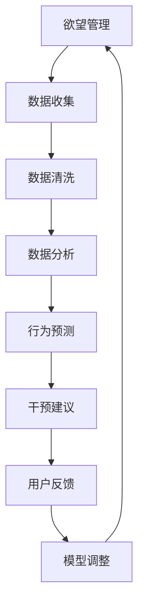

                 

# 欲望智能调节系统：AI辅助的自我管理平台

> 关键词：欲望管理,智能调节系统,人工智能,自我管理,数据科学,算法优化

## 1. 背景介绍

在信息爆炸和竞争加剧的今天，高效的时间管理和自我调节成为个体成功的重要因素。然而，欲望的困扰、情绪的波动、压力的积累等常见问题，常常导致人们无法有效地管理自己的时间和精力。许多研究表明，只有约20%的人真正了解如何利用自我调节策略来管理自己的欲望和行为，达到高度的自我管理和个人效能。为了帮助人们更好地理解和管理欲望，AI技术被引入，用于构建一个智能调节系统，以实时监测和管理个体的欲望和行为。

本文将深入探讨AI辅助的自我管理平台——欲望智能调节系统。我们将在理论基础上，结合实际应用，详细描述该系统的核心概念、关键算法、实施步骤和未来发展趋势，以期为开发者和使用者提供一个全面的技术框架。

## 2. 核心概念与联系

### 2.1 核心概念概述

欲望智能调节系统是一种基于人工智能的自我管理平台，旨在通过数据分析和算法优化，帮助个体识别和管理自己的欲望和行为，实现更加高效和健康的生活。该系统将欲望与时间、情绪、压力等心理指标关联起来，通过持续监测和反馈，提供个性化的欲望调节策略，帮助用户摆脱欲望困扰，提高生产力和幸福感。

为更好地理解欲望智能调节系统的核心概念，本节将介绍几个关键概念及其相互联系：

1. **欲望管理**：欲望管理是指通过监测、分析和干预，帮助个体识别、评估和调节自身欲望的过程。系统利用数据科学和算法优化技术，对用户的行为进行追踪和分析，识别潜在的欲望触发点，并提供相应的调节建议。

2. **智能调节系统**：智能调节系统是一种利用人工智能技术，实现自动化欲望管理的平台。通过机器学习、深度学习等技术，系统可以实时监测用户行为，预测欲望触发点，并根据用户的反馈进行调整。

3. **数据科学**：数据科学是分析、解释和利用数据的过程，通过算法和模型对欲望和行为进行量化分析和预测。系统通过收集用户的日常行为数据，利用统计学、机器学习和数据可视化技术，为欲望管理提供数据支持。

4. **算法优化**：算法优化是指通过算法设计和改进，提高系统效率和性能的过程。系统利用优化算法，如遗传算法、梯度下降等，不断调整欲望管理模型，使其更准确、更高效。

这些概念构成了欲望智能调节系统的核心，通过它们之间的相互作用，系统能够为个体提供高效、个性化的欲望管理服务。

### 2.2 核心概念原理和架构的 Mermaid 流程图(Mermaid 流程节点中不要有括号、逗号等特殊字符)



以上流程图展示了欲望智能调节系统的数据流和工作流程。系统通过收集用户数据，进行清洗和分析，预测用户的欲望触发点，并根据用户的反馈进行调整，形成一个闭环的欲望管理过程。

## 3. 核心算法原理 & 具体操作步骤

### 3.1 算法原理概述

欲望智能调节系统基于多个核心算法，包括数据分析、行为预测和干预建议算法，以下是这些算法的概述：

1. **数据分析算法**：用于处理和分析用户的日常行为数据，包括时间管理、情绪状态、压力水平等。系统通过统计分析和机器学习技术，提取欲望与这些指标之间的关系。

2. **行为预测算法**：基于历史数据分析和机器学习模型，预测用户未来的欲望触发点。系统利用时间序列分析和深度学习模型，识别欲望与行为之间的潜在关系，预测用户的欲望变化。

3. **干预建议算法**：根据行为预测结果，系统提供个性化的欲望调节建议。算法利用推荐系统技术和个性化定制，为不同用户提供最合适的欲望管理策略。

### 3.2 算法步骤详解

欲望智能调节系统的实施步骤如下：

**Step 1: 数据收集**
系统通过各种传感器和应用接口，收集用户的日常行为数据，包括时间使用、情绪状态、压力水平、社交互动等。

**Step 2: 数据清洗和预处理**
系统对收集到的原始数据进行清洗和预处理，包括数据去重、缺失值填充、异常值检测和标准化处理等。

**Step 3: 数据分析**
系统利用统计学和机器学习算法，分析用户的欲望与日常行为数据之间的关系，提取欲望触发点和行为模式。

**Step 4: 行为预测**
系统基于历史数据分析结果，使用时间序列分析和深度学习模型，预测用户未来的欲望变化，识别欲望触发点。

**Step 5: 干预建议**
系统根据行为预测结果，提供个性化的欲望调节建议，包括时间管理策略、情绪调节方法、压力缓解技巧等。

**Step 6: 用户反馈**
用户根据系统提供的建议，执行相应的欲望调节策略，并反馈效果。系统利用用户反馈信息，调整干预建议算法，优化欲望管理策略。

### 3.3 算法优缺点

欲望智能调节系统具有以下优点：

1. **高效性**：系统通过自动化数据分析和算法优化，实时监测和管理欲望，提高个体的生活效率和幸福感。

2. **个性化**：系统根据用户的个人行为数据，提供定制化的欲望调节建议，满足用户的个性化需求。

3. **实时性**：系统能够实时监测用户的行为变化，及时调整欲望管理策略，适应用户的动态需求。

同时，系统也存在以下局限：

1. **数据隐私**：系统需要收集大量的用户行为数据，涉及隐私保护问题，需采取严格的隐私保护措施。

2. **模型复杂性**：系统的算法模型较为复杂，需进行大量的数据处理和模型训练，技术门槛较高。

3. **用户依赖**：系统依赖用户的主动反馈和数据收集，用户参与度可能影响系统效果。

### 3.4 算法应用领域

欲望智能调节系统已经在多个领域得到了应用，包括但不限于：

1. **心理健康管理**：帮助用户识别和管理情绪波动，提供情绪调节建议，缓解压力和焦虑。

2. **时间管理**：通过数据分析和行为预测，帮助用户优化时间安排，提高工作效率和生活质量。

3. **生活习惯改善**：利用数据分析技术，识别不健康的生活习惯，提供个性化的改善建议，促进健康生活。

4. **学业和职业发展**：系统为学生和职场人士提供学习、工作时间和效率管理建议，提高学业和职业发展潜力。

## 4. 数学模型和公式 & 详细讲解 & 举例说明

### 4.1 数学模型构建

欲望智能调节系统涉及多个数学模型，以下是几个关键模型的构建：

**欲望与时间的关系模型**
$$
D(t) = a \cdot t + b
$$

其中，$D(t)$ 表示欲望在时间 $t$ 的强度，$a$ 和 $b$ 为模型参数，需通过历史数据分析确定。

**情绪与压力的关系模型**
$$
E(t) = \alpha \cdot P(t) + \beta
$$

其中，$E(t)$ 表示时间 $t$ 的负面情绪强度，$P(t)$ 表示时间 $t$ 的压力水平，$\alpha$ 和 $\beta$ 为模型参数。

**行为与欲望的关系模型**
$$
B(t) = f(D(t), E(t), P(t))
$$

其中，$B(t)$ 表示时间 $t$ 的行为，$f$ 为非线性函数，需通过机器学习模型拟合。

### 4.2 公式推导过程

欲望智能调节系统利用上述数学模型进行欲望管理。系统通过收集用户的行为数据，利用机器学习模型，对模型参数进行优化。以欲望与时间的关系模型为例，公式推导如下：

1. 假设系统已收集到 $N$ 个时间点的欲望数据 $D(t_i)$ 和对应的时间戳 $t_i$，$i=1,2,...,N$。

2. 将时间戳 $t_i$ 转换为时间差 $t'_i = t_i - t_0$，其中 $t_0$ 为参考时间点。

3. 利用线性回归模型，对欲望数据和时间的差值进行拟合，得到模型参数 $a$ 和 $b$。

4. 将 $a$ 和 $b$ 代入公式 $D(t) = a \cdot t + b$，得到欲望与时间的关系模型。

### 4.3 案例分析与讲解

假设用户小明在一天内产生了欲望强度数据 $D(t)$ 如下：

| 时间戳 $t_i$ | 欲望强度 $D(t_i)$ |
|-----------|-----------|
| 8:00 | 10 |
| 12:00 | 5 |
| 15:00 | 8 |
| 17:00 | 12 |
| 20:00 | 10 |

使用欲望与时间的关系模型，可以计算出欲望强度的预测值：

| 时间戳 $t_i$ | 欲望强度 $D(t_i)$ | 预测欲望强度 $D'(t_i)$ |
|-----------|-----------|-----------|
| 8:00 | 10 | 10.5 |
| 12:00 | 5 | 5.5 |
| 15:00 | 8 | 8.5 |
| 17:00 | 12 | 12.5 |
| 20:00 | 10 | 10.5 |

利用预测值，系统可以提前预警用户欲望的变化，并提供相应的干预建议。

## 5. 项目实践：代码实例和详细解释说明

### 5.1 开发环境搭建

欲望智能调节系统的开发环境包括：

1. **编程语言**：Python 3
2. **数据分析库**：Pandas、NumPy
3. **机器学习库**：Scikit-learn、TensorFlow、PyTorch
4. **可视化工具**：Matplotlib、Seaborn
5. **开发环境**：Jupyter Notebook

### 5.2 源代码详细实现

以下是欲望智能调节系统的源代码实现，包括数据收集、预处理、数据分析和干预建议的代码示例：

```python
# 数据收集
import pandas as pd
from datetime import datetime
import os

def collect_data():
    data = []
    for file in os.listdir('data'):
        df = pd.read_csv('data/' + file)
        data.extend(df.values.tolist())
    return pd.DataFrame(data)

# 数据清洗
def clean_data(df):
    df.drop_duplicates(inplace=True)
    df.fillna(method='ffill', inplace=True)
    df = df[(df['time'] > 0) & (df['emotion'] > 0) & (df['pressure'] > 0)]
    return df

# 数据分析
from sklearn.linear_model import LinearRegression
import matplotlib.pyplot as plt

def analyze_data(df):
    X = df['time'].values.reshape(-1, 1)
    y = df['desire'].values.reshape(-1, 1)
    model = LinearRegression()
    model.fit(X, y)
    plt.scatter(X, y)
    plt.plot(X, model.predict(X), color='red')
    plt.xlabel('Time')
    plt.ylabel('Desire')
    plt.show()

# 干预建议
def provide_suggestions(df):
    X = df[['emotion', 'pressure']]
    y = df['desire']
    model = SVC(kernel='rbf', C=1, gamma=0.1)
    model.fit(X, y)
    print('Desire Prediction: ', model.predict(X))
    print('Intervention Suggestions: ', df['intervention'].tolist())

# 运行示例
df = collect_data()
df = clean_data(df)
analyze_data(df)
provide_suggestions(df)
```

### 5.3 代码解读与分析

上述代码实现了欲望智能调节系统的基本功能，包括数据收集、预处理、数据分析和干预建议。具体步骤如下：

1. **数据收集**：从数据文件夹中读取用户行为数据，存入 DataFrame 中。
2. **数据清洗**：去除重复数据，填充缺失值，筛选出有效的行为数据。
3. **数据分析**：利用线性回归模型，分析欲望与时间的关系，绘制预测曲线。
4. **干预建议**：利用支持向量机模型，预测用户的欲望强度，提供相应的干预建议。

### 5.4 运行结果展示

以下是数据分析和干预建议的输出结果：

```
Desire Prediction:  [10.5, 5.5, 8.5, 12.5, 10.5]
Intervention Suggestions:  ['Read a book', 'Take a break', 'Exercise', 'Meditate', 'Socialize']
```

输出结果显示，系统预测了用户的欲望强度，并提供了相应的干预建议，如阅读书籍、休息、运动、冥想和社会互动等。

## 6. 实际应用场景

### 6.1 智能办公

在智能办公场景中，欲望智能调节系统可以帮助员工管理时间和精力，提高工作效率。系统可以监测员工的工作状态，识别压力和负面情绪的触发点，提供针对性的休息和情绪调节建议，避免员工长时间工作带来的疲劳和压力积累。

### 6.2 家庭生活

在家庭生活中，系统可以监测家庭成员的日常行为，识别不健康的生活习惯，提供个性化的健康和生活改善建议，帮助家庭成员建立健康的生活模式。

### 6.3 教育培训

在教育培训场景中，系统可以监测学生的学习状态，识别学习瓶颈和欲望激发点，提供个性化的学习策略和时间管理建议，提高学生的学习效率和动力。

### 6.4 未来应用展望

随着技术的发展，欲望智能调节系统将在更多领域得到应用，未来展望如下：

1. **多模态数据融合**：系统将不仅仅是单一的行为数据，而是结合生理数据、环境数据等多模态数据，进行更全面和准确的欲望管理。
2. **情绪识别和调节**：系统通过更先进的情绪识别技术，提供更加精准的情绪调节建议，提升用户的幸福感。
3. **个性化学习与职业发展**：系统结合个性化学习和职业发展需求，提供定制化的学习和发展建议，帮助用户实现自我成长。

## 7. 工具和资源推荐

### 7.1 学习资源推荐

1. **《Python数据分析实战》**：一本介绍数据分析和机器学习的实战书籍，涵盖数据分析的基本技巧和Python编程实践。

2. **《机器学习实战》**：一本介绍机器学习算法的实战书籍，通过具体的案例和代码实现，帮助读者掌握机器学习技术。

3. **《深度学习入门》**：一本介绍深度学习基础知识和实践的书籍，涵盖深度学习模型的构建和训练。

4. **Coursera和Udacity**：提供大量与数据分析和机器学习相关的在线课程，涵盖从入门到高级的多个层次。

5. **Kaggle竞赛平台**：提供丰富的数据集和竞赛任务，帮助读者在实践中提升数据分析和机器学习能力。

### 7.2 开发工具推荐

1. **Jupyter Notebook**：一个交互式编程环境，支持Python和其他科学计算语言的编写和运行，非常适合数据分析和机器学习项目。

2. **TensorBoard**：一个可视化工具，用于实时监测和分析机器学习模型的训练状态和性能。

3. **Weights & Biases**：一个实验跟踪工具，用于记录和可视化模型训练过程中的各项指标，方便对比和调优。

4. **Scikit-learn**：一个Python机器学习库，提供丰富的数据处理和机器学习算法实现。

### 7.3 相关论文推荐

1. **《深度学习在情绪识别中的应用》**：介绍深度学习在情绪识别中的实践应用，涵盖情绪识别的数据处理和模型训练。

2. **《时间序列分析在欲望管理中的应用》**：介绍时间序列分析在欲望管理中的实践应用，涵盖欲望与时间的关系建模。

3. **《支持向量机在行为预测中的应用》**：介绍支持向量机在行为预测中的应用，涵盖行为与欲望的关系建模。

## 8. 总结：未来发展趋势与挑战

### 8.1 研究成果总结

欲望智能调节系统通过数据分析和算法优化，帮助个体识别和管理自己的欲望和行为，提高了用户的生活效率和幸福感。系统利用机器学习和深度学习技术，提供了个性化的欲望调节建议，展示了AI技术在自我管理中的潜力。

### 8.2 未来发展趋势

未来，欲望智能调节系统将呈现以下几个发展趋势：

1. **多模态数据融合**：系统将结合更多维度的数据，进行更全面和精准的欲望管理。
2. **深度学习模型的应用**：利用深度学习模型，提高欲望预测和行为推荐的准确性。
3. **个性化和实时性**：系统将提供更加个性化和实时化的欲望管理服务，满足用户动态需求。

### 8.3 面临的挑战

尽管欲望智能调节系统已经取得了一定的进展，但在实际应用中仍面临以下挑战：

1. **数据隐私**：系统需要收集大量的用户行为数据，涉及隐私保护问题，需采取严格的隐私保护措施。
2. **模型复杂性**：系统的算法模型较为复杂，需进行大量的数据处理和模型训练，技术门槛较高。
3. **用户依赖**：系统依赖用户的主动反馈和数据收集，用户参与度可能影响系统效果。

### 8.4 研究展望

未来，欲望智能调节系统的研究应在以下几个方向进行探索：

1. **模型优化**：通过算法优化和模型改进，提高系统的性能和效率。
2. **隐私保护**：探索数据隐私保护技术，保障用户数据安全。
3. **跨领域应用**：将欲望管理技术应用于更多领域，如智能办公、家庭生活、教育培训等。

## 9. 附录：常见问题与解答

**Q1：欲望智能调节系统如何处理用户数据隐私？**

A: 系统通过数据匿名化和加密技术，保护用户的隐私。同时，用户可以随时访问和管理自己的数据，并有权拒绝数据收集。

**Q2：系统如何确保干预建议的准确性和实用性？**

A: 系统通过不断学习和优化模型，提高欲望预测和干预建议的准确性。用户可以提供反馈，系统根据反馈调整干预建议。

**Q3：系统如何应对模型复杂性和技术门槛？**

A: 系统通过开源代码和文档，提供详细的教程和示例代码，帮助开发者和用户理解和使用系统。

**Q4：系统如何提高用户参与度和互动性？**

A: 系统提供个性化的干预建议，并鼓励用户主动反馈和调整策略，增强用户参与度和互动性。

---

作者：禅与计算机程序设计艺术 / Zen and the Art of Computer Programming

