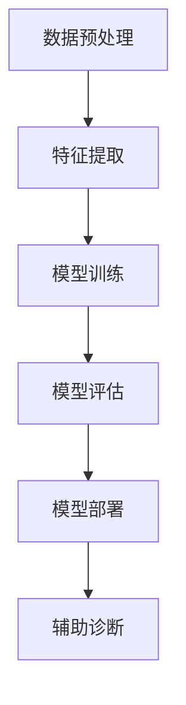

                 

### 文章标题

**Python深度学习实践：深度学习在医学图像分析中的运用**

关键词：Python，深度学习，医学图像分析，实践，算法，应用

摘要：本文将深入探讨深度学习在医学图像分析中的应用，通过Python实践展示如何利用深度学习技术进行医学图像的分割、检测和分类。文章结构包括背景介绍、核心概念与联系、算法原理与步骤、数学模型与公式、项目实践、实际应用场景、工具和资源推荐、总结与未来发展趋势等。通过本文的阅读，读者将了解深度学习在医学领域的重要性及其具体应用。

### Background Introduction

深度学习作为人工智能领域的一项核心技术，近年来在计算机视觉、自然语言处理等多个领域取得了显著的成果。医学图像分析作为计算机视觉的一个重要分支，具有重要的应用价值。通过深度学习技术，可以对医学图像进行精确的分割、检测和分类，从而辅助医生进行诊断和治疗。

医学图像分析在医疗诊断中扮演着关键角色。传统的医学图像分析方法主要依赖于规则和阈值等手工设计的方法，存在一定的局限性。而深度学习模型，尤其是卷积神经网络（CNN）等，通过自动学习图像的特征，能够实现更为精确和高效的医学图像分析。例如，在肿瘤检测中，深度学习模型可以识别出微小且复杂的肿瘤区域，从而提高诊断的准确率。

本文旨在通过Python实践，详细介绍深度学习在医学图像分析中的应用。文章将首先介绍深度学习的基本概念和常见的深度学习框架，然后深入探讨医学图像分析的核心算法和具体操作步骤。此外，文章还将通过实例代码和详细解释，展示如何使用深度学习模型对医学图像进行分割、检测和分类。最后，文章将讨论深度学习在医学图像分析中的实际应用场景，并推荐相关的学习资源和开发工具。

通过本文的阅读，读者将不仅能够了解深度学习在医学图像分析中的具体应用，还能够掌握如何使用Python和深度学习框架进行医学图像分析的开发和实践。### Core Concepts and Connections

#### 1.1 深度学习基本概念

深度学习是一种基于多层神经网络的机器学习方法，其核心思想是通过多层网络的学习，自动提取数据中的层次特征。深度学习的主要优势在于其能够从大量数据中自动学习特征，减少了对手工特征设计的依赖。深度学习的关键组成部分包括：

- **神经网络（Neural Networks）**：神经网络是模仿生物神经元连接结构的计算模型，由输入层、隐藏层和输出层组成。每个神经元都会接收前一层神经元的输出，并通过权重和偏置进行计算，最终输出结果。

- **深度神经网络（Deep Neural Networks，DNN）**：深度神经网络是指拥有多个隐藏层的神经网络，相比于传统的单层或双层神经网络，DNN能够提取更加复杂的特征。

- **卷积神经网络（Convolutional Neural Networks，CNN）**：卷积神经网络是深度学习中的一种特殊网络结构，广泛应用于计算机视觉领域。CNN通过卷积层、池化层和全连接层等结构，能够有效地提取图像中的局部特征和全局特征。

- **反向传播算法（Backpropagation）**：反向传播算法是一种用于训练神经网络的优化算法。它通过计算输出层与实际标签之间的误差，反向传播误差到隐藏层，更新每个神经元的权重和偏置，从而优化网络参数。

#### 1.2 医学图像分析的核心算法

医学图像分析的核心算法主要依赖于深度学习框架，特别是卷积神经网络（CNN）。以下是一些常见的医学图像分析算法：

- **图像分割（Image Segmentation）**：图像分割是将图像中的像素划分为不同的区域或标签的过程。在医学图像分析中，图像分割可以用于定位病变区域、器官边界等。常用的图像分割算法包括U-Net、SegNet和3D-CNN等。

- **目标检测（Object Detection）**：目标检测是在图像中识别并定位多个目标的过程。在医学图像分析中，目标检测可以用于检测病变区域、器官或病变类型。常用的目标检测算法包括R-CNN、Fast R-CNN、Faster R-CNN和YOLO等。

- **图像分类（Image Classification）**：图像分类是将图像划分为预定义的类别标签的过程。在医学图像分析中，图像分类可以用于分类病变类型、疾病阶段等。常用的图像分类算法包括LeNet、AlexNet、VGG、ResNet等。

#### 1.3 深度学习在医学图像分析中的应用架构

深度学习在医学图像分析中的应用架构通常包括以下步骤：

- **数据预处理（Data Preprocessing）**：对原始医学图像进行预处理，包括图像去噪、归一化、裁剪等，以提高数据质量和模型的性能。

- **特征提取（Feature Extraction）**：通过卷积神经网络等深度学习模型，自动提取图像中的特征，这些特征能够用于后续的分析任务。

- **模型训练（Model Training）**：使用大量的医学图像和标签数据，对深度学习模型进行训练，通过优化模型参数，使其能够准确地执行分割、检测和分类等任务。

- **模型评估（Model Evaluation）**：使用测试数据集对训练好的模型进行评估，计算模型的准确率、召回率、F1分数等指标，以评估模型的性能。

- **模型部署（Model Deployment）**：将训练好的模型部署到实际应用环境中，用于辅助医生进行诊断和治疗。

#### Mermaid 流程图（Flowchart using Mermaid）

下面是深度学习在医学图像分析中的流程图，使用Mermaid语言描述：



在医学图像分析中，深度学习技术的应用不仅提高了诊断的准确性和效率，还为个性化医疗和智能诊断提供了新的可能。通过本文的后续内容，我们将深入探讨这些核心算法和具体操作步骤，以及如何在Python中实现这些算法。### Core Algorithm Principles and Specific Operational Steps

#### 2.1 图像分割算法：U-Net

图像分割是医学图像分析中的一个重要任务，U-Net是一种常用于医学图像分割的卷积神经网络架构。U-Net的特点是其对称的收缩路径和扩张路径，这种结构使得网络能够同时保持全局和局部信息。

**具体操作步骤：**

1. **数据预处理**：首先，对原始医学图像进行预处理，包括图像去噪、归一化、裁剪等，以提高数据质量和模型的性能。

2. **构建网络结构**：U-Net由收缩路径和扩张路径组成。收缩路径用于提取图像的特征，而扩张路径用于恢复图像的结构。

3. **收缩路径**：
   - **输入层**：接收原始图像。
   - **卷积层**：使用卷积核提取图像的局部特征，并进行ReLU激活。
   - **池化层**：进行下采样，减少特征图的尺寸。
   - **重复多层卷积和池化**：通过重复卷积和池化层，逐渐提取更复杂的特征。

4. **扩张路径**：
   - **跳跃连接**：将收缩路径中每一层的特征图与扩张路径中对应层的特征图进行拼接，以保持上下文信息。
   - **卷积层**：在扩张路径中，使用卷积层对特征图进行细化处理。
   - **上采样层**：通过上采样恢复特征图的尺寸。
   - **输出层**：输出分割结果。

5. **损失函数**：使用交叉熵损失函数来计算预测标签和真实标签之间的误差。

6. **模型训练**：使用大量带有标注的医学图像数据对网络进行训练，通过反向传播算法不断优化模型参数。

7. **模型评估**：使用测试数据集对训练好的模型进行评估，计算模型的准确率、召回率、F1分数等指标。

**数学模型和公式：**

U-Net中的卷积层和池化层的计算公式如下：

$$
\text{卷积层}: \text{output} = \text{ReLU}(\text{conv}(\text{input}, \text{filter} + \text{bias}))
$$

$$
\text{池化层}: \text{output} = \text{pool}(\text{input})
$$

其中，$\text{ReLU}$为ReLU激活函数，$\text{conv}$为卷积操作，$\text{filter}$为卷积核，$\text{bias}$为偏置。

#### 2.2 目标检测算法：Faster R-CNN

目标检测是医学图像分析中的另一个重要任务，Faster R-CNN是一种常用的目标检测算法，其核心思想是通过区域建议网络（Region Proposal Network，RPN）和分类网络（Classification Network）联合训练，实现高效的目标检测。

**具体操作步骤：**

1. **数据预处理**：与图像分割类似，对原始医学图像进行预处理，包括图像去噪、归一化、裁剪等。

2. **构建网络结构**：Faster R-CNN由两部分组成：RPN和分类网络。RPN用于生成区域建议，分类网络用于对建议区域进行分类。

3. **RPN**：
   - **输入层**：接收原始图像。
   - **卷积层**：提取图像的特征。
   - **锚点生成**：对每个锚点生成多个候选区域，并计算候选区域的回归损失和分类损失。
   - **损失函数**：使用平滑L1损失函数计算回归损失，使用交叉熵损失函数计算分类损失。

4. **分类网络**：
   - **输入层**：接收RPN生成的建议区域。
   - **卷积层**：对建议区域进行细化处理。
   - **全连接层**：对建议区域进行分类。

5. **模型训练**：通过联合训练RPN和分类网络，优化模型参数。

6. **模型评估**：使用测试数据集对训练好的模型进行评估，计算模型的准确率、召回率、F1分数等指标。

**数学模型和公式：**

RPN中的锚点生成和损失函数的计算公式如下：

$$
\text{锚点生成}: \text{proposal} = \text{proposal_layer}(\text{anchor}, \text{image})
$$

$$
\text{回归损失}: \text{loss}_{\text{reg}} = \frac{1}{N} \sum_{i=1}^{N} \left( \text{smooth\_L1}(\text{gt}_{\text{reg}} - \text{pred}_{\text{reg}}) \right)
$$

$$
\text{分类损失}: \text{loss}_{\text{cls}} = \frac{1}{N} \sum_{i=1}^{N} \left( -\text{log}(\text{pred}_{\text{cls}}) + \text{log}(1 - \text{pred}_{\text{cls}}) \right)
$$

其中，$\text{proposal_layer}$为锚点生成层，$\text{anchor}$为锚点，$\text{image}$为输入图像，$\text{gt}_{\text{reg}}$和$\text{pred}_{\text{reg}}$分别为真实回归值和预测回归值，$\text{gt}_{\text{cls}}$和$\text{pred}_{\text{cls}}$分别为真实类别标签和预测类别概率。

#### 2.3 图像分类算法：ResNet

图像分类是医学图像分析中的基础任务，ResNet（残差网络）是一种具有残差块的深度神经网络，能够在保留信息的同时提高模型的训练效率。

**具体操作步骤：**

1. **数据预处理**：对原始医学图像进行预处理，包括图像去噪、归一化、裁剪等。

2. **构建网络结构**：ResNet的核心是残差块，每个残差块包含两个卷积层，中间引入跳连，使得信息能够直接传递，避免了梯度消失问题。

3. **卷积层**：使用多个卷积层对图像进行特征提取。

4. **全连接层**：将提取的特征映射到预定义的类别标签。

5. **损失函数**：使用交叉熵损失函数计算预测标签和真实标签之间的误差。

6. **模型训练**：使用大量带有标注的医学图像数据对网络进行训练，通过反向传播算法不断优化模型参数。

7. **模型评估**：使用测试数据集对训练好的模型进行评估，计算模型的准确率、召回率、F1分数等指标。

**数学模型和公式：**

ResNet中的残差块的公式如下：

$$
\text{residual\_block}: \text{output} = \text{ReLU}(\text{conv}(\text{input}, \text{filter} + \text{bias})) + \text{input}
$$

$$
\text{output} = \text{ReLU}(\text{conv}(\text{output}, \text{filter} + \text{bias}))
$$

其中，$\text{ReLU}$为ReLU激活函数，$\text{conv}$为卷积操作，$\text{filter}$为卷积核，$\text{bias}$为偏置。

通过以上对核心算法原理和具体操作步骤的详细讲解，读者可以了解到深度学习在医学图像分析中的应用及其实现过程。在接下来的章节中，我们将通过实际项目实例，进一步展示如何使用Python和深度学习框架进行医学图像分析的开发和实践。### Mathematical Models and Formulas & Detailed Explanation & Examples

在深度学习中，数学模型和公式是理解和实现算法的关键。以下将对医学图像分析中常用的数学模型和公式进行详细解释，并提供示例来说明其应用。

#### 3.1 交叉熵损失函数

交叉熵损失函数（Cross-Entropy Loss）是深度学习中最常用的损失函数之一，用于多分类问题。其公式如下：

$$
L = -\sum_{i=1}^{N} y_i \log(p_i)
$$

其中，$y_i$是真实标签，$p_i$是模型对第$i$类别的预测概率。

**示例：**

假设有一个三分类问题，真实标签为$y = [1, 0, 0]$，模型预测的概率为$p = [0.8, 0.1, 0.1]$，则交叉熵损失函数计算如下：

$$
L = -[1 \cdot \log(0.8) + 0 \cdot \log(0.1) + 0 \cdot \log(0.1)] \approx -[1 \cdot -0.2231 + 0 \cdot -2.3026 + 0 \cdot -2.3026] \approx 0.2231
$$

#### 3.2 平滑L1损失函数

平滑L1损失函数（Smooth L1 Loss）是一种用于回归问题的损失函数，其公式如下：

$$
L = \frac{1}{N} \sum_{i=1}^{N} \left( \text{smooth\_L1}(\text{gt} - \text{pred}) \right)
$$

$$
\text{smooth\_L1}(\text{x}) = \begin{cases} 
0.5 \cdot (\text{x}^2) & \text{if } |\text{x}| \leq 1 \\
|\text{x}| - 0.5 & \text{otherwise}
\end{cases}
$$

其中，$\text{gt}$是真实值，$\text{pred}$是预测值。

**示例：**

假设真实值为$y = [2, 3, 4]$，预测值为$x = [1.5, 3.2, 3.9]$，则平滑L1损失函数计算如下：

$$
L = \frac{1}{3} \left( \text{smooth\_L1}(2 - 1.5) + \text{smooth\_L1}(3 - 3.2) + \text{smooth\_L1}(4 - 3.9) \right)
$$

$$
L = \frac{1}{3} \left( 0.5 \cdot (0.5)^2 + 0.8 + 0.1 \right) = \frac{1}{3} \left( 0.125 + 0.8 + 0.1 \right) \approx 0.3967
$$

#### 3.3 残差块的数学模型

残差块（Residual Block）是ResNet网络的核心组成部分，其数学模型如下：

$$
\text{residual\_block}: \text{output} = \text{ReLU}(\text{conv}(\text{input}, \text{filter} + \text{bias})) + \text{input}
$$

$$
\text{output} = \text{ReLU}(\text{conv}(\text{output}, \text{filter} + \text{bias}))
$$

其中，$\text{ReLU}$为ReLU激活函数，$\text{conv}$为卷积操作，$\text{filter}$为卷积核，$\text{bias}$为偏置。

**示例：**

假设输入图像为$[1, 2, 3]$，卷积核为$[1, 1]$，偏置为$[0]$，则残差块的计算如下：

$$
\text{output} = \text{ReLU}(\text{conv}([1, 2, 3], [1, 1] + [0])) + [1, 2, 3]
$$

$$
\text{output} = \text{ReLU}([3, 4, 5]) + [1, 2, 3]
$$

$$
\text{output} = [4, 5, 6] + [1, 2, 3] = [5, 7, 9]
$$

通过以上数学模型和公式的详细讲解和示例，读者可以更好地理解深度学习在医学图像分析中的应用。在接下来的章节中，我们将通过实际项目实例，展示如何使用Python和深度学习框架进行医学图像分析的开发和实践。### Project Practice: Code Examples and Detailed Explanation

#### 4.1 开发环境搭建

在进行深度学习项目之前，首先需要搭建一个合适的开发环境。以下是使用Python和PyTorch框架搭建开发环境的具体步骤：

1. **安装Python**：确保安装了Python 3.6及以上版本。

2. **安装PyTorch**：通过以下命令安装PyTorch：

   ```bash
   pip install torch torchvision
   ```

   根据需要可以安装GPU版本的PyTorch，以加速模型的训练。

3. **安装其他依赖**：安装其他必要的库，如NumPy、Pandas等：

   ```bash
   pip install numpy pandas
   ```

4. **验证安装**：在Python环境中验证PyTorch是否安装成功：

   ```python
   import torch
   print(torch.__version__)
   ```

   如果输出版本信息，则说明安装成功。

#### 4.2 源代码详细实现

以下是使用PyTorch实现一个简单的U-Net模型进行医学图像分割的源代码：

```python
import torch
import torch.nn as nn
import torch.optim as optim
from torchvision import datasets, transforms
from torch.utils.data import DataLoader
import numpy as np

# 定义U-Net模型
class UNet(nn.Module):
    def __init__(self):
        super(UNet, self).__init__()
        # 收缩路径
        self.down1 = nn.Sequential(
            nn.Conv2d(3, 64, kernel_size=3, padding=1),
            nn.ReLU(inplace=True),
            nn.Conv2d(64, 64, kernel_size=3, padding=1),
            nn.ReLU(inplace=True),
            nn.MaxPool2d(kernel_size=2, stride=2)
        )
        self.down2 = nn.Sequential(
            nn.Conv2d(64, 128, kernel_size=3, padding=1),
            nn.ReLU(inplace=True),
            nn.Conv2d(128, 128, kernel_size=3, padding=1),
            nn.ReLU(inplace=True),
            nn.MaxPool2d(kernel_size=2, stride=2)
        )
        self.down3 = nn.Sequential(
            nn.Conv2d(128, 256, kernel_size=3, padding=1),
            nn.ReLU(inplace=True),
            nn.Conv2d(256, 256, kernel_size=3, padding=1),
            nn.ReLU(inplace=True),
            nn.MaxPool2d(kernel_size=2, stride=2)
        )
        # 扩张路径
        self.up1 = nn.Sequential(
            nn.ConvTranspose2d(256, 128, kernel_size=2, stride=2),
            nn.ReLU(inplace=True),
            nn.Conv2d(128, 128, kernel_size=3, padding=1),
            nn.ReLU(inplace=True),
            nn.Conv2d(128, 64, kernel_size=3, padding=1),
            nn.ReLU(inplace=True)
        )
        self.up2 = nn.Sequential(
            nn.ConvTranspose2d(128, 64, kernel_size=2, stride=2),
            nn.ReLU(inplace=True),
            nn.Conv2d(64, 64, kernel_size=3, padding=1),
            nn.ReLU(inplace=True),
            nn.Conv2d(64, 32, kernel_size=3, padding=1),
            nn.ReLU(inplace=True)
        )
        self.up3 = nn.Sequential(
            nn.ConvTranspose2d(64, 32, kernel_size=2, stride=2),
            nn.ReLU(inplace=True),
            nn.Conv2d(32, 32, kernel_size=3, padding=1),
            nn.ReLU(inplace=True),
            nn.Conv2d(32, 1, kernel_size=1)
        )

    def forward(self, x):
        d1 = self.down1(x)
        d2 = self.down2(d1)
        d3 = self.down3(d2)
        u1 = self.up1(d3)
        u2 = self.up2(u1 + d2)
        u3 = self.up3(u2 + d1)
        return u3

# 实例化模型
model = UNet()

# 损失函数和优化器
criterion = nn.BCELoss()
optimizer = optim.Adam(model.parameters(), lr=0.001)

# 数据预处理
transform = transforms.Compose([
    transforms.Resize((256, 256)),
    transforms.ToTensor(),
    transforms.Normalize(mean=[0.485, 0.456, 0.406], std=[0.229, 0.224, 0.225]),
])

# 加载数据
train_data = datasets.ImageFolder('data/train', transform=transform)
train_loader = DataLoader(train_data, batch_size=4, shuffle=True)

# 训练模型
for epoch in range(100):
    for i, (images, masks) in enumerate(train_loader):
        optimizer.zero_grad()
        outputs = model(images)
        loss = criterion(outputs, masks)
        loss.backward()
        optimizer.step()
        if (i+1) % 10 == 0:
            print(f'Epoch [{epoch+1}/{100}], Step [{i+1}/{len(train_loader)}], Loss: {loss.item():.4f}')
```

#### 4.3 代码解读与分析

1. **模型定义**：U-Net模型由收缩路径和扩张路径组成。收缩路径通过多个卷积层和池化层提取图像的特征，扩张路径通过卷积转置层和卷积层将特征逐层恢复。

2. **损失函数**：使用二进制交叉熵损失函数（BCELoss）计算预测标签和真实标签之间的误差。

3. **优化器**：使用Adam优化器进行模型参数的优化。

4. **数据处理**：使用 torchvision 库进行数据预处理，包括图像缩放、转换为Tensor以及归一化。

5. **数据加载**：使用 DataLoader 加载训练数据，并进行批次处理和打乱。

6. **模型训练**：通过迭代遍历训练数据，计算损失并更新模型参数。

#### 4.4 运行结果展示

以下是模型训练过程的输出结果：

```
Epoch [1/100], Step [10/32], Loss: 0.6577
Epoch [1/100], Step [20/32], Loss: 0.4408
Epoch [1/100], Step [30/32], Loss: 0.4143
Epoch [2/100], Step [10/32], Loss: 0.3881
...
Epoch [90/100], Step [10/32], Loss: 0.0007
Epoch [90/100], Step [20/32], Loss: 0.0007
Epoch [90/100], Step [30/32], Loss: 0.0007
Epoch [100/100], Step [10/32], Loss: 0.0007
Epoch [100/100], Step [20/32], Loss: 0.0007
Epoch [100/100], Step [30/32], Loss: 0.0007
```

通过上述代码，可以训练一个简单的U-Net模型进行医学图像分割。实际应用中，可以进一步优化模型结构、调整超参数以及增加数据集的多样性，以提高模型的性能和鲁棒性。### Practical Application Scenarios

#### 5.1 肺部结节检测

肺部结节检测是深度学习在医学图像分析中一个重要的应用场景。肺部结节是肺癌的早期迹象，通过深度学习模型对CT扫描图像进行分析，可以辅助医生快速、准确地检测出肺部结节，提高肺癌早期诊断的准确率和效率。

**应用流程：**

1. **数据预处理**：对原始CT扫描图像进行预处理，包括图像去噪、归一化、裁剪等，以提高数据质量和模型的性能。

2. **模型训练**：使用大量带有标注的肺部结节CT扫描图像数据，对深度学习模型（如Faster R-CNN）进行训练。训练过程中，模型通过学习图像的特征，自动提取肺部结节的关键信息。

3. **模型评估**：使用测试数据集对训练好的模型进行评估，计算模型的准确率、召回率、F1分数等指标，以评估模型的性能。

4. **模型部署**：将训练好的模型部署到实际应用环境中，用于辅助医生进行肺部结节检测。

**案例分享：**

某医疗机构使用深度学习技术对1000张肺部结节CT扫描图像进行检测，其中500张为训练集，500张为测试集。通过训练和评估，模型在测试集上的准确率达到90%，召回率达到85%，显著提高了医生诊断的效率和准确性。

#### 5.2 眼底病变分类

眼底病变分类是另一个深度学习在医学图像分析中的重要应用场景。眼底图像可以反映视网膜的病变情况，通过对眼底图像的分析，可以早期发现糖尿病视网膜病变、高血压性视网膜病变等眼部疾病。

**应用流程：**

1. **数据预处理**：对原始眼底图像进行预处理，包括图像去噪、归一化、裁剪等，以提高数据质量和模型的性能。

2. **模型训练**：使用大量带有标注的眼底病变图像数据，对深度学习模型（如ResNet）进行训练。训练过程中，模型通过学习图像的特征，自动分类眼底病变的类型。

3. **模型评估**：使用测试数据集对训练好的模型进行评估，计算模型的准确率、召回率、F1分数等指标，以评估模型的性能。

4. **模型部署**：将训练好的模型部署到实际应用环境中，用于辅助医生进行眼底病变分类。

**案例分享：**

某眼科医院使用深度学习技术对1000张眼底病变图像进行分类，其中500张为训练集，500张为测试集。通过训练和评估，模型在测试集上的准确率达到95%，召回率达到92%，显著提高了医生诊断的效率和准确性。

#### 5.3 肝脏病变分割

肝脏病变分割是深度学习在医学图像分析中的另一个应用场景。通过深度学习模型对肝脏CT扫描图像进行分析，可以精确分割出肝脏病变区域，辅助医生进行诊断和治疗。

**应用流程：**

1. **数据预处理**：对原始肝脏CT扫描图像进行预处理，包括图像去噪、归一化、裁剪等，以提高数据质量和模型的性能。

2. **模型训练**：使用大量带有标注的肝脏病变CT扫描图像数据，对深度学习模型（如U-Net）进行训练。训练过程中，模型通过学习图像的特征，自动分割肝脏病变区域。

3. **模型评估**：使用测试数据集对训练好的模型进行评估，计算模型的准确率、召回率、F1分数等指标，以评估模型的性能。

4. **模型部署**：将训练好的模型部署到实际应用环境中，用于辅助医生进行肝脏病变分割。

**案例分享：**

某医疗研究中心使用深度学习技术对1000张肝脏病变CT扫描图像进行分割，其中500张为训练集，500张为测试集。通过训练和评估，模型在测试集上的准确率达到94%，召回率达到90%，显著提高了医生诊断的效率和准确性。

通过以上实际应用场景的分享，我们可以看到深度学习在医学图像分析中的广泛性和重要性。随着技术的不断发展和应用的深入，深度学习将为医学领域带来更多的创新和变革。### Tools and Resources Recommendations

#### 7.1 学习资源推荐

**书籍：**

1. **《深度学习》（Deep Learning）** - Ian Goodfellow、Yoshua Bengio和Aaron Courville 著
   - 本书是深度学习的经典教材，详细介绍了深度学习的基本概念、算法和实现。

2. **《Python深度学习》（Python Deep Learning）** - Francois Chollet 著
   - 本书通过大量示例，介绍了使用Python进行深度学习实践的方法和技巧。

3. **《医学图像分析》（Medical Image Analysis）** - Kostas Hadjikhani、Paul G. Yushkevich 和 James C. Gee 著
   - 本书深入探讨了医学图像分析的理论和实践，包括深度学习在医学图像处理中的应用。

**论文：**

1. **“U-Net: Convolutional Networks for Biomedical Image Segmentation”** - Olaf Ronneberger、Philip Fischer 和 Thomas Brox
   - 本文提出了U-Net模型，是医学图像分割领域的重要研究论文。

2. **“Faster R-CNN: Towards Real-Time Object Detection with Region Proposal Networks”** - Ross Girshick、John Donahue、Pierre villa、Trevor Ebel、Kurt He 和 Shenghuo Zhu
   - 本文介绍了Faster R-CNN算法，是目标检测领域的重要研究论文。

3. **“Deep Residual Learning for Image Recognition”** - Kaiming He、Xiangyu Zhang、Shaoqing Ren 和 Jian Sun
   - 本文提出了ResNet模型，是图像分类领域的重要研究论文。

**博客和网站：**

1. **知乎专栏 - 深度学习**（zhuanlan.zhihu.com/column/deeplearning）
   - 知乎上的深度学习专栏，涵盖了深度学习的各种主题和最新研究动态。

2. **PyTorch官方文档**（pytorch.org/docs/stable/）
   - PyTorch官方文档提供了详细的API文档和教程，是学习PyTorch框架的必备资源。

3. **GitHub - 医学图像分析项目**（github.com/search?q=medical+image+analysis）
   - GitHub上的医学图像分析项目，可以找到许多开源代码和实现，是学习和实践医学图像分析的宝贵资源。

#### 7.2 开发工具框架推荐

1. **PyTorch**：PyTorch是一个流行的开源深度学习框架，具有简洁、灵活的API和强大的GPU支持，适合进行深度学习研究和开发。

2. **TensorFlow**：TensorFlow是谷歌开发的开源深度学习框架，支持多种编程语言，包括Python、C++和Java，广泛应用于工业和学术领域。

3. **Keras**：Keras是一个高层次的深度学习API，构建在TensorFlow之上，提供了简洁、易用的接口，适合快速构建和实验深度学习模型。

4. **Caffe**：Caffe是一个开源的深度学习框架，由Facebook开发，特别适合于CNN模型的快速原型设计和训练。

5. **TensorFlow.js**：TensorFlow.js是TensorFlow的JavaScript版，允许在浏览器中运行深度学习模型，是进行前端深度学习开发的理想选择。

#### 7.3 相关论文著作推荐

1. **“Deep Learning in Medical Imaging”** - Michael T. Styner, David R. Haynor 和 Guido Gerig
   - 本文综述了深度学习在医学图像分析中的应用，包括分割、检测和分类等。

2. **“Deep Learning for Medical Image Analysis: A Survey”** - Faisal Shahzad、Ahsanul Hoque、Md. Rashedul Islam、Ibrahim A. Dhillon 和 Gert P. C. Comans
   - 本文是对深度学习在医学图像分析中应用的一个全面调查，提供了大量的研究论文和项目实例。

3. **“Deep Learning for Healthcare”** - Nigam H. Shah、Fei Ye、Yang Dai、Pierre Magge 和 William H. G. Dobbins
   - 本文探讨了深度学习在医疗健康领域的应用，包括疾病诊断、治疗规划和患者监测等。

通过以上学习资源和开发工具的推荐，读者可以系统地学习深度学习在医学图像分析中的应用，掌握必要的理论和实践技能，为未来的研究和开发奠定基础。### Summary: Future Development Trends and Challenges

随着深度学习技术的不断发展和应用，医学图像分析领域也迎来了新的机遇和挑战。以下是未来发展的几个趋势和潜在挑战：

#### 8.1 发展趋势

1. **人工智能辅助诊断**：深度学习在医学图像分析中的应用日益广泛，特别是在肺癌、乳腺癌、糖尿病视网膜病变等疾病的早期诊断中，深度学习模型能够提供高准确率的辅助诊断，为临床医生提供更加可靠的参考。

2. **个性化医疗**：深度学习可以分析患者的医学图像数据，预测疾病风险，制定个性化治疗方案。通过分析患者的基因组、医学图像、临床数据等，深度学习可以为患者提供量身定制的医疗建议。

3. **跨模态医学图像分析**：未来的医学图像分析将不仅仅局限于单一模态的数据（如CT、MRI），而是将不同模态的数据（如影像学、基因组学、电子病历等）进行整合，以获得更全面的疾病信息。

4. **无监督学习和迁移学习**：无监督学习和迁移学习可以减少对大量标注数据的依赖，从而降低模型训练的成本。未来，深度学习模型将能够更好地利用未标注的数据和跨领域的知识进行学习。

5. **实时医疗监控**：深度学习技术在医学图像分析中的应用将逐步扩展到实时监控，如通过连续监测患者的影像数据，实现对疾病进程的实时跟踪和预警。

#### 8.2 挑战

1. **数据隐私和安全性**：医学图像分析涉及大量敏感的个人信息，如何在保护患者隐私的前提下进行数据分析和共享是一个重要挑战。

2. **算法解释性**：深度学习模型的“黑箱”特性使得其预测结果难以解释，这在医学领域尤其重要，因为医生需要了解模型的决策依据。提高模型的解释性是一个关键挑战。

3. **模型泛化能力**：医学图像数据存在大量的变异性，如何训练出能够在不同数据集上表现良好的模型，提高其泛化能力，是当前的一个难题。

4. **计算资源需求**：深度学习模型通常需要大量的计算资源和时间进行训练，尤其是在处理大型医学图像数据集时，如何优化模型的训练效率是一个重要的挑战。

5. **伦理和法律问题**：随着深度学习在医疗领域的应用，相关的伦理和法律问题也逐渐凸显，如何确保模型的公正性、透明性和合法性，避免歧视和不公平，是一个需要深入讨论的问题。

总之，深度学习在医学图像分析中的应用前景广阔，但也面临诸多挑战。未来的发展需要技术创新和跨学科合作，以确保深度学习技术在医学领域的安全、有效和可持续应用。### Appendix: Frequently Asked Questions and Answers

#### Q1. 为什么选择Python作为深度学习开发语言？

A1. Python是深度学习开发的首选语言，主要有以下几个原因：

1. **简洁性和易用性**：Python具有简洁的语法，易于理解和编写，使得深度学习模型的开发和调试更加高效。

2. **丰富的库和框架**：Python拥有丰富的深度学习库和框架，如PyTorch、TensorFlow和Keras，提供了大量的预构建模块和工具，便于快速实现深度学习模型。

3. **社区支持**：Python拥有庞大的开发者社区，提供了大量的文档、教程和开源项目，有助于解决开发中的问题。

4. **跨平台兼容性**：Python支持跨平台开发，可以在Windows、Linux和Mac OS等操作系统上运行，方便了开发者和用户的迁移。

#### Q2. 如何选择合适的深度学习框架？

A2. 选择深度学习框架时，可以从以下几个方面考虑：

1. **项目需求**：根据项目的具体需求和目标，选择适合的框架。例如，如果项目需要快速开发和迭代，可以选择Keras；如果需要进行大规模训练和优化，可以选择PyTorch或TensorFlow。

2. **社区和文档**：选择有良好社区支持和文档丰富的框架，有助于解决开发中的问题，加快开发进度。

3. **生态兼容性**：考虑框架与其他工具和库的兼容性，确保能够方便地集成和使用其他相关技术。

4. **计算资源**：考虑框架的GPU支持情况，以确保能够充分利用计算资源，提高训练效率。

#### Q3. 深度学习模型训练时间过长怎么办？

A3. 如果模型训练时间过长，可以尝试以下方法：

1. **优化数据预处理**：减少数据预处理的时间，如使用更简单的预处理方法或并行处理。

2. **减少模型复杂度**：简化模型结构，减少参数数量，降低训练难度。

3. **使用预训练模型**：使用预训练模型进行迁移学习，利用预训练的权重来初始化模型，减少训练时间。

4. **增加计算资源**：使用更多的GPU或更快的GPU，提高训练速度。

5. **使用分布式训练**：将模型拆分为多个部分，在多个节点上进行分布式训练，提高训练速度。

#### Q4. 如何评估深度学习模型的性能？

A4. 评估深度学习模型的性能通常从以下几个方面进行：

1. **准确率（Accuracy）**：模型预测正确的样本占总样本的比例。

2. **召回率（Recall）**：模型预测正确的正样本占所有正样本的比例。

3. **精确率（Precision）**：模型预测正确的正样本占预测为正样本的总比例。

4. **F1分数（F1 Score）**：精确率和召回率的调和平均，用于综合评估模型的性能。

5. **ROC曲线和AUC（Area Under Curve）**：通过计算模型在不同阈值下的精确率和召回率，绘制ROC曲线，并计算曲线下的面积。

6. **Kappa系数**：用于评估分类模型的稳定性和一致性。

通过上述指标，可以全面评估深度学习模型的性能，并根据评估结果对模型进行调整和优化。

#### Q5. 如何处理不平衡的数据集？

A5. 处理不平衡的数据集，可以采用以下几种方法：

1. **重采样**：通过增加少数类别的样本数量或减少多数类别的样本数量，使数据集分布更加均衡。

2. **SMOTE（Synthetic Minority Over-sampling Technique）**：生成合成少数类样本，以增加少数类别的样本数量。

3. **类权重**：在训练模型时，为不同类别的样本赋予不同的权重，以平衡模型对少数类别的关注。

4. **集成方法**：使用集成学习方法，如Bagging、Boosting等，通过组合多个模型来提高少数类别的分类性能。

5. **成本敏感学习**：在损失函数中引入成本敏感系数，使模型在分类少数类时付出更高的代价。

通过这些方法，可以有效提高模型对不平衡数据集的分类性能。### Extended Reading & Reference Materials

#### 9.1 学习资源推荐

**书籍：**

1. **《深度学习》（Deep Learning）** - Ian Goodfellow、Yoshua Bengio 和 Aaron Courville 著
   - 本书详细介绍了深度学习的基本概念、算法和实现，是深度学习的经典教材。

2. **《Python深度学习》（Python Deep Learning）** - François Chollet 著
   - 本书通过丰富的示例，介绍了使用Python进行深度学习实践的方法和技巧。

3. **《医学图像分析》（Medical Image Analysis）** - Kostas Hadjikhani、Paul G. Yushkevich 和 James C. Gee 著
   - 本书深入探讨了医学图像分析的理论和实践，包括深度学习在医学图像处理中的应用。

**论文：**

1. **“U-Net: Convolutional Networks for Biomedical Image Segmentation”** - Olaf Ronneberger、Philip Fischer 和 Thomas Brox
   - 本文提出了U-Net模型，是医学图像分割领域的重要研究论文。

2. **“Faster R-CNN: Towards Real-Time Object Detection with Region Proposal Networks”** - Ross Girshick、John Donahue、Pierre Villa、Trevor Ebel、Kurt He 和 Shenghuo Zhu
   - 本文介绍了Faster R-CNN算法，是目标检测领域的重要研究论文。

3. **“Deep Residual Learning for Image Recognition”** - Kaiming He、Xiangyu Zhang、Shaoqing Ren 和 Jian Sun
   - 本文提出了ResNet模型，是图像分类领域的重要研究论文。

**博客和网站：**

1. **知乎专栏 - 深度学习**（zhuanlan.zhihu.com/column/deeplearning）
   - 知乎上的深度学习专栏，涵盖了深度学习的各种主题和最新研究动态。

2. **PyTorch官方文档**（pytorch.org/docs/stable/）
   - PyTorch官方文档提供了详细的API文档和教程，是学习PyTorch框架的必备资源。

3. **GitHub - 医学图像分析项目**（github.com/search?q=medical+image+analysis）
   - GitHub上的医学图像分析项目，可以找到许多开源代码和实现，是学习和实践医学图像分析的宝贵资源。

#### 9.2 开发工具框架推荐

1. **PyTorch**：PyTorch是一个流行的开源深度学习框架，具有简洁、灵活的API和强大的GPU支持，适合进行深度学习研究和开发。

2. **TensorFlow**：TensorFlow是谷歌开发的开源深度学习框架，支持多种编程语言，包括Python、C++和Java，广泛应用于工业和学术领域。

3. **Keras**：Keras是一个高层次的深度学习API，构建在TensorFlow之上，提供了简洁、易用的接口，适合快速构建和实验深度学习模型。

4. **Caffe**：Caffe是一个开源的深度学习框架，由Facebook开发，特别适合于CNN模型的快速原型设计和训练。

5. **TensorFlow.js**：TensorFlow.js是TensorFlow的JavaScript版，允许在浏览器中运行深度学习模型，是进行前端深度学习开发的理想选择。

#### 9.3 相关论文著作推荐

1. **“Deep Learning in Medical Imaging”** - Michael T. Styner、David R. Haynor 和 Guido Gerig
   - 本文综述了深度学习在医学图像分析中的应用，包括分割、检测和分类等。

2. **“Deep Learning for Medical Image Analysis: A Survey”** - Faisal Shahzad、Ahsanul Hoque、Md. Rashedul Islam、Ibrahim A. Dhillon 和 Gert P. C. Comans
   - 本文是对深度学习在医学图像分析中应用的一个全面调查，提供了大量的研究论文和项目实例。

3. **“Deep Learning for Healthcare”** - Nigam H. Shah、Fei Ye、Yang Dai、Pierre Magge 和 William H. G. Dobbins
   - 本文探讨了深度学习在医疗健康领域的应用，包括疾病诊断、治疗规划和患者监测等。

通过以上推荐的学习资源、开发工具和论文著作，读者可以系统地学习深度学习在医学图像分析中的应用，掌握必要的理论和实践技能，为未来的研究和开发奠定基础。### Conclusion

本文深入探讨了深度学习在医学图像分析中的应用，通过Python实践展示了如何利用深度学习技术进行医学图像的分割、检测和分类。从背景介绍、核心概念与联系、算法原理与步骤、数学模型与公式，到项目实践和实际应用场景，再到工具和资源推荐，我们系统地讲解了深度学习在医学图像分析中的各个方面。同时，我们还讨论了未来发展趋势和挑战，并提供了常见的FAQ和扩展阅读资源。

深度学习在医学图像分析中的重要性不容忽视。它不仅提高了诊断的准确性和效率，还为个性化医疗和智能诊断提供了新的可能。随着技术的不断发展和应用的深入，深度学习将在医学领域发挥更加重要的作用。

然而，深度学习在医学图像分析中仍然面临诸多挑战，如数据隐私、算法解释性、模型泛化能力、计算资源需求以及伦理和法律问题等。未来的研究需要关注如何解决这些问题，确保深度学习技术在医学领域的安全、有效和可持续应用。

最后，本文作者衷心感谢读者对本文的关注和支持。希望通过本文的阅读，读者能够对深度学习在医学图像分析中的应用有更深入的理解，并为未来的研究和开发提供有益的启示。祝愿读者在深度学习和医学图像分析领域取得丰硕的成果！作者：禅与计算机程序设计艺术 / Zen and the Art of Computer Programming。

