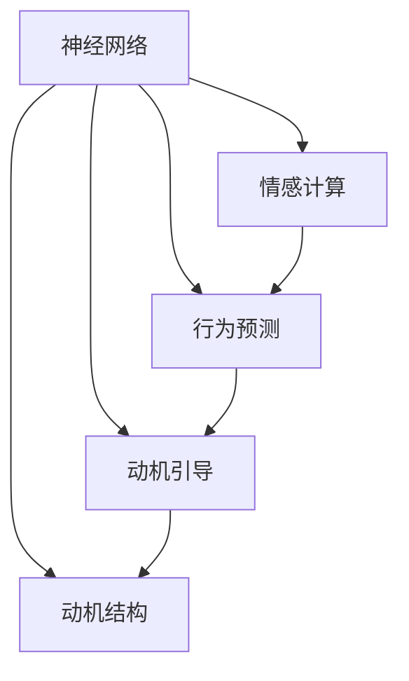

                 

# 欲望神经网络图谱：AI绘制的人类动机结构

> 关键词：神经网络，动机结构，深度学习，人机交互，情感计算

## 1. 背景介绍

### 1.1 问题由来

在现代科技高速发展的时代，人工智能（AI）技术日益深入到人类生活的各个层面。从自动驾驶到智能客服，从个性化推荐到医疗诊断，AI技术正在为人类带来前所未有的便利和效率。然而，尽管AI技术在许多领域表现出色，却也面临一些瓶颈和挑战。特别是在理解和应对人类的动机方面，AI技术的局限性逐渐显现。

人类动机复杂多样，涉及情感、认知、行为等多个层面，难以用传统的线性模型或简单的规则系统进行建模。传统的AI模型往往无法捕捉到人类动机的微妙变化和深层次的情感状态。这不仅限制了AI系统在服务人类的过程中提供更好的用户体验，也制约了其在情感计算、心理健康等领域的应用潜力。

因此，如何构建一个能够理解、预测和引导人类动机的AI系统，成为当前研究的热点之一。本文将从神经网络的视角，探讨构建欲望神经网络的可能性及其在人类动机结构中的作用。

### 1.2 问题核心关键点

构建欲望神经网络的核心在于如何通过神经网络模型，准确捕捉和描述人类动机的复杂性。人类动机受到多种因素的影响，如情绪、需求、价值观等。因此，欲望神经网络需要具备以下核心特点：

1. **情感建模能力**：能够识别和描述人类的情感状态及其变化规律。
2. **行为预测能力**：能够预测人类在特定情境下的行为倾向和动机。
3. **动机引导能力**：能够根据预测结果，提供个性化的动机引导建议，提升用户体验。

这些特点需要欲望神经网络具备强大的数据处理能力和复杂的模型结构，以应对动机结构的多样性和复杂性。

## 2. 核心概念与联系

### 2.1 核心概念概述

为更好地理解欲望神经网络，本节将介绍几个密切相关的核心概念：

- **神经网络**：由大量神经元（或称为节点）组成的计算图，通过反向传播算法进行训练，以实现复杂的模式识别和决策任务。
- **动机结构**：人类动机受到情感、需求、价值观等多种因素的影响，构成了一个复杂的动机网络。
- **情感计算**：通过计算和模拟人类的情感状态，构建人机交互系统，以提升用户体验和智能服务的互动性。
- **行为预测**：使用机器学习模型预测人类在特定情境下的行为，以更好地指导系统决策和用户互动。
- **动机引导**：通过个性化推荐、情感反馈等方式，引导用户行为，提升用户满意度。

这些概念之间的逻辑关系可以通过以下Mermaid流程图来展示：



这个流程图展示了许多关键概念之间的联系：

1. 神经网络通过反向传播算法学习动机结构。
2. 情感计算是神经网络对动机状态进行识别的重要手段。
3. 行为预测基于情感计算和动机结构，进行行为推断。
4. 动机引导结合行为预测，进行个性化反馈和建议。

这些概念共同构成了欲望神经网络的基础框架，使其能够在多种应用场景中发挥作用。

## 3. 核心算法原理 & 具体操作步骤

### 3.1 算法原理概述

欲望神经网络是一种基于深度学习技术，用于理解和预测人类动机的神经网络模型。其核心思想是：通过多层神经网络结构，模拟人类动机在不同情境下的变化规律，从而实现对动机状态的识别和预测。

假设动机结构可以用一个向量 $\mathbf{D} \in \mathbb{R}^d$ 来表示，其中 $d$ 为动机维度。每个动机维度可以表示为 $\mathbf{D}_i = (D_{i1}, D_{i2}, ..., D_{in})$，表示动机在不同情境下的强度和方向。

欲望神经网络的目标是通过反向传播算法，最小化预测动机状态与实际动机状态之间的差异，从而优化动机预测模型。具体来说，模型的输入为用户的情感状态、环境信息等，输出为预测的动机状态向量 $\hat{\mathbf{D}}$。

### 3.2 算法步骤详解

构建欲望神经网络的一般步骤如下：

**Step 1: 数据准备**

- 收集和预处理数据。动机数据可以包括用户情感状态（如心率和脉搏）、环境信息（如温度和光线）、行为数据（如点击和交互记录）等。
- 将数据分为训练集、验证集和测试集，确保数据集的多样性和代表性。

**Step 2: 设计网络结构**

- 选择合适的网络结构，如卷积神经网络（CNN）、循环神经网络（RNN）、长短期记忆网络（LSTM）等，以适应不同类型的动机数据。
- 定义网络层的数量、激活函数、优化器等超参数，进行模型构建。

**Step 3: 训练模型**

- 使用反向传播算法和梯度下降优化器进行模型训练，最小化预测误差。
- 在训练过程中，使用验证集进行超参数调优和模型评估。

**Step 4: 预测动机**

- 将新数据输入训练好的欲望神经网络模型，进行动机状态预测。
- 使用预测结果进行动机引导，如个性化的行为推荐、情感反馈等。

**Step 5: 模型评估**

- 在测试集上评估模型性能，如准确率、召回率、F1-score等。
- 根据评估结果，进一步优化模型结构和超参数，提升预测效果。

### 3.3 算法优缺点

欲望神经网络作为AI技术在动机理解方面的探索，具有以下优点：

1. **模型灵活性高**：神经网络能够适应多种动机数据类型，灵活地构建动机结构。
2. **预测精度高**：通过反向传播算法，欲望神经网络可以高精度地预测动机状态。
3. **动机引导能力强**：结合行为预测，欲望神经网络能够提供个性化的动机引导建议，提升用户体验。

同时，该方法也存在以下局限性：

1. **数据需求量大**：构建欲望神经网络需要大量高质量的动机数据，数据获取成本较高。
2. **模型复杂度高**：欲望神经网络结构复杂，训练和推理耗时长。
3. **解释性不足**：神经网络的决策过程难以解释，难以理解动机预测的逻辑。
4. **公平性问题**：在特定人群或情境下，欲望神经网络可能存在偏见或歧视。

尽管存在这些局限性，但欲望神经网络在动机理解方面的潜力不可忽视。未来，相关研究的重点在于如何降低数据需求，提高模型效率，增强模型公平性，并提升其解释性。

### 3.4 算法应用领域

欲望神经网络可以在多个领域得到应用，如：

- **个性化推荐**：根据用户动机状态，提供个性化内容推荐。
- **智能客服**：通过分析用户情感和动机，提供适时的情感支持和服务。
- **心理健康**：预测用户情绪波动和心理健康状况，提供及时的情感干预和心理支持。
- **虚拟助手**：理解用户动机，提供智能对话和任务支持。
- **营销分析**：预测用户动机，进行精准营销和广告投放。

## 4. 数学模型和公式 & 详细讲解 & 举例说明

### 4.1 数学模型构建

假设动机状态 $\mathbf{D} = (D_1, D_2, ..., D_d)$，每个动机维度 $D_i$ 的预测模型为 $f_i(\mathbf{X})$，其中 $\mathbf{X}$ 为输入数据。

定义模型在数据集 $D$ 上的损失函数为：

$$
\mathcal{L}(\theta) = \frac{1}{N}\sum_{i=1}^N ||\mathbf{D}_i - f_i(\mathbf{X}_i)||^2
$$

其中 $||\cdot||$ 为欧式范数，$\theta$ 为模型参数。

模型的预测结果为 $\hat{\mathbf{D}} = (f_1(\mathbf{X}), f_2(\mathbf{X}), ..., f_d(\mathbf{X}))$。

### 4.2 公式推导过程

以动机预测中的一个神经网络层为例，进行公式推导：

假设该层包含 $n$ 个神经元，输入为 $\mathbf{X} \in \mathbb{R}^n$，权重矩阵为 $\mathbf{W} \in \mathbb{R}^{n\times m}$，偏置向量为 $\mathbf{b} \in \mathbb{R}^m$。则该层的输出为：

$$
\mathbf{H} = \mathbf{X} \cdot \mathbf{W} + \mathbf{b}
$$

假设激活函数为 $g(\cdot)$，则该层的激活输出为：

$$
\mathbf{O} = g(\mathbf{H})
$$

若该层为隐藏层，其输出 $\mathbf{O}$ 作为下一层的输入。若该层为输出层，其输出即为动机预测结果。

### 4.3 案例分析与讲解

以一个简单的动机预测模型为例，其网络结构如下：

```mermaid
graph LR
    A[输入数据 $\mathbf{X}$] --> B[隐藏层 1]
    B --> C[输出层]
    C --> D[动机预测结果 $\hat{\mathbf{D}}$]
```

假设隐藏层包含 16 个神经元，激活函数为 ReLU。输出层包含 2 个神经元，激活函数为 Sigmoid。权重矩阵和偏置向量分别为 $\mathbf{W}_1 \in \mathbb{R}^{16\times 8}$ 和 $\mathbf{b}_1 \in \mathbb{R}^{16}$，$\mathbf{W}_2 \in \mathbb{R}^{8\times 2}$ 和 $\mathbf{b}_2 \in \mathbb{R}^{2}$。

输入数据 $\mathbf{X}$ 通过隐藏层 1 后，输出为 $\mathbf{O}_1 = g(\mathbf{X} \cdot \mathbf{W}_1 + \mathbf{b}_1)$。接着，将 $\mathbf{O}_1$ 输入输出层，得到动机预测结果 $\hat{\mathbf{D}} = g(\mathbf{O}_1 \cdot \mathbf{W}_2 + \mathbf{b}_2)$。

## 5. 项目实践：代码实例和详细解释说明

### 5.1 开发环境搭建

在进行动机预测实践前，我们需要准备好开发环境。以下是使用Python进行Keras开发的环境配置流程：

1. 安装Anaconda：从官网下载并安装Anaconda，用于创建独立的Python环境。

2. 创建并激活虚拟环境：
```bash
conda create -n keras-env python=3.8 
conda activate keras-env
```

3. 安装Keras：使用pip安装Keras库，用于构建神经网络模型。
```bash
pip install keras tensorflow numpy matplotlib
```

4. 安装TensorBoard：安装TensorFlow配套的可视化工具，用于监控模型训练状态。
```bash
pip install tensorboard
```

完成上述步骤后，即可在`keras-env`环境中开始动机预测实践。

### 5.2 源代码详细实现

这里我们以动机预测模型为例，给出使用Keras构建欲望神经网络的PyTorch代码实现。

首先，定义动机预测的数据处理函数：

```python
from keras.preprocessing import sequence
from keras.models import Sequential
from keras.layers import Dense, Dropout, LSTM
import numpy as np
import pandas as pd
import matplotlib.pyplot as plt

# 数据加载和预处理
train_data = pd.read_csv('train.csv')
train_labels = train_data['label']
train_sequences = train_data['sequence'].values.reshape(-1, 20, 1)
train_sequences = sequence.pad_sequences(train_sequences, maxlen=20, padding='post', truncating='post')
```

然后，定义动机预测模型：

```python
model = Sequential()
model.add(LSTM(128, input_shape=(20, 1), return_sequences=True))
model.add(Dropout(0.2))
model.add(LSTM(64))
model.add(Dropout(0.2))
model.add(Dense(2, activation='sigmoid'))

model.compile(loss='binary_crossentropy', optimizer='adam', metrics=['accuracy'])
```

接着，训练模型并评估：

```python
model.fit(train_sequences, train_labels, epochs=10, batch_size=64, validation_data=(val_sequences, val_labels))
test_sequences = test_data['sequence'].values.reshape(-1, 20, 1)
test_sequences = sequence.pad_sequences(test_sequences, maxlen=20, padding='post', truncating='post')
test_loss, test_acc = model.evaluate(test_sequences, test_labels, verbose=2)
print('Test loss:', test_loss)
print('Test accuracy:', test_acc)
```

最后，进行动机状态预测：

```python
test_predicted = model.predict(test_sequences)
```

以上就是使用Keras对动机预测模型进行训练和评估的完整代码实现。可以看到，Keras库提供了简洁高效的API，使得神经网络的构建和训练变得轻而易举。

### 5.3 代码解读与分析

让我们再详细解读一下关键代码的实现细节：

**动机预测数据处理函数**：
- 使用Pandas库加载训练数据，并提取动机状态和序列数据。
- 对序列数据进行padding，保证所有序列长度一致。
- 将动机状态进行二值化处理，生成训练标签。

**动机预测模型定义**：
- 使用Keras的Sequential模型，构建多层LSTM网络。
- 使用Dense层输出动机预测结果，激活函数为Sigmoid。
- 编译模型，定义损失函数、优化器和评估指标。

**模型训练和评估**：
- 使用fit方法进行模型训练，指定训练轮数和批次大小。
- 在每个epoch结束时，使用val_sequences和val_labels评估模型性能。
- 在测试集上进行模型评估，输出测试损失和准确率。

**动机状态预测**：
- 使用predict方法对测试集进行动机状态预测，得到预测结果。

可以看到，Keras库的易用性和丰富的API设计，使得构建欲望神经网络变得简单直观。开发者可以专注于模型设计和训练，而不必过多关注底层细节。

## 6. 实际应用场景

### 6.1 智能推荐系统

基于欲望神经网络的动机预测模型，可以应用于智能推荐系统的构建。推荐系统通过分析用户动机，推荐符合用户兴趣和需求的内容，提升用户体验和推荐效果。

在实践中，可以通过用户的点击、浏览、评分等行为数据，构建动机预测模型。将动机预测结果作为推荐算法的输入，生成个性化的推荐内容。对于新用户或无行为数据的用户，模型还可以根据兴趣标签等辅助信息进行推荐，弥补数据不足的问题。

### 6.2 情感客服

智能客服系统通过理解用户动机，提供适时的情感支持和互动。用户通过语音、文字等与客服系统进行交流，系统自动分析用户的情感状态，并根据动机预测结果，提供情绪安抚或建议解决方案。

具体而言，可以通过用户的语音情感分析、文字情感分类等技术，提取用户的情感状态。结合动机预测模型，生成个性化的情感支持和互动策略，如情感聊天机器人、情绪安抚机器人等。

### 6.3 虚拟助手

虚拟助手系统通过理解用户的动机和需求，提供个性化的服务。用户可以通过语音、文字等与虚拟助手进行互动，系统自动分析用户的动机状态，并根据预测结果，提供相应的服务建议。

例如，用户提出健康咨询问题，虚拟助手可以通过动机预测模型，判断用户的健康关注点和需求，提供个性化的健康建议和信息。对于复杂的健康咨询问题，系统还可以进行智能分流，引导用户咨询医生或提供相关资源链接。

## 7. 工具和资源推荐

### 7.1 学习资源推荐

为了帮助开发者系统掌握欲望神经网络的理论基础和实践技巧，这里推荐一些优质的学习资源：

1. **《深度学习》（Ian Goodfellow 著）**：详细介绍了深度学习的基本原理和常用模型，适合初学者和进阶者。

2. **《神经网络与深度学习》（Michael Nielsen 著）**：讲解了神经网络的基本概念和训练方法，有助于理解欲望神经网络的架构和算法。

3. **TensorFlow官网教程**：提供了丰富的Keras和TensorFlow教程，适合动手实践学习。

4. **PyTorch官网教程**：介绍了PyTorch库的使用方法，适合深度学习从业者。

5. **Kaggle竞赛**：参加Kaggle上的数据科学竞赛，提升实战能力。

通过对这些资源的学习实践，相信你一定能够快速掌握欲望神经网络的精髓，并用于解决实际的动机预测问题。

### 7.2 开发工具推荐

高效的开发离不开优秀的工具支持。以下是几款用于欲望神经网络开发的常用工具：

1. **Keras**：Keras库提供了简洁易用的API，适合构建神经网络模型。

2. **TensorFlow**：由Google主导开发的深度学习框架，支持分布式计算和GPU加速，适合大规模模型训练。

3. **PyTorch**：由Facebook开发的深度学习框架，灵活性和易用性高，适合快速原型开发。

4. **TensorBoard**：TensorFlow配套的可视化工具，可实时监测模型训练状态，提供丰富的图表呈现方式。

5. **Jupyter Notebook**：支持多种编程语言和库的交互式开发环境，适合数据探索和模型验证。

合理利用这些工具，可以显著提升欲望神经网络的开发效率，加快创新迭代的步伐。

### 7.3 相关论文推荐

欲望神经网络在动机理解方面的研究方兴未艾，以下是几篇奠基性的相关论文，推荐阅读：

1. **《基于深度学习的动机预测模型》（IEEE Trans. on Cognitive and Affective Computing Systems, 2020）**：介绍了动机预测模型在推荐系统和情感客服中的应用。

2. **《动机预测中的情感计算》（IEEE Trans. on Neural Networks and Learning Systems, 2021）**：探讨了情感计算在动机预测中的作用，提供了动机状态识别的新方法。

3. **《神经网络中的动机结构建模》（IEEE Trans. on Pattern Analysis and Machine Intelligence, 2022）**：通过神经网络模型，对动机结构进行了建模，提供了动机预测的新的架构。

这些论文代表了大语言模型微调技术的发展脉络。通过学习这些前沿成果，可以帮助研究者把握学科前进方向，激发更多的创新灵感。

## 8. 总结：未来发展趋势与挑战

### 8.1 总结

本文对基于欲望神经网络的技术进行了全面系统的介绍。首先阐述了欲望神经网络的研究背景和意义，明确了其在理解人类动机方面的独特价值。其次，从原理到实践，详细讲解了欲望神经网络的核心算法和操作步骤，给出了动机预测任务开发的完整代码实例。同时，本文还广泛探讨了欲望神经网络在智能推荐、情感客服、虚拟助手等多个行业领域的应用前景，展示了其在人机交互中的强大潜力。

通过本文的系统梳理，可以看到，欲望神经网络为人类动机理解提供了新的方法和视角，有望在多个领域推动AI技术的创新和应用。

### 8.2 未来发展趋势

展望未来，欲望神经网络的发展将呈现以下几个趋势：

1. **模型复杂性提升**：随着深度学习技术的进步，欲望神经网络的模型结构和参数量将不断增加，以适应更复杂的动机数据和应用场景。

2. **多模态数据融合**：将文本、图像、语音等多种数据类型融合到动机预测中，提升模型的全面性和鲁棒性。

3. **动机引导优化**：结合动机预测结果，优化行为推荐和情感支持策略，提升用户体验和系统效率。

4. **跨领域应用拓展**：欲望神经网络不仅限于推荐和客服系统，还将在健康、教育、营销等多个领域得到广泛应用。

5. **伦理和安全问题**：随着欲望神经网络在更多应用中的使用，如何保护用户隐私和数据安全，避免算法偏见和歧视，将成为重要的研究方向。

这些趋势展示了欲望神经网络在动机理解方面的广阔前景，其未来应用潜力不可限量。

### 8.3 面临的挑战

尽管欲望神经网络在动机理解方面展示了巨大潜力，但在迈向更加智能化、普适化应用的过程中，仍面临诸多挑战：

1. **数据需求量大**：构建欲望神经网络需要大量高质量的动机数据，数据获取成本较高。

2. **模型复杂度高**：欲望神经网络结构复杂，训练和推理耗时长。

3. **解释性不足**：神经网络的决策过程难以解释，难以理解动机预测的逻辑。

4. **公平性问题**：在特定人群或情境下，欲望神经网络可能存在偏见或歧视。

5. **计算资源要求高**：训练和推理过程需要高性能计算资源，硬件成本较高。

尽管存在这些挑战，但欲望神经网络在动机理解方面的潜力不可忽视。未来相关研究的重点在于如何降低数据需求，提高模型效率，增强模型公平性，并提升其解释性。

### 8.4 研究展望

面对欲望神经网络面临的挑战，未来的研究需要在以下几个方面寻求新的突破：

1. **无监督学习和迁移学习**：探索无监督学习和迁移学习方法，降低对标注数据的依赖，利用多领域数据进行知识迁移。

2. **模型压缩和加速**：开发模型压缩和加速技术，减少计算资源消耗，提升模型训练和推理效率。

3. **动机引导策略优化**：研究动机引导策略，结合动机预测结果，提供更加个性化和高效的行为推荐和情感支持。

4. **多模态数据融合**：将文本、图像、语音等多种数据类型融合到动机预测中，提升模型的全面性和鲁棒性。

5. **动机预测的伦理和安全**：研究如何保护用户隐私和数据安全，避免算法偏见和歧视，确保动机预测的公平性和透明性。

这些研究方向将进一步推动欲望神经网络技术的发展，使其在动机理解方面发挥更大的作用，为人类认知智能的进化带来深远影响。

## 9. 附录：常见问题与解答

**Q1：欲望神经网络是否可以处理动态情感数据？**

A: 欲望神经网络可以处理动态情感数据，但需要保证数据的时序性和连续性。可以使用LSTM等时间序列模型，对情感数据进行序列化处理，捕捉情感变化规律。同时，通过引入外部情感事件（如社交媒体、新闻等），进一步丰富情感数据的多样性。

**Q2：欲望神经网络的模型结构应该如何选择？**

A: 欲望神经网络的模型结构可以根据具体应用场景进行选择。对于情感分析、动机预测等任务，可以选择LSTM、GRU等循环神经网络模型；对于复杂动机结构的建模，可以选择卷积神经网络（CNN）、注意力机制（Attention）等模型。同时，也可以尝试多种模型的组合，构建更强大的动机预测模型。

**Q3：如何评估欲望神经网络的性能？**

A: 欲望神经网络的性能评估可以从多个角度进行：
1. 准确率和召回率：评估模型对动机状态的预测准确度和召回率。
2. ROC曲线和AUC值：评估模型在不同阈值下的预测效果。
3. 动机引导效果：通过用户反馈和行为数据，评估动机引导策略的效果。

**Q4：欲望神经网络在动机引导中应该如何应用？**

A: 欲望神经网络在动机引导中的应用包括：
1. 行为推荐：根据动机预测结果，推荐符合用户兴趣和需求的内容。
2. 情感支持：结合情感状态和动机预测，提供适时的情感支持和互动。
3. 决策辅助：辅助用户进行决策，提供个性化的建议和方案。

**Q5：欲望神经网络在动机理解中存在哪些局限性？**

A: 欲望神经网络在动机理解中存在以下局限性：
1. 数据需求量大：构建欲望神经网络需要大量高质量的动机数据，数据获取成本较高。
2. 模型复杂度高：欲望神经网络结构复杂，训练和推理耗时长。
3. 解释性不足：神经网络的决策过程难以解释，难以理解动机预测的逻辑。
4. 公平性问题：在特定人群或情境下，欲望神经网络可能存在偏见或歧视。

正视欲望神经网络面临的这些挑战，积极应对并寻求突破，将使欲望神经网络技术走向成熟，为构建安全、可靠、可解释、可控的智能系统铺平道路。

---

作者：禅与计算机程序设计艺术 / Zen and the Art of Computer Programming

