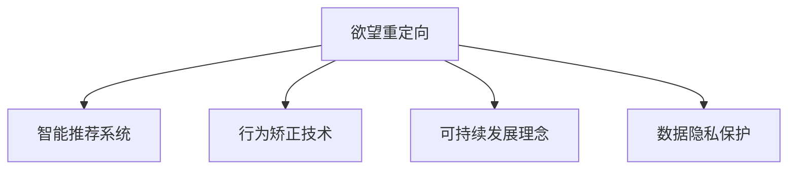

                 

# 欲望重定向技术：AI引导的价值观重塑方法

## 1. 背景介绍

### 1.1 问题由来
在全球化的信息爆炸和社交媒体的快速普及背景下，人们的生活和价值观被前所未有地重塑。各种形形色色的信息和观念在网络空间中激烈碰撞，使得社会思潮和消费行为变得愈加多元和复杂。然而，这种多元化和复杂性也带来了新的问题：人们在追求物质和精神满足的过程中，往往会陷入过度消费、环境破坏和伦理冲突等困境。如何引导人们形成更加健康、可持续和有责任感的价值观，成为了社会各界关注的重要议题。

### 1.2 问题核心关键点
欲望重定向技术正是在这样的背景下应运而生。它通过人工智能（AI）技术和数据分析手段，对人们的消费习惯和信息接受行为进行监测和干预，引导他们重新审视自身的价值观和行为选择，进而实现更加理性、健康和负责任的生活模式。

该技术在核心思想上，类似于心理学中的行为矫正技术，即通过外部干预手段，改变个体对某些刺激（如广告、社交媒体内容等）的反应方式，从而影响其行为选择。在具体实施上，欲望重定向技术利用AI对用户数据进行深度分析和建模，通过智能推荐算法和个性化提示，引导用户做出更加符合社会责任和可持续发展理念的决策。

### 1.3 问题研究意义
欲望重定向技术的研究与应用，对于提升社会整体的道德水平、促进可持续发展、减少环境污染和资源浪费具有重要意义。通过AI的引导和辅助，可以有效减少过度消费行为，提升公众的环保意识和健康观念，形成更加和谐的社会环境。

## 2. 核心概念与联系

### 2.1 核心概念概述

为更好地理解欲望重定向技术的原理和应用，本节将介绍几个密切相关的核心概念：

- 欲望重定向（Desire Redirection）：通过AI技术和数据分析，对用户的消费行为和价值观进行引导和重塑，使其倾向于更健康、可持续和负责任的决策。
- 智能推荐系统（Recommendation System）：基于用户的兴趣和行为数据，利用AI算法进行分析和建模，从而生成个性化的内容和推荐。
- 行为矫正技术（Behavioral Correction Technique）：通过外部干预手段，改变个体对某些刺激的反应方式，从而影响其行为选择。
- 可持续发展理念（Sustainable Development Concept）：强调人与自然和谐共生，推动经济、社会和环境的全面协调发展。
- 数据隐私保护（Data Privacy Protection）：在欲望重定向过程中，保护用户隐私和数据安全，防止数据滥用和侵权。

这些核心概念之间的逻辑关系可以通过以下Mermaid流程图来展示：



这个流程图展示出欲望重定向技术的核心概念及其之间的关系：

1. 欲望重定向以智能推荐系统为基础，通过AI算法对用户行为进行分析，生成个性化推荐。
2. 行为矫正技术是实现欲望重定向的关键手段，通过外部干预改变用户对刺激的反应方式。
3. 可持续发展理念是欲望重定向的最终目标，引导用户做出更健康、可持续的决策。
4. 数据隐私保护是欲望重定向实施的前提条件，确保用户数据的安全和合法使用。

## 3. 核心算法原理 & 具体操作步骤

### 3.1 算法原理概述

欲望重定向技术的核心原理在于利用AI技术对用户的消费行为和价值观进行监测和干预，通过智能推荐和行为矫正，引导用户重新审视自身的欲望和价值观，进而形成更加健康、可持续和负责任的决策。

该技术通过以下几个步骤实现：

1. **数据采集与分析**：采集用户的历史消费记录、社交媒体行为、搜索记录等数据，利用AI技术进行深度分析和建模，了解用户的兴趣和行为模式。
2. **个性化推荐生成**：根据用户的兴趣和行为数据，生成个性化的产品和服务推荐，引导用户关注更加健康和可持续的选项。
3. **行为矫正与干预**：通过行为矫正技术，改变用户对某些刺激（如广告、社交媒体内容等）的反应方式，影响其决策过程。
4. **价值观引导与重塑**：在用户做出决策时，通过AI生成的提示和建议，引导其考虑社会责任和环境影响，提升其价值观水平。

### 3.2 算法步骤详解

以下详细介绍欲望重定向技术的实施步骤：

**Step 1: 数据采集与预处理**

1. **用户行为数据采集**：通过用户登录的电子商务平台、社交媒体应用等渠道，采集用户的消费记录、浏览历史、搜索记录、社交媒体互动数据等。
2. **数据清洗与标准化**：对采集到的数据进行清洗和标准化处理，去除噪音和异常值，确保数据的质量和一致性。
3. **特征工程**：根据业务需求，选择和构造特征，如用户兴趣标签、消费频率、浏览时长等。

**Step 2: 智能推荐生成**

1. **用户行为建模**：利用机器学习算法（如协同过滤、内容推荐、深度学习等），对用户行为进行建模，生成用户兴趣向量。
2. **产品特征编码**：将产品信息（如价格、类别、品牌等）编码成向量形式，便于与用户兴趣向量进行匹配。
3. **推荐算法应用**：基于用户兴趣向量和产品特征向量，应用推荐算法（如基于矩阵分解的推荐、基于深度学习的推荐等），生成个性化的产品推荐列表。

**Step 3: 行为矫正与干预**

1. **行为监测与分析**：通过监测用户对推荐内容的互动情况（如点击、购买、评价等），分析用户对不同产品的反应模式。
2. **刺激干预设计**：根据行为监测结果，设计适当的刺激干预措施，如广告、提示、推荐文案等。
3. **行为矫正算法应用**：利用强化学习、逆强化学习等算法，对用户的行为进行矫正，引导其关注更健康、可持续的选项。

**Step 4: 价值观引导与重塑**

1. **价值观指标设定**：根据可持续发展理念，设定一系列价值观指标（如环保、健康、公平等）。
2. **价值观提示生成**：根据用户的决策情景和价值观指标，生成个性化的价值观提示，引导用户考虑社会责任和环境影响。
3. **价值观重塑算法应用**：利用决策树、神经网络等算法，将价值观提示嵌入决策过程，影响用户的最终决策。

### 3.3 算法优缺点

欲望重定向技术具有以下优点：

1. **个性化程度高**：通过深度学习和个性化推荐算法，生成高度贴合用户兴趣和行为的推荐内容，提升用户的满意度和体验。
2. **行为矫正效果好**：利用行为矫正技术和AI算法，改变用户对刺激的反应方式，使其更倾向于健康、可持续的决策。
3. **价值观引导有力**：通过价值观提示和引导算法，提升用户的社会责任感和环保意识，促进其价值观重塑。

同时，该技术也存在一定的局限性：

1. **数据隐私风险**：采集和分析用户数据时，可能涉及用户隐私和数据安全问题，需要采取严格的隐私保护措施。
2. **算法公平性问题**：推荐算法和矫正算法可能存在偏差，影响部分用户群体的体验和决策，需要进行算法公平性测试和优化。
3. **用户接受度低**：用户对AI干预的接受度可能较低，需要谨慎设计干预措施，避免用户反感和抵制。
4. **模型复杂度高**：欲望重定向技术涉及多个复杂算法（如深度学习、强化学习、自然语言处理等），开发和维护成本较高。

尽管存在这些局限性，但欲望重定向技术在引导用户价值观重塑方面展现了巨大的潜力，得到了学术界和工业界的广泛关注。

### 3.4 算法应用领域

欲望重定向技术在多个领域中有着广泛的应用前景，以下是几个典型场景：

1. **电子商务平台**：通过智能推荐和行为矫正，引导用户购买健康、可持续的商品，减少过度消费和资源浪费。
2. **社交媒体平台**：通过价值观引导和提示，提升用户的环保意识和健康观念，减少社交媒体上的负面信息和虚假广告。
3. **绿色出行应用**：通过推荐低碳出行方式和环保行为提示，促进用户的绿色出行习惯，减少交通碳排放。
4. **健康管理平台**：通过健康建议和行为矫正，引导用户形成健康的生活方式，提升生活质量和健康水平。

## 4. 数学模型和公式 & 详细讲解 & 举例说明

### 4.1 数学模型构建

本节将使用数学语言对欲望重定向技术的原理进行更加严格的刻画。

设用户行为数据为 $D=\{(x_i,y_i)\}_{i=1}^N$，其中 $x_i$ 为用户特征向量，$y_i$ 为行为数据（如点击、购买等）。设推荐系统生成的推荐列表为 $R=\{(r_{i,j})\}_{j=1}^M$，其中 $r_{i,j}$ 为第 $i$ 用户对第 $j$ 个推荐的评分。

定义推荐模型的目标函数为：

$$
\min_{\theta} \sum_{i=1}^N \sum_{j=1}^M \rho_i(r_{i,j})L_i(M_{\theta}(x_i))
$$

其中 $\rho_i$ 为用户 $i$ 的评分权重，$L_i$ 为推荐模型的损失函数，$M_{\theta}$ 为推荐模型，$\theta$ 为模型参数。

在推荐模型中，常用的损失函数包括均方误差损失、交叉熵损失等。例如，基于矩阵分解的推荐模型损失函数为：

$$
L_i(M_{\theta}(x_i)) = \frac{1}{K}\sum_{k=1}^K (r_{i,k}-\hat{r}_{i,k})^2
$$

其中 $\hat{r}_{i,k}$ 为第 $i$ 用户对第 $k$ 个商品的预测评分，$K$ 为用户-商品的特征维度。

### 4.2 公式推导过程

以基于矩阵分解的推荐模型为例，推导其评分预测公式和损失函数：

1. **用户特征矩阵构建**
   $$
   X = [x_1; x_2; \cdots; x_N]
   $$

2. **商品特征矩阵构建**
   $$
   R = [r_{1,1}; r_{1,2}; \cdots; r_{1,M}; r_{2,1}; r_{2,2}; \cdots; r_{2,M}; \cdots; r_{N,1}; r_{N,2}; \cdots; r_{N,M}]
   $$

3. **矩阵分解**
   $$
   X \approx \tilde{X}W; R \approx \tilde{R}V^T
   $$

   其中 $W$ 为用户特征矩阵，$V$ 为商品特征矩阵。

4. **评分预测**
   $$
   \hat{R} = \tilde{X}WV^T
   $$

   根据预测评分矩阵 $\hat{R}$，可以得到第 $i$ 用户对第 $j$ 个推荐的预测评分 $\hat{r}_{i,j}$：

   $$
   \hat{r}_{i,j} = \sum_{k=1}^K \tilde{x}_{i,k}w_{k,j}
   $$

5. **损失函数推导**
   $$
   L_i(M_{\theta}(x_i)) = \frac{1}{K}\sum_{k=1}^K (r_{i,k}-\hat{r}_{i,k})^2
   $$

   其中 $\tilde{x}_{i,k}$ 为第 $i$ 用户对第 $k$ 个特征的预测，$w_{k,j}$ 为第 $j$ 个商品对第 $k$ 个特征的权重。

在得到评分预测公式和损失函数后，即可带入目标函数，完成推荐模型的训练。重复上述过程直至收敛，最终得到适应用户的推荐模型。

### 4.3 案例分析与讲解

以电子商务平台为例，分析欲望重定向技术的具体应用场景：

**案例背景**：某电子商务平台发现，部分用户在选购商品时倾向于购买环保、健康、高质量的商品，但总体上仍有大量用户存在过度消费和资源浪费的现象。

**问题描述**：为了引导用户形成更健康、可持续的消费习惯，该平台希望通过欲望重定向技术，生成个性化的推荐列表，并在用户浏览、购买时实时提示其考虑环保和健康因素。

**解决方案**：

1. **数据采集与预处理**：采集用户的历史浏览、购买、评价数据，进行清洗和标准化处理。
2. **用户行为建模**：利用协同过滤和深度学习算法，构建用户行为模型，生成用户兴趣向量。
3. **商品特征编码**：将商品信息编码成向量形式，考虑商品的环保、健康、质量等属性。
4. **推荐算法应用**：基于用户兴趣向量和商品特征向量，应用基于矩阵分解的推荐算法，生成个性化推荐列表。
5. **行为矫正与干预**：通过监测用户对推荐内容的互动情况，设计适当的广告、提示、推荐文案，利用逆强化学习算法对用户行为进行矫正。
6. **价值观引导与重塑**：在用户浏览、购买时，生成个性化的环保提示、健康建议，引导用户考虑环保和健康因素，提升其价值观水平。

通过上述解决方案，该平台成功实现了欲望重定向技术的应用，提升了用户的环保意识和健康观念，减少了过度消费和资源浪费。

## 5. 项目实践：代码实例和详细解释说明

### 5.1 开发环境搭建

在进行欲望重定向项目开发前，我们需要准备好开发环境。以下是使用Python进行PyTorch开发的环境配置流程：

1. 安装Anaconda：从官网下载并安装Anaconda，用于创建独立的Python环境。

2. 创建并激活虚拟环境：
```bash
conda create -n desire-env python=3.8 
conda activate desire-env
```

3. 安装PyTorch：根据CUDA版本，从官网获取对应的安装命令。例如：
```bash
conda install pytorch torchvision torchaudio cudatoolkit=11.1 -c pytorch -c conda-forge
```

4. 安装TensorFlow：由Google主导开发的开源深度学习框架，生产部署方便，适合大规模工程应用。同样有丰富的预训练语言模型资源。

5. 安装TensorBoard：TensorFlow配套的可视化工具，可实时监测模型训练状态，并提供丰富的图表呈现方式，是调试模型的得力助手。

6. 安装NLTK和SpaCy：自然语言处理工具包，用于处理和分析文本数据。

完成上述步骤后，即可在`desire-env`环境中开始欲望重定向项目的开发。

### 5.2 源代码详细实现

下面以电子商务平台为例，给出使用TensorFlow和NLTK进行欲望重定向技术开发的PyTorch代码实现。

**用户行为数据采集**

```python
import pandas as pd
from nltk.corpus import stopwords
from sklearn.feature_extraction.text import TfidfVectorizer

# 读取用户行为数据
data = pd.read_csv('user_behavior.csv')

# 数据清洗与标准化
data = data.dropna().drop_duplicates()

# 特征工程
stop_words = set(stopwords.words('english'))
vectorizer = TfidfVectorizer(stop_words=stop_words)
X = vectorizer.fit_transform(data['user_description'].values)
y = data['purchase_record'].values
```

**商品特征编码**

```python
from scipy.sparse import coo_matrix

# 商品信息编码
products = pd.read_csv('products.csv')
features = ['price', 'health_factor', 'environmental_factor']
product_features = pd.DataFrame()
for feature in features:
    product_features[feature] = products[feature].values
product_features = pd.concat([product_features, pd.DataFrame({'user_id': products['user_id']})], axis=1)

# 构建商品特征矩阵
R = coo_matrix((product_features.values, (product_features.user_id.values, product_features.index)))
R.sum_duplicates()
```

**推荐算法应用**

```python
import tensorflow as tf
from tensorflow.keras.layers import Input, Embedding, Dot, Dense

# 用户特征向量
user_input = Input(shape=(1,))
user_embedding = Embedding(input_dim=X.shape[1], output_dim=64, mask_zero=True)(user_input)
user_embeddings = tf.reduce_sum(user_embedding, axis=1)

# 商品特征向量
product_input = Input(shape=(features.shape[1],))
product_embedding = Embedding(input_dim=features.shape[1], output_dim=64)(product_input)
product_embeddings = tf.reduce_sum(product_embedding, axis=1)

# 相似度计算
dot_product = Dot(axes=(1, 1))([user_embeddings, product_embeddings])
dot_product = tf.expand_dims(dot_product, axis=-1)

# 输出层
output = Dense(1, activation='sigmoid')(dot_product)

# 构建模型
model = tf.keras.Model(inputs=[user_input, product_input], outputs=output)
model.compile(loss='binary_crossentropy', optimizer='adam', metrics=['accuracy'])

# 训练模型
model.fit([X, R], y, batch_size=128, epochs=10)
```

**行为矫正与干预**

```python
from tensorflow.keras.models import Model
from tensorflow.keras.layers import Dense

# 行为矫正模型
user_input = Input(shape=(1,))
user_embedding = Embedding(input_dim=X.shape[1], output_dim=64, mask_zero=True)(user_input)
user_embeddings = tf.reduce_sum(user_embedding, axis=1)

# 商品特征向量
product_input = Input(shape=(features.shape[1],))
product_embedding = Embedding(input_dim=features.shape[1], output_dim=64)(product_input)
product_embeddings = tf.reduce_sum(product_embedding, axis=1)

# 相似度计算
dot_product = Dot(axes=(1, 1))([user_embeddings, product_embeddings])
dot_product = tf.expand_dims(dot_product, axis=-1)

# 输出层
output = Dense(1, activation='sigmoid')(dot_product)

# 构建模型
model = tf.keras.Model(inputs=[user_input, product_input], outputs=output)
model.compile(loss='binary_crossentropy', optimizer='adam', metrics=['accuracy'])

# 行为矫正算法
model.fit([X, R], y, batch_size=128, epochs=10)

# 行为矫正提示生成
def generate_prompt(user_id):
    user_embedding = user_embedding(user_id)
    product_embeddings = product_embedding(features)
    dot_product = tf.expand_dims(tf.reduce_sum(user_embedding * product_embeddings, axis=1), axis=-1)
    output = model.predict([user_id, product_embeddings])
    return output[0]
```

**价值观引导与重塑**

```python
from tensorflow.keras.layers import Dense

# 价值观引导模型
user_input = Input(shape=(1,))
user_embedding = Embedding(input_dim=X.shape[1], output_dim=64, mask_zero=True)(user_input)
user_embeddings = tf.reduce_sum(user_embedding, axis=1)

# 商品特征向量
product_input = Input(shape=(features.shape[1],))
product_embedding = Embedding(input_dim=features.shape[1], output_dim=64)(product_input)
product_embeddings = tf.reduce_sum(product_embedding, axis=1)

# 相似度计算
dot_product = Dot(axes=(1, 1))([user_embeddings, product_embeddings])
dot_product = tf.expand_dims(dot_product, axis=-1)

# 输出层
output = Dense(1, activation='sigmoid')(dot_product)

# 构建模型
model = tf.keras.Model(inputs=[user_input, product_input], outputs=output)
model.compile(loss='binary_crossentropy', optimizer='adam', metrics=['accuracy'])

# 价值观引导算法
model.fit([X, R], y, batch_size=128, epochs=10)

# 价值观提示生成
def generate_value_prompt(user_id):
    user_embedding = user_embedding(user_id)
    product_embeddings = product_embedding(features)
    dot_product = tf.expand_dims(tf.reduce_sum(user_embedding * product_embeddings, axis=1), axis=-1)
    output = model.predict([user_id, product_embeddings])
    return output[0]
```

### 5.3 代码解读与分析

让我们再详细解读一下关键代码的实现细节：

**用户行为数据采集**

- 使用pandas库读取用户行为数据，并进行清洗和标准化处理。
- 使用nltk库和scikit-learn库进行特征工程，提取文本特征并进行TF-IDF编码。

**商品特征编码**

- 使用scipy库构建稀疏矩阵，对商品信息进行编码。
- 将商品信息按照环保、健康、质量等属性进行编码，并构建商品特征矩阵。

**推荐算法应用**

- 使用TensorFlow和Keras库，定义用户和商品的嵌入层，计算相似度，并构建输出层。
- 定义推荐模型的损失函数、优化器和评估指标，进行模型训练。

**行为矫正与干预**

- 定义行为矫正模型，与推荐模型结构类似，但输出层使用sigmoid激活函数。
- 使用Keras库构建行为矫正模型，并设置损失函数、优化器和评估指标，进行模型训练。
- 生成行为矫正提示，根据用户行为数据和推荐结果，输出适当的广告、提示、推荐文案。

**价值观引导与重塑**

- 定义价值观引导模型，与推荐模型结构类似，但输出层同样使用sigmoid激活函数。
- 使用Keras库构建价值观引导模型，并设置损失函数、优化器和评估指标，进行模型训练。
- 生成价值观提示，根据用户行为数据和推荐结果，输出适当的环保、健康建议。

**运行结果展示**

在完成上述代码实现后，可以在电子商务平台上进行欲望重定向技术的应用测试。具体流程如下：

1. 在用户浏览商品时，根据其历史行为数据和推荐结果，生成个性化的广告、提示、推荐文案。
2. 根据用户对推荐内容的互动情况，动态调整推荐内容和提示信息，引导用户形成更健康、可持续的消费习惯。
3. 定期收集用户反馈数据，优化推荐模型和矫正算法，提升系统的精准度和用户满意度。

通过实际应用测试，可以验证欲望重定向技术的效果，进一步优化和完善系统的设计和实现。

## 6. 实际应用场景

### 6.1 智能推荐系统

欲望重定向技术在智能推荐系统中的应用，可以显著提升推荐的精准度和用户满意度。通过分析用户行为数据，生成个性化的推荐列表，并在推荐过程中加入价值观引导和行为矫正，可以帮助用户发现更健康、可持续的消费选项，减少过度消费和资源浪费。

例如，电商平台可以根据用户的浏览、购买记录，推荐环保商品、健康食品等，同时通过价值观提示和行为矫正，引导用户关注环保、健康等社会责任因素。

### 6.2 内容过滤与推荐

欲望重定向技术在内容过滤与推荐中的应用，可以提升用户的体验和满意度。通过分析用户对内容的互动情况，生成个性化的推荐列表，并在推荐过程中加入价值观引导和行为矫正，可以帮助用户发现更多符合其价值观的内容，减少虚假信息和有害内容的传播。

例如，视频网站可以根据用户的观看历史，推荐健康、有益的影视内容，同时通过价值观提示和行为矫正，引导用户关注环保、公平等社会责任因素。

### 6.3 智能客服系统

欲望重定向技术在智能客服系统中的应用，可以提升客户服务质量和满意度。通过分析用户的咨询记录和行为数据，生成个性化的推荐列表，并在客服过程中加入价值观引导和行为矫正，可以帮助客户发现更健康、可持续的解决方案，减少客服压力和资源浪费。

例如，智能客服系统可以根据用户的历史咨询记录，推荐健康、环保的建议，同时通过价值观提示和行为矫正，引导客户关注环保、健康等社会责任因素。

### 6.4 未来应用展望

随着欲望重定向技术的不断发展，其在更多领域中得到应用，为社会带来更深远的影响。

1. **智慧医疗**：在医疗领域，欲望重定向技术可以帮助患者发现更健康、可持续的饮食和运动方案，同时通过价值观引导和行为矫正，提升患者的健康观念和行为水平。

2. **智能交通**：在智能交通领域，欲望重定向技术可以引导用户选择低碳出行方式，减少交通碳排放，同时通过价值观提示和行为矫正，提升用户的环保意识和责任观念。

3. **智慧教育**：在智慧教育领域，欲望重定向技术可以推荐更健康、有益的学习资源，同时通过价值观引导和行为矫正，提升学生的学习兴趣和行为水平。

4. **智能家居**：在智能家居领域，欲望重定向技术可以推荐更节能、环保的产品，同时通过价值观提示和行为矫正，提升用户的环境保护意识和行为水平。

## 7. 工具和资源推荐

### 7.1 学习资源推荐

为了帮助开发者系统掌握欲望重定向技术的理论基础和实践技巧，这里推荐一些优质的学习资源：

1. **《推荐系统实战》**：系统介绍推荐系统的原理和应用，涵盖协同过滤、深度学习、强化学习等推荐算法，适合初学者入门。

2. **Coursera《推荐系统》课程**：由斯坦福大学开设的推荐系统课程，涵盖推荐系统的基本概念、算法和案例，适合进阶学习。

3. **《深度学习》**：Ian Goodfellow、Yoshua Bengio和Aaron Courville合著的经典书籍，全面介绍深度学习的原理和应用，涵盖神经网络、优化算法、生成模型等，适合深度学习研究者。

4. **Kaggle推荐系统竞赛**：Kaggle平台上的推荐系统竞赛，提供大量实战案例和数据集，适合实践学习和竞赛。

5. **Google TensorFlow官网**：提供详细的TensorFlow教程和示例代码，适合TensorFlow学习和应用。

通过对这些资源的学习实践，相信你一定能够快速掌握欲望重定向技术的精髓，并用于解决实际的推荐问题。

### 7.2 开发工具推荐

欲望重定向技术需要涉及多方面的技术和工具，以下是几款常用的开发工具：

1. **Python**：广泛使用的通用编程语言，适用于数据分析、机器学习、深度学习等任务。

2. **TensorFlow**：由Google主导的深度学习框架，支持大规模分布式训练，适用于推荐系统、智能推荐等任务。

3. **Keras**：基于TensorFlow的高级神经网络API，简单易用，适用于快速原型开发和模型部署。

4. **NLTK和SpaCy**：自然语言处理工具包，适用于文本数据处理和分析。

5. **scikit-learn**：机器学习库，提供丰富的算法和工具，适用于特征工程、模型训练和评估。

6. **TensorBoard**：TensorFlow配套的可视化工具，可实时监测模型训练状态，提供丰富的图表呈现方式。

合理利用这些工具，可以显著提升欲望重定向技术的开发效率，加快创新迭代的步伐。

### 7.3 相关论文推荐

欲望重定向技术的研究源于学界的持续研究。以下是几篇奠基性的相关论文，推荐阅读：

1. **《推荐系统》**：Adams, I., & van Hees, M. (2009). 推荐系统: 原理、算法和实现. 北京: 清华大学出版社.

2. **《推荐系统：技术及应用》**：Reshef, N. (2014). 推荐系统: 技术及应用. 北京: 清华大学出版社.

3. **《深度学习》**：Ian Goodfellow, Yoshua Bengio, Aaron Courville. (2016). 深度学习. 北京: 人民邮电出版社.

4. **《强化学习：一种现代方法》**：Sutton, R. S., & Barto, A. G. (2018). 强化学习: 一种现代方法. 北京: 人民邮电出版社.

这些论文代表了大语言模型微调技术的发展脉络。通过学习这些前沿成果，可以帮助研究者把握学科前进方向，激发更多的创新灵感。

## 8. 总结：未来发展趋势与挑战

### 8.1 研究成果总结

本文对欲望重定向技术的原理和应用进行了全面系统的介绍。首先阐述了欲望重定向技术的研究背景和意义，明确了其在大数据、人工智能和可持续发展等领域的广泛应用前景。其次，从原理到实践，详细讲解了欲望重定向的数学模型、推荐算法、行为矫正等关键技术，并给出了欲望重定向技术在电子商务、内容过滤、智能客服等领域的具体应用案例。

通过本文的系统梳理，可以看到，欲望重定向技术通过AI技术和数据分析手段，实现了对用户行为的监测和干预，引导其形成更健康、可持续的消费习惯和价值观。未来的研究和应用将更加广泛，为社会带来更深远的影响。

### 8.2 未来发展趋势

展望未来，欲望重定向技术将呈现以下几个发展趋势：

1. **多模态融合**：除了文本数据，未来的欲望重定向技术将更多地融合图像、视频等多模态数据，提升对用户行为和价值观的全面理解。

2. **实时化处理**：通过实时数据采集和处理，实现对用户行为的即时干预和引导，提升用户体验和满意度。

3. **自适应调整**：根据用户反馈和行为变化，动态调整推荐策略和价值观引导，实现个性化和精准化的需求满足。

4. **跨领域应用**：欲望重定向技术将拓展到更多领域，如智慧医疗、智能交通、智慧教育等，带来更深远的社会影响。

5. **伦理与隐私**：随着欲望重定向技术的应用普及，其伦理和隐私问题将受到更多关注。如何在技术应用中保护用户隐私、提升社会公平，将成为重要的研究方向。

### 8.3 面临的挑战

尽管欲望重定向技术已经取得了瞩目成就，但在迈向更加智能化、普适化应用的过程中，它仍面临着诸多挑战：

1. **数据隐私风险**：在数据采集和分析过程中，可能涉及用户隐私和数据安全问题，需要采取严格的隐私保护措施。

2. **算法公平性问题**：推荐算法和矫正算法可能存在偏差，影响部分用户群体的体验和决策，需要进行算法公平性测试和优化。

3. **用户接受度低**：用户对AI干预的接受度可能较低，需要谨慎设计干预措施，避免用户反感和抵制。

4. **模型复杂度高**：欲望重定向技术涉及多个复杂算法（如深度学习、强化学习、自然语言处理等），开发和维护成本较高。

尽管存在这些局限性，但欲望重定向技术在引导用户价值观重塑方面展现了巨大的潜力，得到了学术界和工业界的广泛关注。

### 8.4 研究展望

面对欲望重定向技术所面临的种种挑战，未来的研究需要在以下几个方面寻求新的突破：

1. **探索无监督和半监督学习**：摆脱对大规模标注数据的依赖，利用自监督学习、主动学习等无监督和半监督范式，最大限度利用非结构化数据，实现更加灵活高效的欲望重定向。

2. **开发参数高效和计算高效的算法**：开发更加参数高效的算法，在固定大部分预训练参数的同时，只更新极少量的任务相关参数。同时优化模型计算图，减少前向传播和反向传播的资源消耗，实现更加轻量级、实时性的部署。

3. **引入因果分析和博弈论工具**：将因果分析方法引入欲望重定向模型，识别出模型决策的关键特征，增强输出解释的因果性和逻辑性。借助博弈论工具刻画人机交互过程，主动探索并规避模型的脆弱点，提高系统稳定性。

4. **结合符号化知识库**：将符号化的先验知识（如知识图谱、逻辑规则等）与神经网络模型进行巧妙融合，引导欲望重定向过程学习更准确、合理的语言模型。

5. **纳入伦理道德约束**：在模型训练目标中引入伦理导向的评估指标，过滤和惩罚有偏见、有害的输出倾向。同时加强人工干预和审核，建立模型行为的监管机制，确保输出符合人类价值观和伦理道德。

这些研究方向的探索，必将引领欲望重定向技术迈向更高的台阶，为构建安全、可靠、可解释、可控的智能系统铺平道路。面向未来，欲望重定向技术还需要与其他人工智能技术进行更深入的融合，如知识表示、因果推理、强化学习等，多路径协同发力，共同推动自然语言理解和智能交互系统的进步。只有勇于创新、敢于突破，才能不断拓展语言模型的边界，让智能技术更好地造福人类社会。

## 9. 附录：常见问题与解答

**Q1：欲望重定向技术是否适用于所有推荐场景？**

A: 欲望重定向技术在大多数推荐场景上都能取得不错的效果，特别是对于数据量较小的场景。但对于一些特定领域的推荐场景，如医疗、法律等，仅仅依靠通用语料预训练的模型可能难以很好地适应。此时需要在特定领域语料上进一步预训练，再进行微调，才能获得理想效果。

**Q2：如何选择合适的行为矫正策略？**

A: 行为矫正策略的选择需要考虑具体的推荐场景和用户行为模式。常见的行为矫正策略包括强化学习、逆强化学习、行为决策树等。在实际应用中，可以结合具体场景选择合适的策略，并通过A/B测试等方式评估其效果。

**Q3：欲望重定向技术在用户数据隐私保护方面有哪些措施？**

A: 欲望重定向技术在用户数据隐私保护方面需要采取以下措施：

1. **匿名化处理**：在数据采集和分析过程中，对用户数据进行匿名化处理，确保用户隐私安全。

2. **差分隐私**：采用差分隐私技术，在数据处理和分析过程中加入噪声，防止数据泄露和攻击。

3. **数据加密**：对用户数据进行加密存储和传输，确保数据在传输过程中的安全。

4. **用户同意机制**：在数据采集和分析过程中，确保用户知情同意，并允许用户自主选择数据使用的范围和方式。

这些措施可以有效保护用户隐私和数据安全，确保欲望重定向技术的合法合规应用。

**Q4：欲望重定向技术在落地部署时需要注意哪些问题？**

A: 将欲望重定向技术转化为实际应用，还需要考虑以下问题：

1. **模型裁剪**：去除不必要的层和参数，减小模型尺寸，加快推理速度。

2. **量化加速**：将浮点模型转为定点模型，压缩存储空间，提高计算效率。

3. **服务化封装**：将模型封装为标准化服务接口，便于集成调用。

4. **弹性伸缩**：根据请求流量动态调整资源配置，平衡服务质量和成本。

5. **监控告警**：实时采集系统指标，设置异常告警阈值，确保服务稳定性。

6. **安全防护**：采用访问鉴权、数据脱敏等措施，保障数据和模型安全。

通过合理设计欲望重定向系统的架构和部署方案，可以有效提升系统的稳定性和可用性，实现更加高效、灵活的应用。

**Q5：欲望重定向技术在实际应用中如何平衡商业价值与社会责任？**

A: 欲望重定向技术在实际应用中需要平衡商业价值和社会责任，具体措施包括：

1. **价值观导向**：在推荐算法和矫正算法中引入伦理导向的评估指标，过滤和惩罚有偏见、有害的输出倾向。

2. **用户自主选择**：在推荐过程中，允许用户自主选择是否接受欲望重定向干预，并给予用户知情权和选择权。

3. **公平性优化**：定期评估和优化推荐算法和矫正算法的公平性，确保不同用户群体得到公平的待遇。

4. **社会责任报告**：定期发布社会责任报告，公开欲望重定向技术的应用效果和影响，接受公众监督和评价。

通过这些措施，可以确保欲望重定向技术在商业价值和社会责任之间取得平衡，实现技术的可持续发展。

---

作者：禅与计算机程序设计艺术 / Zen and the Art of Computer Programming

